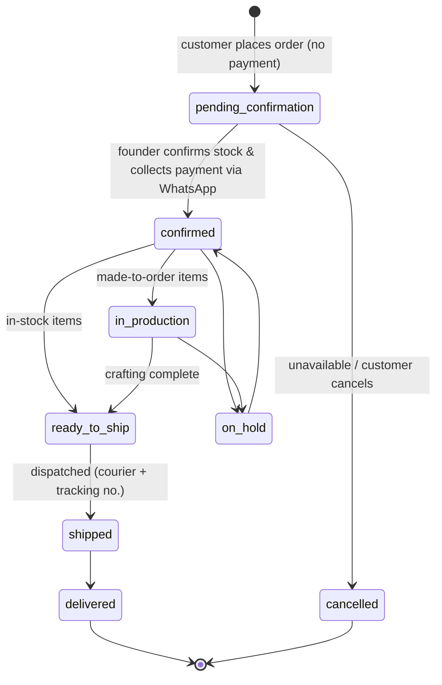

# 00 — Canonical Decisions (CANON)

> **Project:** `vaani-gift-e-commerce` · **Brand:** GooglyWoogly Art · **Founder/CEO:** Vanshika Bhatia · **Base:** Jaipur, Rajasthan, India · **Domain:** googlywoogly.art
>
> **This document is the single source of truth.** Every other specification (`01`–`17`) MUST conform to the names, enums, routes, conventions, and decisions defined here. If a spec needs to deviate, it implements its best decision *and* records the conflict under "Open Questions" in that spec. Detailed field-level expansion of entities lives in `03-data-model-and-entities.md`; this file defines the contract.
>
> **CANON v1.1** — see **§16 (Reconciliations & Addenda)** for post-spec resolutions that supersede any conflicting detail in individual specs, and **`18-decisions-log.md`** for the business decisions still awaiting the founder.

---

## 1. Business context

| | |
|---|---|
| **What** | Handmade gifting & home-décor products, designed and crafted in Jaipur. Each piece is handcrafted; some items are made-to-order. |
| **Who** | Founder-led micro-brand (Vanshika Bhatia, CEO). Lean operation — admin is effectively 1–2 people. |
| **Market** | **India-first** (INR ₹, `en-IN`). International demand handled only via **bulk/WhatsApp enquiry** (V2). |
| **Sales model** | Website is a **catalog + guest checkout that captures intent** — it does **not** take payment. Vanshika confirms availability, then collects payment and coordinates **directly on WhatsApp**. Email carries automated transactional updates. |
| **Channels** | Website (catalog, cart, guest checkout) · WhatsApp (payment + concierge) · Email (transactional, automated). |

## 2. Guiding product principles

1. **SEO-first, world-class storefront.** Server-rendered, fast (Core Web Vitals green), structured-data rich, story-driven (handmade, founder-led, trust).
2. **Frictionless guest purchase.** No login/signup ever for shoppers. Cart lives client-side; checkout captures contact + address only.
3. **Payment happens off-site.** The site records an *intent to order*; money moves on WhatsApp after the founder confirms.
4. **Admin is the founder's command center.** Inventory, orders, content, and analytics — all real-time, all in one place, optimized for one person running the business from a phone or laptop.
5. **Lean now, architected to grow.** No variants, no payment gateway, no customer accounts *yet* — but the data model and architecture must not preclude adding them.

## 3. Scope

**MVP (must ship):** Storefront (landing, bulk-order, PLP, category pages, PDP, search) · local cart · guest checkout → order placement (no payment) · order confirmation + tracking page · WhatsApp handoff · Admin auth · product/inventory/category management · order management + status updates · transactional email · in-house analytics (core funnel) · SEO/ISR/revalidation · static + legal pages · CMS for homepage/banners/testimonials/FAQ/settings.

**V1 (fast-follow):** Collections automation rules · coupons/discounts · reviews (post-order, moderated) · pincode serviceability · SMS (after DLT) · blog/journal · GST invoicing · CSV import/export · advanced analytics (cohorts, geo).

**V2 / later:** International (multi-currency, shipping) · WhatsApp Business API automation · product variants · customer accounts/wishlist · loyalty · on-site payment gateway (Razorpay) · marketplace channels.

**Explicitly out (now):** Product variants/options · on-site payments/transactions · customer login/accounts · multi-currency · returns automation/RMA.

## 4. Tech stack (decided)

| Layer | Choice | Notes |
|---|---|---|
| Framework | **Next.js 16 (App Router) + React 19 + TypeScript** | Existing. RSC by default; remove blanket `"use client"`. |
| Styling/UI | **Tailwind v4 + shadcn/ui (Radix)** + framer-motion | Existing. Keep the pink/playful brand theme; verify WCAG AA contrast. |
| Database | **PostgreSQL** (Neon or Supabase, serverless) | Free tier, Vercel-friendly, region closest to India. |
| ORM | **Prisma** | Migrations + DX. (Drizzle acceptable alt.) |
| Media | **Cloudinary** | Transformations/CDN for product photography. (Vercel Blob / Supabase Storage = alt.) Remove `images.unoptimized`. |
| Admin auth | **Auth.js (NextAuth v5), credentials provider + bcrypt** | Admin only. No shopper auth. |
| Email | **Resend + React Email** (primary); **Gmail SMTP via Nodemailer** (zero-cost fallback) | Needs SPF/DKIM/DMARC on `googlywoogly.art`. |
| SMS | **MSG91 / Fast2SMS** — **V1 only** | India **DLT registration + approved templates mandatory**. Not in MVP. |
| WhatsApp | **Click-to-chat deep links (`wa.me` + prefilled text)** for MVP; **WhatsApp Business API** (Gupshup/Meta) in V2 | |
| Analytics | **In-house** (events table + nightly rollups + dashboards) + Vercel Analytics for CWV | |
| Validation/forms | **Zod + react-hook-form** | Existing. |
| Cart state | **localStorage + lightweight store (zustand or context)** | Client-side; price/stock re-validated on load & at checkout. |
| Search (MVP) | **Postgres full-text / trigram** | Upgrade to Meilisearch/Typesense in V1 if needed. |
| Jobs/cron | **Vercel Cron** | Nightly analytics rollup, sitemap refresh. |
| Hosting | **Vercel** | ISR + on-demand revalidation + edge. |
| Error tracking | **Sentry** | NFR. |

Build hygiene: remove `typescript.ignoreBuildErrors`, enable image optimization, enforce typecheck/lint in CI.

## 5. Canonical entities

Names are authoritative. Full fields/types/indexes → `03-data-model`.

**Catalog**
- **Product** — sellable item. Key: `id, slug, title, subtitle, description(rich), shortDescription, sku, price, compareAtPrice, costPrice(admin), status, inventoryQuantity, inventoryState(derived), madeToOrder, productionLeadTimeDays, lowStockThreshold, allowsPersonalization, personalizationLabel, materials, careInstructions, dimensions, weightGrams, categoryId, tags[], occasions[], isFeatured, isBestseller, metaTitle, metaDescription, ogImageId, primaryImageId, publishedAt, createdAt, updatedAt`. **No variants.**
- **ProductImage** — `id, productId, url, alt, width, height, sortOrder, isPrimary`.
- **Category** — taxonomy ("what it is"). `id, slug, name, description, imageId, parentId?(one level), sortOrder, isActive, metaTitle, metaDescription`.
- **Collection** — merchandising ("occasion/theme/price"). `id, slug, title, description, heroImageId, type(manual|automated), rules(json), sortOrder, isActive, isFeaturedOnHome, metaTitle, metaDescription`.
- **CollectionProduct** — join (manual collections): `collectionId, productId, sortOrder`.
- **MediaAsset** — central library: `id, url, alt, type, width, height, sizeBytes, folder, createdAt`.

**Commerce**
- **Order** — `id, orderNumber, trackingToken, status, paymentStatus, customerName, customerPhone, customerEmail, shippingAddress(json), billingAddress?(json), subtotal, shippingFee, discountTotal, taxTotal, grandTotal, currency, couponCode?, customerNote?, giftMessage?, source, confirmedAt?, createdAt, updatedAt`.
- **OrderItem** — snapshotted line: `id, orderId, productId, productTitle, sku, imageUrl, unitPrice, quantity, lineTotal, personalizationNote?, giftMessage?`.
- **OrderStatusEvent** — timeline: `id, orderId, status, note?, changedByAdminId?, channelNotified(NotificationChannel?), customerNotified(bool), createdAt`.
- **Customer** — *derived CRM record* (no login), keyed by phone/email: `id, name, phone, email, ordersCount, totalRequested, firstOrderAt, lastOrderAt, tags[], notes?`.

**Leads & contact**
- **BulkInquiry** — corporate/bulk lead: `id, name, company?, phone, email, productInterest?, quantity?, occasion?, budget?, deadline?, message, status(InquiryStatus), assignedToAdminId?, internalNotes?, createdAt`.
- **ContactMessage** — `id, name, email, phone?, subject?, message, status, createdAt`.
- **NewsletterSubscriber** — `id, email, source, isActive, subscribedAt`.

**Marketing (V1)**
- **Coupon** — `id, code, type(percentage|fixed|free_shipping), value, minOrderValue?, maxDiscount?, usageLimit?, usedCount, startsAt?, endsAt?, isActive, appliesTo`.
- **Review** — `id, productId, orderId?, customerName, rating, title?, body, status(ReviewStatus), isVerifiedPurchase, imageIds[]?, createdAt, approvedByAdminId?`.

**Content / CMS**
- **HomepageSection** — ordered, toggleable homepage blocks: `id, key, type, payload(json), sortOrder, isActive`.
- **Banner** — `id, type(marquee|hero|promo), text?, imageId?, link?, startsAt?, endsAt?, sortOrder, isActive`.
- **Testimonial** — `id, customerName, location?, rating?, text, imageId?, isApproved, sortOrder, isFeatured`.
- **FaqItem** — `id, question, answer, category?, sortOrder, isPublished`.
- **CmsPage** — editable static/legal page: `id, slug, title, bodyRich, metaTitle, metaDescription, isPublished, updatedAt`.
- **SiteSetting** — singleton key/value: store name, contactEmail, whatsappNumber, socialLinks, shippingDefaults, freeShippingThreshold, gstin?, currency, defaultSeo, logoId, announcementBar, businessAddress.

**Ops & notifications**
- **AdminUser** — `id, name, email, passwordHash, role(AdminRole), isActive, lastLoginAt`.
- **AuditLog** — `id, adminId, action, entityType, entityId, before(json?), after(json?), createdAt`.
- **NotificationLog** — `id, orderId?, channel(NotificationChannel), template, to, subject?, status(NotificationStatus), providerMessageId?, error?, createdAt`.
- **EmailTemplate** — `id, key, subject, htmlBody, variables[]`.

**Analytics**
- **AnalyticsEvent** — `id, visitorId, sessionId, type(AnalyticsEventType), path, referrer?, productId?, value?, metadata(json?), device?, country?, utm(json?), createdAt`.
- **AnalyticsSession** — `id, visitorId, startedAt, lastSeenAt, landingPath, referrer?, utm?, device?, country?, pageviews, isConverted, orderId?`.
- **DailyMetricRollup** — `date, visitors, sessions, pageviews, productViews, addToCarts, beginCheckouts, orders, revenueRequested, conversionRate, topProducts(json), topReferrers(json), topPages(json)`.

## 6. Enums (authoritative)

- **ProductStatus**: `draft | active | archived`
- **InventoryState** (derived for display): `in_stock | low_stock | out_of_stock | made_to_order`
  - `madeToOrder=true` → `made_to_order` (always orderable; show lead time); else `qty<=0` → `out_of_stock`; `qty<=lowStockThreshold` → `low_stock`; else `in_stock`.
- **OrderStatus** (fulfillment, customer-facing): `pending_confirmation | confirmed | in_production | ready_to_ship | shipped | delivered | cancelled | on_hold`
- **PaymentStatus** (offline, admin-managed): `unpaid | awaiting_payment | paid | partially_paid | refunded`
- **InquiryStatus**: `new | contacted | quoted | won | lost | closed`
- **ReviewStatus**: `pending | approved | rejected`
- **AdminRole**: `owner | admin | staff`
- **CollectionType**: `manual | automated`
- **NotificationChannel**: `email | sms | whatsapp | system`
- **NotificationStatus**: `queued | sent | failed | skipped`
- **AnalyticsEventType**: `page_view | product_view | category_view | collection_view | search | filter_apply | add_to_cart | remove_from_cart | update_cart | begin_checkout | place_order | order_confirmed | whatsapp_click | bulk_inquiry_submit | contact_submit | newsletter_signup | outbound_click`

## 7. Order lifecycle (state machine)

`OrderStatus` (fulfillment) and `PaymentStatus` are **independent axes**. A new order is always `pending_confirmation` + `unpaid`.

Every transition writes an **OrderStatusEvent**, may send an automated **email**, and offers the founder a one-click **WhatsApp** message (prefilled). Customer sees the timeline on the tracking page.

## 8. Canonical routes & rendering

Render modes: **RSC-ISR** (static + on-demand revalidate), **SSR** (dynamic, per-request), **CSR** (client). All `/admin/*` is SSR + auth-gated + `noindex`.

| Route | Purpose | Render | Cache tag(s) | Indexed |
|---|---|---|---|---|
| `/` | Landing | RSC-ISR | `home`, `banners`, `settings` | ✅ |
| `/bulk-orders` | Bulk/corporate landing + inquiry form | RSC-ISR + action | `page:bulk-orders` | ✅ |
| `/products` | All-products PLP (filter/sort/paginate via searchParams) | RSC-ISR (faceted SSR for filtered views) | `products` | ✅ (base) |
| `/category/[slug]` | Category PLP, pre-built SEO | RSC-ISR + `generateStaticParams` | `category:{slug}`, `products` | ✅ |
| `/collections/[slug]` | Collection / occasion landing | RSC-ISR + `generateStaticParams` | `collection:{slug}`, `products` | ✅ |
| `/products/[slug]` | Product detail + recommendations | RSC-ISR + `generateStaticParams` + on-demand | `product:{slug}` | ✅ |
| `/search` | Search results | SSR | — | ❌ noindex |
| `/cart` | Cart | CSR | — | ❌ |
| `/checkout` | Guest checkout (contact + address, no payment) | SSR shell + action | — | ❌ |
| `/order/confirmed/[token]` | Post-order confirmation | SSR (token) | — | ❌ |
| `/track/[token]` | Order tracking timeline | SSR (no-cache, token-gated) | — | ❌ noindex |
| `/about`, `/contact`, `/faq` | Content | RSC-ISR | `page:{slug}` | ✅ |
| `/shipping-policy`, `/returns-and-refunds`, `/privacy-policy`, `/terms`, `/care-guide` | Legal/policy | RSC-ISR | `page:{slug}` | ✅ |
| `/sitemap.xml`, `/robots.txt` | SEO infra | generated | — | — |
| `/admin/**` | Admin app | SSR + auth | — | ❌ noindex |

**Admin routes:** `/admin/login`, `/admin` (dashboard), `/admin/products[/new|/[id]/edit]`, `/admin/categories`, `/admin/collections`, `/admin/inventory`, `/admin/orders[/[id]]`, `/admin/bulk-inquiries`, `/admin/messages`, `/admin/customers`, `/admin/reviews`, `/admin/coupons`, `/admin/content`, `/admin/media`, `/admin/analytics`, `/admin/settings`, `/admin/audit-log`.

## 9. Caching & revalidation (real-time storefront updates)

On-demand revalidation is the **primary** mechanism; time-based `revalidate` is a safety net. Admin mutations (Server Actions) call `revalidateTag` / `revalidatePath` so the storefront reflects changes immediately.

| Tag | Revalidated when… |
|---|---|
| `product:{slug}`, `products` | product created/updated/archived; price, inventory, status, or media change |
| `category:{slug}`, `products` | category edited, or a product's category/membership changes |
| `collection:{slug}`, `products` | collection edited, or product membership/automation rules change |
| `home`, `banners` | homepage sections or banners/announcements edited |
| `page:{slug}` | CMS/legal page published |
| `settings`, `nav` | site settings / navigation changed |
| `faq`, `testimonials` | FAQ or testimonials edited |

Safety-net `revalidate`: catalog pages `3600s`; legal/content `86400s`. Tracking/checkout/cart/admin = no cache.

## 10. Naming & conventions

- **Slugs:** lowercase kebab-case, ASCII, unique per entity (`hand-painted-ceramic-mug`). Auto-generated from title, editable, immutable-by-default once published (changing creates a 301 redirect).
- **`orderNumber`:** human-friendly `GW-{YYYY}-{zero-padded-seq}` → `GW-2026-00042`. Shown to customer; used in email/WhatsApp.
- **`trackingToken`:** unguessable 24+ char URL-safe random (nanoid). The only key to `/track/[token]`; never sequential; never indexed.
- **IDs:** cuid/uuid internally; never exposed in storefront URLs (slugs/tokens only).
- **Money:** stored as **integer paise** (or Decimal) — never float. Display `₹` with `en-IN` grouping. `currency = "INR"`.
- **Timestamps:** UTC in DB; display **IST (Asia/Kolkata)**.
- **Env vars:** `DATABASE_URL`, `CLOUDINARY_*`, `AUTH_SECRET`, `RESEND_API_KEY` / `SMTP_*`, `WHATSAPP_NUMBER`, `NEXT_PUBLIC_SITE_URL`, `REVALIDATE_SECRET`, `MSG91_*` (V1).
- **Spec docs:** `NN-kebab-title.md` in `docs/`.

## 11. India & handmade specifics (apply everywhere relevant)

- **Currency/locale:** INR ₹, `en-IN`, IST.
- **GST:** invoicing is **optional/configurable** — off until a `gstin` is set in SiteSetting; when on, show GST breakup on order/invoice.
- **Addresses:** include **pincode** + **state** (dropdown of Indian states/UTs). Pincode **serviceability check** = V1.
- **Shipping:** flat rate + **free over threshold** for MVP; courier + manual tracking number on dispatch.
- **SMS regulation:** sending SMS in India requires **TRAI DLT registration + pre-approved templates** → SMS is **V1**, not MVP.
- **Legal pages required** (good practice + prerequisite for any future payment gateway): Privacy Policy, Terms, Shipping & Delivery, Cancellation & Refund, Contact. Honor **DPDP Act** (consent, minimal PII, retention).
- **Occasions for collections & SEO:** Diwali, Raksha Bandhan, Holi, Karwa Chauth, weddings, anniversary, birthday, housewarming, corporate gifting.
- **Handmade messaging:** "each piece is unique," **made-to-order lead times** shown on PDP & order, **care instructions**, optional **personalization** + **gift message**.

## 12. Analytics KPIs (in-house)

Visitors · sessions · pageviews · top pages/products/categories · referrers/UTM/source · device split · **funnel**: `page_view → product_view → add_to_cart → begin_checkout → place_order` with step conversion rates · **orders & revenue-requested** (note: "requested," since payment is offline) · AOV · WhatsApp-click rate · bulk-inquiry rate · search terms · low-stock & pending-order operational alerts.

## 13. Specification index

| Doc | Title | Owner-perspective |
|---|---|---|
| `00` | Canonical Decisions (this) | Product owner |
| `01` | Product Vision & PRD | Product |
| `02` | System Architecture & Tech Stack | Architect |
| `03` | Data Model & Entities | Architect |
| `04` | Information Architecture & Routing | Product/Architect |
| `05` | Storefront: Landing & Bulk-Order | Product/Design |
| `06` | Catalog: PLP, Category & Search | Product/Design |
| `07` | Product Detail Page & Recommendations | Product/Design |
| `08` | Cart, Checkout & Order Placement | Product |
| `09` | SEO, Rendering, ISR & Revalidation | Architect/SEO |
| `10` | Admin Foundation: Auth & Dashboard | Product/Architect |
| `11` | Product, Inventory & Catalog Management | Product |
| `12` | Order Management & Fulfillment | Product/Ops |
| `13` | In-house Analytics & Reporting | Product/Data |
| `14` | Notifications: Email, SMS & WhatsApp | Product/Architect |
| `15` | Content Management & Static/Legal Pages | Product/Content |
| `16` | Non-Functional Requirements | Architect |
| `17` | Roadmap & Delivery Plan | Delivery lead |

## 14. Glossary

- **PLP** — Product List Page. **PDP** — Product Detail Page.
- **Made-to-order** — crafted after the order; shows a production lead time; always orderable.
- **Revenue-requested** — monetary value of placed orders; *not* collected revenue (payment is offline via WhatsApp).
- **Collection vs Category** — Category = taxonomy (what it is); Collection = merchandising grouping (occasion/theme/price).
- **Tracking token** — opaque, unguessable key granting access to a single order's tracking page.
- **DLT** — India's TRAI Distributed Ledger Technology registration required to send commercial SMS.

## 15. Key decisions & assumptions (founder to confirm/override)

1. Stack per §4 (Postgres + Prisma + Cloudinary + Auth.js + Resend + Vercel). ✅ assumed.
2. Guest-only; no on-site payment; offline payment via WhatsApp; `paymentStatus` tracked separately. ✅ per brief.
3. No product variants; single-listing model + optional personalization/gift message. ✅ per brief.
4. India-first, INR; international via bulk/WhatsApp only (V2). ⚠️ assumption.
5. GST invoicing built optional, off by default until GSTIN provided. ⚠️ assumption.
6. SMS deferred to V1 (DLT); MVP = email + WhatsApp. ⚠️ recommendation.
7. Reviews, coupons, pincode-serviceability, blog → V1, not MVP. ⚠️ recommendation.
8. One primary admin (Vanshika, `owner`) + optional `staff`; roles kept minimal. ⚠️ assumption.

---

## 16 — Reconciliations & Addenda (CANON v1.1)

> Added after the full suite (`01`–`17`) was written, to **(a)** absorb mechanism-level entities/fields/enums/routes the specs require but §5–§10 had not yet named, and **(b)** record the authoritative resolution of every cross-spec inconsistency the authors surfaced. **These supersede any conflicting detail in individual specs.** Genuine business decisions still open are tracked in `18-decisions-log.md`.

### 16.1 Resolved cross-spec inconsistencies (authoritative)

| # | Topic | Resolution |
|---|---|---|
| R-1 | Analytics ingest route | Canonical endpoint is **`/api/track-event`** (per `13`). `02`'s `/api/analytics/collect` is superseded. |
| R-2 | `order_confirmed` event timing | Emitted **server-side once, when the founder confirms the order** (the real business event). The buyer confirmation page does **not** emit it; `08`'s page-mount hint superseded. |
| R-3 | Analytics retention (DPDP) | **18 months** for raw `AnalyticsEvent` rows; **indefinite** for aggregated `DailyMetricRollup`. (Reconciles 03's 18–24mo, 13's 180d, 16's 18mo.) Order PII is retained per Indian tax/legal record-keeping (~8 yrs) and is **not** subject to the analytics window. |
| R-4 | Free-shipping threshold field | Canonical = **`SiteSetting.shippingDefaults.freeShippingThresholdPaise`**. The top-level `SiteSetting.freeShippingThreshold` is removed. |
| R-5 | Gift message placement | **`Order.giftMessage` is primary** (one note per order). `OrderItem.giftMessage` is optional, for per-item / multi-recipient cases. Both retained. |
| R-6 | Customer identity | **`Customer.phone` is the unique identity** (normalized: digits only, with `91` country code). `email` is non-unique. |
| R-7 | Pagination indexing | `?page=N` (N>1) is **indexable, self-canonical, with `rel=prev/next`**. |
| R-8 | Sold one-of-a-kind PDP | Product stays **live as `out_of_stock` (status `active`)** with "Enquire on WhatsApp / Notify me" CTAs — **not** auto-archived (preserves SEO equity + desire). |
| R-9 | Stock decrement on order | `placeOrder` **validates** stock but does **not** auto-decrement; stock is admin-managed and admin stock edits bust cache tags, keeping the storefront accurate. Soft-reservation deferred to V1. |
| R-10 | DB host | **Neon** (serverless Postgres). Media on Cloudinary; Supabase Storage not needed. |
| R-11 | `conversionRate` storage | Integer **basis points** (no float). |
| R-12 | Category required to publish | A Product **must have `categoryId` to reach `status=active`** (nullable allowed only for `draft`). |

### 16.2 Entities absorbed (extend §5; full detail in `03`)
- **Redirect** — `id, fromPath(unique), toPath, type(301|302), createdAt`. Powers the slug-change 301 mandate (§10).
- **Counter** — sequence store for `orderNumber` (`key, value`).
- **PasswordResetToken** — `id, adminUserId, tokenHash, expiresAt, usedAt?`. Plus on **AdminUser**: `failedLoginCount, lockedUntil`.
- **ProductAffinity** *(V1)* — `productId, relatedProductId, score` for co-occurrence recommendations. MVP uses heuristic recos (no table).

### 16.3 Fields absorbed (extend §5; full detail in `03`)
- **Order**: `clientRequestId` (unique — idempotent placement), `courierName`, `trackingNumber`, `trackingUrl`, `amountPaid`, `internalNotes`, `invoiceNumber`.
- **OrderItem**: `madeToOrderSnapshot`, `productionLeadTimeDaysSnapshot` (populated by `placeOrder`).
- **CmsPage**: `lastReviewedAt`.

### 16.4 Enum names finalized (extend §6)
`CouponType` (percentage|fixed|free_shipping) · `BannerType` (marquee|hero|promo) · `MediaType` (image|video) · `ContactStatus` (new|read|responded|closed) · `OrderSource` (web|whatsapp|manual) · `SubscriberSource` (footer|popup|checkout|pdp) · `HomepageSectionType` (closed renderer set, engineer-extended) · `DeviceType` (mobile|tablet|desktop) · `EmailTemplateKey` (closed set: `order_received_customer`, `order_received_admin`, `order_confirmed_customer`, `order_in_production_customer`, `order_shipped_customer`, `order_delivered_customer`, `review_request_customer` (V1), `bulk_inquiry_ack`, `contact_ack`).

### 16.5 Routes & env absorbed (extend §8 / §10)
- Routes: **`/api/track-event`** (analytics ingest), **`/api/revalidate`** (secret-guarded on-demand ISR), **`/api/og/[type]`** (dynamic OG), **`/api/health`**.
- Env: `TURNSTILE_SECRET_KEY`, `NEXT_PUBLIC_TURNSTILE_SITE_KEY`, `ADMIN_BOOTSTRAP_EMAIL`, `ADMIN_BOOTSTRAP_PASSWORD`.

### 16.6 Operating defaults set (changeable later; confirm in `18`)
- WhatsApp first-response internal target: **< 6 business hours** (drives trust/close-rate; not a hard SLA).
- Newsletter: **single opt-in** with explicit consent (MVP); double opt-in V1.
- Bot protection: honeypot + **Turnstile on contact & bulk-inquiry** forms (MVP); checkout uses honeypot + rate-limit only (protect conversion).
- Rate-limit store: in-memory/edge (MVP) → Upstash/Vercel KV (V1).
- Pre-render cap: top **300** active products at build; remainder ISR-on-demand.
- Admin owner **TOTP 2FA**: recommended for MVP (admin is the only auth surface) — pending founder confirmation.

### 16.7 Founder decisions resolved (2026-06-13)
- **Homepage hero — REPLACE.** Drop the three.js 3D hero for a **lightweight image/video hero with subtle motion**. Remove `three`, `@react-three/fiber`, `@react-three/drei`, and the stray `expo*` / `react-native` packages from the v0 scaffold (bundle, CWV, cost). Updates `02`, `05`, `09`, `16`.
- **Returns policy — RETURN WINDOW ON READY-MADE ONLY.** Ready-made (non-personalized, non-made-to-order) items are returnable within a **default 7-day window**, unused and in original condition; **personalized and made-to-order items are final sale**; **damaged/defective** items are always replaced regardless. Founder ratifies the day-count + final legal wording (see `18` §4). Updates `07`, `08`, `12`, `15`.
- **Launch gate — CORE MVP FIRST.** Coupons, GST invoicing, reviews, and SMS remain V1. Confirms roadmap `17` as written.

### 16.8 Cost posture — zero-cost MVP (2026-06-13)

**Hard constraint: the MVP runs entirely on free tiers — no paid services.** This is already enabled by the deferred-by-design expensive pieces (no payment gateway, SMS = V1, WhatsApp API = V2). Per-service mapping:

| Service | Free covers MVP? | Note |
|---|---|---|
| Neon (Postgres) | ✅ | Autosuspend; ~0.5 GB — ample for launch. |
| Prisma | ✅ | OSS, self-hosted (no paid Accelerate). |
| Cloudinary (media) | ✅ | ~25 credits/mo. Alt if tight: Cloudflare **R2** (10 GB, no egress fees) / ImageKit. |
| Auth.js (admin) | ✅ | OSS, self-hosted credentials — no Clerk/Auth0. |
| Email | ✅ | Resend free **3,000/mo (100/day)** — needs the domain verified; or **Gmail SMTP** via Nodemailer ($0, uses existing Gmail, lower limits/deliverability). |
| In-house analytics | ✅ | Writes to our own Postgres — no GA/paid analytics. |
| Cron (nightly rollup) | ✅ | Vercel Cron (daily) — if its free granularity is too tight, **GitHub Actions** schedule or cron-job.org hitting `/api/*`. |
| Sentry (errors) | ✅ | Free ~5k errors/mo (optional). |
| Turnstile (bot) | ✅ | Free. |
| Rate-limit / KV | ✅ | In-memory for MVP; Upstash free tier if durable KV needed (V1). |
| Search | ✅ | Postgres `pg_trgm` — no Algolia/Meilisearch Cloud. |
| **Vercel hosting** | ⚠️ | Hobby is **$0 but "non-commercial" per Vercel ToS**; functionally fine at low traffic. For strict-commercial-$0 use **Cloudflare Pages**; otherwise budget Vercel **Pro (~$20/mo)** only once real sales traffic arrives. |

**Not infra, but a real cost:** the domain `googlywoogly.art` (~small annual registration; required for branded email + SEO — assumed already owned). Money is spent **only** when scaling past free ceilings or enabling V1+ features (SMS, payment gateway, WhatsApp API). Any new dependency added during the build **must** have a viable free tier or be rejected.
