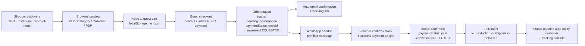
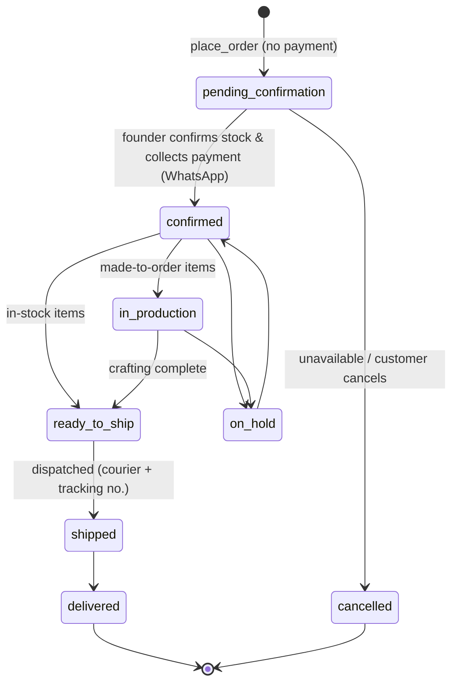
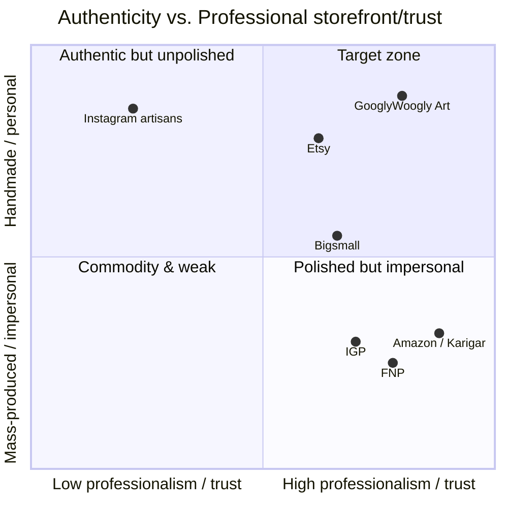
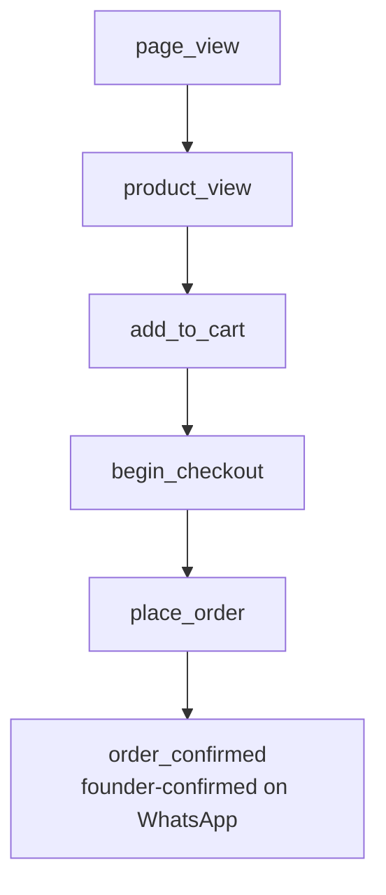
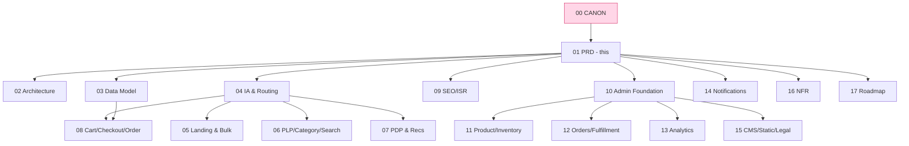

# 01 — Product Vision & PRD

> **Project:** `vaani-gift-e-commerce` · **Brand:** GooglyWoogly Art · **Founder/CEO:** Vanshika Bhatia · **Base:** Jaipur, Rajasthan, India · **Domain:** `googlywoogly.art`
>
> **Document type:** North-star vision + Product Requirements Document. This is the *why* and *what* that every downstream spec (`02`–`17`) serves. It conforms to and never contradicts `00-canonical-decisions.md` (**CANON**). Where this PRD makes a call beyond CANON or the founder's notes, the assumption is stated inline and, where it is a genuine decision the founder should ratify, recorded under **§13 Open Questions**.
>
> **Audience:** the founder (strategy), and the implementing engineer/designer (who will read `04`–`16` for build detail, and this for intent, priorities, and acceptance bar).

---

## 1. Purpose & Scope

### 1.1 What this document covers

This PRD establishes the **product north star** for GooglyWoogly Art's e-commerce platform:

1. **Vision & mission** — the long-term reason the product exists.
2. **Target personas** — occasion gift-buyers, home-décor shoppers, corporate/bulk buyers — with goals and pains.
3. **Jobs-to-be-done (JTBD)** — the progress each persona is "hiring" the product to make.
4. **Value proposition & positioning** — handmade, founder-led, Jaipur-made; why us over the alternatives.
5. **Business model** — catalog → WhatsApp-confirmed offline payment; the "revenue-requested vs collected" distinction.
6. **Competitive landscape** — Etsy, IGP, Ferns N Petals, Bigsmall, Amazon Karigar, local Instagram artisans — and our differentiation.
7. **Success metrics & KPI targets** — the numbers that define "working."
8. **Scope** — MVP / V1 / V2 and explicit non-goals.
9. **Risks & mitigations**, **guiding principles**, **acceptance criteria**, and **phasing**.

### 1.2 What this document explicitly does NOT cover

This is a **strategy and requirements** document, not an implementation spec. It does **not** define:

- Field-level data types, indexes, or migrations → `03-data-model-and-entities.md`.
- Concrete page layouts, component trees, or pixel/grid specs → `04`–`08`, `10`–`15` (this PRD gives **directional** UX intent only).
- API/Server-Action signatures, Zod schemas, exact cache-tag wiring → each module spec + `09`.
- System architecture, hosting, runtime → `02`. NFR budgets → `16`. Delivery sequencing detail → `17`.
- Pricing of individual SKUs, the live product catalog, or brand visual identity beyond CANON's "pink/playful" theme.

> **Boundary rule:** if a number, name, enum, route, or convention appears in CANON, this PRD restates it but **never redefines** it. Examples used below (e.g. `place_order`, `pending_confirmation`, `GW-2026-00042`) are CANON values.

### 1.3 Relationship to CANON

| CANON section | How this PRD uses it |
|---|---|
| §1 Business context | Source for §3 (vision) and §6 (business model). |
| §2 Guiding principles | Restated and expanded in §11. |
| §3 Scope | Authoritative for §9 / §14 phasing — **not re-litigated** here. |
| §5 Entities, §6 Enums | Referenced verbatim in §10 (FRs) and the entity/event tables. |
| §7 Order lifecycle | The state machine this PRD's order JTBD targets. |
| §8 Routes, §9 Caching | The surfaces FRs map onto; detailed per-route work lives in module specs. |
| §11 India/handmade | Drives positioning, occasions, compliance requirements. |
| §12 Analytics KPIs | Basis for §8 success metrics. |

---

## 2. Product summary (the one-paragraph version)

> GooglyWoogly Art is a **server-rendered, SEO-first storefront** for a Jaipur-based, founder-led handmade gifting & home-décor micro-brand. Shoppers browse a story-rich catalog, build a **guest cart** (no login, ever), and place an order that **captures intent without taking payment**. The founder, Vanshika, then **confirms stock and collects payment over WhatsApp**, fulfilling each (often made-to-order) piece by hand. A phone-friendly **admin command center** runs inventory, orders, content, and in-house analytics. The product wins by pairing **artisan authenticity and a personal founder relationship** with **professional, fast, trustworthy e-commerce mechanics** that small Instagram artisans lack and large marketplaces flatten.

---

## 3. Vision & Mission

### 3.1 Vision (3–5 year north star)

> **To become India's most-loved destination for *meaningful*, handmade gifts — where every purchase feels like commissioning a small piece of art from someone who cares, not transacting with a faceless warehouse.**

We are betting that as Indian gifting matures past mass-produced hampers, a generation of buyers will pay a premium for **provenance, personalization, and a human on the other end**. GooglyWoogly Art is the storefront for that buyer.

### 3.2 Mission (what we do every day)

> **Give one Jaipur artisan the digital storefront, operational tooling, and trust signals of a serious brand — without forcing her to become a warehouse, a call center, or a payments company.**

Concretely, the product must let a single founder, largely from her phone:

- present handmade work **beautifully and findably** (SEO + story),
- capture purchase intent with **zero friction** for the shopper,
- **confirm, price, and close** each order personally on WhatsApp,
- and **run the whole business** — stock, orders, content, numbers — from one admin.

### 3.3 Strategic anchors

1. **Authenticity is the moat.** Founder-led, handmade, Jaipur-made, each-piece-unique. We never sand this off to look like a generic marketplace.
2. **Trust is the conversion lever.** Because payment happens off-site on WhatsApp, the *storefront's* job is to earn enough trust that a stranger will click "place order" and then talk to a human. Every trust signal (reviews, story, policies, professional polish, fast site) compounds.
3. **Leverage, not headcount.** The platform is the founder's force-multiplier. Automation (transactional email, prefilled WhatsApp, analytics rollups, one-click status changes) substitutes for staff.
4. **Architected to grow, lean to ship.** No variants, no gateway, no accounts *now* — but nothing we build forecloses them (CANON §2.5).

---

## 4. Target Personas

Five personas, three "core buyer" archetypes (the founder's named focus) plus two operational/secondary. Persona priority drives MVP UX trade-offs.

### 4.1 Persona overview

| # | Persona | Archetype | Priority | Primary surface | Why they matter |
|---|---|---|---|---|---|
| P1 | **Aarohi — the Occasion Gift-Buyer** | Core buyer | **P0** | PLP → PDP → checkout → WhatsApp | The volume engine; recurring, deadline-driven, high intent. |
| P2 | **Meera — the Home-Décor Shopper** | Core buyer | **P0** | Category/collection → PDP | Higher AOV, aesthetic-led, repeat/self-purchase. |
| P3 | **Rohan — the Corporate / Bulk Buyer** | Core buyer | **P1** | `/bulk-orders` inquiry | Largest order value; relationship sale, not self-serve. |
| P4 | **Vanshika — the Founder / Admin** | Operator | **P0** | `/admin/**` | The product *is* her business operating system. |
| P5 | **Ishaan — the Social-Discovery Browser** | Secondary | **P1** | Landing / Instagram referral | Top of funnel from Instagram (`@googlywoogly_arrtt`); not yet ready to buy. |

> **Note on P4:** Vanshika is a *user* of this product, not only its owner. Her admin experience is a first-class persona because single-founder operability (CANON §2.4) is a product requirement, not an afterthought. Full admin UX → `10`–`13`, `15`.

### 4.2 P1 — Aarohi, the Occasion Gift-Buyer (P0)

| | |
|---|---|
| **Snapshot** | 24–38, urban India (metro/tier-1/2), shops on a phone, active on Instagram/WhatsApp. Buying a gift for someone else against a date. |
| **Context / trigger** | A birthday, anniversary, Rakhi, Diwali, Karwa Chauth, housewarming, or "just because." Often remembers late; **deadline anxiety** is real. |
| **Goals** | Find a gift that looks *thoughtful and not generic*; personalize it (name/message); be sure it will **arrive in time**; not overpay; look good to the recipient. |
| **Pains** | Generic/mass-produced options feel lazy; unclear delivery timelines; fear that "handmade Instagram seller" = unreliable; checkout friction; no idea if an item is actually in stock. |
| **What converts her** | Clear **occasion navigation**, honest **made-to-order lead times** and stock status, **personalization + gift message**, visible **trust** (reviews, policies, real founder), a **fast** mobile site, and an easy "place order then chat" flow. |
| **What loses her** | Slow/janky mobile pages; "is this even real?"; no delivery clarity; forced signup; dead Instagram links. |
| **Success for her** | She places an order in <3 minutes, gets an instant confirmation + tracking link, and Vanshika confirms on WhatsApp within hours. |

### 4.3 P2 — Meera, the Home-Décor Shopper (P0)

| | |
|---|---|
| **Snapshot** | 28–45, design-conscious, sets up/refreshes a home, follows décor aesthetics. Often buying **for herself**. |
| **Context / trigger** | New home, festive refresh, gifting *to a home* (housewarming), or aesthetic impulse from a photo. |
| **Goals** | Find pieces that match her aesthetic; understand **materials, dimensions, care**; trust quality; build a small set (cart of 2–3). |
| **Pains** | Can't tell scale/size from photos; unsure of material quality; worried handmade = fragile or inconsistent; wants curation, not a flea-market grid. |
| **What converts her** | Rich PDP (materials, **dimensions**, **care instructions**, multiple images, "each piece is unique"), **curated collections**, aesthetic photography, social proof. |
| **What loses her** | Thin product info; one bad photo; no size reference; no story. |
| **Success for her** | She trusts the quality enough to buy for her own home, and comes back for the next room/season. |

### 4.4 P3 — Rohan, the Corporate / Bulk Buyer (P1)

| | |
|---|---|
| **Snapshot** | HR / admin / founder's-EA / event planner at an SME or startup; or someone organizing a wedding's return-gifts. Buys **in quantity**. |
| **Context / trigger** | Diwali employee/client gifting, onboarding kits, conference swag, wedding favors, milestone gifts. Has a **budget, quantity, and a hard deadline**. |
| **Goals** | Get **many** units, optionally **branded/personalized**, within budget and on time; one accountable point of contact; an invoice (GST when applicable). |
| **Pains** | Per-unit retail checkout doesn't fit; needs a quote; needs assurance of capacity/lead time; needs **GST invoice** (org procurement); fears a hobbyist can't deliver at volume. |
| **What converts him** | A dedicated **`/bulk-orders`** landing that says "we do this," a low-friction **inquiry form** (quantity, occasion, budget, deadline), fast human follow-up, and clear lead-time honesty. |
| **What loses him** | No bulk path (forced to DIY a 200-unit cart); slow/no response; no GST story. |
| **Success for him** | He submits one inquiry and gets a personal quote + plan from Vanshika; the relationship continues annually. |

> Bulk does **not** flow through cart/checkout. It is a **lead-capture** flow (`BulkInquiry`) that hands off to the founder. Catalog cart is for retail quantities. Full spec → `05`.

### 4.5 P4 — Vanshika, the Founder / Admin (P0, operator)

| | |
|---|---|
| **Snapshot** | The CEO and the entire operations team. Runs the business between crafting, often **from a phone**, with limited time. |
| **Goals** | See new orders instantly; confirm/decline against real stock; **collect payment on WhatsApp** with minimal typing; update fulfillment status; keep stock accurate; refresh the storefront herself; know what's working. |
| **Pains** | Context-switching across DMs/spreadsheets; missing an order; overselling a one-of-a-kind item; re-typing the same WhatsApp messages; not knowing her numbers. |
| **What makes her productive** | A real-time **dashboard**; **one-click status changes** that auto-email the customer and **prefill a WhatsApp message**; live **inventory** with low-stock alerts; **self-serve CMS** for homepage/banners/FAQ; **in-house analytics**; mobile-first admin. |
| **What fails her** | Anything that needs an engineer to change; clunky desktop-only admin; manual customer comms; stale stock. |
| **Success for her** | She runs the entire business from her phone, never misses or oversells an order, and closes payment on WhatsApp in two taps. |

### 4.6 P5 — Ishaan, the Social-Discovery Browser (P1, secondary)

| | |
|---|---|
| **Snapshot** | Arrives from Instagram (`@googlywoogly_arrtt`), a friend's share, or search. **Not yet** shopping — browsing/vibing. |
| **Goals** | Understand "what is this brand?"; enjoy the story/aesthetic; maybe save/follow; possibly find a gift later. |
| **Pains** | Landing that's all hard-sell; slow load; no story; no reason to come back. |
| **What converts him (later)** | A beautiful, fast **landing** with story (handmade, founder, Jaipur), social proof, newsletter capture, and easy paths into the catalog and back to Instagram. |
| **Success for him** | He follows/subscribes and returns when he has an occasion — becoming an Aarohi or Meera. |

### 4.7 Anti-personas (explicitly NOT served now)

- **The bargain/dropship hunter** — wants cheapest mass-produced goods; not our buyer.
- **The international shopper** — served **only** via bulk/WhatsApp enquiry until V2 (CANON §1, §3).
- **The account-wanting power shopper** — wishlists/saved carts/login are **V2** (CANON §3). We deliberately do not build for them in MVP.
- **The instant-card-payment shopper** — on-site payment is out (CANON §3); we set expectations that purchase completes on WhatsApp.

---

## 5. Jobs-To-Be-Done

JTBD framing: *When [situation], I want to [motivation], so I can [expected outcome].* These are the canonical "jobs" the product is hired for; user stories in §9 operationalize them.

### 5.1 Buyer-side JTBD

| ID | Persona | Job statement |
|---|---|---|
| **JTBD-1** | P1 | *When* a gift-giving occasion is approaching, *I want to* quickly find a unique handmade gift that fits the person and occasion, *so I can* give something thoughtful without stress. |
| **JTBD-2** | P1 | *When* I've found a gift, *I want to* personalize it and add a gift message, *so I can* make it feel made-for-them. |
| **JTBD-3** | P1 | *When* I'm about to order, *I want to* know it's in stock (or its made-to-order lead time) and that it'll arrive by my date, *so I can* commit with confidence. |
| **JTBD-4** | P1/P2 | *When* I decide to buy, *I want to* place the order in minutes without creating an account, *so I can* finish quickly on my phone. |
| **JTBD-5** | P1/P2 | *When* I've placed an order, *I want to* get an immediate confirmation and a way to track it, *so I can* feel assured and follow progress. |
| **JTBD-6** | P2 | *When* I'm furnishing/refreshing my home, *I want to* browse curated décor with real materials, dimensions, and care info, *so I can* trust the quality and fit before buying. |
| **JTBD-7** | P3 | *When* I need many gifts for an event/company, *I want to* describe my needs (quantity, budget, deadline, branding) and get a personal quote, *so I can* execute a bulk gifting program reliably. |
| **JTBD-8** | P5 | *When* I discover the brand on Instagram, *I want to* understand its story and see proof it's legit, *so I can* decide to follow and come back when I need a gift. |
| **JTBD-9** | P1/P2 | *When* something is sold out or made-to-order, *I want to* still understand my options (lead time, or notify/contact), *so I can* decide rather than bounce. |

### 5.2 Operator-side JTBD

| ID | Persona | Job statement |
|---|---|---|
| **JTBD-10** | P4 | *When* a new order arrives, *I want to* be alerted and see it instantly, *so I can* respond before the buyer cools off. |
| **JTBD-11** | P4 | *When* I review an order, *I want to* confirm against real stock and collect payment on WhatsApp with a prefilled message, *so I can* close the sale in seconds. |
| **JTBD-12** | P4 | *When* an order progresses (confirmed → in production → shipped → delivered), *I want to* update status once and have the customer notified automatically, *so I can* keep buyers informed without manual messages. |
| **JTBD-13** | P4 | *When* I craft or restock, *I want to* keep inventory accurate and be warned about low/one-of-a-kind stock, *so I can* never oversell. |
| **JTBD-14** | P4 | *When* the storefront needs updating (banner, homepage, FAQ, policy), *I want to* edit it myself and see it live immediately, *so I can* run marketing without an engineer. |
| **JTBD-15** | P4 | *When* I want to grow, *I want to* see my funnel, top products, traffic sources, and revenue-requested, *so I can* decide what to make and promote. |

---

## 6. Business Model

### 6.1 The model in one diagram

### 6.2 How money actually moves (the defining mechanic)

The website is a **catalog + intent-capture**, not a checkout-and-pay system (CANON §1, §2.3).

1. The shopper places an order. **No card, no UPI, no gateway** on-site. The site records an **intent to order**.
2. The order is created as `pending_confirmation` (fulfillment) + `unpaid` (payment) — the two **independent axes** of CANON §7.
3. An **automated email** confirms receipt and includes the **tracking link** (`/track/{trackingToken}`).
4. The founder is handed a **prefilled WhatsApp message** to reach the customer (CANON §8 `whatsapp_click`). She **verifies stock**, finalizes price (incl. shipping, any agreed personalization), and **collects payment directly on WhatsApp** (UPI/bank/other — entirely off-platform).
5. The founder then advances `status` and `paymentStatus` in admin; each transition writes an `OrderStatusEvent`, may auto-email, and offers another prefilled WhatsApp message.

> **Why this model:** it removes the cost, compliance, and operational burden of a payment gateway for a pre-scale micro-brand, while preserving the founder's high-touch, relationship-driven selling style — and keeps a clean upgrade path to **Razorpay on-site payment in V2** (CANON §3) without changing the data model (`paymentStatus` already exists).

### 6.3 Revenue-requested vs revenue-collected (a first-class concept)

Because payment is off-site, the platform can measure **demand** but not **cash** with certainty. CANON §14 defines this explicitly and it pervades analytics and admin.

| Term | Definition | Source of truth | Where it shows |
|---|---|---|---|
| **Revenue-requested** | Sum of `Order.grandTotal` for placed orders (any non-cancelled status). Demand signal. | `Order` on `place_order`. | Analytics dashboards, `DailyMetricRollup.revenueRequested`, founder reports. |
| **Revenue-collected** | Value of orders actually paid — `paymentStatus ∈ {paid, partially_paid}`. Cash signal. | Founder marks `paymentStatus` in admin after WhatsApp settlement. | Admin order views; (advanced collected-revenue reporting = V1, CANON §3). |

> **Decision (assumption):** All storefront-facing and headline analytics use **revenue-requested** and must **label it as such** ("requested," never bare "revenue") to avoid implying collected cash (CANON §12). Collected-revenue reconciliation reporting is V1. — Ratify in §13.

### 6.4 Order & payment lifecycle (CANON §7, restated)

`status` (fulfillment, customer-facing) and `paymentStatus` (offline, admin-managed) move **independently**.

`PaymentStatus` axis: `unpaid → awaiting_payment → paid` (or `partially_paid`, `refunded`). New order = `unpaid`. (Enums per CANON §6.)

### 6.5 Cost structure & unit economics (founder context, not a build requirement)

The product is engineered to keep **fixed costs near-zero** so margin stays with the artisan:

- **Hosting/runtime:** Vercel + serverless Postgres (Neon/Supabase) + Cloudinary — free/low tiers (CANON §4).
- **No payment-processing fees** (off-site), **no per-message WhatsApp cost** in MVP (click-to-chat `wa.me`, not Business API), **email** via Resend free tier / Gmail SMTP fallback.
- **Variable cost** = materials + the founder's time + courier (passed through as `shippingFee`, free over `freeShippingThreshold` — CANON §11).

> This is **context for prioritization**, not a functional requirement; no FR depends on these numbers.

---

## 7. Value Proposition, Positioning & Competitive Landscape

### 7.1 Positioning statement

> **For** gift-givers and home-décor lovers in India **who** want something genuinely handmade and personal — not mass-produced or impersonal — **GooglyWoogly Art is** a founder-led Jaipur artisan storefront **that** makes each piece by hand, personalizes it, and closes the sale through a real human on WhatsApp. **Unlike** faceless marketplaces and unreliable Instagram sellers, **we combine** artisan authenticity and a personal relationship **with** the trust, speed, and professionalism of serious e-commerce.

### 7.2 Value proposition by persona

| Persona | The promise | The proof we must show |
|---|---|---|
| P1 Gift-buyer | "A thoughtful, unique, personalized gift that arrives on time — ordered in minutes." | Occasion nav, personalization + gift message, honest lead times/stock, reviews, fast mobile, instant confirmation + tracking. |
| P2 Décor shopper | "Handmade pieces with real quality and character for your home." | Rich PDPs (materials/dimensions/care), curated collections, aesthetic photography, "each piece is unique," social proof. |
| P3 Bulk buyer | "Custom, branded gifting at volume — handled personally, with an invoice." | `/bulk-orders` page, fast quote follow-up, lead-time honesty, GST-invoice capability (configurable). |
| P5 Browser | "A real maker with a story worth following." | Founder story, Jaipur provenance, Instagram integration, newsletter. |

### 7.3 Core differentiators (the unfair advantages)

1. **Founder-led & human.** A real person (Vanshika) confirms and closes every order. This is a *feature*, not a limitation — it's the trust and warmth marketplaces can't replicate.
2. **Genuinely handmade & made-to-order.** "Each piece is unique"; lead times shown honestly; not catalog dropship.
3. **Jaipur provenance & craft story.** A real place, a real heritage of handcraft — authentic, marketable, SEO-rich.
4. **Personalization + gift message** baked in (CANON §11) — the gifting use-case done right.
5. **SEO-first, world-class storefront** (CANON §2.1) — discoverability and professionalism that out-class Instagram-only sellers.
6. **WhatsApp-native** closing (CANON §1) — meets Indian buyers where they already transact and build trust.

### 7.4 Competitive landscape & differentiation

| Competitor | What they are | Their strength | Their weakness (our opening) | How we differentiate |
|---|---|---|---|---|
| **Etsy** | Global handmade marketplace | Huge handmade selection, trust framework | Not India-first; INR/shipping/discovery weak for India; seller is a stall, not a brand; international friction | India-first (INR, IST, pincode, Indian occasions); **our own brand**, not a stall; WhatsApp closing; local delivery clarity. |
| **IGP (IGP.com)** | Large Indian gifting marketplace | Scale, delivery network, occasion catalog | Mass-produced, impersonal, generic; little true handmade authenticity | Genuinely handmade, founder-led, personal; story + uniqueness over SKU volume. |
| **Ferns N Petals (FNP)** | Flowers/cakes/gifts giant | Same-day delivery, brand recall, logistics | Commodity gifting; not artisan; no personal relationship | Artisan craft + personalization; relationship sale; distinctive, not commodity. |
| **Bigsmall.in** | Quirky/curated gifts (India) | Curation, quirky positioning, good UX | Mostly resold/manufactured; not maker-direct | Maker-direct handmade; personalization; founder relationship; made-to-order. |
| **Amazon Karigar / Amazon** | Marketplace + handmade/artisan program | Reach, Prime logistics, trust | Faceless; race-to-bottom; artisans invisible; no brand or relationship | We are the *brand and the maker*; high-touch; not commoditized; own the customer relationship. |
| **Local Instagram artisans** | Individual makers selling via DM | Authentic, personal, handmade | No real storefront/SEO; trust gaps ("is this legit?"); clumsy DM checkout; no tracking/policies | **Same authenticity + professional storefront**: SEO, fast site, structured PDPs, tracking, policies, reviews — *and* keep the WhatsApp personal touch. |

> **Strategic read:** Our direct fight is with **local Instagram artisans** (we beat them on professionalism/trust/discoverability while matching authenticity) and our differentiation against **marketplaces** is *authenticity + relationship*. We are deliberately **not** competing on logistics speed or catalog breadth.

### 7.5 Positioning map (conceptual)

> Our wedge: the **upper-right** — high authenticity **and** high professionalism/trust — a quadrant no current competitor occupies for the Indian handmade-gifting buyer.

---

## 8. Success Metrics & KPI Targets

All KPIs derive from CANON §12's in-house analytics (`AnalyticsEvent`, `AnalyticsSession`, `DailyMetricRollup`) and are reported in **₹ INR, IST**. Detailed instrumentation → `13`.

### 8.1 North-Star Metric

> **North Star: weekly *confirmed* orders** (orders that reach `confirmed` — i.e. stock verified **and** payment collected on WhatsApp). It captures real, paid demand the founder can fulfill — not just intent — and aligns the whole funnel with the business reality of off-site payment.

Leading indicator: **orders placed (`place_order`)** = revenue-requested volume. The gap between *placed* and *confirmed* is the **WhatsApp-close rate**, itself a key health metric.

### 8.2 Funnel metrics (CANON §12 funnel)

The canonical funnel: `page_view → product_view → add_to_cart → begin_checkout → place_order` (and onward to `order_confirmed`).

| Funnel step | Event (CANON §6) | MVP launch target | 6-month target | Notes |
|---|---|---|---|---|
| Product-view rate | `product_view`/`page_view` | ≥ 35% | ≥ 45% | Discovery quality. |
| Add-to-cart rate | `add_to_cart`/`product_view` | ≥ 8% | ≥ 12% | PDP persuasion. |
| Begin-checkout rate | `begin_checkout`/`add_to_cart` | ≥ 45% | ≥ 60% | Cart→checkout friction. |
| **Place-order rate (overall CVR)** | `place_order`/sessions | **≥ 1.0%** | **≥ 2.0%** | Headline storefront conversion (intent). |
| WhatsApp-close rate | `order_confirmed`/`place_order` | ≥ 60% | ≥ 75% | Founder's confirm-&-collect efficiency. |
| Cart abandonment | 1 − (`begin_checkout`/`add_to_cart`) | ≤ 70% | ≤ 60% | Inverse of begin-checkout. |

> Targets are **directional planning anchors** for a new micro-brand, not contractual SLAs. Baselines are reset after 4 weeks of live traffic; the founder ratifies revised targets then.

### 8.3 Engagement, growth & business metrics

| Metric | Definition | MVP target | 6-mo target |
|---|---|---|---|
| **Revenue-requested** | Σ `Order.grandTotal` (non-cancelled) | Establish baseline | +20% MoM trend |
| **AOV (requested)** | Revenue-requested ÷ orders placed | ₹ baseline | +10% |
| **WhatsApp-click rate** | `whatsapp_click`/sessions | ≥ 3% | ≥ 5% |
| **Bulk-inquiry rate** | `bulk_inquiry_submit`/`/bulk-orders` visits | ≥ 5% | ≥ 8% |
| **Newsletter signup rate** | `newsletter_signup`/sessions | ≥ 1.5% | ≥ 3% |
| **Returning-buyer share** | Customers (CANON `Customer`) with `ordersCount > 1` | Track | ≥ 15% |
| **Organic-traffic share** | Sessions from organic search | ≥ 30% | ≥ 50% |

### 8.4 Operational / founder-efficiency metrics (P4)

| Metric | Why | Target |
|---|---|---|
| **Time-to-first-response** (order placed → founder's WhatsApp/confirm action) | Trust & close rate | < 6 business hours (best-effort) |
| **Oversell incidents** | Never sell a one-of-a-kind twice | **0** |
| **Stale-stock incidents** (order on `out_of_stock`, non-MTO) | Inventory accuracy | **0** |
| **Pending-order backlog** | Ops health (CANON §12 operational alert) | < 5 open `pending_confirmation` > 48h |
| **Low-stock alert coverage** | Restock in time | 100% of items at/below `lowStockThreshold` surfaced |

### 8.5 Quality / NFR signals (full budgets → `16`)

| Signal | Target | Source |
|---|---|---|
| **Core Web Vitals** (LCP/INP/CLS) | "Good" thresholds on mobile, key templates | Vercel Analytics (CANON §4) |
| **Lighthouse SEO** (key templates) | ≥ 95 | CI/audit |
| **Error rate** | < 0.5% of sessions with a Sentry-tracked error | Sentry (CANON §4) |
| **Email deliverability** | > 98% (SPF/DKIM/DMARC pass) | Resend (CANON §4) |
| **Accessibility** | WCAG 2.1 AA on storefront | Audit (CANON §4) |

---

## 9. Primary User Stories

Grouped by epic, traceable to JTBD. These drive the FRs (§10) and acceptance criteria (§12). Module specs own the detailed stories; this is the canonical top set.

### Epic A — Discover & Browse
- **US-A1** *(JTBD-1, P1)* As a gift-buyer, I want to browse gifts by **occasion** (Diwali, Rakhi, anniversary, birthday, housewarming…), so I can quickly narrow to what fits.
- **US-A2** *(JTBD-6, P2)* As a décor shopper, I want to browse by **category** (what it is) and **collection** (theme/price), so I can shop the way I think.
- **US-A3** *(JTBD-1, P1)* As a shopper, I want to **search** and **filter/sort** the catalog, so I can find a specific item fast.
- **US-A4** *(JTBD-8, P5)* As a visitor from Instagram, I want a beautiful **landing** that tells the brand story and shows proof, so I trust and remember it.

### Epic B — Evaluate (PDP)
- **US-B1** *(JTBD-6, P2)* As a shopper, I want a rich **PDP** with multiple photos, **materials, dimensions, care**, and the handmade story, so I can judge quality and fit.
- **US-B2** *(JTBD-3/JTBD-9, P1)* As a shopper, I want to see **stock/availability** — in stock, low stock, or **made-to-order with a lead time** — so I know if and when I can get it.
- **US-B3** *(JTBD-2, P1)* As a gift-buyer, I want to add **personalization** (when allowed) and a **gift message**, so the gift feels made-for-them.
- **US-B4** *(P2)* As a shopper, I want **related/recommended** products, so I can discover more.

### Epic C — Cart & Checkout
- **US-C1** *(JTBD-4)* As a shopper, I want a **cart** that persists on my device **without logging in**, so I can come back and finish.
- **US-C2** *(JTBD-4)* As a shopper, I want a **guest checkout** that asks only for **contact + shipping address** (no payment), so I can place my order in minutes.
- **US-C3** *(JTBD-3)* As a shopper, at checkout I want to know **shipping cost** (and free-shipping threshold) and any lead times, so there are no surprises.
- **US-C4** *(JTBD-5)* As a shopper, after ordering I want an **instant on-screen confirmation** with my **order number** and a **tracking link**, so I feel assured.
- **US-C5** *(JTBD-5)* As a shopper, I want an **automated confirmation email**, so I have a record and the tracking link.
- **US-C6** *(P1)* As a shopper, I want an easy way to **continue on WhatsApp** with the founder, so I can ask questions or arrange payment.

### Epic D — Track
- **US-D1** *(JTBD-5)* As a customer, I want a **tracking page** (via my private link) showing a status **timeline**, so I can follow my order without an account.

### Epic E — Bulk / Corporate
- **US-E1** *(JTBD-7, P3)* As a bulk buyer, I want a **`/bulk-orders`** page explaining corporate/bulk gifting, so I know it's offered.
- **US-E2** *(JTBD-7, P3)* As a bulk buyer, I want to **submit an inquiry** (quantity, occasion, budget, deadline, message), so I can get a personal quote.

### Epic F — Trust & Content
- **US-F1** *(P1/P2/P3)* As a shopper, I want **policy pages** (shipping, cancellation/refund, privacy, terms, care guide) and **FAQ**, so I trust the brand and know what to expect.
- **US-F2** *(P5)* As a visitor, I want to **subscribe to a newsletter** and reach **contact**, so I can stay connected.
- **US-F3** *(P1/P2)* As a shopper, I want to see **testimonials/reviews**, so I trust quality. *(Testimonials = MVP; product reviews = V1, CANON §3.)*

### Epic G — Operate (Admin, P4)
- **US-G1** *(JTBD-10)* As the founder, I want a **dashboard** of new orders, pending actions, low stock, and key numbers, so I run the business at a glance.
- **US-G2** *(JTBD-11)* As the founder, I want to open an order, **confirm/decline**, and get a **prefilled WhatsApp message** to collect payment, so I close fast.
- **US-G3** *(JTBD-12)* As the founder, I want to **advance order status** once and have the customer auto-notified, so I don't message manually.
- **US-G4** *(JTBD-13)* As the founder, I want to **manage products & inventory** with low-stock/one-of-a-kind alerts, so I never oversell.
- **US-G5** *(JTBD-14)* As the founder, I want to **edit storefront content** (homepage sections, banners, testimonials, FAQ, pages, settings) and see it live, so I market without an engineer.
- **US-G6** *(JTBD-15)* As the founder, I want **analytics** (funnel, top products, sources, revenue-requested), so I decide what to make and promote.
- **US-G7** *(P4)* As the founder, I want to manage **bulk inquiries** and **contact messages**, so no lead is dropped.
- **US-G8** *(P4)* As the founder, I want **secure admin login**, so only I (and trusted staff) can access operations.

---

## 10. Functional Requirements

Numbered, decisive, and traceable. These are **product-level** requirements; the named module spec owns the build detail. "Phase" uses CANON §3 scope.

### 10.1 Storefront — Discovery & Browse

| FR | Requirement | Phase | Spec |
|---|---|---|---|
| **FR-1** | A server-rendered **landing** (`/`) presents brand story (handmade, founder-led, Jaipur), featured products/collections, banners, testimonials, social/Instagram, and newsletter capture. Built from CMS `HomepageSection`/`Banner`/`Testimonial` so the founder controls it. | MVP | 05 |
| **FR-2** | An **all-products PLP** (`/products`) lists `active` products with **filter, sort, and pagination** via `searchParams`. | MVP | 06 |
| **FR-3** | **Category pages** (`/category/[slug]`) present taxonomy-based PLPs, SEO-optimized, pre-built via `generateStaticParams`. | MVP | 06 |
| **FR-4** | **Collection pages** (`/collections/[slug]`) present merchandising/occasion landings (e.g., "Diwali Gifts"). Manual membership in MVP; **automated rules = V1** (CANON §3). | MVP (manual) | 06 |
| **FR-5** | **Search** (`/search`, SSR, `noindex`) returns matching `active` products via Postgres full-text/trigram (CANON §4); emits `search`. | MVP | 06 |
| **FR-6** | Storefront exposes **occasion-based** browsing (CANON §11 occasions) via collections and/or product `occasions[]`. | MVP | 06 |
| **FR-7** | Catalog surfaces (PLP/category/collection) show, per product card: image, title, price (₹ `en-IN`), `compareAtPrice` strike-through if set, and an **inventory-state badge** derived per CANON §6 (`in_stock`/`low_stock`/`out_of_stock`/`made_to_order`). | MVP | 06 |

### 10.2 Storefront — Product Detail (PDP)

| FR | Requirement | Phase | Spec |
|---|---|---|---|
| **FR-8** | **PDP** (`/products/[slug]`) shows gallery (`ProductImage`), title/subtitle, rich `description`, **price** + `compareAtPrice`, **materials, careInstructions, dimensions**, and the handmade/uniqueness story. | MVP | 07 |
| **FR-9** | PDP shows **availability** from `inventoryState`: in-stock/low-stock badges, `out_of_stock` (disable add-to-cart, offer contact/WhatsApp), and **`made_to_order`** with **`productionLeadTimeDays`** displayed and **always orderable** (CANON §6). | MVP | 07 |
| **FR-10** | When `allowsPersonalization=true`, PDP shows a personalization input labeled by `personalizationLabel`; all PDPs offer an optional **gift message**. Both snapshot to `OrderItem.personalizationNote` / `giftMessage`. | MVP | 07 |
| **FR-11** | PDP shows **related/recommended** products (same category/collection/occasion; algorithm in `07`). | MVP | 07 |
| **FR-12** | PDP supports **add-to-cart** with quantity, respecting stock for non-MTO items; emits `add_to_cart`. | MVP | 07 |
| **FR-13** | PDP renders **structured data** (Product/Offer/Breadcrumb JSON-LD) and complete meta/OG (`metaTitle`/`metaDescription`/`ogImageId`). | MVP | 07, 09 |
| **FR-14** | **Product reviews** (post-order, moderated, `Review`) display on PDP and aggregate a rating. | **V1** (CANON §3) | 07 |

### 10.3 Storefront — Cart, Checkout, Order, Track

| FR | Requirement | Phase | Spec |
|---|---|---|---|
| **FR-15** | **Cart** (`/cart`, CSR) persists in **localStorage** with a lightweight store (CANON §4); supports qty change/remove; emits `update_cart`/`remove_from_cart`. | MVP | 08 |
| **FR-16** | Cart/checkout **re-validate price & stock** against the server on load and at checkout; if a product's price or availability **changed**, the shopper is clearly notified and the cart updates before order placement. | MVP | 08 |
| **FR-17** | **Guest checkout** (`/checkout`) collects **`customerName`, `customerPhone`, `customerEmail`, `shippingAddress`** (incl. **pincode + Indian state dropdown**, CANON §11), optional `billingAddress`, `customerNote`, `giftMessage`. **No login, no payment.** Emits `begin_checkout`. | MVP | 08 |
| **FR-18** | Checkout computes **`subtotal`, `shippingFee`** (flat + **free over `freeShippingThreshold`**), `discountTotal` (V1 coupons), `taxTotal` (GST, configurable/off until `gstin` set), and **`grandTotal`** in integer paise; `currency="INR"` (CANON §10, §11). | MVP | 08 |
| **FR-19** | On submit, the system **creates an `Order`** (`status=pending_confirmation`, `paymentStatus=unpaid`, `source`), **snapshots `OrderItem`s**, generates **`orderNumber`** (`GW-{YYYY}-{seq}`) and an unguessable **`trackingToken`** (nanoid ≥24 chars), writes the first `OrderStatusEvent`, **decrements inventory** for non-MTO items, and **upserts the derived `Customer`** by phone/email. Emits `place_order`. | MVP | 08 |
| **FR-20** | After placement, **order-confirmation** (`/order/confirmed/[token]`) shows order number, summary, next steps, and a **WhatsApp continue** CTA (`wa.me` prefilled — CANON §4; emits `whatsapp_click`) and the tracking link. Emits `order_confirmed` view. | MVP | 08 |
| **FR-21** | An **automated confirmation email** (Resend/React Email, CANON §4) sends on placement with order number + tracking link; logged in `NotificationLog`. | MVP | 14 |
| **FR-22** | **Tracking page** (`/track/[token]`, SSR, no-cache, `noindex`) shows the order's **status timeline** from `OrderStatusEvent`, current `status` and `paymentStatus`, items, and shipping/courier info when `shipped`. Access **only** via the token (CANON §10). | MVP | 12 |
| **FR-23** | **Coupons/discounts** (`Coupon`) apply at checkout (`couponCode`, `discountTotal`). | **V1** | 08 |

### 10.4 Storefront — Bulk, Trust, Content

| FR | Requirement | Phase | Spec |
|---|---|---|---|
| **FR-24** | **Bulk-orders** page (`/bulk-orders`) explains corporate/bulk gifting and renders a validated **inquiry form** writing a **`BulkInquiry`** (name, company?, phone, email, productInterest?, quantity?, occasion?, budget?, deadline?, message; `status=new`). Emits `bulk_inquiry_submit`; triggers a founder notification. | MVP | 05 |
| **FR-25** | **Static/legal pages** exist and are CMS-editable (`CmsPage`): `/about`, `/contact`, `/faq`, and **required legal** — `/shipping-policy`, `/returns-and-refunds`, `/privacy-policy`, `/terms`, `/care-guide` (CANON §8, §11). | MVP | 15 |
| **FR-26** | **Contact** form writes a **`ContactMessage`** and notifies the founder; emits `contact_submit`. | MVP | 15 |
| **FR-27** | **Newsletter signup** writes a **`NewsletterSubscriber`** (email, source); emits `newsletter_signup`. | MVP | 05, 15 |
| **FR-28** | **FAQ** (`FaqItem`) and **Testimonials** (`Testimonial`) render from CMS and are founder-editable. | MVP | 15 |
| **FR-29** | A persistent **WhatsApp contact affordance** (floating button / header link) is available across the storefront, deep-linking to `WHATSAPP_NUMBER`; emits `whatsapp_click`. | MVP | 04 |

### 10.5 SEO, Performance, Compliance (storefront)

| FR | Requirement | Phase | Spec |
|---|---|---|---|
| **FR-30** | All indexable routes render **server-side** with full metadata, canonical URLs, JSON-LD (Organization, Product, Breadcrumb, FAQ), `sitemap.xml`, and `robots.txt` (CANON §8); admin and token pages are **`noindex`**. | MVP | 09 |
| **FR-31** | Storefront updates are **real-time** via on-demand revalidation: admin mutations call `revalidateTag`/`revalidatePath` per CANON §9 cache-tag map (e.g. editing a product revalidates `product:{slug}` + `products`). | MVP | 09, 11 |
| **FR-32** | Storefront meets **Core Web Vitals "good"** on mobile for key templates and **WCAG 2.1 AA** (verify brand-theme contrast — CANON §4). Detailed budgets → `16`. | MVP | 09, 16 |
| **FR-33** | All money displays as **₹ with `en-IN` grouping**; all dates display in **IST**; product copy reflects **handmade/uniqueness/lead-time/care** messaging (CANON §10, §11). | MVP | all UI |
| **FR-34** | **DPDP-compliant** PII handling: collect minimal PII, show consent/notice on forms, honor retention (CANON §11). | MVP | 15, 16 |

### 10.6 Admin — Operations (P4)

| FR | Requirement | Phase | Spec |
|---|---|---|---|
| **FR-35** | **Admin auth** (`/admin/login`) via Auth.js credentials + bcrypt; all `/admin/**` is SSR, **auth-gated**, `noindex` (CANON §4, §8). Roles: `owner`/`admin`/`staff` (CANON §6). | MVP | 10 |
| **FR-36** | **Admin dashboard** (`/admin`) shows new/pending orders, low-stock alerts, recent inquiries/messages, and key metrics (orders, revenue-**requested**, funnel snapshot, WhatsApp-click rate). | MVP | 10, 13 |
| **FR-37** | **Product & catalog management** (`/admin/products`, `/categories`, `/collections`, `/media`): full CRUD on `Product`, `Category`, manual `Collection`, `ProductImage`/`MediaAsset` (Cloudinary), with SEO fields and **publish** controls. **No variants** (CANON §3). | MVP | 11, 15 |
| **FR-38** | **Inventory management** (`/admin/inventory`): adjust `inventoryQuantity`, set `madeToOrder`/`productionLeadTimeDays`/`lowStockThreshold`; surface derived `inventoryState`; **low-stock alerts**; prevent overselling. | MVP | 11 |
| **FR-39** | **Order management** (`/admin/orders[/[id]]`): list/detail, advance **`status`** along the CANON §7 state machine and set **`paymentStatus`** independently; each transition writes an `OrderStatusEvent`, can **auto-email** the customer, and offers a **one-click prefilled WhatsApp** message (CANON §7). Capture courier + tracking number on `shipped`. | MVP | 12, 14 |
| **FR-40** | **Lead/CRM management**: `/admin/bulk-inquiries` (manage `BulkInquiry`, `InquiryStatus`), `/admin/messages` (`ContactMessage`), `/admin/customers` (derived `Customer` CRM). | MVP | 12 |
| **FR-41** | **Content management** (`/admin/content`, `/admin/settings`): edit `HomepageSection`, `Banner`, `Testimonial`, `FaqItem`, `CmsPage`, and `SiteSetting` (store name, `whatsappNumber`, shipping defaults, `freeShippingThreshold`, `gstin?`, socials, SEO defaults). | MVP | 15 |
| **FR-42** | **In-house analytics** (`/admin/analytics`): funnel, visitors/sessions/pageviews, top products/pages/sources, device/geo split, **revenue-requested**, AOV, WhatsApp-click & bulk-inquiry rates, search terms, operational alerts — from `AnalyticsEvent`/`AnalyticsSession`/`DailyMetricRollup` (CANON §12). | MVP | 13 |
| **FR-43** | **Transactional email** templates (`EmailTemplate`) for order placed/confirmed/shipped/etc., with delivery logged in `NotificationLog` (CANON §5). | MVP | 14 |
| **FR-44** | **Audit logging**: admin mutations write `AuditLog` (who/what/before/after) (CANON §5). | MVP | 10 |
| **FR-45** | **SMS notifications** (MSG91/Fast2SMS) gated on India **DLT registration + approved templates**. | **V1** (CANON §3, §11) | 14 |
| **FR-46** | **Reviews moderation** (`/admin/reviews`), **coupons** (`/admin/coupons`), **CSV import/export**, **GST invoicing**, **pincode serviceability**, **blog/journal**, **advanced analytics (cohorts/geo)**. | **V1** (CANON §3) | 11–15 |

### 10.7 Cross-cutting / Platform

| FR | Requirement | Phase | Spec |
|---|---|---|---|
| **FR-47** | All inputs are **Zod-validated** server-side (Server Actions); forms use react-hook-form (CANON §4). | MVP | each |
| **FR-48** | **Analytics events** are emitted for every CANON §6 `AnalyticsEventType`, attributed to `visitorId`/`sessionId`, captured into `AnalyticsEvent`; nightly **Vercel Cron** rollups populate `DailyMetricRollup` (CANON §4, §12). | MVP | 13 |
| **FR-49** | **Error tracking** via Sentry across storefront and admin (CANON §4). | MVP | 16 |
| **FR-50** | **Identifiers** follow CANON §10: slugs (kebab, unique, 301 on change), `orderNumber` `GW-{YYYY}-{seq}`, `trackingToken` (nanoid, never indexed), money in integer paise, IDs never in storefront URLs. | MVP | 03, all |

> **Out of scope (non-goals, CANON §3, §3 "Explicitly out"):** product variants/options; on-site payments/gateway; shopper login/accounts/wishlist; multi-currency; returns automation/RMA; international shipping. These must not be built in MVP and the architecture must not preclude them.

---

## 11. Guiding Product Principles

Extends CANON §2 into decision heuristics the team applies when specs are silent.

| # | Principle | In practice (the heuristic) |
|---|---|---|
| **PP-1** | **SEO-first, world-class storefront.** (CANON §2.1) | Default to **server rendering**; every indexable page is fast, structured-data-rich, and story-driven. If a feature would hurt SEO/CWV, find another way. |
| **PP-2** | **Frictionless guest purchase.** (CANON §2.2) | **Never** add a login/signup wall for shoppers. Ask only for what's needed to fulfill (contact + address). Fewer fields beats more. |
| **PP-3** | **Payment happens off-site.** (CANON §2.3) | The site records **intent**, not money. Set expectations ("place order → we confirm & arrange payment on WhatsApp"). Track `paymentStatus` separately. |
| **PP-4** | **Admin is the founder's command center.** (CANON §2.4) | Optimize admin for **one person on a phone**: real-time, few taps, automation over manual work, no engineer required for content/ops. |
| **PP-5** | **Lean now, architected to grow.** (CANON §2.5) | Ship MVP without variants/gateway/accounts — but never make a data/architecture choice that **forecloses** them (V2). |
| **PP-6** | **Trust is the product.** | Because money moves off-site, every trust signal — story, reviews, policies, polish, speed, instant confirmation, tracking — is a **conversion feature**, not decoration. |
| **PP-7** | **Honesty over hype** (handmade reality). | Show real **lead times**, real **stock**, "each piece is unique," honest care/dimensions. Under-promise, over-deliver; protect the relationship. |
| **PP-8** | **India-first by default.** | INR ₹, `en-IN`, IST, pincode + Indian states, Indian occasions, WhatsApp-native, DPDP-aware — everywhere, not bolted on. |
| **PP-9** | **Never oversell.** | One-of-a-kind handmade means stock integrity is sacred: re-validate at checkout, decrement on placement, alert on low stock, default safe. |
| **PP-10** | **Leverage through automation.** | Prefer automated email + prefilled WhatsApp + analytics rollups + one-click transitions over anything that needs the founder to type the same thing twice. |

---

## 12. Acceptance Criteria

Product-level "definition of done." Each maps to FRs; module specs add detailed criteria. Verifiable by demo/test.

### 12.1 MVP acceptance — Storefront (buyer)

- [ ] **AC-1** A shopper can browse the **landing**, **PLP**, a **category**, a **collection**, and **search**, all server-rendered with correct ₹/`en-IN` pricing and inventory-state badges. *(FR-1–7)*
- [ ] **AC-2** A **PDP** shows gallery, rich description, materials/dimensions/care, price (+`compareAtPrice`), and correct availability — including **made-to-order with a visible lead time and an orderable button**, and a disabled add-to-cart with a contact CTA when `out_of_stock`. *(FR-8, FR-9)*
- [ ] **AC-3** When allowed, a shopper can add **personalization** and a **gift message**, and both are snapshotted onto the order item. *(FR-10)*
- [ ] **AC-4** A shopper can add to **cart**; the cart **persists across reload without login**; quantities update; events fire. *(FR-12, FR-15)*
- [ ] **AC-5** If price/stock **changed** since add-to-cart, the shopper is **clearly notified** and the cart corrects before order placement. *(FR-16)*
- [ ] **AC-6** A shopper completes **guest checkout** (contact + address incl. **pincode + state**, **no login, no payment**), sees correct subtotal/shipping (**free over threshold**)/total. *(FR-17, FR-18)*
- [ ] **AC-7** On submit, an **Order** is created `pending_confirmation` + `unpaid` with a `GW-{YYYY}-{seq}` **orderNumber** and unguessable **trackingToken**; **OrderItems are snapshotted**; **inventory decremented** for non-MTO; a `Customer` is upserted; the first `OrderStatusEvent` is written. *(FR-19)*
- [ ] **AC-8** The shopper lands on **order confirmation** with order number, summary, **WhatsApp continue** CTA, and **tracking link**, and receives an **automated confirmation email**. *(FR-20, FR-21)*
- [ ] **AC-9** The shopper can open the **tracking page** via the token link and see the **status timeline**; the link is unguessable and `noindex`. *(FR-22)*
- [ ] **AC-10** A bulk buyer can submit a **`/bulk-orders`** inquiry creating a `BulkInquiry` and notifying the founder. *(FR-24)*
- [ ] **AC-11** All **legal/static pages** and **FAQ/testimonials** exist, are CMS-editable, and are linked in the footer; **contact** and **newsletter** forms persist data. *(FR-25–28)*
- [ ] **AC-12** A persistent **WhatsApp** affordance is present storefront-wide and deep-links correctly. *(FR-29)*

### 12.2 MVP acceptance — SEO / performance / compliance

- [ ] **AC-13** Indexable pages emit correct **metadata, canonical, JSON-LD**, and appear in `sitemap.xml`; `robots.txt` is correct; admin/cart/checkout/track are **`noindex`**. *(FR-30)*
- [ ] **AC-14** Editing a product/category/collection/content in admin **revalidates the right cache tags** and the change is **live on the storefront** without redeploy. *(FR-31)*
- [ ] **AC-15** Key templates pass **CWV "good"** on mobile and **WCAG AA** contrast checks. *(FR-32)*
- [ ] **AC-16** Forms are **Zod-validated**; PII handling shows consent/notice (DPDP). *(FR-34, FR-47)*

### 12.3 MVP acceptance — Admin (founder)

- [ ] **AC-17** The founder can **log in** securely; non-authenticated users cannot reach any `/admin/**`. *(FR-35)*
- [ ] **AC-18** The **dashboard** shows new/pending orders, low-stock, recent leads/messages, and key (revenue-**requested**) metrics. *(FR-36)*
- [ ] **AC-19** The founder can **CRUD products/categories/collections**, upload images via Cloudinary, set SEO, and **publish**; **no variant UI exists**. *(FR-37)*
- [ ] **AC-20** The founder can **manage inventory**, including made-to-order + lead time + low-stock threshold, and the system **prevents overselling**. *(FR-38)*
- [ ] **AC-21** The founder can open an **order**, advance **status** per the state machine, set **paymentStatus** independently, get a **one-click prefilled WhatsApp** message, trigger/auto-send the **customer email**, and record **courier + tracking** on ship — each transition logged as `OrderStatusEvent`. *(FR-39)*
- [ ] **AC-22** The founder can manage **bulk inquiries, contact messages, and customers**. *(FR-40)*
- [ ] **AC-23** The founder can **edit homepage/banners/testimonials/FAQ/pages/settings** and see changes live. *(FR-41)*
- [ ] **AC-24** The **analytics** view renders the funnel, top products/sources, device/geo, and **revenue-requested** from in-house data. *(FR-42)*
- [ ] **AC-25** Admin mutations write **`AuditLog`**; transactional emails are logged in **`NotificationLog`**. *(FR-43, FR-44)*

### 12.4 Cross-cutting

- [ ] **AC-26** Every CANON §6 **`AnalyticsEventType`** fires at the right moment with `visitorId`/`sessionId`; the **nightly rollup** populates `DailyMetricRollup`. *(FR-48)*
- [ ] **AC-27** Money is **integer paise** end-to-end and never a float; `orderNumber`/`trackingToken`/slug conventions match CANON §10; IDs never appear in storefront URLs. *(FR-50)*
- [ ] **AC-28** **Sentry** captures errors across storefront and admin. *(FR-49)*
- [ ] **AC-29** None of the **non-goals** (variants, on-site payment, shopper login, multi-currency, RMA, international shipping) are present in MVP. *(§10 non-goals)*

---

## 13. Dependencies, Assumptions & Open Questions

### 13.1 Spec dependencies (this PRD is upstream of)

**External dependencies (CANON §4):** PostgreSQL (Neon/Supabase), Prisma, Cloudinary, Auth.js, Resend (+ Gmail SMTP fallback) with **SPF/DKIM/DMARC on `googlywoogly.art`**, Vercel (+ Cron), Sentry, `wa.me` click-to-chat. **V1:** MSG91/Fast2SMS **after DLT registration**.

### 13.2 Assumptions (stated decisions beyond CANON/notes)

| # | Assumption | Rationale |
|---|---|---|
| A-1 | **North-Star = weekly *confirmed* orders**; leading indicator = orders placed. | Off-site payment means "confirmed" (stock-verified + paid) is the truest success unit (CANON §14 revenue-requested vs collected). |
| A-2 | **Headline analytics report "revenue-requested," explicitly labeled**; collected-revenue reconciliation is V1. | CANON §12/§14 forbid implying collected cash; reconciliation needs founder payment-marking discipline. |
| A-3 | KPI targets in §8 are **directional anchors**, re-baselined after 4 weeks live. | New micro-brand has no historical baseline. |
| A-4 | **Testimonials** ship in MVP (CMS-managed); **product reviews** are V1 (CANON §3). | CANON places `Review` in V1 but `Testimonial` in CMS/MVP; both serve trust. |
| A-5 | **International demand is bulk/WhatsApp-only** until V2 (CANON §1, §15.4 ⚠️). | Avoids multi-currency/shipping scope in MVP. |
| A-6 | **GST invoicing built but OFF until `gstin` set** in `SiteSetting` (CANON §11, §15.5 ⚠️). | Configurable; corporate buyers (P3) may need it. |
| A-7 | **One primary admin (Vanshika, `owner`)** + optional `staff` (CANON §15.8 ⚠️). | Lean operation. |
| A-8 | **Persona priorities:** P1/P2/P4 are P0; P3/P5 are P1 — driving MVP UX trade-offs. | Catalog→WhatsApp retail flow is the core loop; bulk is lead-capture; social-discovery is top-of-funnel. |

### 13.3 Open Questions (founder to decide / conflicts vs CANON)

| # | Question / conflict | Recommendation (default if no answer) |
|---|---|---|
| **OQ-1** | **Confirm the North-Star metric** = *weekly confirmed orders* (A-1) and that headline reporting uses **revenue-requested** (A-2). | Adopt A-1/A-2 as written. |
| **OQ-2** | **Ratify launch KPI targets** in §8 (place-order ≥1%, WhatsApp-close ≥60%, etc.) or set founder's own. | Use §8 as provisional; re-baseline at week 4 (A-3). |
| **OQ-3** | **No explicit minimum WhatsApp-response SLA** in CANON.** Adopt the **< 6 business hours** best-effort target (§8.4)? It directly affects WhatsApp-close rate and trust. | Adopt < 6 business hours as an internal (non-customer-promised) target. |
| **OQ-4** | **Does an order ever auto-decrement one-of-a-kind stock to `out_of_stock` and hide the PDP**, or stay visible as "sold"? CANON defines `inventoryState` but not PDP visibility policy for sold one-offs. | Default: keep PDP live (SEO) showing `out_of_stock` with a "enquire/notify" CTA; do not 404. Confirm in `07`. |
| **OQ-5** | **Returns/refunds policy *content*** is required as a page (CANON §11) even though **RMA automation is out** (CANON §3). What is the actual policy text (handmade/made-to-order caveats)? | Founder supplies copy; engineer ships the `CmsPage`. Default stance: limited returns for handmade/personalized items, case-by-case via WhatsApp. |
| **OQ-6** | **`giftMessage` lives on both `Order` and `OrderItem`** (CANON §5). Is it one message per order, per item, or both? | Default: **order-level** gift message in checkout; **per-item** gift message optional on PDP for multi-recipient carts. Finalize in `08`. |
| **OQ-7** | **Newsletter double opt-in?** DPDP favors explicit consent (CANON §11). | Default: single opt-in with clear consent text in MVP; double opt-in V1. |
| **OQ-8** | **Brand name mismatch in codebase:** `package.json name` is `my-v0-project` and `layout.tsx` lacks INR/IST/canonical wiring; CANON brand is **GooglyWoogly Art**. | Treat CANON as source of truth; reconcile project metadata during `02`/`09` setup. |

---

## 14. Phasing (MVP / V1 / V2)

Authoritative scope is CANON §3; this maps **PRD capabilities** onto those phases. Delivery sequencing/timeline → `17`.

### 14.1 Phase map

### 14.2 Capability-by-phase table

| Capability | MVP | V1 | V2 | FR / CANON |
|---|:--:|:--:|:--:|---|
| Storefront browse (landing/PLP/category/collection/search) | ✅ | | | FR-1–7 |
| PDP (rich, availability, personalization, gift message) | ✅ | | | FR-8–13 |
| Product reviews (moderated) | | ✅ | | FR-14 |
| Guest cart + checkout + order placement (no payment) | ✅ | | | FR-15–20 |
| Stock/price re-validation; never-oversell | ✅ | | | FR-16, FR-19 |
| Coupons/discounts | | ✅ | | FR-23 |
| Order confirmation + tracking + WhatsApp handoff | ✅ | | | FR-20, FR-22, FR-29 |
| Transactional email | ✅ | | | FR-21, FR-43 |
| SMS notifications (DLT) | | ✅ | | FR-45 |
| Bulk-orders inquiry | ✅ | | | FR-24 |
| Pincode serviceability | | ✅ | | CANON §11 |
| Static/legal pages, FAQ, testimonials, contact, newsletter | ✅ | | | FR-25–28 |
| Blog/journal | | ✅ | | CANON §3 |
| Admin auth + dashboard | ✅ | | | FR-35, FR-36 |
| Product/category/collection (manual)/media management | ✅ | | | FR-37 |
| Automated collection rules | | ✅ | | FR-4, CANON §3 |
| Inventory + low-stock alerts | ✅ | | | FR-38 |
| Order mgmt + status + paymentStatus + WhatsApp prefill | ✅ | | | FR-39 |
| Leads/messages/customers (CRM) | ✅ | | | FR-40 |
| CMS + settings | ✅ | | | FR-41 |
| GST invoicing | | ✅ | | FR-46, CANON §11 |
| CSV import/export | | ✅ | | FR-46 |
| In-house analytics (core funnel + rollups) | ✅ | | | FR-42, FR-48 |
| Advanced analytics (cohorts/geo) | | ✅ | | FR-46 |
| SEO/ISR/revalidation, sitemap/robots, JSON-LD | ✅ | | | FR-30–32 |
| Audit log, Sentry, DPDP basics | ✅ | | | FR-44, FR-49, FR-34 |
| International (multi-currency/shipping) | | | ✅ | CANON §3 |
| WhatsApp Business API automation | | | ✅ | CANON §3 |
| Product variants | | | ✅ | CANON §3 |
| Customer accounts / wishlist / loyalty | | | ✅ | CANON §3 |
| On-site payment (Razorpay) | | | ✅ | CANON §3 |
| Marketplace channels | | | ✅ | CANON §3 |

### 14.3 MVP exit criteria (go-live bar)

MVP ships when **all §12.1–§12.4 acceptance criteria pass** and:

- The founder can take a real order **end-to-end**: shopper places it → email + tracking fire → founder confirms & collects on WhatsApp → status advances with auto-notifications → delivered. *(the full §6.1 loop)*
- The storefront is **indexable, fast (CWV good), and accessible (AA)** on key templates.
- The founder can run **all of catalog, inventory, orders, content, and analytics** unaided from a phone.
- **Zero** oversell or stale-stock incidents in pre-launch testing; all **non-goals absent**.

---

## 15. Appendix — Traceability matrix (JTBD → US → FR → AC)

| JTBD | User stories | Key FRs | Acceptance |
|---|---|---|---|
| JTBD-1 Find a gift | US-A1, US-A3 | FR-1–7 | AC-1 |
| JTBD-2 Personalize | US-B3 | FR-10 | AC-3 |
| JTBD-3 Availability/timing | US-B2, US-C3 | FR-9, FR-16, FR-18 | AC-2, AC-5, AC-6 |
| JTBD-4 Order in minutes (no login) | US-C1, US-C2 | FR-15, FR-17, FR-19 | AC-4, AC-6, AC-7 |
| JTBD-5 Confirmation + tracking | US-C4, US-C5, US-D1 | FR-20–22 | AC-8, AC-9 |
| JTBD-6 Décor evaluation | US-A2, US-B1, US-B4 | FR-3, FR-8, FR-11 | AC-1, AC-2 |
| JTBD-7 Bulk quote | US-E1, US-E2 | FR-24 | AC-10 |
| JTBD-8 Brand discovery | US-A4, US-F2 | FR-1, FR-27 | AC-1, AC-11 |
| JTBD-9 Sold-out/MTO options | US-B2 | FR-9 (OQ-4) | AC-2 |
| JTBD-10 See new orders | US-G1 | FR-36 | AC-18 |
| JTBD-11 Confirm + collect | US-G2 | FR-39 | AC-21 |
| JTBD-12 Auto-notify status | US-G3 | FR-39, FR-43 | AC-21, AC-25 |
| JTBD-13 Accurate inventory | US-G4 | FR-38 | AC-20 |
| JTBD-14 Self-serve content | US-G5 | FR-41 | AC-23 |
| JTBD-15 Analytics | US-G6 | FR-42 | AC-24 |

---

*End of `01-product-vision-and-prd.md`. Conforms to `00-canonical-decisions.md`. Downstream specs (`02`–`17`) inherit this intent; where they must deviate, they record it under their own Open Questions.*
