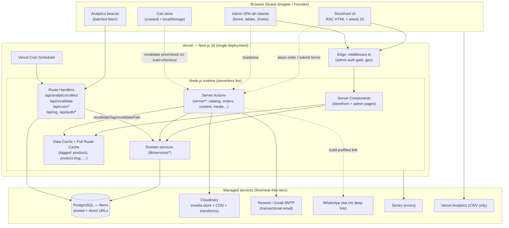
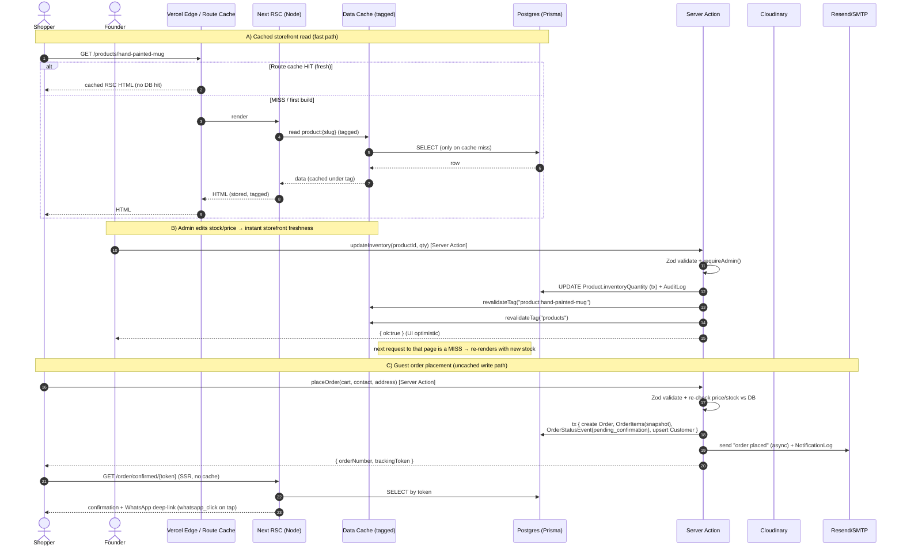
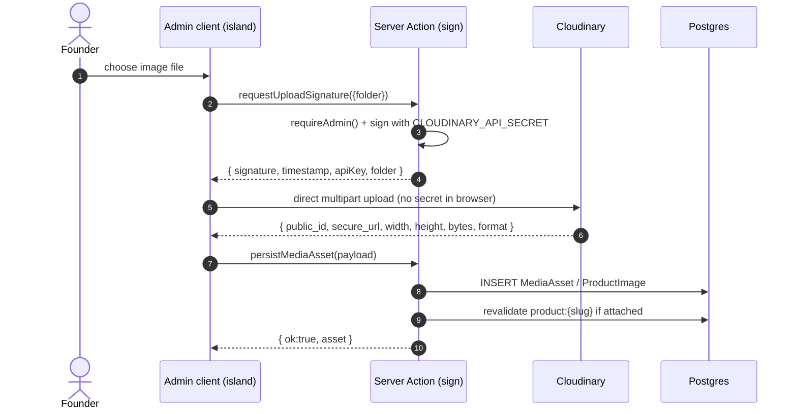
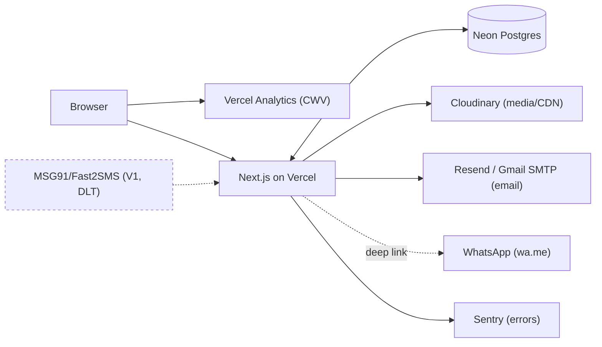

# 02 — System Architecture & Tech Stack

> **Project:** `vaani-gift-e-commerce` · **Brand:** GooglyWoogly Art · **Domain:** `googlywoogly.art`
> **Owner perspective:** Architect · **Conforms to:** `00-canonical-decisions.md` (CANON)
> **Status:** Production blueprint. Detailed entity fields → `03-data-model`. Routing/IA → `04`. SEO/ISR mechanics → `09`. NFRs → `16`.

This document is the **single architectural contract** for the whole application: how the storefront and admin are composed on Next.js 16 App Router, how data flows, how media/email/auth/analytics pipelines are wired, the rendering-mode decisions per area, and how the system stays correct, fast, secure, and **free-to-cheap on serverless tiers** for a single founder running the business from a phone.

---

## 1. Purpose & Scope

### 1.1 What this covers
- End-to-end **system topology**: one Next.js 16 deployment serving both the public storefront and the `/admin` command center.
- The **data layer**: PostgreSQL + Prisma, the access-pattern rules (where queries may run, the singleton client, connection pooling on serverless).
- The **rendering strategy matrix** (RSC / ISR / SSR / CSR per route family) and the *reasoning* behind each call.
- **Caching + on-demand revalidation mechanics**: `revalidateTag` / `revalidatePath` wired to Server Actions, the cache-tag taxonomy, and the safety-net `revalidate` windows.
- The **media pipeline** (Cloudinary), **admin auth** (Auth.js credentials), **email pipeline** (Resend primary / Gmail SMTP fallback), and the **in-house analytics ingestion pipeline**.
- **Environment variables**, **recommended folder structure**, **Vercel deployment + Cron**, **third-party integrations**, **security posture**, and the **scalability & cost envelope**.
- The **migration plan** from the current v0 prototype (single landing page, blanket `"use client"`, `images.unoptimized`, `ignoreBuildErrors`) to the production architecture.

### 1.2 What this explicitly does NOT cover
- Field-level schema, indexes, relations, and Prisma model definitions → **`03-data-model`** (this doc references entity/field names from CANON only).
- Page-level UX for storefront/admin screens → **`05`–`15`** (this doc covers only the architecture of the shells/providers).
- Detailed SEO tactics (JSON-LD shapes, metadata strategy, sitemap structure) → **`09`** (this doc covers the *rendering/caching machinery* SEO depends on).
- Notification copy/templates and DLT/WhatsApp flows → **`14`**.
- Quantified SLOs, error budgets, and load targets → **`16`** (this doc gives the architectural posture and cost envelope).
- **No shopper auth, no on-site payment, no product variants, no multi-currency** — architecturally precluded for now but not designed-out (per CANON §2.5, §3).

---

## 2. Primary user stories / jobs-to-be-done

| # | As a… | I want… | so that… |
|---|---|---|---|
| JTBD-1 | **Shopper (guest)** | the storefront to load fast, render on the server, and show live stock/price | I trust the brand and never hit a stale "out of stock" surprise. |
| JTBD-2 | **Shopper (guest)** | to browse, add to a cart that survives refresh, and place an order without any login | I can buy a handmade gift in under two minutes from my phone. |
| JTBD-3 | **Founder (admin)** | one auth-gated command center for products, inventory, orders, content & analytics | I run the entire business from my phone without spreadsheets. |
| JTBD-4 | **Founder (admin)** | a stock or price edit to appear on the live site within seconds | customers never order something I can't fulfil, and promos go live instantly. |
| JTBD-5 | **Founder (admin)** | automated emails + one-tap prefilled WhatsApp on every order/status change | I confirm availability and collect payment on WhatsApp with zero manual typing. |
| JTBD-6 | **Founder (admin)** | an in-house analytics funnel (views → cart → checkout → order) | I see what sells and where shoppers drop, without paying for or leaking data to a third party. |
| JTBD-7 | **Architect / future dev** | a clearly layered, typed, conventionally-structured codebase | adding variants, accounts, coupons, or a payment gateway later is additive, not a rewrite. |
| JTBD-8 | **Operator (founder)** | the whole thing to run on free/near-free tiers within serverless limits | the business is sustainable before revenue justifies paid infra. |
| JTBD-9 | **Search engine / SEO** | server-rendered, structured, cacheable pages with correct revalidation | category/occasion/PDP pages rank and Core Web Vitals stay green. |

---

## 3. Detailed functional requirements

Numbered, decisive, implementation-ready. "MUST" = required for MVP unless tagged `[V1]`/`[V2]`.

### 3.1 Application shell & topology
- **FR-1.** The system is a **single Next.js 16 (App Router) deployment** on Vercel serving two surfaces from one codebase: the **public storefront** (`/`, `/products`, `/category/*`, `/collections/*`, `/products/[slug]`, `/cart`, `/checkout`, `/track/*`, content/legal) and the **admin app** (`/admin/**`). No separate backend service; the API is the Next.js server (Server Components, Server Actions, Route Handlers).
- **FR-2.** **React Server Components (RSC) are the default.** The current blanket `"use client"` prototype pattern MUST be removed; `"use client"` is applied only to **leaf interactive islands** (cart, forms, carousels, filters, admin widgets). See §4 topology and §11 (rendering matrix).
- **FR-3.** The app uses **two route groups** to isolate the shells: `(storefront)` (public marketing chrome — navbar, footer, marquee, analytics beacon) and `(admin)` (auth-gated dashboard chrome — sidebar, top bar, no public chrome, `noindex`). A thin `(checkout)` group MAY isolate the distraction-free cart/checkout/confirmation chrome.
- **FR-4.** Cross-cutting code lives in a **layered structure** (§13): `lib/db` (Prisma), `lib/auth`, `lib/cloudinary`, `lib/email`, `lib/analytics`, `lib/cache` (tag helpers), `lib/validations` (Zod), `server/` (Server Actions grouped by domain), `lib/services` (domain logic reused by actions + route handlers).

### 3.2 Data layer (Postgres + Prisma)
- **FR-5.** **PostgreSQL** (Neon serverless, region nearest India — see §16.4 cost note) is the system of record. **Prisma** is the ORM; the schema in `03-data-model` is the source of truth for tables/enums.
- **FR-6.** A **single Prisma client singleton** (`lib/db/prisma.ts`) is instantiated once per server runtime and reused (guarded against hot-reload duplication via `globalThis`). No component instantiates its own client.
- **FR-7.** **Database access is server-only.** Prisma is imported exclusively from Server Components, Server Actions, Route Handlers, services, and Cron handlers. It MUST NOT be importable from client bundles; enforce with `server-only` import in `lib/db/prisma.ts`.
- **FR-8.** Serverless connection management: the app connects via Neon's **pooled connection string** (PgBouncer, `?pgbouncer=true&connection_limit=1`) for the runtime, and a **direct (non-pooled)** URL (`DIRECT_DATABASE_URL`) for Prisma **migrations** only. Prisma runs on the **Node.js runtime** (not Edge) for all DB-touching routes.
- **FR-9.** **Money is stored as integer paise** (CANON §10). All read/write paths use a shared money codec (`lib/money.ts`: `toPaise`, `formatINR`) — never float arithmetic. Display via `Intl.NumberFormat('en-IN', { style:'currency', currency:'INR' })`.
- **FR-10.** **Timestamps are UTC** in the DB; all display formatting converts to **IST (`Asia/Kolkata`)** via a shared `lib/datetime.ts`.
- **FR-11.** `inventoryState` is **derived, never stored** as a source of truth (CANON §6): computed from `madeToOrder`, `inventoryQuantity`, `lowStockThreshold` by a single helper (`lib/inventory.ts`) used identically on storefront and admin.

### 3.3 Rendering & caching
- **FR-12.** Every route renders in the mode declared in CANON §8 (mirrored in §11). Catalog pages are **RSC + ISR** with `generateStaticParams` and on-demand revalidation; `/search`, `/checkout`, `/order/confirmed/[token]`, `/track/[token]`, and all `/admin/**` are **dynamic (SSR, no cache)**; `/cart` is **CSR**.
- **FR-13.** **On-demand revalidation is the primary freshness mechanism.** Every admin mutation Server Action that changes published data calls the exact `revalidateTag` / `revalidatePath` set mapped in §7 / CANON §9. Time-based `revalidate` (catalog `3600s`, content/legal `86400s`) is only a safety net.
- **FR-14.** Storefront data reads in RSC are wrapped in cache-tagged fetch/`unstable_cache` (or Next 16's `cacheTag`/`cacheLife` under the `use cache` directive) so a single `revalidateTag('product:{slug}')` invalidates exactly the right pages. The tag taxonomy is **closed** (§9.2) — no ad-hoc tags.
- **FR-15.** A **secured revalidation Route Handler** (`POST /api/revalidate`, `REVALIDATE_SECRET`-gated) exists as a fallback/manual trigger; in-process Server Actions are preferred and do not call it over HTTP.

### 3.4 Media pipeline (Cloudinary)
- **FR-16.** All product/CMS imagery is stored and served via **Cloudinary**. `next.config` MUST remove `images.unoptimized` and whitelist `res.cloudinary.com` (and `images.unsplash.com` only for dev placeholders) under `images.remotePatterns`. `next/image` is used everywhere with explicit `width`/`height`/`sizes`.
- **FR-17.** Uploads are **server-mediated**: a Server Action requests a **signed upload** (`lib/cloudinary` signs with `CLOUDINARY_API_SECRET`); the admin client uploads directly to Cloudinary; the returned `public_id`/`url`/`width`/`height`/`format`/`bytes` are persisted to **`MediaAsset`** / **`ProductImage`**. The API secret never reaches the browser.
- **FR-18.** Cloudinary delivers `f_auto,q_auto` + responsive transformations; a `lib/cloudinary/url.ts` builder generates derived URLs (thumb, card, hero, OG 1200×630). The Next image loader MAY be a custom Cloudinary loader to push resizing to the CDN.

### 3.5 Admin auth (Auth.js)
- **FR-19.** Admin authentication uses **Auth.js (NextAuth v5) with the Credentials provider + bcrypt** (CANON §4). Credentials verify against **`AdminUser.passwordHash`**. **No shopper authentication anywhere.**
- **FR-20.** Sessions are **JWT strategy** (stateless, serverless-friendly), HTTP-only secure cookies, signed with `AUTH_SECRET`. Session carries `adminId` and `role` (`AdminRole`).
- **FR-21.** **`middleware.ts` protects `/admin/**`** (except `/admin/login`): unauthenticated requests redirect to `/admin/login?callbackUrl=…`. Every `/admin` Server Action additionally re-checks the session server-side (defense in depth — middleware is not the only gate). RBAC by `AdminRole` (`owner` > `admin` > `staff`) is enforced in actions/services.
- **FR-22.** All `/admin/**` responses set **`noindex, nofollow`** and are excluded from `sitemap.xml`/`robots.txt`.

### 3.6 Email pipeline
- **FR-23.** Transactional email uses **Resend + React Email** as primary, with **Gmail SMTP via Nodemailer** as a zero-cost fallback (CANON §4). A single **mailer abstraction** (`lib/email/send.ts`) selects the provider by config (`EMAIL_PROVIDER`) so callers are provider-agnostic.
- **FR-24.** Email send is **fire-and-forget from the request path but logged**: every attempt writes a **`NotificationLog`** row (`channel='email'`, `template`, `to`, `status` ∈ `queued|sent|failed|skipped`, `providerMessageId`, `error`). Failures never block order placement.
- **FR-25.** Templates are **React Email components** keyed to CANON **`EmailTemplate.key`** (order placed, order confirmed, shipped, delivered, cancelled, bulk-inquiry ack, contact ack). The domain `googlywoogly.art` MUST have **SPF, DKIM, DMARC** configured.

### 3.7 WhatsApp & SMS
- **FR-26.** WhatsApp is **click-to-chat deep links** (`https://wa.me/<WHATSAPP_NUMBER>?text=<prefilled>`) for MVP — built by `lib/whatsapp.ts` from order/status context. No WhatsApp API integration in MVP (V2). Emits **`whatsapp_click`** analytics on click.
- **FR-27.** **SMS is V1 only** and gated behind India **TRAI DLT registration + approved templates** (MSG91/Fast2SMS). The notification abstraction reserves the `sms` channel but it is a no-op (`skipped`) in MVP.

### 3.8 Analytics ingestion
- **FR-28.** **First-party, in-house analytics.** A lightweight client beacon batches events to a Route Handler **`POST /api/analytics/collect`** (Edge-eligible) which validates (Zod) and inserts **`AnalyticsEvent`** rows and upserts **`AnalyticsSession`**. Events use CANON **`AnalyticsEventType`** only (§9 of this doc lists which surface emits which).
- **FR-29.** `visitorId` (persistent, first-party cookie/localStorage) and `sessionId` (30-min sliding window) are generated client-side; the collector enriches with `path`, `referrer`, `device`, `country` (Vercel geo header), and `utm`. **No third-party trackers; no PII beyond what the order flow already collects.** Respects DPDP minimal-data posture.
- **FR-30.** A **nightly Vercel Cron** (`/api/cron/rollup`) aggregates raw events into **`DailyMetricRollup`** (visitors, sessions, funnel counts, revenueRequested, conversionRate, topProducts/Referrers/Pages) so admin dashboards read pre-aggregated rows, not raw scans. Vercel Analytics is kept **only** for Core Web Vitals.

### 3.9 Build hygiene & quality gates
- **FR-31.** `next.config` MUST drop `typescript.ignoreBuildErrors` and `images.unoptimized`. CI enforces **typecheck + lint + Prisma validate** on every push; the build fails on type errors.
- **FR-32.** **Sentry** is wired (client + server + edge) for error tracking (NFR). Source maps uploaded on Vercel build.
- **FR-33.** Secrets live **only** in Vercel Environment Variables / `.env` (git-ignored). `NEXT_PUBLIC_*` is the *only* prefix exposed to the browser; nothing secret carries it.

---

## 4. Architecture topology

### 4.1 Component topology diagram



### 4.2 Layered responsibilities

| Layer | Where | Responsibility | May import |
|---|---|---|---|
| **Presentation (RSC)** | `app/(storefront)`, `app/(admin)` page/layout `.tsx` | Fetch via services, compose UI, set metadata, declare ISR/dynamic | services, components, `lib/cache`, `lib/format` |
| **Interactive islands (client)** | `components/**` with `"use client"` | Local state, events, optimistic UI; call Server Actions | hooks, actions (as props/imports), `cart` store |
| **Server Actions** | `server/<domain>/*.ts` (`"use server"`) | Validate (Zod) → authorize → call service → revalidate tags → return typed result | `lib/validations`, services, `lib/cache`, `lib/auth` |
| **Domain services** | `lib/services/*` | Business logic, transactions, order-number/token generation, inventory math | `lib/db`, `lib/money`, `lib/inventory`, `lib/email`, `lib/cloudinary` |
| **Data** | `lib/db/prisma.ts` | Single Prisma client (`server-only`) | — |
| **Integrations** | `lib/cloudinary`, `lib/email`, `lib/whatsapp`, `lib/analytics` | Provider SDK wrappers, provider-agnostic interfaces | provider SDKs |
| **Edge** | `middleware.ts` | Admin auth gate, geo enrichment header | `lib/auth` (edge-safe) |

**Rule:** dependencies point **downward only** (presentation → actions → services → data/integrations). Islands never touch Prisma. Services never import React.

---

## 5. Data & entities used

This doc consumes CANON entity/field names (full definitions → `03`). Architecturally relevant access patterns:

| Entity (CANON) | Read by | Written by | Cache tags touched |
|---|---|---|---|
| **Product**, **ProductImage** | PDP/PLP/category/collection RSC; admin | Admin catalog/inventory actions | `product:{slug}`, `products`, `category:{slug}`, `collection:{slug}` |
| **Category** | Category PLP, nav, sitemap | Admin category actions | `category:{slug}`, `products`, `nav` |
| **Collection**, **CollectionProduct** | Collection pages, home | Admin collection actions; `[V1]` automation rules | `collection:{slug}`, `products`, `home` |
| **MediaAsset** | Admin media library | Cloudinary upload action | — (admin only) |
| **Order**, **OrderItem**, **OrderStatusEvent** | Checkout action, `/track/[token]`, `/order/confirmed/[token]`, admin orders | Checkout (create), admin status actions | none (uncached/SSR) |
| **Customer** | Admin CRM | Derived/upserted on order placement | none |
| **BulkInquiry**, **ContactMessage**, **NewsletterSubscriber** | Admin inboxes | Public form actions | none (admin lists uncached) |
| **HomepageSection**, **Banner**, **Testimonial**, **FaqItem**, **CmsPage**, **SiteSetting** | Home, content/legal pages, global chrome | Admin content actions | `home`, `banners`, `settings`, `nav`, `faq`, `testimonials`, `page:{slug}` |
| **AdminUser** | Auth.js authorize, admin RBAC | Seed / admin user mgmt | none |
| **AuditLog** | Admin audit-log view | Every admin mutation (via service) | none |
| **NotificationLog**, **EmailTemplate** | Admin notifications view; mailer | Email/WhatsApp/SMS send paths | none |
| **AnalyticsEvent**, **AnalyticsSession** | Cron rollup | `/api/analytics/collect` | none |
| **DailyMetricRollup** | Admin analytics dashboard | Nightly Cron | none |
| **Coupon**, **Review** | `[V1]` | `[V1]` | `[V1]` |

**Read-vs-write summary:** storefront pages are **read-only** against cached/tagged catalog & CMS data; the **only** storefront *write* is order placement (+ form submissions + analytics ingest). All other writes originate in `/admin` Server Actions or Cron.

---

## 6. Server Actions / API routes (architecture-level)

This doc enumerates the **infrastructure-level** endpoints and the *contract pattern* every action follows. Domain-specific actions (full input/output) are specified in their feature docs (`08`, `11`, `12`, `14`, `15`); here we fix the **shape, runtime, and revalidation wiring**.

### 6.1 Server Action contract (uniform pattern)
Every Server Action MUST:
1. Be `"use server"`, accept a typed/`FormData` input, and **validate with a Zod schema** from `lib/validations`.
2. **Authorize** — public actions are rate-limited; `/admin` actions call `requireAdmin(role?)` (re-reads Auth.js session server-side).
3. Delegate to a **service** for business logic + DB transaction.
4. On success, **revalidate the exact tag set** (§7 table) and return a discriminated result `{ ok: true, data } | { ok: false, error, fieldErrors? }` — never throw to the client for expected validation failures.
5. Write **`AuditLog`** (admin mutations) and/or **`NotificationLog`** (sends) as side effects.

### 6.2 Route Handlers (infrastructure)

| Route | Method | Runtime | Auth | Inputs (Zod) | Output | Side effects | Revalidates |
|---|---|---|---|---|---|---|---|
| `/api/auth/[...nextauth]` | GET/POST | Node | — | Auth.js | session/JWT | sets `AdminUser.lastLoginAt` | — |
| `/api/analytics/collect` | POST | Edge | none (rate-limited, origin-checked) | `{events: AnalyticsEvent[]}` batched | `204` | insert `AnalyticsEvent`, upsert `AnalyticsSession` | — |
| `/api/revalidate` | POST | Node | `REVALIDATE_SECRET` header | `{tags?: string[], paths?: string[]}` | `{revalidated:true}` | manual cache bust | given tags/paths |
| `/api/cron/rollup` | GET | Node | Vercel Cron secret (`Authorization: Bearer $CRON_SECRET`) | — | `{date, …counts}` | upsert `DailyMetricRollup`; prune raw events `[V1]` | — |
| `/api/cron/sitemap` | GET | Node | Cron secret | — | `200` | warm/refresh sitemap, ping search engines | — |
| `/api/cron/pending-orders` | GET | Node | Cron secret | — | `{count}` | founder digest email for stale `pending_confirmation` orders | — |
| `/api/og/[type]` | GET | Edge (`ImageResponse`) | — | route params | PNG 1200×630 | dynamic social card | — |
| `/sitemap.xml`, `/robots.txt` | GET | Node | — | — | XML/text | from catalog + CMS | — |
| `/api/cloudinary/sign` *(or Server Action)* | POST | Node | admin | `{folder, publicId?}` | signed params | — | — |

### 6.3 Server Action → revalidation map (the wiring that keeps the storefront live)

| Action domain | Representative actions | Revalidates (tags / paths) |
|---|---|---|
| **Catalog — product** | `createProduct`, `updateProduct`, `archiveProduct`, `updateInventory`, `reorderProductImages` | `product:{slug}`, `products`, `category:{slug}` (old+new), affected `collection:{slug}`, `home` if `isFeatured`/`isBestseller` |
| **Catalog — category** | `createCategory`, `updateCategory`, `toggleCategory`, `reorderCategories` | `category:{slug}`, `products`, `nav` |
| **Merchandising — collection** | `createCollection`, `updateCollection`, `setCollectionProducts`, `runCollectionRules`*[V1]* | `collection:{slug}`, `products`, `home` if `isFeaturedOnHome` |
| **Content/CMS** | `updateHomepageSections`, `upsertBanner`, `upsertTestimonial`, `upsertFaq`, `publishCmsPage`, `updateSiteSettings` | `home`, `banners`, `testimonials`, `faq`, `page:{slug}`, `settings`, `nav` |
| **Orders** | `placeOrder` (public), `updateOrderStatus`, `setPaymentStatus`, `addOrderNote` | none for storefront cache; `revalidatePath('/admin/orders')` + `/track/[token]` is SSR (always fresh) |
| **Leads** | `submitBulkInquiry`, `submitContact`, `subscribeNewsletter` (public) | none (admin lists are dynamic) |

> The full per-tag trigger table is CANON §9; §9.2 below restates the closed tag set this app may use.

---

## 7. Caching, ISR & on-demand revalidation mechanics

### 7.1 Three Next.js caches, and how we use each

| Cache | Used for | Invalidation |
|---|---|---|
| **Full Route Cache** (rendered RSC payload/HTML) | RSC-ISR catalog + content pages | `revalidateTag` (preferred) or `revalidatePath`; safety-net time `revalidate` |
| **Data Cache** (cached fetch / `unstable_cache` / `use cache`) | DB read results in RSC, tagged per entity | `revalidateTag(tag)` |
| **Router Cache** (client-side, short-lived) | SPA-like nav | automatic; we don't rely on it for freshness |

**Dynamic (no cache):** `/search`, `/cart` (CSR), `/checkout`, `/order/confirmed/[token]`, `/track/[token]`, all `/admin/**` — these declare `export const dynamic = 'force-dynamic'` (or read cookies/headers / `noStore`).

### 7.2 Closed cache-tag taxonomy (no ad-hoc tags)
`home` · `banners` · `settings` · `nav` · `faq` · `testimonials` · `products` · `product:{slug}` · `category:{slug}` · `collection:{slug}` · `page:{slug}`.
Helpers in `lib/cache/tags.ts` produce these (e.g. `productTag(slug)`) — string literals are never hand-typed in actions.

### 7.3 Safety-net revalidate windows (CANON §9)
- Catalog pages (`/products`, `/category/*`, `/collections/*`, `/products/[slug]`): `revalidate = 3600`.
- Content/legal (`/about`, `/contact`, `/faq`, policy pages): `revalidate = 86400`.
- Home: `3600`. Tracking/checkout/cart/admin: no cache.

### 7.4 Request + data-flow + revalidation sequence (the core loop)



### 7.5 Media-upload sequence (signed, server-mediated)



---

## 8. Rendering strategy matrix (RSC / ISR / SSR / CSR) and **why**

> Mirrors CANON §8. The "Why" column is the architectural justification.

| Route / area | Mode | Caching | Why this mode |
|---|---|---|---|
| `/` (landing) | **RSC + ISR** | `home`,`banners`,`settings` + `3600s` | Marketing surface; SEO-critical; content changes via CMS → on-demand tag bust gives instant updates without per-request DB load. |
| `/bulk-orders` | **RSC-ISR + Action** | `page:bulk-orders` | Static landing; the inquiry form is an island posting a Server Action. |
| `/products` (base PLP) | **RSC + ISR** | `products` + `3600s` | Default catalog grid is stable & indexable; prebuilt for speed. |
| `/products?filter…&sort…` (faceted) | **SSR (dynamic)** | none | Filtered/sorted permutations are unbounded; render per-request from `searchParams`; base view stays ISR (`noindex` on facet permutations — see `09`). |
| `/category/[slug]` | **RSC-ISR + `generateStaticParams`** | `category:{slug}`,`products` + `3600s` | Finite, SEO-flagship pages; pre-render top categories at build, ISR the long tail. |
| `/collections/[slug]` | **RSC-ISR + `generateStaticParams`** | `collection:{slug}`,`products` | Occasion/theme landings; same rationale as category. |
| `/products/[slug]` (PDP) | **RSC-ISR + `generateStaticParams` + on-demand** | `product:{slug}` | Highest-SEO, highest-traffic; must be instant *and* always reflect live price/stock → ISR + tag bust on every product mutation. |
| `/search` | **SSR** | none, `noindex` | Query-driven, unbounded, not indexable; freshness > caching. |
| `/cart` | **CSR** | none | Cart lives in `localStorage`; no server data needed to render; price/stock re-validated via action on load & at checkout. |
| `/checkout` | **SSR shell + Action** | none | Captures PII (contact/address); must be uncached & dynamic; submit is a Server Action. |
| `/order/confirmed/[token]` | **SSR (token)** | none | One-time, token-scoped, personal; never cached/indexed. |
| `/track/[token]` | **SSR, no-cache, token-gated** | none, `noindex` | Live order timeline; must always be fresh; unguessable token is the only key. |
| `/about`,`/contact`,`/faq` | **RSC-ISR** | `page:{slug}` (+`faq`) + `86400s` | Editable but rarely; cache hard, bust on publish. |
| Legal/policy pages | **RSC-ISR** | `page:{slug}` + `86400s` | Static content; CMS-editable; long TTL. |
| `/sitemap.xml`,`/robots.txt` | **Generated (Node)** | rebuilt on catalog/CMS change | SEO infra; regenerated via Cron + on publish. |
| `/admin/**` | **SSR + auth + `noindex`** | none | Real-time operational data, per-admin, never cacheable/indexable. |

**Cross-cutting "why":** RSC-by-default minimizes client JS (better CWV/SEO), keeps secrets server-side, and lets the **Full Route + Data caches** absorb traffic so the **free Postgres tier is barely touched** on the storefront. SSR is reserved for personal/dynamic/unbounded surfaces; CSR only where state is inherently client-side (cart).

---

## 9. Analytics events emitted (ingestion architecture)

The pipeline (FR-28–30) ingests **only** CANON `AnalyticsEventType` values. Emitter map (full UX placement in `13`):

| Event (`AnalyticsEventType`) | Emitted from | Notes |
|---|---|---|
| `page_view` | every route (beacon on mount/navigation) | enriched with `path`, `referrer`, `utm`, `device`, `country` |
| `product_view` | PDP RSC → client beacon | `productId` |
| `category_view` / `collection_view` | category / collection pages | slug in `metadata` |
| `search` | `/search` submit | query term in `metadata` |
| `filter_apply` | PLP facet island | filter/sort in `metadata` |
| `add_to_cart` / `remove_from_cart` / `update_cart` | cart store actions | `productId`, qty, `value` |
| `begin_checkout` | `/checkout` mount | cart `value` |
| `place_order` | `placeOrder` success | `value`=grandTotal, `orderId` |
| `order_confirmed` | admin `updateOrderStatus → confirmed` | server-emitted |
| `whatsapp_click` | any `wa.me` CTA | order/product context |
| `bulk_inquiry_submit` | bulk form success | — |
| `contact_submit` | contact form success | — |
| `newsletter_signup` | newsletter form success | — |
| `outbound_click` | external links (social, etc.) | destination in `metadata` |

**Ingestion guarantees:** batched & `navigator.sendBeacon`-friendly; collector is **idempotent-tolerant** (dedup by client event id within session); failures are silent (analytics never degrades UX). Nightly Cron rolls raw events into `DailyMetricRollup`; dashboards never scan raw `AnalyticsEvent` at request time.

---

## 10. States & edge cases (system-level)

| Scenario | Behavior |
|---|---|
| **DB unreachable (storefront)** | Cached pages keep serving (ISR). Uncached/SSR routes show a graceful error boundary; Sentry alerts. Order placement returns a retryable error and does **not** lose the client cart. |
| **DB unreachable (admin)** | Admin shows error state; mutations fail loudly with toast; no partial writes (all writes are transactional). |
| **Stale cart at checkout** | `placeOrder` re-reads each line's live `price` + `inventoryState`; if price changed or item became `out_of_stock` (and not `made_to_order`), returns `fieldErrors` → checkout shows per-line "price/stock updated, review & retry". |
| **Made-to-order item** | Always orderable regardless of `inventoryQuantity`; PDP & order show `productionLeadTimeDays`. No stock gate. |
| **Concurrent inventory edit vs order** | Inventory math is advisory (no payment, founder confirms availability on WhatsApp). MVP does **not** decrement stock on order; stock is admin-managed. `[noted in open questions]` |
| **Revalidation race** | `revalidateTag` marks stale; next request re-renders. Brief window of staleness is acceptable (seconds). Cron + safety-net TTL backstop any missed bust. |
| **Cloudinary down at upload** | Signed-upload step fails; admin retries; no orphan `MediaAsset` (row written only after Cloudinary returns). |
| **Email provider down** | `placeOrder`/status change still succeed; `NotificationLog.status='failed'`; founder still has WhatsApp CTA; retry job `[V1]`. |
| **Analytics collector overloaded/blocked** | Beacon failures are swallowed; no user-facing impact; some events may be lost (acceptable for first-party analytics). |
| **Auth session expired (admin)** | Middleware redirects to `/admin/login?callbackUrl`; in-flight action returns `unauthorized`; client re-auth. |
| **Token guessing on `/track` or `/order/confirmed`** | 24+ char nanoid; invalid token → generic 404 (no enumeration signal); routes `noindex`. |
| **Cold start (serverless)** | Node functions warm on first hit; ISR cache means most storefront hits skip functions entirely. Prisma uses pooled connection to avoid exhausting Neon. |
| **Build-time `generateStaticParams` for huge catalog** | Pre-render only top-N (featured/bestseller/active); long tail via ISR on first request to stay within free build minutes. |

---

## 11. SEO / performance / accessibility (architecture posture)

> Tactics live in `09` (SEO) and `16` (NFR). Architectural enablers only here.

- **SEO:** RSC + ISR ⇒ fully server-rendered, crawlable HTML with per-route `generateMetadata`; canonical URLs use **slugs/tokens only** (IDs never in URLs, CANON §10); `sitemap.xml`/`robots.txt` generated from live catalog/CMS and refreshed via Cron + on publish; `/admin`, `/cart`, `/checkout`, `/search`, `/track` carry `noindex`; structured data (Product/Breadcrumb/Org) emitted in RSC.
- **Performance:** image optimization **on** (Cloudinary `f_auto,q_auto` + `next/image`), removing the prototype's `images.unoptimized`; RSC-by-default shrinks client JS; islands are code-split; Data/Route caches shield Postgres; fonts via `next/font`; Vercel Analytics tracks CWV (target green — see `16`).
- **Accessibility:** shadcn/Radix primitives are a11y-first; the pink/playful theme MUST verify **WCAG AA contrast** (CANON §4); forms (react-hook-form + Zod) expose labels/`aria-invalid`/error text; focus management on dialogs/drawers; keyboard-navigable nav/filters; respects `prefers-reduced-motion` for framer-motion / 3D hero.

---

## 12. Environment variables

> Source of truth for env names (CANON §10). `NEXT_PUBLIC_*` ⇒ browser-exposed (never secret).

```ini
# --- Core ---
NEXT_PUBLIC_SITE_URL=https://googlywoogly.art

# --- Database (Neon, Postgres) ---
DATABASE_URL=postgresql://…?pgbouncer=true&connection_limit=1   # pooled (runtime)
DIRECT_DATABASE_URL=postgresql://…                              # direct (Prisma migrate only)

# --- Auth.js (admin) ---
AUTH_SECRET=…                 # signs JWT/session cookies
# AUTH_TRUST_HOST=true        # Vercel preview/prod
# AUTH_URL=https://googlywoogly.art   # if needed

# --- Media (Cloudinary) ---
CLOUDINARY_CLOUD_NAME=…
CLOUDINARY_API_KEY=…
CLOUDINARY_API_SECRET=…       # SERVER ONLY — signs uploads
NEXT_PUBLIC_CLOUDINARY_CLOUD_NAME=…   # for client image URLs only

# --- Email (Resend primary / Gmail SMTP fallback) ---
EMAIL_PROVIDER=resend         # resend | smtp
EMAIL_FROM="GooglyWoogly Art <orders@googlywoogly.art>"
RESEND_API_KEY=…
SMTP_HOST=smtp.gmail.com
SMTP_PORT=465
SMTP_USER=…
SMTP_PASSWORD=…               # Gmail app password

# --- WhatsApp (deep link, MVP) ---
WHATSAPP_NUMBER=91XXXXXXXXXX  # E.164 digits, no '+'

# --- Revalidation + Cron ---
REVALIDATE_SECRET=…           # guards POST /api/revalidate
CRON_SECRET=…                 # guards /api/cron/* (Vercel Cron Bearer)

# --- Error tracking ---
SENTRY_DSN=…
NEXT_PUBLIC_SENTRY_DSN=…
SENTRY_AUTH_TOKEN=…           # build-time source map upload

# --- SMS (V1 only — DLT) ---
# MSG91_AUTH_KEY=…  MSG91_SENDER_ID=…  MSG91_DLT_TEMPLATE_*=…
```

**Rules:** every secret is configured in **Vercel → Environment Variables** (Production/Preview/Development scopes); `.env*` is git-ignored; a committed **`.env.example`** documents all keys with placeholder values; the app fails fast at boot if a required var is missing (validate via a typed `lib/env.ts` using Zod).

---

## 13. Recommended folder structure

```
vaani-gift-e-commerce/
├─ app/
│  ├─ (storefront)/                 # public chrome (navbar/footer/marquee + analytics beacon)
│  │  ├─ layout.tsx
│  │  ├─ page.tsx                    # / (RSC-ISR; home)
│  │  ├─ bulk-orders/page.tsx
│  │  ├─ products/page.tsx           # base PLP (ISR) + faceted (dynamic)
│  │  ├─ category/[slug]/page.tsx
│  │  ├─ collections/[slug]/page.tsx
│  │  ├─ products/[slug]/page.tsx    # PDP
│  │  ├─ search/page.tsx             # SSR, noindex
│  │  ├─ about/ contact/ faq/ …/page.tsx
│  │  └─ (legal)/{privacy-policy,terms,shipping-policy,returns-and-refunds,care-guide}/page.tsx
│  ├─ (checkout)/                    # distraction-free chrome
│  │  ├─ cart/page.tsx               # CSR
│  │  ├─ checkout/page.tsx           # SSR shell + action
│  │  ├─ order/confirmed/[token]/page.tsx
│  │  └─ track/[token]/page.tsx
│  ├─ (admin)/
│  │  ├─ admin/login/page.tsx
│  │  └─ admin/                      # dashboard, products, categories, collections, inventory,
│  │     └─ …/page.tsx               # orders, bulk-inquiries, messages, customers, reviews,
│  │                                 # coupons, content, media, analytics, settings, audit-log
│  ├─ api/
│  │  ├─ auth/[...nextauth]/route.ts
│  │  ├─ analytics/collect/route.ts  # Edge
│  │  ├─ revalidate/route.ts
│  │  ├─ cron/{rollup,sitemap,pending-orders}/route.ts
│  │  └─ og/[type]/route.ts          # Edge ImageResponse
│  ├─ sitemap.ts                     # /sitemap.xml
│  ├─ robots.ts                      # /robots.txt
│  ├─ layout.tsx                     # root: <html>, providers, fonts, Sentry, Toaster
│  └─ globals.css
├─ server/                           # Server Actions, grouped by domain ("use server")
│  ├─ catalog/{products,categories,collections,inventory,media}.ts
│  ├─ orders/{placeOrder,status,payment,notes}.ts
│  ├─ leads/{bulkInquiry,contact,newsletter}.ts
│  └─ content/{homepage,banners,testimonials,faq,pages,settings}.ts
├─ lib/
│  ├─ db/prisma.ts                   # singleton, server-only
│  ├─ auth/                          # auth.ts (NextAuth config), guards (requireAdmin)
│  ├─ services/                      # domain logic + transactions (reused by actions + handlers)
│  ├─ cloudinary/{client.ts,sign.ts,url.ts}
│  ├─ email/{send.ts,templates/*}    # provider-agnostic + React Email
│  ├─ whatsapp.ts                    # wa.me deep-link builder
│  ├─ analytics/{collector.ts,emit.ts}
│  ├─ cache/tags.ts                  # closed tag helpers
│  ├─ validations/                   # Zod schemas per domain
│  ├─ money.ts  inventory.ts  datetime.ts  env.ts  utils.ts
├─ components/
│  ├─ storefront/  admin/  cart/  forms/   # feature islands
│  └─ ui/                            # shadcn primitives (existing)
├─ hooks/                            # existing (use-mobile, use-toast) + cart hooks
├─ prisma/
│  ├─ schema.prisma
│  ├─ migrations/
│  └─ seed.ts                        # admin user, SiteSetting, EmailTemplates, sample catalog
├─ middleware.ts                     # admin auth gate + geo
├─ instrumentation.ts                # Sentry init
├─ vercel.json                       # cron schedules
├─ next.config.mjs                   # remotePatterns; NO unoptimized / NO ignoreBuildErrors
├─ .env.example
└─ docs/                             # specs 00–17
```

> **Migration note (from current v0 prototype):** today `app/` is a single `page.tsx` of stacked `"use client"` marketing components (`components/*.tsx`) with `lib/utils.ts` only. The move is: (1) split into route groups; (2) convert marketing components to RSC, keeping only interactive ones as islands; (3) introduce `prisma/`, `server/`, `lib/services`, `lib/db`; (4) fix `next.config` (drop `unoptimized` + `ignoreBuildErrors`); (5) rename the project `name` away from `my-v0-project`; (6) prune unused 3D/React-Native/Expo deps (`expo*`, `react-native`, heavy `three` stack) if the 3D hero is dropped, to shrink the client bundle.

---

## 14. Vercel deployment, Cron & third-party integrations

### 14.1 Deployment
- **Single Vercel project**, Git-connected (`master` → Production; PRs → Preview). Build = `next build` (after build-hygiene fixes); install via `pnpm` (lockfile present).
- **Region:** choose Vercel function region nearest the Neon region (India-proximate, e.g. `sin1`/`bom1` where available) to minimize DB round-trip latency from serverless functions.
- **Runtimes:** DB-touching routes/actions on **Node.js**; `/api/analytics/collect` and `/api/og` may run on **Edge**; `middleware.ts` on Edge.
- **Build hygiene gates** (FR-31): typecheck + lint must pass; Prisma `generate` runs in `postinstall`/build; migrations applied via `prisma migrate deploy` in the build/release step using `DIRECT_DATABASE_URL`.

### 14.2 Cron (`vercel.json`)

| Schedule (IST intent → UTC) | Path | Job |
|---|---|---|
| Nightly ~02:00 IST (`30 20 * * *` UTC) | `/api/cron/rollup` | Aggregate `AnalyticsEvent`→`DailyMetricRollup`; prune old raw events `[V1]` |
| Nightly ~02:30 IST | `/api/cron/sitemap` | Refresh sitemap + ping search engines |
| Daily ~09:00 IST | `/api/cron/pending-orders` | Email founder a digest of stale `pending_confirmation` orders + low-stock alerts |

All Cron routes verify the Vercel-injected `Authorization: Bearer $CRON_SECRET` and return fast (work is light or chunked to stay within free-tier execution limits).

### 14.3 Third-party integrations summary



| Integration | Purpose | Tier posture | Secrets |
|---|---|---|---|
| **Neon** | Postgres system of record | Free serverless, auto-suspend | `DATABASE_URL`, `DIRECT_DATABASE_URL` |
| **Cloudinary** | Media store, CDN, transforms | Free tier (signed uploads) | `CLOUDINARY_*` |
| **Resend** | Transactional email | Free tier; SMTP fallback | `RESEND_API_KEY` / `SMTP_*` |
| **WhatsApp (wa.me)** | Payment/concierge handoff | Free deep links | `WHATSAPP_NUMBER` |
| **Sentry** | Error tracking | Free dev tier | `SENTRY_*` |
| **Vercel Analytics** | Core Web Vitals only | Included | — |
| **MSG91/Fast2SMS** `[V1]` | SMS (DLT-gated) | Paid + DLT | `MSG91_*` |

---

## 15. Security posture

| Domain | Control |
|---|---|
| **Admin auth** | Auth.js Credentials + **bcrypt** hash in `AdminUser.passwordHash`; JWT sessions signed by `AUTH_SECRET`; `middleware.ts` gate **plus** server-side `requireAdmin()` re-check in every admin action (no client-only auth). |
| **RBAC** | `AdminRole` (`owner`/`admin`/`staff`) enforced in services/actions; destructive ops (delete, settings, user mgmt) restricted to `owner`/`admin`. |
| **No shopper auth / no payments** | Reduced attack surface by design; no card data, no payment webhooks, no shopper credentials stored — ever. |
| **Token security** | `trackingToken` = 24+ char nanoid (CANON §10); sole key to `/track`; never sequential, never indexed; invalid → generic 404. `orderNumber` is non-secret/human-facing and never grants access. |
| **Input validation** | **Zod at every boundary** — Server Actions, Route Handlers, env (`lib/env.ts`). Server is the trust boundary; never trust client-sent prices/totals (recompute from DB at `placeOrder`). |
| **Secrets** | Only in Vercel env / `.env` (git-ignored); `CLOUDINARY_API_SECRET`, `AUTH_SECRET`, `RESEND_API_KEY`, DB URLs never `NEXT_PUBLIC_`; signed Cloudinary uploads keep the secret server-side. |
| **Endpoint guards** | `/api/revalidate` → `REVALIDATE_SECRET`; `/api/cron/*` → `CRON_SECRET`; `/api/analytics/collect` → origin check + rate limit; admin Server Actions → session-gated. |
| **Rate limiting / abuse** | Public form actions (checkout, bulk inquiry, contact, newsletter) and the analytics collector are rate-limited (IP + sliding window; Vercel KV/Upstash `[V1]`, in-memory/edge guard MVP) + honeypot field + optional captcha `[V1]`. |
| **Transport & headers** | HTTPS only (Vercel); security headers via `next.config`/middleware (HSTS, `X-Content-Type-Options`, `Referrer-Policy`, frame-ancestors, CSP `[hardening V1]`). |
| **PII / DPDP** | Minimal PII (name, phone, email, address for orders only); UTC storage; consent on forms; retention/erasure policy honored (CANON §11). Analytics is first-party and PII-light. |
| **Audit** | Every admin mutation writes **`AuditLog`** (actor, action, entity, before/after) for traceability. |
| **Error hygiene** | Sentry scrubs PII; client never receives stack traces; expected failures returned as typed results, not thrown. |

---

## 16. Scalability & cost envelope (free / near-free tiers)

### 16.1 Why this architecture is cheap by construction
- **ISR + Full Route Cache + tagged Data Cache** mean the vast majority of storefront requests are served from cache — **Postgres is touched mainly on cache miss / writes**, keeping a single founder's traffic comfortably inside Neon's free compute/storage and Vercel's function-invocation limits.
- **RSC-by-default** ships minimal client JS → fewer/faster requests, better CWV, lower bandwidth.
- **Pooled Neon connection** (PgBouncer, `connection_limit=1`) prevents serverless connection-storm exhaustion — the classic free-tier killer.
- **On-demand revalidation** avoids polling/short TTLs that would hammer the DB; freshness is event-driven from admin mutations.
- **Cron does the heavy aggregation nightly** so dashboards read small `DailyMetricRollup` rows, never scan raw `AnalyticsEvent` at request time.

### 16.2 Free-tier fit & headroom

| Resource | Free-tier reality | Mitigation / headroom |
|---|---|---|
| **Vercel function invocations / build minutes** | Generous for low traffic | ISR caches storefront; `generateStaticParams` limited to top-N; Edge for analytics/OG. |
| **Neon compute/storage/connections** | Auto-suspend on idle; limited connections | Pooled URL; reads cached; suspend acceptable (first request warms). |
| **Cloudinary credits/bandwidth** | Sufficient for a small catalog | `f_auto,q_auto`, responsive sizes, CDN caching. |
| **Resend volume** | Free monthly cap | Transactional-only; SMTP fallback; `NotificationLog` to monitor. |
| **Sentry events** | Free dev quota | Sampling + PII scrub. |

### 16.3 Scale path (when the business outgrows free)
1. Neon free → paid branch/compute; add read replica if read-heavy.
2. Postgres FTS → **Meilisearch/Typesense** for search (CANON §4, V1).
3. Add **Upstash/Vercel KV** for durable rate-limiting + email/job retry queues.
4. WhatsApp deep links → **WhatsApp Business API** (V2); SMS via DLT (V1).
5. Horizontal scale is automatic on Vercel; the **stateless** app (JWT sessions, no server affinity) scales without sticky sessions. The data model already leaves room for **variants, accounts, coupons, on-site payment** (CANON §3) — all additive.

### 16.4 Architectural non-negotiables that protect cost & correctness
- Single Prisma singleton, server-only, pooled connection.
- Closed cache-tag set + event-driven revalidation (no short global TTLs).
- Money in integer paise; timestamps UTC→IST display.
- Secrets server-side; signed media uploads; Zod at every boundary.
- Node runtime for DB; Edge only for stateless analytics/OG/middleware.

---

## 17. Acceptance criteria

A reviewer can mark this architecture "met" when:

- [ ] **AC-1.** App is a single Next.js 16 deployment with `(storefront)`, `(checkout)`, `(admin)` route groups; RSC is default; `"use client"` only on interactive islands.
- [ ] **AC-2.** `next.config` has **no** `images.unoptimized` and **no** `typescript.ignoreBuildErrors`; `images.remotePatterns` allows `res.cloudinary.com`; `next/image` used throughout.
- [ ] **AC-3.** A single **server-only** Prisma singleton exists; storefront uses the **pooled** Neon URL; migrations use the **direct** URL; no client bundle imports Prisma.
- [ ] **AC-4.** Each route renders in the mode mandated by §8/§11; catalog pages use `generateStaticParams` + ISR; `/search`,`/checkout`,`/order/confirmed/[token]`,`/track/[token]`,`/admin/**` are dynamic/no-cache; `/cart` is CSR.
- [ ] **AC-5.** Admin mutation Server Actions call the exact `revalidateTag`/`revalidatePath` sets in §6.3/§7; editing a product's price or stock makes the change visible on its PDP on the **next request** (verified).
- [ ] **AC-6.** Cache tags come **only** from the closed taxonomy in §7.2 via `lib/cache/tags.ts`; safety-net `revalidate` windows match CANON §9.
- [ ] **AC-7.** Media uploads are **signed & server-mediated**; `CLOUDINARY_API_SECRET` never reaches the browser; `MediaAsset`/`ProductImage` rows are written only after Cloudinary confirms.
- [ ] **AC-8.** `/admin/**` is protected by `middleware.ts` **and** server-side `requireAdmin()`; sessions are JWT signed by `AUTH_SECRET`; admin pages are `noindex`; **no shopper auth exists anywhere**.
- [ ] **AC-9.** Email sends via the provider-agnostic mailer (Resend primary, SMTP fallback), writes `NotificationLog`, and never blocks order placement; domain has SPF/DKIM/DMARC.
- [ ] **AC-10.** Analytics beacon posts batched CANON `AnalyticsEventType` events to `/api/analytics/collect`; nightly Cron writes `DailyMetricRollup`; dashboards read rollups, not raw events; no third-party tracker; Vercel Analytics used only for CWV.
- [ ] **AC-11.** `placeOrder` recomputes price/stock from the DB (never trusts the client), handles changed-price/out-of-stock/made-to-order per §10, and creates `Order`+`OrderItem`+`OrderStatusEvent` transactionally with `orderNumber` + `trackingToken`.
- [ ] **AC-12.** All env vars from §12 are documented in `.env.example`, validated at boot via `lib/env.ts`, and only `NEXT_PUBLIC_*` is browser-exposed.
- [ ] **AC-13.** `vercel.json` defines the three Cron jobs (§14.2), each guarded by `CRON_SECRET`.
- [ ] **AC-14.** Sentry is initialized for client/server/edge; CI enforces typecheck + lint + `prisma validate`.
- [ ] **AC-15.** Money is integer paise end-to-end; timestamps stored UTC, displayed IST; `inventoryState` derived by one shared helper.
- [ ] **AC-16.** Both architecture and sequence mermaid diagrams (§4.1, §7.4) render and reflect the implemented flows.

---

## 18. Dependencies, assumptions & open questions

### 18.1 Dependencies
- **CANON `00`** (names, enums, routes, tags, conventions) — hard dependency.
- **`03-data-model`** — concrete Prisma schema for every entity referenced here.
- **`04`** (IA/routing) — exact route tree this topology implements.
- **`09`** (SEO/ISR) — detailed revalidation & metadata tactics layered on this caching machinery.
- **`08`/`11`/`12`/`14`/`15`** — feature-level Server Action signatures wired into §6's contract.
- **`16`** (NFR) — quantified SLOs/CWV/load targets this posture must satisfy.
- External provider accounts: Neon, Cloudinary, Resend (+ Gmail app password), Sentry, Vercel; DNS control over `googlywoogly.art` for email auth.

### 18.2 Assumptions
- Neon (Postgres) is the chosen DB over Supabase (both CANON-sanctioned); pooled+direct URL pattern applies either way.
- Next.js 16 caching is configured via tagged `fetch`/`unstable_cache` (or the `use cache` + `cacheTag`/`cacheLife` model if enabled) — the *tag taxonomy and revalidation wiring* are what matter and are stable across either API.
- Single primary admin (`owner` Vanshika) + optional `staff`; JWT sessions suffice (no DB session store needed) — CANON §15.8.
- 3D hero (`three`/R3F) and stray React-Native/Expo deps from the v0 scaffold are **candidates for removal** to protect bundle size/CWV; final call deferred to design (`05`).
- MVP does **not** decrement inventory on order placement (founder confirms availability on WhatsApp); stock is admin-managed.

### 18.3 Open questions (conflicts / decisions for the founder)
1. **Inventory decrement on order.** CANON treats orders as *intent* with offline confirmation and lists no "reserve/decrement on place" rule. **Decision taken:** MVP does **not** auto-decrement; stock is admin-managed and `placeOrder` only *validates* against current stock. Confirm, or require soft-reservation on `confirmed`.
2. **DB host (Neon vs Supabase).** CANON permits both. **Decision taken:** **Neon** (lean serverless Postgres; we use Cloudinary for media so Supabase Storage isn't needed). Confirm.
3. **Edge vs Node for the analytics collector.** **Decision taken:** Edge (low-latency, high-volume ingest) writing to Postgres over the pooled URL via an Edge-compatible driver; if the Prisma/Neon Edge path proves fragile on the free tier, fall back to a Node handler. Confirm tolerance.
4. **Rate-limit/queue backing store in MVP.** CANON doesn't mandate KV. **Decision taken:** in-memory/edge rate-limit + honeypot for MVP; introduce **Upstash/Vercel KV** for durable limiting + email retry in V1. Confirm this is acceptable for launch.
5. **Removing the 3D hero & RN/Expo deps.** Impacts `05` design and bundle/cost. **Decision taken:** recommend removal unless the 3D hero is a brand-critical differentiator. Founder/design to confirm.
6. **`use cache` adoption.** Whether to adopt Next 16's `use cache`/`cacheLife` directive now or stay on `unstable_cache`/tagged fetch. **Decision taken:** use whichever is stable in the pinned `next@16.0.10`; revalidation semantics and the tag set are identical. Confirm at implementation.

---

## 19. Phasing — MVP vs V1 vs later

| Capability | MVP | V1 | V2 / later |
|---|---|---|---|
| Single Next.js deploy, route groups, RSC-default | ✅ | | |
| Postgres + Prisma (pooled/direct), money-paise, IST display | ✅ | | |
| Rendering matrix + ISR + on-demand revalidation (closed tag set) | ✅ | | |
| Cloudinary signed media pipeline; image optimization on | ✅ | | |
| Auth.js admin (Credentials+bcrypt+JWT), middleware + RBAC | ✅ | | |
| Email pipeline (Resend/SMTP) + `NotificationLog` | ✅ | | |
| WhatsApp deep-link handoff | ✅ | | |
| In-house analytics ingest + nightly rollup Cron | ✅ | | |
| Sitemap/robots + Cron refresh; SEO machinery | ✅ | | |
| Sentry + CI typecheck/lint/prisma-validate; build hygiene | ✅ | | |
| Durable rate-limit/queue (Upstash/KV), email retry | | ✅ | |
| Postgres FTS → Meilisearch/Typesense search | | ✅ | |
| SMS channel (MSG91/Fast2SMS, DLT) | | ✅ | |
| Coupons, reviews, collection automation rules, pincode serviceability | | ✅ | |
| CSP hardening, captcha, raw-event pruning/retention | | ✅ | |
| WhatsApp Business API, product variants, customer accounts, on-site payments, multi-currency, marketplace channels | | | ✅ |

---

*End of `02-system-architecture-and-tech-stack.md`.*
