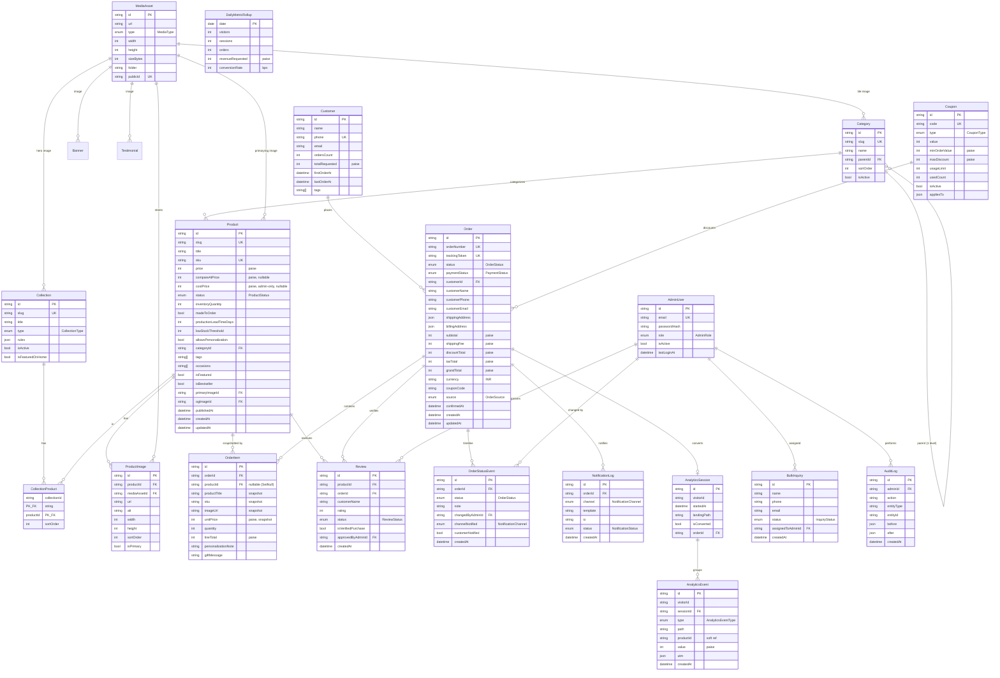

# 03 — Data Model & Entities

> **Project:** `vaani-gift-e-commerce` · **Brand:** GooglyWoogly Art · **Owner-perspective:** Architect
> **Conforms to:** [`00-canonical-decisions.md`](./00-canonical-decisions.md) (CANON). Every entity, field, enum, route, and cache-tag name below is taken verbatim from CANON §5–§12. Where CANON leaves a field-level gap, this spec makes a decisive call and records it under **§11 Open Questions**.
> **Stack anchor:** PostgreSQL (Neon/Supabase, region nearest India) · Prisma ORM · Next.js 16 App Router. Money as **integer paise**, timestamps **UTC in DB → display IST**, slugs/tokens in URLs (never raw IDs).

---

## 1. Purpose & Scope

### 1.1 What this document covers
This is the **authoritative physical data model** for the entire platform. It expands every CANON entity (§5) into a full field-level table (`field | type | constraints | description`), defines every relationship (1:1, 1:N, N:M) and join table, specifies every enum (§6), declares all indexes for known query patterns, and provides a complete `mermaid erDiagram` plus a representative Prisma schema excerpt for the core catalog + commerce entities.

It is organized by the eight CANON entity groups:

| Group | Entities |
|---|---|
| **Catalog** | `Product`, `ProductImage`, `Category`, `Collection`, `CollectionProduct`, `MediaAsset` |
| **Commerce** | `Order`, `OrderItem`, `OrderStatusEvent`, `Customer` |
| **Leads & contact** | `BulkInquiry`, `ContactMessage`, `NewsletterSubscriber` |
| **Marketing (V1)** | `Coupon`, `Review` |
| **Content / CMS** | `HomepageSection`, `Banner`, `Testimonial`, `FaqItem`, `CmsPage`, `SiteSetting` |
| **Ops** | `AdminUser`, `AuditLog` |
| **Notifications** | `NotificationLog`, `EmailTemplate` |
| **Analytics** | `AnalyticsEvent`, `AnalyticsSession`, `DailyMetricRollup` |

It also defines **cross-cutting conventions** (§3.2): money, IDs, slugs, timestamps, audit fields, soft-delete/archival, value-snapshotting, and JSON sub-shapes.

### 1.2 What this document does NOT cover
- **Business logic / workflows** — order state machine *implementation*, revalidation triggers, inventory derivation logic beyond the stored fields. (See `08`, `09`, `11`, `12`.)
- **Server Action / API signatures in full** — only the **read/write footprint per entity** and the cache tags each mutation revalidates (§6). Full Zod schemas live in the feature specs.
- **UI** — this is a schema doc; §4 gives only the thin admin-data-management UI implied by the model.
- **Migrations runbook / seeding scripts** — see `02 System Architecture`.
- **No variants, no on-site payments, no shopper accounts** — these are explicitly out of scope (CANON §3); the schema is *architected not to preclude* them (§3.4) but does not implement them.

---

## 2. Primary user stories / jobs-to-be-done

| # | As a… | I want… | so that… |
|---|---|---|---|
| JTBD-1 | Backend engineer | one Prisma schema that names entities/fields/enums exactly as the specs reference them | feature code, queries, and migrations line up with no translation layer. |
| JTBD-2 | Founder (admin) | every product, order, lead, and CMS block to persist reliably with audit history | I can run the business from my phone and trust the records. |
| JTBD-3 | Storefront (RSC) | fast slug/category/collection lookups and full-text search | catalog pages render server-side within Core-Web-Vitals budgets. |
| JTBD-4 | Customer (guest) | my placed order to be retrievable forever via an opaque token, with a value-frozen receipt | I see exactly what I ordered and its live status even if the product later changes or is deleted. |
| JTBD-5 | Analytics rollup job | append-only events + nightly aggregates keyed by date | dashboards load instantly without scanning the raw event firehose. |
| JTBD-6 | Compliance (DPDP) | PII isolated, minimal, and purgeable | I can honor consent, retention, and deletion requests. |
| JTBD-7 | Future engineer | the model to extend to variants / payments / accounts | V2 features bolt on without a destructive rewrite. |

---

## 3. Detailed functional requirements

### 3.1 Global modelling rules

- **FR-1 — Authoritative names.** Entity, field, and enum names MUST match CANON §5/§6 character-for-character. Prisma `model`/`enum`/field identifiers use those names (camelCase fields, PascalCase models/enums). DB table/column names are snake_cased via `@@map`/`@map` (e.g. `Product` → `products`, `inventoryQuantity` → `inventory_quantity`).
- **FR-2 — Primary keys.** Every entity has a primary key `id` of type **`cuid()`** (`String @id @default(cuid())`), **except**: `DailyMetricRollup` (PK = `date`), and singleton-style `SiteSetting` (single row, see FR-30). IDs are internal and **never appear in storefront URLs** (CANON §10) — slugs and tokens are used instead.
- **FR-3 — Money is integer paise.** All monetary fields are `Int` representing **paise** (₹1 = 100 paise). Never float/`Decimal`. Naming convention is unchanged from CANON (`price`, `compareAtPrice`, `subtotal`, `grandTotal`, …) but the stored unit is paise. Display layer divides by 100 and formats with `en-IN` grouping + `₹`. `currency` is the literal `"INR"` (string, default `"INR"`) on `Order`.
- **FR-4 — Timestamps.** Stored as `DateTime @db.Timestamptz(3)` in **UTC**. Standard audit pair on mutable entities: `createdAt DateTime @default(now())` and `updatedAt DateTime @updatedAt`. Append-only/event entities carry `createdAt` only. Display is converted to **IST (Asia/Kolkata)**.
- **FR-5 — Slugs.** `slug String @unique` per entity, lowercase kebab-case ASCII, auto-generated from title, editable, immutable-by-default once published (renames are handled by `Redirect`, FR-31). Indexed for O(1) lookup.
- **FR-6 — Enums are DB-native.** All CANON §6 enums are declared as Postgres `enum` types via Prisma `enum` (§3.3). New enum members append at the end (Postgres `ADD VALUE` is non-breaking).
- **FR-7 — JSON columns** use `Json @db.JsonB` (queryable, indexable). Every JSON column has a documented TypeScript shape (§3.5); shapes are validated with Zod at the application boundary, not by the DB.
- **FR-8 — Referential integrity & delete behavior** is explicit on every relation (§3.6). Customer-facing historical records (`OrderItem`) never cascade-delete with their source product.

### 3.2 Cross-cutting field conventions

- **FR-9 — Audit fields.** Mutable catalog/commerce/CMS entities carry `createdAt` + `updatedAt`. Admin-mutated entities additionally record the actor through `AuditLog` (FR-32) and, where CANON names it, an inline `…ByAdminId` (e.g. `OrderStatusEvent.changedByAdminId`, `Review.approvedByAdminId`).
- **FR-10 — Soft-delete vs archival.** No global soft-delete column. **Archival** is modeled with domain status enums per CANON:
  - `Product.status = archived` (CANON `ProductStatus`) — hidden from storefront, retained for order history & analytics. **This is the product "delete".** Hard deletion is blocked once a product has any `OrderItem`.
  - `Category.isActive`, `Collection.isActive`, `Banner.isActive`, `FaqItem.isPublished`, `CmsPage.isPublished`, `NewsletterSubscriber.isActive`, `AdminUser.isActive`, `Testimonial.isApproved` — boolean visibility/lifecycle flags (already in CANON).
  - Leads (`BulkInquiry`, `ContactMessage`) close via their status enum, never deleted (CRM history + DPDP audit).
- **FR-11 — Value snapshots (OrderItem).** `OrderItem` **copies** `productTitle, sku, imageUrl, unitPrice` (and personalization) from `Product` at placement time. After placement these are frozen and independent of later product edits, price changes, archival, or hard-deletion. `productId` is a **nullable** soft reference (set null on product delete) — the snapshot remains valid without it.
- **FR-12 — Derived/computed fields are NOT stored** unless CANON lists them. `Product.inventoryState` (CANON marks it *derived for display*) is **computed at read-time** from `madeToOrder`, `inventoryQuantity`, `lowStockThreshold` per the CANON §6 rule and is therefore **not** a persisted column. `Customer.ordersCount/totalRequested/firstOrderAt/lastOrderAt` are **denormalized caches** maintained transactionally on order placement/cancellation (CANON lists them as fields → stored).

### 3.3 Enums (authoritative — CANON §6)

| Enum | Members (in order) | Used by |
|---|---|---|
| `ProductStatus` | `draft`, `active`, `archived` | `Product.status` |
| `InventoryState` *(derived, not stored)* | `in_stock`, `low_stock`, `out_of_stock`, `made_to_order` | computed for display only |
| `OrderStatus` | `pending_confirmation`, `confirmed`, `in_production`, `ready_to_ship`, `shipped`, `delivered`, `cancelled`, `on_hold` | `Order.status`, `OrderStatusEvent.status` |
| `PaymentStatus` | `unpaid`, `awaiting_payment`, `paid`, `partially_paid`, `refunded` | `Order.paymentStatus` |
| `InquiryStatus` | `new`, `contacted`, `quoted`, `won`, `lost`, `closed` | `BulkInquiry.status` |
| `ReviewStatus` | `pending`, `approved`, `rejected` | `Review.status` |
| `AdminRole` | `owner`, `admin`, `staff` | `AdminUser.role` |
| `CollectionType` | `manual`, `automated` | `Collection.type` |
| `NotificationChannel` | `email`, `sms`, `whatsapp`, `system` | `OrderStatusEvent.channelNotified`, `NotificationLog.channel` |
| `NotificationStatus` | `queued`, `sent`, `failed`, `skipped` | `NotificationLog.status` |
| `AnalyticsEventType` | `page_view`, `product_view`, `category_view`, `collection_view`, `search`, `filter_apply`, `add_to_cart`, `remove_from_cart`, `update_cart`, `begin_checkout`, `place_order`, `order_confirmed`, `whatsapp_click`, `bulk_inquiry_submit`, `contact_submit`, `newsletter_signup`, `outbound_click` | `AnalyticsEvent.type` |

**Supporting enums introduced by this spec** (CANON references the underlying values but does not name an enum — recorded in §11):

| Enum | Members | Rationale |
|---|---|---|
| `CouponType` | `percentage`, `fixed`, `free_shipping` | CANON `Coupon.type` value set. |
| `BannerType` | `marquee`, `hero`, `promo` | CANON `Banner.type` value set. |
| `MediaType` | `image`, `video`, `document` | CANON `MediaAsset.type` / `Banner` media; image-only in MVP. |
| `ContactStatus` | `new`, `read`, `replied`, `archived` | CANON `ContactMessage.status` (untyped in CANON). |
| `OrderSource` | `web_checkout`, `bulk_inquiry`, `admin_manual`, `whatsapp` | CANON `Order.source` (untyped). Default `web_checkout`. |
| `NewsletterSource` / `SubscriberSource` | `footer`, `checkout`, `popup`, `bulk_form`, `import` | CANON `NewsletterSubscriber.source` / `AnalyticsSession` provenance. |
| `DeviceType` | `mobile`, `tablet`, `desktop`, `bot` | CANON `AnalyticsEvent.device` / `AnalyticsSession.device`. |
| `HomepageSectionType` | `hero`, `featured_products`, `featured_collections`, `category_grid`, `bestsellers`, `testimonials`, `banner`, `story`, `instagram`, `newsletter`, `faq`, `rich_text` | CANON `HomepageSection.type` (open-ended in CANON; enumerated for renderer safety). |

> All "supporting" enums are stored as Postgres enums for integrity; adding members later is non-breaking.

### 3.4 Architected-for-growth (no implementation now)

- **FR-13 — Variants-ready.** `Product` keeps `sku`, `price`, `inventoryQuantity` **on the product row** (single-listing). A future `ProductVariant` table can attach via `productId` without altering `Product`. **Not built now.**
- **FR-14 — Payments-ready.** `Order.paymentStatus` (`PaymentStatus`) is an **independent axis** from `Order.status` (CANON §7). A future `Payment`/`Transaction` table (gateway refs) attaches via `orderId`. **Not built now.**
- **FR-15 — Accounts-ready.** `Customer` is a **derived CRM record keyed by phone/email, with no auth fields** (no `passwordHash`). A future `ShopperAccount` can FK to `Customer`. **Not built now.**

### 3.5 JSON column shapes (documented; Zod-validated at boundary)

| Entity.field | TypeScript shape |
|---|---|
| `Product.dimensions` | `{ length?: number; width?: number; height?: number; diameter?: number; unit: "cm" \| "in" }` |
| `Order.shippingAddress` / `Order.billingAddress` | `Address` = `{ fullName: string; phone: string; line1: string; line2?: string; landmark?: string; city: string; state: string /* Indian state/UT */; pincode: string /* 6-digit */; country: "IN" }` |
| `Collection.rules` | `{ match: "all" \| "any"; conditions: Array<{ field: "category" \| "tag" \| "occasion" \| "price" \| "isBestseller" \| "isFeatured"; op: "eq" \| "in" \| "lte" \| "gte"; value: string \| number \| string[] }> }` (only used when `type = automated`) |
| `HomepageSection.payload` | discriminated union keyed by `HomepageSectionType` (e.g. `hero → { headline, sub, ctaLabel, ctaHref, mediaId }`; `featured_products → { collectionId? , productIds?: string[], limit }`) |
| `SiteSetting.socialLinks` | `{ instagram?: string; facebook?: string; pinterest?: string; youtube?: string; whatsapp?: string }` |
| `SiteSetting.shippingDefaults` | `{ flatRatePaise: number; freeShippingThresholdPaise: number; codEnabled: boolean }` |
| `SiteSetting.defaultSeo` | `{ titleTemplate: string; defaultDescription: string; ogImageId?: string; twitterHandle?: string }` |
| `SiteSetting.announcementBar` | `{ enabled: boolean; text: string; href?: string }` |
| `SiteSetting.businessAddress` | `Address`-like + `{ gstin?: string; legalName: string }` |
| `Coupon.appliesTo` | `{ scope: "all" \| "products" \| "categories" \| "collections"; ids?: string[] }` |
| `AnalyticsEvent.utm` / `AnalyticsSession.utm` | `{ source?: string; medium?: string; campaign?: string; term?: string; content?: string }` |
| `AnalyticsEvent.metadata` | free-form `Record<string, string \| number \| boolean>` (e.g. `{ query, resultsCount, filterKey }`) |
| `DailyMetricRollup.topProducts/topReferrers/topPages` | `Array<{ key: string; label: string; count: number; valuePaise?: number }>` |
| `AuditLog.before` / `AuditLog.after` | partial entity snapshot `Record<string, unknown>` (PII redacted per FR-37) |

### 3.6 Relationships & delete behavior (summary)

| Relationship | Cardinality | On delete (parent → child) |
|---|---|---|
| `Category` → `Product` | 1:N | `Restrict` (can't delete a category with products; archive instead) |
| `Category` → `Category` (parent, **one level**) | 1:N self | `SetNull` |
| `Collection` ⇄ `Product` via `CollectionProduct` | N:M | `Cascade` on the join row when either side deleted |
| `Product` → `ProductImage` | 1:N | `Cascade` (images belong to the product) |
| `Product` → `OrderItem` | 1:N (soft) | `SetNull` (snapshot survives; product hard-delete blocked if any `OrderItem` — enforced in app layer, FR-11) |
| `MediaAsset` → many (`Product.primaryImageId/ogImageId`, `Category.imageId`, `Collection.heroImageId`, `Banner.imageId`, `Testimonial.imageId`, `SiteSetting.logoId`) | 1:N each | `SetNull` (library asset outlives references; deletion guarded if referenced — app layer) |
| `Order` → `OrderItem` | 1:N | `Cascade` |
| `Order` → `OrderStatusEvent` | 1:N | `Cascade` |
| `Customer` → `Order` | 1:N | `SetNull` (orders retained if a CRM record is purged for DPDP) |
| `Order` → `NotificationLog` | 1:N | `SetNull` |
| `Order` → `Review` | 1:N (optional) | `SetNull` |
| `Product` → `Review` | 1:N | `Cascade` |
| `AdminUser` → `AuditLog` / `OrderStatusEvent.changedByAdminId` / `Review.approvedByAdminId` / `BulkInquiry.assignedToAdminId` | 1:N | `Restrict` / `SetNull` (keep audit trail; never orphan history → `SetNull`, except `AuditLog.adminId` which is `Restrict`) |

### 3.7 Per-entity field tables

Legend — **Constraints:** PK = primary key · FK = foreign key · U = unique · NN = not null (no `?`) · `?` = nullable · `dflt` = default. Types are Prisma types; `paise` = `Int` in paise.

#### 3.7.1 Catalog group

**`Product`** (`products`)

| Field | Type | Constraints | Description |
|---|---|---|---|
| `id` | String | PK, cuid | Internal id (never in URLs). |
| `slug` | String | U, NN | Kebab URL key; immutable-by-default post-publish. |
| `title` | String | NN | Display name. |
| `subtitle` | String | ? | Short tagline under title. |
| `description` | String `@db.Text` | NN | **Rich** body (sanitized HTML/MDX). |
| `shortDescription` | String | ? | Card/meta summary (≤200 chars recommended). |
| `sku` | String | U, NN | Stock-keeping unit; unique. |
| `price` | Int (paise) | NN | Current selling price. |
| `compareAtPrice` | Int (paise) | ? | Strikethrough/"was" price; must be `> price` when set. |
| `costPrice` | Int (paise) | ? | **Admin-only** cost (never sent to storefront). |
| `status` | `ProductStatus` | NN, dflt `draft` | `draft\|active\|archived`. Storefront shows `active` only. |
| `inventoryQuantity` | Int | NN, dflt `0` | On-hand units. |
| `madeToOrder` | Boolean | NN, dflt `false` | If true → always orderable; show lead time. |
| `productionLeadTimeDays` | Int | ? | Lead time when `madeToOrder` (or low stock). |
| `lowStockThreshold` | Int | NN, dflt `3` | At/below → `low_stock` (display). |
| `allowsPersonalization` | Boolean | NN, dflt `false` | Enables personalization input on PDP. |
| `personalizationLabel` | String | ? | Prompt copy, e.g. "Name to engrave". |
| `materials` | String | ? | Free text (e.g. "Mango wood, brass"). |
| `careInstructions` | String `@db.Text` | ? | Care/handling copy. |
| `dimensions` | Json `@db.JsonB` | ? | See §3.5 shape. |
| `weightGrams` | Int | ? | Shipping weight. |
| `categoryId` | String | FK→`Category.id`, ?, **idx** | Taxonomy parent (one). |
| `tags` | String[] | dflt `[]`, **GIN idx** | Free tags for search/automation. |
| `occasions` | String[] | dflt `[]`, **GIN idx** | Diwali, Rakhi, wedding… (CANON §11). |
| `isFeatured` | Boolean | NN, dflt `false`, **idx** | Homepage/feature eligibility. |
| `isBestseller` | Boolean | NN, dflt `false`, **idx** | Bestseller flag. |
| `metaTitle` | String | ? | SEO title override. |
| `metaDescription` | String | ? | SEO description override. |
| `ogImageId` | String | FK→`MediaAsset.id`, ? | Social share image. |
| `primaryImageId` | String | FK→`MediaAsset.id`, ? | Hero/thumbnail image. |
| `publishedAt` | DateTime | ?, **idx** | First publish moment (drives "new"). |
| `createdAt` | DateTime | NN, dflt now | Audit. |
| `updatedAt` | DateTime | NN, `@updatedAt` | Audit. |
| `searchVector` | Unsupported `tsvector` | ?, **GIN idx** | Generated FTS vector (title+subtitle+shortDescription+tags). See FR-25. |

> `inventoryState` is **not** a column (FR-12); derived at read time.

**`ProductImage`** (`product_images`)

| Field | Type | Constraints | Description |
|---|---|---|---|
| `id` | String | PK, cuid | |
| `productId` | String | FK→`Product.id` (Cascade), NN, **idx** | Owner product. |
| `mediaAssetId` | String | FK→`MediaAsset.id`, ? | Optional link to central library (FR-16). |
| `url` | String | NN | Direct/Cloudinary URL (denormalized for render speed). |
| `alt` | String | ? | Accessibility alt text. |
| `width` | Int | ? | Intrinsic width (CLS-safe). |
| `height` | Int | ? | Intrinsic height. |
| `sortOrder` | Int | NN, dflt `0`, **idx (productId, sortOrder)** | Gallery order. |
| `isPrimary` | Boolean | NN, dflt `false` | Marks the primary image (mirrors `Product.primaryImageId`). |

**`Category`** (`categories`)

| Field | Type | Constraints | Description |
|---|---|---|---|
| `id` | String | PK, cuid | |
| `slug` | String | U, NN | URL key (`/category/[slug]`). |
| `name` | String | NN | Display name. |
| `description` | String `@db.Text` | ? | Intro copy for PLP header/SEO. |
| `imageId` | String | FK→`MediaAsset.id`, ? | Category tile image. |
| `parentId` | String | FK→`Category.id` (SetNull), ?, **idx** | One-level parent only (app-enforced depth=1). |
| `sortOrder` | Int | NN, dflt `0` | Nav/listing order. |
| `isActive` | Boolean | NN, dflt `true`, **idx** | Visibility. |
| `metaTitle` | String | ? | SEO. |
| `metaDescription` | String | ? | SEO. |
| `createdAt` | DateTime | NN, dflt now | Audit. |
| `updatedAt` | DateTime | NN, `@updatedAt` | Audit. |

**`Collection`** (`collections`)

| Field | Type | Constraints | Description |
|---|---|---|---|
| `id` | String | PK, cuid | |
| `slug` | String | U, NN | URL key (`/collections/[slug]`). |
| `title` | String | NN | Display title. |
| `description` | String `@db.Text` | ? | Landing copy. |
| `heroImageId` | String | FK→`MediaAsset.id`, ? | Hero banner. |
| `type` | `CollectionType` | NN, dflt `manual` | `manual\|automated`. |
| `rules` | Json `@db.JsonB` | ? | Automation rules (§3.5); used when `automated`. |
| `sortOrder` | Int | NN, dflt `0` | Order. |
| `isActive` | Boolean | NN, dflt `true`, **idx** | Visibility. |
| `isFeaturedOnHome` | Boolean | NN, dflt `false`, **idx** | Home feature eligibility. |
| `metaTitle` | String | ? | SEO. |
| `metaDescription` | String | ? | SEO. |
| `createdAt` | DateTime | NN, dflt now | Audit. |
| `updatedAt` | DateTime | NN, `@updatedAt` | Audit. |

**`CollectionProduct`** (`collection_products`) — N:M join (manual collections)

| Field | Type | Constraints | Description |
|---|---|---|---|
| `collectionId` | String | FK→`Collection.id` (Cascade), NN, **PK part** | |
| `productId` | String | FK→`Product.id` (Cascade), NN, **PK part** | |
| `sortOrder` | Int | NN, dflt `0` | Manual ordering inside the collection. |

> Composite PK `@@id([collectionId, productId])`; secondary index `@@index([productId])` for reverse lookups.

**`MediaAsset`** (`media_assets`) — central library

| Field | Type | Constraints | Description |
|---|---|---|---|
| `id` | String | PK, cuid | |
| `url` | String | NN | Cloudinary (or alt) URL. |
| `alt` | String | ? | Default alt text. |
| `type` | `MediaType` | NN, dflt `image` | image/video/document. |
| `width` | Int | ? | Intrinsic width. |
| `height` | Int | ? | Intrinsic height. |
| `sizeBytes` | Int | ? | File size. |
| `folder` | String | ?, **idx** | Logical folder (e.g. `products`, `banners`). |
| `publicId` | String | ?, U | Cloudinary public_id (for deletion/transform). *(added, FR-16)* |
| `createdAt` | DateTime | NN, dflt now | Audit. |

#### 3.7.2 Commerce group

**`Order`** (`orders`)

| Field | Type | Constraints | Description |
|---|---|---|---|
| `id` | String | PK, cuid | |
| `orderNumber` | String | U, NN, **idx** | `GW-{YYYY}-{seq}` (CANON §10), customer-facing. |
| `trackingToken` | String | U, NN, **idx** | 24+ char nanoid; only key to `/track/[token]`; never indexed by search engines. |
| `status` | `OrderStatus` | NN, dflt `pending_confirmation`, **idx** | Fulfillment axis. |
| `paymentStatus` | `PaymentStatus` | NN, dflt `unpaid`, **idx** | Offline payment axis (independent). |
| `customerId` | String | FK→`Customer.id` (SetNull), ?, **idx** | Linked CRM record. |
| `customerName` | String | NN | Snapshot at order time. |
| `customerPhone` | String | NN, **idx** | Snapshot; primary WhatsApp contact. |
| `customerEmail` | String | NN, **idx** | Snapshot; transactional email target. |
| `shippingAddress` | Json `@db.JsonB` | NN | `Address` (§3.5). |
| `billingAddress` | Json `@db.JsonB` | ? | `Address`; null ⇒ same as shipping. |
| `subtotal` | Int (paise) | NN | Σ line totals before fees/discount/tax. |
| `shippingFee` | Int (paise) | NN, dflt `0` | Flat or 0 if over threshold. |
| `discountTotal` | Int (paise) | NN, dflt `0` | Coupon/discount applied (V1). |
| `taxTotal` | Int (paise) | NN, dflt `0` | GST when enabled (V1). |
| `grandTotal` | Int (paise) | NN | `subtotal + shippingFee + taxTotal − discountTotal`. **Revenue-requested** basis. |
| `currency` | String | NN, dflt `"INR"` | Fixed `INR` (MVP). |
| `couponCode` | String | ?, **idx** | Applied coupon code (denormalized; V1). |
| `customerNote` | String `@db.Text` | ? | Buyer note. |
| `giftMessage` | String `@db.Text` | ? | Order-level gift message. |
| `source` | `OrderSource` | NN, dflt `web_checkout` | Channel of origin. |
| `confirmedAt` | DateTime | ? | When founder confirmed (status→confirmed). |
| `createdAt` | DateTime | NN, dflt now, **idx** | Placement time (analytics/sorting). |
| `updatedAt` | DateTime | NN, `@updatedAt` | Audit. |

**`OrderItem`** (`order_items`) — **value snapshot** (FR-11)

| Field | Type | Constraints | Description |
|---|---|---|---|
| `id` | String | PK, cuid | |
| `orderId` | String | FK→`Order.id` (Cascade), NN, **idx** | Parent order. |
| `productId` | String | FK→`Product.id` (SetNull), ?, **idx** | Soft ref; may be null if product later hard-deleted. |
| `productTitle` | String | NN | **Snapshot** of title at purchase. |
| `sku` | String | NN | **Snapshot** SKU. |
| `imageUrl` | String | ? | **Snapshot** image URL. |
| `unitPrice` | Int (paise) | NN | **Snapshot** unit price. |
| `quantity` | Int | NN, ≥1 | Units ordered. |
| `lineTotal` | Int (paise) | NN | `unitPrice × quantity` (frozen). |
| `personalizationNote` | String | ? | Per-item personalization text. |
| `giftMessage` | String | ? | Per-item gift message. |

**`OrderStatusEvent`** (`order_status_events`) — timeline (append-only)

| Field | Type | Constraints | Description |
|---|---|---|---|
| `id` | String | PK, cuid | |
| `orderId` | String | FK→`Order.id` (Cascade), NN, **idx (orderId, createdAt)** | Parent order. |
| `status` | `OrderStatus` | NN | Status entered at this step. |
| `note` | String `@db.Text` | ? | Admin/customer-visible note (e.g. courier + tracking no.). |
| `changedByAdminId` | String | FK→`AdminUser.id` (SetNull), ? | Actor (null = system/automation). |
| `channelNotified` | `NotificationChannel` | ? | Channel used to notify (email/whatsapp/…). |
| `customerNotified` | Boolean | NN, dflt `false` | Whether the customer was notified. |
| `createdAt` | DateTime | NN, dflt now | Event time. |

**`Customer`** (`customers`) — derived CRM (no login)

| Field | Type | Constraints | Description |
|---|---|---|---|
| `id` | String | PK, cuid | |
| `name` | String | NN | Latest known name. |
| `phone` | String | U, NN, **idx** | Identity key (E.164/normalized). |
| `email` | String | ?, **idx** | Secondary identity key. |
| `ordersCount` | Int | NN, dflt `0` | Denormalized cache (FR-12). |
| `totalRequested` | Int (paise) | NN, dflt `0` | Σ `grandTotal` of placed orders (revenue-requested). |
| `firstOrderAt` | DateTime | ? | First order time. |
| `lastOrderAt` | DateTime | ?, **idx** | Most recent order time. |
| `tags` | String[] | dflt `[]` | CRM tags (e.g. `vip`, `repeat`). |
| `notes` | String `@db.Text` | ? | Admin notes. |
| `createdAt` | DateTime | NN, dflt now | Audit. |
| `updatedAt` | DateTime | NN, `@updatedAt` | Audit. |

> Identity resolution: match on normalized `phone` first, then `email`. `@@unique([phone])`; `email` indexed but not unique (a phone may change email).

#### 3.7.3 Leads & contact group

**`BulkInquiry`** (`bulk_inquiries`)

| Field | Type | Constraints | Description |
|---|---|---|---|
| `id` | String | PK, cuid | |
| `name` | String | NN | Contact name. |
| `company` | String | ? | Company/org. |
| `phone` | String | NN, **idx** | Contact phone. |
| `email` | String | NN, **idx** | Contact email. |
| `productInterest` | String | ? | Free text / product/category interest. |
| `quantity` | Int | ? | Requested quantity. |
| `occasion` | String | ? | Corporate occasion (Diwali gifting…). |
| `budget` | Int (paise) | ? | Indicative budget. |
| `deadline` | DateTime | ? | Needed-by date. |
| `message` | String `@db.Text` | NN | Inquiry body. |
| `status` | `InquiryStatus` | NN, dflt `new`, **idx** | Lead pipeline stage. |
| `assignedToAdminId` | String | FK→`AdminUser.id` (SetNull), ? | Owner. |
| `internalNotes` | String `@db.Text` | ? | Admin-only notes. |
| `createdAt` | DateTime | NN, dflt now, **idx** | Submitted at. |
| `updatedAt` | DateTime | NN, `@updatedAt` | Audit. |

**`ContactMessage`** (`contact_messages`)

| Field | Type | Constraints | Description |
|---|---|---|---|
| `id` | String | PK, cuid | |
| `name` | String | NN | Sender name. |
| `email` | String | NN, **idx** | Sender email. |
| `phone` | String | ? | Optional phone. |
| `subject` | String | ? | Subject line. |
| `message` | String `@db.Text` | NN | Body. |
| `status` | `ContactStatus` | NN, dflt `new`, **idx** | new/read/replied/archived. |
| `createdAt` | DateTime | NN, dflt now, **idx** | Received at. |

**`NewsletterSubscriber`** (`newsletter_subscribers`)

| Field | Type | Constraints | Description |
|---|---|---|---|
| `id` | String | PK, cuid | |
| `email` | String | U, NN, **idx** | Subscriber email (unique). |
| `source` | `SubscriberSource` | NN, dflt `footer` | Capture point. |
| `isActive` | Boolean | NN, dflt `true`, **idx** | Subscription status (unsub → false). |
| `subscribedAt` | DateTime | NN, dflt now | Opt-in time (consent record, DPDP). |
| `unsubscribedAt` | DateTime | ? | Opt-out time. *(added, FR-36)* |

#### 3.7.4 Marketing group (V1)

**`Coupon`** (`coupons`)

| Field | Type | Constraints | Description |
|---|---|---|---|
| `id` | String | PK, cuid | |
| `code` | String | U, NN, **idx** | Case-insensitive code (stored upper). |
| `type` | `CouponType` | NN | percentage/fixed/free_shipping. |
| `value` | Int | NN | percent (1–100) **or** fixed paise (by `type`). |
| `minOrderValue` | Int (paise) | ? | Threshold to apply. |
| `maxDiscount` | Int (paise) | ? | Cap for percentage. |
| `usageLimit` | Int | ? | Global redemption cap. |
| `usedCount` | Int | NN, dflt `0` | Redemptions so far. |
| `startsAt` | DateTime | ? | Activation. |
| `endsAt` | DateTime | ?, **idx** | Expiry. |
| `isActive` | Boolean | NN, dflt `true`, **idx** | On/off. |
| `appliesTo` | Json `@db.JsonB` | ? | Scope (§3.5). |
| `createdAt` | DateTime | NN, dflt now | Audit. |
| `updatedAt` | DateTime | NN, `@updatedAt` | Audit. |

**`Review`** (`reviews`) — post-order, moderated (V1)

| Field | Type | Constraints | Description |
|---|---|---|---|
| `id` | String | PK, cuid | |
| `productId` | String | FK→`Product.id` (Cascade), NN, **idx (productId, status)** | Reviewed product. |
| `orderId` | String | FK→`Order.id` (SetNull), ? | Source order (verifies purchase). |
| `customerName` | String | NN | Display name. |
| `rating` | Int | NN, 1–5 | Star rating (app-validated). |
| `title` | String | ? | Review headline. |
| `body` | String `@db.Text` | NN | Review text. |
| `status` | `ReviewStatus` | NN, dflt `pending`, **idx** | Moderation state. |
| `isVerifiedPurchase` | Boolean | NN, dflt `false` | True if tied to an order. |
| `imageIds` | String[] | dflt `[]` | Optional review photos (MediaAsset ids). |
| `approvedByAdminId` | String | FK→`AdminUser.id` (SetNull), ? | Moderator. |
| `createdAt` | DateTime | NN, dflt now, **idx** | Submitted at. |
| `updatedAt` | DateTime | NN, `@updatedAt` | Audit. |

#### 3.7.5 Content / CMS group

**`HomepageSection`** (`homepage_sections`)

| Field | Type | Constraints | Description |
|---|---|---|---|
| `id` | String | PK, cuid | |
| `key` | String | U, NN | Stable slot key. |
| `type` | `HomepageSectionType` | NN | Renderer discriminator. |
| `payload` | Json `@db.JsonB` | NN | Block content (§3.5). |
| `sortOrder` | Int | NN, dflt `0`, **idx** | Vertical order. |
| `isActive` | Boolean | NN, dflt `true`, **idx** | Visibility. |
| `createdAt` | DateTime | NN, dflt now | Audit. |
| `updatedAt` | DateTime | NN, `@updatedAt` | Audit. |

**`Banner`** (`banners`)

| Field | Type | Constraints | Description |
|---|---|---|---|
| `id` | String | PK, cuid | |
| `type` | `BannerType` | NN | marquee/hero/promo. |
| `text` | String | ? | Banner text. |
| `imageId` | String | FK→`MediaAsset.id`, ? | Banner image. |
| `link` | String | ? | Click destination. |
| `startsAt` | DateTime | ? | Schedule start. |
| `endsAt` | DateTime | ? | Schedule end. |
| `sortOrder` | Int | NN, dflt `0` | Order. |
| `isActive` | Boolean | NN, dflt `true`, **idx (type, isActive)** | Visibility. |
| `createdAt` | DateTime | NN, dflt now | Audit. |
| `updatedAt` | DateTime | NN, `@updatedAt` | Audit. |

**`Testimonial`** (`testimonials`)

| Field | Type | Constraints | Description |
|---|---|---|---|
| `id` | String | PK, cuid | |
| `customerName` | String | NN | Author. |
| `location` | String | ? | City/area. |
| `rating` | Int | ? | 1–5 (optional). |
| `text` | String `@db.Text` | NN | Quote. |
| `imageId` | String | FK→`MediaAsset.id`, ? | Author/photo. |
| `isApproved` | Boolean | NN, dflt `false`, **idx** | Moderation/visibility. |
| `sortOrder` | Int | NN, dflt `0` | Order. |
| `isFeatured` | Boolean | NN, dflt `false` | Home feature. |
| `createdAt` | DateTime | NN, dflt now | Audit. |
| `updatedAt` | DateTime | NN, `@updatedAt` | Audit. |

**`FaqItem`** (`faq_items`)

| Field | Type | Constraints | Description |
|---|---|---|---|
| `id` | String | PK, cuid | |
| `question` | String | NN | Q. |
| `answer` | String `@db.Text` | NN | A (rich allowed). |
| `category` | String | ?, **idx** | Grouping (Shipping, Orders…). |
| `sortOrder` | Int | NN, dflt `0` | Order within category. |
| `isPublished` | Boolean | NN, dflt `true`, **idx** | Visibility. |
| `createdAt` | DateTime | NN, dflt now | Audit. |
| `updatedAt` | DateTime | NN, `@updatedAt` | Audit. |

**`CmsPage`** (`cms_pages`)

| Field | Type | Constraints | Description |
|---|---|---|---|
| `id` | String | PK, cuid | |
| `slug` | String | U, NN, **idx** | URL key (`/about`, `/privacy-policy`…). |
| `title` | String | NN | Page title. |
| `bodyRich` | String `@db.Text` | NN | Rich body. |
| `metaTitle` | String | ? | SEO. |
| `metaDescription` | String | ? | SEO. |
| `isPublished` | Boolean | NN, dflt `false`, **idx** | Visibility. |
| `createdAt` | DateTime | NN, dflt now | Audit. *(added for consistency)* |
| `updatedAt` | DateTime | NN, `@updatedAt` | Last edit (CANON-listed). |

**`SiteSetting`** (`site_settings`) — singleton (FR-30)

| Field | Type | Constraints | Description |
|---|---|---|---|
| `id` | String | PK, dflt `"singleton"` | Single enforced row. |
| `storeName` | String | NN, dflt `"GooglyWoogly Art"` | Brand name. |
| `contactEmail` | String | NN | Public contact email. |
| `whatsappNumber` | String | NN | `wa.me` number (CANON env `WHATSAPP_NUMBER`). |
| `socialLinks` | Json `@db.JsonB` | ? | §3.5. |
| `shippingDefaults` | Json `@db.JsonB` | ? | §3.5. |
| `freeShippingThreshold` | Int (paise) | ? | Free-shipping cutoff (also in shippingDefaults; kept per CANON). |
| `gstin` | String | ? | When set ⇒ GST invoicing on (CANON §11). |
| `currency` | String | NN, dflt `"INR"` | Store currency. |
| `defaultSeo` | Json `@db.JsonB` | ? | §3.5. |
| `logoId` | String | FK→`MediaAsset.id`, ? | Logo asset. |
| `announcementBar` | Json `@db.JsonB` | ? | §3.5. |
| `businessAddress` | Json `@db.JsonB` | ? | §3.5 (legal/GST). |
| `updatedAt` | DateTime | NN, `@updatedAt` | Audit. |

#### 3.7.6 Ops group

**`AdminUser`** (`admin_users`)

| Field | Type | Constraints | Description |
|---|---|---|---|
| `id` | String | PK, cuid | |
| `name` | String | NN | Display name. |
| `email` | String | U, NN, **idx** | Login id. |
| `passwordHash` | String | NN | bcrypt hash (Auth.js credentials). |
| `role` | `AdminRole` | NN, dflt `staff` | owner/admin/staff. |
| `isActive` | Boolean | NN, dflt `true`, **idx** | Can sign in. |
| `lastLoginAt` | DateTime | ? | Last successful login. |
| `createdAt` | DateTime | NN, dflt now | Audit. *(added)* |
| `updatedAt` | DateTime | NN, `@updatedAt` | Audit. *(added)* |

**`AuditLog`** (`audit_logs`) — append-only

| Field | Type | Constraints | Description |
|---|---|---|---|
| `id` | String | PK, cuid | |
| `adminId` | String | FK→`AdminUser.id` (Restrict), NN, **idx** | Actor. |
| `action` | String | NN, **idx** | e.g. `product.update`, `order.status_change`. |
| `entityType` | String | NN, **idx (entityType, entityId)** | Affected model. |
| `entityId` | String | NN | Affected row id. |
| `before` | Json `@db.JsonB` | ? | Pre-change snapshot (PII-redacted). |
| `after` | Json `@db.JsonB` | ? | Post-change snapshot. |
| `createdAt` | DateTime | NN, dflt now, **idx** | When. |

#### 3.7.7 Notifications group

**`NotificationLog`** (`notification_logs`) — append-only

| Field | Type | Constraints | Description |
|---|---|---|---|
| `id` | String | PK, cuid | |
| `orderId` | String | FK→`Order.id` (SetNull), ?, **idx** | Related order (if any). |
| `channel` | `NotificationChannel` | NN, **idx** | email/sms/whatsapp/system. |
| `template` | String | NN | Template key used. |
| `to` | String | NN | Recipient (email/phone). |
| `subject` | String | ? | Email subject. |
| `status` | `NotificationStatus` | NN, dflt `queued`, **idx** | queued/sent/failed/skipped. |
| `providerMessageId` | String | ? | Resend/MSG91 message id. |
| `error` | String `@db.Text` | ? | Failure detail. |
| `createdAt` | DateTime | NN, dflt now, **idx** | When. |

**`EmailTemplate`** (`email_templates`)

| Field | Type | Constraints | Description |
|---|---|---|---|
| `id` | String | PK, cuid | |
| `key` | String | U, NN, **idx** | e.g. `order_placed`, `order_shipped`. |
| `subject` | String | NN | Subject line (supports vars). |
| `htmlBody` | String `@db.Text` | NN | Body template (React-Email-compatible HTML/handlebars). |
| `variables` | String[] | dflt `[]` | Declared interpolation vars. |
| `createdAt` | DateTime | NN, dflt now | Audit. *(added)* |
| `updatedAt` | DateTime | NN, `@updatedAt` | Audit. *(added)* |

#### 3.7.8 Analytics group

**`AnalyticsEvent`** (`analytics_events`) — append-only firehose

| Field | Type | Constraints | Description |
|---|---|---|---|
| `id` | String | PK, cuid | |
| `visitorId` | String | NN, **idx** | Anonymous device id (1st-party, hashed). |
| `sessionId` | String | FK→`AnalyticsSession.id` (SetNull), ?, **idx** | Owning session. |
| `type` | `AnalyticsEventType` | NN, **idx (type, createdAt)** | CANON event type. |
| `path` | String | NN | Page path. |
| `referrer` | String | ? | Referrer URL. |
| `productId` | String | ?, **idx** | Soft ref (no FK; product may be deleted). |
| `value` | Int (paise) | ? | Monetary value where relevant (place_order). |
| `metadata` | Json `@db.JsonB` | ? | §3.5. |
| `device` | `DeviceType` | ? | Device class. |
| `country` | String | ? | ISO country (geo). |
| `utm` | Json `@db.JsonB` | ? | §3.5. |
| `createdAt` | DateTime | NN, dflt now, **idx (createdAt)** | Event time (rollup key). |

> No FK on `productId` (high write volume; product may be archived/deleted) — it is a loose reference resolved at query time.

**`AnalyticsSession`** (`analytics_sessions`)

| Field | Type | Constraints | Description |
|---|---|---|---|
| `id` | String | PK, cuid | |
| `visitorId` | String | NN, **idx** | Device id. |
| `startedAt` | DateTime | NN, dflt now, **idx** | Session start. |
| `lastSeenAt` | DateTime | NN | Last activity. |
| `landingPath` | String | NN | First page. |
| `referrer` | String | ? | Acquisition referrer. |
| `utm` | Json `@db.JsonB` | ? | §3.5. |
| `device` | `DeviceType` | ? | Device class. |
| `country` | String | ? | Geo. |
| `pageviews` | Int | NN, dflt `0` | Count this session. |
| `isConverted` | Boolean | NN, dflt `false`, **idx** | Did it place an order. |
| `orderId` | String | FK→`Order.id` (SetNull), ? | Resulting order. |

**`DailyMetricRollup`** (`daily_metric_rollups`) — nightly aggregate

| Field | Type | Constraints | Description |
|---|---|---|---|
| `date` | DateTime `@db.Date` | **PK** | IST calendar day (one row/day). |
| `visitors` | Int | NN, dflt `0` | Unique visitors. |
| `sessions` | Int | NN, dflt `0` | Sessions. |
| `pageviews` | Int | NN, dflt `0` | Pageviews. |
| `productViews` | Int | NN, dflt `0` | `product_view` count. |
| `addToCarts` | Int | NN, dflt `0` | `add_to_cart` count. |
| `beginCheckouts` | Int | NN, dflt `0` | `begin_checkout` count. |
| `orders` | Int | NN, dflt `0` | `place_order` count. |
| `revenueRequested` | Int (paise) | NN, dflt `0` | Σ order value (requested). |
| `conversionRate` | Int | NN, dflt `0` | Basis points (place_order/sessions × 10000) — integer, no float. |
| `topProducts` | Json `@db.JsonB` | ? | §3.5. |
| `topReferrers` | Json `@db.JsonB` | ? | §3.5. |
| `topPages` | Json `@db.JsonB` | ? | §3.5. |
| `createdAt` | DateTime | NN, dflt now | Generated at. *(added)* |

#### 3.7.9 Supporting entity (added) — `Redirect` (FR-31)

**`Redirect`** (`redirects`) — 301 map for slug changes

| Field | Type | Constraints | Description |
|---|---|---|---|
| `id` | String | PK, cuid | |
| `fromPath` | String | U, NN, **idx** | Old path (`/products/old-slug`). |
| `toPath` | String | NN | New path. |
| `statusCode` | Int | NN, dflt `301` | 301/302. |
| `createdAt` | DateTime | NN, dflt now | When. |

### 3.8 Sequence / counters

- **FR-33 — Order number sequence.** `orderNumber` = `GW-{YYYY}-{NNNNN}` where `NNNNN` is a **per-year zero-padded sequence** (CANON §10). Implemented via a dedicated `Counter` row table (`{ key: "order:2026", value: Int }`) incremented inside the order-placement transaction to guarantee gap-free, race-safe numbering. *(added, see §11)*

**`Counter`** (`counters`)

| Field | Type | Constraints | Description |
|---|---|---|---|
| `key` | String | PK | e.g. `order:2026`. |
| `value` | Int | NN, dflt `0` | Last issued sequence. |
| `updatedAt` | DateTime | NN, `@updatedAt` | |

---

## 4. UX / UI breakdown (admin data-management surface)

This is a schema spec; the only UI it directly implies is the **admin CRUD** that reads/writes these tables. Full screens are designed in `10`–`15`. Mapping for completeness:

| Admin route (CANON §8) | Primary entities | Read | Write |
|---|---|---|---|
| `/admin` (dashboard) | `DailyMetricRollup`, `Order`, `Product` | counts/KPIs, low-stock, pending orders | — |
| `/admin/products[/new\|/[id]/edit]` | `Product`, `ProductImage`, `MediaAsset`, `Category`, `Collection` | list/detail | create/update/archive; manage images |
| `/admin/categories` | `Category`, `MediaAsset` | tree | CRUD (depth ≤1) |
| `/admin/collections` | `Collection`, `CollectionProduct`, `Product` | list/detail | CRUD; manual membership/order; rules |
| `/admin/inventory` | `Product` | stock list | adjust `inventoryQuantity`, `lowStockThreshold`, `madeToOrder` |
| `/admin/orders[/[id]]` | `Order`, `OrderItem`, `OrderStatusEvent`, `Customer`, `NotificationLog` | list/detail/timeline | status & paymentStatus transitions, notes |
| `/admin/bulk-inquiries` | `BulkInquiry`, `AdminUser` | list/detail | status, assign, notes |
| `/admin/messages` | `ContactMessage` | list/detail | status |
| `/admin/customers` | `Customer`, `Order` | list/detail | tags, notes |
| `/admin/reviews` | `Review`, `Product` | moderation queue | approve/reject (V1) |
| `/admin/coupons` | `Coupon` | list | CRUD (V1) |
| `/admin/content` | `HomepageSection`, `Banner`, `Testimonial`, `FaqItem`, `CmsPage` | list | CRUD/reorder/toggle |
| `/admin/media` | `MediaAsset` | grid | upload/delete/alt |
| `/admin/analytics` | `DailyMetricRollup`, `AnalyticsEvent` | dashboards | — |
| `/admin/settings` | `SiteSetting`, `MediaAsset` | single form | update singleton |
| `/admin/audit-log` | `AuditLog`, `AdminUser` | read-only feed | — |

**Mobile-first admin** (founder runs from a phone): list views collapse to cards; tables become key:value stacks; status changes are single-tap with a confirm sheet (CANON §2.4).

---

## 5. Data & entities used (read vs written) by surface

| Surface | Reads | Writes |
|---|---|---|
| Storefront PLP/PDP (RSC-ISR) | `Product` (status=active), `ProductImage`, `Category`, `Collection`, `CollectionProduct`, `Review` (approved, V1), `MediaAsset` | — (read-only) |
| Storefront analytics beacon | — | `AnalyticsEvent`, `AnalyticsSession` (upsert) |
| Search (`/search`, SSR) | `Product.searchVector` (FTS) | `AnalyticsEvent` (search) |
| Cart (CSR) | `Product` (re-validate price/stock on load) | localStorage only (no DB) |
| Checkout / place order (Server Action) | `Product` (lock & re-validate), `SiteSetting`, `Coupon` (V1) | `Order`, `OrderItem`, `OrderStatusEvent`, `Customer` (upsert), `Counter`, `NotificationLog`, `AnalyticsEvent`/`AnalyticsSession` |
| Track page (`/track/[token]`) | `Order` + `OrderItem` + `OrderStatusEvent` by `trackingToken` | — |
| Bulk-order form | `SiteSetting` | `BulkInquiry`, `AnalyticsEvent` |
| Contact form | `SiteSetting` | `ContactMessage`, `AnalyticsEvent` |
| Newsletter | — | `NewsletterSubscriber` (upsert), `AnalyticsEvent` |
| Admin CRUD | all | per §4 + `AuditLog` (every mutation) |
| Nightly cron | `AnalyticsEvent`, `AnalyticsSession`, `Order` | `DailyMetricRollup` (upsert) |

---

## 6. Server actions / API routes — data footprint & cache tags

> Full Zod schemas live in feature specs; here we fix **inputs (validated), outputs, side effects, and revalidated cache tags** (CANON §9). All admin actions also append an `AuditLog` row.

| Action / route | Inputs (Zod) | Output | Writes | Revalidates (CANON §9 tags) |
|---|---|---|---|---|
| `createProduct` / `updateProduct` | product fields + image ids | `Product` | `Product`, `ProductImage` | `product:{slug}`, `products`, `category:{slug}` (if category changed), affected `collection:{slug}` |
| `archiveProduct` | `{ id }` | ok | `Product.status=archived` | `product:{slug}`, `products` |
| `adjustInventory` | `{ id, inventoryQuantity, lowStockThreshold?, madeToOrder? }` | `Product` | `Product` | `product:{slug}`, `products` |
| `upsertCategory` | category fields | `Category` | `Category` | `category:{slug}`, `products`, `nav` |
| `upsertCollection` / `setCollectionProducts` | collection fields / `{collectionId, productIds[]}` | `Collection` | `Collection`, `CollectionProduct` | `collection:{slug}`, `products` |
| `placeOrder` (storefront) | `{ items[], shippingAddress, billing?, contact, notes?, couponCode? }` | `{ orderNumber, trackingToken }` | `Order`, `OrderItem`, `OrderStatusEvent`, `Customer`, `Counter`, `NotificationLog` | — (no storefront cache; sends email) |
| `transitionOrderStatus` | `{ orderId, toStatus, note?, notify? }` | `Order` | `Order`, `OrderStatusEvent`, `NotificationLog` | — (admin SSR; no public tag) |
| `setPaymentStatus` | `{ orderId, paymentStatus }` | `Order` | `Order`, `OrderStatusEvent` (optional) | — |
| `submitBulkInquiry` | `{ name, phone, email, message, … }` | ok | `BulkInquiry`, `AnalyticsEvent` | `page:bulk-orders` (none of public data; analytics only) |
| `submitContact` | `{ name, email, message, … }` | ok | `ContactMessage`, `AnalyticsEvent` | — |
| `subscribeNewsletter` | `{ email, source }` | ok | `NewsletterSubscriber`, `AnalyticsEvent` | — |
| `upsertHomepageSection` / `reorder` | section payload | ok | `HomepageSection` | `home` |
| `upsertBanner` | banner fields | ok | `Banner` | `banners`, `home` |
| `upsertTestimonial` | testimonial fields | ok | `Testimonial` | `testimonials`, `home` |
| `upsertFaqItem` | faq fields | ok | `FaqItem` | `faq` |
| `publishCmsPage` | page fields | ok | `CmsPage`, maybe `Redirect` | `page:{slug}` |
| `updateSiteSettings` | settings fields | ok | `SiteSetting` | `settings`, `nav` |
| `uploadMedia` / `deleteMedia` | file / `{ id }` | `MediaAsset` | `MediaAsset` | (tag of any entity referencing it) |
| `moderateReview` (V1) | `{ id, status }` | ok | `Review` | `product:{slug}` |
| `recordEvent` (beacon route) | `AnalyticsEvent` shape | 204 | `AnalyticsEvent`, `AnalyticsSession` | — |
| `rollupDaily` (cron) | `{ date }` | ok | `DailyMetricRollup` | — |
| `rebuildSitemap` (cron) | — | ok | — | `products`, `category:*`, `collection:*` |

---

## 7. States & edge cases (data-level)

| Case | Handling |
|---|---|
| **Slug collision** | `@unique` rejects; app appends `-2`, `-3`… on auto-gen. |
| **Slug renamed post-publish** | Create `Redirect(fromPath→toPath, 301)`; old URL keeps ranking. |
| **Out-of-stock at add-to-cart** | Read-time `inventoryState` derivation; `out_of_stock` blocks add unless `madeToOrder`. |
| **Made-to-order** | `madeToOrder=true` always orderable; surface `productionLeadTimeDays`; never `out_of_stock`. |
| **Price/stock changed between cart and checkout** | `placeOrder` re-reads `Product` inside a transaction; if `unitPrice` differs or stock insufficient (and not MTO) → return a `priceChanged`/`stockChanged` result; OrderItem snapshots the **confirmed** price. |
| **Concurrent stock decrement** | Decrement guarded in the placement transaction (`update … where inventoryQuantity >= qty`); 0 rows → out-of-stock error. |
| **Product archived/deleted after order** | `OrderItem` snapshot (FR-11) keeps title/price/image; `productId` → null on hard delete; track page renders from snapshot. |
| **Duplicate newsletter / repeat customer** | `email`/`phone` upsert (idempotent); `Customer` counters incremented, not duplicated. |
| **Order number race** | `Counter` row update inside the placement transaction → gap-free, unique `orderNumber`. |
| **Tracking token guess** | 24+ char nanoid, unindexed-by-search, `noindex`; token is the sole authz to `/track`. |
| **Coupon over-redeemed/expired** (V1) | `usageLimit`, `startsAt/endsAt`, `isActive` checked atomically; `usedCount` incremented in txn. |
| **Category delete with products** | `Restrict` → blocked; admin must reassign/archive first. |
| **Media delete while referenced** | App-layer guard checks references; offers detach or block; FK `SetNull` as backstop. |
| **GST toggling** | `SiteSetting.gstin` set ⇒ `taxTotal` computed on new orders; historical orders keep their snapshot `taxTotal`. |
| **DPDP deletion request** | Purge/anonymize `Customer` PII + `Order` contact snapshot; `Order` financial/line records retained (legal), FKs `SetNull`. |
| **Analytics PII** | `AnalyticsEvent` stores hashed `visitorId` only; no name/email/phone in events. |

---

## 8. SEO / performance / accessibility (data-level)

- **Indexes back SEO routes:** unique slug indexes on `Product/Category/Collection/CmsPage` make `generateStaticParams` + `/[slug]` lookups O(1); `Redirect.fromPath` index serves 301s.
- **Per-entity SEO fields** (`metaTitle`, `metaDescription`, `ogImageId`) are first-class columns so structured data + OG tags render server-side.
- **CLS:** `ProductImage.width/height` + `MediaAsset.width/height` persisted to reserve layout space.
- **Full-text search** via `Product.searchVector` (`tsvector` + GIN) keeps `/search` server-side and fast (CANON: Postgres FTS/trigram MVP).
- **Money/locale integrity:** integer paise prevents rounding drift; display formatting (`en-IN`, `₹`, IST) is presentational, never stored.
- **A11y data:** `alt` on `ProductImage`/`MediaAsset` is a modeled field so missing alt-text is detectable/queryable.

---

## 9. Analytics events emitted (CANON `AnalyticsEventType`)

All persisted to `AnalyticsEvent` (+ session upsert). The data model **stores** every CANON type:

`page_view`, `product_view`, `category_view`, `collection_view`, `search`, `filter_apply`, `add_to_cart`, `remove_from_cart`, `update_cart`, `begin_checkout`, `place_order`, `order_confirmed`, `whatsapp_click`, `bulk_inquiry_submit`, `contact_submit`, `newsletter_signup`, `outbound_click`.

Funnel rollup (CANON §12) reads `page_view → product_view → add_to_cart → begin_checkout → place_order` from `AnalyticsEvent` into `DailyMetricRollup`.

---

## 10. Acceptance criteria

- [ ] **AC-1** A Prisma schema exists declaring **every** CANON §5 entity with the exact field names from CANON §5, plus the cross-cutting fields specified here.
- [ ] **AC-2** All CANON §6 enums exist as Prisma/Postgres enums with members in the exact order listed; supporting enums (§3.3) exist.
- [ ] **AC-3** `prisma migrate dev` applies cleanly on PostgreSQL; `prisma validate` passes; generated client typechecks.
- [ ] **AC-4** All monetary fields are `Int` (paise); no `Float`/`Decimal` for money anywhere.
- [ ] **AC-5** All timestamps are `Timestamptz`; mutable entities have `createdAt` + `updatedAt`.
- [ ] **AC-6** Unique constraints exist on `Product.slug`, `Product.sku`, `Category.slug`, `Collection.slug`, `CmsPage.slug`, `Order.orderNumber`, `Order.trackingToken`, `Customer.phone`, `NewsletterSubscriber.email`, `AdminUser.email`, `Coupon.code`, `EmailTemplate.key`, `HomepageSection.key`, `Redirect.fromPath`.
- [ ] **AC-7** `CollectionProduct` has composite PK `(collectionId, productId)` + reverse index on `productId`.
- [ ] **AC-8** Indexes exist for: orders by `status`/`paymentStatus`/`createdAt`; `OrderStatusEvent(orderId, createdAt)`; analytics by `type`+`createdAt` and by `createdAt`; product `tags`/`occasions` (GIN); product FTS (GIN on `searchVector`); leads by `status`+`createdAt`.
- [ ] **AC-9** `OrderItem` persists snapshot fields (`productTitle, sku, imageUrl, unitPrice, lineTotal`) and survives product archival/hard-delete (`productId` `SetNull`).
- [ ] **AC-10** `Product.inventoryState` is **not** a stored column (derived at read time per CANON rule).
- [ ] **AC-11** Delete behaviors match §3.6 (category `Restrict`; order children `Cascade`; product→OrderItem `SetNull`; media refs `SetNull`).
- [ ] **AC-12** `SiteSetting` is enforced as a single row; `DailyMetricRollup` keyed by `date`.
- [ ] **AC-13** A complete `erDiagram` (this doc) and a representative Prisma excerpt (this doc) match the field tables.
- [ ] **AC-14** No entity exposes internal `id` in any storefront route; only `slug`/`trackingToken`/`orderNumber` are public.
- [ ] **AC-15** `AuditLog` is writable on every admin mutation and captures `before`/`after` (PII-redacted).

---

## 11. Dependencies, assumptions & open questions

**Dependencies**
- `00-canonical-decisions.md` (names/enums/routes/tags) — hard contract.
- `02 System Architecture` — Prisma/Postgres provisioning, connection pooling (serverless), migration & seed runbook.
- `08 Checkout`, `11 Catalog mgmt`, `12 Order mgmt`, `13 Analytics`, `14 Notifications`, `15 CMS` — consume these tables and own the business logic / Zod schemas / revalidation triggers referenced in §6.

**Assumptions (decisive calls made here)**
- Primary keys are `cuid()` strings (CANON allows cuid/uuid; cuid chosen for sortable-ish, URL-safe, collision-resistant ids).
- IDs/JSONB/`Timestamptz` and snake_cased table names via `@@map` are the storage conventions.
- `Product.inventoryState` and not stored (derived); `Customer` counters denormalized (stored).
- `Product.searchVector` (`tsvector`) is the MVP FTS mechanism (CANON: Postgres FTS/trigram).

**Open questions (genuine decisions / CANON gaps recorded)**
1. **Untyped CANON enums.** CANON gives value sets but no enum *name* for `Coupon.type`, `Banner.type`, `MediaAsset.type`, `ContactMessage.status`, `Order.source`, `NewsletterSubscriber.source`, `HomepageSection.type`, and analytics `device`. I introduced `CouponType, BannerType, MediaType, ContactStatus, OrderSource, SubscriberSource, HomepageSectionType, DeviceType` (§3.3). **Confirm names** or fold into CANON §6.
2. **Added support entities not in CANON §5:** `Redirect` (301s for slug renames — required by CANON §10), `Counter` (gap-free `orderNumber` sequencing — required by CANON §10 format), and a `mediaAssetId`/`publicId` link between `ProductImage`/`MediaAsset` ↔ Cloudinary. These are mechanism, not new product scope — **confirm.**
3. **`conversionRate` storage.** Stored as **integer basis points** (×10000) to honor "no float" (CANON §10). If a `Decimal` is preferred for reporting precision, switch the column type. **Confirm.**
4. **`Customer.email` uniqueness.** Made `phone` the unique identity and `email` non-unique (a phone may reuse/change email; guest checkout may repeat emails across phones). **Confirm** identity-resolution rule.
5. **`Product.costPrice` exposure.** Modeled but must **never** be selected into storefront queries — enforced by a typed `productPublicSelect`. **Confirm** this is acceptable vs. a separate `ProductCost` table.
6. **DPDP retention windows.** Schema supports purge/anonymize, but the **retention period** for `AnalyticsEvent` raw rows and closed leads is a policy decision (recommend 18–24 months raw events; indefinite rollups). **Founder to set.**

---

## 12. Phasing — MVP vs V1 vs later

| Phase | Entities created / used |
|---|---|
| **MVP (ship)** | `Product`, `ProductImage`, `Category`, `Collection`, `CollectionProduct`, `MediaAsset`, `Order`, `OrderItem`, `OrderStatusEvent`, `Customer`, `BulkInquiry`, `ContactMessage`, `NewsletterSubscriber`, `HomepageSection`, `Banner`, `Testimonial`, `FaqItem`, `CmsPage`, `SiteSetting`, `AdminUser`, `AuditLog`, `NotificationLog`, `EmailTemplate`, `AnalyticsEvent`, `AnalyticsSession`, `DailyMetricRollup`, `Redirect`, `Counter`. **Schema is created in full at MVP** so later phases need no destructive migration. |
| **V1 (fast-follow)** | **Activate** `Coupon` (+ `Order.couponCode/discountTotal` usage), `Review` (+ moderation), GST (`taxTotal` from `SiteSetting.gstin`), `Collection.type=automated` rules engine, SMS via `NotificationChannel.sms` + `EmailTemplate` analogues, richer `DailyMetricRollup` (geo/cohort), CSV import/export. (Tables already exist from MVP.) |
| **V2 / later** | New tables **bolted on** (no rewrite): `ProductVariant` (variants), `Payment`/`Transaction` (on-site gateway), `ShopperAccount` (accounts/wishlist), multi-currency fields, WhatsApp Business API message store, returns/RMA. The MVP model's FK seams (`Order.paymentStatus` axis, `Customer` keyed-not-authed, product single-listing) make these additive. |

---

## Appendix A — Entity-Relationship Diagram (mermaid)



*(CMS/notification leaf entities `HomepageSection`, `Banner`, `Testimonial`, `FaqItem`, `CmsPage`, `SiteSetting`, `EmailTemplate`, `ContactMessage`, `NewsletterSubscriber`, `Redirect`, `Counter` are defined in §3.7; omitted from the diagram for legibility as they are standalone or single-FK.)*

---

## Appendix B — Representative Prisma schema excerpt (core catalog + commerce)

> Illustrative excerpt for the **core catalog + order** path (the rest follow identical conventions). `searchVector` uses Prisma's `Unsupported("tsvector")` with a GIN index added via raw migration.

```prisma
// schema.prisma  — datasource/generator
datasource db {
  provider = "postgresql"
  url      = env("DATABASE_URL")
}
generator client {
  provider        = "prisma-client-js"
  previewFeatures = ["fullTextSearchPostgres"]
}

// ---------- enums (CANON §6) ----------
enum ProductStatus { draft active archived }
enum OrderStatus {
  pending_confirmation confirmed in_production ready_to_ship
  shipped delivered cancelled on_hold
}
enum PaymentStatus { unpaid awaiting_payment paid partially_paid refunded }
enum CollectionType { manual automated }
enum MediaType { image video document }
enum OrderSource { web_checkout bulk_inquiry admin_manual whatsapp }
enum NotificationChannel { email sms whatsapp system }

// ---------- catalog ----------
model Product {
  id                     String         @id @default(cuid())
  slug                   String         @unique
  title                  String
  subtitle               String?
  description            String         @db.Text
  shortDescription       String?
  sku                    String         @unique
  price                  Int            // paise
  compareAtPrice         Int?
  costPrice              Int?           // admin-only; never selected for storefront
  status                 ProductStatus  @default(draft)
  inventoryQuantity      Int            @default(0)
  madeToOrder            Boolean        @default(false)
  productionLeadTimeDays Int?
  lowStockThreshold      Int            @default(3)
  allowsPersonalization  Boolean        @default(false)
  personalizationLabel   String?
  materials              String?
  careInstructions       String?        @db.Text
  dimensions             Json?          @db.JsonB
  weightGrams            Int?
  categoryId             String?
  category               Category?      @relation(fields: [categoryId], references: [id], onDelete: Restrict)
  tags                   String[]       @default([])
  occasions              String[]       @default([])
  isFeatured             Boolean        @default(false)
  isBestseller           Boolean        @default(false)
  metaTitle              String?
  metaDescription        String?
  ogImageId              String?
  ogImage                MediaAsset?    @relation("ProductOgImage", fields: [ogImageId], references: [id], onDelete: SetNull)
  primaryImageId         String?
  primaryImage           MediaAsset?    @relation("ProductPrimaryImage", fields: [primaryImageId], references: [id], onDelete: SetNull)
  images                 ProductImage[]
  collections            CollectionProduct[]
  orderItems             OrderItem[]
  reviews                Review[]
  publishedAt            DateTime?
  createdAt              DateTime       @default(now()) @db.Timestamptz(3)
  updatedAt              DateTime       @updatedAt @db.Timestamptz(3)
  searchVector           Unsupported("tsvector")?

  @@index([categoryId])
  @@index([status])
  @@index([isFeatured])
  @@index([isBestseller])
  @@index([publishedAt])
  @@index([tags], type: Gin)
  @@index([occasions], type: Gin)
  // GIN on searchVector added via raw SQL migration
  @@map("products")
}

model ProductImage {
  id           String      @id @default(cuid())
  productId    String
  product      Product     @relation(fields: [productId], references: [id], onDelete: Cascade)
  mediaAssetId String?
  mediaAsset   MediaAsset? @relation(fields: [mediaAssetId], references: [id], onDelete: SetNull)
  url          String
  alt          String?
  width        Int?
  height       Int?
  sortOrder    Int         @default(0)
  isPrimary    Boolean     @default(false)

  @@index([productId, sortOrder])
  @@map("product_images")
}

model Category {
  id              String     @id @default(cuid())
  slug            String     @unique
  name            String
  description     String?    @db.Text
  imageId         String?
  image           MediaAsset? @relation(fields: [imageId], references: [id], onDelete: SetNull)
  parentId        String?
  parent          Category?  @relation("CategoryTree", fields: [parentId], references: [id], onDelete: SetNull)
  children        Category[] @relation("CategoryTree")
  products        Product[]
  sortOrder       Int        @default(0)
  isActive        Boolean    @default(true)
  metaTitle       String?
  metaDescription String?
  createdAt       DateTime   @default(now()) @db.Timestamptz(3)
  updatedAt       DateTime   @updatedAt @db.Timestamptz(3)

  @@index([isActive])
  @@index([parentId])
  @@map("categories")
}

model Collection {
  id               String              @id @default(cuid())
  slug             String              @unique
  title            String
  description      String?             @db.Text
  heroImageId      String?
  heroImage        MediaAsset?         @relation(fields: [heroImageId], references: [id], onDelete: SetNull)
  type             CollectionType      @default(manual)
  rules            Json?               @db.JsonB
  sortOrder        Int                 @default(0)
  isActive         Boolean             @default(true)
  isFeaturedOnHome Boolean             @default(false)
  metaTitle        String?
  metaDescription  String?
  products         CollectionProduct[]
  createdAt        DateTime            @default(now()) @db.Timestamptz(3)
  updatedAt        DateTime            @updatedAt @db.Timestamptz(3)

  @@index([isActive])
  @@index([isFeaturedOnHome])
  @@map("collections")
}

model CollectionProduct {
  collectionId String
  collection   Collection @relation(fields: [collectionId], references: [id], onDelete: Cascade)
  productId    String
  product      Product    @relation(fields: [productId], references: [id], onDelete: Cascade)
  sortOrder    Int        @default(0)

  @@id([collectionId, productId])
  @@index([productId])
  @@map("collection_products")
}

model MediaAsset {
  id              String         @id @default(cuid())
  url             String
  alt             String?
  type            MediaType      @default(image)
  width           Int?
  height          Int?
  sizeBytes       Int?
  folder          String?
  publicId        String?        @unique
  productImages   ProductImage[]
  primaryFor      Product[]      @relation("ProductPrimaryImage")
  ogFor           Product[]      @relation("ProductOgImage")
  categories      Category[]
  collections     Collection[]
  createdAt       DateTime       @default(now()) @db.Timestamptz(3)

  @@index([folder])
  @@map("media_assets")
}

// ---------- commerce ----------
model Order {
  id              String             @id @default(cuid())
  orderNumber     String             @unique
  trackingToken   String             @unique
  status          OrderStatus        @default(pending_confirmation)
  paymentStatus   PaymentStatus      @default(unpaid)
  customerId      String?
  customer        Customer?          @relation(fields: [customerId], references: [id], onDelete: SetNull)
  customerName    String
  customerPhone   String
  customerEmail   String
  shippingAddress Json               @db.JsonB
  billingAddress  Json?              @db.JsonB
  subtotal        Int                // paise
  shippingFee     Int                @default(0)
  discountTotal   Int                @default(0)
  taxTotal        Int                @default(0)
  grandTotal      Int
  currency        String             @default("INR")
  couponCode      String?
  customerNote    String?            @db.Text
  giftMessage     String?            @db.Text
  source          OrderSource        @default(web_checkout)
  confirmedAt     DateTime?          @db.Timestamptz(3)
  items           OrderItem[]
  statusEvents    OrderStatusEvent[]
  notifications   NotificationLog[]
  reviews         Review[]
  session         AnalyticsSession?
  createdAt       DateTime           @default(now()) @db.Timestamptz(3)
  updatedAt       DateTime           @updatedAt @db.Timestamptz(3)

  @@index([status])
  @@index([paymentStatus])
  @@index([createdAt])
  @@index([customerPhone])
  @@index([customerEmail])
  @@map("orders")
}

model OrderItem {
  id                  String   @id @default(cuid())
  orderId             String
  order               Order    @relation(fields: [orderId], references: [id], onDelete: Cascade)
  productId           String?
  product             Product? @relation(fields: [productId], references: [id], onDelete: SetNull)
  productTitle        String   // snapshot
  sku                 String   // snapshot
  imageUrl            String?  // snapshot
  unitPrice           Int      // paise, snapshot
  quantity            Int
  lineTotal           Int      // paise (unitPrice * quantity)
  personalizationNote String?
  giftMessage         String?

  @@index([orderId])
  @@index([productId])
  @@map("order_items")
}

model OrderStatusEvent {
  id               String               @id @default(cuid())
  orderId          String
  order            Order                @relation(fields: [orderId], references: [id], onDelete: Cascade)
  status           OrderStatus
  note             String?              @db.Text
  changedByAdminId String?
  changedBy        AdminUser?           @relation(fields: [changedByAdminId], references: [id], onDelete: SetNull)
  channelNotified  NotificationChannel?
  customerNotified Boolean              @default(false)
  createdAt        DateTime             @default(now()) @db.Timestamptz(3)

  @@index([orderId, createdAt])
  @@map("order_status_events")
}

model Customer {
  id             String    @id @default(cuid())
  name           String
  phone          String    @unique
  email          String?
  ordersCount    Int       @default(0)
  totalRequested Int       @default(0) // paise
  firstOrderAt   DateTime? @db.Timestamptz(3)
  lastOrderAt    DateTime? @db.Timestamptz(3)
  tags           String[]  @default([])
  notes          String?   @db.Text
  orders         Order[]
  createdAt      DateTime  @default(now()) @db.Timestamptz(3)
  updatedAt      DateTime  @updatedAt @db.Timestamptz(3)

  @@index([email])
  @@index([lastOrderAt])
  @@map("customers")
}
```
