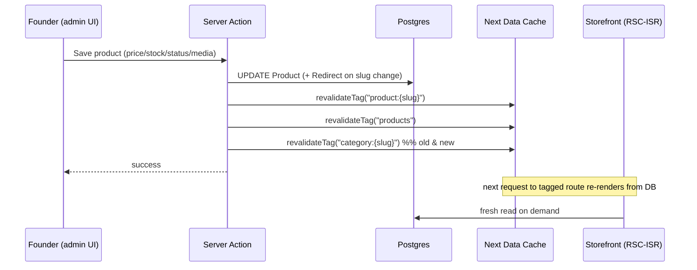
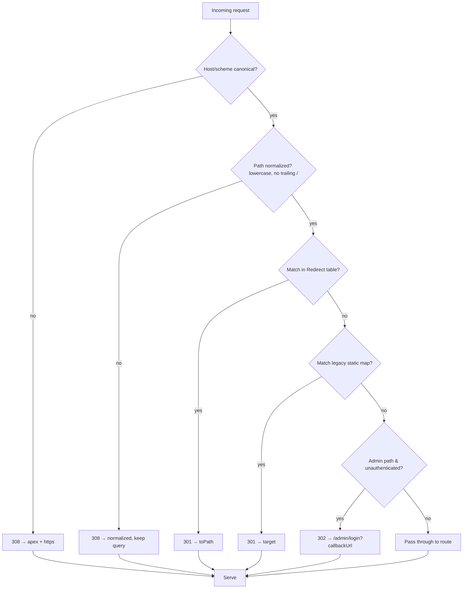
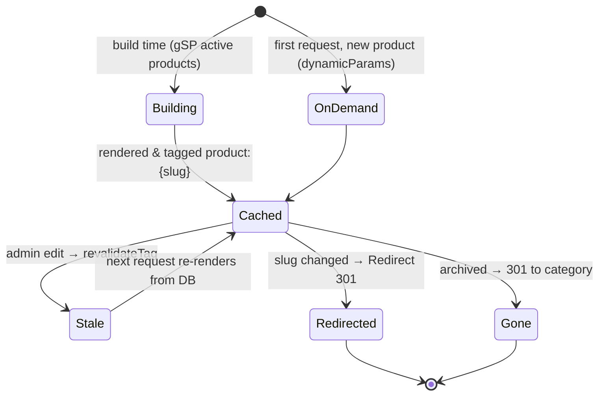

# 04 — Information Architecture & Routing

> **Project:** `vaani-gift-e-commerce` · **Brand:** GooglyWoogly Art · **Base:** Jaipur, India · **Domain:** `googlywoogly.art`
> **Conforms to:** `00-canonical-decisions.md` (CANON). Where this doc decides something not fixed in CANON, the decision is stated inline and surfaced under §11 Open Questions.
> **Authoritative for:** the full route map, URL/slug conventions, the **canonical cache-tag → trigger matrix** (every other spec references this table), navigation structures (header mega-menu, footer IA, mobile nav, admin sidebar), breadcrumbs, internal-linking intent, and the 301/redirect strategy.
> **Not authoritative for:** field-level entity shapes (`03-data-model`), page-level UX of individual templates (`05`–`08`, `10`–`15`), or the rendering/ISR deep-dive (`09`). This doc defines the *skeleton*; those define the *flesh*.

---

## 1. Purpose & Scope

### 1.1 What this covers
1. The **complete sitemap** for storefront + admin — every URL the app serves, public or gated.
2. For **every route**: purpose, rendering mode (RSC-ISR / SSR / CSR / generated), `generateStaticParams` usage, dynamic params, **cache tag(s)**, revalidation triggers, metadata strategy, `index`/`noindex`, breadcrumb trail, and internal-linking intent.
3. **Navigation IA:** desktop header + category/occasion **mega-menu**, footer information architecture, mobile navigation (drawer + bottom bar), and the **admin sidebar**.
4. **URL & slug conventions**, the **canonical-URL** policy, trailing-slash/casing rules, query-param contracts (filters/sort/pagination), and the **301 redirect strategy** on slug change.
5. The **consolidated cache-tag → trigger matrix** — the single table every mutating spec (`11`, `12`, `15`, etc.) must call when wiring `revalidateTag`/`revalidatePath`.
6. The **route group / folder layout** under `app/` (App Router), middleware responsibilities, and `not-found` / `error` / `loading` boundaries.

### 1.2 What this explicitly does NOT cover
- **No shopper authentication / accounts / wishlist routes.** Guest-only (CANON §2, §3). The only auth is `/admin/*`.
- **No on-site payment routes** (no `/pay`, no gateway callbacks). Payment happens off-site on WhatsApp (CANON §1, §3). The site records *intent*.
- **No product-variant routes** (no `?variant=`, no SKU-in-URL). Single-listing model (CANON §3, §5).
- **No multi-currency / locale-prefixed routes** (no `/en-IN/…`, no `/intl/…`). India-first, single locale; international demand is a *bulk inquiry*, not a storefront locale (CANON §1, §11). Locale routing is a V2 concern and intentionally omitted.
- Detailed component props, design tokens, and copy for each template — those live in the per-feature specs.

---

## 2. Primary user stories / jobs-to-be-done

| # | Actor | Story | Routes that satisfy it |
|---|---|---|---|
| JTBD-1 | Gift shopper (organic search) | As a shopper Googling "handmade Diwali gifts Jaipur", I want to land on a relevant, fast, indexable page, so that I can browse curated products immediately. | `/collections/[slug]`, `/category/[slug]`, `/products/[slug]` |
| JTBD-2 | Gift shopper (browsing) | As a browser, I want to navigate by *what it is* (category) or *the occasion* (collection) from one menu, so that I find a gift without thinking about taxonomy. | Header mega-menu → `/category/*`, `/collections/*` |
| JTBD-3 | Gift shopper (intent) | As a decided buyer, I want to filter, sort and page through products and open a product with one tap, so that I reach a buy decision quickly. | `/products`, `/category/[slug]` (faceted), `/products/[slug]` |
| JTBD-4 | Gift shopper (purchase) | As a guest, I want to add to cart and check out by giving only contact + address (no login, no card), so that I can place an order with minimal friction. | `/cart`, `/checkout`, `/order/confirmed/[token]` |
| JTBD-5 | Buyer (post-order) | As someone who placed an order, I want a private link to track its status, so that I know what's happening without an account. | `/track/[token]` |
| JTBD-6 | Corporate buyer | As an HR/admin buying gifts in bulk, I want a dedicated page and a structured enquiry form, so that I can get a quote on WhatsApp. | `/bulk-orders` |
| JTBD-7 | Trust-seeking visitor | As a first-time visitor, I want to read the brand story, policies, FAQ and contact, so that I trust an unknown micro-brand before ordering. | `/about`, `/faq`, `/contact`, legal pages |
| JTBD-8 | Search engine / crawler | As Googlebot, I want a clean sitemap, correct canonicals, and `noindex` on private/thin pages, so that I index exactly the right URLs. | `/sitemap.xml`, `/robots.txt`, canonical policy |
| JTBD-9 | Founder (admin) | As the founder running the shop from my phone, I want a single, gated command center with a stable left-nav, so that I manage catalog, orders, content and analytics in one place. | `/admin/*` |
| JTBD-10 | Founder (link integrity) | As the founder editing a product slug, I want old links to keep working, so that I never lose SEO equity or break a shared WhatsApp link. | 301 redirect map (§8.5) |

---

## 3. Detailed functional requirements

> Numbered, decisive. "MUST" = MVP unless a phase is noted. Cache tags use CANON §9 names verbatim.

### 3.1 Route map & rendering contract

**FR-1 — Route set is closed and matches CANON §8.** The app MUST serve exactly the storefront and admin routes enumerated in §6 of this doc. Any route added beyond CANON §8 is listed in §6.4 ("Added routes") with rationale; nothing is silently introduced.

**FR-2 — Rendering mode per route is fixed (see §6 tables).** Each route MUST be implemented in its declared mode:
- **RSC-ISR** — server component, statically rendered, refreshed by on-demand `revalidateTag`/`revalidatePath` with a time-based `revalidate` safety net (catalog `3600s`, content/legal `86400s` per CANON §9).
- **SSR** — `dynamic = "force-dynamic"` (or per-request via `searchParams`/token/cookies); no full-page cache.
- **CSR** — client-rendered shell (cart reads `localStorage`).
- **generated** — `sitemap.xml`/`robots.txt` via Next metadata routes.

**FR-3 — `generateStaticParams` is used for the four parameterized SEO routes:** `/category/[slug]`, `/collections/[slug]`, `/products/[slug]`, and the legal/content `CmsPage` slugs. Static params MUST be derived from the DB at build (only `status=active` / `isActive=true` / `isPublished=true` rows) and **augmented on-demand** via `dynamicParams = true`, so newly created entities render on first request and are then cached (CANON §9: on-demand revalidation primary). Admin and SSR routes never use `generateStaticParams`.

**FR-4 — Every catalog/content read is tagged** with the cache tags in CANON §9 so a single admin mutation can surgically revalidate it. The consolidated mapping is §7 (this is the canonical table).

**FR-5 — `/products` is hybrid.** The *base* `/products` (no filter params) is **RSC-ISR** and indexable. Any request carrying recognized **filter/sort/page** params (§8.4) renders **faceted/SSR** (`dynamic` per `searchParams`) and is **canonicalized to the base** `/products` URL (only `?page=N` is self-canonical for pagination — see FR-19). This satisfies CANON §8 ("RSC-ISR (faceted SSR for filtered views)").

**FR-6 — `/search` is always SSR and `noindex`.** It reads the `q` query param, never caches, and emits `robots: noindex,follow` (CANON §8). Empty `q` renders the search landing (popular searches / categories), not a 404.

**FR-7 — Token routes are SSR + no-store + `noindex`.** `/order/confirmed/[token]` and `/track/[token]` MUST be `dynamic = "force-dynamic"`, `cache: "no-store"`, and `noindex,nofollow`. The `[token]` is the 24-char nanoid `trackingToken` (CANON §10) — the **only** access key; IDs/orderNumbers are never accepted here.

**FR-8 — All `/admin/**` is SSR, auth-gated, and `noindex`.** Middleware (§6.3) MUST redirect unauthenticated requests to `/admin/login?callbackUrl=…`. Every admin response sets `X-Robots-Tag: noindex, nofollow` and admin layout sets `robots: { index:false, follow:false }`. `/admin/login` itself is public but also `noindex`.

### 3.2 URLs, slugs, canonicalization

**FR-9 — Slug format.** Slugs are lowercase **kebab-case, ASCII**, unique per entity type (CANON §10). Auto-generated from title, admin-editable, **immutable-by-default once published**.

**FR-10 — IDs/tokens never leak into storefront URLs.** Storefront paths use **slugs** (catalog/content) or **opaque tokens** (orders) only. cuid/uuid DB ids and sequential `orderNumber` are never path segments on the storefront (CANON §10).

**FR-11 — One canonical URL per resource.** Every indexable page MUST emit `<link rel="canonical">` (via `metadata.alternates.canonical`) to its **clean, lowercase, no-trailing-slash, no-tracking-param** absolute URL built from `NEXT_PUBLIC_SITE_URL`. Filtered PLPs, UTM-tagged URLs, and aliased paths all canonicalize to the clean URL.

**FR-12 — Trailing slash off; lowercase enforced.** `trailingSlash: false` (Next default). Requests with an uppercase path or trailing slash are **308**-redirected to the normalized form by middleware (§6.3). Query string is preserved on normalization.

**FR-13 — Reserved/forbidden slugs.** Slug generation MUST reject values colliding with first-level route segments (`products`, `category`, `collections`, `search`, `cart`, `checkout`, `order`, `track`, `bulk-orders`, `admin`, `api`, `about`, `contact`, `faq`, `sitemap.xml`, `robots.txt`, plus the fixed legal slugs). On collision, append `-2`, `-3`, … (handled in `03`/`11`).

### 3.3 Redirects (301) on slug change

**FR-14 — Slug change creates a permanent redirect.** When an admin changes a published entity's slug, the system MUST persist a redirect record `{ entityType, fromSlug, toSlug (or toPath), kind: 301, createdAt }` (a `Redirect` table — **added entity**, see §5.4) and serve a **308/301 permanent** redirect from the old path to the new one. Old WhatsApp/share links and SEO equity survive (JTBD-10).

**FR-15 — Redirect resolution order.** Middleware (§6.3) resolves, in order: (1) host/scheme + path normalization (lowercase, strip trailing slash) → 308; (2) explicit `Redirect`-table lookup for the requested path → 301; (3) legacy static-path map (§8.5) → 301; else pass through. A removed/archived product's slug redirects to its **category** (fallback `/products`) with 301, not 404 (preserves equity; see FR-26).

**FR-16 — Redirect chains are collapsed.** On a second slug change (A→B→C), the A-record MUST be rewritten to point directly to C (max one hop). No chains.

### 3.4 Navigation & breadcrumbs

**FR-17 — Header nav is data-driven.** The mega-menu's category and occasion/collection columns MUST be built from `Category` (where `isActive`, ordered by `sortOrder`, one parent level) and `Collection` (where `isActive` and flagged for nav). The composed navigation tree is cached under tag **`nav`** and revalidated per CANON §9 (`settings`,`nav` on nav change). See §4.1.

**FR-18 — Breadcrumbs are mandatory on catalog/content pages** and MUST emit `BreadcrumbList` JSON-LD (CANON §2 SEO-first). Trails are defined per route in §6.1.

**FR-19 — Pagination uses `?page=N`.** PLPs paginate via a `page` search param (1-based). `?page=1` MUST 301 to the param-less URL. `rel="prev"/"next"` hints are emitted; each `?page=N (N>1)` is **self-canonical** (decision — see Open Q-1).

---

## 4. Navigation structures (IA)

### 4.1 Desktop header (sticky)

Layout (left → right): **announcement/marquee bar** (top, from `Banner type=marquee` / `SiteSetting.announcementBar`) › **logo** › **primary nav** › **search** › **cart**.

```
┌───────────────────────────────────────────────────────────────────────────┐
│  ✦ Free shipping over ₹1499 · Handmade in Jaipur · DM us on WhatsApp  ✦     │  ← marquee (banners)
├───────────────────────────────────────────────────────────────────────────┤
│  GooglyWoogly  | Shop ▾  Occasions ▾  Bestsellers  Bulk Orders  About | 🔍  🛒(2) │
└───────────────────────────────────────────────────────────────────────────┘
```

Primary nav items (data-driven where noted):

| Item | Target | Source | Type |
|---|---|---|---|
| **Shop ▾** | mega-menu of categories → `/category/[slug]`, footer link `/products` | `Category` (tag `nav`) | Mega-menu |
| **Occasions ▾** | mega-menu of nav-flagged collections → `/collections/[slug]` | `Collection` (tag `nav`) | Mega-menu |
| **Bestsellers** | `/collections/bestsellers` (seeded collection) | static | Link |
| **Bulk Orders** | `/bulk-orders` | static | Link |
| **About** | `/about` | static | Link |
| Search | opens search overlay → submits to `/search?q=` | — | Action |
| Cart | `/cart` (badge = client cart count) | localStorage | Link |

**"Shop" mega-menu (by category):** two/three columns of top-level `Category` names; each column header links to the category PLP; under it, child categories (one level, CANON §5) and a curated "Featured" product tile (uses `isFeatured`). Bottom-row links: **"Shop all products" → `/products`**, "New in", "Made to order".

**"Occasions" mega-menu (by collection):** columns grouped by theme — **Festivals** (Diwali, Raksha Bandhan, Holi, Karwa Chauth), **Milestones** (Wedding, Anniversary, Birthday, Housewarming), **Corporate** (→ also surfaces `/bulk-orders`). Each links to `/collections/[slug]`. Occasions list mirrors CANON §11.

**Interactions:** hover-intent open (desktop), 150 ms close delay, full keyboard support (Radix `NavigationMenu` — already vendored in `components/ui/navigation-menu.tsx`), focus trap within open panel, `Esc` closes. Mega-menu content is server-rendered into the layout (tag `nav`) so it's crawlable and zero-JS-fallback navigable.

### 4.2 Footer information architecture

Four-to-five column footer (server-rendered; tags `nav`, `settings`):

| Column | Links |
|---|---|
| **Shop** | All Products (`/products`), Shop by category (top categories), Bestsellers (`/collections/bestsellers`), New In, Made to Order |
| **Occasions** | Diwali, Raksha Bandhan, Wedding, Birthday, Corporate Gifting → `/collections/[slug]` |
| **Company** | About (`/about`), Contact (`/contact`), Bulk & Corporate (`/bulk-orders`), FAQ (`/faq`) |
| **Policies** | Shipping & Delivery (`/shipping-policy`), Cancellation & Refund (`/returns-and-refunds`), Privacy Policy (`/privacy-policy`), Terms (`/terms`), Care Guide (`/care-guide`) |
| **Connect** | WhatsApp (`wa.me` deep link, `SiteSetting.whatsappNumber`), Instagram + socials (`SiteSetting.socialLinks`), **Newsletter signup** (email → `NewsletterSubscriber`) |

Footer base row: brand line, business address (`SiteSetting.businessAddress`), `© {year} GooglyWoogly Art`, "Handmade in Jaipur, India 🇮🇳", GSTIN (only if `SiteSetting.gstin` set). Trust strip above footer: "Handcrafted • Made-to-order • Pan-India shipping • WhatsApp support".

### 4.3 Mobile navigation

- **Top bar:** hamburger (opens drawer `Sheet`) · logo · search icon · cart icon (with badge).
- **Drawer (left `Sheet`):** accordion of **Shop** (categories), **Occasions** (collections), then flat links (Bestsellers, Bulk Orders, About, Contact, FAQ, Policies group), then WhatsApp CTA + socials. Built from the same `nav`-tagged tree.
- **Bottom tab bar (sticky, mobile only)** — decision (Open Q-2): 4 tabs — **Home** (`/`), **Shop** (`/products`), **Search** (`/search` overlay), **Cart** (`/cart`, badge). Improves thumb-reach conversion on a phone-first audience.
- **Sticky PDP add-to-cart bar** is owned by `07` but reserves the bottom slot on `/products/[slug]` (bottom tab bar hides there).

### 4.4 Admin sidebar (left nav, collapsible)

Gated, `noindex`. Mirrors CANON §8 admin routes. Grouped for a phone-first single operator; active-route highlight; collapses to icon-rail on mobile.

| Group | Item | Route | Notes / badge |
|---|---|---|---|
| **Overview** | Dashboard | `/admin` | KPIs, alerts |
| **Catalog** | Products | `/admin/products` | + `/new`, `/[id]/edit` |
| | Inventory | `/admin/inventory` | low-stock badge |
| | Categories | `/admin/categories` | |
| | Collections | `/admin/collections` | |
| | Media | `/admin/media` | |
| **Sales** | Orders | `/admin/orders` | pending-count badge; `/[id]` |
| | Customers | `/admin/customers` | derived CRM |
| | Coupons | `/admin/coupons` | V1 |
| **Leads** | Bulk Inquiries | `/admin/bulk-inquiries` | new badge |
| | Messages | `/admin/messages` | new badge |
| | Reviews | `/admin/reviews` | V1; pending badge |
| **Content** | Content (CMS) | `/admin/content` | home/banners/testimonials/FAQ/pages |
| **Insights** | Analytics | `/admin/analytics` | |
| **System** | Settings | `/admin/settings` | SiteSetting |
| | Audit Log | `/admin/audit-log` | owner-visible |

Top admin bar: brand mark, environment pill (if non-prod), "View store" link (opens `/`), order-search box, notifications bell (pending orders / new leads), account menu (name, role, logout). Role gating (`AdminRole`): `staff` hides Settings, Audit Log, Coupons, and Customers' financial columns (enforced server-side; detailed in `10`).

---

## 5. Data & entities used

Reads/writes reference CANON §5 names exactly. This doc consumes IA-relevant fields; full shapes in `03`.

### 5.1 Read (to build routes, nav, metadata, breadcrumbs)

| Entity | Fields read | Where |
|---|---|---|
| `Product` | `slug, title, subtitle, shortDescription, status, primaryImageId, ogImageId, metaTitle, metaDescription, categoryId, isFeatured, isBestseller, publishedAt, updatedAt` | `/products`, `/products/[slug]`, mega-menu featured tile, sitemap |
| `ProductImage` | `url, alt, width, height, isPrimary` | metadata `og:image`, breadcrumb/list thumbs |
| `Category` | `slug, name, description, parentId, sortOrder, isActive, imageId, metaTitle, metaDescription` | mega-menu, footer, `/category/[slug]`, breadcrumbs, sitemap |
| `Collection` | `slug, title, description, type, sortOrder, isActive, isFeaturedOnHome, heroImageId, metaTitle, metaDescription` | "Occasions" menu, footer, `/collections/[slug]`, sitemap |
| `CmsPage` | `slug, title, metaTitle, metaDescription, isPublished, updatedAt` | content/legal routes, sitemap |
| `SiteSetting` | `whatsappNumber, socialLinks, announcementBar, businessAddress, gstin, defaultSeo, logoId, freeShippingThreshold` | header/footer/marquee, metadata defaults |
| `Banner` | `type, text, link, startsAt, endsAt, isActive, sortOrder` | marquee/announcement bar |
| `Order` | `trackingToken, orderNumber, status, paymentStatus` (lookup only) | `/order/confirmed/[token]`, `/track/[token]` |
| `Redirect` *(added)* | `fromPath, toPath, kind` | middleware redirect resolution |

### 5.2 Written by routes in this doc's scope
This is an IA/routing doc; route **rendering** is read-only. Writes happen via actions owned by feature specs and are listed in §6.2 with the cache tags they bust. The one write conceptually owned here is the **`Redirect`** record on slug change (authored by admin product/category/collection/CMS save actions in `11`/`15`, consumed by middleware here).

### 5.3 Derived/computed for routing
- `inventoryState` (CANON enum) — read for PLP/PDP badges & sitemap freshness; not a route key.
- Composed **navigation tree** — assembled from `Category`+`Collection`+`SiteSetting`, memoized under tag `nav`.

### 5.4 Added entity — `Redirect` (Open Q-3)
Minimal table to power FR-14/15/16. Proposed fields (final shape in `03`): `id, fromPath (unique, normalized), toPath, kind (301|410), entityType?, entityId?, createdAt`. No CANON entity covered slug-change redirects, so this is introduced here and flagged.

---

## 6. The route map (sitemap + per-route contract)

### 6.0 Sitemap tree (mermaid)

```mermaid
flowchart TD
  ROOT["/ (Landing) · RSC-ISR · index"]

  subgraph Storefront
    ROOT --> BULK["/bulk-orders · RSC-ISR+action · index"]
    ROOT --> PLP["/products · RSC-ISR (faceted→SSR) · index(base)"]
    PLP --> CAT["/category/[slug] · RSC-ISR+gSP · index"]
    PLP --> COL["/collections/[slug] · RSC-ISR+gSP · index"]
    PLP --> PDP["/products/[slug] · RSC-ISR+gSP+on-demand · index"]
    ROOT --> SRCH["/search?q= · SSR · noindex"]
    PDP --> CART["/cart · CSR · noindex"]
    CART --> CHK["/checkout · SSR shell+action · noindex"]
    CHK --> CONF["/order/confirmed/[token] · SSR no-store · noindex"]
    CONF --> TRK["/track/[token] · SSR no-store · noindex"]
  end

  subgraph Content & Legal
    ROOT --> ABOUT["/about · RSC-ISR · index"]
    ROOT --> CONTACT["/contact · RSC-ISR+action · index"]
    ROOT --> FAQ["/faq · RSC-ISR · index"]
    ROOT --> POL["/shipping-policy /returns-and-refunds /privacy-policy /terms /care-guide · RSC-ISR · index"]
    ROOT --> N404["/not-found (404) · static · noindex"]
  end

  subgraph SEO Infra
    SITEMAP["/sitemap.xml · generated"]
    ROBOTS["/robots.txt · generated"]
  end

  subgraph Admin · all SSR + auth + noindex
    ALOGIN["/admin/login"]
    ADASH["/admin (Dashboard)"]
    ADASH --> APROD["/admin/products · /new · /[id]/edit"]
    ADASH --> AINV["/admin/inventory"]
    ADASH --> ACATg["/admin/categories"]
    ADASH --> ACOL["/admin/collections"]
    ADASH --> AMEDIA["/admin/media"]
    ADASH --> AORD["/admin/orders · /[id]"]
    ADASH --> ACUST["/admin/customers"]
    ADASH --> ACOUP["/admin/coupons (V1)"]
    ADASH --> ABULK["/admin/bulk-inquiries"]
    ADASH --> AMSG["/admin/messages"]
    ADASH --> AREV["/admin/reviews (V1)"]
    ADASH --> ACMS["/admin/content"]
    ADASH --> AANL["/admin/analytics"]
    ADASH --> ASET["/admin/settings"]
    ADASH --> AAUD["/admin/audit-log"]
  end
```

### 6.1 Storefront routes — full contract

> `gSP` = `generateStaticParams`. Cache tags are CANON §9 verbatim. "Canonical" = value of `alternates.canonical`. Breadcrumb shows the trail (Home is implicit root).

| Route | Purpose | Render | gSP / dynamic params | Cache tag(s) | Revalidation trigger (→ §7) | Metadata strategy | Index | Breadcrumb | Internal-linking intent |
|---|---|---|---|---|---|---|---|---|---|
| `/` | Landing / brand home | **RSC-ISR** (revalidate 3600) | — | `home`, `banners`, `settings` | homepage sections / banners / settings edited | Title+desc from `SiteSetting.defaultSeo`; OG = brand; `Organization`+`WebSite`+`SearchAction` JSON-LD | ✅ | — | Hub → featured collections, categories, bestsellers, bulk, about |
| `/bulk-orders` | Corporate/bulk landing + inquiry form | **RSC-ISR + action** (3600) | — | `page:bulk-orders` | bulk-orders CMS content edited | Static SEO copy; `noindex` for `?success=` thank-you state | ✅ | Home › Bulk Orders | Links to corporate collections; CTA WhatsApp |
| `/products` | All-products PLP | **RSC-ISR** base; **SSR** when filter/sort params present | — (params via `searchParams`) | `products` | any product create/update/archive; price/inventory/status/media change | Base: indexable canonical `/products`; filtered: canonical→`/products` (FR-5/11) | ✅ base / ❌ filtered | Home › Products | ↔ categories, collections; → PDPs |
| `/category/[slug]` | Category PLP (SEO) | **RSC-ISR + gSP** (3600) | gSP from active categories; `slug`; `dynamicParams=true` | `category:{slug}`, `products` | category edited; product category/membership change | `metaTitle`/`metaDescription` from `Category`; canonical self; `CollectionPage`+`Breadcrumb` JSON-LD | ✅ | Home › [Parent cat?] › Category | → child categories, PDPs, related collections |
| `/collections/[slug]` | Collection / occasion landing | **RSC-ISR + gSP** (3600) | gSP from active collections; `slug`; `dynamicParams=true` | `collection:{slug}`, `products` | collection edited; membership/automation rules change | From `Collection` meta; hero; canonical self; `CollectionPage` JSON-LD | ✅ | Home › Collections › [Title] | Cross-link sibling occasions, categories, PDPs |
| `/products/[slug]` | PDP + recommendations | **RSC-ISR + gSP + on-demand** (3600) | gSP from active products; `slug`; `dynamicParams=true` | `product:{slug}` | product created/updated/archived; price/inventory/status/media change | `metaTitle`/`metaDescription`/`ogImageId` from `Product`; `Product`+`Offer`+`Breadcrumb` (+`AggregateRating` when reviews V1) JSON-LD; canonical self | ✅ (active) / 410→redirect (archived, FR-26) | Home › Category › Product | → category, same-collection items, "you may also like" |
| `/search` | Search results | **SSR** (no cache) | — (`q`, optional facet params) | — | n/a (live query) | `robots: noindex,follow`; title "Search: {q}"; canonical omitted | ❌ | Home › Search | Surfaces categories/collections + PDPs as exits |
| `/cart` | Cart review | **CSR** | — | — | n/a (localStorage; re-validates price/stock on load) | `noindex,nofollow`; minimal | ❌ | Home › Cart | → `/checkout`; continue-shopping → `/products` |
| `/checkout` | Guest checkout (contact+address, **no payment**) | **SSR shell + action** (no cache) | — | — | n/a | `noindex,nofollow` | ❌ | Home › Checkout | Exit only to confirmation; trust links to policies |
| `/order/confirmed/[token]` | Post-order confirmation + WhatsApp handoff | **SSR, `no-store`** | `token` (trackingToken) | — | n/a | `noindex,nofollow` | ❌ | — | → `/track/[token]`; WhatsApp deep link; continue shopping |
| `/track/[token]` | Order status timeline | **SSR, `no-store`, token-gated** | `token` (trackingToken) | — | n/a (always fresh) | `noindex,nofollow` | ❌ | — | → product reorder links; support/WhatsApp |
| `/about` | Brand story | **RSC-ISR** (86400) | — | `page:about` | CMS page `about` published | From `CmsPage`/defaults; `AboutPage` JSON-LD | ✅ | Home › About | → products, bulk, contact |
| `/contact` | Contact + form | **RSC-ISR + action** (86400) | — | `page:contact` | CMS page `contact` published; `settings` for channels | From `CmsPage`; `ContactPage`+`Organization` JSON-LD | ✅ | Home › Contact | → FAQ, WhatsApp, policies |
| `/faq` | FAQ | **RSC-ISR** (86400) | — | `page:faq`, `faq` | FAQ items edited | `FAQPage` JSON-LD from `FaqItem` | ✅ | Home › FAQ | → policies, contact, PDP info |
| `/shipping-policy` | Shipping & Delivery | **RSC-ISR** (86400) | — | `page:shipping-policy` | CMS page published | From `CmsPage` | ✅ | Home › Shipping & Delivery | ↔ other policies |
| `/returns-and-refunds` | Cancellation & Refund | **RSC-ISR** (86400) | — | `page:returns-and-refunds` | CMS page published | From `CmsPage` | ✅ | Home › Returns & Refunds | ↔ policies |
| `/privacy-policy` | Privacy (DPDP) | **RSC-ISR** (86400) | — | `page:privacy-policy` | CMS page published | From `CmsPage` | ✅ | Home › Privacy Policy | ↔ policies |
| `/terms` | Terms | **RSC-ISR** (86400) | — | `page:terms` | CMS page published | From `CmsPage` | ✅ | Home › Terms | ↔ policies |
| `/care-guide` | Care instructions | **RSC-ISR** (86400) | — | `page:care-guide` | CMS page published | From `CmsPage` | ✅ | Home › Care Guide | → PDP care sections, products |
| `/sitemap.xml` | XML sitemap (chunked) | **generated** (revalidate 3600) | — | — | nightly cron + on product/category/collection/page change (best-effort) | n/a | — (referenced in robots) | — | Lists all indexable canonical URLs |
| `/robots.txt` | Crawl directives | **generated** | — | — | settings change | n/a | — | — | Points to `/sitemap.xml`; disallows `/admin`,`/cart`,`/checkout`,`/order`,`/track`,`/search`,`/api` |
| `*` (unmatched) | 404 | `not-found.tsx` (static) | — | — | — | `noindex`; helpful links | ❌ | — | → home, products, search, popular categories |

### 6.2 Admin routes — full contract

All: **SSR**, **auth-gated** (middleware §6.3), `dynamic="force-dynamic"`, **no full-page cache**, **`noindex,nofollow`**, breadcrumb `Admin › …`. They read/write via Server Actions whose **revalidated tags** are listed (this is *where* the §7 triggers fire). Param routes use route `[id]` = internal cuid (admin-only; IDs allowed here, never on storefront — FR-10).

| Route | Purpose | Params | Reads | Writes / actions → revalidates (§7 tags) |
|---|---|---|---|---|
| `/admin/login` | Credentials login (public, noindex) | — | `AdminUser` | Auth.js sign-in; sets session cookie; no cache tags |
| `/admin` | Dashboard: KPIs, funnel, alerts | — | `DailyMetricRollup`, `Order`, `Product`(low stock), leads | — (read) |
| `/admin/products` | Product list (search/filter/bulk) | `?` filters | `Product`, `Category` | bulk status/feature → `products`, `product:{slug}`, affected `category:{slug}`/`collection:{slug}` |
| `/admin/products/new` | Create product | — | `Category`,`Collection`,`MediaAsset` | create → `products` (+ `category:{slug}` if assigned); writes `Redirect` n/a |
| `/admin/products/[id]/edit` | Edit product | `id` | `Product`, images, taxonomy | update → `product:{slug}`, `products`, `category:{slug}`(old+new), `collection:{slug}`; **slug change → writes `Redirect` + 301** |
| `/admin/inventory` | Stock view & quick-adjust | `?` filters | `Product` (`inventoryQuantity`,`inventoryState`,`lowStockThreshold`) | adjust qty → `product:{slug}`, `products` |
| `/admin/categories` | Category CRUD + ordering | — | `Category` | save/reorder → `category:{slug}`, `products`, `nav` |
| `/admin/collections` | Collection CRUD + rules + members | — | `Collection`,`CollectionProduct`,`Product` | save/reorder/rules → `collection:{slug}`, `products`, `nav` |
| `/admin/media` | Media library | `?folder` | `MediaAsset` | upload/delete → (none global; affected product tags on attach) |
| `/admin/orders` | Order queue (status filters) | `?status,?payment` | `Order`,`OrderItem` | — (read; list) |
| `/admin/orders/[id]` | Order detail + status/payment transitions + WhatsApp/email | `id` | `Order`,`OrderItem`,`OrderStatusEvent`,`Customer`,`NotificationLog` | status/payment change → writes `OrderStatusEvent`, `NotificationLog`; **no storefront cache tag** (track page is no-store) |
| `/admin/customers` | Derived CRM | `?` | `Customer`,`Order` | edit tags/notes → (none cached) |
| `/admin/coupons` *(V1)* | Coupon CRUD | — | `Coupon` | save → (cart re-validates live; no storefront tag) |
| `/admin/bulk-inquiries` | Bulk lead pipeline | `?status` | `BulkInquiry` | status/notes → (none cached) |
| `/admin/messages` | Contact inbox | `?status` | `ContactMessage` | status → (none cached) |
| `/admin/reviews` *(V1)* | Review moderation | `?status` | `Review`,`Product` | approve/reject → `product:{slug}`, `products` |
| `/admin/content` | CMS: homepage sections, banners, testimonials, FAQ, pages | `?tab` | `HomepageSection`,`Banner`,`Testimonial`,`FaqItem`,`CmsPage` | publish → `home`,`banners`,`page:{slug}`,`faq`,`testimonials`,`settings`,`nav`; **CMS slug change → `Redirect`+301** |
| `/admin/analytics` | Reports & funnel | `?range` | `AnalyticsEvent`,`AnalyticsSession`,`DailyMetricRollup` | — (read) |
| `/admin/settings` | Site settings | `?section` | `SiteSetting` | save → `settings`, `nav` (+ `home`,`banners` if announcement/marquee) |
| `/admin/audit-log` | Audit trail (owner) | `?` | `AuditLog` | — (read) |

### 6.3 `app/` folder layout, route groups & middleware

Route groups isolate layouts (storefront chrome vs admin chrome) without affecting URLs.

```
app/
  layout.tsx                      # root: html/body, fonts, providers, analytics bootstrap
  not-found.tsx                   # global 404 (noindex)
  global-error.tsx                # React error boundary (prod)
  robots.ts                       # /robots.txt (metadata route)
  sitemap.ts                      # /sitemap.xml (+ chunking via generateSitemaps)

  (storefront)/                   # group — shares header/footer/mega-menu layout
    layout.tsx                    # Header + Footer + mobile nav + bottom bar; tag: nav, settings, banners
    page.tsx                      # "/"  (RSC-ISR)
    loading.tsx                   # storefront skeleton
    error.tsx
    bulk-orders/page.tsx
    products/page.tsx             # base PLP + faceted (searchParams)
    products/[slug]/page.tsx      # PDP  (+ generateStaticParams, generateMetadata)
    category/[slug]/page.tsx
    collections/[slug]/page.tsx
    search/page.tsx               # SSR, noindex
    cart/page.tsx                 # CSR
    checkout/page.tsx             # SSR shell + action
    order/confirmed/[token]/page.tsx
    track/[token]/page.tsx
    about/page.tsx
    contact/page.tsx
    faq/page.tsx
    [legalSlug]/page.tsx          # OR explicit folders per legal slug (decision Open Q-4)

  (admin)/                        # group — admin shell, no storefront chrome
    admin/layout.tsx              # AdminSidebar + topbar; force-dynamic; noindex
    admin/login/page.tsx
    admin/page.tsx                # dashboard
    admin/products/page.tsx
    admin/products/new/page.tsx
    admin/products/[id]/edit/page.tsx
    admin/inventory/page.tsx
    admin/categories/page.tsx
    admin/collections/page.tsx
    admin/media/page.tsx
    admin/orders/page.tsx
    admin/orders/[id]/page.tsx
    admin/customers/page.tsx
    admin/coupons/page.tsx        # V1
    admin/bulk-inquiries/page.tsx
    admin/messages/page.tsx
    admin/reviews/page.tsx        # V1
    admin/content/page.tsx
    admin/analytics/page.tsx
    admin/settings/page.tsx
    admin/audit-log/page.tsx

  api/
    revalidate/route.ts           # POST, REVALIDATE_SECRET-guarded (ISR webhook / cron)
    track/route.ts                # (optional) JSON status poll for /track (no-store)
    health/route.ts               # uptime
middleware.ts                     # see responsibilities below
```

**`middleware.ts` responsibilities (ordered):**
1. **Canonical host/scheme** — force apex-vs-www per decision (apex `googlywoogly.art`, Open Q-5) and `https`; 308.
2. **Path normalization** — lowercase + strip trailing slash (FR-12); 308, preserve query.
3. **`Redirect` table lookup** — DB/edge-cached map; 301 to `toPath` (FR-14/15). (Edge KV or in-memory revalidated map; resolution must be O(1).)
4. **Legacy static redirects** (§8.5) — 301.
5. **Admin guard** — if path `^/admin(?!/login)` and no valid session → 302 `/admin/login?callbackUrl={path}` (FR-8). Attach `X-Robots-Tag: noindex, nofollow` to all `/admin` + token + `/search` + `/cart` + `/checkout` responses (defense-in-depth beyond page metadata).
6. Pass through. Matcher excludes `_next/static`, `_next/image`, asset extensions, and `/api/revalidate` (secret-guarded itself).

### 6.4 Added routes (beyond CANON §8) — with rationale

| Route | Why added | Phase |
|---|---|---|
| `/not-found` (global 404) | Required for UX + correct 404 status (SEO). | MVP |
| `/api/revalidate` | CANON §9 mandates on-demand revalidation + `REVALIDATE_SECRET`; needs an endpoint for cron/webhook. | MVP |
| `/api/health` | NFR uptime monitoring (CANON §16 referenced). | MVP |
| `/api/track/[token]` (optional poll) | Lets `/track` refresh status without full reload; no-store JSON. | V1 (optional) |
| `/admin/products/[id]/edit` is in CANON; **no net-new admin route added** — all admin routes trace to CANON §8. | — | — |

> **Note:** CANON §8 lists `/about`,`/contact`,`/faq` with tag pattern `page:{slug}`. I additionally tag `/faq`→`faq` and `/contact` reads `settings` so the FAQ-item and channel edits revalidate correctly (consistent with CANON §9 `faq` tag). No new public *URLs* are introduced beyond CANON.

---

## 7. Consolidated cache-tag → trigger matrix (CANONICAL — referenced by all specs)

> **This is the single source for `revalidateTag`/`revalidatePath` wiring.** Specs `11` (catalog/inventory), `12` (orders), `15` (CMS), `13`/`14` must call exactly these tags on the listed mutations. Tag names are CANON §9 verbatim. "Path revalidations" use `revalidatePath` in addition to tags where a specific URL must refresh.

| Cache tag | Applied to (routes/reads) | Revalidated by these admin mutations | Also `revalidatePath` | Safety-net `revalidate` |
|---|---|---|---|---|
| `product:{slug}` | `/products/[slug]` (that product); PLP cards referencing it | Product create*, update, archive/unarchive; **price**, **compareAtPrice**, **inventoryQuantity/State**, **status**, **media** change; review approve/reject (V1) | `/products/[slug]` on slug change (old path → via Redirect) | 3600s |
| `products` | `/products` (base + lists), any PLP product grid, mega-menu featured tile, home product rails | Any of the above product mutations; bulk product ops; category/collection membership change | `/products`, `/` (if featured) | 3600s |
| `category:{slug}` | `/category/[slug]` | Category create/edit/reorder/activate; a product's `categoryId` changes (old + new slug both busted) | `/category/[slug]` | 3600s |
| `collection:{slug}` | `/collections/[slug]` | Collection create/edit/reorder; `CollectionProduct` membership change; automation `rules` change (recompute) | `/collections/[slug]` | 3600s |
| `home` | `/` | `HomepageSection` add/edit/reorder/toggle; featured collection/product flag change; announcement edit | `/` | 3600s |
| `banners` | `/` marquee + any banner slot; storefront layout marquee | `Banner` create/edit/schedule/toggle | `/` | 3600s |
| `page:{slug}` | content/legal CMS routes (`about`,`contact`,`faq`,`bulk-orders`, 5 legal slugs) | `CmsPage` publish/update for that slug | `/{slug}` | 86400s |
| `faq` | `/faq` (+ FAQ blocks elsewhere) | `FaqItem` create/edit/reorder/publish | `/faq` | 86400s |
| `testimonials` | home + any testimonial block | `Testimonial` add/edit/approve/reorder/feature | `/` | 86400s (home 3600) |
| `settings` | storefront layout (header/footer/marquee), metadata defaults, `/contact` channels | `SiteSetting` save (any key) | `/` | 3600s |
| `nav` | header mega-menu, footer nav, mobile drawer (composed tree) | Category/Collection create/edit/reorder/activate/deactivate; nav-flag change; settings nav links | layout (implicit) | 3600s |

\* On **create**, no `product:{slug}` exists yet to bust; `dynamicParams=true` renders it on first hit; `products` (+ relevant `category:{slug}`) is busted so listings include it.

**Never-cached (no tags):** `/search`, `/cart`, `/checkout`, `/order/confirmed/[token]`, `/track/[token]`, all `/admin/**`, `/api/*`. Order status changes therefore need **no** storefront revalidation — the tracking page is `no-store` and always fresh (CANON §9: "Tracking/checkout/cart/admin = no cache").

**Revalidation transport:** Admin Server Actions call `revalidateTag`/`revalidatePath` in-process. The `POST /api/revalidate` endpoint (guarded by `REVALIDATE_SECRET`, CANON §10) exists for **out-of-band** triggers — Vercel Cron (nightly sitemap/rollup) and any future webhook (e.g., Cloudinary). Payload: `{ tags?: string[], paths?: string[], secret }`, Zod-validated.



---

## 8. URL & slug conventions, query contracts, redirects

### 8.1 URL grammar

| Pattern | Example | Notes |
|---|---|---|
| Home | `/` | — |
| PLP (all) | `/products` | base indexable |
| Category | `/category/{slug}` | one level; parent not in path (flat URLs for SEO) — decision Open Q-6 |
| Collection | `/collections/{slug}` | plural noun (CANON §8) |
| PDP | `/products/{slug}` | not nested under category (avoids dupes; single canonical) |
| Content/legal | `/{slug}` | `about`, `faq`, `shipping-policy`, … (fixed set) |
| Order confirm | `/order/confirmed/{token}` | token only |
| Track | `/track/{token}` | token only |
| Admin | `/admin/{section}[/{id}[/edit]]` | id = cuid (admin-only) |

### 8.2 Slug rules (FR-9, CANON §10)
- Lowercase kebab, ASCII transliteration of Unicode (e.g., Hindi titles → ASCII slug), strip punctuation, collapse hyphens.
- Unique per entity type; published slugs immutable-by-default; editing a published slug triggers the 301 flow (§8.5).
- Max length ~60 chars (SEO). Reserved-word guard per FR-13.

### 8.3 Canonical & robots policy (summary)

| Page class | Canonical | Robots |
|---|---|---|
| Home, PDP, category, collection, content/legal, base `/products` | self (clean absolute) | `index,follow` |
| `/products?filters…` | → `/products` | `noindex,follow` (filtered combos) |
| `/products?page=N` (N>1) | self | `index,follow` + `rel=prev/next` |
| `/search`, `/cart`, `/checkout` | omit/none | `noindex,follow` |
| `/order/confirmed/*`, `/track/*` | omit | `noindex,nofollow` |
| `/admin/*` | omit | `noindex,nofollow` (+ `X-Robots-Tag`) |
| Out-of-stock active PDP | self | **`index,follow`** (stays indexed; shows "made to order"/"notify") |
| Archived/removed PDP | n/a | 301 → category (FR-26) |

### 8.4 Query-parameter contract (PLP/search)

Recognized params (anything else ignored & stripped from canonical):

| Param | Used by | Values | Effect |
|---|---|---|---|
| `category` | `/products` | category slug(s), comma-sep | facet filter |
| `collection` | `/products` | slug(s) | facet filter |
| `occasion` | `/products`,`/collections/*` | occasion key(s) | facet filter |
| `price` | PLP | `min-max` (₹) | range filter |
| `availability` | PLP | `in_stock,made_to_order,…` (InventoryState) | filter |
| `tag` | PLP | tag slug(s) | filter |
| `sort` | PLP/search | `featured`(default)\|`newest`\|`price_asc`\|`price_desc`\|`bestselling` | order |
| `page` | PLP/search | int ≥1 | pagination (`?page=1`→strip, FR-19) |
| `q` | `/search` | string | query |
| `utm_*`,`ref`,`gclid`,`fbclid` | any | — | captured by analytics; **stripped from canonical** (FR-11) |

Presence of any filter/sort param on `/products` switches it to faceted **SSR** (FR-5).

### 8.5 Redirect / 301 strategy



**Dynamic (data-driven) 301s — written on admin save (FR-14):**
- Product/category/collection/CMS **slug change** → `Redirect{ from=oldPath, to=newPath, 301 }`; chains collapsed (FR-16).
- **Category merge/delete** → 301 children & the category path to the surviving category (or `/products`).
- **Product archive/delete** → 301 PDP path → its category PLP (fallback `/products`); never 404 a previously-indexed product (FR-26).

**Static legacy/convenience 301s (seed map):**

| From | To | Reason |
|---|---|---|
| `/home`, `/index` | `/` | common typos |
| `/shop`, `/all`, `/catalog` | `/products` | aliases |
| `/product/{slug}` (singular) | `/products/{slug}` | guard against singular |
| `/collection/{slug}` (singular) | `/collections/{slug}` | singular guard |
| `/categories`, `/category` (no slug) | `/products` | bare taxonomy root |
| `/contact-us` | `/contact` | alias |
| `/faqs` | `/faq` | alias |
| `/shipping`, `/delivery` | `/shipping-policy` | alias |
| `/refund`, `/refunds`, `/returns` | `/returns-and-refunds` | alias |
| `/privacy` | `/privacy-policy` | alias |
| `/bulk`, `/corporate`, `/corporate-gifting` | `/bulk-orders` | alias |
| `/track` (no token) | `/` (with toast "enter your order link") | guard |
| `/wp-admin`, `/wp-login.php` | 410/`/` | bot noise (optional) |

---

## 9. States & edge cases

| Scenario | Route(s) | Behavior |
|---|---|---|
| **Loading** | catalog/content | Route `loading.tsx` skeletons (grid/card/PDP placeholders); never blank. |
| **Empty PLP** (no products match filters) | `/products`, `/category/[slug]`, `/collections/[slug]`, `/search` | "No products found" empty state (`components/ui/empty.tsx`) + clear-filters CTA + suggested categories/collections. Category/collection with zero active products still renders (200) with empty state, **unless** the category itself is inactive → 404. |
| **Unknown slug** | `/category/[slug]`, `/collections/[slug]`, `/products/[slug]` | If no Redirect match → `notFound()` (404, `noindex`) with helpful links. Archived product → 301 (FR-26), not 404. |
| **Out-of-stock (active)** | `/products/[slug]`, PLP card | Page stays **indexed**; CTA shows "Made to order — ships in {leadTime}" (if `madeToOrder`) or "Notify on WhatsApp"; add-to-cart disabled only for true out-of-stock non-MTO. (Detail in `07`.) |
| **Made-to-order** | PDP/PLP | Always orderable; lead-time badge surfaced in IA (badge slot reserved). |
| **Price/stock changed since cart** | `/cart`, `/checkout` | Client re-validates against server on load + at checkout submit (CANON §4 cart); shows diff banner; user re-confirms before order. (Owned by `08`; IA reserves the banner slot.) |
| **Invalid/expired token** | `/order/confirmed/[token]`, `/track/[token]` | Generic 404-style "We couldn't find that order" (no info leak), link to `/contact`/WhatsApp. Never reveals whether a token existed. |
| **Direct hit to `/checkout` with empty cart** | `/checkout` | Redirect to `/cart` (or `/products`) with notice. |
| **Filtered URL shared/crawled** | `/products?…` | Renders (SSR) but `noindex,follow`, canonical→`/products`; crawlers don't dilute index. |
| **Admin route unauthenticated** | `/admin/**` | 302 → `/admin/login?callbackUrl`; after login, returned to original (FR-8). |
| **`staff` accesses owner-only** | `/admin/settings`,`/audit-log`,`/coupons` | Hidden in sidebar + server-side 403/redirect to `/admin` (enforced in `10`). |
| **Slug-change redirect loop risk** | any | Chains collapsed to single hop (FR-16); self-referential redirect rejected at write time. |
| **Route-level error** | any | `error.tsx` (storefront) / admin error boundary; `global-error.tsx` for root; Sentry capture (CANON §4). |
| **404 status correctness** | unmatched | `not-found.tsx` returns HTTP 404 (not soft-200) so it's correctly de-indexed. |

State diagram for a parameterized PDP route lifecycle:



---

## 10. SEO / performance / accessibility

### 10.1 SEO
- **Canonicals & robots** per §8.3; one URL per resource (FR-11). No locale/variant param dupes (out of scope by design).
- **Sitemap (`sitemap.ts`)**: includes only indexable canonical URLs — `/`, `/products`, all active `category`, `collection`, `product` slugs, content + legal pages, `/bulk-orders`. Excludes `search/cart/checkout/order/track/admin/api`. Per-URL `lastModified` from entity `updatedAt`; **chunked** via `generateSitemaps()` (sitemap index) when >5k URLs. Refreshed nightly by Vercel Cron + best-effort on entity change.
- **`robots.ts`**: `allow: /`; `disallow: [/admin, /api, /cart, /checkout, /order, /track, /search, /*?*utm]`; `sitemap` URL absolute.
- **Structured data** by route (§6.1): `Organization`+`WebSite`(+`SearchAction`) on home; `Product`+`Offer`+`Breadcrumb` on PDP; `CollectionPage`+`Breadcrumb` on category/collection; `FAQPage` on `/faq`; `BreadcrumbList` everywhere (FR-18). `AggregateRating` added when reviews ship (V1).
- **Metadata inheritance**: root `layout` exports defaults from `SiteSetting.defaultSeo` (title template `%s · GooglyWoogly Art`, default OG); each dynamic route overrides via `generateMetadata` (FR per §6.1). `metadataBase = NEXT_PUBLIC_SITE_URL`.
- **Internal linking** (per route "intent" column) builds topical clusters: home→collections/categories; category↔sibling categories + related collections; collection↔occasions; PDP→category + same-collection + recommendations; footer mega-links spread equity to all top categories/occasions/policies.

### 10.2 Performance
- RSC-ISR default = static HTML at the edge; on-demand revalidation keeps it correct without SSR cost (CANON §2 CWV-green).
- `loading.tsx` streaming boundaries on every async catalog route; partial prerender of static shell where supported.
- Image optimization **on** (CANON §4 — remove `images.unoptimized`); Cloudinary responsive `srcset`; LCP image (hero/PDP primary) `priority`.
- Mega-menu/footer are server-rendered (no client fetch waterfall); `nav` tree memoized.
- Tokenized/admin/search routes `force-dynamic` but lightweight (no heavy client bundles on storefront content routes).

### 10.3 Accessibility (WCAG AA, CANON §4)
- Header/footer/mega-menu use Radix `NavigationMenu`/`Sheet` (vendored) → keyboard + ARIA out of the box; visible focus rings; `Esc`/arrow support; skip-to-content link in root layout.
- Breadcrumbs use `nav[aria-label="Breadcrumb"]` + `components/ui/breadcrumb.tsx`; current page `aria-current="page"`.
- Bottom tab bar items are real links with labels; ≥44 px touch targets (phone-first).
- Verify brand pink theme meets AA contrast on nav/links (CANON §4 caveat).
- Landmarks: one `<header>`, `<nav>`, `<main id="content">`, `<footer>` per page; admin shell mirrors with its own landmarks.

---

## 11. Analytics events emitted (routing-level)

Using CANON §6 `AnalyticsEventType` names. The root storefront layout bootstraps the analytics client (visitorId/sessionId cookies); navigation emits:

| Event | Fired on route | Notes |
|---|---|---|
| `page_view` | every storefront route (incl. soft client navigations) | path + referrer + utm captured (FR-11 strips utm from canonical but analytics keeps it) |
| `product_view` | `/products/[slug]` | `productId` |
| `category_view` | `/category/[slug]` | |
| `collection_view` | `/collections/[slug]` | |
| `search` | `/search` (on query) | `metadata.query`, result count |
| `filter_apply` | `/products`, category/collection facet change | `metadata.filters` |
| `add_to_cart` / `remove_from_cart` / `update_cart` | from PLP/PDP/cart (owned by `06`/`07`/`08`; routes host them) | |
| `begin_checkout` | `/checkout` mount | |
| `place_order` | `/checkout` submit → order created | |
| `order_confirmed` | `/order/confirmed/[token]` | |
| `whatsapp_click` | any `wa.me` link (header/footer/PDP/confirm/track) | `outbound_click` may double-fire by design? **No** — use `whatsapp_click` for WA, `outbound_click` for other externals |
| `bulk_inquiry_submit` | `/bulk-orders` submit | |
| `contact_submit` | `/contact` submit | |
| `newsletter_signup` | footer signup | |
| `outbound_click` | external links (Instagram/socials) | |

> IA's job is to ensure each route **mounts** the correct emitter; payload schemas live in `13`.

---

## 12. Acceptance criteria

A. **Route coverage**
- [ ] Every route in CANON §8 (storefront + the 18 admin sections) is reachable and renders in its declared mode; no extra public URL exists beyond §6.4's documented additions.
- [ ] `/products` base is statically rendered + indexable; adding any filter/sort param renders SSR + `noindex` + canonical `/products`.
- [ ] `/category/[slug]`, `/collections/[slug]`, `/products/[slug]` use `generateStaticParams` (active rows only) with `dynamicParams=true`; a brand-new product/category/collection renders on first request without a redeploy.

B. **Tokens & gating**
- [ ] `/order/confirmed/[token]` and `/track/[token]` are `no-store`, `noindex,nofollow`, accept only a valid `trackingToken`; invalid token → generic not-found with no existence leak.
- [ ] All `/admin/**` (except `/admin/login`) redirect to `/admin/login?callbackUrl` when unauthenticated and carry `X-Robots-Tag: noindex,nofollow`.

C. **URLs, canonical, redirects**
- [ ] Uppercase or trailing-slash requests 308 to normalized lowercase/no-slash, query preserved.
- [ ] Every indexable page emits a correct absolute `rel=canonical` from `NEXT_PUBLIC_SITE_URL`; utm/tracking params are stripped from canonical.
- [ ] Changing a published product/category/collection/CMS slug creates a `Redirect` and the old path 301s to the new; A→B→C collapses to A→C (no chains).
- [ ] Archived/removed product slug 301s to its category (or `/products`), never 404.
- [ ] Every static alias in §8.5 resolves with a 301.

D. **Navigation & breadcrumbs**
- [ ] Header mega-menu (categories + occasions), footer, and mobile drawer are built from `Category`/`Collection`/`SiteSetting` and refresh on the `nav` tag.
- [ ] Catalog/content pages render breadcrumbs with `BreadcrumbList` JSON-LD per §6.1 trails.
- [ ] Admin sidebar shows all CANON §8 admin sections, grouped, with active-state and role-gated visibility.

E. **Caching/revalidation**
- [ ] §7 matrix is implemented: each listed admin mutation busts exactly the listed tags; storefront reflects changes on next request without redeploy.
- [ ] No cache tags applied to `/search`,`/cart`,`/checkout`,`/order/*`,`/track/*`,`/admin/*`,`/api/*`.
- [ ] `POST /api/revalidate` rejects requests without valid `REVALIDATE_SECRET` and Zod-validates `{tags?,paths?}`.

F. **SEO infra**
- [ ] `/sitemap.xml` lists only indexable canonical URLs with `lastModified`; chunks via sitemap-index beyond threshold; `/robots.txt` disallows the private set and links the sitemap.
- [ ] Required JSON-LD types present per route; exactly one canonical per indexable page.

G. **A11y/perf**
- [ ] Nav is fully keyboard-operable with visible focus and skip-link; bottom-bar/menu targets ≥44 px.
- [ ] Image optimization enabled; LCP image prioritized; storefront content routes ship no blocking client data-fetch for nav/footer.

---

## 13. Dependencies, assumptions & open questions

### 13.1 Dependencies
- `03-data-model` — final shapes of `Product/Category/Collection/CmsPage/SiteSetting/Order` + the **new `Redirect`** entity (§5.4); slug-uniqueness + reserved-word constraints (FR-13).
- `09-SEO/Rendering/ISR` — implements the rendering modes, metadata helpers, sitemap/robots, and the revalidation transport this doc specifies.
- `10` (admin auth) — session/middleware contract for the admin guard (§6.3).
- `11`/`15` — the admin save actions that **write `Redirect` records** and **call the §7 tags**; `12` — order routes/status; `13` — analytics payloads; `14` — WhatsApp/email links surfaced in nav/confirm/track; `05`–`08` — page UX consuming this skeleton.
- Existing scaffold: `components/ui/navigation-menu.tsx`, `breadcrumb.tsx`, `sheet.tsx`, `sidebar.tsx`, `pagination.tsx`, `empty.tsx` are present and reused; `components/navbar.tsx`/`footer.tsx` are landing-only and will be replaced by the data-driven layout components.
- Env: `NEXT_PUBLIC_SITE_URL`, `REVALIDATE_SECRET`, `WHATSAPP_NUMBER` (CANON §10) must be set for canonical/sitemap/revalidate/nav.

### 13.2 Assumptions (decisions made here)
1. Storefront content/legal pages live at **root** (`/about`, `/shipping-policy`, …) per CANON §8 — not under a `/pages/*` prefix.
2. **Apex** domain (`googlywoogly.art`) is canonical; `www` 301s to apex (Open Q-5).
3. Category URLs are **flat** (`/category/{slug}`), parent not encoded in path, to keep one canonical and avoid deep-path dupes (Open Q-6).
4. **Bottom tab bar** on mobile (4 tabs) is in MVP for conversion (Open Q-2).
5. A seeded **`bestsellers`** collection backs the "Bestsellers" nav item (alternatively a filtered PLP `?sort=bestselling`; chose a real collection for SEO + stable URL).
6. Filtered PLPs are `noindex,follow`+canonical-to-base; only `?page=N` is indexable/self-canonical (Open Q-1).

### 13.3 Open questions (founder / cross-spec)
- **Open Q-1 (pagination indexing):** Index `?page=N (N>1)` as self-canonical with `rel=prev/next` (current decision) **vs.** `noindex,follow` all paginated pages? Self-canonical chosen to let deep catalog pages get crawled; revisit if crawl-budget noise appears.
- **Open Q-2 (mobile bottom bar):** Confirm 4-tab bottom bar is desired (Home/Shop/Search/Cart). It overlaps the sticky PDP CTA — IA hides it on PDP.
- **Open Q-3 (`Redirect` entity not in CANON):** CANON §5 has no redirect store, but FR-14 (301 on slug change, CANON §10) requires one. Introduced `Redirect` here — needs to be added to `03-data-model`. **Conflict/gap vs CANON §5.**
- **Open Q-4 (legal route implementation):** Implement the 5 legal + `about/contact/faq` as **explicit folders** (clear, per-route metadata) **vs.** a single `[legalSlug]` catch-all reading `CmsPage`? Recommend explicit folders for `about/contact/faq` (custom layouts/forms) and catch-all-or-folders for pure-content legal pages; either way URLs are the CANON-fixed set. Founder/`15` to confirm whether all 8 are CMS-editable (`CmsPage`) or some are hardcoded.
- **Open Q-5 (apex vs www):** Confirm apex (`googlywoogly.art`) as canonical host. Decision assumed apex.
- **Open Q-6 (category nesting in URL):** Flat `/category/{slug}` assumed even for child categories; confirm we don't want `/category/{parent}/{child}` (would add a second path + canonical complexity).
- **Open Q-7 (search indexing):** Keeping `/search` fully `noindex` (CANON §8). If high-intent query landing pages are wanted later, those should be **collections**, not indexable search URLs.

---

## 14. Phasing — MVP vs V1 vs later

| Capability | MVP | V1 | V2/later |
|---|---|---|---|
| All storefront routes §6.1 (home, bulk, PLP, category, collection, PDP, search, cart, checkout, confirm, track, content, legal) | ✅ | | |
| Header mega-menu, footer IA, mobile drawer + bottom bar, breadcrumbs | ✅ | | |
| `generateStaticParams` + `dynamicParams` for catalog/CMS | ✅ | | |
| Canonical/robots/sitemap.ts/robots.ts + JSON-LD (Org/WebSite/Product/Collection/FAQ/Breadcrumb) | ✅ | | |
| §7 cache-tag matrix wiring + `POST /api/revalidate` | ✅ | | |
| Path/host normalization + admin guard middleware | ✅ | | |
| **`Redirect` table** + dynamic 301 on slug change + static alias map | ✅ | | |
| Admin sidebar + all CANON §8 admin sections (read shells) | ✅ | | |
| Faceted SSR PLP (filters/sort/pagination param contract) | ✅ | | |
| `/admin/coupons`, `/admin/reviews` routes (active) + `AggregateRating` JSON-LD | | ✅ | |
| Pincode-serviceability surface on PDP/checkout (route hooks) | | ✅ | |
| Sitemap-index chunking at scale; `/api/track` poll; search-term landing collections | | ✅ | |
| Blog/journal routes (`/journal/[slug]`) + breadcrumbs | | ✅ | |
| **Locale-prefixed routes** (`/en-IN`, intl), multi-currency URLs | | | ✅ |
| Customer-account routes (login/wishlist/orders) | | | ✅ |
| On-site payment + gateway callback routes | | | ✅ |
| Product-variant route params | | | ✅ |

---

### Appendix A — Route → render → tag → index quick reference

| Route | Render | gSP | Tags | Index |
|---|---|---|---|---|
| `/` | RSC-ISR | – | home, banners, settings | ✅ |
| `/bulk-orders` | RSC-ISR+act | – | page:bulk-orders | ✅ |
| `/products` | RSC-ISR / SSR(faceted) | – | products | ✅ base |
| `/category/[slug]` | RSC-ISR | ✅ | category:{slug}, products | ✅ |
| `/collections/[slug]` | RSC-ISR | ✅ | collection:{slug}, products | ✅ |
| `/products/[slug]` | RSC-ISR+on-demand | ✅ | product:{slug} | ✅ |
| `/search` | SSR | – | – | ❌ |
| `/cart` | CSR | – | – | ❌ |
| `/checkout` | SSR+act | – | – | ❌ |
| `/order/confirmed/[token]` | SSR no-store | – | – | ❌ |
| `/track/[token]` | SSR no-store | – | – | ❌ |
| `/about` `/contact` `/faq` | RSC-ISR(+act) | (CMS) | page:{slug} (+faq, settings) | ✅ |
| 5 legal slugs | RSC-ISR | (CMS) | page:{slug} | ✅ |
| `/sitemap.xml` `/robots.txt` | generated | – | – | – |
| `/admin/**` | SSR+auth | – | – | ❌ |

> **End of 04.** The §7 matrix and §6 route tables are the contract; specs `05`–`17` cite this document rather than re-deriving routes or cache tags.
