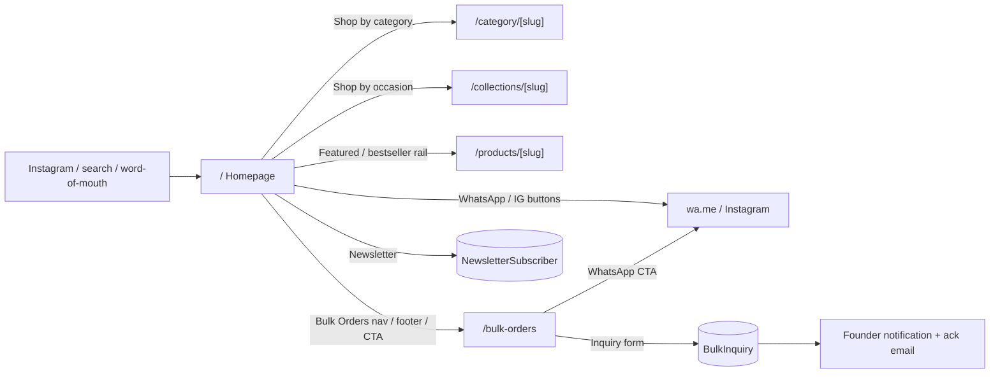
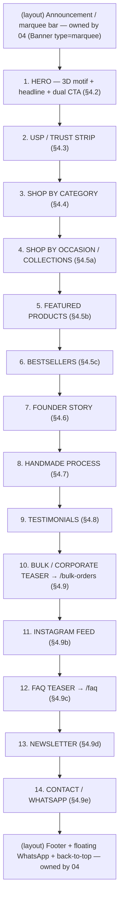
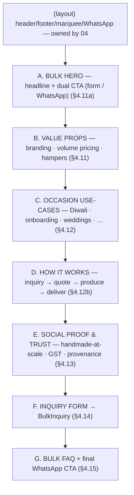
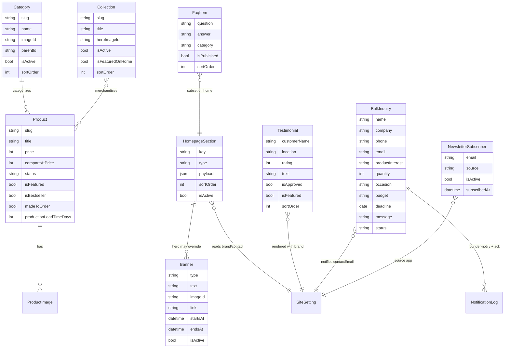
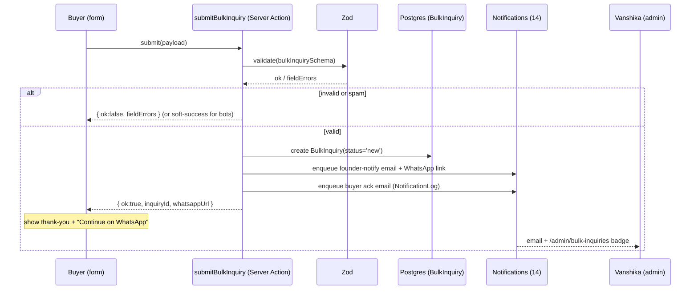

# 05 — Storefront: Landing & Bulk-Order Pages

> **Project:** `vaani-gift-e-commerce` · **Brand:** GooglyWoogly Art · **Founder/CEO:** Vanshika Bhatia · **Base:** Jaipur, Rajasthan, India · **Domain:** `googlywoogly.art`
> **Conforms to:** `00-canonical-decisions.md` (**CANON**) — entity/field names, enums, routes, cache tags, conventions are inherited verbatim. **Upstream intent:** `01-product-vision-and-prd.md` (personas P3 Rohan / P5 Ishaan, FR-1, FR-24, FR-27, FR-29). **Skeleton:** `04-information-architecture-and-routing.md` (route contracts for `/` and `/bulk-orders`, cache-tag matrix §7, analytics emitters §11, header/footer IA). **Field shapes:** `03-data-model-and-entities.md`.
> **Authoritative for:** the full page composition, section-by-section content/merchandising/copy direction of the homepage (`/`), and the corporate/bulk-gifting landing + inquiry flow (`/bulk-orders`). **Not authoritative for:** PLP/PDP internals (`06`/`07`), checkout (`08`), CMS admin editors (`15`), notification transport (`14`), analytics payload schemas (`13`), the data-driven header/footer chrome (`04`).
> Where this spec decides something not fixed in CANON, the decision is stated inline and surfaced under **§11 Open Questions**.

---

## 1. Purpose & Scope

### 1.1 What this covers

1. **The homepage (`/`)** — every section, in render order: the hero (reusing the existing 3D gift-box motif), USP/trust strip, shop-by-category, shop-by-occasion/collections, featured & bestseller product rails, founder story, handmade process, testimonials, Instagram feed, FAQ teaser, newsletter capture, and contact/WhatsApp. For each section: **purpose, content, copy direction, CTA, data source, merchandising logic, responsive behavior**.
2. **The bulk/corporate landing (`/bulk-orders`)** — value propositions (custom branding, volume pricing, curated hampers), occasion use-cases (corporate Diwali, employee onboarding kits, wedding favors), social proof, lead-capture **inquiry form** (fields, Zod validation → `BulkInquiry`), WhatsApp CTA, and acknowledgement email.
3. The **Server Actions** these two pages own (`submitBulkInquiry`, `subscribeNewsletter`), their inputs/outputs/side-effects, and the cache tags they revalidate.
4. **States & edge cases**, **SEO/perf/a11y**, **analytics events** (CANON `AnalyticsEventType`), **acceptance criteria**, and **phasing** for both pages.

### 1.2 What this explicitly does NOT cover

- **The header, mega-menu, footer, mobile drawer, bottom tab bar, marquee/announcement bar, and the floating WhatsApp button** — these are **storefront-layout chrome** owned by `04` (rendered in `(storefront)/layout.tsx`, tags `nav`/`settings`/`banners`). This spec **consumes** them and references their slots; it does not redefine them. (The homepage `page.tsx` renders *inside* that layout.)
- **PLP / category / collection / PDP** pages and product-card internals → `06`/`07`. This spec only specifies the **product/collection/category rails embedded on the homepage** and the **links out** to those pages.
- **Cart, checkout, order placement** → `08`. (Bulk does **not** flow through cart — it is lead-capture; CANON §5 `BulkInquiry`, PRD §4.4.)
- **The CMS admin editors** for `HomepageSection`, `Banner`, `Testimonial`, `FaqItem`, `CmsPage`, `SiteSetting` → `15`. This spec defines the **read contract** (what the storefront renders from those entities) and the **payload shape per section type**; `15` defines the editing UX.
- **Notification transport** (Resend / React Email / `NotificationLog`) → `14`. This spec defines *which* emails fire and *what they contain*, not the delivery plumbing.
- **Analytics payload schemas / rollups** → `13`. This spec names the events and their trigger moments only.

### 1.3 The two pages at a glance

| | `/` (Homepage) | `/bulk-orders` (Corporate/Bulk) |
|---|---|---|
| **Primary persona** | P5 Ishaan (social-discovery) + P1 Aarohi / P2 Meera (entry to funnel) | P3 Rohan (corporate/bulk buyer) |
| **Job** | "Understand the brand, trust it, and enter the catalog" | "See that bulk is offered, then submit one inquiry → personal quote" |
| **Render (CANON §8 / `04` §6.1)** | **RSC-ISR**, `revalidate 3600` | **RSC-ISR + Server Action**, `revalidate 3600` |
| **Cache tags (CANON §9)** | `home`, `banners`, `settings`, `testimonials`, `products`, `nav` | `page:bulk-orders`, `settings` |
| **Indexed** | ✅ `index,follow` | ✅ `index,follow` (the `?success=1` ack state is `noindex`) |
| **Writes** | `NewsletterSubscriber` (footer signup) | `BulkInquiry` (+ derived founder notification + ack email) |
| **Headline analytics** | `page_view`, `newsletter_signup`, `whatsapp_click`, `outbound_click` | `page_view`, `bulk_inquiry_submit`, `whatsapp_click` |

---

## 2. Primary user stories / jobs-to-be-done

> Traceable to PRD §5 JTBD and §9 user stories. "MUST" = MVP unless a phase is noted.

| # | Persona | Story | Satisfied by |
|---|---|---|---|
| **US-05-1** | P5 Ishaan | As a visitor arriving from Instagram, I want a beautiful, fast landing that tells the brand story (handmade, founder-led, Jaipur) and shows proof it's legit, so I trust it and come back. | Homepage hero + founder story + process + testimonials + Instagram feed (FR-1, JTBD-8). |
| **US-05-2** | P1 Aarohi | As a gift-buyer, I want to jump from the homepage straight into the right occasion (Diwali, Rakhi, birthday…) or category, so I find a gift fast. | Shop-by-category + shop-by-occasion sections (JTBD-1). |
| **US-05-3** | P2 Meera | As a décor shopper, I want the homepage to surface curated bestsellers/featured pieces, so I can start browsing the most-loved items. | Featured / bestseller product rails (JTBD-6). |
| **US-05-4** | P1/P2 | As any shopper, I want trust signals (handmade, made-to-order, pan-India, WhatsApp support) immediately on landing, so I feel safe ordering from an unknown micro-brand. | USP/trust strip + testimonials + policy links (PP-6). |
| **US-05-5** | P5 Ishaan | As a browser not ready to buy, I want to subscribe to a newsletter and reach the founder on WhatsApp, so I can stay connected and return when I have an occasion. | Newsletter section + contact/WhatsApp section (FR-27, FR-29, JTBD-8). |
| **US-05-6** | P4 Vanshika | As the founder, I want to reorder/toggle homepage sections, swap the hero/banners, and edit testimonials/FAQ myself and see it live, so I market without an engineer. | `HomepageSection`/`Banner`/`Testimonial`/`FaqItem`-driven rendering + on-demand revalidation (FR-41, US-G5). |
| **US-05-7** | P3 Rohan | As an HR/admin buying gifts in bulk, I want a dedicated page that clearly says "we do corporate/bulk gifting" with value props and use-cases, so I know it's offered and feel confident a maker can deliver at volume. | `/bulk-orders` hero + value props + use-cases + social proof (FR-24, JTBD-7). |
| **US-05-8** | P3 Rohan | As a bulk buyer, I want to submit one structured inquiry (quantity, occasion, budget, deadline, branding, message) and immediately continue on WhatsApp, so I can get a personal quote without DIY-ing a 200-unit cart. | Inquiry form → `BulkInquiry` + WhatsApp CTA + ack email (FR-24, JTBD-7). |
| **US-05-9** | P4 Vanshika | As the founder, when a bulk inquiry arrives I want to be notified instantly and have the lead captured in admin, so no high-value lead is dropped. | `BulkInquiry` write + founder notification (FR-40, US-G7). |

---

## 3. Detailed functional requirements

> Numbered, decisive. Cache tags / entity names / enum values are CANON §5/§6/§9 verbatim. "MUST" = MVP unless a phase is noted.

### 3.1 Homepage — composition & rendering

**FR-1 — The homepage is RSC-ISR and CMS-driven.** `/` MUST be a React Server Component, statically rendered with `revalidate = 3600` (safety net) and refreshed on-demand by the CANON §9 tags `home`, `banners`, `settings`, `testimonials`, `products`. It renders **inside** `(storefront)/layout.tsx` (header/footer/marquee/WhatsApp button from `04`); this spec owns only `page.tsx` and the section components below.

**FR-2 — Section set, order, and toggleability are driven by `HomepageSection`.** The homepage MUST render an **ordered, toggleable** list of sections from `HomepageSection` (CANON §5: `key, type, payload(json), sortOrder, isActive`), ascending by `sortOrder`, skipping `isActive=false`. The canonical section catalog, their `type` keys, and default order are defined in **§4.1 / §5.2**. The founder controls presence, order, and content of each via `/admin/content` (`15`); a code-level **default ordering** (§4.1) is the seed and the fallback if no rows exist.

**FR-3 — Every section degrades gracefully when empty.** If a section's backing data is empty (e.g., no `isFeatured` products, no approved `Testimonial`s, no `Banner`s), the section MUST **self-hide** (render nothing) rather than render an empty shell — except the hero, founder story, and contact/WhatsApp sections, which always render (they have static/`SiteSetting` fallbacks). See §7.

**FR-4 — The hero reuses the existing 3D motif.** The hero MUST reuse the existing `Hero3DScene` (react-three-fiber + drei floating gift-boxes/blobs/sparkles, already vendored in `components/hero-3d-scene.tsx`) as a **dynamically imported, `ssr:false`, client-only** decorative layer behind server-rendered hero copy/CTAs. The 3D layer MUST be **non-blocking** (LCP is the headline text, not the canvas), **`aria-hidden`**, **pointer-events-none**, lazy (`next/dynamic` with `loading:()=>null`), and **disabled under `prefers-reduced-motion`** and on low-power/save-data conditions, falling back to the static gradient + CSS blob background. See §4.2 and §8.

**FR-5 — Hero content is overridable by an active hero `Banner`.** Hero headline/subcopy/primary-CTA MAY be sourced from a `Banner` of `type=hero` (CANON §5/§6: `text?, imageId?, link?, startsAt?, endsAt?, isActive`) when one is active (within `startsAt`/`endsAt`); otherwise the hero falls back to copy stored in the `HomepageSection` of `type=hero` payload, and finally to the hard-coded default brand copy (§4.2). Image-led heroes (e.g., a festive campaign) use `Banner.imageId` as the LCP image.

**FR-6 — Product rails read live catalog data, not snapshots.** The featured and bestseller rails MUST query `Product` where `status=active` and (`isFeatured=true`) / (`isBestseller=true`) respectively, ordered per §4.5, capped (default 8, max 12), and each card MUST render the CANON-derived `inventoryState` badge and ₹ `en-IN` price + `compareAtPrice` strike-through — using the **shared product-card component owned by `06`** (this spec embeds it; it does not re-spec the card). Rails are tagged `products` so a price/stock/feature change revalidates the homepage.

**FR-7 — Shop-by-category and shop-by-occasion read taxonomy/merchandising entities.** The category section MUST read `Category` where `isActive=true` (top-level, ordered by `sortOrder`); the occasion section MUST read `Collection` where `isActive=true AND isFeaturedOnHome=true` (ordered by `sortOrder`). Each tile links to `/category/[slug]` / `/collections/[slug]` respectively. These reads share the `nav`/`products` tags (category/collection edits already revalidate them per `04` §7).

**FR-8 — Testimonials render from approved CMS records.** The testimonials section MUST read `Testimonial` where `isApproved=true` (ordered by `sortOrder`, optionally filtered to `isFeatured=true` for the homepage subset), tagged `testimonials`. Each shows `customerName`, optional `location`, optional `rating`, `text`, optional image. **Product reviews (`Review`) are V1** (CANON §3) and do NOT appear here in MVP.

**FR-9 — The FAQ teaser shows a homepage subset and links to `/faq`.** The homepage FAQ section MUST render a **small subset** (default 4–6) of `FaqItem` where `isPublished=true` (ordered by `sortOrder`), tagged `faq`, with a "See all FAQs" link to `/faq`. It emits `FAQPage` JSON-LD only on `/faq` (the canonical FAQ page), not duplicated on `/` (avoid duplicate structured-data; see §8).

**FR-10 — Newsletter signup writes `NewsletterSubscriber`.** The homepage MUST expose a newsletter capture (also present in the footer per `04`) that, on submit, calls the `subscribeNewsletter` Server Action (§6.2) creating/upserting a `NewsletterSubscriber` (CANON §5: `email, source, isActive, subscribedAt`) with `source` identifying the entry point (e.g., `home_hero`, `home_section`, `footer`). It MUST emit `newsletter_signup` (CANON §6) and show an inline success/duplicate/idempotent confirmation. **Single opt-in with explicit consent copy in MVP; double opt-in is V1** (PRD OQ-7, DPDP).

**FR-11 — The contact/WhatsApp section provides the primary human handoff.** The homepage MUST include a contact/WhatsApp section deep-linking to `SiteSetting.whatsappNumber` via `wa.me` with prefilled text, plus a link to `/contact`. This is **in addition to** the persistent floating WhatsApp button owned by `04` (FR-29). It emits `whatsapp_click` on tap.

**FR-12 — All homepage money/dates/copy follow India-first rules.** Prices render as **₹ with `en-IN` grouping**; any dates render in **IST**; product/brand copy reflects **handmade / each-piece-unique / made-to-order lead time / Jaipur provenance** (CANON §10/§11, PRD PP-7/PP-8).

### 3.2 Bulk-orders page — content & inquiry flow

**FR-13 — `/bulk-orders` is an RSC-ISR landing + inquiry action.** The page MUST be RSC-ISR (`revalidate 3600`, tag `page:bulk-orders`), indexable, with a structured marketing layout (§4.10) and an inquiry form whose submit is a **Server Action** (`submitBulkInquiry`, §6.1). The page's marketing copy/sections MAY be sourced from a `CmsPage` of slug `bulk-orders` (CANON §5) for founder-editability, with a code default fallback (§4.10); structured value-prop/use-case blocks below MAY be hard-coded MVP and CMS-driven later (§12 phasing).

**FR-14 — The page presents three core value propositions.** It MUST communicate, prominently and in this priority: **(1) custom branding/personalization** (logo, brand colors, bespoke message cards), **(2) volume pricing** (per-unit pricing tiers, negotiated by quantity), **(3) curated hampers/sets** (ready-made and bespoke gift sets/hampers). Copy direction in §4.11.

**FR-15 — The page presents concrete occasion use-cases.** It MUST show at least these corporate/bulk use-cases with imagery/copy: **corporate Diwali gifting**, **employee onboarding/welcome kits**, **wedding favors/return gifts**, plus secondary mentions of **client/partner gifting, conference & event swag, milestone/appreciation gifts**. Use-cases SHOULD cross-link to relevant `Collection`s (e.g., a "corporate-gifting" collection) where they exist. Content in §4.12.

**FR-16 — The page shows bulk-specific social proof and trust.** It MUST surface trust signals tuned to a procurement buyer (P3): handmade-at-scale capability, honest lead-time messaging, GST-invoice capability (**configurable** — shown only when `SiteSetting.gstin` is set; CANON §11), Jaipur-made provenance, and bulk-specific testimonials/logos where available (`Testimonial`, optionally tagged for corporate; logos are V1 — see §12). Content in §4.13.

**FR-17 — The inquiry form captures a `BulkInquiry` with the CANON fields.** The form MUST collect and write **exactly** the `BulkInquiry` fields (CANON §5): `name` (required), `company?`, `phone` (required), `email` (required), `productInterest?`, `quantity?`, `occasion?`, `budget?`, `deadline?`, `message` (required), creating the record with `status = new` (CANON §6 `InquiryStatus`). Field/validation contract in §4.14 and §6.1.

**FR-18 — On submit, the system creates the lead, notifies the founder, and acknowledges the buyer.** `submitBulkInquiry` MUST: (a) validate via Zod server-side; (b) create the `BulkInquiry` (`status=new`); (c) emit `bulk_inquiry_submit` (CANON §6); (d) trigger a **founder notification** (email to `SiteSetting.contactEmail`, and a prefilled WhatsApp deep-link surfaced in `/admin/bulk-inquiries` per `12`/`14`); (e) send an **acknowledgement email** to the buyer (logged in `NotificationLog`, owned by `14`); (f) return a success result that renders an on-page thank-you state **and** a one-tap WhatsApp CTA prefilled with the inquiry summary. Side-effects detail in §6.1.

**FR-19 — The page offers an immediate WhatsApp path that does not require the form.** Independently of the form, the page MUST offer a prominent **"Chat on WhatsApp"** CTA (`wa.me` + prefilled corporate-gifting text) for buyers who prefer to talk immediately. It emits `whatsapp_click`. Form-submit and WhatsApp-CTA are complementary (the post-submit thank-you also deep-links to WhatsApp with the inquiry summary).

**FR-20 — Bulk does NOT enter cart/checkout.** The page MUST NOT add products to the cart or invoke checkout. It is **lead-capture only** (PRD §4.4). Any product references are links into the catalog for inspiration, not "add to cart" actions.

### 3.3 Cross-cutting (both pages)

**FR-21 — Both pages are server-rendered, indexable, and SEO-complete.** Both MUST emit correct `metadata` (title/description from `SiteSetting.defaultSeo` + page overrides), canonical self-URL, OpenGraph/Twitter cards, and JSON-LD: `Organization` + `WebSite` (+ `SearchAction`) on `/`; `WebPage`/`ContactPage`-style + `BreadcrumbList` (`Home › Bulk Orders`) on `/bulk-orders` (CANON §8, `04` §6.1). `?success=` thank-you state on `/bulk-orders` is `noindex,follow`.

**FR-22 — Both forms are Zod-validated and DPDP-compliant.** All form inputs MUST be validated client-side (react-hook-form + Zod resolver) **and** server-side (the Server Action re-validates the same Zod schema — server is the source of truth). Forms MUST show a **consent/notice line** (link to `/privacy-policy`), collect **minimal PII**, and honor DPDP (CANON §11, FR-34/FR-47). Server Actions MUST be **rate-limited / spam-guarded** (honeypot + per-IP throttle; see §6.3).

**FR-23 — Both pages emit the correct analytics events.** `page_view` on mount (via the layout's analytics bootstrap, `04` §11); `newsletter_signup`, `whatsapp_click`, `outbound_click` (Instagram/socials) on `/`; `bulk_inquiry_submit`, `whatsapp_click` on `/bulk-orders`. Event names are CANON §6 verbatim (§9).

**FR-24 — Both pages meet CWV "good" on mobile and WCAG 2.1 AA.** Phone-first audience: LCP image prioritized, heavy/decorative JS (3D, animations) deferred and reduced-motion-aware, AA contrast verified on the pink/playful theme (CANON §4 caveat). Details in §8.

---

## 4. UX / UI breakdown

> Layout is **mobile-first** (the audience shops on a phone — PRD P1/P4). Breakpoints follow Tailwind defaults (`sm 640`, `md 768`, `lg 1024`, `xl 1280`). The brand theme is the existing **pink/playful** palette (CANON §4): primary pink `#FF8FAB`/`#FFB3C6`, mint `#B8F4D0`, lilac `#E0C6FF`, butter `#FFE566`, peach `#FFCBA4`, on soft-pink/cream gradients. Serif display for headlines, sans for body (existing). **All decorative animation respects `prefers-reduced-motion`.**

### 4.0 Homepage section map (render order)

The default order below seeds `HomepageSection.sortOrder` and is the code fallback. It mirrors — and rationalizes — the existing `app/page.tsx` composition, slotting "Shop by Occasion" (new, occasion-led, P1) between categories and products, and renaming "Custom Order" to a homepage **bulk teaser** that deep-links to `/bulk-orders`.

> **Merchandising rationale (the "why" of the order):** lead with **emotion + brand** (hero) → **earn trust fast** (USP strip) → **two browse on-ramps** (category = "what it is", occasion = "why I'm buying", serving P2 then P1) → **product proof** (featured, then bestsellers — social-validated) → **deepen trust/story** (founder, process, testimonials — converts the skeptic, PP-6) → **capture the high-value lateral intent** (bulk teaser) → **community + retention** (Instagram, FAQ, newsletter) → **human handoff** (contact/WhatsApp). This is the classic Shopify/Etsy "hook → trust → browse → prove → story → capture" flow, tuned to a founder-led handmade brand where *trust is the conversion lever*.

### 4.1 Section catalog & `HomepageSection.type` keys

Each section is a `HomepageSection` row whose `type` selects the renderer and whose `payload(json)` carries editable content. `key` is a stable unique identifier (CANON §5). Renderers live in `components/home/*`. The existing `components/*.tsx` landing components are the **visual starting point**, refactored to (a) accept server-fetched data as props and (b) split client-only animation into leaf components (the page shell is RSC; only animated leaves are `"use client"`).

| # | `key` (default) | `type` | Renderer | Backing data (read) | Self-hides when… | Phase |
|---|---|---|---|---|---|---|
| 1 | `hero` | `hero` | `HomeHero` | `Banner(type=hero, active)` ?? payload ?? default | never | MVP |
| 2 | `usp` | `usp_strip` | `HomeUSPStrip` | payload (icon+label list) ?? default | never | MVP |
| 3 | `shop-by-category` | `category_grid` | `HomeCategoryGrid` | `Category(isActive, top-level)` | no active categories | MVP |
| 4 | `shop-by-occasion` | `collection_grid` | `HomeOccasionGrid` | `Collection(isActive, isFeaturedOnHome)` | no featured-on-home collections | MVP |
| 5 | `featured-products` | `product_rail` | `HomeProductRail` | `Product(active, isFeatured)` | no featured products | MVP |
| 6 | `bestsellers` | `product_rail` | `HomeProductRail` | `Product(active, isBestseller)` | no bestsellers | MVP |
| 7 | `founder-story` | `founder_story` | `HomeFounderStory` | payload ?? default + `SiteSetting` | never | MVP |
| 8 | `process` | `process` | `HomeProcess` | payload (steps) ?? default | never (default steps) | MVP |
| 9 | `testimonials` | `testimonials` | `HomeTestimonials` | `Testimonial(isApproved[, isFeatured])` | no approved testimonials | MVP |
| 10 | `bulk-teaser` | `bulk_cta` | `HomeBulkTeaser` | payload ?? default → links `/bulk-orders` | never | MVP |
| 11 | `instagram` | `instagram_feed` | `HomeInstagram` | `SiteSetting.socialLinks` + curated tiles (payload) | no handle + no tiles | MVP (static tiles) / V1 (live) |
| 12 | `faq-teaser` | `faq_teaser` | `HomeFaqTeaser` | `FaqItem(isPublished)` subset | no published FAQs | MVP |
| 13 | `newsletter` | `newsletter` | `HomeNewsletter` | payload (copy) ?? default | never | MVP |
| 14 | `contact-whatsapp` | `contact_cta` | `HomeContactCta` | `SiteSetting(whatsappNumber, contactEmail, socialLinks)` | never | MVP |

> **Decision:** `type` is a **closed enum of renderers** (above) — the founder reorders/toggles/edits payloads but cannot invent new section *types* without an engineer (keeps the homepage from drifting into an unmaintainable page-builder). New types are added in code. This balances FR-41 self-serve with build sanity. (Surfaced as OQ-1.)

### 4.2 Section 1 — Hero (with existing 3D motif)

- **Purpose:** Emotional hook + instant brand identity; the single most important above-the-fold trust+desire moment for P5/P1/P2.
- **Layout:** Full-viewport-height (`min-h-[90vh]` on mobile to avoid clipping; `min-h-screen` ≥ md) centered hero. **Z-stack:** (z0) static brand gradient `from-[#FFF0F5] via-[#FFF9FB] to-[#F0E6FF]` + animated CSS blur-blobs; (z0, overlaid) the dynamically-imported **`Hero3DScene`** canvas (`ssr:false`, `aria-hidden`, `pointer-events-none`); (z20) server-rendered hero copy block, centered. Decorative floating icon chips (`hidden md:block`) as today.
- **Content & copy direction (default fallback; overridable by `Banner type=hero` / payload per FR-5):**
  - **Eyebrow badge:** "Handcrafted in Jaipur, with love" (replaces generic "Handcrafted with Love" to assert provenance — CANON §11).
  - **Headline (H1):** keep the existing structure — "Unique **Handmade** Gifts for Every **Occasion**" — with the animated underline flourish. H1 is the **LCP element** and MUST be server-rendered text (not inside the canvas).
  - **Subcopy:** "Personalised, handcrafted gifts and home décor — designed and made by hand by Vanshika Bhatia in Jaipur. Each piece is one of a kind." (Asserts founder + handmade + uniqueness + décor.)
  - **Trust micro-row:** dynamic where possible — "{N}+ happy customers · Handmade to order · Pan-India delivery" (N from `SiteSetting` or a static "100+").
- **CTAs (dual):**
  - **Primary:** "Shop the Collection" → `/products` (NOT a `#` anchor; the existing button currently has no href — **must link to `/products`**).
  - **Secondary:** "Corporate & Bulk Gifting" → `/bulk-orders` (replaces the old `#custom-order` anchor; surfaces the P3 path from the hero per PRD).
- **Key interactions:** scroll-cue chevron (existing); 3D parallax only when motion allowed. On `prefers-reduced-motion` OR `navigator.connection.saveData` OR coarse low-power heuristic → **skip the canvas entirely**, render only the static gradient/blobs (FR-4, §8).
- **Responsive:** mobile = stacked, single-column, larger tap targets (≥44px), 3D scene at reduced `dpr [1,1.5]` and fewer instances (the canvas already caps `dpr`); floating chips hidden < md; CTAs full-width stacked < sm.

### 4.3 Section 2 — USP / Trust strip

- **Purpose:** Convert the "is this legit / what do I get?" anxiety into confidence in one glance (PP-6). Highest-impact trust real estate.
- **Layout:** A single horizontal strip of 4–6 pill/badge items (existing `Features` component refactored). On mobile: horizontally **scroll-snap** carousel or 2-col wrap. Section eyebrow "Why GooglyWoogly", H2 "What makes us special".
- **Content (default; `payload`-editable list of `{icon, label}`):** **Handmade to order** · **Pan-India shipping** · **Easy WhatsApp support** · **Personalisation & gift notes** · **Secure, simple ordering** · **Made in Jaipur**. (Reframes the current generic set toward the model's real differentiators: WhatsApp support, personalization, made-to-order; CANON §11.)
- **CTA:** none (informational); items are non-interactive (or optionally link the relevant proof, e.g., "Pan-India shipping" → `/shipping-policy`).
- **Copy direction:** terse, benefit-led, 2–3 words per pill. Avoid hype; honesty over hype (PP-7).
- **Responsive:** desktop single centered row; mobile scroll-snap with a faint connecting line; AA-contrast text on tinted pill backgrounds (verify — CANON §4).

### 4.4 Section 3 — Shop by Category

- **Purpose:** The "what it is" on-ramp for browsers (P2 Meera) — taxonomy navigation (CANON: Category = what it is).
- **Layout:** Responsive grid of category tiles (image + name + optional count). 2-col mobile / 3-col md / 4–6-col lg. Section header "Shop by Category" + subcopy + a "View all products →" link to `/products`.
- **Content / data:** `Category` where `isActive=true`, top-level (`parentId = null`), ordered by `sortOrder`. Tile image from `Category.imageId` (fallback: a representative product image or a brand placeholder). Tile = `Category.name`; links `/category/[slug]`.
- **Merchandising logic:** show up to N tiles (default 6, max 8); if more categories exist, the last tile is a "View all" affordance. **Self-hide** the whole section if zero active categories (FR-3). Order strictly by `sortOrder` (founder-curated).
- **CTA:** each tile → category PLP; section footer link → `/products`.
- **Responsive:** square/`aspect-square` tiles, lazy-loaded images with `sizes`, hover-zoom (motion-aware); mobile 2-col keeps tap targets large.

### 4.5 Sections 4–6 — Occasion grid + Product rails

#### 4.5a Section 4 — Shop by Occasion / Collections

- **Purpose:** The "why I'm buying" on-ramp (P1 Aarohi) — occasion-led merchandising, the single biggest gifting conversion lever and SEO surface (Diwali/Rakhi/etc.; CANON §11).
- **Layout:** Editorial grid/carousel of **occasion collection** cards (hero image + title + short blurb). 1–2-col mobile / 3-col lg. Header "Gifts for every occasion".
- **Content / data:** `Collection` where `isActive=true AND isFeaturedOnHome=true`, ordered by `sortOrder`. Card image from `Collection.heroImageId`; title from `Collection.title`; links `/collections/[slug]`. Seeded occasions mirror CANON §11 (Diwali, Raksha Bandhan, Holi, Karwa Chauth, weddings, anniversary, birthday, housewarming, corporate gifting) — but **only those flagged `isFeaturedOnHome`** appear; the founder curates which (e.g., promote "Diwali Gifts" in October).
- **Merchandising logic:** seasonal relevance is achieved by the founder toggling `isFeaturedOnHome` / reordering `sortOrder` (no automated date logic in MVP; **automated collections = V1**, CANON §3). Cap default 6. **Self-hide** if none flagged. A "corporate gifting" collection here should also point P3 toward `/bulk-orders`.
- **CTA:** each card → collection landing.
- **Responsive:** large imagery, mobile swipe carousel (Embla — already vendored), text overlay with gradient scrim for AA contrast.

#### 4.5b Section 5 — Featured Products

- **Purpose:** Curated product proof — "start here" hand-picked pieces (founder's editorial pick).
- **Layout:** Horizontal scroll rail (mobile) / 4-col grid (lg) of **shared product cards (`06`)**. Header "Featured" + "View all →" → `/products`.
- **Content / data:** `Product` where `status=active AND isFeatured=true`. Card shows primary image (`ProductImage.isPrimary`), `title`, ₹ price (`en-IN`) + `compareAtPrice` strike-through, and the **`inventoryState` badge** (`in_stock`/`low_stock`/`out_of_stock`/`made_to_order` per CANON §6).
- **Merchandising logic:** order by `isFeatured` then a stable secondary (default `publishedAt` desc; founder ordering deferred to `06`/`11` if a manual sort is added). Cap 8 (max 12). **Self-hide** if none featured. Out-of-stock non-MTO items still appear (badge "Sold"/"Made to order"), preserving SEO/desire (OQ-4, CANON §6).
- **CTA:** card → `/products/[slug]`; rail footer → `/products`.

#### 4.5c Section 6 — Bestsellers

- **Purpose:** Social-proof-driven product discovery ("most-loved") — leverages herd trust.
- **Layout/data:** identical rail to 4.5b but `Product` where `status=active AND isBestseller=true`. Header "Bestsellers" + link to the seeded `bestsellers` collection (`/collections/bestsellers`, per `04` §4.1) so the "View all" has a stable indexable URL.
- **Merchandising logic:** `isBestseller` is a founder-set flag in MVP (true sales-rank sorting is post-MVP analytics work). **Self-hide** if none. To avoid redundancy, a product MAY appear in both featured and bestseller rails (acceptable — different framing).

> Both rails reuse `HomeProductRail` and the `06` product card; both carry tag `products` (FR-6). Add-to-cart from the homepage rail is **allowed** (it emits `add_to_cart`, owned by `06`/`08`) but is secondary to click-through.

### 4.6 Section 7 — Founder story

- **Purpose:** The authenticity moat made human — "a real maker with a story" (PP-6/PP-7, differentiator vs faceless marketplaces). Converts P5/skeptics.
- **Layout:** Two-column on lg (portrait image of Vanshika / her workspace ⟷ story copy), stacked on mobile (image first). Existing `About` component refactored. Soft brand background.
- **Content / copy direction:** First-person, warm, specific to Jaipur and handcraft. Cover: who Vanshika is, why she started, what "handmade & made-to-order" means for the buyer (each piece unique, made for you), and the Jaipur craft heritage. Pull a signature line, e.g., *"Every piece leaves my studio in Jaipur made by hand, for one person — yours."* Include a small signature/credibility row (years crafting, pieces made, cities shipped) if available in payload/`SiteSetting`.
- **Data:** primarily `payload` (heading, body rich text, image id) with defaults; founder name/handle from CANON/`SiteSetting`.
- **CTA:** "Read our full story →" → `/about`; secondary "Follow on Instagram" → `SiteSetting.socialLinks.instagram` (emits `outbound_click`).
- **Responsive:** image `priority={false}` (below the fold), generous line-length for readability; AA contrast.

### 4.7 Section 8 — Handmade process

- **Purpose:** Make the "handmade & made-to-order" promise tangible and set lead-time expectations honestly (PP-7), reducing post-order anxiety.
- **Layout:** A 3–5 step horizontal timeline (icons + step title + one line each), `Process` component refactored. Header "How your gift is made".
- **Content (default steps; `payload`-editable):** **1) You choose or personalise** → **2) Vanshika confirms on WhatsApp** (ties to the off-site model — sets the expectation that purchase completes on WhatsApp, PP-3) → **3) Handcrafted to order in Jaipur** (mention made-to-order lead time) → **4) Carefully packed** → **5) Shipped pan-India with tracking**. This doubles as **expectation-setting for the WhatsApp/offline-payment model** — a deliberate trust device.
- **CTA:** optional "See made-to-order items →" → `/products?availability=made_to_order` (uses the `04` §8.4 query contract).
- **Responsive:** desktop connected timeline; mobile vertical stepper; motion-aware reveal.

### 4.8 Section 9 — Testimonials

- **Purpose:** Peer social proof — the third pillar of trust after story+process (PP-6).
- **Layout:** Carousel (Embla) or 3-up grid of testimonial cards (quote, name, location, optional star rating, optional avatar). Existing `Testimonials` component refactored. Header "Loved by our customers".
- **Content / data:** `Testimonial` where `isApproved=true` (homepage subset may filter `isFeatured=true`), ordered by `sortOrder`. Render `text`, `customerName`, `location?`, `rating?` (stars), image (`imageId`) if present.
- **Merchandising logic:** cap default 6–9; rotate via carousel. **Self-hide** if none approved (FR-3). **No `Review` aggregation here** — product reviews are V1 (CANON §3); these are CMS testimonials only (PRD A-4).
- **CTA:** optional — none required; could deep-link to `/about` or a future reviews page (V1).
- **Responsive:** 1 card mobile / 2 md / 3 lg; swipe; visible focus on controls (a11y).

### 4.9 Sections 10–14 — Bulk teaser, Instagram, FAQ teaser, Newsletter, Contact

#### 4.9 Section 10 — Bulk / Corporate teaser

- **Purpose:** Surface the high-value P3 path from the homepage and route it to `/bulk-orders` (replaces the old "Custom Order" CTA, repointed from a WhatsApp-only anchor to the dedicated landing).
- **Layout:** Full-width banner CTA (existing `CustomOrder` component refactored), gift icon + headline + benefit chips + dual CTA.
- **Content / copy:** Headline "Gifting for your team or event?" Subcopy: "Custom-branded, volume-priced handmade gifts and curated hampers — for corporate Diwali, onboarding kits, weddings and more. Tell us what you need and get a personal quote." Benefit chips: "Custom branding · Volume pricing · Curated hampers · GST invoice on request".
- **CTA:** **Primary:** "Explore Bulk & Corporate" → `/bulk-orders`. **Secondary:** "Chat on WhatsApp" → `wa.me` prefilled (emits `whatsapp_click`). (Both, not WhatsApp-only — the page is the lead-capture destination.)
- **Responsive:** centered, full-width, motion-aware decorative rings (existing).

#### 4.9b Section 11 — Instagram feed

- **Purpose:** Community + freshness proof; bridge back to `@googlywoogly_arrtt` (PRD P5), where much discovery originates.
- **Layout:** A row/grid of 4–8 square image tiles linking out to Instagram; header "@googlywoogly_arrtt on Instagram" + "Follow" button.
- **Content / data — phased:**
  - **MVP:** **curated static tiles** — image ids + permalink URLs stored in section `payload` (or a small `MediaAsset` set), each linking to the post/profile. Handle/profile URL from `SiteSetting.socialLinks.instagram`. (No live API — avoids token/ops burden; CANON keeps WhatsApp/Instagram as click-out, not API, in MVP.)
  - **V1:** optional live feed via Instagram Basic Display / oEmbed, cached.
- **CTA:** "Follow on Instagram" + each tile → permalink; **emits `outbound_click`** (Instagram is a social outbound, not `whatsapp_click`; `04` §11 distinction).
- **Responsive:** 2-col mobile / 4-col md / 6-col lg; lazy images; `loading="lazy"`.
- **Self-hide** if no handle and no tiles configured.

#### 4.9c Section 12 — FAQ teaser

- **Purpose:** Pre-empt the top objections (shipping time, made-to-order, payment-on-WhatsApp, personalization, returns) inline, reducing bounce; funnels to `/faq`.
- **Layout:** Accordion (Radix, vendored) of 4–6 questions; header "Frequently asked"; "See all FAQs →" → `/faq`.
- **Content / data:** subset of `FaqItem` where `isPublished=true`, ordered by `sortOrder` (founder curates which surface; default = first N). Recommended seed questions: "How long does made-to-order take?", "How do I pay?" (explains the WhatsApp confirm-then-pay model), "Do you ship across India?", "Can I personalise my gift?", "What's your returns policy?".
- **CTA:** "See all FAQs" → `/faq`.
- **SEO:** **No FAQPage JSON-LD on `/`** (the canonical FAQ structured data lives on `/faq` to avoid duplication; FR-9, §8).
- **Self-hide** if no published FAQs.

#### 4.9d Section 13 — Newsletter

- **Purpose:** Capture top-of-funnel visitors not ready to buy (P5) for retention/remarketing (PRD §8.3 newsletter signup KPI).
- **Layout:** Centered band: headline + one-line value + email input + subscribe button + consent line. (Also present in footer per `04`; this is the richer homepage instance.)
- **Content / copy:** Headline "Get first dibs + 10% off your first order" (offer optional/founder-configurable via payload; if no offer, "Be the first to see new handmade drops"). Consent line: "By subscribing you agree to receive occasional emails. We respect your privacy — see our [Privacy Policy](/privacy-policy). Unsubscribe anytime." (DPDP single opt-in, FR-10/FR-22, OQ-7.)
- **Behavior / data:** `subscribeNewsletter` action → `NewsletterSubscriber` (`source='home_section'`). Inline states: validating → success ("You're in! 🎉") / already-subscribed (idempotent success, no leak) / error. Emits `newsletter_signup`.
- **CTA:** "Subscribe".
- **Responsive:** stacked input+button on mobile; AA-contrast on the tinted band.

#### 4.9e Section 14 — Contact / WhatsApp

- **Purpose:** The human handoff and reassurance close — "talk to a real person" (the brand's core differentiator).
- **Layout:** A friendly closing band: headline + WhatsApp CTA + secondary "Contact us" link + socials row + business hours/location line. (A full contact **form** lives on `/contact`; the homepage section is a CTA, not the form — keep the homepage lean.)
- **Content / data:** `SiteSetting.whatsappNumber` (WhatsApp deep-link, prefilled "Hi! I have a question about your handmade gifts"), `SiteSetting.contactEmail`, `SiteSetting.socialLinks`, `SiteSetting.businessAddress` (Jaipur) + IST hours.
- **CTA:** **Primary:** "Chat on WhatsApp" (`whatsapp_click`). **Secondary:** "Contact us" → `/contact`. Socials → `outbound_click`.
- **Responsive:** centered, full-width, large WhatsApp button (≥44px).

### 4.10 `/bulk-orders` — page layout map

### 4.11 `/bulk-orders` — Hero & Value propositions

#### 4.11a Section A — Bulk hero

- **Purpose:** Immediately confirm "yes, we do corporate/bulk gifting" and reassure a procurement buyer that a maker can deliver at volume (P3 anxiety).
- **Layout:** Clean, professional hero (less playful than the homepage — this audience is B2B; keep brand warmth but dial down 3D/animation; **no react-three canvas here** — use a static brand image/`heroImageId`). Headline + subcopy + dual CTA + a trust micro-row.
- **Copy direction:** Headline "Handmade corporate & bulk gifting, made in Jaipur." Subcopy: "Custom-branded gifts, curated hampers and volume pricing for teams, clients and events — handcrafted, personally managed by our founder, delivered across India. GST invoice on request." Trust row: "Made to order · Custom branding · Pan-India delivery · GST invoice available".
- **CTA:** **Primary:** "Request a quote" → scrolls to the inquiry form (§4.14). **Secondary:** "Chat on WhatsApp" (`wa.me` prefilled corporate text; `whatsapp_click`).
- **Responsive:** stacked, image-light on mobile for speed.

#### 4.11b Section B — Three value propositions

Three feature cards (icon + title + 2–3 lines), in priority order (FR-14):

| # | Value prop | Copy direction | Proof / detail |
|---|---|---|---|
| 1 | **Custom branding & personalisation** | "Add your logo, brand colours, a bespoke message card, or fully custom designs — gifts that feel like *you*." | Logo printing, branded packaging, personalised notes, bespoke designs. |
| 2 | **Volume pricing** | "The more you order, the better the per-unit price. Tell us your quantity and budget for a tailored quote." | Quantity-tiered pricing (negotiated, off-site — no public price table needed in MVP; honest "quote-based"). |
| 3 | **Curated hampers & sets** | "Ready-made and bespoke gift hampers — mix handmade pieces into beautiful sets for any occasion." | Pre-set hampers + custom hamper building; ties to a "hampers/corporate" collection if present. |

- **Layout:** 3-col lg / 1-col mobile cards; consistent iconography (lucide). **CTA:** each card optionally "Ask about this →" anchored to the form.

### 4.12 `/bulk-orders` — Occasion use-cases & How it works

#### 4.12 Section C — Occasion use-cases

Concrete, imagery-led use-cases so the buyer self-identifies (FR-15). Primary three featured large; secondary three as a compact row.

| Use-case | Copy direction | Cross-link |
|---|---|---|
| **Corporate Diwali gifting** (primary) | "Delight employees and clients this Diwali with handmade, branded gift sets — ordered once, delivered everywhere." | `/collections/diwali` / corporate collection if present |
| **Employee onboarding / welcome kits** (primary) | "Make day one memorable with curated welcome kits — personalised with each joiner's name." | catalog inspiration links |
| **Wedding favors / return gifts** (primary) | "Handcrafted return gifts your guests will actually keep — in your wedding's colours and scale." | `/collections/wedding` if present |
| **Client & partner gifting** (secondary) | "Strengthen relationships with thoughtful, premium handmade gifts." | — |
| **Conference & event swag** (secondary) | "Memorable, non-disposable event gifting that reflects your brand." | — |
| **Milestone & appreciation gifts** (secondary) | "Work anniversaries, awards, thank-yous — celebrate your people." | — |

- **Layout:** primary three as image cards (3-col lg), secondary three as text chips/row. **CTA:** each → form anchor (prefills `occasion` where feasible) and/or relevant collection.

#### 4.12b Section D — How it works (process for bulk)

A 4-step horizontal stepper tuned to the B2B/quote flow, reassuring on lead time and accountability:

1. **Tell us what you need** (submit the form / WhatsApp) → 2. **Get a personal quote** (Vanshika replies, usually within {SLA, e.g., 1 business day}) → 3. **We handcraft your order** (made to order in Jaipur; agreed lead time) → 4. **Delivered, with GST invoice on request** (pan-India dispatch + tracking).

- **Purpose:** kills the "can a hobbyist handle volume / will I get an invoice?" objection. **Copy:** honest lead-time language (PP-7). SLA number sourced from a setting/`OQ`-default (PRD OQ-3, "< 6 business hours" internal target; surface a customer-facing "within 1 business day").

### 4.13 `/bulk-orders` — Social proof & trust

- **Purpose:** De-risk the relationship sale for a procurement buyer (FR-16).
- **Content blocks:**
  - **Bulk testimonials** — `Testimonial` records (optionally tagged/curated for corporate); render quote + name + company/role + location.
  - **Client logos** — a logo wall (**V1** — needs assets/permission; placeholder copy in MVP, e.g., "Trusted by growing teams across India").
  - **Capability/trust strip:** "Handmade at scale · Custom branding · GST invoice available · Made in Jaipur · Personally managed by our founder".
  - **GST line:** shown **only when `SiteSetting.gstin` is set** (CANON §11) — "GST invoice available (GSTIN: {gstin})"; otherwise "GST invoice available on request".
- **Layout:** testimonial carousel + capability strip; logo wall when assets exist. **Self-hide** sub-blocks lacking data (FR-3 spirit).

### 4.14 `/bulk-orders` — Inquiry form

- **Purpose:** Frictionless lead capture → `BulkInquiry` (the entire point of the page; FR-17/18).
- **Form fields** (map 1:1 to CANON §5 `BulkInquiry`; **required** vs optional decided here):

| Field (UI) | `BulkInquiry` field | Type / control | Required | Validation (Zod) | Notes |
|---|---|---|---|---|---|
| Your name | `name` | text | ✅ | `min(2).max(80)` | |
| Company / organisation | `company` | text | ⬜ | `max(120).optional()` | encourage but optional |
| Phone (WhatsApp) | `phone` | tel | ✅ | India-aware phone regex; normalise to E.164 | primary contact channel |
| Email | `email` | email | ✅ | `string().email().max(160)` | for the ack + quote |
| What are you interested in? | `productInterest` | text / select-of-categories+"hampers"/"custom" | ⬜ | `max(200).optional()` | free text + suggestions |
| Quantity (approx.) | `quantity` | number (int) | ⬜ | `int().positive().max(100000).optional()` | drives tiering |
| Occasion | `occasion` | select (CANON §11 occasions + "Corporate"/"Other") | ⬜ | enum-or-string `optional()` | prefilled from use-case click |
| Budget (approx., ₹) | `budget` | text or number (₹) | ⬜ | `max(60).optional()` (store as paise if numeric; see note) | "per unit or total" hint |
| Needed by (deadline) | `deadline` | date | ⬜ | ISO date, **must be ≥ today (IST)** if provided | sets urgency/feasibility |
| Message / details | `message` | textarea | ✅ | `min(10).max(2000)` | the brief |
| Consent | — (not stored as field; gating only) | checkbox | ✅ | `literal(true)` | DPDP consent (FR-22) |
| Honeypot | — | hidden text | (must be empty) | anti-spam (§6.3) | not a real field |

> **`budget` storage decision:** CANON types `budget?` loosely; store the **raw string** as entered (e.g., "₹50,000 total" / "₹200/unit") to preserve buyer intent for the quote — do NOT force a paise integer here (this is a lead note, not an order total; money-as-paise rule applies to `Order`, not free-form lead budget). Surfaced as OQ-2.
> **`deadline` storage:** ISO date (date-only) in UTC; display IST.

- **Layout:** single-column, generously spaced, grouped (Contact → About your gift → Message → Consent → Submit). Inline labels + helper text + per-field error messages. Submit button "Send my inquiry"; below it, "Prefer to chat? **WhatsApp us →**" (the §4.11a WhatsApp CTA, persistent).
- **Submit → on-page thank-you (FR-18):** replace the form with a success card: "Thanks, {name}! We've got your inquiry and will reply within 1 business day." + **"Continue on WhatsApp"** (prefilled with a summary: name, company, qty, occasion, deadline) + "Browse gift ideas" → `/products`. URL gains `?success=1` (`noindex`); on direct visit to `?success=1` without a submit, render the normal page (the success card is driven by action result state, not solely the param).
- **Validation failure:** field-level errors (react-hook-form); server re-validates and returns structured errors mapped back to fields; no data lost (controlled inputs).
- **Responsive:** full-width fields on mobile, ≥44px controls, numeric keyboards for phone/quantity, native date picker for deadline.

### 4.15 `/bulk-orders` — Bulk FAQ + final CTA

- **Purpose:** Close remaining objections (MOQ? lead time? international? customisation limits? payment/invoice?).
- **Content:** accordion of bulk-specific Q&A (may reuse `FaqItem` tagged/`category='bulk'`, or static MVP). Seed: "Is there a minimum order quantity?", "How fast can you deliver bulk orders?", "Can you ship internationally?" (yes — bulk/WhatsApp is the **international** path, CANON §1/§3/PRD A-5), "Do you provide a GST invoice?", "How do payments work for bulk orders?" (quote → invoice → off-site payment, mirroring the brand model).
- **Final CTA:** repeat "Request a quote" (form anchor) + "Chat on WhatsApp".

### 4.16 Shared component inventory (refactor map)

| Existing component | New role / location | Change required |
|---|---|---|
| `components/hero.tsx` + `hero-3d-scene.tsx` + `floating-3d-gift.tsx` | `components/home/HomeHero` + reused 3D leaf | Make shell RSC; keep 3D as `ssr:false` client leaf; add reduced-motion/save-data guard; fix CTAs → `/products` & `/bulk-orders`. |
| `components/features.tsx` | `HomeUSPStrip` | Accept `payload` items; AA-contrast pass; reframe default labels. |
| `components/categories.tsx` | `HomeCategoryGrid` | Read `Category`; link `/category/[slug]`; remove hard-coded list. |
| (new) | `HomeOccasionGrid` | Read featured-on-home `Collection`; link `/collections/[slug]`. |
| `components/products.tsx` | `HomeProductRail` ×2 | Read `Product(active, isFeatured|isBestseller)`; use `06` product card; ₹/`en-IN`; inventory badge. |
| `components/about.tsx` | `HomeFounderStory` | Payload-driven; CTA → `/about`. |
| `components/process.tsx` | `HomeProcess` | Payload steps; add WhatsApp/made-to-order framing. |
| `components/testimonials.tsx` | `HomeTestimonials` | Read `Testimonial(isApproved)`; carousel a11y. |
| `components/custom-order.tsx` | `HomeBulkTeaser` | Repoint primary CTA → `/bulk-orders` (not WhatsApp-only). |
| `components/instagram-feed.tsx` | `HomeInstagram` | Payload tiles + `SiteSetting` handle; `outbound_click`. |
| `components/faq.tsx` | `HomeFaqTeaser` (subset) + full `/faq` page (`15`) | Subset on home; no JSON-LD on home. |
| `components/contact.tsx` | `HomeContactCta` (home) + full form on `/contact` (`15`) | Home = CTA only; full form lives on `/contact`. |
| (new) | `app/(storefront)/bulk-orders/page.tsx` + `components/bulk/*` + `BulkInquiryForm` | New page per §4.10–§4.15. |
| `components/navbar.tsx`, `footer.tsx` | **Replaced by `04`'s data-driven layout** | Not owned here (per `04` §13.1). |

---

## 5. Data & entities used

> Reads/writes use CANON §5 names **exactly**. Full field shapes in `03`.

### 5.1 Reads

| Entity | Fields read | Page / section |
|---|---|---|
| `HomepageSection` | `key, type, payload, sortOrder, isActive` | `/` — drives the whole section list (FR-2) |
| `Banner` | `type, text, imageId, link, startsAt, endsAt, isActive, sortOrder` | `/` hero (`type=hero`); marquee owned by `04` |
| `Category` | `slug, name, imageId, parentId, sortOrder, isActive` | `/` shop-by-category (FR-7) |
| `Collection` | `slug, title, description, heroImageId, sortOrder, isActive, isFeaturedOnHome` | `/` shop-by-occasion (FR-7); `/bulk-orders` cross-links |
| `Product` | `slug, title, price, compareAtPrice, status, inventoryQuantity, inventoryState(derived), madeToOrder, productionLeadTimeDays, primaryImageId, isFeatured, isBestseller` | `/` featured + bestseller rails (FR-6) |
| `ProductImage` | `url, alt, width, height, isPrimary` | rail/card images |
| `Testimonial` | `customerName, location, rating, text, imageId, isApproved, sortOrder, isFeatured` | `/` testimonials (FR-8); `/bulk-orders` social proof |
| `FaqItem` | `question, answer, category, sortOrder, isPublished` | `/` FAQ teaser (FR-9); `/bulk-orders` bulk FAQ |
| `SiteSetting` | `whatsappNumber, contactEmail, socialLinks, businessAddress, gstin, freeShippingThreshold, defaultSeo, logoId, announcementBar` | both pages (WhatsApp/contact/GST/SEO/branding) |
| `MediaAsset` | `url, alt, width, height` | Instagram tiles, hero/section imagery (via id refs) |
| `CmsPage` *(optional)* | `slug, title, bodyRich, metaTitle, metaDescription, isPublished` | `/bulk-orders` marketing copy (slug `bulk-orders`), if CMS-sourced (FR-13) |

### 5.2 Writes

| Entity | Written by | When | Fields written |
|---|---|---|---|
| `BulkInquiry` | `submitBulkInquiry` (§6.1) | `/bulk-orders` form submit | `name, company?, phone, email, productInterest?, quantity?, occasion?, budget?, deadline?, message`, `status='new'`, `createdAt` |
| `NewsletterSubscriber` | `subscribeNewsletter` (§6.2) | `/` (and footer) newsletter submit | `email`, `source`, `isActive=true`, `subscribedAt` (upsert by `email`) |
| `NotificationLog` *(via `14`)* | side-effect of `submitBulkInquiry` | after inquiry create | founder-notify + buyer-ack rows (channel `email`, status per `14`) |
| `AnalyticsEvent` *(via `13`)* | client emitters | per §9 | `type, visitorId, sessionId, path, metadata, …` |

> **Not written here:** `Order`, `OrderItem`, `Customer`, `ContactMessage` (the latter is the `/contact` form, owned by `15`). The homepage contact section is a **CTA**, not a form (§4.9e).

### 5.3 Derived / computed

- `inventoryState` (CANON §6) — derived per product for rail badges (read-only display).
- **Active hero banner** — `Banner` where `type=hero AND isActive AND now ∈ [startsAt, endsAt]`, latest by `sortOrder` (FR-5).
- **Section list** — `HomepageSection` filtered `isActive`, sorted `sortOrder`, merged with code defaults (§4.1).
- **WhatsApp deep-links** — composed from `SiteSetting.whatsappNumber` + URL-encoded prefilled text per context (hero, bulk, contact, post-submit summary).

### 5.4 ER (read/write surface for these two pages)

---

## 6. Server actions / API routes

> Both actions are **Next.js Server Actions** (App Router), Zod-validated server-side (the source of truth), invoked from `"use client"` form components via `react-hook-form`. No public REST route is added for these (forms post to actions). Naming follows the codebase convention `verbNoun`.

### 6.1 `submitBulkInquiry` (Server Action)

| Aspect | Spec |
|---|---|
| **Trigger** | `/bulk-orders` inquiry form submit (FR-17/18). |
| **Input (Zod `bulkInquirySchema`)** | `{ name: string(2..80), company?: string(..120), phone: string (India-aware, normalised E.164), email: string.email(..160), productInterest?: string(..200), quantity?: int.positive().max(100000), occasion?: string(..40), budget?: string(..60), deadline?: ISO-date ≥ today(IST), message: string(10..2000), consent: literal(true), website?: string (honeypot — must be empty) }` |
| **Output** | `{ ok: true, inquiryId, whatsappUrl }` or `{ ok: false, fieldErrors, formError }` (typed result for RHF). |
| **Side-effects (ordered)** | 1) Re-validate (Zod) — reject on failure with field errors. 2) Spam guard: reject if honeypot filled or per-IP/throttle exceeded (§6.3) → generic soft-success (no info to bots). 3) `prisma.bulkInquiry.create({ … status:'new' })`. 4) Emit `bulk_inquiry_submit` server-side analytics (or return a flag for the client to emit; payload `13`). 5) Enqueue **founder notification** email to `SiteSetting.contactEmail` + create the prefilled WhatsApp link for `/admin/bulk-inquiries` (transport `14`). 6) Enqueue **buyer acknowledgement** email (template `bulk_inquiry_ack`, `14`) → `NotificationLog`. 7) Build `whatsappUrl` (prefilled summary) and return it. |
| **Revalidation** | **None on the storefront** — `BulkInquiry` is admin-only data; `/admin/bulk-inquiries` is SSR/no-cache (`04` §7 "none cached"). Do **not** revalidate `page:bulk-orders` on submit. |
| **Failure modes** | DB error → `{ ok:false, formError:'Something went wrong, please WhatsApp us.' }` + Sentry capture; email failure is non-blocking (lead is already saved; log + retry per `14`). |
| **Auth** | Public (no auth); guarded by validation + rate-limit + honeypot. |

### 6.2 `subscribeNewsletter` (Server Action)

| Aspect | Spec |
|---|---|
| **Trigger** | Homepage newsletter section submit (and footer, shared — `04`) (FR-10). |
| **Input (Zod `newsletterSchema`)** | `{ email: string.email(..160), source: enum('home_hero','home_section','footer','bulk', …) default 'home_section', consent: literal(true), website?: honeypot }` |
| **Output** | `{ ok: true, status: 'subscribed' | 'already' }` or `{ ok:false, fieldError }`. |
| **Side-effects** | 1) Validate. 2) Spam guard (§6.3). 3) **Upsert** `NewsletterSubscriber` by unique `email`: create with `isActive=true, subscribedAt=now, source`; if exists & active → return `status:'already'` (idempotent, no leak); if exists & inactive → reactivate. 4) Emit `newsletter_signup` (payload `13`). 5) (V1) double opt-in confirmation email; (MVP) optional welcome email (`14`). |
| **Revalidation** | None (subscriber list is admin/CRM data, not cached storefront). |
| **DPDP** | Single opt-in + explicit consent copy in MVP; store consent timestamp = `subscribedAt`. Double opt-in V1 (OQ-7). |
| **Auth** | Public; rate-limited. |

### 6.3 Anti-spam / rate-limiting (shared, FR-22)

- **Honeypot:** hidden `website` field; if non-empty → silently succeed (bots think they won) but **do not** persist.
- **Throttle:** per-IP (and per-email for newsletter) sliding-window limit (e.g., ≤ 5 inquiry submits / 10 min / IP; ≤ 3 newsletter / min / IP). Backed by a lightweight store (Postgres counter or Upstash if available); exceeded → soft-fail with friendly message + WhatsApp fallback.
- **Timing/JS:** server action requires the form's CSRF/action token (built into Next Server Actions) — no naked endpoint to script.
- **Minimal PII + retention:** only the CANON fields; retention/erasure per DPDP (`16`).

### 6.4 Read helpers (server, for RSC rendering)

Not actions (no mutation), but the data-access functions the pages call (defined in `lib/queries` per `02`/`03`), each wrapped with the appropriate `unstable_cache`/`fetch` tags so revalidation works:

| Helper | Returns | Cache tag(s) |
|---|---|---|
| `getHomepageSections()` | ordered active `HomepageSection[]` merged w/ defaults | `home` |
| `getActiveHeroBanner()` | `Banner?` (type=hero, in window) | `banners` |
| `getHomeCategories()` | active top-level `Category[]` | `nav`, `products` |
| `getHomeCollections()` | featured-on-home `Collection[]` | `nav`, `products` |
| `getFeaturedProducts()` / `getBestsellers()` | `Product[]` (+primary image, derived state) | `products` |
| `getHomeTestimonials()` | approved `Testimonial[]` | `testimonials` |
| `getHomeFaqs(limit)` | published `FaqItem[]` subset | `faq` |
| `getSiteSettings()` | `SiteSetting` | `settings` |
| `getBulkPageContent()` | `CmsPage?` (slug `bulk-orders`) + defaults | `page:bulk-orders` |

---

## 7. States & edge cases

| Scenario | Page / section | Behavior |
|---|---|---|
| **Loading** | both | `(storefront)/loading.tsx` + per-section skeletons (rail cards, tiles); hero renders its static gradient immediately (no canvas blocking). Never blank. |
| **No `HomepageSection` rows** | `/` | Render the **code-default** section set in default order (FR-2). |
| **Section `isActive=false`** | `/` | Omit entirely (no gap, no heading). |
| **Empty featured/bestseller** | rails | **Self-hide** the rail (FR-3). Never render an empty "Featured" heading. |
| **Empty categories/occasions** | grids | **Self-hide** the section. |
| **No approved testimonials** | testimonials | **Self-hide**. |
| **No published FAQs** | FAQ teaser | **Self-hide** (the `/faq` page still exists via `15`). |
| **No active hero banner** | hero | Fall back to `HomepageSection(hero).payload`, then hard-coded default copy (FR-5). |
| **Out-of-stock / made-to-order product in a rail** | rails | Card still shows (SEO/desire); badge "Made to order — ships in {leadTime} days" (MTO) or "Sold" (true OOS non-MTO, OQ-4). Add-to-cart logic owned by `06`/`07`. |
| **Price/`compareAtPrice` changed in admin** | rails | On next request the ISR page re-renders (tag `products` busted by `11`) — homepage shows fresh price (CANON §9 real-time). |
| **3D scene fails / WebGL unavailable / reduced-motion / save-data** | hero | Canvas not mounted (or its error boundary catches); static gradient+blobs remain; **no layout shift** (the canvas is absolutely positioned, z0). |
| **Newsletter: invalid email** | newsletter | Inline field error; no submit; no event. |
| **Newsletter: duplicate email** | newsletter | Idempotent success ("You're already subscribed 💛") — **no existence leak**, `status:'already'`. |
| **Newsletter: action error** | newsletter | Friendly inline error + retry; Sentry capture. |
| **Bulk form: validation failure** | `/bulk-orders` | Field-level errors (client + server); inputs preserved (controlled); focus first invalid; no `BulkInquiry` written. |
| **Bulk form: deadline in the past** | form | Reject with "Please choose a future date" (IST-aware). |
| **Bulk form: submit success** | `/bulk-orders` | Replace form with thank-you card + WhatsApp continue (prefilled summary) + browse CTA; `?success=1` (`noindex`); `bulk_inquiry_submit` fired once. |
| **Bulk form: DB write fails** | form | "Something went wrong — please WhatsApp us" + the WhatsApp CTA (so the lead isn't lost); Sentry. |
| **Bulk: ack/notify email fails** | server | Non-blocking — lead is saved; logged in `NotificationLog`, retried per `14`. |
| **Spam / bot submit** | both | Honeypot/throttle → soft-success, nothing persisted (§6.3). |
| **`?success=1` visited directly (no submit)** | `/bulk-orders` | Render the normal page (success card is driven by action-result state, not the param alone). |
| **GST not configured** | `/bulk-orders` trust | Show "GST invoice on request" (no GSTIN number) — `gstin` unset (CANON §11). |
| **Instagram not configured** | `/` IG section | Self-hide (no handle + no tiles). |
| **Slow/edge network (phone)** | both | Static-first HTML at edge (ISR); images lazy + responsive; JS/animation deferred; CWV protected (§8). |

---

## 8. SEO / performance / accessibility

### 8.1 SEO

- **Metadata:** root `layout` provides defaults from `SiteSetting.defaultSeo` (title template `%s · GooglyWoogly Art`); `/` overrides title/description with a brand-led, keyword-rich pair ("Handmade Gifts & Home Décor, Made in Jaipur | GooglyWoogly Art"); `/bulk-orders` overrides with "Corporate & Bulk Gifting — Handmade in Jaipur | GooglyWoogly Art" (FR-21).
- **Canonical:** both emit `alternates.canonical` to their clean absolute URL from `NEXT_PUBLIC_SITE_URL` (`/` and `/bulk-orders`); the `?success=1` state sets `robots: noindex,follow` (`04` §6.1).
- **JSON-LD:**
  - `/`: `Organization` (name, logo `SiteSetting.logoId`, `sameAs` socials, Jaipur `address`), `WebSite` + `SearchAction` (points at `/search?q=`).
  - `/bulk-orders`: `BreadcrumbList` (`Home › Bulk Orders`) + a `Service`/`WebPage` describing corporate gifting (and `Organization` reference). **Optionally** `Offer`-less `Service`; no fake pricing.
  - **FAQ structured data is emitted only on `/faq`** (canonical), not on the homepage teaser or duplicated on `/bulk-orders` (avoid duplicate `FAQPage`); the bulk FAQ may use `FAQPage` **only if** it's the canonical home of those Q&As (decision: keep bulk FAQ as plain accordion in MVP, no JSON-LD, to avoid conflict — OQ-3).
- **Headings:** exactly one `<h1>` per page (hero headline); sections use `<h2>`; logical order (a11y + SEO).
- **Internal linking (equity spread):** `/` links to all top categories, featured occasions, `/products`, `/bulk-orders`, `/about`, `/faq`, policies (footer, `04`). `/bulk-orders` links to relevant collections + back to catalog.
- **Sitemap:** both are in `sitemap.ts` as indexable canonical URLs (`04` §10.1); `?success=` excluded.

### 8.2 Performance (Core Web Vitals "good" on mobile — CANON §2/§4)

- **LCP** = hero headline (server-rendered text) or hero `Banner.imageId` when image-led; that image gets `priority` + correct `sizes`; **the 3D canvas is never the LCP** and is deferred (`next/dynamic`, `ssr:false`, `loading:()=>null`).
- **3D budget:** mount the canvas only after hydration + `requestIdleCallback`, **skip** under `prefers-reduced-motion`, `saveData`, or `hardwareConcurrency<=4` heuristic; cap `dpr [1,1.5]` (already), pause `useFrame` when offscreen (intersection) and on tab blur. This protects INP/CLS and battery on phones.
- **CLS:** all media has explicit width/height/aspect-ratio; the canvas is absolutely positioned (z0) so it can't shift content; skeletons match final dimensions.
- **JS:** page shell is RSC; only animated leaves are client components; framer-motion usage is scoped; Embla carousels lazy. Avoid the current blanket `"use client"` homepage (the existing `app/page.tsx` is fully client — **must be refactored to RSC shell**, CANON §4 "remove blanket use client").
- **Images:** Cloudinary responsive `srcset` (CANON §4), `loading="lazy"` below the fold, AVIF/WebP; remove `images.unoptimized`.
- **Caching:** ISR static HTML at the edge; on-demand revalidation keeps it fresh without SSR cost.

### 8.3 Accessibility (WCAG 2.1 AA — CANON §4)

- **Landmarks:** one `<main id="content">`; sections use `<section aria-labelledby>`; skip-to-content link (root layout, `04`).
- **3D/decoration:** canvas + decorative blobs/sparkles are `aria-hidden` and `pointer-events-none`; **all motion respects `prefers-reduced-motion`** (hero, marquee, reveals, carousels autoplay off under reduced-motion).
- **Forms:** every input has a `<label>` (not placeholder-only); errors via `aria-describedby` + `aria-invalid`; consent checkbox is keyboard-reachable; submit announces success/error to a live region (`aria-live="polite"`). The bulk form thank-you state moves focus to the success heading.
- **Contrast:** **verify** the pink/mint/butter palette meets AA (4.5:1 text / 3:1 large) — the brand theme is flagged in CANON §4; darken text-on-tint or add scrims where needed (e.g., text over occasion-card imagery uses a gradient scrim).
- **Targets:** all CTAs/inputs ≥44×44px (phone-first); carousels keyboard-operable with visible focus; "skip carousel" where long.
- **Links vs buttons:** WhatsApp/Instagram/CTAs that navigate are `<a>` (with `rel="noopener noreferrer"` + `target="_blank"` for outbound), not `onClick` divs.

---

## 9. Analytics events emitted

> CANON §6 `AnalyticsEventType` names verbatim; emitters mounted per `04` §11; payload schemas owned by `13`.

| Event | Page / trigger | `metadata` (suggested) |
|---|---|---|
| `page_view` | `/` and `/bulk-orders` on load (+ soft nav) — via layout bootstrap | `path`, `referrer`, `utm` |
| `newsletter_signup` | `/` (and footer) successful `subscribeNewsletter` | `source` (`home_hero`/`home_section`/`footer`), `status` |
| `whatsapp_click` | any `wa.me` CTA on `/` (contact/bulk-teaser sections) and on `/bulk-orders` (hero/final/post-submit) | `location` (hero/contact/bulk_teaser/bulk_hero/bulk_thanks) |
| `outbound_click` | Instagram/social links on `/` (IG feed, founder story, contact) | `platform` (instagram/…), `url` |
| `bulk_inquiry_submit` | `/bulk-orders` successful `submitBulkInquiry` | `occasion?`, `quantity?`, `hasCompany`, `hasDeadline` (no PII in metadata) |
| `collection_view` / `category_view` / `product_view` | **NOT fired here** — fired on the destination pages (`06`/`07`); homepage tiles only generate `page_view` + the click navigation | — |
| `add_to_cart` | if add-to-cart is enabled on homepage rails (owned by `06`/`08`) | per `08` |

> **Distinction (`04` §11):** WhatsApp links emit `whatsapp_click`; **other** externals (Instagram/socials) emit `outbound_click` — never both for the same click. No PII (name/email/phone) is ever placed in analytics `metadata` (DPDP).

---

## 10. Acceptance criteria

> Testable checklist. Maps to FRs. "✓ by demo/test."

### 10.1 Homepage

- [ ] **AC-1** `/` renders **server-side (RSC)**, statically (ISR `revalidate 3600`), inside the `04` storefront layout; the page shell is **not** a blanket client component. *(FR-1)*
- [ ] **AC-2** Sections render in `HomepageSection.sortOrder`, skipping `isActive=false`; with **no rows**, the code-default order (§4.1) renders. *(FR-2)*
- [ ] **AC-3** Each data-backed section **self-hides** when empty (featured/bestseller/categories/occasions/testimonials/FAQ/Instagram), with no orphan headings; hero/founder/contact always render. *(FR-3)*
- [ ] **AC-4** The hero reuses the existing **3D gift-box motif** as a deferred, `ssr:false`, `aria-hidden`, pointer-events-none layer; the **headline (LCP) is server-rendered text**; the canvas is **skipped under `prefers-reduced-motion`/save-data** with no CLS. *(FR-4, §8.2/8.3)*
- [ ] **AC-5** Hero CTAs link to **`/products`** (primary) and **`/bulk-orders`** (secondary) — no dead `#` anchors. *(FR-4/FR-5)*
- [ ] **AC-6** An active `Banner(type=hero)` overrides hero copy/image; absent one, payload/default copy shows. *(FR-5)*
- [ ] **AC-7** Featured & bestseller rails read live `Product(active, isFeatured|isBestseller)`, show ₹ `en-IN` price + `compareAtPrice` strike + **`inventoryState` badge**, using the `06` product card; tagged `products`. *(FR-6)*
- [ ] **AC-8** Shop-by-category reads active top-level `Category` → `/category/[slug]`; shop-by-occasion reads `Collection(isActive, isFeaturedOnHome)` → `/collections/[slug]`. *(FR-7)*
- [ ] **AC-9** Testimonials read `Testimonial(isApproved)` (no `Review`); FAQ teaser reads a `FaqItem(isPublished)` subset and links to `/faq`; **no FAQPage JSON-LD duplicated on `/`**. *(FR-8/FR-9, §8.1)*
- [ ] **AC-10** Newsletter submit writes/upserts `NewsletterSubscriber` (with `source`), emits `newsletter_signup`, shows success/duplicate(idempotent)/error inline, with consent copy + `/privacy-policy` link. *(FR-10, FR-22)*
- [ ] **AC-11** A contact/WhatsApp section deep-links to `SiteSetting.whatsappNumber` (prefilled) and to `/contact`; emits `whatsapp_click`. *(FR-11)*
- [ ] **AC-12** Editing homepage content/banners/testimonials/FAQ/a product in admin **revalidates** `home`/`banners`/`testimonials`/`faq`/`products` and the change is **live without redeploy**. *(FR-1/FR-6, `04` §7)*
- [ ] **AC-13** All prices ₹ `en-IN`; dates IST; copy reflects handmade/uniqueness/Jaipur/made-to-order. *(FR-12)*

### 10.2 Bulk-orders

- [ ] **AC-14** `/bulk-orders` is RSC-ISR, indexable, with the §4.10 sections; marketing copy may come from `CmsPage(bulk-orders)` with a code default. *(FR-13)*
- [ ] **AC-15** The three value props (custom branding, volume pricing, curated hampers) are present and prioritized. *(FR-14)*
- [ ] **AC-16** Occasion use-cases include **corporate Diwali, onboarding kits, wedding favors** (+ secondary), with cross-links where collections exist. *(FR-15)*
- [ ] **AC-17** Bulk social proof/trust is shown; **GST line only when `SiteSetting.gstin` is set** (else "on request"). *(FR-16)*
- [ ] **AC-18** The inquiry form collects exactly the `BulkInquiry` fields, required = name/phone/email/message/consent; submit writes `BulkInquiry(status='new')`. *(FR-17)*
- [ ] **AC-19** On submit: `bulk_inquiry_submit` fires once; founder notification + buyer ack email enqueued (`NotificationLog`); a thank-you card + **"Continue on WhatsApp"** (prefilled summary) renders; `?success=1` is `noindex`. *(FR-18, FR-21)*
- [ ] **AC-20** A WhatsApp CTA (prefilled corporate text) is available **independently of the form**; emits `whatsapp_click`. *(FR-19)*
- [ ] **AC-21** The page **never** adds to cart or invokes checkout. *(FR-20)*
- [ ] **AC-22** Submitting `BulkInquiry` triggers a founder notification so no lead is dropped; on DB error the WhatsApp fallback is offered and the error is captured. *(FR-18, §7)*

### 10.3 Cross-cutting

- [ ] **AC-23** Both forms are Zod-validated **client + server** (server authoritative), honeypot + throttled, with DPDP consent/notice. *(FR-22, §6.3)*
- [ ] **AC-24** Correct metadata, canonical, OG/Twitter, and JSON-LD per §8.1 on both pages; both in `sitemap.xml`. *(FR-21)*
- [ ] **AC-25** Both pass **CWV "good"** on mobile (LCP image prioritized, 3D/animation deferred + reduced-motion-aware) and **WCAG 2.1 AA** (labels, contrast, ≥44px, live-region announcements). *(FR-24, §8)*
- [ ] **AC-26** Events emitted exactly per §9 with correct CANON names; **no PII in analytics metadata**; WhatsApp→`whatsapp_click`, socials→`outbound_click` (never both). *(FR-23)*

---

## 11. Dependencies, assumptions & open questions

### 11.1 Dependencies

| Depends on | For |
|---|---|
| `00` CANON | Entity/field/enum/route/cache-tag/convention contract. |
| `04` IA & Routing | The `(storefront)` layout chrome (header/mega-menu/footer/marquee/floating WhatsApp/bottom bar), route contracts for `/` & `/bulk-orders`, the **cache-tag → trigger matrix (§7)**, analytics emitter mounting (§11), seeded `bestsellers` collection. |
| `03` Data Model | Final shapes of `HomepageSection`, `Banner`, `Collection`, `Category`, `Product`, `Testimonial`, `FaqItem`, `BulkInquiry`, `NewsletterSubscriber`, `SiteSetting`, `MediaAsset`, `CmsPage`. |
| `06` Catalog | The **shared product-card component** + `inventoryState` badge embedded in homepage rails; `/products`, `/category/*`, `/collections/*` destinations. |
| `15` CMS | Admin editors for `HomepageSection`/`Banner`/`Testimonial`/`FaqItem`/`CmsPage`/`SiteSetting`; the full `/faq` and `/contact` pages (the homepage uses teasers/CTAs only). |
| `14` Notifications | Founder-notify + buyer-ack emails, `NotificationLog`, the `bulk_inquiry_ack` `EmailTemplate`, and the admin prefilled-WhatsApp link. |
| `13` Analytics | Payload schemas + ingestion for the §9 events; `AnalyticsEvent` write. |
| `09` SEO/ISR | Metadata helpers, JSON-LD utilities, sitemap/robots, revalidation transport. |
| `02` Architecture | `lib/queries` data-access + cache-tag wrapping; Cloudinary; Zod/RHF setup; rate-limit store. |
| Env (CANON §10) | `NEXT_PUBLIC_SITE_URL`, `WHATSAPP_NUMBER`, `RESEND_API_KEY`/`SMTP_*`, `REVALIDATE_SECRET`. |
| Existing scaffold | `components/hero*.tsx`, `features/categories/products/about/process/testimonials/instagram-feed/custom-order/faq/contact.tsx` (refactor map §4.16); `@react-three/fiber`+`drei`+`three`, `framer-motion`, `embla-carousel-react`, `sonner`, `react-hook-form`, `zod` (all already in `package.json`). |

### 11.2 Assumptions (decisions made here, beyond CANON/notes)

1. **`HomepageSection.type` is a closed renderer enum** (§4.1) — founder reorders/toggles/edits payloads; new section *types* require an engineer (prevents page-builder sprawl). *(OQ-1)*
2. **`bulk-teaser` replaces the old "Custom Order"** homepage block and routes to `/bulk-orders` (not a WhatsApp-only anchor), making `/bulk-orders` the canonical lead-capture destination.
3. **Homepage contact section is a CTA, not a form**; the full contact form (→ `ContactMessage`) lives on `/contact` (`15`). Keeps `/` lean and avoids duplicating the `ContactMessage` write here.
4. **Instagram feed is curated static tiles in MVP** (payload/`MediaAsset` + permalinks), live API V1 — avoids token/ops burden, consistent with CANON's click-out (not API) social stance for MVP.
5. **`bulk.budget` stored as the raw entered string** (lead note), not paise — money-as-paise applies to `Order`, not free-form lead budget. *(OQ-2)*
6. **Newsletter = single opt-in + explicit consent in MVP**, double opt-in V1 (PRD OQ-7, DPDP).
7. **Bulk FAQ accordion carries no `FAQPage` JSON-LD in MVP** (the canonical FAQ structured data lives on `/faq`) to avoid duplicate structured data. *(OQ-3)*
8. **Customer-facing bulk response SLA = "within 1 business day"** (front-end copy), backed by the PRD internal "< 6 business hours" target (PRD OQ-3). Sourced from a setting/default.
9. **Hero LCP** is the headline text (or `Banner.imageId` when image-led); the 3D canvas is decorative and never load-blocking.

### 11.3 Open questions (founder / cross-spec)

| # | Question / conflict | Default (if no answer) |
|---|---|---|
| **OQ-1** | Confirm `HomepageSection.type` is a **closed renderer set** (engineer adds new types) vs a free-form page-builder. | Closed renderer set (§4.1) — coordinate the enum with `15`. |
| **OQ-2** | `BulkInquiry.budget` shape: free-text string (recommended) vs structured `{amount, basis}`? CANON leaves it loose. | Store raw string; revisit if quoting wants structure. (Coordinate with `03`.) |
| **OQ-3** | Where does **FAQPage JSON-LD** live — only `/faq` (recommended) or also the bulk FAQ? | Only `/faq`; bulk FAQ = plain accordion in MVP. |
| **OQ-4** | Should out-of-stock one-of-a-kind products **stay in the homepage rails** (as "Sold/Made-to-order") or be filtered out? (Mirrors PRD OQ-4.) | Keep them (SEO/desire), badged; confirm with `07`. |
| **OQ-5** | Newsletter **offer** ("10% off first order") — is a first-order discount actually available? Coupons are **V1** (CANON §3), so the incentive may not be redeemable at MVP launch. | Use a non-discount value prop ("first dibs on new drops") until coupons ship; founder may supply a manual WhatsApp code. |
| **OQ-6** | Should `/bulk-orders` marketing copy be **CMS-editable** (`CmsPage` slug `bulk-orders`) from day one, or hard-coded MVP then CMS V1? | Hard-code structured blocks in MVP; wire `CmsPage` copy for hero/intro; full CMS V1 (coordinate `15`). |
| **OQ-7** | **Corporate logo wall / named-client social proof** — are assets + permissions available? | Placeholder trust copy in MVP; real logos V1. |
| **OQ-8** | Confirm the canonical **WhatsApp number** + the brand **Instagram handle** in `SiteSetting` (existing code hard-codes `916367851899` and `@googlywoogly_arrtt`; CANON uses `SiteSetting.whatsappNumber`/`socialLinks`). | Drive everything from `SiteSetting`; migrate the hard-coded values during `02`/`15` setup (ties to PRD OQ-8). |

---

## 12. Phasing — MVP vs V1 vs later

| Capability | MVP | V1 | V2/later |
|---|---|---|---|
| Homepage RSC-ISR shell + `HomepageSection`-driven ordered sections | ✅ | | |
| Hero with existing 3D motif (deferred, reduced-motion-aware) + `Banner(type=hero)` override | ✅ | | |
| USP strip, shop-by-category, shop-by-occasion, featured + bestseller rails | ✅ | | |
| Founder story, handmade process, testimonials (CMS, approved) | ✅ | | |
| Bulk teaser → `/bulk-orders`, FAQ teaser → `/faq`, newsletter (single opt-in), contact/WhatsApp CTA | ✅ | | |
| Instagram feed — **curated static tiles** | ✅ | | |
| Instagram feed — **live API/oEmbed** | | ✅ | |
| `/bulk-orders` landing: hero, 3 value props, occasion use-cases, how-it-works, trust strip | ✅ | | |
| Bulk inquiry form → `BulkInquiry` + founder notify + buyer ack email + WhatsApp CTA | ✅ | | |
| `/bulk-orders` marketing copy fully CMS-editable (`CmsPage`) | (partial) | ✅ | |
| Corporate **logo wall** / named-client proof | | ✅ | |
| Newsletter **double opt-in** | | ✅ | |
| Newsletter **first-order coupon** incentive (depends on Coupons V1) | | ✅ | |
| Bulk **public volume-pricing tiers** table | | ✅ | |
| Bulk **product reviews / `AggregateRating`** social proof | | ✅ | |
| Automated/seasonal homepage merchandising rules (auto-promote occasion collections by date) | | ✅ | |
| Personalised/recommended homepage rails (per-visitor) | | | ✅ |
| A/B-tested hero variants | | | ✅ |
| International bulk handling beyond WhatsApp (multi-currency quotes) | | | ✅ |

### 12.1 MVP exit bar (these two pages)

- `/` renders server-side, fast (CWV good on mobile), with all MVP sections data-driven and self-hiding correctly; the founder can reorder/toggle/edit sections in `/admin/content` and see it live (revalidation works).
- `/bulk-orders` clearly sells corporate/bulk gifting (3 value props + use-cases + trust) and a buyer can submit an inquiry that creates a `BulkInquiry`, notifies the founder, acks the buyer, and offers WhatsApp continuation.
- Both pages: AA-accessible, indexable with correct metadata/JSON-LD/canonical, Zod-validated + spam-guarded forms, correct CANON analytics events, **zero** dead CTAs, and **no** cart/checkout coupling on bulk.

---

*End of `05-storefront-landing-and-bulk-order.md`. Conforms to `00-canonical-decisions.md`; consumes `04` (routing/chrome/cache tags), `06` (product card), `15` (CMS/contact/FAQ pages), `14` (notifications), `13` (analytics). Deviations & gaps are recorded in §11.3.*
