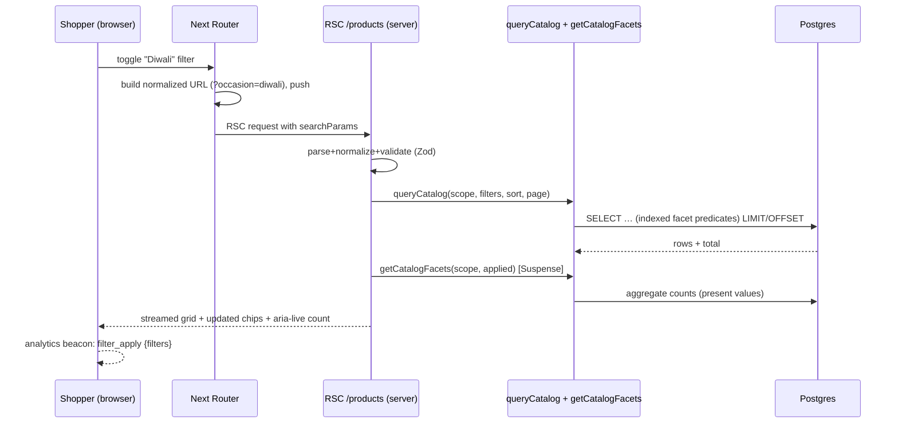
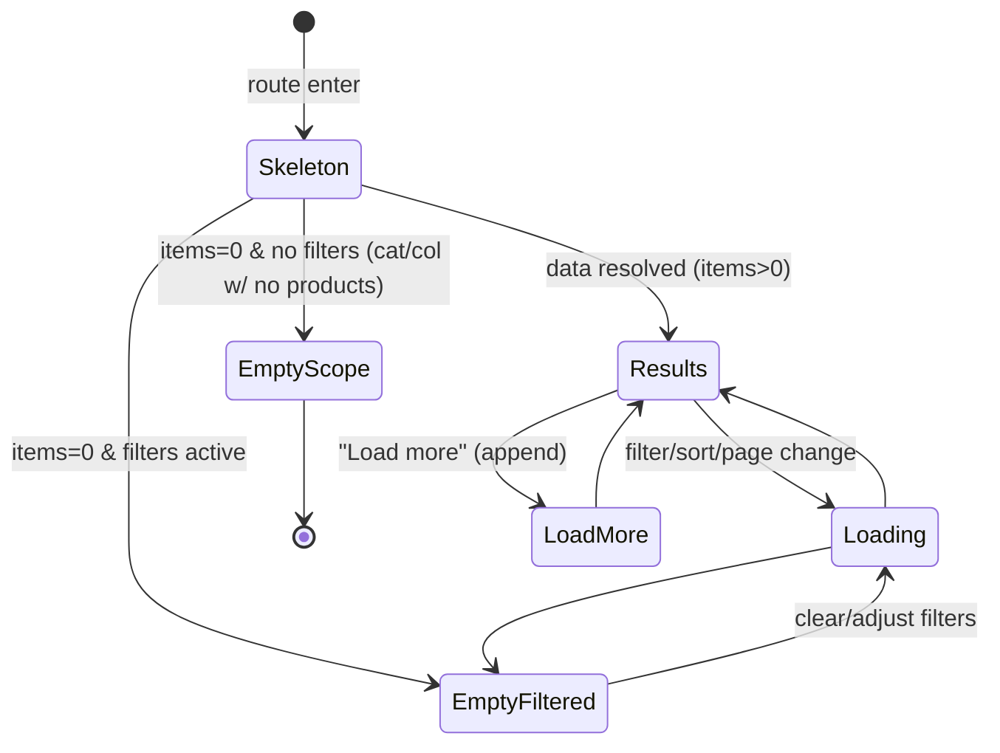

# 06 — Storefront: Catalog — PLP, Category & Search

> **Project:** `vaani-gift-e-commerce` · **Brand:** GooglyWoogly Art · **Base:** Jaipur, India · **Domain:** `googlywoogly.art`
> **Owner-perspective:** Product / Design (Principal PM + Solutions Architect)
> **Conforms to:** [`00-canonical-decisions.md`](./00-canonical-decisions.md) (CANON) — entity/field/enum names, routes, cache tags, money-as-paise, `en-IN`/INR/IST, guest-only, no on-site payment, no variants. Builds on [`04-information-architecture-and-routing.md`](./04-information-architecture-and-routing.md) (the route map, the **query-param contract** §8.4, the **cache-tag matrix** §7, canonical/robots policy §8.3) and [`03-data-model-and-entities.md`](./03-data-model-and-entities.md) (field shapes, `searchVector` FTS, indexes, `productPublicSelect`).
> **Authoritative for:** the catalog **browse + discover** surfaces — the `/products` PLP (filters, sort, pagination), pre-built SEO **`/category/[slug]`** and **`/collections/[slug]`** pages, **`/search`**, the reusable **`ProductCard`** component, the faceting/query-performance contract, and how filtered views stay fast and correctly (de-)indexed.
> **Not authoritative for:** PDP & recommendations (`07`), cart/checkout/order placement (`08`), the homepage (`05`), admin catalog management (`11`), the sitemap/robots/ISR transport mechanics (`09` — to be written; this doc states what it needs from it), navigation chrome/mega-menu (owned by `04`). Where this doc decides something CANON/`04`/`03` left open, the call is stated inline and surfaced under §11.

---

## 1. Purpose & Scope

### 1.1 What this document covers
1. **`/products` — the all-products PLP**: the full filter set (category, occasion/collection, price range, availability, material, tag), the sort set, and the **pagination strategy** (decided: numbered `?page=N` for SEO, progressively enhanced with a "Load more" control — §3.4, justified in §8).
2. The **URL `searchParam` contract** for catalog views — which params exist, their grammar, how they compose, how they map to canonical URLs, what is crawlable vs `noindex`, and how state is shareable and back/forward-safe. (Extends `04` §8.4 with PLP UX semantics.)
3. **Pre-built SEO category pages `/category/[slug]`**: intro copy, subcategory chips, the same faceting toolkit scoped to the category, an FAQ block, and `CollectionPage` + `ItemList` + `BreadcrumbList` JSON-LD.
4. **Collection / occasion pages `/collections/[slug]`**: hero, merchandised ordering (manual or automated rules), occasion cross-links, `CollectionPage` + `ItemList` JSON-LD.
5. **`/search`**: query handling, ranked results (Postgres FTS + trigram fuzzy), the empty/zero-result state, suggestions, **typo tolerance**, and `noindex,follow`.
6. The reusable **`ProductCard`** component spec: image, title, price/`compareAtPrice`, availability badge, **quick-add**, and a **wishlist-later** affordance placeholder.
7. **Faceting & query performance**: a single shared query/faceting engine that powers PLP, category, collection, and search; how counts are computed; how filtered views stay fast (indexed) and correctly indexable.

### 1.2 What this document explicitly does NOT cover
- **The PDP** (`/products/[slug]`) and "you may also like" recommendations → `07`. This doc only defines the **card** that links into it and the **list context** passed along.
- **Cart mutation logic, the cart drawer, checkout, order placement** → `08`. This doc fires the `add_to_cart` event and calls the cart store's `addItem`, but does not own cart state, the re-validation banner, or the drawer's full UX.
- **Header mega-menu, footer, mobile drawer, breadcrumbs chrome, the bottom tab bar** → owned by `04` (§4). This doc *consumes* the breadcrumb component and emits the `BreadcrumbList` JSON-LD payloads for its routes.
- **Admin authoring** of categories/collections/products (intro copy, rules, ordering, FAQ authoring) → `11`. This doc consumes those fields read-only.
- **Wishlist persistence / customer accounts** — out of scope per CANON §3 (no shopper accounts). The card reserves a **visual placeholder** only (§4.6 / FR-37); no storage, no sync, no `wishlist` event (none exists in CANON §6).
- **Sitemap/robots generation and the ISR revalidation transport** — owned by `09`. This doc lists the cache tags it reads and the index/`noindex` rules it must honor.
- **International / multi-currency / locale-prefixed catalog** — out of scope (CANON §3, `04` §1.2).

---

## 2. Primary user stories / jobs-to-be-done

| # | As a… | I want… | so that… | Surface |
|---|---|---|---|---|
| JTBD-1 | Organic-search shopper | to land on a fast, relevant, indexable category/occasion page that already shows curated products | I start browsing without bouncing | `/category/[slug]`, `/collections/[slug]` |
| JTBD-2 | Decided buyer | to filter by category, occasion, price, availability and material, and sort by price/newness | I narrow to the few gifts that fit my need and budget | `/products`, category/collection (faceted) |
| JTBD-3 | Gift shopper on a phone | filters and results that work thumb-first, don't reload the whole screen, and keep my place when I go back | I can browse one-handed without losing context | all PLP surfaces (mobile) |
| JTBD-4 | Sharer | to copy the URL of my filtered/sorted view and send it on WhatsApp, and have it open identically | my friend sees exactly the curated set I found | `searchParam` contract |
| JTBD-5 | Searcher | to type a product name (even with a typo) and get the right results or close suggestions, never a dead end | I find the item or a good alternative | `/search` |
| JTBD-6 | Browser with no specific need | to scan a clean grid of cards with clear price, "was" price, and stock/made-to-order status, and add the obvious pick in one tap | I buy impulsively with confidence | `ProductCard`, quick-add |
| JTBD-7 | Out-of-stock-tolerant buyer | to still see and consider an out-of-stock or made-to-order item with its lead time | I can plan a gift around the craft time | card badge + filter |
| JTBD-8 | Googlebot | clean canonical category/collection URLs with `ItemList`/`CollectionPage` JSON-LD, and `noindex` on thin filter permutations | I index the right pages and don't waste crawl budget | canonical/robots policy |
| JTBD-9 | Founder | category/occasion pages that read like landing pages (intro, FAQ, chips) and that I can keep filled from the admin | my SEO pages convert and rank without a developer | content slots fed by `11` |

---

## 3. Detailed functional requirements

> Numbered, decisive. **"MUST"** = MVP unless a phase is tagged. Param names, cache tags, enum values are CANON/`04` verbatim. "Active product" everywhere = `Product.status = active` **and** `publishedAt <= now()`.

### 3.1 The shared catalog query engine (foundation)

**FR-1 — One faceting engine, four surfaces.** PLP (`/products`), category (`/category/[slug]`), collection (`/collections/[slug]`), and search (`/search`) MUST all render their product grid from a **single server-side function** `queryCatalog(params)` (§6.1). The surface only supplies a **base scope** (all-active / one category subtree / one collection / FTS-matched set); filters, sort, pagination, and faceting are identical code. This guarantees consistent behavior, counts, and performance.

**FR-2 — Read-only, public projection only.** Every catalog read MUST use the typed `productPublicSelect` (`03` §11 Q-5): it selects only storefront-safe columns and **never** `costPrice`. Only `status = active` rows are ever returned to the storefront (admin previews are out of scope here).

**FR-3 — Card payload shape (`ProductCardData`).** The grid query returns, per product, exactly the fields the card needs (§4.6): `id, slug, title, subtitle, shortDescription, price, compareAtPrice, madeToOrder, inventoryQuantity, lowStockThreshold, productionLeadTimeDays, allowsPersonalization, isBestseller, isFeatured, primaryImage{url,alt,width,height}, secondaryImage?{…}` (first two `ProductImage` by `sortOrder` for hover-swap). `inventoryState` is **derived in the mapper** (FR-12 of `03`), never stored.

**FR-4 — Deterministic, stable ordering.** Every sort MUST include a deterministic tiebreaker (`id ASC`) appended to the primary sort key so pagination never duplicates or drops a row across pages.

**FR-5 — All catalog reads are cache-tagged.** PLP/category/collection grids read under the CANON §9 tags so a product/category/collection edit revalidates them:
- `/products` and all PLP grids → tag **`products`**.
- `/category/[slug]` → tags **`category:{slug}`** + **`products`**.
- `/collections/[slug]` → tags **`collection:{slug}`** + **`products`**.
- `/search` → **no cache** (SSR, live; `04` §7 "never-cached").
Safety-net `revalidate`: catalog routes `3600s` (CANON §9).

### 3.2 Filters

**FR-6 — The filter set (MVP).** The PLP and category/collection faceted views MUST support these filters, each driven by a recognized search param (grammar in §3.5 / `04` §8.4):

| Facet | Param | Source field | Multi-select | Type |
|---|---|---|---|---|
| Category | `category` | `Product.categoryId` → `Category.slug` (incl. children) | ✅ comma-sep | checkbox list |
| Occasion | `occasion` | `Product.occasions[]` | ✅ comma-sep | checkbox/chips |
| Collection | `collection` | `CollectionProduct` membership / `Collection.slug` | ✅ comma-sep | checkbox list |
| Price | `price` | `Product.price` (paise) | range | min–max slider + inputs |
| Availability | `availability` | derived `inventoryState` | ✅ comma-sep | checkbox list |
| Material | `material` | `Product.materials` (see FR-9) | ✅ comma-sep | checkbox list |
| Tag | `tag` | `Product.tags[]` | ✅ comma-sep | checkbox list (secondary) |

**FR-7 — Filters are AND across facets, OR within a facet.** Selecting `category=mugs,coasters&occasion=diwali` returns products in (mugs **OR** coasters) **AND** tagged occasion diwali. This is the universally-expected faceted-search semantics; documented so counts (FR-13) are computed consistently.

**FR-8 — Price filter semantics.** `price=min-max` is **inclusive**, in **whole rupees** in the URL (e.g. `price=500-1500`), converted to **paise** server-side (`×100`) for the query. Open-ended forms allowed: `price=500-` (≥ ₹500) and `price=-1500` (≤ ₹1500). The UI also offers **preset bands** (decision §4.4: `Under ₹500`, `₹500–₹1000`, `₹1000–₹2000`, `₹2000–₹5000`, `Over ₹5000`) that simply write the same `price` param — presets are a UI convenience, not a separate param. Invalid/inverted ranges (min>max, non-numeric) are ignored and stripped.

**FR-9 — Material facet: derived from a normalized vocabulary (decision + flagged gap).** CANON/`03` model `Product.materials` as a **free-text `String?`** (e.g. `"Mango wood, brass"`), which cannot back a reliable facet. **Decision:** the material facet is driven by the existing **`Product.tags[]`** array, restricted to a **curated `material:*` tag namespace** (`material:wood`, `material:ceramic`, `material:brass`, `material:resin`, `material:fabric`, `material:metal`, `material:glass`, `material:paper`). The admin tagging convention (owned by `11`) populates these; the free-text `materials` string remains for display on the PDP/card only. The facet UI shows human labels (`Wood`, `Ceramic`, …) mapped from the namespace. **This is a CANON gap** (no structured material taxonomy) — recorded in §11 Q-1. _Until material tags are seeded, the facet renders only the values that actually exist (FR-13), so it degrades gracefully to empty/hidden._

**FR-10 — Availability facet uses `InventoryState`.** Allowed values are the CANON `InventoryState` enum: `in_stock`, `low_stock`, `out_of_stock`, `made_to_order`. Because `inventoryState` is **derived at read time** (not a column), the filter is implemented as predicate SQL on the underlying fields, not an equality on a stored enum:

| Selected value | SQL predicate |
|---|---|
| `made_to_order` | `madeToOrder = true` |
| `in_stock` | `madeToOrder = false AND inventoryQuantity > lowStockThreshold` |
| `low_stock` | `madeToOrder = false AND inventoryQuantity > 0 AND inventoryQuantity <= lowStockThreshold` |
| `out_of_stock` | `madeToOrder = false AND inventoryQuantity <= 0` |

**FR-11 — Default availability behavior.** With **no** `availability` filter, the grid shows **all active products including out-of-stock and made-to-order** (CANON keeps OOS active products indexed; `04` §8.3). Out-of-stock items sort **last by default** within the chosen sort (FR-19) so the grid leads with buyable stock. An explicit `availability=in_stock,low_stock,made_to_order` is offered as a one-tap "Hide sold out" toggle.

**FR-12 — Filters apply on the server; no client-side hidden filtering.** Filtering happens in the DB query (FR-1). The client only **navigates** (updates the URL); the server returns the already-filtered, already-paginated set. (Rationale: correct counts, correct pagination totals, SSR/SEO parity, small payloads.)

**FR-13 — Facet counts & availability are data-driven.** For each facet value the UI MAY show a **result count** computed under the *other* active filters (standard "narrowing" counts). Counts and the **set of offered values** MUST come from the actual active-product corpus for the current base scope — a facet value with zero matching active products is **hidden** (so a category page never offers "Brass" if it has no brass items). Count computation strategy & cost are bounded in §6.2. _MVP may ship **without** live counts if the count query risks the latency budget (§8.2); the facet still lists only present values. Live counts are a strong V1 target — §12._

**FR-14 — Clear / reset.** A persistent **"Clear all"** control removes every filter param (preserving `sort` is a UX choice — decision: **Clear all also resets sort to default and page to 1**, returning to the canonical base URL). Each active filter also renders a removable **chip** (§4.3) that clears just that value.

### 3.3 Sort

**FR-15 — The sort set (CANON `04` §8.4 verbatim).** `sort` accepts exactly: `featured` (default), `newest`, `price_asc`, `price_desc`, `bestselling`. Any other value is ignored and treated as `featured`.

**FR-16 — Sort definitions.**

| `sort` value | Order (primary → tiebreaker) |
|---|---|
| `featured` *(default)* | `isFeatured DESC`, then `isBestseller DESC`, then surface-native order (see FR-17), then `publishedAt DESC`, then `id ASC` |
| `newest` | `publishedAt DESC NULLS LAST`, `id ASC` |
| `price_asc` | `price ASC`, `id ASC` |
| `price_desc` | `price DESC`, `id ASC` |
| `bestselling` | `isBestseller DESC`, then `publishedAt DESC`, `id ASC` (MVP proxy — see FR-18) |

**FR-17 — Surface-native default order.** When `sort=featured` (the default):
- **`/collections/[slug]` (manual)** → `CollectionProduct.sortOrder ASC` (the founder's hand-ordering wins).
- **`/collections/[slug]` (automated)** → `featured` ranking (FR-16) applied to the rule-matched set.
- **`/category/[slug]`** and **`/products`** → `featured` ranking (FR-16).

**FR-18 — `bestselling` is a flag proxy in MVP.** True units-sold ranking requires order aggregation; MVP ranks by the manually-curated `isBestseller` flag (set in `11`) + recency. **V1**: compute a rolling 30/90-day units-sold metric from `OrderItem` (only `confirmed`+ orders count, since payment is offline) and sort by it. Recorded §11 Q-3.

**FR-19 — Out-of-stock demotion.** Across **all** sorts except explicit price sorts, true `out_of_stock` (non-MTO, qty≤0) items are pushed to the **end** via a leading sort term `(inventoryQuantity <= 0 AND madeToOrder = false) ASC`. For `price_asc`/`price_desc` the shopper explicitly asked for price order, so demotion is **not** applied (price ordering is honored exactly). Made-to-order items are **not** demoted (they're orderable).

### 3.4 Pagination

**FR-20 — Numbered, URL-addressable pagination is the system of record (decision).** Pagination MUST use the CANON param **`?page=N`** (1-based; `04` FR-19). `?page=1` 301-redirects to the param-less URL; each `?page=N (N>1)` is **self-canonical** and indexable, with `rel="prev"`/`rel="next"` link hints. Page size = **24** products (decision §8 — divisible by 2/3/4 grid columns; balances payload vs clicks). This is the SEO-correct, crawlable, shareable baseline. **Justification in §8.1.**

**FR-21 — "Load more" is a progressive enhancement over the same URLs.** On top of numbered pages, the client MAY render a **"Load more"** button (and/or auto-load-on-scroll on mobile) that fetches the next page and **appends** it to the grid, while **updating the URL to `?page=N`** via `history.replaceState` (so a refresh/share lands on a sensible page and back/forward works). This gives infinite-scroll ergonomics **without** sacrificing crawlable, addressable pages. With JS disabled, numbered page links (rendered server-side) still work — zero-JS navigable. **Decision: hybrid (numbered + load-more), recommended over pure infinite scroll — §8.1.**

**FR-22 — Pagination metadata.** The server returns `{ items, total, page, pageSize, totalPages }`. The footer shows numbered controls (`components/ui/pagination.tsx`, already vendored): first/prev, a windowed set of page numbers, next/last, and a "Showing X–Y of Z" line. When `page > totalPages` (e.g. stale deep link after inventory shrank) → render **page 1** content with a soft notice (not a 404).

**FR-23 — No offset cliffs at MVP scale; cursor-ready.** MVP uses `LIMIT/OFFSET` (catalog is small — hundreds of SKUs — so offset is fine and enables jump-to-page). The query engine is written so a **keyset/cursor** mode can replace offset for the "Load more" path if the catalog grows past a few thousand active products (§8.2). Recorded §11 Q-4.

### 3.5 URL `searchParam` contract (catalog)

**FR-24 — Recognized params (closed set).** On catalog routes, **only** these params are read; anything else is ignored and **stripped from the canonical**. This is the CANON `04` §8.4 contract, restated with PLP semantics:

| Param | Routes | Grammar | Multi | Default | Notes |
|---|---|---|---|---|---|
| `category` | `/products` | `slug[,slug…]` | ✅ | — | category facet (subtree-aware) |
| `collection` | `/products` | `slug[,slug…]` | ✅ | — | collection-membership facet |
| `occasion` | `/products`, `/category/*`, `/collections/*` | `key[,key…]` | ✅ | — | occasion facet |
| `material` | all PLP | `key[,key…]` | ✅ | — | material facet (FR-9 namespace, without the `material:` prefix in the URL: `material=wood,brass`) |
| `price` | all PLP | `min-max` (₹, ints) | range | — | inclusive; open-ended ok (`500-`, `-1500`) |
| `availability` | all PLP | `state[,state…]` (`InventoryState`) | ✅ | all | one-tap "hide sold out" maps here |
| `tag` | all PLP | `slug[,slug…]` | ✅ | — | secondary filter |
| `sort` | all PLP + `/search` | `featured\|newest\|price_asc\|price_desc\|bestselling` | single | `featured` | invalid → default |
| `page` | all PLP + `/search` | int ≥ 1 | single | 1 | `page=1` → strip & 301 |
| `q` | `/search` only | url-encoded string (≤ 80 chars) | single | — | the query; required for results |
| `utm_*`, `ref`, `gclid`, `fbclid` | any | — | — | — | analytics only; **stripped from canonical** |

**FR-25 — Param normalization (canonical key order & dedupe).** To make shared/crawled URLs stable and avoid duplicate-content permutations, the server MUST normalize params before building the canonical and before querying:
1. Recognize only the closed set (FR-24); drop unknowns + tracking params.
2. Within a multi-value param: **lowercase, de-duplicate, sort alphabetically**, comma-join (so `category=coasters,mugs` and `category=mugs,coasters` canonicalize identically).
3. Drop params equal to their default (`sort=featured`, `page=1`, empty values).
4. Emit params in a **fixed key order**: `category, collection, occasion, material, price, availability, tag, sort, page`.
5. If, after normalization, the request URL differs from the canonical form **only by param order/casing/defaults**, the page still renders (no redirect storm) but the emitted `rel=canonical` is the normalized form. (A hard 308 is reserved for host/path normalization in middleware `04` §6.3, not for query reshuffling.)

**FR-26 — Indexing policy for catalog params (CANON `04` §8.3).**

| URL shape | `rel=canonical` | Robots |
|---|---|---|
| `/products` (no params) | self | `index,follow` |
| `/category/[slug]`, `/collections/[slug]` (no filter params) | self | `index,follow` |
| `/products?sort=…` or `…?<any filter>` | → base `/products` | `noindex,follow` |
| `/category/[slug]?<any filter/sort>` | → `/category/[slug]` | `noindex,follow` |
| `/collections/[slug]?<any filter/sort>` | → `/collections/[slug]` | `noindex,follow` |
| `…?page=N` (N>1), no other filter params | **self** (incl. `?page=N`) | `index,follow` + `rel=prev/next` |
| `…?page=N` **with** filter/sort params | → the base route's `?page=N`? **No** — filtered ⇒ `noindex,follow`, canonical → base route (filters dominate) | `noindex,follow` |
| `/search?q=…` | omit canonical | `noindex,follow` |

**Decision (Q-2 of `04`):** pure pagination (`?page=N`, no filters) is **indexable & self-canonical**; the **moment any filter/sort param is present**, the page is `noindex,follow` and canonicalizes to the un-paginated, un-filtered base route. This keeps deep catalog pages crawlable while preventing the combinatorial explosion of filter permutations from diluting the index. Recorded §11 (aligns with `04` Open Q-1).

**FR-27 — State is fully in the URL; no hidden client state.** All filter/sort/page state lives in `searchParams` (shareable JTBD-4, back/forward-safe, SSR-renderable). Opening the filter drawer, scroll position, and "load-more accumulation" are the only ephemeral client states. Applying any filter updates the URL via the router; the RSC re-renders server-side.

### 3.6 `/products` PLP behavior

**FR-28 — Base vs faceted rendering (CANON `04` FR-5).** `/products` with **no** recognized filter/sort/page param renders **RSC-ISR** (static, tag `products`, indexable). The presence of **any** recognized filter/sort/page param switches the route to **faceted SSR** (`dynamic` per `searchParams`), `noindex,follow`, canonical per FR-26. `?page=N` alone keeps it indexable (FR-26).

**FR-29 — PLP header.** `/products` shows an H1 "All Products" (or `SiteSetting`-driven copy), the result count, the sort control, and the filter entry point. No intro paragraph (that's for category/collection pages).

### 3.7 `/category/[slug]` behavior

**FR-30 — Category scope = self + children (one level).** A category page's base scope is products whose `categoryId` is **the category OR any of its direct children** (CANON categories are one level deep, `03` §3.6). The `category` URL facet is *not* used here to define scope; instead, **subcategory chips** (FR-32) let the shopper narrow to a child, which navigates to that child's `/category/[childSlug]` page (clean canonical) rather than appending a `?category=` param.

**FR-31 — Intro copy & SEO content.** The page MUST render, when present: `Category.name` as H1, `Category.description` (rich) as intro copy (collapsible "read more" on mobile if long), `Category.image` as an optional banner, and `metaTitle`/`metaDescription` for `<head>` (fallbacks in §8.3). Empty/absent fields degrade gracefully (no empty boxes).

**FR-32 — Subcategory chips.** If the category has active children, render a horizontal, scrollable **chip row** linking to each child `/category/[childSlug]` (and a "All {parent}" chip back to the parent). Chips are server-rendered (crawlable internal links). For a **leaf** category (no children), show **sibling** category chips instead (lateral discovery) — decision §4.2.

**FR-33 — Category FAQ block.** Below the grid, render an FAQ accordion of `FaqItem` rows whose `category` field matches a convention (decision: `FaqItem.category == "cat:{slug}"` for category-specific FAQs, falling back to a small set of general shopping FAQs tagged `cat:general`). These emit **`FAQPage`** JSON-LD. Authoring is owned by `11`/`15`. If no matching FAQs exist, the block is omitted. Recorded §11 Q-5.

**FR-34 — Faceting within a category.** The same filter/sort/pagination toolkit (§3.2–3.4) applies, scoped to the category subtree. The `category` facet itself is hidden (redundant with the page scope/chips); all other facets (occasion, price, availability, material, tag) are available. Any filter/sort makes the category page `noindex,follow` + canonical→`/category/[slug]` (FR-26).

### 3.8 `/collections/[slug]` behavior

**FR-35 — Collection scope.** Base scope = the collection's products: for `type=manual`, the `CollectionProduct` set in `sortOrder`; for `type=automated`, the live result of `Collection.rules` (`03` §3.5 rule shape) evaluated against active products. Only active products appear regardless of membership.

**FR-36 — Collection landing chrome.** Render `Collection.heroImageId` as a hero, `Collection.title` (H1), `Collection.description` as intro copy, and occasion/sibling cross-links (e.g. a Diwali collection links to Rakhi, Wedding). Same faceting toolkit applies (occasion/price/availability/material/tag; the `collection` facet is hidden as redundant). `CollectionPage` + `ItemList` + `BreadcrumbList` JSON-LD. Filter/sort ⇒ `noindex,follow` + canonical→`/collections/[slug]` (FR-26).

### 3.9 `/search` behavior

**FR-37 — SSR, `noindex,follow`, live.** `/search` is always SSR, never cached, `robots: noindex,follow` (CANON §8, `04` §6.1). It reads `q` (and may accept the same `sort`/`page`/filter params for refinement). Title = `Search: {q} · GooglyWoogly Art`; no canonical emitted.

**FR-38 — Query handling & validation.** `q` is trimmed, length-clamped to ≤ 80 chars, control-chars stripped, and lower-cased for matching. Empty/whitespace `q` → render the **search landing** (popular searches, top categories, top collections, bestsellers grid) **not** a 404 (CANON `04` FR-6).

**FR-39 — Ranking: FTS first, trigram fuzzy fallback (typo tolerance).** Matching MUST use `Product.searchVector` (`tsvector`, GIN — `03` §3.7.1) as the primary ranker (`ts_rank` over title+subtitle+shortDescription+tags), and **`pg_trgm` similarity** as the **typo-tolerant fallback/booster**:
1. Run FTS (`websearch_to_tsquery('simple', q)`); rank by `ts_rank_cd`.
2. If FTS yields **zero** rows (or < a small threshold, e.g. < 3), run a **trigram** query (`similarity(title, q) > 0.2` OR `title % q`, ordered by similarity) to catch misspellings (`"mgu"` → "mug", `"daiwali"` → "Diwali") and partial words.
3. Merge, de-dupe, rank: exact/prefix title match > FTS rank > trigram similarity. Tiebreaker `isBestseller DESC, id ASC`.
A `pg_trgm` GIN index on `lower(title)` (and optionally `tags`) backs step 2 (added via raw migration; coordinate with `03`/`09`). Recorded §11 Q-6.

**FR-40 — Search refinement.** The results page reuses the **sort** control and (decision: **MVP ships category + price + availability filters on search**, the rest deferred) a reduced facet set, all via the same param contract. `sort` defaults to **relevance** on `/search` (i.e., the FTS/trigram rank); choosing an explicit `sort` overrides relevance.

**FR-41 — Search suggestions / autocomplete.** The header search overlay (chrome owned by `04`) SHOULD offer **as-you-type suggestions** backed by a lightweight endpoint (§6.3 `searchSuggest`): top product titles (prefix/trigram), plus matching category & collection names, plus a few **canned popular queries** (from `SiteSetting` or a static list: "Diwali gifts", "personalized mug", "wedding hamper"). Debounced 200ms, min 2 chars. **MVP-minimal** acceptable: static popular queries + on-submit results; live autocomplete is a fast-follow (§12).

**FR-42 — Zero-result state.** When a non-empty `q` matches nothing (after fuzzy fallback): show a clear "No results for '{q}'" empty state (`components/ui/empty.tsx`) with: (a) spelling/broaden hint, (b) the closest **trigram suggestions** ("Did you mean *mug*?"), (c) **popular categories/collections** as exits, (d) a **bestsellers** strip, and (e) a WhatsApp CTA ("Can't find it? Message us — we make custom pieces"). Never a dead end (JTBD-5).

### 3.10 ProductCard (reusable component)

**FR-43 — Single source-of-truth card.** A `<ProductCard data={ProductCardData} context={…} />` component (§4.6) MUST be the **only** product tile used across home rails (`05`), PLP, category, collection, search, and PDP recommendations (`07`). It is a **server component** by default; only the interactive controls (quick-add, wishlist placeholder, image hover) are client islands.

**FR-44 — Card must render** (FR-3 payload): primary image (with `width/height` to prevent CLS; `next/image`, Cloudinary responsive `srcset`; first card on the page = `priority` for LCP), title (links to `/products/[slug]`), optional subtitle/short line, **price** (`₹` `en-IN`), **`compareAtPrice`** as strikethrough + a computed **"Save X%"** / "₹Y off" badge when `compareAtPrice > price`, the **availability badge** (FR-45), and optional flags (`Bestseller`, `New` when `publishedAt` within 30 days, `Personalizable` when `allowsPersonalization`).

**FR-45 — Availability badge ⇐ derived `inventoryState`.**

| `inventoryState` | Badge copy | Card add-to-cart |
|---|---|---|
| `in_stock` | _(no badge, or subtle "In stock")_ | enabled |
| `low_stock` | "Only {qty} left" (amber) | enabled |
| `made_to_order` | "Made to order · ships in {productionLeadTimeDays}d" | enabled |
| `out_of_stock` | "Sold out" (muted) | **disabled** → swaps to "Notify on WhatsApp" deep link |

**FR-46 — Quick-add.** A quick-add affordance (button on hover desktop / always-visible icon mobile) adds **quantity 1** to the client cart via the `08` cart store (`addItem(productId, 1, snapshot)`), shows optimistic feedback (mini-toast / button → "Added ✓"), and fires **`add_to_cart`** (CANON `AnalyticsEventType`). **Constraints:** quick-add is **disabled** for `out_of_stock` (non-MTO). For products with `allowsPersonalization = true`, quick-add **still adds qty 1 without personalization** but the toast nudges "Add a name on the product page" linking to the PDP (personalization is captured on PDP/cart per `07`/`08`) — decision §4.6, recorded §11 Q-7. Quick-add never navigates away (keeps the shopper in the grid).

**FR-47 — Price/stock at add-time is advisory; checkout is authoritative.** Quick-add snapshots the **currently displayed** price into the cart, but per CANON §4 the cart re-validates price/stock against the server on load and at checkout (`08`). The card itself does no server write.

**FR-48 — Wishlist placeholder (no persistence).** The card renders a **heart icon** affordance reserved for a future wishlist (CANON V2 accounts). In MVP it is **visually present but non-functional** (decision): clicking it either (a) is hidden behind a feature flag `WISHLIST_ENABLED=false` (default off → not rendered), or (b) opens a tooltip "Wishlist coming soon — save it on WhatsApp" + WhatsApp share. **Decision: ship (a) — feature-flagged off by default**, so the slot exists in the design system but no half-feature ships. No `wishlist` analytics event exists in CANON §6, so none is emitted. Recorded §11 Q-8.

**FR-49 — Card accessibility.** The whole card is keyboard-reachable; the title link is the primary accessible name; quick-add and wishlist are separate, labeled buttons (`aria-label="Add {title} to cart"`); the image has `alt` from `ProductImage.alt` (fallback to `title`); badges are not the sole carrier of meaning (text, not color-only).

### 3.11 Cross-cutting

**FR-50 — Loading & streaming.** Every catalog route has a `loading.tsx` (or Suspense boundary) rendering a **card-grid skeleton** (matching column count) so navigation is never blank (CANON §2 CWV). Filter changes show an inline grid `aria-busy` state, not a full-page spinner.

**FR-51 — Result-count announcement (a11y).** After any filter/sort/page change, an `aria-live="polite"` region announces "Showing X products" so screen-reader users get feedback on the async update.

**FR-52 — Empty (filtered) state.** When filters match nothing (active products exist but none satisfy the combination), render the `empty.tsx` state with the **active-filter chips still visible**, a "No products match these filters" message, a **"Clear all filters"** CTA, and suggested categories/collections. The route still returns **HTTP 200** (it's a valid page, just empty) — only an **inactive** category/collection or unknown slug returns 404 (CANON `04` §9).

---

## 4. UX / UI breakdown

> Built on Tailwind v4 + shadcn/ui (Radix) + framer-motion (CANON §4), reusing vendored `pagination.tsx`, `empty.tsx`, `sheet.tsx`, `breadcrumb.tsx`, `badge.tsx`, `slider.tsx`, `checkbox.tsx`, `accordion.tsx`. Phone-first (the audience and the founder are mobile-led). Brand: pink/playful, verified AA contrast (CANON §4 caveat).

### 4.1 PLP layout (`/products`) — desktop & mobile

```
DESKTOP (≥1024px)                                  MOBILE (<768px)
┌───────── breadcrumb: Home › Products ─────────┐  ┌── Home › Products ──────────┐
│ H1 All Products            [Sort ▾] 128 items │  │ H1 All Products      128 items│
├──────────────┬────────────────────────────────┤  │ [ ⊟ Filters ]   [ Sort ▾ ]    │ ← sticky toolbar
│  FILTER RAIL │   ACTIVE CHIPS: ⓧdiwali ⓧ<₹1000 │  ├──────────────────────────────┤
│  (sticky)    │  ┌────┐┌────┐┌────┐┌────┐        │  │ chips: ⓧdiwali ⓧ<₹1000        │
│  Category ▸  │  │card││card││card││card│        │  │ ┌──────┐ ┌──────┐             │
│  Occasion ▸  │  └────┘└────┘└────┘└────┘        │  │ │ card │ │ card │  (2-col)    │
│  Price  ▸    │  ┌────┐┌────┐┌────┐┌────┐        │  │ └──────┘ └──────┘             │
│  Availabil.▸ │  │card││card││card││card│        │  │ ┌──────┐ ┌──────┐             │
│  Material ▸  │  └────┘└────┘└────┘└────┘        │  │ │ card │ │ card │             │
│  Tag     ▸   │     [ Load more ]  ·  1 2 3 ›    │  │ └──────┘ └──────┘             │
│  [Clear all] │   Showing 1–24 of 128            │  │   [ Load more ]              │
└──────────────┴────────────────────────────────┘  └──────────────────────────────┘
                                                     (Filters open as full-height Sheet)
```

- **Grid:** 4 cols ≥1280px, 3 cols ≥1024, 2 cols ≥640 / mobile, gap 16–24px. Cards equal-height; image 1:1 or 4:5 (decision: **4:5 portrait** suits gifting/decor photography).
- **Desktop filter rail:** sticky left column (~260px), collapsible accordion groups, each value a checkbox with optional count (FR-13). Price = dual slider + min/max numeric inputs + preset band buttons.
- **Mobile filters:** a **`Sheet`** (full-height bottom or left drawer) opened by the sticky "Filters" button (shows active count badge). Inside: same groups in accordions, a sticky footer with **"Show {N} results"** (live-updates the count as filters toggle) and **"Clear all"**. Applying closes the sheet and updates the URL.
- **Sort:** a `DropdownMenu`/`Select` with the 5 options; the active sort is labeled (e.g. "Sort: Price ↑").
- **Sticky toolbar (mobile):** Filters + Sort stay reachable on scroll.

### 4.2 Category page (`/category/[slug]`)

```
Home › [Parent ›] Category
┌──────────────────────────────────────────────┐
│  (optional banner image)                       │
│  H1 {Category.name}                            │
│  {Category.description — intro copy, read-more}│
│  chips:  [All {parent}] [Child A] [Child B] …  │ ← subcategory (or sibling) chips
├──────────────────────────────────────────────┤
│  [Filters]  [Sort ▾]      {N} products         │
│  …………… same filter rail + card grid …………       │
│  [ Load more ] · pagination · Showing X–Y of Z │
├──────────────────────────────────────────────┤
│  FAQ accordion (cat:{slug})  → FAQPage JSON-LD │
│  Related collections / occasions (cross-links) │
└──────────────────────────────────────────────┘
```

- Intro copy renders rich `Category.description`; long copy collapses on mobile behind "Read more".
- **Subcategory chips** (FR-32): horizontally scrollable, server-rendered links. Leaf category → sibling chips. The `category` facet is hidden in the rail (page scope covers it).
- FAQ block (FR-33) only if matching `FaqItem`s exist.

### 4.3 Active-filter chips

A horizontal, wrapping chip row directly above the grid, on every faceted surface. Each chip shows the human label (`Diwali`, `Under ₹1000`, `Ceramic`, `Made to order`) with an ✕; clicking removes just that value (and re-navigates). A trailing **"Clear all"** ghost button appears when ≥1 filter is active. Chips mirror exactly what's in the URL (single source of truth, FR-27).

### 4.4 Filter components — content & copy

| Group | Control | Copy direction |
|---|---|---|
| Category | checkbox list (only on `/products`) | category names; "Show more" if >8 |
| Occasion | checkbox / pill list | "Diwali", "Raksha Bandhan", "Wedding", … (CANON §11 occasions) |
| Collection | checkbox list (only on `/products`) | curated collection titles |
| Price | dual slider + ₹ min/max inputs + presets | presets: "Under ₹500 / ₹500–₹1,000 / ₹1,000–₹2,000 / ₹2,000–₹5,000 / Over ₹5,000" |
| Availability | checkbox list + "Hide sold out" toggle | "In stock", "Low stock", "Made to order", "Sold out" |
| Material | checkbox list | "Wood", "Ceramic", "Brass", "Resin", "Fabric", "Metal", "Glass", "Paper" (only values present) |
| Tag | checkbox list (secondary, collapsed) | tag labels (excluding `material:*` namespace) |

All ₹ amounts formatted `en-IN` (₹1,000 not ₹1000). Selecting any value updates the URL (debounced for the price slider — apply on release / 300ms).

### 4.5 Sort control

`Select`/dropdown, labeled options:
- **Featured** (default) · **Newest** · **Price: Low to High** · **Price: High to Low** · **Bestselling**.
On `/search`, prepend **Relevance** (default there).

### 4.6 ProductCard — anatomy

```
┌─────────────────────────┐
│  ♡ (wishlist, flagged)   │ ← top-right overlay (hidden if WISHLIST_ENABLED=false)
│  [ Bestseller ]          │ ← top-left flag (conditional)
│                          │
│     product image 4:5    │  (hover → swap to secondary image, desktop)
│                          │
│   [ Quick add  + ]       │ ← appears on hover (desktop) / persistent icon (mobile)
├─────────────────────────┤
│ {title}                  │ ← links to /products/[slug]
│ {subtitle / short}       │ (optional, 1 line)
│ ₹1,299  ̶₹̶1̶,̶7̶9̶9̶  (28% off) │ ← price / compareAt / save badge
│ • Made to order · 7d     │ ← availability badge (conditional)
└─────────────────────────┘
```

**Props:**
```ts
type ProductCardData = {
  id: string; slug: string; title: string; subtitle?: string; shortDescription?: string;
  price: number;            // paise
  compareAtPrice?: number;  // paise
  madeToOrder: boolean;
  inventoryQuantity: number;
  lowStockThreshold: number;
  productionLeadTimeDays?: number;
  allowsPersonalization: boolean;
  isBestseller: boolean;
  isFeatured: boolean;
  publishedAt?: string;     // ISO; drives "New"
  primaryImage?: { url: string; alt?: string; width?: number; height?: number };
  secondaryImage?: { url: string; alt?: string; width?: number; height?: number };
};
type ProductCardContext = {
  listName: "plp" | "category" | "collection" | "search" | "home_rail" | "pdp_recs";
  listId?: string;          // slug of the category/collection/list
  position?: number;        // 1-based, for analytics
  priorityImage?: boolean;  // true for first/LCP card
};
```
- **Derivation in the card:** `inventoryState` (FR-45), `savePct = round((compareAt - price)/compareAt*100)`, `isNew = publishedAt within 30d`. Money via a shared `formatINR(paise)` helper.
- **Image:** `next/image`, intrinsic `width/height` for CLS; hover-swap to `secondaryImage` is a small client island (CSS/framer); `priorityImage` cards get `priority` + `fetchpriority=high`.
- **Quick-add & wishlist** are the only interactive islands; the rest is RSC.

### 4.7 Search page (`/search`) & empty states

```
WITH RESULTS                              ZERO RESULTS
┌───────────────────────────┐            ┌────────────────────────────────┐
│ Search: "diwali mug"  [Sort▾]          │ 🔍  No results for "daiwali mgu"  │
│ 42 results                │            │ Did you mean: diwali mug ?       │
│ [reduced facets] grid…    │            │ Popular: Diwali · Mugs · Hampers │
│ pagination                │            │ ┌card┐┌card┐ (bestsellers)        │
└───────────────────────────┘            │ 💬 Can't find it? Message us →   │
                                          └────────────────────────────────┘
EMPTY q (landing)
┌───────────────────────────────────────────────┐
│ Search our handmade gifts                        │
│ Popular searches: [Diwali gifts][Mug][Hamper]…  │
│ Browse by category: chips → /category/*          │
│ Shop occasions: chips → /collections/*           │
│ Bestsellers grid                                 │
└───────────────────────────────────────────────┘
```

### 4.8 Responsive / interaction summary

| Behavior | Desktop | Mobile |
|---|---|---|
| Filters | sticky left rail | full-screen `Sheet` (apply/clear footer) |
| Sort | dropdown in toolbar | dropdown in sticky toolbar |
| Quick-add | on card hover | persistent compact icon |
| Image hover-swap | yes | n/a (no hover) |
| Pagination | numbered + "Load more" | "Load more" primary; numbered below |
| Wishlist heart | hover overlay (flagged) | top-right (flagged) |
| Filter apply | instant per-toggle (router) | batched, applied on "Show results" |

---

## 5. Data & entities used

> CANON §5 / `03` names verbatim. Catalog storefront is **read-only**; the only "writes" are the client cart (localStorage, `08`) and analytics beacons (`13`).

### 5.1 Read

| Entity | Fields read (storefront-safe) | Where |
|---|---|---|
| `Product` | `id, slug, title, subtitle, shortDescription, price, compareAtPrice, status, inventoryQuantity, madeToOrder, productionLeadTimeDays, lowStockThreshold, allowsPersonalization, materials, tags[], occasions[], isFeatured, isBestseller, categoryId, publishedAt, primaryImageId, searchVector` | grid query, card, search, facets — via `productPublicSelect` (**never** `costPrice`) |
| `ProductImage` | `url, alt, width, height, sortOrder, isPrimary` | card primary + secondary (hover) image |
| `Category` | `slug, name, description, imageId, parentId, sortOrder, isActive, metaTitle, metaDescription` | `/category/[slug]` header/intro/chips/scope; category facet labels; breadcrumbs |
| `Collection` | `slug, title, description, type, rules, heroImageId, sortOrder, isActive, isFeaturedOnHome, metaTitle, metaDescription` | `/collections/[slug]` header/scope; collection facet labels |
| `CollectionProduct` | `collectionId, productId, sortOrder` | manual collection membership + ordering |
| `MediaAsset` | `url, alt, width, height` | resolves `primaryImageId`/`imageId`/`heroImageId` (or via denormalized `ProductImage.url`) |
| `FaqItem` | `question, answer, category, sortOrder, isPublished` | category-page FAQ block (`FAQPage` JSON-LD) |
| `SiteSetting` | `defaultSeo, storeName, whatsappNumber, freeShippingThreshold` | metadata defaults, "notify on WhatsApp", popular-search seeds |

### 5.2 Written
None by this doc's surfaces directly. Indirect:
- **Client cart** (quick-add) → localStorage via `08` store (no DB write).
- **Analytics** → `AnalyticsEvent` / `AnalyticsSession` via the beacon (`13`) — see §9.

### 5.3 Derived / computed (read-time)
- `inventoryState` — from `madeToOrder`/`inventoryQuantity`/`lowStockThreshold` (CANON §6 rule); used for badges, the availability facet predicate (FR-10), and OOS demotion (FR-19).
- `savePct` / discount label — from `price`/`compareAtPrice` (card).
- `isNew` — `publishedAt` within 30 days.
- **Facet value sets & counts** — aggregated from the active-product corpus for the current scope (§6.2).
- **Category subtree** — `Category` + its children for scope (FR-30) & chips.
- **Automated collection membership** — `Collection.rules` evaluated live (FR-35).

---

## 6. Server actions / API routes

> This is a **read-heavy** surface: most "actions" are **server functions** invoked inside RSC `page.tsx` files (not form Server Actions). Inputs are parsed from `searchParams` with **Zod**. The mutating action (quick-add) lives in `08`'s cart store; analytics in `13`. No catalog read revalidates anything (reads are *tagged*, not mutating); the table notes which **cache tags** each read is registered under.

### 6.1 `queryCatalog(input)` — the shared grid engine (server function)

- **Input (Zod `CatalogQuerySchema`):**
  ```ts
  {
    scope: { kind: "all" } | { kind: "category"; slug: string }
          | { kind: "collection"; slug: string } | { kind: "search"; q: string },
    category?: string[]; collection?: string[]; occasion?: string[];
    material?: string[]; tag?: string[];
    price?: { min?: number; max?: number };   // rupees → ×100 paise
    availability?: ("in_stock"|"low_stock"|"out_of_stock"|"made_to_order")[],
    sort: "featured"|"newest"|"price_asc"|"price_desc"|"bestselling"|"relevance",
    page: number;        // ≥1, default 1
    pageSize: number;    // default 24
  }
  ```
  A `parseCatalogSearchParams(searchParams, scope)` helper performs FR-24/FR-25 normalization and produces this validated input; unknown/invalid params are dropped (never throw on bad input — coerce to defaults).
- **Output:** `{ items: ProductCardData[], total: number, page, pageSize, totalPages, facets?: FacetSummary, appliedFilters: NormalizedFilters }`.
- **Side effects:** none (read). Registered under cache tags per scope (FR-5): `products` (+ `category:{slug}` / `collection:{slug}`); `search` scope is **uncached** (`no-store`).
- **Behavior:** builds the base scope set → applies facet predicates (FR-7/8/10) → applies sort (FR-16/17/19) → `LIMIT pageSize OFFSET (page-1)*pageSize` (FR-23) → maps rows to `ProductCardData` (deriving `inventoryState`). For `scope.kind="search"`, the base set is the FTS+trigram ranked match (FR-39) and `sort=relevance` preserves that rank.

### 6.2 `getCatalogFacets(scope, appliedFilters)` — facet values & counts (server function)

- **Input:** the scope + currently-applied filters (to compute "narrowing" counts, FR-13).
- **Output:** `FacetSummary = { occasions: {key,label,count}[]; materials: {…}[]; price: {min,max}; availability: {state,count}[]; tags: {…}[]; categories?: {…}[] }` — each list contains **only values present** in the corpus.
- **Side effects:** none. Same cache tags as the grid.
- **Cost control:** computed via grouped aggregates over the *base-scope* corpus (small at MVP). **Decision:** to stay within the latency budget (§8.2), counts are computed in **one** aggregate pass over the scope with the *cross-facet* filters applied per facet (a single query using conditional aggregation, not N queries). If this exceeds budget at scale → drop live counts to V1 (FR-13) and just list present values (a cheap `DISTINCT`/`GIN` scan). Never block the grid render on counts — counts stream in via a separate Suspense boundary.

### 6.3 `searchSuggest(q)` — autocomplete endpoint (API route, V1-leaning)

- **Route:** `GET /api/search/suggest?q=…` → `no-store`, returns `{ products: {slug,title}[], categories: {slug,name}[], collections: {slug,title}[], queries: string[] }`.
- **Input (Zod):** `{ q: string (1–80) }`. Min 2 chars else returns canned popular queries only.
- **Logic:** prefix + trigram on `lower(title)` (limit ~6), prefix on category/collection names (limit ~3 each), plus static popular queries. Debounced client-side (200ms).
- **Side effects:** none (does **not** emit `search`; only the submitted search on `/search` does, FR / §9).
- **Phase:** the **endpoint + live autocomplete = V1**; MVP ships static popular queries + submit-to-`/search`.

### 6.4 Metadata & JSON-LD (per route, in `generateMetadata` + RSC)

| Route | `generateMetadata` source | JSON-LD emitted |
|---|---|---|
| `/products` (base) | static "All Products" + `SiteSetting.defaultSeo` template | `BreadcrumbList`, `ItemList` (current page items) |
| `/products?filter…` | `noindex,follow` + canonical→`/products` (FR-26) | `BreadcrumbList` only |
| `/category/[slug]` | `Category.metaTitle/metaDescription` → fallbacks (§8.3) | `CollectionPage` + `ItemList` + `BreadcrumbList` + (`FAQPage` if FAQs) |
| `/collections/[slug]` | `Collection.metaTitle/metaDescription` → fallbacks | `CollectionPage` + `ItemList` + `BreadcrumbList` |
| `/search` | `Search: {q}`, `noindex,follow`, no canonical | none (or `BreadcrumbList`) |

> **Cache-tag wiring is consumed, not defined here.** The CANON `04` §7 matrix is authoritative: product/category/collection mutations in `11` bust `products` / `category:{slug}` / `collection:{slug}`, which transparently refresh these reads. This doc only **registers** the reads under those tags.

### 6.5 Sequence: applying a filter on the PLP



---

## 7. States & edge cases

| # | Scenario | Surface | Behavior |
|---|---|---|---|
| E-1 | **Initial load** | all PLP | `loading.tsx` card-grid skeleton (matched columns); never blank. |
| E-2 | **Filter change in flight** | all PLP | grid `aria-busy=true`, dimmed; chips update immediately; `aria-live` count on settle (FR-51). |
| E-3 | **No products match filters** (corpus non-empty) | PLP/category/collection | 200 + `empty.tsx`: chips visible, "Clear all filters" CTA, suggested categories (FR-52). |
| E-4 | **Category/collection has zero active products** | `/category/[slug]`, `/collections/[slug]` | 200 + empty state ("New arrivals coming soon") + cross-links. **Not** 404 (CANON `04` §9). |
| E-5 | **Unknown slug** | `/category/[slug]`, `/collections/[slug]` | resolve `Redirect` first; else `notFound()` → 404 `noindex` with helpful links. |
| E-6 | **Inactive** category/collection (`isActive=false`) | category/collection | `notFound()` (404) — not rendered (CANON `04` §9). |
| E-7 | **Out-of-stock active product** | card/grid | stays listed & indexed; "Sold out" badge; quick-add disabled → "Notify on WhatsApp"; demoted to end (FR-19). |
| E-8 | **Made-to-order product** | card/grid | always orderable; "Made to order · ships in {N}d" badge; not demoted; quick-add enabled. |
| E-9 | **`compareAtPrice` ≤ `price`** (bad data) | card | strikethrough & "save" badge **suppressed** (guard); show price only. |
| E-10 | **Missing primary image** | card | render brand placeholder (fixed-ratio) with `alt=title`; no layout shift. |
| E-11 | **Price changed since grid render** | card → cart | quick-add snapshots displayed price; cart/checkout re-validates (`08`); not handled on the card. |
| E-12 | **`?page=N` beyond `totalPages`** | all PLP | render page 1 with soft notice; no 404 (FR-22). |
| E-13 | **`?page=1` explicitly** | all PLP | 301 → param-less URL (CANON `04` FR-19). |
| E-14 | **Garbage/unknown params** (`?color=red`, `?sort=banana`) | all PLP | ignored & stripped from canonical; `sort` falls back to `featured`; page still renders (FR-24/25). |
| E-15 | **Inverted/invalid price** (`price=2000-500`, `price=abc`) | PLP | ignored, stripped; full set returned. |
| E-16 | **Empty `q`** | `/search` | render search landing (popular/categories/bestsellers), not 404 (FR-38). |
| E-17 | **`q` with no FTS match** | `/search` | trigram fuzzy fallback (FR-39); if still none → zero-result state with "Did you mean", popular, bestsellers, WhatsApp (FR-42). |
| E-18 | **Very long / injection-y `q`** | `/search` | clamp ≤80 chars, strip control chars, parameterized query (no SQL injection); `websearch_to_tsquery` safely parses operators. |
| E-19 | **Filtered URL crawled/shared** | PLP/category/collection | renders (SSR) but `noindex,follow` + canonical→base (FR-26); crawl budget protected. |
| E-20 | **Automated collection rule matches nothing** | `/collections/[slug]` | empty state (E-4); page still valid. |
| E-21 | **Facet count query slow** | all PLP | counts in a separate Suspense boundary; grid renders without waiting; counts hydrate after (or omitted at MVP, FR-13). |
| E-22 | **Quick-add for personalizable product** | card | adds qty 1 w/o personalization; toast nudges to PDP for engraving (FR-46). |
| E-23 | **Quick-add spam / double-tap** | card | debounced; idempotent per click; cart store coalesces qty (handled in `08`). |
| E-24 | **JS disabled** | all PLP | numbered page links + per-value filter links (server-rendered `<a>` to normalized URLs) still navigate; quick-add/wishlist hidden; the grid, filters (as links), sort (as links) all work. |
| E-25 | **Subtree depth >1 (bad data)** | category | scope treats only direct children (app-enforced depth=1, `03`); deeper rows ignored. |

State machine for the PLP grid region:



---

## 8. SEO / performance / accessibility

### 8.1 Pagination decision — numbered (`?page=N`) + "Load more", NOT pure infinite scroll

**Recommendation: hybrid — server-rendered numbered pages as the system of record (`?page=N`), progressively enhanced with a "Load more" button (and optional auto-load on mobile) that appends results and syncs the URL via `history.replaceState`.**

**Why (justification):**
1. **Crawlability & indexation.** Googlebot needs real, linkable, addressable URLs to discover deep catalog products. Pure infinite scroll hides products behind JS scroll events that crawlers don't reliably trigger → deep SKUs go undiscovered. Numbered `?page=N` pages are crawlable and each is self-canonical when unfiltered (FR-26). This directly serves CANON's "SEO-first" principle (§2) and JTBD-8.
2. **Shareability & restorability (JTBD-4).** A shared/bookmarked URL must reopen the same place. Infinite scroll alone loses scroll position on back/refresh (the dreaded "scroll back to top"); numbered URLs + `replaceState` restore the exact page.
3. **Performance & CWV.** Pure infinite scroll unbounded-grows the DOM (memory, CLS, slow interactions) and harms LCP/INP on the low-end Android devices common in India. Fixed 24-item pages keep the DOM bounded; "Load more" is user-initiated, not automatic-forever.
4. **Best-of-both UX.** "Load more" gives the casual-browse ergonomics of infinite scroll (no full reload, append in place) while the numbered controls underneath serve power users and crawlers. This is the Shopify/Amazon-grade pattern (browse fluidity without SEO sacrifice).
5. **Why not pure numbered (full reload each page)?** On mobile, full-page reloads per page are jarring; "Load more" + RSC streaming keeps it smooth. Why not auto-infinite by default on desktop? It buries the footer (policies, trust links) — bad for a trust-building micro-brand. So auto-load is **mobile-only and capped** (e.g. auto-load 2 pages, then require a tap), numbered always present.

**Page size = 24:** divisible by 2/3/4 (grid columns), ~3–5 screens of content, payload well within budget for `ProductCardData` (no heavy fields). Configurable via constant.

### 8.2 Performance & query budget

- **Indexes back every facet** (`03` §3.7.1): `categoryId` (btree), `tags`/`occasions` (**GIN**), `status`, `publishedAt`, `isFeatured`/`isBestseller`, `price` (add btree for range/sort — coordinate with `03`), `searchVector` (**GIN**), and a `pg_trgm` GIN on `lower(title)` for fuzzy search (FR-39). Composite `(status, …)` partials may be added in `09`/`03` for the hot "active + sort" path.
- **`productPublicSelect`** keeps row payloads lean (no `description`/`careInstructions`/`costPrice` in lists).
- **Counts** computed in **one** aggregate pass (§6.2) and rendered in a **separate Suspense boundary** so the grid never waits on them; droppable to V1 under budget (FR-13).
- **Targets (NFR `16`):** PLP server response (grid, p75) **< 300ms** DB time on the MVP corpus; LCP image (first card / hero) `priority`; CLS ≈ 0 (image `width/height` reserved); INP healthy (filters are router pushes, not heavy client compute).
- **RSC-ISR base `/products`** serves static HTML at the edge; faceted views are SSR but lean (no blocking client data-fetch for the grid).
- **Cloudinary responsive `srcset`** + AVIF/WebP via `next/image`; `sizes` set per grid breakpoint to avoid over-fetching on mobile.
- **`OFFSET` is fine at MVP scale**; the engine is cursor-ready for the "Load more" path if the corpus grows (FR-23, §11 Q-4).

### 8.3 SEO specifics

- **Canonical & robots** strictly per FR-26 / CANON `04` §8.3. One canonical per resource; filter permutations never enter the index.
- **Metadata fallbacks (category/collection):** `metaTitle` → `Category.name`/`Collection.title` + ` · GooglyWoogly Art`; `metaDescription` → `…description` (stripped, ~155 chars) → a templated default ("Shop handmade {name} gifts, crafted in Jaipur. Made-to-order, pan-India shipping."). `metadataBase = NEXT_PUBLIC_SITE_URL`.
- **JSON-LD:** `CollectionPage` (category/collection) + **`ItemList`** of the visible products (each `ListItem` → `position` + product URL + name + image + `Offer` price/availability), `BreadcrumbList` everywhere (`04` FR-18), `FAQPage` on category pages with FAQs. `ItemList` uses the **current page's** items (not the whole catalog).
- **Out-of-stock active products stay indexed** with `Offer.availability = https://schema.org/{InStock|PreOrder|OutOfStock}` mapped from `inventoryState` (`made_to_order` → `PreOrder`).
- **Internal linking:** category↔subcategory/sibling chips, collection↔occasion cross-links, every card → PDP — building topical clusters (CANON §2, `04` §10.1).
- **`/search` is `noindex,follow`** — high-intent query landing pages, if ever wanted, become **collections**, not indexable search URLs (`04` Open Q-7).
- **Sitemap** (owned by `09`): includes all active category/collection/product canonical URLs + `/products`; excludes `/search` and filtered permutations.

### 8.4 Accessibility (WCAG AA, CANON §4)

- Filters are real form controls (`checkbox`, `slider` with min/max inputs) inside a labeled `<fieldset>`/`group`; mobile `Sheet` traps focus, `Esc` closes (Radix).
- The grid is a list (`role=list`/`<ul>`); each card is a list item with a single primary link (title) + clearly-labeled `aria-label` action buttons (quick-add, wishlist).
- `aria-live="polite"` result-count region (FR-51); `aria-busy` on the grid during fetch.
- Numbered pagination uses `nav[aria-label="Pagination"]`; current page `aria-current="page"`; ≥44px touch targets (phone-first, `04` §10.3).
- Badges/flags convey meaning in **text**, not color alone; verify pink/amber/muted tokens meet AA contrast (CANON §4 caveat).
- Active-filter chips are buttons with `aria-label="Remove filter {label}"`.
- Skip-to-content link (root layout, `04`) lands on the grid `<main>`.

---

## 9. Analytics events emitted

> CANON §6 `AnalyticsEventType` only. Fired via the analytics client (`13`); the storefront routes here are responsible for **mounting the correct emitter** (`04` §11). `productId` and a `listName`/`position` context are attached where relevant (`AnalyticsEvent.metadata`).

| Event | Fired when | Surface | `metadata` payload |
|---|---|---|---|
| `page_view` | every catalog route mount (incl. soft client nav) | all | `{ path, referrer, filters? }` |
| `category_view` | `/category/[slug]` view | category | `{ slug }` |
| `collection_view` | `/collections/[slug]` view | collection | `{ slug }` |
| `search` | `/search` rendered with non-empty `q` (on submit) | search | `{ query, resultsCount, sort }` |
| `filter_apply` | any filter/sort/page change on a PLP surface | PLP/category/collection/search | `{ scope, filters:{occasion,price,…}, sort, page }` |
| `add_to_cart` | quick-add succeeds | card (any surface) | `{ productId, quantity:1, price, listName, position }` |
| `product_view` | _(card click → PDP; the event is emitted by the **PDP** `07`, not the card)_ | — | _(card may attach `listName/position` to the outbound nav for attribution)_ |
| `whatsapp_click` | "Notify on WhatsApp" (sold-out card) or search-empty WhatsApp CTA tapped | card / search-empty | `{ productId?, context:"notify_oos"\|"search_empty" }` |
| `outbound_click` | any external link from these surfaces (none expected beyond WA) | — | — |

> **No `wishlist` event** — none exists in CANON §6, and the wishlist slot ships disabled (FR-48). **`product_view`** belongs to the PDP (`07`); the card only carries list-attribution context. `filter_apply` is debounced to avoid firing per-keystroke on the price slider (fires on apply/release).

---

## 10. Acceptance criteria

**A. Query engine & filters**
- [ ] One `queryCatalog` powers `/products`, `/category/[slug]`, `/collections/[slug]`, `/search`; all four show identical filter/sort/pagination behavior.
- [ ] Catalog reads use `productPublicSelect`; `costPrice` is never returned to any storefront response.
- [ ] Only `status=active` + `publishedAt<=now()` products appear.
- [ ] Filters are AND-across / OR-within (FR-7); category facet is subtree-aware; price is inclusive rupee→paise (FR-8); availability uses the four `InventoryState` predicates (FR-10).
- [ ] Material facet is driven by the `material:*` tag namespace and only shows present values (FR-9/13).
- [ ] "Clear all" returns to the canonical base URL (no params); each active filter has a removable chip mirroring the URL.

**B. Sort & pagination**
- [ ] `sort` accepts exactly `featured|newest|price_asc|price_desc|bestselling` (+ `relevance` on search); invalid → `featured`; every sort has a deterministic `id ASC` tiebreaker.
- [ ] True out-of-stock (non-MTO) items sort last on all non-price sorts; made-to-order items are not demoted.
- [ ] Pagination uses `?page=N` (24/page); `?page=1` 301s to param-less; `page>totalPages` renders page 1 (no 404).
- [ ] "Load more" appends results and updates the URL to `?page=N` via `replaceState`; numbered links work with JS disabled.

**C. URL contract & SEO**
- [ ] Only the closed param set is read; unknown + `utm_*`/`ref`/`gclid`/`fbclid` are stripped from the canonical.
- [ ] Multi-value params are lowercased, de-duped, alphabetically sorted, comma-joined; params emit in fixed key order; defaults dropped.
- [ ] Base `/products`, `/category/[slug]`, `/collections/[slug]` (no params) are `index,follow`, self-canonical; **any** filter/sort param → `noindex,follow` + canonical→base route.
- [ ] `?page=N` (no filters) is `index,follow` self-canonical with `rel=prev/next`; `?page=N` + filters is `noindex,follow`.
- [ ] `CollectionPage` + `ItemList` + `BreadcrumbList` JSON-LD present on category/collection; `FAQPage` when FAQs exist; `ItemList` reflects the current page items with `Offer` availability mapped from `inventoryState`.

**D. Category & collection pages**
- [ ] Category scope = self + direct children; subcategory chips (or sibling chips for leaves) are server-rendered links to child/sibling category pages; the `category` facet is hidden on these pages.
- [ ] Category intro copy/meta/banner render from `Category` with graceful fallbacks; FAQ block renders matching `FaqItem`s or is omitted.
- [ ] Collection scope honors manual `CollectionProduct.sortOrder` (default) or automated `rules`; only active products appear.

**E. Search**
- [ ] `/search` is SSR, `noindex,follow`, no canonical; empty `q` → search landing (not 404).
- [ ] FTS via `searchVector` ranks results; zero-FTS triggers `pg_trgm` trigram fuzzy fallback (typo tolerance); zero-result state shows "Did you mean", popular categories/collections, bestsellers, WhatsApp CTA.
- [ ] `q` is clamped/sanitized; queries are parameterized (no injection).

**F. ProductCard**
- [ ] A single `ProductCard` is reused across home/PLP/category/collection/search/PDP-recs.
- [ ] Card renders image (CLS-safe `width/height`, first card `priority`), title→PDP link, price `en-IN ₹`, `compareAtPrice` strikethrough + save badge (suppressed when `compareAt<=price`), and the correct availability badge per `inventoryState`.
- [ ] Quick-add adds qty 1 to the cart store, shows optimistic feedback, fires `add_to_cart`; disabled (→ WhatsApp notify) when out-of-stock; nudges to PDP for personalizable items.
- [ ] Wishlist heart is feature-flagged **off** by default (no half-feature, no `wishlist` event).
- [ ] Card is keyboard-accessible with labeled action buttons and image `alt`.

**G. States, perf, a11y**
- [ ] Every catalog route has a grid skeleton; filter changes show `aria-busy` + `aria-live` count.
- [ ] Empty-filtered = 200 with chips + clear CTA; empty scope = 200 with cross-links; unknown/inactive slug = 404; archived product → 301 (per `04`).
- [ ] PLP p75 server DB time < 300ms on MVP corpus; counts never block the grid; LCP image prioritized; CLS ≈ 0.
- [ ] Analytics: `category_view`/`collection_view`/`search`/`filter_apply`/`add_to_cart` fire with correct payloads; no `wishlist` event; `product_view` owned by PDP.

---

## 11. Dependencies, assumptions & open questions

### 11.1 Dependencies
- **`03-data-model`** — `Product` (esp. `tags[]`, `occasions[]`, `searchVector`, `price`), `Category` (tree), `Collection` (+`rules`), `CollectionProduct`, `ProductImage`, `FaqItem`, indexes (GIN on `tags`/`occasions`/`searchVector`; **needs**: btree on `price`, `pg_trgm` GIN on `lower(title)` — request to `03`/`09`), and `productPublicSelect` projection.
- **`04-IA/routing`** — route modes, the §8.4 param contract, §8.3 canonical/robots policy, §7 cache-tag matrix, breadcrumb component, mega-menu/footer chrome, the mobile `Sheet`/bottom-bar, and `Redirect` resolution.
- **`07-PDP`** — the card links into it; PDP owns `product_view`, personalization capture, and the sticky add-to-cart.
- **`08-cart/checkout`** — the cart store (`addItem`), price/stock re-validation, and the cart drawer that quick-add feeds.
- **`09-SEO/ISR`** (to be written) — implements `sitemap.ts`/`robots.ts`, the `generateMetadata` helpers, the JSON-LD builders, the revalidation transport, and the `pg_trgm`/composite index migrations this doc requires.
- **`11-catalog mgmt`** — authoring of category/collection intro copy, `metaTitle/Description`, manual ordering, automation rules, the `material:*` and FAQ (`cat:{slug}`) tagging conventions, `isFeatured`/`isBestseller` flags.
- **`13-analytics`** — event payload schemas for `category_view`/`collection_view`/`search`/`filter_apply`/`add_to_cart`.
- **Existing scaffold reused:** `components/ui/pagination.tsx`, `empty.tsx`, `sheet.tsx`, `breadcrumb.tsx`, `badge.tsx`, `slider.tsx`, `checkbox.tsx`, `accordion.tsx`, `select.tsx`/`dropdown-menu.tsx`.

### 11.2 Assumptions (decisions made here)
1. **Page size = 24**, grid 2/3/4 columns by breakpoint, card aspect **4:5** (§8.1, §4.1).
2. **Hybrid pagination** (numbered `?page=N` + "Load more"), not pure infinite scroll (§8.1).
3. **Material facet = curated `material:*` tag namespace** (free-text `Product.materials` stays display-only) — pending a structured taxonomy (Q-1).
4. **Filtered/sorted views are `noindex,follow` + canonical→base**; only unfiltered `?page=N` is indexable/self-canonical (Q-2 / `04` Open Q-1).
5. **Subcategory chips navigate to child `/category/[childSlug]` pages** (clean canonicals) rather than `?category=` params; leaf categories show sibling chips.
6. **Category FAQ via `FaqItem.category = "cat:{slug}"`** convention (Q-5).
7. **Live facet counts are a strong target but droppable to V1** if they breach the latency budget (FR-13, §8.2).
8. **Search filters at MVP = category + price + availability** (reduced set); full facet parity on search is V1 (FR-40).
9. **Wishlist heart ships feature-flagged off** (`WISHLIST_ENABLED=false`) — no storage, no event (Q-8).
10. **Quick-add adds qty 1 without personalization**, nudging to the PDP for engraving (Q-7).

### 11.3 Open questions (founder / cross-spec)
- **Q-1 (material taxonomy — CANON gap).** CANON models `Product.materials` as free text, which can't reliably back a facet. I drive the **Material** filter from a curated `material:*` `tags[]` namespace. **Decision shipped; flagged because it introduces an authoring convention not in CANON §5/`03`.** Alternative: add a structured `materials String[]` (GIN) column to `Product` in `03` — cleaner long-term. Founder/`03`/`11` to confirm which.
- **Q-2 (pagination indexing).** Confirm unfiltered `?page=N` should be **indexable & self-canonical** with `rel=prev/next` (current decision, aligns with `04` Open Q-1), vs `noindex` all paginated pages. Revisit if crawl-budget noise appears.
- **Q-3 (`bestselling` sort).** MVP ranks by the `isBestseller` flag + recency (no real sales data, payment offline). **V1:** compute units-sold from `OrderItem` of `confirmed`+ orders. Confirm the order-status threshold that "counts" toward bestselling.
- **Q-4 (offset vs cursor).** MVP uses `LIMIT/OFFSET` (enables jump-to-page, fine at hundreds of SKUs). Confirm we don't need keyset pagination until the catalog grows past a few thousand active products.
- **Q-5 (category FAQ source).** Using `FaqItem.category = "cat:{slug}"` to attach FAQs to category pages. Confirm this convention (vs a dedicated relation) with `15`/`11`.
- **Q-6 (`pg_trgm` index & extension).** Typo tolerance needs the `pg_trgm` extension + a GIN index on `lower(title)`. Confirm Neon/Supabase allows `CREATE EXTENSION pg_trgm` (it does on both) and that `09`/`03` add the migration. If FTS+trigram proves insufficient at scale → Meilisearch/Typesense (CANON §4, V1).
- **Q-7 (quick-add + personalization).** Quick-add adds qty 1 with no personalization, nudging to PDP. Confirm this is acceptable vs disabling quick-add entirely for personalizable products.
- **Q-8 (wishlist slot).** Heart ships flagged off (no half-feature). Confirm vs (a) removing it entirely for MVP, or (b) wiring a localStorage-only "save for later" (no account) as a fast-follow.
- **Q-9 (facet counts at MVP).** Confirm whether the founder wants result counts beside each facet value from day one (adds query cost) or list-only values at MVP with counts in V1.

---

## 12. Phasing — MVP vs V1 vs later

| Capability | MVP | V1 | V2 / later |
|---|---|---|---|
| `/products` base (RSC-ISR) + faceted SSR | ✅ | | |
| Filters: category, occasion, collection, price, availability, material(`material:*` tags), tag | ✅ | | |
| Sort: featured/newest/price_asc/price_desc/bestselling(flag-proxy) | ✅ | | |
| Numbered `?page=N` pagination + "Load more" (URL-synced) | ✅ | | |
| Param contract + normalization + canonical/robots (FR-24–26) | ✅ | | |
| `/category/[slug]`: intro, subcategory/sibling chips, faceting, FAQ block, `CollectionPage`+`ItemList`+`FAQPage` JSON-LD | ✅ | | |
| `/collections/[slug]`: hero, manual/automated scope, cross-links, JSON-LD | ✅ | | |
| `/search`: FTS + **trigram typo tolerance**, zero-result state, empty landing, reduced facets | ✅ | | |
| `ProductCard`: image+title+price+compareAt+badge+quick-add; wishlist slot flagged off | ✅ | | |
| Facet **values** (present-only) | ✅ | | |
| Live facet **counts** beside values | (if budget) | ✅ | |
| Search **autocomplete** endpoint (`/api/search/suggest`, live as-you-type) | (static popular only) | ✅ | |
| `bestselling` from real `OrderItem` units-sold | | ✅ | |
| `AggregateRating` on cards/`ItemList` (reviews ship) | | ✅ | |
| Keyset/cursor pagination for huge catalogs | | (if needed) | ✅ |
| External search engine (Meilisearch/Typesense) if Postgres FTS insufficient | | (if needed) | ✅ |
| Functional **wishlist** (requires accounts) | | | ✅ |
| Saved searches / filter presets per user | | | ✅ |
| Structured `materials[]` taxonomy column (replaces `material:*` tags) | | (recommended) | |

> **End of 06.** This spec consumes the `04` route/param/cache contracts and the `03` schema verbatim; it is authoritative for the catalog browse/discover UX, the shared faceting engine, the `searchParam` contract semantics, and the `ProductCard`.
