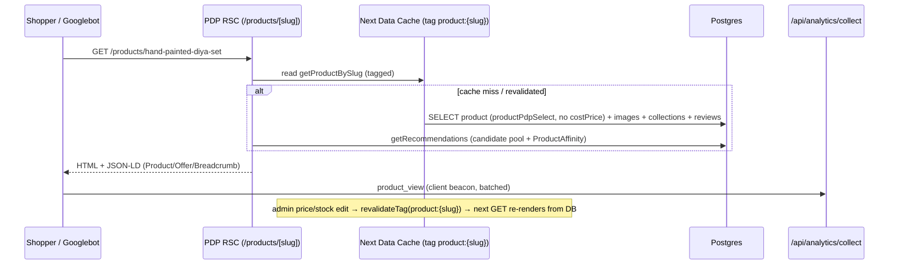
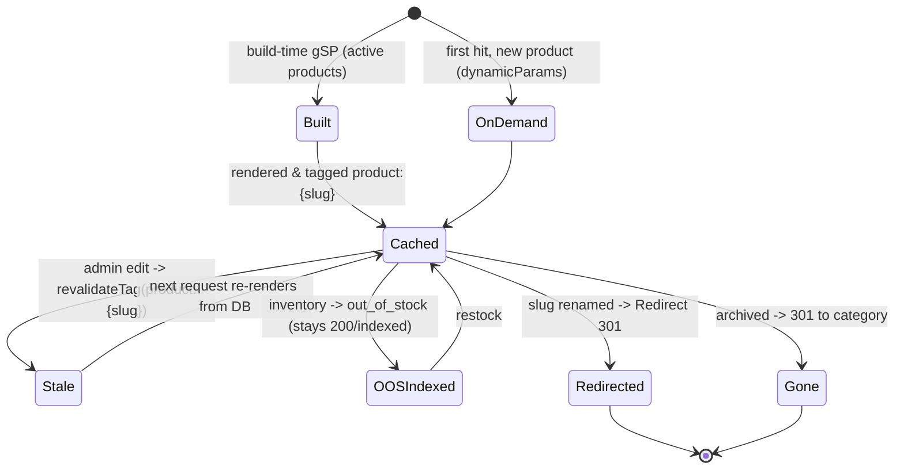

# 07 — Storefront: Product Detail Page & Recommendations

> **Project:** `vaani-gift-e-commerce` · **Brand:** GooglyWoogly Art · **Base:** Jaipur, India · **Domain:** `googlywoogly.art`
> **Owner-perspective:** Product / Design (with Solutions-Architecture for rendering, caching, structured data).
> **Conforms to:** [`00-canonical-decisions.md`](./00-canonical-decisions.md) (CANON). Entity/field/enum/route/cache-tag names are taken verbatim from CANON §5–§12 and expanded per [`03-data-model-and-entities.md`](./03-data-model-and-entities.md). Routing/rendering/redirect/SEO contracts follow [`04-information-architecture-and-routing.md`](./04-information-architecture-and-routing.md) and CANON §8–§9. Where I decide something CANON leaves open, the call is stated inline and surfaced in §11 Open Questions.
> **Authoritative for:** the Product Detail Page (`/products/[slug]`) — every section, component, interaction, state, JSON-LD payload, analytics event — **and** the on-PDP recommendation rails (algorithm, fallbacks, computation, caching).
> **Not authoritative for:** the PLP/category/search grids (`06`), the cart/checkout/order-placement flow and the cart re-validation contract (`08`), the admin product editor (`11`), notifications/WhatsApp templates (`14`), or the global SEO/sitemap/robots machinery (`09`). This doc consumes those contracts; it does not redefine them.

---

## 1. Purpose & Scope

### 1.1 What this document covers

The **Product Detail Page (PDP)** at `/products/[slug]` is the single most important conversion surface in the storefront: it is where SEO traffic lands (JTBD-1), where the décor shopper judges quality (US-B1), where the gift-buyer confirms availability and adds personalization (US-B2/B3), and the launch pad into cart → checkout → WhatsApp. This spec defines, decisively and completely:

1. **The full PDP layout** — image gallery (multiple images, zoom, mobile swipe), title/subtitle/price/`compareAtPrice`, availability + made-to-order lead-time messaging derived from `inventoryState`, the handmade story & "each piece is unique," materials / care / dimensions, optional **personalization** input + **gift message**, quantity stepper, **Add-to-Cart**, the **sticky mobile buy-bar**, trust badges, a shipping/returns summary, the **"Ask on WhatsApp about this product"** deep link, social share, and the **reviews block (V1)**.
2. **Complete on-page SEO** — `generateMetadata` (title/description/canonical/robots/OG/Twitter), and `Product` + `Offer` + `BreadcrumbList` JSON-LD (with `AggregateRating` added in V1 when reviews ship).
3. **Recommendations below the fold** — the precise algorithm and ranking for *"You may also like"*, *"More from this collection"*, and *"Frequently gifted with"*, including fallbacks (in-stock first, then bestsellers/featured), how each rail is computed, and how it is cached and revalidated.
4. **Rendering & caching contract** for the route — RSC-ISR + `generateStaticParams` + on-demand revalidation under tag `product:{slug}`, with the safety-net `revalidate` window.
5. **States & edge cases** — out-of-stock, made-to-order, archived/redirected, price/stock changed, personalization validation, empty galleries, recommendation starvation.
6. **Analytics, accessibility, and performance (Core Web Vitals)** requirements specific to the PDP.

### 1.2 What this document explicitly does NOT cover

- **No variant/option selector.** Single-listing model (CANON §3, §5). There is no size/colour swatch, no `?variant=`, no SKU-in-URL. "Personalization" is free-text only, not a variant axis.
- **No on-PDP payment.** No buy-now-pay, no gateway, no Razorpay. Add-to-Cart records *intent*; money moves on WhatsApp after the founder confirms (CANON §1, §3). The only money action here is "add to cart."
- **No shopper login / wishlist / "save for later" account features.** Guest-only (CANON §2). A client-side, no-auth "recently viewed" is in scope as a nice-to-have (V1, §12); a persisted wishlist is not.
- **The cart drawer / cart page / checkout** — owned by `08`. This doc defines the *Add-to-Cart action contract and payload* it hands to the cart store, not the cart UI.
- **The PLP, category, collection landing, and search pages** — owned by `06`. This doc reuses the shared `ProductCard` they define for recommendation rails.
- **The admin product editor and inventory screens** — owned by `11`. This doc only *reads* the fields the admin maintains.
- **Global SEO infrastructure** (sitemap, robots, `metadataBase`, redirect middleware) — owned by `09`/`04`. This doc defines only the PDP's *own* metadata/JSON-LD and references the redirect behaviour for archived slugs.

---

## 2. Primary user stories / jobs-to-be-done

> Traces to PRD `01` Epic B (Evaluate) and CANON personas. "P1" = Aarohi the occasion gift-buyer (volume engine); "P2" = Meera the home-décor shopper (higher AOV); "P3" = Rohan the bulk buyer.

| # | As a… | I want… | so that… | PRD trace |
|---|---|---|---|---|
| **JS-1** | shopper landing from Google/Instagram (P1/P2) | a fast, beautiful, indexable product page with multiple real photos I can zoom | I instantly trust this is a genuine handmade product worth my money. | US-B1, JTBD-1 |
| **JS-2** | home-décor shopper (P2) | the materials, exact dimensions, weight and care instructions clearly laid out | I can judge whether it fits my space and how to look after it. | US-B1, JTBD-6 |
| **JS-3** | gift-buyer racing a deadline (P1) | to know immediately whether it's in stock, low, or **made-to-order with a lead time** | I can decide *with confidence* whether it arrives in time for the occasion. | US-B2, JTBD-3 |
| **JS-4** | gift-buyer (P1) | to add a **name/message to personalize** the piece (when offered) and a **gift message** for the recipient | the gift feels made-for-them, not generic. | US-B3, JTBD-2 |
| **JS-5** | decided buyer (P1/P2) | a single, obvious **Add to Cart** with a quantity stepper, reachable with my thumb on mobile | I can commit in seconds without hunting for the button. | US-C1, JTBD-4 |
| **JS-6** | hesitant first-time buyer | visible **trust signals** (handmade story, founder, reviews, policies) and a way to **ask a question on WhatsApp** before I commit | I overcome "is this micro-brand legit / will it be right?" friction. | JTBD-7, US-B... |
| **JS-7** | shopper who hit a **sold-out / made-to-order** item | to still understand my options (lead time, or enquire/notify on WhatsApp) instead of a dead end | I decide rather than bounce. | US-B... (JTBD-9) |
| **JS-8** | browsing shopper (P2) | relevant **recommendations** ("you may also like", "more from this collection") below the product | I keep discovering pieces and don't leave empty-handed. | US-A..., FR-11 |
| **JS-9** | a shopper who loves the piece | to **share** it to WhatsApp/Instagram/a link | I can show a friend or my partner before buying. | (gifting behaviour) |
| **JS-10** | returning shopper (V1) | to read **reviews from real buyers** and see an aggregate rating | I get social proof that reduces purchase risk. | US-B..., FR-14 |
| **JS-11** | Googlebot | clean canonical, rich `Product`/`Offer`/`Breadcrumb` structured data, and a stable URL | the product earns a rich result and ranks for "handmade {category} gift Jaipur". | JTBD-8, FR-13 |

---

## 3. Detailed functional requirements

> Numbered, decisive. **MUST** = MVP unless a phase tag (V1/V2) is present. Entity/field/enum/tag names are CANON-verbatim. The `inventoryState` derivation rule is CANON §6 and is computed at read-time (never stored — `03` FR-12).

### 3.1 Route, rendering & caching

- **FR-1 — Route & render mode.** The PDP is served at **`/products/[slug]`** as **RSC-ISR** with **`generateStaticParams`** (built from `status = active` products) + **`dynamicParams = true`** (new products render on first request, then cache) + **on-demand revalidation** (CANON §8, IA §6.1). Safety-net `export const revalidate = 3600`.
- **FR-2 — Cache tag.** The PDP data read MUST be tagged **`product:{slug}`**. It is revalidated when that product is created/updated/archived, or its **price**, **compareAtPrice**, **inventoryQuantity / inventoryState**, **status**, or **media** change, and on review approve/reject (V1) — per IA §7. Recommendation rails additionally depend on the **`products`** tag (and the parent **`category:{slug}`** / **`collection:{slug}`** tags) so a sibling product's change refreshes them (§6.4).
- **FR-3 — `slug` is the only key.** The route accepts a slug only; internal `id` is never a path segment (CANON §10, IA FR-10). Lookup is by `Product.slug` (unique index → O(1)).
- **FR-4 — Archived / unknown / renamed slugs.** Resolution order (delegated to `04` middleware + the page):
  - **Renamed slug** → `Redirect` table 301 to the new path (CANON §10, IA FR-14).
  - **Archived / removed product** (`status = archived`) → **301 to its category PLP** (`/category/{categorySlug}`, fallback `/products`) — never a 404 (preserves SEO equity; IA FR-26, §8.3). Decision: a `draft` product is treated as not-published → `notFound()` (404) for anonymous visitors.
  - **No product and no redirect** → `notFound()` (HTTP 404, `noindex`) with the helpful 404 UI.
- **FR-5 — Out-of-stock active products stay indexed.** An `active` product whose `inventoryState = out_of_stock` MUST keep rendering at 200 and remain `index,follow` (IA §8.3). It is **not** redirected or 404'd. (Resolves PRD OQ-4 — see §11.)

### 3.2 Media gallery

- **FR-6 — Gallery source & order.** The gallery renders all `ProductImage` rows for the product, ordered by `sortOrder` ascending; the image flagged `isPrimary` (mirroring `Product.primaryImageId`) is the **default/first** slide and the **LCP** image. Each image uses `ProductImage.url` with persisted `width`/`height` (CLS-safe) and `alt`.
- **FR-7 — Multiple images, thumbnails, swipe, zoom.** The gallery MUST support: (a) a main stage image with a thumbnail strip/dots; (b) **mobile swipe** between images (touch/drag) via the vendored `embla-carousel-react`; (c) **desktop zoom** — hover-magnify or click-to-open a full-screen lightbox with pinch/scroll zoom; (d) keyboard arrow navigation and visible focus. Lazy-load all non-first images.
- **FR-8 — Empty / single-image fallbacks.** Zero images → a branded placeholder (brand mark on a soft background) with `alt = product.title`; the gallery never renders broken-image icons. One image → no thumbnail strip, no carousel chrome, but zoom still available.
- **FR-9 — Badges over the gallery.** Contextual badges overlay the primary image (top-left): **`compareAtPrice`** present → a "Save ₹X / N% off" badge; `isBestseller` → "Bestseller"; `publishedAt` within 30 days → "New"; and the **availability badge** mirroring `inventoryState` (§3.4). Badge priority and stacking are defined in §4.3.

### 3.3 Core product info (title, price, description)

- **FR-10 — Identity block.** Render `title` (H1, exactly one per page), `subtitle` (if set) beneath it, and an optional category eyebrow link to `/category/{categorySlug}`. Reviews summary (stars + count, V1) sits directly under the title when ≥1 approved review exists.
- **FR-11 — Price block.** Render `price` formatted as **₹ with `en-IN` grouping** via `lib/money.ts` (`formatINR`); never float. When `compareAtPrice` is set **and `> price`**, show it struck-through next to the price plus a "Save ₹X (N%)" pill; otherwise show price alone. If GST is enabled (`SiteSetting.gstin` set — V1), show "Incl. of taxes" / GST note (CANON §11); in MVP show "Taxes calculated at confirmation" only if a tax line is possible, else nothing.
- **FR-12 — Rich description.** Render `description` (sanitized rich HTML/MDX) in a readable prose block. `shortDescription` is used only for meta/cards, **not** duplicated verbatim in the body.
- **FR-13 — Handmade story & uniqueness.** Every PDP MUST surface the handmade/uniqueness messaging (CANON §11, PP-7): a short, brand-consistent **"Handcrafted in Jaipur — each piece is unique"** module with a one-line note that natural variation in colour/grain/finish is expected and celebrated. This is **static brand copy** (not a per-product field) rendered for all products; it is templated so the founder can edit it later via CMS (V1). For `madeToOrder` products it adds "Made to order by hand just for you."

### 3.4 Availability, inventory state & made-to-order

- **FR-14 — Read-time `inventoryState` derivation.** The PDP computes `inventoryState` exactly per CANON §6 from `madeToOrder`, `inventoryQuantity`, `lowStockThreshold` (it is **not** a stored column — `03` FR-12):
  - `madeToOrder = true` → **`made_to_order`** (always orderable; show lead time) — takes precedence over quantity.
  - else `inventoryQuantity <= 0` → **`out_of_stock`**.
  - else `inventoryQuantity <= lowStockThreshold` → **`low_stock`**.
  - else → **`in_stock`**.
- **FR-15 — Availability messaging per state.** The availability module MUST render, per state:

  | `inventoryState` | Badge | Headline | Sub-copy | Add-to-Cart | Lead-time line |
  |---|---|---|---|---|---|
  | `in_stock` | green "In stock" | "In stock — ready to ship" | est. dispatch window | **Enabled** | dispatch in {dispatchDays} (from settings) |
  | `low_stock` | amber "Only a few left" | "Selling fast — only a few made" | urgency, honest | **Enabled** | as in_stock |
  | `made_to_order` | violet "Made to order" | "Handmade to order just for you" | "Crafted after you order" | **Enabled** (always) | **"Ships in {productionLeadTimeDays} days"** — REQUIRED, prominent |
  | `out_of_stock` | grey "Sold out" | "Currently sold out" | "This handmade piece is between batches." | **Disabled** | CTA → "Ask on WhatsApp / Notify me" |

- **FR-16 — Made-to-order lead time is mandatory & prominent.** When `inventoryState = made_to_order`, the PDP MUST display `productionLeadTimeDays` as a clear "Ships in N days" statement near both the price and the Add-to-Cart button, and repeat it on the sticky buy-bar (CANON §11, PRD FR-9). If `madeToOrder = true` but `productionLeadTimeDays` is null, fall back to copy "Made to order — we'll confirm your timeline on WhatsApp" and log a content warning (admin data gap).
- **FR-17 — Out-of-stock behaviour.** For `out_of_stock` (non-MTO), Add-to-Cart is disabled; the primary CTA becomes **"Ask on WhatsApp"** (deep link, §3.9) and an optional **"Notify me"** capture (writes a `NewsletterSubscriber` with `source = popup` + product metadata — MVP-lite; full back-in-stock automation is V1, §12). The page stays live and indexed (FR-5).
- **FR-18 — Inventory is advisory at order time (MVP).** Per system architecture (`02`, edge-case "Concurrent inventory edit vs order"), MVP does **not** hard-decrement stock on Add-to-Cart or order placement — the founder confirms true availability on WhatsApp. Therefore the PDP **never** blocks adding a `made_to_order`, `in_stock`, or `low_stock` item for quantity reasons; it only disables for `out_of_stock` non-MTO. Stock numbers are not shown as exact counts (only "a few left") to avoid implying a hard reservation. (See §11 OQ.)

### 3.5 Personalization & gift message

- **FR-19 — Personalization input (conditional).** When `allowsPersonalization = true`, the PDP MUST render a single-line text input labelled by `personalizationLabel` (fallback label: "Personalization (e.g. name to engrave)"). It is **optional** by default. Max length **50 chars** (configurable constant), live character counter, and a small "Spelling will be used exactly as typed — please double-check" helper. The value flows to `OrderItem.personalizationNote` (CANON §5) via the cart line.
- **FR-20 — Gift message (always available).** Every PDP offers an **optional gift message** field (multi-line, max **200 chars**, counter), surfaced under a collapsible "Add a gift message 🎁" toggle so it doesn't clutter the buy box. The value flows to `OrderItem.giftMessage` (per-item). Decision (resolves PRD OQ-6): the **per-item** gift message is captured here on the PDP; checkout (`08`) additionally offers an **order-level** `Order.giftMessage` for single-recipient orders. Both fields exist in CANON §5; this doc owns the per-item one.
- **FR-21 — Personalization & MTO interplay.** Adding personalization does **not** change `inventoryState`, but the buy box surfaces a subtle note "Personalized & made-to-order pieces are non-returnable" (links to the returns policy) whenever personalization text is entered **or** the item is `made_to_order` (handmade-returns honesty, PRD OQ-5 default stance).

### 3.6 Quantity, Add-to-Cart & buy box

- **FR-22 — Quantity stepper.** A `−` / value / `+` stepper, default **1**, min **1**, max **10** (configurable `MAX_QTY_PER_LINE`). It does not enforce stock count (FR-18). Keyboard-operable; the value is also directly editable and clamped on blur.
- **FR-23 — Add-to-Cart action.** The primary button **"Add to Cart"** (full-width on mobile) adds a line to the client cart store (zustand/context over `localStorage`, CANON §4; owned by `08`). The line payload snapshots what the cart/checkout needs:

  ```ts
  // payload handed to the cart store on Add-to-Cart
  {
    productId: string;          // Product.id (resolves price/stock at cart load + checkout)
    slug: string;               // for cart line link back to PDP
    title: string;              // ProductImage/Product snapshot for display
    imageUrl: string;           // primary image
    unitPrice: number;          // paise, current price (re-validated by 08 on load/checkout)
    quantity: number;           // from stepper (1..MAX_QTY_PER_LINE)
    personalizationNote?: string; // FR-19, trimmed; omitted if empty
    giftMessage?: string;         // FR-20, trimmed; omitted if empty
    madeToOrder: boolean;       // to display lead-time in cart
    productionLeadTimeDays?: number;
  }
  ```

  On success: optimistic UI (button → "Added ✓"), a toast (`sonner`) with "View cart" / "Continue shopping", the header cart badge increments, and an optional cart drawer opens (owned by `08`). Emits **`add_to_cart`** (§9). Two identical lines (same product **and** identical personalization + gift message) merge and sum quantity; differing personalization creates a separate line.
- **FR-24 — Buy box composition & stickiness.** Desktop: the buy box (price, availability, personalization toggle, gift-message toggle, quantity, Add-to-Cart, WhatsApp/secondary CTA, trust mini-badges, share) sits in the right column and is **sticky** within the viewport as the user scrolls the left media/description column. Mobile: see FR-25.
- **FR-25 — Sticky mobile buy-bar.** On viewports `< md`, a **sticky bottom bar** appears once the in-page Add-to-Cart scrolls out of view: it shows the price (+ compareAt strike), a compact availability/lead-time chip, and a full-width **Add to Cart** (or **Ask on WhatsApp** when `out_of_stock`). It reserves the bottom slot per IA §4.3 (the global mobile bottom tab bar hides on PDP). Tapping it adds qty = current stepper value (default 1). Respects safe-area insets.

### 3.7 Trust, shipping/returns summary, FAQ

- **FR-26 — Trust badges.** A compact trust strip in/under the buy box: **"Handcrafted in Jaipur," "Made-to-order options," "Pan-India shipping," "WhatsApp support,"** and **"Secure order, pay on confirmation"** (sets the no-online-payment expectation positively). Icons from `lucide-react`. These are static (driven by `SiteSetting` where applicable, e.g. free-shipping threshold).
- **FR-27 — Shipping & returns summary.** An accordion (collapsed by default below the buy box) summarizing: dispatch/lead-time expectation, **flat shipping + free over `SiteSetting.freeShippingThreshold`** (CANON §11), pan-India delivery estimate, and the **handmade returns stance** (limited/case-by-case via WhatsApp; personalized & made-to-order non-returnable — PRD OQ-5 default). Each links to the full `/shipping-policy` and `/returns-and-refunds` pages. Content for the prose comes from those `CmsPage`s; the PDP shows a short, templated summary.
- **FR-28 — Product attributes block.** A structured "Details" section renders, when present: **`materials`**, **`dimensions`** (formatted from the JSON shape `{length,width,height,diameter,unit}` → e.g. "L 20 × W 8 × H 8 cm" or "Ø 10 cm"), **`weightGrams`** (→ "Weight: 320 g"), `sku` (small, muted — useful for WhatsApp reference), and `careInstructions`. Absent fields are omitted (no empty rows).

### 3.8 Reviews block (V1)

- **FR-29 — Reviews display (V1).** When reviews ship (CANON §3 V1), the PDP renders approved `Review` rows for the product (`status = approved`), newest first, paginated/"load more". Each shows `customerName`, `rating` (stars), optional `title`, `body`, `isVerifiedPurchase` badge, optional review images (`imageIds` → `MediaAsset`), and IST date. An **aggregate** (average `rating` + count) shows under the title (FR-10) and feeds `AggregateRating` JSON-LD (FR-35).
- **FR-30 — Reviews empty / pre-V1 state.** In MVP (reviews not yet live) the reviews block is **hidden entirely** (no empty "Be the first to review" shell, to avoid a thin/empty section affecting CWV/SEO). In V1 with zero approved reviews, show a subtle "No reviews yet — be among the first" line and (post-order only) a deep link to leave a review from the tracking page; **no on-PDP review submission** (submission is post-order/moderated, owned by `12`/admin `reviews`).

### 3.9 WhatsApp, share & secondary actions

- **FR-31 — "Ask on WhatsApp about this product."** A secondary CTA builds a `wa.me` deep link via `lib/whatsapp.ts` (CANON §4; `02` FR-26) to `SiteSetting.whatsappNumber`, prefilled with product context, e.g.:
  > `Hi GooglyWoogly! I'm interested in "{title}" ({sku}) — {absoluteProductUrl}. Could you help me with availability and details?`
  It opens in a new tab, emits **`whatsapp_click`** with product context (§9). For `out_of_stock`, this CTA is **promoted to primary** (FR-17). The prefilled URL is absolute and built from `NEXT_PUBLIC_SITE_URL`.
- **FR-32 — Social share.** A share control offers: native **Web Share API** (`navigator.share`) on supported devices (shares title + url), with explicit fallbacks to **WhatsApp**, **Facebook**, **Pinterest** (image + url), **X/Twitter**, and **Copy link** (writes to clipboard, toast "Link copied"). Each share/copy emits **`outbound_click`** with `metadata.channel` (§9). Open Graph tags (FR-34) ensure rich unfurls.
- **FR-33 — Breadcrumb.** A breadcrumb trail **Home › {Category} › {Product title}** renders at the top of the PDP (links to `/`, `/category/{slug}`), mirrored in `BreadcrumbList` JSON-LD (IA FR-18). If the product has no category, the trail is **Home › Products › {title}** (linking `/products`).

### 3.10 SEO metadata & structured data

- **FR-34 — `generateMetadata`.** The PDP exports `generateMetadata` producing:
  - **title** = `metaTitle` ?? `{title} — GooglyWoogly Art` (root template `%s · GooglyWoogly Art` applies; avoid double-branding).
  - **description** = `metaDescription` ?? `shortDescription` ?? a trimmed, tag-stripped excerpt of `description` (≤160 chars).
  - **alternates.canonical** = absolute clean URL `${NEXT_PUBLIC_SITE_URL}/products/{slug}` (self-canonical; CANON §10, IA FR-11).
  - **robots** = `index,follow` for `active` (incl. `out_of_stock`); the route otherwise 301/404s before metadata for archived/draft.
  - **openGraph** = `type: "product"` (or website), title, description, url (canonical), `images` = `ogImageId` → else `primaryImageId` → else first `ProductImage` (absolute URL, with width/height); `siteName = "GooglyWoogly Art"`, `locale = "en_IN"`.
  - **twitter** = `summary_large_image`, same title/desc/image, `SiteSetting.defaultSeo.twitterHandle` if set.
- **FR-35 — JSON-LD (CANON SEO-first, PRD FR-13).** Inject, server-side, a single `<script type="application/ld+json">` graph containing:
  - **`Product`** — `name` (title), `description` (plain-text), `image[]` (all gallery URLs, absolute), `sku`, `brand` `{ "@type":"Brand","name":"GooglyWoogly Art" }`, `category` (category name), `material` (`materials`), and `url` (canonical).
  - **`Offer`** (nested in `Product.offers`) — `priceCurrency:"INR"`, `price` (rupees, 2dp string from paise), `availability` mapped from `inventoryState` (table below), `url` (canonical), `priceValidUntil` (today + 1 year), `itemCondition: "NewCondition"`, `seller` `{ "@type":"Organization","name":"GooglyWoogly Art" }`. **No `shippingDetails`/`hasMerchantReturnPolicy` in MVP** beyond a generic note (added in V1 with the policy pages).
  - **`BreadcrumbList`** — Home › Category › Product (FR-33).
  - **`AggregateRating`** (V1, only when ≥1 approved review) — `ratingValue` (avg), `reviewCount`, `bestRating:5`, `worstRating:1`; plus up to N `Review` nodes.

  Availability mapping:

  | `inventoryState` | schema.org `availability` |
  |---|---|
  | `in_stock` | `https://schema.org/InStock` |
  | `low_stock` | `https://schema.org/LimitedAvailability` |
  | `made_to_order` | `https://schema.org/MadeToOrder` (`PreOrder` acceptable alt) — and `Offer.availability` orderable |
  | `out_of_stock` | `https://schema.org/OutOfStock` |

- **FR-36 — Single H1, semantic headings, no JSON-LD/visible-content mismatch.** Exactly one `<h1>` (the title). JSON-LD `price`/`availability`/`name` MUST match what the user sees (Google policy). `compareAtPrice` is **not** emitted as the offer price.

### 3.11 Recommendations (below the product)

- **FR-37 — Three recommendation rails, in order.** Below the product detail (and above the footer), the PDP renders up to three horizontally-scrollable rails, each using the shared `ProductCard` (from `06`), in this priority order, **skipping any rail that cannot be filled to its minimum**:
  1. **"More from this collection"** — other products sharing the product's **highest-priority `Collection`** (see FR-40). Header links to that `/collections/{slug}`. *(Strongest merchandising signal; only shown if the product belongs to ≥1 active collection.)*
  2. **"You may also like"** — related by **category → occasions → tags** similarity (FR-39). Always attempted; the universal rail.
  3. **"Frequently gifted with"** — complementary pieces (FR-41): co-occurrence in real `OrderItem`s when data exists, else a curated "complete the gift" heuristic. *(MVP uses the heuristic fallback; true co-occurrence is data-driven and improves over time.)*
- **FR-38 — Universal candidate rules.** Every rail MUST: exclude the current product; include only `status = active`; **rank in-stock/made-to-order ahead of out-of-stock** (availability-first, FR-42); de-duplicate across rails (a product shown in an earlier rail is not repeated in a later one); cap at **min 4 / max 12** cards (rail hidden if fewer than 4 *after* fallbacks).
- **FR-39 — "You may also like" algorithm.** Score candidate products by a deterministic similarity to the current product:
  - same `categoryId` → **+50**
  - shared `occasions` (CANON §11 list) → **+15 each** (cap +45)
  - shared `tags` → **+8 each** (cap +40)
  - in same price band (±35% of current `price`) → **+20**
  - `isBestseller` → **+10**; `isFeatured` → **+8**
  - **availability bonus**: in_stock/low_stock/made_to_order → **+25**; out_of_stock → **0** (keeps sold-out items last)
  - tie-break: higher `isBestseller`, then newer `publishedAt`, then `id` (stable).
- **FR-40 — "More from this collection" selection.** Pick the product's collections (via `CollectionProduct`) where `Collection.isActive`; choose the **highest-priority** collection by: smallest `Collection.sortOrder`, then `isFeaturedOnHome` true, then most members. List that collection's other active products ordered by `CollectionProduct.sortOrder`, then availability-first (FR-42). If the product is in no active collection → **omit this rail** (do not synthesize one).
- **FR-41 — "Frequently gifted with" algorithm.** Primary (when order data is sufficient): products that **co-appear in the same `Order`** as the current product across `OrderItem`s, ranked by co-occurrence count (last 180 days), availability-first. **Fallback** (MVP default, sparse-data): a curated "completes the gift" heuristic — different *category* but shared *occasion*/price-band (e.g. a candle to pair with a frame), ranked by `isBestseller` then `isFeatured`. The rail is **omitted** if neither yields ≥4 after fallback.
- **FR-42 — Availability-first ordering & global fallback chain.** Within every rail, sort by: (1) the rail's relevance score, (2) availability tier (`in_stock`/`low_stock`/`made_to_order` before `out_of_stock`). If a rail under-fills (< min 4) after its primary logic, **top up** from this global fallback chain, de-duplicated, until 4–12 reached or sources exhaust:
  1. same-category active in-stock products,
  2. `isBestseller` active products,
  3. `isFeatured` active products,
  4. newest active products (`publishedAt` desc).

  ```mermaid
  flowchart TD
    A[PDP product] --> B{In an active collection?}
    B -- yes --> R1[Rail 1: More from this collection<br/>order by CollectionProduct.sortOrder + availability]
    B -- no --> S1[skip Rail 1]
    A --> R2[Rail 2: You may also like<br/>similarity score: category+occasion+tag+price+flags+availability]
    A --> C{Order co-occurrence data?}
    C -- yes --> R3[Rail 3: Frequently gifted with<br/>co-occurrence last 180d, availability-first]
    C -- no --> R3F[Rail 3 fallback: complete-the-gift heuristic<br/>diff category, shared occasion/price band]
    R1 --> D{>= 4 cards?}
    R2 --> D
    R3 --> D
    R3F --> D
    D -- no --> F[Top up via global fallback chain:<br/>same-category in-stock -> bestsellers -> featured -> newest]
    D -- yes --> G[Render rail 4..12 cards, de-duped across rails]
    F --> H{>= 4 after top-up?}
    H -- no --> X[Omit rail]
    H -- yes --> G
  ```

- **FR-43 — Recommendation computation & caching.** Rails are computed **server-side inside the PDP RSC** (no client fetch waterfall) by a `getRecommendations(product)` service. The whole computation is wrapped so it participates in the route's cache and carries tags **`product:{slug}`, `products`**, and the relevant **`category:{slug}`** / **`collection:{slug}`** tags — so any catalog mutation that changes candidacy (a sibling going out of stock, a new product, a collection membership change) refreshes the rails on next request. Heavy co-occurrence aggregation (FR-41 primary) is **precomputed nightly** by a Vercel Cron job into a small `ProductAffinity` cache (see §5.4 / §11 added entity) rather than aggregated per request; the request path reads that cache. Safety-net `revalidate = 3600` applies.
- **FR-44 — Recommendation analytics.** Each rendered rail card is impression-eligible; clicking a recommendation emits **`product_view`** on the destination PDP plus an **`outbound_click`**-style `metadata` (`{ source:"reco", rail:"you_may_also_like", fromProductId }`) so the analytics rollup can measure reco CTR (CANON §12). (No new CANON event type is introduced — reco context rides in `metadata`.)

---

## 4. UX / UI breakdown

### 4.1 Page anatomy (desktop, ≥ lg)

Two-column hero, full-width sections below. Left = media (≈58%), right = sticky buy box (≈42%).

```
┌───────────────────────────────────────────────────────────────────────────┐
│  Home › Diwali Gifts › Hand-painted Ceramic Diya Set            (breadcrumb)│
├──────────────────────────────────────────────┬────────────────────────────┤
│  ┌────────────────────────────────────────┐  │  Diwali Gifts (eyebrow→cat) │
│  │   [Bestseller] [Save 20%]              │  │  H1: Hand-painted Ceramic   │
│  │                                        │  │      Diya Set               │
│  │            MAIN IMAGE (zoom)           │  │  subtitle: Set of 4 · brass │
│  │                                        │  │  ★★★★★ 4.8 (23)  ← V1       │
│  │                                        │  │                             │
│  └────────────────────────────────────────┘  │  ₹1,499  ̶₹̶1̶,̶8̶7̶5̶  Save ₹376  │
│  [ ▢ ][ ▢ ][ ▢ ][ ▢ ]  ← thumbnail strip     │                             │
│                                              │  ● Made to order — ships in │
│                                              │    7 days                   │
│                                              │  ─────────────────────────  │
│                                              │  Personalization (name)     │
│                                              │  [____________________] 0/50│
│                                              │  ▸ Add a gift message 🎁    │
│                                              │  Qty [ − ] 1 [ + ]          │
│                                              │  [   Add to Cart        ]   │
│                                              │  [ Ask on WhatsApp ]  [↗]   │
│                                              │  🔒 Pay on confirmation ·   │
│                                              │  🇮🇳 Pan-India · ✋ Handmade  │
│                                              │  ▸ Shipping & returns       │
├──────────────────────────────────────────────┴────────────────────────────┤
│  DESCRIPTION (rich)        │  Handcrafted in Jaipur — each piece is unique  │
│  Details: Materials · Dimensions · Weight · SKU · Care                      │
├───────────────────────────────────────────────────────────────────────────┤
│  Reviews (V1)  ★★★★★ 4.8 · 23 reviews   [load more]                         │
├───────────────────────────────────────────────────────────────────────────┤
│  More from this collection   →  [card][card][card][card][card] ▸           │
│  You may also like           →  [card][card][card][card][card] ▸           │
│  Frequently gifted with      →  [card][card][card][card][card] ▸           │
└───────────────────────────────────────────────────────────────────────────┘
```

### 4.2 Page anatomy (mobile, < md)

Single column, stacked. Buy actions duplicated in a sticky bottom bar.

```
Home › Diwali › Diya Set
┌─────────────────────────────┐
│  [Bestseller][Save 20%]     │
│   IMAGE (swipe ◀ ▶)  ● ○ ○  │  ← embla swipe + dots
├─────────────────────────────┤
│  Diwali Gifts (eyebrow)     │
│  H1 Hand-painted Diya Set   │
│  ★★★★★ 4.8 (23)             │
│  ₹1,499  ̶₹̶1̶,̶8̶7̶5̶  Save ₹376 │
│  ● Made to order · 7 days   │
│  Personalization [_____]0/50│
│  ▸ Add a gift message 🎁    │
│  Qty [−] 1 [+]              │
│  [    Add to Cart       ]   │
│  [   Ask on WhatsApp    ]   │
│  trust badges · share       │
│  ▸ Shipping & returns       │
├─────────────────────────────┤
│  Description …              │
│  Details …                  │
│  Each piece is unique …     │
│  Reviews (V1) …             │
│  More from collection ▸     │
│  You may also like ▸        │
│  Frequently gifted with ▸   │
└─────────────────────────────┘
┌─────────────────────────────┐  ← sticky bottom buy-bar (appears on scroll)
│ ₹1,499 · MTO 7d   [Add 🛒]  │
└─────────────────────────────┘
```

### 4.3 Component inventory & behaviour

| Component | Built on (vendored) | Key behaviour |
|---|---|---|
| `ProductGallery` | `embla-carousel-react`, `dialog` (lightbox), `aspect-ratio` | Main stage + thumb strip; mobile swipe; desktop hover-zoom + click-to-lightbox (pinch/scroll zoom); arrow keys; lazy non-first; `priority` on first (LCP). |
| `GalleryBadges` | `badge` | Overlay priority (max 2 visible, left-stacked, top→down): **availability** (always) > **Save N%** (if compareAt) > **Bestseller** > **New**. |
| `ProductIdentity` | — | Eyebrow category link, H1 title, subtitle, review summary (V1). |
| `PriceBlock` | — | `formatINR(price)`; struck `compareAtPrice` + "Save ₹X (N%)" when valid; tax note. |
| `AvailabilityBlock` | `badge`, `tooltip` | State-driven copy + lead time (FR-15/16); colour per state. |
| `PersonalizationField` | `input`, `label` | Conditional on `allowsPersonalization`; counter; helper; non-returnable note. |
| `GiftMessageField` | `collapsible`, `textarea` | Toggle; 200-char counter. |
| `QuantityStepper` | `button`, `input` | −/value/+; clamp 1..MAX; keyboard. |
| `AddToCartButton` | `button`, `sonner` | Client action; optimistic; toast; emits `add_to_cart`; merges identical lines. |
| `WhatsAppButton` | `button` | `lib/whatsapp.ts` deep link; new tab; emits `whatsapp_click`; primary when OOS. |
| `ShareControl` | `dropdown-menu`/`popover` | Web Share API + WA/FB/Pinterest/X/Copy; emits `outbound_click`. |
| `TrustStrip` | `lucide-react` icons | Static trust signals; free-ship threshold from settings. |
| `ShippingReturnsAccordion` | `accordion` | Collapsed summary → links to policy pages. |
| `DetailsBlock` | `separator` | materials/dimensions/weight/sku/care; omit-if-absent rows. |
| `HandmadeStory` | — | Static brand uniqueness module (CMS-editable V1). |
| `StickyBuyBar` | `sheet`-less fixed bar; `use-mobile` | Mobile only; appears when in-page CTA off-screen (IntersectionObserver); price + chip + Add/WhatsApp; safe-area aware. |
| `ReviewsSection` (V1) | `avatar`, `pagination`, `dialog` | Approved reviews; aggregate; review images lightbox; load-more. |
| `RecommendationRail` | `carousel`/`scroll-area`, `ProductCard` (from `06`) | Horizontal scroll; lazy images; snap; "View all" link; impression/click analytics. |
| `Breadcrumbs` | `breadcrumb` | Home › Category › Product; emits `BreadcrumbList` LD. |

### 4.4 Copy direction

- **Voice:** warm, human, founder-led, honest. Hindi-English warmth without slang. Celebrate imperfection ("each piece is unique," "made by hand," "slight variations are the mark of the maker").
- **Availability:** never hide reality. Low stock → "Only a few made"; MTO → "Handmade to order just for you — ships in N days"; OOS → "Between batches — message us to know when it's back."
- **Trust:** make the no-online-payment model a *feature* — "Place your order, we'll confirm and arrange payment personally on WhatsApp." Avoids "why is there no pay button?" doubt.
- **CTAs:** "Add to Cart" (primary), "Ask on WhatsApp about this piece" (secondary; promoted when OOS), "Share."
- **Returns honesty:** "Personalized & made-to-order pieces are crafted just for you and can't be returned — but we'll always make it right if something's wrong. Message us."

### 4.5 Responsive & interaction notes

- **Breakpoints:** Tailwind defaults; two-column at `lg`; single column below. Buy box becomes inline (not sticky-aside) below `lg`; sticky **bottom** bar engages below `md`.
- **Sticky aside (desktop):** right buy box `position: sticky; top: header-height` constrained to its column; releases at the recommendations section.
- **Gallery on mobile:** swipe is primary; dots indicate position; tap opens lightbox. Avoid nested-scroll traps (vertical page scroll must still work mid-swipe).
- **Reduced motion:** honor `prefers-reduced-motion` — disable zoom-pan easing and carousel autoplay (no autoplay anyway).
- **Hit targets:** ≥ 44×44px for stepper, Add-to-Cart, share, thumbnails (mobile).

---

## 5. Data & entities used

> CANON §5 / `03` field names verbatim. The PDP is **read-only** against catalog data (the only storefront write originates in the cart/checkout flow and analytics beacon — `03` §5, `02` FR). A typed `productPdpSelect` MUST exclude **`costPrice`** (admin-only — never sent to storefront; `03` OQ-5).

### 5.1 Read

| Entity | Fields read on the PDP | Used for |
|---|---|---|
| `Product` | `id, slug, title, subtitle, description, shortDescription, sku, price, compareAtPrice, status, inventoryQuantity, madeToOrder, productionLeadTimeDays, lowStockThreshold, allowsPersonalization, personalizationLabel, materials, careInstructions, dimensions, weightGrams, categoryId, tags, occasions, isFeatured, isBestseller, metaTitle, metaDescription, ogImageId, primaryImageId, publishedAt, updatedAt` | Whole page, `inventoryState` derivation, metadata, JSON-LD, recommendations seed. **`costPrice` excluded.** |
| `ProductImage` | `url, alt, width, height, sortOrder, isPrimary` | Gallery, OG/JSON-LD images, cart line image. |
| `Category` | `slug, name, parentId` | Eyebrow link, breadcrumb, "same category" recos. |
| `Collection` (+ `CollectionProduct`) | `slug, title, sortOrder, isActive, isFeaturedOnHome` + join `sortOrder` | "More from this collection" rail. |
| `MediaAsset` | `url, alt, width, height` (via `ogImageId`) | OG image when set. |
| `Review` (V1) | `customerName, rating, title, body, status, isVerifiedPurchase, imageIds, createdAt` | Reviews block + aggregate + `AggregateRating`. |
| `SiteSetting` | `whatsappNumber, freeShippingThreshold, gstin, defaultSeo, socialLinks` | WhatsApp link, shipping summary, GST note, OG/Twitter defaults. |
| `ProductAffinity` *(added, §5.4)* | `productId, relatedProductId, score` | "Frequently gifted with" precomputed rail. |

For recommendation rails, additional **lightweight `ProductCard`-shaped** reads of candidate `Product`s (id, slug, title, price, compareAtPrice, primary image, `madeToOrder`, `inventoryQuantity`, `lowStockThreshold`, `isBestseller`, badges) — via the shared list query from `06`.

### 5.2 Written

| Surface | Writes | Where |
|---|---|---|
| Analytics beacon | `AnalyticsEvent` (+ `AnalyticsSession` upsert) | `POST /api/analytics/collect` (Edge), via `lib/analytics/emit.ts` — `product_view`, `add_to_cart`, `whatsapp_click`, `outbound_click`. |
| Add-to-Cart | **localStorage only** (no DB) | cart store (`08`). The PDP hands the FR-23 payload; no server write. |
| "Notify me" (OOS, MVP-lite) | `NewsletterSubscriber` (upsert) | optional capture (FR-17); full back-in-stock automation V1. |

**No PDP render path writes catalog data.** All product/inventory mutation is admin-side (`11`) and reaches the PDP only via `revalidateTag('product:{slug}')`.

### 5.3 Derived / computed

- **`inventoryState`** — computed at read-time from `madeToOrder`/`inventoryQuantity`/`lowStockThreshold` (CANON §6; FR-14). Surfaced to UI, JSON-LD, recommendation availability tier.
- **Discount %** — `round((compareAtPrice − price) / compareAtPrice × 100)` for the "Save N%" badge (only when `compareAtPrice > price`).
- **Recommendation rails** — computed by `getRecommendations(product)` (FR-37–43); not stored on `Product`.
- **Aggregate rating** (V1) — `avg(rating)`, `count` over approved reviews.

### 5.4 Added entity — `ProductAffinity` (Open Q)

To serve "Frequently gifted with" (FR-41 primary) without per-request order aggregation, a small precomputed cache is introduced (mechanism, not new product scope). Proposed shape (final in `03` if accepted):

| Field | Type | Notes |
|---|---|---|
| `productId` | String | seed product (FK→`Product.id`, Cascade), **PK part**, idx |
| `relatedProductId` | String | co-bought product (FK→`Product.id`, Cascade), **PK part** |
| `score` | Int | co-occurrence count / weight (last 180d) |
| `updatedAt` | DateTime | nightly refresh marker |

Composite PK `(productId, relatedProductId)`. Populated by a nightly Vercel Cron job aggregating `OrderItem` co-occurrence (CANON §4 jobs/cron). Until populated, FR-41 uses the heuristic fallback. **CANON has no recommendations entity — flagged in §11.**

---

## 6. Server actions / API routes

> The PDP itself is a **read-only RSC** — it has **no mutating Server Action of its own**. It (a) reads via cached service functions, (b) emits analytics via the shared beacon, and (c) hands an Add-to-Cart payload to the client cart store (owned by `08`). Inputs that *are* validated on this surface are listed below.

### 6.1 Read service functions (server, cached)

| Function | Input (Zod) | Output | Cache tags | Notes |
|---|---|---|---|---|
| `getProductBySlug(slug)` | `{ slug: z.string().min(1) }` | `ProductPdpView \| null` | `product:{slug}` | `productPdpSelect` (no `costPrice`); includes images, category, collections, approved reviews (V1). Returns null → page resolves FR-4. |
| `getRecommendations(product)` | product view object | `{ collectionRail?, alsoLike, frequentlyGifted? }` | `product:{slug}`, `products`, `category:{slug}`, `collection:{slug}` | FR-37–43; reads `ProductAffinity` + candidate list query. |
| `getShippingSummary()` | — | `{ flatRatePaise, freeShippingThresholdPaise, gstEnabled }` | `settings` | from `SiteSetting` for FR-27. |
| `generateStaticParams()` | — | `{ slug }[]` | (build) | active products only (CANON §8, IA FR-3). |
| `generateMetadata({params})` | `{ slug }` | `Metadata` | `product:{slug}` | FR-34. |

### 6.2 Client → server endpoints used (not owned here)

| Endpoint | Method | Owner | PDP usage |
|---|---|---|---|
| `POST /api/analytics/collect` | POST (Edge, Zod, batched, `sendBeacon`) | `02`/`13` | emits `product_view`, `add_to_cart`, `whatsapp_click`, `outbound_click`. Origin-checked + rate-limited; failures swallowed. |
| `addToCart` (cart store action) | client | `08` | receives FR-23 payload; persists to `localStorage`; updates badge; no DB. |
| `subscribeNewsletter` | Server Action | `15` | optional OOS "Notify me" (FR-17): `{ email, source:"popup", productId }` → `NewsletterSubscriber` upsert. |

### 6.3 Validation (Zod) on PDP-owned inputs

```ts
// personalization + gift message captured on the PDP before add-to-cart
const PdpLineInputSchema = z.object({
  quantity: z.number().int().min(1).max(MAX_QTY_PER_LINE),         // FR-22
  personalizationNote: z.string().trim().max(50).optional(),       // FR-19
  giftMessage: z.string().trim().max(200).optional(),              // FR-20
});
```

Sanitize/trim; strip control chars; collapse whitespace. Empty strings → omitted (not stored). The authoritative re-validation of price/stock happens in `08` at cart-load and checkout (CANON §4) — the PDP captures intent only.

### 6.4 Cache-tag map for this route (consolidated, from IA §7)

| Tag | Applied to (on this page) | Refreshed when |
|---|---|---|
| `product:{slug}` | the PDP data read, metadata, JSON-LD | this product created/updated/archived; price/compareAt/inventory/status/media change; review moderated (V1) |
| `products` | recommendation candidate pool | any product mutation; bulk ops; membership change |
| `category:{slug}` | "you may also like" + category-fallback recos | category edited; a product's `categoryId` changes (old+new) |
| `collection:{slug}` | "more from this collection" rail | collection edited; `CollectionProduct` membership change; automation rules recompute |
| `settings` | shipping/returns summary, WhatsApp number, OG defaults | `SiteSetting` save |



---

## 7. States & edge cases

| # | Scenario | Behaviour |
|---|---|---|
| ST-1 | **Loading** | Route `loading.tsx` PDP skeleton: gallery box, title bars, price bar, buy-box, three rail skeletons. Streamed; never blank. |
| ST-2 | **Product not found** (no slug, no redirect) | `notFound()` → 404 (`noindex`) with helpful links (home, products, popular categories, search). |
| ST-3 | **Archived product** | 301 → category PLP (`/category/{slug}`, fallback `/products`); never 404 (IA FR-26). |
| ST-4 | **Slug renamed** | `Redirect` 301 old→new path (IA FR-14); page renders at new URL. |
| ST-5 | **Draft product** (anonymous) | `notFound()` (404). (Admin preview path is out of scope here; owned by `11`.) |
| ST-6 | **Out of stock (active, non-MTO)** | 200, indexed; availability "Sold out"; Add-to-Cart disabled; "Ask on WhatsApp" promoted to primary; optional "Notify me"; recos still render. |
| ST-7 | **Made-to-order** | Always orderable; "Ships in N days" prominent (FR-16); never blocked; JSON-LD `MadeToOrder`. |
| ST-8 | **`madeToOrder` true but `productionLeadTimeDays` null** | Fallback copy "we'll confirm timeline on WhatsApp"; content-gap warning logged (not user-facing). |
| ST-9 | **`compareAtPrice` ≤ `price` or null** | Show price only; no strike/"Save" badge; JSON-LD price = `price`. |
| ST-10 | **No images** | Branded placeholder; `alt = title`; no carousel chrome; OG/JSON-LD fall back to placeholder URL (or omit image array if truly none). |
| ST-11 | **Personalization over limit / invalid chars** | Inline validation; counter turns red; Add-to-Cart blocked until ≤ limit; control chars stripped. |
| ST-12 | **Price/stock changed since cart** | Owned by `08`: on cart-load & checkout, re-validate against server; show diff banner; user re-confirms. The PDP itself always renders **current** server price (ISR-fresh after revalidation). |
| ST-13 | **Add-to-Cart while `localStorage` unavailable** (private mode/quota) | Catch; toast "Couldn't save your cart — try the WhatsApp button to order directly"; offer WhatsApp deep link as fallback. |
| ST-14 | **Recommendation starvation** (catalog too small / all OOS) | Rails top-up via global fallback chain (FR-42); a rail with < 4 cards after fallbacks is **omitted** (no thin rail). If *all* rails empty (brand-new store), the whole reco section is hidden. |
| ST-15 | **Reviews not yet shipped (MVP)** | Reviews block hidden entirely (FR-30); no `AggregateRating` in JSON-LD. |
| ST-16 | **Zero approved reviews (V1)** | Subtle "No reviews yet" line; no `AggregateRating` emitted (avoid 0-rating). |
| ST-17 | **Currency/locale** | All prices `₹` + `en-IN`; lead-time days as integer; dates IST (`lib/datetime.ts`). Never a raw paise integer or float in the UI. |
| ST-18 | **WhatsApp number missing in settings** | Hide WhatsApp CTAs gracefully; keep Add-to-Cart; log config warning. |
| ST-19 | **Very long title/personalization label** | Clamp/wrap; H1 wraps to 2–3 lines max with `text-balance`; label truncates with tooltip. |
| ST-20 | **Bot vs human analytics** | `product_view` fired client-side only (real browser), so crawlers don't inflate product views (`02` analytics). |

State machine for the PDP route lifecycle (mirrors IA §9):



---

## 8. SEO / performance / accessibility

### 8.1 SEO

- **Canonical & robots** per FR-34 and IA §8.3: self-canonical absolute URL; `index,follow` for all `active` products including `out_of_stock`; archived/draft never reach metadata (redirect/404 first).
- **Structured data** per FR-35: `Product` + `Offer` + `BreadcrumbList` always; `AggregateRating` + `Review` nodes when reviews ship (V1). JSON-LD values must match visible content (FR-36); validate against Rich Results.
- **OG/Twitter** per FR-34 for rich social unfurls (WhatsApp/Instagram/FB share previews — critical for a share-driven gifting audience). `og:type=product`, `og:price:amount/currency` where supported.
- **One H1**, semantic `<section>`/`<h2>` for description/details/reviews/recos; descriptive `alt` on every gallery image; breadcrumb links crawlable.
- **Internal linking** (IA §10.1, FR-37): PDP → category (eyebrow + breadcrumb), → same-collection items, → "you may also like", → "frequently gifted" — builds topical clusters and spreads link equity to siblings.
- **No duplicate content:** PDP lives only at `/products/{slug}` (never nested under category — IA §8.1), single canonical.

### 8.2 Performance (Core Web Vitals — CANON §2 "green")

- **LCP:** primary gallery image rendered with Next `<Image priority>`, Cloudinary responsive `srcset`, correct `sizes`, persisted intrinsic `width/height`. Target LCP < 2.5s on 4G mobile.
- **CLS:** reserve gallery aspect-ratio box (`aspect-ratio`), badge/price slots, and rail card sizes from persisted dimensions → CLS < 0.1. Sticky bottom bar reserves space; doesn't reflow content on appear (overlays).
- **INP:** Add-to-Cart, stepper, gallery swipe are lightweight client islands; keep PDP JS minimal — server-render description/details/recos (no client fetch waterfall, FR-43). Defer lightbox/zoom and reviews-pagination JS.
- **Recommendations are server-computed & cached** (FR-43): no client request on load; rail images lazy-loaded; horizontal lists virtualization not needed at ≤12 cards.
- **Edge-cached HTML** (ISR) for the whole page; only the analytics beacon and cart island hit the network post-load.

### 8.3 Accessibility (WCAG AA — CANON §4)

- Gallery: Radix/`embla` with keyboard arrows, focus-visible thumbnails, `aria-roledescription="carousel"`, lightbox is a focus-trapped `dialog` with labelled close and `Esc`.
- Buy box: stepper buttons have `aria-label` ("Decrease/Increase quantity"); quantity input `aria-live` announces value; Add-to-Cart has accessible name including product title; disabled OOS button has `aria-disabled` + explanatory text.
- Personalization/gift fields: associated `<label>`, `aria-describedby` for counter/helper, error state `aria-invalid` + message.
- Availability colour is **not** the only signal (icon + text), for colour-blind users; contrast ≥ AA on all badges (verify pink/playful theme — CANON §4).
- Share/WhatsApp/reco links: descriptive names; external links `rel="noopener"`; reco cards are full `<a>` with accessible product names.
- Reduced motion honored (FR §4.5); skip-to-content from layout; visible focus throughout.

---

## 9. Analytics events emitted

> CANON **`AnalyticsEventType`** names only; persisted via the shared beacon to `AnalyticsEvent` (+ `AnalyticsSession`). Reco/share context rides in `metadata` (no new event types). Feeds the CANON §12 funnel `product_view → add_to_cart → …`.

| Event (`AnalyticsEventType`) | Trigger on PDP | Key fields / `metadata` |
|---|---|---|
| `page_view` | route mount/navigation (global beacon) | `path`, `referrer`, `utm`, `device`, `country` |
| `product_view` | PDP mount (client beacon; real browsers only) | `productId`; `metadata`: `{ inventoryState, price, source? }` (`source:"reco"` + `rail` + `fromProductId` when arriving from a recommendation, FR-44) |
| `add_to_cart` | Add-to-Cart success (in-page or sticky bar) | `productId`, `value` (lineTotal paise); `metadata`: `{ quantity, hasPersonalization, hasGiftMessage, inventoryState, surface:"pdp"\|"sticky_bar" }` |
| `whatsapp_click` | "Ask on WhatsApp" tap (and OOS primary) | `productId`; `metadata`: `{ context:"pdp_enquiry", inventoryState }` |
| `outbound_click` | social share / copy-link; reco card click (link out) | `metadata`: `{ channel:"whatsapp"\|"facebook"\|"pinterest"\|"x"\|"copy", or source:"reco", rail, toSlug }` |

> Not emitted here: `remove_from_cart`/`update_cart` (cart page, `08`), `begin_checkout`/`place_order` (checkout, `08`). `add_to_cart` is the PDP's funnel-critical conversion event (PRD KPI add-to-cart rate ≥ 8–12%).

---

## 10. Acceptance criteria

A testable checklist. Each maps to FRs above and PRD `01` AC-2/AC-3.

- [ ] **AC-1** `/products/{slug}` renders as **RSC-ISR** with `generateStaticParams` (active products), `dynamicParams=true`, on-demand revalidation under tag **`product:{slug}`**, and `revalidate=3600` safety net. (FR-1/2)
- [ ] **AC-2** PDP shows a **multi-image gallery** with thumbnails, **mobile swipe**, and **desktop zoom/lightbox**; primary image is `priority` (LCP); zero-image → branded placeholder. (FR-6/7/8)
- [ ] **AC-3** Title (single H1), subtitle, eyebrow category link, rich `description`, and the **handmade/"each piece is unique"** module all render. (FR-10/12/13)
- [ ] **AC-4** Price renders as **₹ `en-IN`**; `compareAtPrice` shows struck + "Save ₹X (N%)" only when `> price`; `costPrice` is **never** present in storefront output. (FR-11; `03` OQ-5)
- [ ] **AC-5** Availability is derived per CANON §6 and shows correct **badge + copy** for each of `in_stock`/`low_stock`/`made_to_order`/`out_of_stock`; **made-to-order shows "Ships in N days" prominently** and stays orderable; OOS disables Add-to-Cart and promotes WhatsApp. (FR-14/15/16/17)
- [ ] **AC-6** `materials`, `dimensions` (formatted), `weightGrams`, `sku`, `careInstructions` render when present and are **omitted when absent**. (FR-28)
- [ ] **AC-7** When `allowsPersonalization=true`, a labelled (`personalizationLabel`) personalization input appears; an optional **gift message** is available on every PDP; both snapshot onto the cart line → `OrderItem.personalizationNote` / `giftMessage`. (FR-19/20/23)
- [ ] **AC-8** Quantity stepper (1..MAX) + **Add to Cart** add the correct line payload, merge identical lines, show optimistic UI + toast, and emit **`add_to_cart`**. (FR-22/23)
- [ ] **AC-9** A **sticky mobile buy-bar** appears on scroll (< md) with price + availability chip + Add/WhatsApp, respecting safe-area; the global bottom tab bar is hidden on PDP. (FR-25, IA §4.3)
- [ ] **AC-10** **Trust badges** and a **shipping/returns summary** (with free-shipping threshold from `SiteSetting`) render and link to policy pages. (FR-26/27)
- [ ] **AC-11** **"Ask on WhatsApp about this product"** builds a correct prefilled `wa.me` deep link (title + sku + absolute URL) and emits **`whatsapp_click`**. (FR-31)
- [ ] **AC-12** **Social share** offers Web Share + WhatsApp/FB/Pinterest/X/Copy and emits **`outbound_click`**; OG/Twitter tags produce a rich unfurl. (FR-32/34)
- [ ] **AC-13** `generateMetadata` emits correct title/description/**self-canonical**/robots/OG/Twitter; `Product`+`Offer`+`BreadcrumbList` **JSON-LD** is present, valid in Rich Results, with `availability` mapped from `inventoryState` and values matching visible content. (FR-34/35/36)
- [ ] **AC-14** **Breadcrumb** Home › Category › Product renders and matches `BreadcrumbList` LD. (FR-33)
- [ ] **AC-15** Below the product, up to three rails render in order — **More from this collection** (only if in an active collection), **You may also like**, **Frequently gifted with** — each 4–12 cards, current product excluded, **in-stock/MTO ranked above OOS**, de-duplicated across rails, hidden if < 4 after fallbacks. (FR-37–42)
- [ ] **AC-16** Recommendations are **server-computed and cached** (no client fetch waterfall) and refresh when `products`/`category:{slug}`/`collection:{slug}` revalidate. (FR-43)
- [ ] **AC-17** **Archived** product 301s to category (not 404); **renamed** slug 301s old→new; **unknown** slug 404s; **out-of-stock active** stays 200/indexed. (FR-4/5)
- [ ] **AC-18** Reviews block (V1) shows approved reviews + aggregate + `AggregateRating` LD; hidden entirely in MVP. (FR-29/30; ST-15/16)
- [ ] **AC-19** **CWV:** LCP < 2.5s (mobile 4G), CLS < 0.1, low INP; verified on a representative PDP. (§8.2)
- [ ] **AC-20** **A11y:** gallery/stepper/fields/share are keyboard-operable with correct ARIA; availability conveyed beyond colour; AA contrast on badges. (§8.3)

---

## 11. Dependencies, assumptions & open questions

### Dependencies

- **`00-canonical-decisions.md`** — names/enums/routes/tags (hard contract).
- **`03-data-model-and-entities.md`** — `Product`/`ProductImage`/`Collection`/`Review`/`SiteSetting` shapes; `productPdpSelect` (excl. `costPrice`); proposed `ProductAffinity`.
- **`04-information-architecture-and-routing.md`** — route contract, cache-tag matrix (§7), redirect strategy (archived→category), breadcrumb policy, sticky-bar bottom-slot reservation.
- **`06` Catalog/PLP** — the shared **`ProductCard`** and the candidate-list query reused by recommendation rails.
- **`08` Cart/Checkout** — the **cart store + Add-to-Cart action**, the **price/stock re-validation** contract, the order-level gift message, and the diff banner.
- **`09` SEO/Rendering** — `metadataBase`, global robots/sitemap, JSON-LD helpers, redirect middleware.
- **`02` Architecture** — `lib/money.ts`, `lib/datetime.ts`, `lib/whatsapp.ts`, `lib/analytics/*`, `POST /api/analytics/collect`, Cloudinary image pipeline.
- **`11` Catalog mgmt** — supplies/maintains every field the PDP reads and fires the revalidation tags.
- **`13`/`14`** — analytics rollup (reco CTR, funnel) and WhatsApp/notification copy.
- **Vendored UI** already present: `embla-carousel-react`, `carousel`, `dialog`, `accordion`, `collapsible`, `badge`, `tooltip`, `sonner`, `breadcrumb`, `lucide-react`, `framer-motion`.

### Assumptions (decisive calls)

- **Stock is advisory at order time (MVP)** — Add-to-Cart never blocks for quantity (only OOS non-MTO disables), per `02` ("MVP does not decrement stock; founder confirms on WhatsApp"). Exact stock counts are not shown ("a few left" only).
- **Handmade story & trust copy are static/templated brand content** (CMS-editable V1), not per-product DB fields (CANON §5 has no such field).
- **Personalization** = single-line free text (≤50); **gift message** = multiline (≤200); both optional; per-item on PDP, order-level added at checkout (resolves PRD OQ-6).
- **Returns stance for handmade/personalized** = limited / case-by-case via WhatsApp; personalized & MTO non-returnable (PRD OQ-5 default) — surfaced as honest copy, full text in the `returns-and-refunds` `CmsPage`.
- **`Offer.price`** uses `price` (never `compareAtPrice`); `priceValidUntil` = +1 year; condition `New`.
- **Recommendation weights** (FR-39) are an opinionated, deterministic default tuned for gifting (category > occasion > tag > price), adjustable later without schema change.

### Open questions (genuine decisions / CANON gaps)

1. **`ProductAffinity` (added entity).** CANON §5 has **no recommendations/affinity entity**. I introduced a precomputed `ProductAffinity` cache + nightly cron for "frequently gifted with" (FR-41/43, §5.4). **Confirm** adding it to `03`, or accept that this rail uses only the heuristic fallback in MVP (no new table).
2. **Sold one-of-a-kind PDP policy (resolves/raises PRD OQ-4).** Decision here: a sold-out **active** product **stays live and indexed** showing "Sold out" + enquire/notify (FR-5/17). **Confirm** the founder doesn't instead want one-offs auto-archived (which would 301 to category). Current default favours SEO equity.
3. **"Notify me" on OOS.** I capture interest via `NewsletterSubscriber` (`source=popup` + product `metadata`) in MVP; **true back-in-stock notification automation is V1.** Confirm this lightweight capture is acceptable, or drop it for a WhatsApp-only enquiry in MVP.
4. **Gift-message duplication (PRD OQ-6).** CANON has `giftMessage` on **both** `Order` and `OrderItem`. This doc owns the **per-item** PDP field; `08` owns the **order-level** one. **Confirm** the founder wants both (multi-recipient carts) vs. order-level only.
5. **GST display on PDP.** MVP shows no tax line (GST off until `gstin` set, CANON §11). When enabled (V1), is price **inclusive** or **exclusive** of GST on the PDP? Default assumed **inclusive** ("incl. of taxes"). **Confirm** for invoicing consistency with `08`/`12`.
6. **Review images (V1).** `Review.imageIds` supported in JSON-LD/gallery — confirm whether customer review photos are shown publicly on the PDP (UGC moderation load) or admin-only.
7. **Personalization price impact.** Some makers charge for engraving. CANON has **no per-personalization fee field**. MVP assumes personalization is **free / priced manually on WhatsApp**. If a fee is needed, it's a schema addition (V2 alongside variants). **Confirm.**

---

## 12. Phasing — MVP vs V1 vs later

| Capability | MVP | V1 | V2 / later |
|---|---|---|---|
| Gallery (multi-image, swipe, thumbnails) | ✅ | | |
| Desktop zoom / full-screen lightbox | ✅ | | 360°/video media |
| Title/subtitle/price/`compareAtPrice`, "Save N%" | ✅ | | |
| `inventoryState` availability + **made-to-order lead time** | ✅ | | |
| Handmade story / "each piece is unique" (static) | ✅ | CMS-editable per-store | per-product story field |
| Materials / dimensions / weight / care / sku | ✅ | | |
| Personalization input + gift message (per-item) | ✅ | | priced personalization options |
| Quantity stepper + Add-to-Cart + optimistic toast | ✅ | | |
| Sticky mobile buy-bar | ✅ | | |
| Trust badges + shipping/returns summary | ✅ | | |
| "Ask on WhatsApp about this product" deep link | ✅ | | WhatsApp Business API thread |
| Social share (Web Share + channels + copy) | ✅ | | |
| Full metadata + `Product`/`Offer`/`BreadcrumbList` JSON-LD + OG | ✅ | | |
| Recommendations: collection rail + "you may also like" + heuristic "frequently gifted" | ✅ | | personalized/ML recos |
| "Frequently gifted with" via real `OrderItem` co-occurrence (`ProductAffinity` + nightly cron) | (heuristic only) | ✅ | collaborative filtering |
| Reviews block + aggregate + `AggregateRating` JSON-LD | ❌ (hidden) | ✅ | photo-review galleries |
| Back-in-stock notification automation | (interest capture only) | ✅ | |
| GST-inclusive pricing line | ❌ (off until gstin) | ✅ | |
| Recently-viewed (client, no-auth) strip | optional | ✅ | wishlist (needs accounts, V2) |
| International pricing/currency on PDP | ❌ | ❌ | V2 (multi-currency) |
| Product variants/options selector | ❌ (out of scope) | ❌ | V2 |
