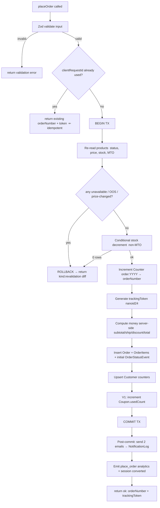
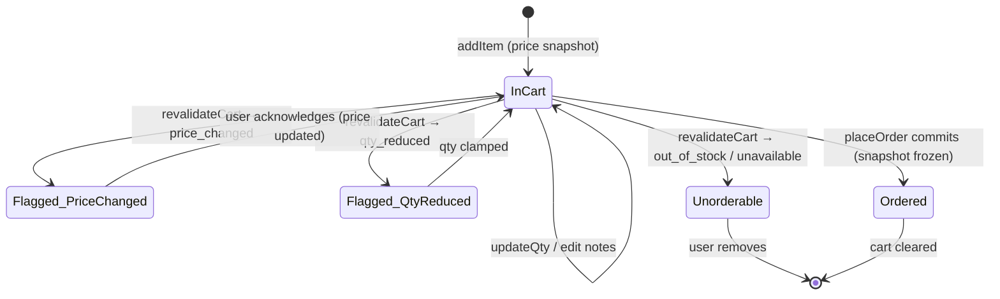

# 08 — Cart, Checkout & Order Placement

> **Project:** `vaani-gift-e-commerce` · **Brand:** GooglyWoogly Art · **Owner-perspective:** Product
> **Conforms to:** [`00-canonical-decisions.md`](./00-canonical-decisions.md) (CANON) — entity/field/enum/route/cache-tag names are verbatim. Depends on [`03-data-model`](./03-data-model-and-entities.md) (shapes), [`04-IA & routing`](./04-information-architecture-and-routing.md) (routes, no-cache contract, analytics mount points). Coordinates with `12-order-management` and `14-notifications` for the post-placement lifecycle (those docs are not yet written; this spec defines the **placement-side interface** and flags the hand-off under §11).
> **Authoritative for:** the client cart (localStorage schema, store API, cross-tab sync, re-validation), the cart page + mini-cart/drawer, the single-page guest checkout, the `placeOrder` server action contract, order-number/tracking-token generation, the confirmation page + WhatsApp handoff, and all cart/checkout/placement edge cases & idempotency.
> **Not authoritative for:** admin order management & status transitions (`12`), email/SMS/WhatsApp template bodies & delivery infra (`14`), PDP add-to-cart trigger UI (`07`), analytics payload schemas (`13`), product/inventory rules (`11`).

**Money is integer paise everywhere** (CANON §10; `03` FR-3). All `price`, `subtotal`, `shippingFee`, `grandTotal`, threshold values below are paise unless a `₹` display value is shown. `currency = "INR"`. Locale `en-IN`, timezone IST.

---

## 1. Purpose & Scope

### 1.1 What this covers
1. **Local cart** — a client-side, **guest-only** cart in `localStorage` (CANON §2, §4): the persisted schema (line items with `productId`, `qty`, **price snapshot**, `personalizationNote`, `giftMessage`), the store API (add / update / remove / clear), **cross-tab synchronization**, and **price/stock re-validation** on cart load and again at checkout.
2. **Cart UI** — the full `/cart` page **and** a mini-cart **drawer** opened from the header cart icon and on add-to-cart; per-item gift message & personalization editing; quantity stepper; remove/undo; order summary with shipping-fee + free-over-threshold preview.
3. **Checkout** — the **single-page** `/checkout` (NO on-site payment): contact (name, phone, email), shipping address (line1/line2, city, state dropdown, pincode, landmark), order note, optional per-the-cart gift message, order summary, shipping fee + free-over-threshold, **optional coupon (V1)**; Zod-validated forms.
4. **Order placement** — the `placeOrder` server action: server-side stock & price **re-validation** in a transaction → create `Order` + `OrderItem` snapshots → generate `orderNumber` (via `Counter`) + `trackingToken` → upsert `Customer` → emit transactional emails (customer + admin) → emit `place_order` analytics → return `{ orderNumber, trackingToken }`. **Idempotent** against double-submit.
5. **Success** — `/order/confirmed/[token]` confirmation page and the **WhatsApp handoff** (a `wa.me` deep link prefilled with `orderNumber` + line items + grandTotal) that moves the buyer to the founder for payment.

### 1.2 What this explicitly does NOT cover
- **No on-site payment / gateway / card capture** (CANON §1, §3). Checkout records *intent*; money moves on WhatsApp after the founder confirms. There is no `/pay` and no payment fields on the form.
- **No shopper login / account / server-persisted cart / wishlist** (CANON §2). The cart lives only in the browser; it is never written to the DB until `placeOrder`.
- **No product variants** (CANON §3) — a line item is `{ productId, qty }` + optional personalization/gift text; no option/SKU selection.
- **No multi-currency / international checkout** (CANON §11) — INR only; international demand is a **bulk inquiry** (`/bulk-orders`), not this flow.
- **Order lifecycle after `pending_confirmation`** (confirm, pay, ship, deliver, status emails) — owned by `12`/`14`. This doc stops at "order created + customer handed to WhatsApp + first email sent."
- **Coupons are V1, not MVP** — the schema, UI slot, and validation path are specified so V1 is a config flip, but MVP ships with the coupon field hidden/disabled.

---

## 2. Primary user stories / jobs-to-be-done

| # | As a… | I want… | so that… |
|---|---|---|---|
| JTBD-1 | Gift shopper | to add a product to my cart from the PDP/PLP and immediately see a confirmation drawer | I know it worked and can keep shopping or check out. |
| JTBD-2 | Shopper | my cart to survive reloads, tab switches, and coming back later | I don't lose my selections and re-do the work. |
| JTBD-3 | Shopper buying a gift | to add a **personalization** (e.g. name to engrave) and a **gift message** per item | the handmade piece is made/packed exactly as I want. |
| JTBD-4 | Shopper | to change quantities or remove items in the cart and see the total update live | I stay in control of what I'm ordering and the cost. |
| JTBD-5 | Shopper | to be warned if a price changed or an item went out of stock / was removed since I added it | I'm never surprised, and I confirm the real order. |
| JTBD-6 | Guest buyer | to check out by giving only my **contact + shipping address** (no login, no card) | I place an order in under a minute on my phone. |
| JTBD-7 | Buyer in India | a checkout that knows **pincode + state**, shows **₹**, and computes **free shipping over a threshold** | the form feels local and the cost is clear before I commit. |
| JTBD-8 | Buyer | a confirmation screen with my **order number** and a **one-tap WhatsApp** button to the seller | I can immediately arrange payment and ask questions. |
| JTBD-9 | Buyer (post-order) | a private **tracking link** on the confirmation screen | I can check status later without an account (handed to `/track/[token]`). |
| JTBD-10 | Founder | every placed order to create a clean `Order` + frozen line snapshots and email me instantly | I can confirm availability and collect payment on WhatsApp from my phone. |
| JTBD-11 | Founder | accidental double-clicks to **not** create duplicate orders | my order list and numbering stay clean. |

---

## 3. Detailed functional requirements

> Numbered, decisive. "MUST" = MVP unless a phase is noted. Cache tags / enums / fields use CANON names verbatim.

### 3.1 Local cart — storage & store

**FR-1 — Cart persistence is `localStorage`, client-only.** The cart MUST be stored under the single key **`gw_cart`** as a versioned JSON document (§5.1). It is read/written only in the browser; it is **never** sent to the server except as the `items[]` payload of `placeOrder`. No cookie, no DB row, no shopper session (CANON §2, §4).

**FR-2 — Cart store.** A lightweight client store (CANON §4: "zustand or context") MUST expose: `items`, `count` (Σ qty), `subtotal` (Σ lineTotal, paise), and actions `addItem`, `updateQty`, `setItemPersonalization`, `setItemGiftMessage`, `removeItem`, `clear`, `replaceAll` (used by re-validation), and `hydrate`. **Decision:** use **zustand** with its `persist` middleware (key `gw_cart`) — it gives cross-tab sync + SSR-safe hydration with the least code for a phone-first store. (`zustand` is **not yet installed**; add it — see §11.)

**FR-3 — Line-item identity & merge.** Because there are no variants, a line item is uniquely keyed by `productId`. Adding a `productId` already in the cart **increments** its `qty` (clamped per FR-7) rather than creating a duplicate line. Personalization/gift text is **per line** (one set of notes per product line — see Open Q-1).

**FR-4 — Price snapshot on add.** On `addItem`, the cart MUST store a **price snapshot** (`unitPrice`, paise) and minimal display fields (`slug`, `title`, `imageUrl`) copied from the product at add-time, so the cart renders instantly **without** a network round-trip and so price drift is detectable (FR-12). The snapshot is **advisory** — the authoritative price is always re-read server-side at `placeOrder` (FR-29).

**FR-5 — Personalization gating.** `setItemPersonalization` is only meaningful when the product has `allowsPersonalization = true`; the cart stores the product's `allowsPersonalization` flag and `personalizationLabel` in the snapshot so the cart/drawer can show the correct input + prompt copy without a fetch. For products where it is false, the personalization field is hidden.

**FR-6 — Gift message is universal.** `giftMessage` (per item) is available on every line regardless of `allowsPersonalization`. An **order-level** gift message is also supported at checkout (maps to `Order.giftMessage`); per-item maps to `OrderItem.giftMessage` (CANON `03` §3.7.2).

**FR-7 — Quantity rules.** `qty` is an integer ≥ 1. `updateQty` to 0 (or stepper "−" at 1) **removes** the line (with undo, FR-23). A per-line **max** is the lesser of `99` and, for non-made-to-order products, the last-known available stock; made-to-order products cap at `99` (always orderable, CANON §6). Exceeding max clamps and shows an inline notice.

**FR-8 — Character limits.** `personalizationNote` ≤ **100** chars; per-item `giftMessage` ≤ **250** chars; order-level `giftMessage` ≤ **300** chars; `customerNote` ≤ **500** chars. Enforced in the store (truncate-guard) and re-validated by Zod (§6).

**FR-9 — Cart cap.** Maximum **30 distinct line items** and **200 total units** per cart (DOS/abuse guard for a single-founder op). Adding beyond the cap is blocked with a toast.

### 3.2 Cross-tab sync & hydration

**FR-10 — Cross-tab sync.** Cart changes in one tab MUST reflect in other open tabs of the same origin within ~1s. With zustand `persist`, subscribe to the `storage` event and rehydrate the store when the `gw_cart` key changes (zustand's `persist` exposes `rehydrate()`; wire a `window.addEventListener("storage")` handler). The header cart badge and any open cart drawer update reactively.

**FR-11 — SSR-safe hydration / no flash.** `/cart` is **CSR** and the header lives in a server layout; the cart badge and cart contents MUST hydrate from `localStorage` on mount and render a **skeleton/zero-state until hydrated** to avoid a hydration mismatch (server has no `localStorage`). Use a `hasHydrated` flag; show the count only post-hydration.

### 3.3 Re-validation (price & stock)

**FR-12 — Re-validate on cart load.** When `/cart` or the cart drawer opens (and at most once per N seconds to avoid spamming), the client MUST call the **`revalidateCart`** server action (§6) with the current `items[]` (`productId`, `qty`, snapshot `unitPrice`). The server returns, per line, the **authoritative** `{ status, currentPrice, availableQty, title, imageUrl, slug }` where `status ∈ {ok, price_changed, low_stock, qty_reduced, out_of_stock, made_to_order, unavailable}`.

**FR-13 — Apply re-validation outcomes.** The client MUST reconcile (`replaceAll`):
- `price_changed` → update the line's `unitPrice` to `currentPrice`, flag the line, and surface a **"prices updated"** banner; the user must acknowledge before checkout (the banner persists until dismissed/changed).
- `qty_reduced` → clamp `qty` to `availableQty`, flag the line ("Only N left").
- `out_of_stock` (non-MTO, `availableQty ≤ 0`) → mark the line **unorderable**; it stays visible (struck-through) but is **excluded** from totals and from the `placeOrder` payload; show "Out of stock — remove to continue".
- `unavailable` (product `status != active`, archived, or deleted) → same treatment as out-of-stock with copy "No longer available".
- `made_to_order` → annotate with lead-time badge ("Made to order — ships in {productionLeadTimeDays} days"); fully orderable.
- `ok` / `low_stock` → no blocking; `low_stock` shows a soft "Only a few left" hint.

**FR-14 — Re-validate again at checkout submit.** Independent of FR-12, `placeOrder` re-reads every product **inside the placement transaction** (FR-29) and is the single source of truth. If the transactional re-validation finds a blocking change (price/stock/availability) **after** the user has acknowledged, `placeOrder` returns a typed `revalidation` result (no order created) and the checkout UI shows the diff and asks the user to re-confirm. This double layer (load + transactional) is mandatory (CANON §4).

**FR-15 — Empty-after-revalidation guard.** If re-validation removes the last orderable item, the cart shows the empty state and checkout is blocked.

### 3.4 Checkout

**FR-16 — Single page, no payment.** `/checkout` is **one page** (CANON §8: "SSR shell + action") with all fields visible (no multi-step wizard): **Contact**, **Shipping address**, **Order note + gift message**, **Coupon (V1)**, and a sticky **Order summary** with the **Place order** CTA. There is **no** payment section, no card iframe, no "pay now."

**FR-17 — Contact fields.** `customerName` (NN), `customerPhone` (NN, Indian mobile), `customerEmail` (NN). Phone is the primary WhatsApp contact and CRM key; email is the transactional channel (CANON §1). All three required (CANON `03`: all NN on `Order`).

**FR-18 — Shipping address fields.** `fullName` (defaults from contact name, editable), `phone` (defaults from contact phone), `line1` (NN), `line2?`, `landmark?`, `city` (NN), `state` (NN, **dropdown of Indian States/UTs**), `pincode` (NN, **6-digit**), `country` fixed `"IN"`. Maps to `Order.shippingAddress` JSON (the `Address` shape, `03` §3.5). **Billing = shipping** in MVP (no separate billing UI; `Order.billingAddress` left null ⇒ "same as shipping"). Pincode **serviceability check is V1** (CANON §11) — MVP only validates the 6-digit format.

**FR-19 — Order note & gift message.** Optional `customerNote` (order-level, ≤500) and optional order-level `giftMessage` (≤300). Per-item gift messages set in the cart carry through; the checkout shows a read-only summary of any per-item notes with an "edit in cart" affordance.

**FR-20 — Coupon (V1).** A single coupon code input + **Apply** validates via `applyCoupon` (§6) against the `Coupon` table (active, within `startsAt/endsAt`, `usageLimit`, `minOrderValue`, `appliesTo`). On success the summary shows `discountTotal` and the code; on failure an inline error. **MVP:** the coupon row is **hidden** (feature-flag `COUPONS_ENABLED=false`); no discount path runs and `discountTotal=0`.

**FR-21 — Order summary & shipping computation.** The summary MUST show, in paise→₹: per-line (title, qty, unitPrice, lineTotal), `subtotal`, **`shippingFee`**, `discountTotal` (V1, if any), `taxTotal` (V1/GST, 0 in MVP), and **`grandTotal`**. **Shipping rule (MVP):** flat fee `SiteSetting.shippingDefaults.flatRatePaise`; if `subtotal ≥ SiteSetting.freeShippingThreshold` (a.k.a. `freeShippingThresholdPaise`) then `shippingFee = 0` and show a "Free shipping unlocked 🎉" line. The threshold/flat-rate are **read server-side** and passed to the checkout shell so the client preview matches the authoritative computation; `placeOrder` recomputes them server-side (never trusts client totals — FR-30).

**FR-22 — Empty-cart checkout guard.** A direct hit to `/checkout` with an empty (or fully-unorderable) cart MUST redirect to `/cart` with a notice (CANON `04` §9). Because the cart is client-side, the SSR shell renders, then the client guard redirects on mount if the cart is empty.

### 3.5 Cart UI behaviors

**FR-23 — Remove + undo.** Removing a line shows a 5-second **undo** (sonner toast) that restores the exact line (qty + notes) if tapped.

**FR-24 — Mini-cart drawer.** The header cart icon opens a right-side **drawer** (`components/ui/sheet.tsx` on desktop / `drawer.tsx` on mobile) listing lines (thumb, title, qty stepper, lineTotal, remove), the running `subtotal` + shipping hint, a free-shipping progress bar ("Add ₹X for free shipping"), and **View cart** / **Checkout** CTAs. The drawer auto-opens on add-to-cart (configurable; default open) and is dismissible.

**FR-25 — Free-shipping progress.** Both the drawer and cart page show a progress indicator toward `freeShippingThreshold` with the remaining amount; at/over threshold it reads "You've unlocked free shipping."

### 3.6 Order placement

**FR-26 — `placeOrder` is the only write path** for orders from the storefront (CANON `03` §6). It is a **Server Action** invoked from `/checkout`. Input is Zod-validated (§6.4). It performs the full transaction in §3.7 / §6.5 and returns `{ orderNumber, trackingToken }` (or a typed error/`revalidation` result).

**FR-27 — `orderNumber` generation.** Format `GW-{YYYY}-{NNNNN}` (CANON §10) where `YYYY` is the **IST** year and `NNNNN` is a zero-padded (min width 5) **per-year** sequence from the `Counter` row keyed `order:{YYYY}` (`03` §3.8, FR-33), incremented **inside** the placement transaction for gap-free, race-safe numbering. Example: `GW-2026-00042`.

**FR-28 — `trackingToken` generation.** An unguessable **24-char URL-safe nanoid** (CANON §10; `03` §3.7.2). It is the **only** key to `/order/confirmed/[token]` and `/track/[token]`; never sequential, never indexed. Collision is astronomically unlikely; the unique constraint + one retry guards it.

**FR-29 — Transactional stock re-validation & decrement.** Inside the DB transaction, for each line `placeOrder` MUST: re-read the product (`status`, `price`, `inventoryQuantity`, `madeToOrder`, `productionLeadTimeDays`, snapshot fields); reject if `status != active` (→ `unavailable`); for **non-MTO** products, conditionally decrement with a guard — `UPDATE products SET inventory_quantity = inventory_quantity - {qty} WHERE id = {id} AND inventory_quantity >= {qty}` — and if 0 rows affected → `out_of_stock` (CANON `03` §7, FR-29). **Made-to-order products are NOT decremented** (always orderable). Price used for the `OrderItem` snapshot is the **server's current `price`**, not the client snapshot.

**FR-30 — Server recomputes all money.** `subtotal = Σ(server unitPrice × qty)`, `shippingFee` from `SiteSetting` (free-over-threshold), `discountTotal` from the validated coupon (V1, else 0), `taxTotal` (GST, V1/0), `grandTotal = subtotal + shippingFee + taxTotal − discountTotal`. **Client-supplied totals are ignored.** All paise.

**FR-31 — Snapshots are frozen.** Each `OrderItem` copies `productTitle, sku, imageUrl, unitPrice` (server values), `quantity`, `lineTotal = unitPrice × quantity`, `personalizationNote`, `giftMessage` (CANON `03` FR-11). `productId` is kept as a soft ref (`SetNull` on later product delete).

**FR-32 — Customer upsert.** Upsert `Customer` by normalized `phone` (identity key; CANON `03` §3.7.2), updating `name`, `email`, and incrementing `ordersCount` + `totalRequested (+= grandTotal)`, setting `firstOrderAt` (if null) and `lastOrderAt = now()`. Linked via `Order.customerId`. Idempotent — never duplicates a customer.

**FR-33 — Initial order state.** New `Order.status = pending_confirmation`, `paymentStatus = unpaid`, `source = web_checkout`, `currency = "INR"`, `confirmedAt = null` (CANON §7). An initial `OrderStatusEvent { status: pending_confirmation, changedByAdminId: null, customerNotified: true, channelNotified: email }` is written in the same transaction (the customer is notified by the placement email).

**FR-34 — Emails on placement.** After the transaction commits, `placeOrder` MUST emit **two** emails (CANON §1: "Email carries automated transactional updates"): (a) **customer order-received** email (order number, items, totals, the `/track/[token]` link, and a WhatsApp CTA explaining payment happens on WhatsApp) and (b) **admin new-order** notification to `SiteSetting.contactEmail`. Each send writes a `NotificationLog` row (`channel: email`, `template`, `to`, `status`). Email **sending is owned by `14`**; this spec defines the **trigger, recipients, template keys (`order_received_customer`, `order_received_admin`), and required variables** (§9.1). Email failure MUST NOT roll back the order (fire-and-log; see FR-37).

**FR-35 — Analytics on placement.** Emit a `place_order` `AnalyticsEvent` with `value = grandTotal` and `metadata { orderNumber (hashed/last-segment only), itemCount, units }`, and mark the owning `AnalyticsSession.isConverted = true` + `orderId` (CANON §12; `03` §5). `begin_checkout` is emitted on `/checkout` mount; `order_confirmed` on the confirmation page mount; `whatsapp_click` when the WhatsApp CTA is tapped (§9).

**FR-36 — Return + clear.** On success the action returns `{ orderNumber, trackingToken }`; the client **clears the cart** (`clear()`), then navigates to `/order/confirmed/{trackingToken}`. (Clearing happens after a successful return, never before — so a failure preserves the cart.)

### 3.7 Idempotency & resilience

**FR-37 — Side-effects never roll back the order.** The DB write (Order + items + events + counter + customer) is one atomic transaction. **Emails and analytics run AFTER commit** and are best-effort: a failure is caught, logged (`NotificationLog.status = failed`, Sentry), and surfaced to the founder via the admin order detail (a "resend email" affordance lives in `12`), but the order **stands** and the customer still reaches confirmation + WhatsApp.

**FR-38 — Double-submit idempotency.** The **Place order** button MUST disable on first click and show a pending state. Additionally, the client generates a **client request id** (`crypto.randomUUID()`, stored in component state for the attempt) and sends it as `clientRequestId`; `placeOrder` writes it to a short-lived idempotency guard so a retried/duplicated submission within a window returns the **same** `{ orderNumber, trackingToken }` instead of creating a second order. **Decision:** persist `clientRequestId` as a unique column on `Order` (added field, see §11 / Open Q-2) and resolve duplicates by `findUnique` before insert; this is the most robust guard for a serverless action with no shared memory.

**FR-39 — Network-failure recovery.** If the action throws/times out (unknown outcome), the UI shows "We couldn't confirm your order — retry" and re-enables submit; retry reuses the **same** `clientRequestId` so a silently-succeeded first attempt does not double-book (FR-38).

**FR-40 — Confirmation page is token-gated & no-store.** `/order/confirmed/[token]` is SSR `force-dynamic`, `no-store`, `noindex,nofollow` (CANON `04` FR-7). It looks up the `Order` by `trackingToken` only; an invalid/unknown token renders a generic "We couldn't find that order" (no existence leak), not a 404 that confirms a token was tried.

---

## 4. UX / UI breakdown

### 4.1 Mini-cart drawer (header + on add)

**Trigger:** header cart icon (badge = `count`, hidden until hydrated, FR-11); auto-opens on add-to-cart (owned trigger in `07`, drawer owned here).
**Container:** right `Sheet` (desktop) / bottom-rising `Drawer` (mobile, ≤640px) — both vendored.

```
┌───────────────────────────────┐
│  Your cart (3)            ✕    │
├───────────────────────────────┤
│  ▓ thumb  Hand-painted Mug     │
│           ₹799   [− 2 +]   🗑   │
│           "Engrave: Aanya"  ✎  │   ← personalization (if allowed)
│           🎁 "Happy bday!"  ✎  │   ← per-item gift message
│  ───────────────────────────   │
│  ▓ thumb  Brass Diya Set       │
│           Made to order · 7d   │   ← MTO badge
│           ₹1,299  [− 1 +]  🗑   │
├───────────────────────────────┤
│  Add ₹401 for FREE shipping    │   ← progress bar toward threshold
│  ▓▓▓▓▓▓▓░░░                     │
├───────────────────────────────┤
│  Subtotal            ₹2,897    │
│  [ View cart ]  [ Checkout → ] │
└───────────────────────────────┘
```

- **Line:** thumb (`imageUrl`, fixed aspect to avoid CLS), title (links to PDP), unitPrice, qty stepper (`−`/`+`, FR-7), lineTotal, remove (🗑 → undo toast).
- **Personalization/gift:** inline editable when present (pencil opens a small inline textarea with char counter); collapsed preview otherwise.
- **Re-validation flags:** price-changed/qty-reduced/out-of-stock badges render inline (§3.3) with the global banner at the top of the drawer.
- **Empty state:** illustration + "Your cart is empty" + "Browse gifts" → `/products`.
- **Footer:** free-shipping progress (FR-25), `subtotal`, **View cart** (→ `/cart`) + **Checkout** (→ `/checkout`).
- **A11y:** focus trap, `Esc` closes, `aria-live="polite"` on totals; stepper buttons ≥44px.

### 4.2 Cart page `/cart`

Two-column on desktop (lines left, sticky summary right); single stacked column on mobile with summary pinned to a sticky bottom bar.

| Region | Content |
|---|---|
| **Header** | "Your Cart" + item count; "Continue shopping" → `/products`. |
| **Re-validation banner** (conditional) | "Some prices or availability changed — please review." Dismiss requires acknowledgment before checkout (FR-13). |
| **Line list** | Per line: large thumb, title (→PDP), unitPrice, qty stepper, lineTotal, remove+undo, personalization input (if `allowsPersonalization`, with `personalizationLabel` as prompt + counter), gift-message input (counter), inline availability/price flags + MTO lead-time badge. |
| **Order summary** (sticky card) | `subtotal`; **free-shipping progress** + computed `shippingFee` (or "FREE"); coupon entry **(V1, hidden in MVP)**; estimated `grandTotal`; trust line "No payment now — pay on WhatsApp after we confirm"; **Proceed to checkout** CTA. |
| **Reassurance strip** | Handmade • Made-to-order lead times • Pan-India shipping • WhatsApp support (mirrors CANON §11). Links to shipping & returns policies. |
| **Empty state** | `components/ui/empty.tsx`: "Your cart is empty," CTA to `/products` + featured categories/occasions. |

**Mobile:** sticky bottom bar shows `grandTotal` + "Checkout"; tapping summary expands the breakdown.
**Copy direction:** warm, handmade, reassuring; never pushy. Always state "no payment now" so the no-checkout-payment model is never a surprise.

### 4.3 Checkout page `/checkout`

Single page, two-column on desktop (form left ~60%, sticky order summary right ~40%); single column on mobile with summary collapsible at top and CTA pinned bottom.

```
┌──────────────────────────────┐  ┌───────────────────────┐
│  Contact                     │  │  Order summary         │
│  [ Full name            ]    │  │  ▓ Mug ×2      ₹1,598  │
│  [ Phone (WhatsApp)     ]    │  │  ▓ Diya ×1     ₹1,299  │
│  [ Email                ]    │  │  ─────────────────────  │
│                              │  │  Subtotal      ₹2,897  │
│  Shipping address            │  │  Shipping        FREE  │
│  [ Address line 1       ]    │  │  Discount (V1)    —    │
│  [ Address line 2 (opt) ]    │  │  ─────────────────────  │
│  [ Landmark (optional)  ]    │  │  Total         ₹2,897  │
│  [ City ] [ State ▾ ]        │  │                        │
│  [ Pincode (6-digit)    ]    │  │  ⓘ No payment now.     │
│                              │  │  We confirm stock &    │
│  Order note (optional)       │  │  share payment on      │
│  [ ......................]   │  │  WhatsApp.             │
│  Gift message (optional)     │  │                        │
│  [ ......................]   │  │  [  Place order  →  ]  │
│  Coupon (V1) [____][Apply]   │  │  (disabled until valid)│
└──────────────────────────────┘  └───────────────────────┘
```

- **Form:** `react-hook-form` + `zodResolver` (§6); inline field errors; `components/ui/form.tsx`, `input.tsx`, `select.tsx` (state dropdown), `textarea.tsx`.
- **Phone:** `inputMode="tel"`, India default; helper "We'll message you on WhatsApp here."
- **State:** searchable `Select` of all Indian states + UTs (canonical list constant).
- **Pincode:** `inputMode="numeric"`, 6-digit pattern; (V1) async serviceability check with a non-blocking notice.
- **Order summary:** mirrors cart totals, recomputed from the **revalidated** cart; shows free-shipping unlock; persistent **"No payment now — pay on WhatsApp"** reassurance directly above the CTA.
- **CTA:** "Place order" — disabled until the form is valid and the cart has ≥1 orderable item; shows spinner + "Placing your order…" while pending; disabled during submit (FR-38).
- **Trust footer:** secure/handmade badges + links to Shipping, Cancellation & Refund, Privacy.
- **Responsive:** on mobile the summary is a collapsible accordion at the top + a sticky "Place order (₹Total)" button at the bottom.
- **A11y:** labelled inputs, `aria-describedby` errors, `aria-live` on summary totals, logical tab order, 44px targets.

### 4.4 Confirmation page `/order/confirmed/[token]`

```
        ✅  Order placed!
   Order GW-2026-00042

  Thank you, Aanya. We've received your order.
  ── What happens next ──────────────────────
  1. We confirm availability on WhatsApp.
  2. You pay securely via WhatsApp.
  3. We craft & ship; track anytime below.

  [  💬  Continue on WhatsApp  ]   ← primary, prefilled deep link
  [  🔗  Track your order      ]   ← → /track/[token]

  ── Your order ─────────────────────────────
  ▓ Hand-painted Mug ×2 — "Engrave: Aanya"   ₹1,598
  ▓ Brass Diya Set ×1 (made to order, 7d)    ₹1,299
  Subtotal ₹2,897 · Shipping FREE · Total ₹2,897
  Ship to: <address summary>

  ✦ Save this page link to track your order. ✦
  [ Continue shopping → /products ]
```

- **Primary CTA = WhatsApp** (`wa.me` deep link, §4.5) — the single most important action (payment happens there).
- **Secondary = Track** (`/track/[token]`) and the tracking link is also printed as text (so it can be saved/shared even though we send no SMS in MVP).
- **Order recap:** items (with personalization/MTO badges), totals, ship-to summary, `pending_confirmation` status pill ("Awaiting confirmation").
- **No PII leak on bad token:** invalid token → friendly "We couldn't find that order" + WhatsApp/contact links (FR-40).
- **Email reminder:** "A confirmation has been emailed to {maskedEmail}."

### 4.5 WhatsApp handoff message

Built client-side from the order on the confirmation page (and re-buildable in admin per `12`). Deep link: `https://wa.me/{SiteSetting.whatsappNumber}?text={encodeURIComponent(body)}`.

**Prefilled body template (en-IN):**
```
Hi GooglyWoogly Art! 👋 I just placed an order.

Order: GW-2026-00042
Items:
• Hand-painted Mug × 2 — ₹1,598  (Engrave: Aanya)
• Brass Diya Set × 1 — ₹1,299  (made to order)
Total: ₹2,897

Name: Aanya Sharma
Please confirm availability & share payment details. Thank you!
```
- Built from `orderNumber`, each `OrderItem` (title × qty — lineTotal, + personalization note in parens), `grandTotal`, `customerName`.
- URL-encoded; kept short (omit full address — the order has it; founder looks it up). Tapping fires `whatsapp_click` (§9).

---

## 5. Data & entities used

> CANON `03` names verbatim. **R** = read, **W** = written.

### 5.1 localStorage cart schema (`gw_cart`) — client-only, NOT a DB entity

```ts
// localStorage key: "gw_cart"
type CartStorage = {
  v: 1;                       // schema version (migrate on bump)
  updatedAt: string;          // ISO; for cross-tab last-write-wins debug
  items: CartLine[];
};

type CartLine = {
  productId: string;          // cuid — line identity (no variants)
  slug: string;               // for PDP link + WA message (display only)
  title: string;              // snapshot for instant render (display only)
  imageUrl: string | null;    // snapshot thumb
  unitPrice: number;          // PAISE — price snapshot at add (advisory; FR-4)
  qty: number;                // integer >=1, <= max (FR-7)
  allowsPersonalization: boolean; // gates personalization input (FR-5)
  personalizationLabel: string | null; // prompt copy snapshot
  personalizationNote?: string;   // <=100 chars (FR-8) → OrderItem.personalizationNote
  giftMessage?: string;           // <=250 chars → OrderItem.giftMessage
  // re-validation overlay (NOT persisted across loads; computed each open):
  // status, currentPrice, availableQty live in store memory, not localStorage
};
```
> Persisted fields are minimal & non-authoritative. Never persist totals (recomputed). Never store PII in the cart.

### 5.2 Entities

| Entity | R/W | Where / fields |
|---|---|---|
| `Product` | **R** | `revalidateCart` & `placeOrder`: `id, slug, title, status, price, inventoryQuantity, madeToOrder, productionLeadTimeDays, lowStockThreshold, sku, primaryImage.url, allowsPersonalization, personalizationLabel`. (Storefront-safe select — **never** `costPrice`, `03` Open Q-5.) |
| `Order` | **W** | created by `placeOrder`: `orderNumber, trackingToken, status, paymentStatus, customerId, customerName, customerPhone, customerEmail, shippingAddress, billingAddress(null), subtotal, shippingFee, discountTotal, taxTotal, grandTotal, currency, couponCode?, customerNote?, giftMessage?, source, clientRequestId(added)`. **R** on confirmation page (by `trackingToken`). |
| `OrderItem` | **W** | per line snapshot: `orderId, productId, productTitle, sku, imageUrl, unitPrice, quantity, lineTotal, personalizationNote?, giftMessage?`. |
| `OrderStatusEvent` | **W** | initial `{ status: pending_confirmation, customerNotified: true, channelNotified: email }`. |
| `Customer` | **W (upsert)** | by `phone`: `name, email, ordersCount(+1), totalRequested(+=grandTotal), firstOrderAt, lastOrderAt`. |
| `Counter` | **W** | `order:{YYYY}` increment for `orderNumber` (`03` §3.8). |
| `SiteSetting` | **R** | `freeShippingThreshold` / `shippingDefaults.{flatRatePaise,freeShippingThresholdPaise}`, `whatsappNumber`, `contactEmail`, `currency`, `gstin` (GST = V1). |
| `Coupon` (V1) | **R/W** | `applyCoupon` reads (`code, type, value, minOrderValue, maxDiscount, usageLimit, usedCount, startsAt, endsAt, isActive, appliesTo`); `placeOrder` increments `usedCount` if applied. |
| `NotificationLog` | **W** | one row per email send (`order_received_customer`, `order_received_admin`). |
| `AnalyticsEvent` / `AnalyticsSession` | **W** | `place_order` event + session conversion (also `add_to_cart`/`update_cart`/`remove_from_cart`/`begin_checkout`/`order_confirmed`/`whatsapp_click`). |

**Cache tags:** none of the above mutate storefront ISR caches — `placeOrder` revalidates **no** tags (CANON `04` §7: cart/checkout/order/track are never-cached). Inventory decremented at placement *does* affect PLP/PDP availability, but **storefront tags are NOT busted by `placeOrder`** by CANON's matrix (order placement is out-of-band of the catalog-edit revalidation path); the storefront's `revalidate` safety-net (3600s) plus the next admin catalog mutation reconcile display stock. **This is a deliberate CANON-aligned trade-off — see Open Q-3.**

---

## 6. Server actions / API routes

> All inputs Zod-validated; all in `app/.../actions.ts` Server Actions (no public REST needed for cart). Money in paise. None revalidate storefront cache tags (§5).

### 6.1 `revalidateCart` (server action)
- **Input:** `{ items: Array<{ productId: string; qty: number; unitPrice: number }> }` (Zod; qty 1–200, unitPrice ≥0).
- **Reads:** `Product` (storefront-safe select) for the given ids.
- **Output:** `{ lines: Array<{ productId; status: "ok"|"price_changed"|"low_stock"|"qty_reduced"|"out_of_stock"|"made_to_order"|"unavailable"; currentPrice; availableQty; title; imageUrl; slug; madeToOrder; productionLeadTimeDays }>; shipping: { flatRatePaise; freeShippingThresholdPaise } }`.
- **Side effects:** none (read-only). **Revalidates:** nothing.

### 6.2 `applyCoupon` (server action, **V1**)
- **Input:** `{ code: string; subtotal: number }`.
- **Reads:** `Coupon` by upper(`code`).
- **Output:** `{ valid: boolean; discountTotal?: number; reason?: "expired"|"min_not_met"|"usage_exceeded"|"not_found"|"not_applicable"; code?: string }`.
- **Side effects:** none (reservation happens at `placeOrder`). MVP: stubbed/disabled behind `COUPONS_ENABLED`.

### 6.3 `placeOrder` (server action) — the core
- **Input (Zod, §6.4):** `{ items, contact, shippingAddress, customerNote?, giftMessage?, couponCode?, clientRequestId }`.
- **Output (discriminated union):**
  - `{ ok: true; orderNumber: string; trackingToken: string }`
  - `{ ok: false; kind: "revalidation"; lines: RevalidatedLine[] }` (blocking price/stock/availability change — re-confirm)
  - `{ ok: false; kind: "empty" }` (no orderable items)
  - `{ ok: false; kind: "validation"; fieldErrors }` (bad input)
  - `{ ok: false; kind: "coupon"; reason }` (V1)
  - `{ ok: false; kind: "server" }` (unexpected; retry-safe via `clientRequestId`)
- **Writes:** `Order`, `OrderItem[]`, `OrderStatusEvent`, `Customer` (upsert), `Counter`, `NotificationLog` (post-commit), `Coupon.usedCount` (V1). `AnalyticsEvent`/`AnalyticsSession`.
- **Side effects:** sends 2 emails (via `14`'s mailer), emits `place_order` analytics. **Revalidates:** nothing (CANON `04` §7).

### 6.4 Zod schemas (illustrative)

```ts
import { z } from "zod";

export const IN_STATES = [/* 28 states + 8 UTs, canonical constant */] as const;

const phoneIN = z.string()
  .transform(s => s.replace(/[\s-]/g, ""))
  .pipe(z.string().regex(/^(?:\+91|91|0)?[6-9]\d{9}$/, "Enter a valid Indian mobile number"));

const pincode = z.string().regex(/^[1-9]\d{5}$/, "Enter a valid 6-digit pincode");

export const cartLineSchema = z.object({
  productId: z.string().min(1),
  qty: z.number().int().min(1).max(99),
  unitPrice: z.number().int().min(0),                 // paise snapshot (advisory)
  personalizationNote: z.string().max(100).optional(),
  giftMessage: z.string().max(250).optional(),
});

export const contactSchema = z.object({
  name: z.string().trim().min(2, "Please enter your name").max(80),
  phone: phoneIN,
  email: z.string().trim().toLowerCase().email("Enter a valid email").max(120),
});

export const addressSchema = z.object({
  fullName: z.string().trim().min(2).max(80),
  phone: phoneIN,
  line1: z.string().trim().min(4, "Address is required").max(120),
  line2: z.string().trim().max(120).optional(),
  landmark: z.string().trim().max(80).optional(),
  city: z.string().trim().min(2).max(60),
  state: z.enum(IN_STATES),
  pincode,
  country: z.literal("IN").default("IN"),
});

export const placeOrderSchema = z.object({
  items: z.array(cartLineSchema).min(1, "Your cart is empty").max(30),
  contact: contactSchema,
  shippingAddress: addressSchema,
  customerNote: z.string().trim().max(500).optional(),
  giftMessage: z.string().trim().max(300).optional(),  // order-level
  couponCode: z.string().trim().max(40).optional(),    // V1
  clientRequestId: z.string().uuid(),                  // idempotency (FR-38)
});
```

### 6.5 `placeOrder` execution (server)



---

## 7. States & edge cases

| Scenario | Surface | Behavior |
|---|---|---|
| **Empty cart** | `/cart`, drawer | Empty state + CTA to `/products`; checkout entry hidden/disabled. |
| **Cart not yet hydrated** | header, `/cart` | Skeleton; badge hidden until `hasHydrated` (FR-11) — no hydration mismatch. |
| **Item price changed since add** | cart/drawer/checkout | Banner + per-line flag; line price updated to server value; user acknowledges before checkout; `placeOrder` uses server price (FR-12/13/14/29). |
| **Item stock reduced below qty** | cart/checkout | Clamp qty to available; "Only N left" flag. |
| **Item out of stock (non-MTO)** | cart/checkout | Line struck-through, excluded from totals + payload; "Remove to continue"; blocks checkout if it's the only line. |
| **Item archived/deleted** | cart/checkout | "No longer available," same as OOS; auto-pruned from `placeOrder` payload (with notice). |
| **Made-to-order item** | everywhere | Always orderable; lead-time badge; **not** stock-decremented. |
| **Quantity exceeds max** | stepper | Clamp + inline notice (FR-7). |
| **Cart cap exceeded** | add | Toast "Cart is full (max 30 items)"; add blocked (FR-9). |
| **Direct `/checkout` with empty cart** | `/checkout` | Client guard → redirect `/cart` with notice (FR-22). |
| **Validation failure** | `/checkout` | Inline field errors (RHF+Zod); CTA stays disabled; focus first error. |
| **Stock lost at submit (race)** | submit | `placeOrder` returns `kind:revalidation`; show diff; re-enable submit; user re-confirms (FR-14/29). |
| **Double-click / double-submit** | submit | Button disabled + `clientRequestId` guard → single order; retried call returns the same order (FR-38). |
| **Network failure / timeout** | submit | "Couldn't confirm — retry"; same `clientRequestId` reused; no double order (FR-39). |
| **Email send fails** | post-commit | Order stands; `NotificationLog.status=failed`; Sentry; founder can resend from `12`; customer still has confirmation + WhatsApp (FR-37). |
| **Analytics beacon fails** | post-commit | Swallowed; order unaffected. |
| **`orderNumber` race** | TX | `Counter` increment inside TX → gap-free unique (FR-27). |
| **`trackingToken` collision** | insert | Unique constraint + one regenerate-retry (FR-28). |
| **Invalid/unknown token** | `/order/confirmed/[token]` | Generic "couldn't find that order," no existence leak, WhatsApp/contact links (FR-40). |
| **Coupon invalid/expired** (V1) | `/checkout` | Inline reason; total unchanged. |
| **Coupon over-redeemed at submit** (V1) | submit | Re-checked in TX; if exceeded, drop discount + notify, or block per policy. |
| **localStorage unavailable / quota** | all | Graceful: in-memory cart for the session; warn "cart won't persist"; never crash. |
| **Cart schema version bump** | hydrate | Migrate `v:1`→new on load; on unknown/corrupt JSON, reset cart safely. |
| **GST enabled later** (V1) | summary | `taxTotal` computed from `SiteSetting.gstin`; historical orders keep their snapshot `taxTotal`. |

**Cart line lifecycle (state machine):**


---

## 8. SEO / performance / accessibility

- **SEO:** `/cart`, `/checkout`, `/order/confirmed/[token]` are all **`noindex,nofollow`** and excluded from sitemap/robots (CANON `04` §8.3/§10). Nothing here is indexable; no canonical emitted for them. No SEO work beyond correct robots headers.
- **Performance:** cart is **CSR** but lightweight — renders from `localStorage` snapshots with **no network call to display** (FR-4); `revalidateCart` runs once on open (debounced) and streams flags in. Confirmation page is `no-store` SSR but minimal payload. Thumbs use fixed aspect ratios (intrinsic `width/height`) to keep **CLS≈0**. Defer the WhatsApp link build + analytics to idle. Keep the checkout client bundle small (RHF + Zod only; no heavy date/phone libs in MVP).
- **Accessibility (WCAG AA, CANON §4):** every field labelled; errors via `aria-describedby` + `role="alert"`; summary totals in an `aria-live="polite"` region so screen readers hear updates; qty steppers and CTAs ≥44px touch targets (phone-first); drawer/sheet are Radix (focus trap, `Esc`, restore focus); visible focus rings; verify brand-pink CTA meets AA contrast; "Place order" announces pending state. Confirmation page leads with an `<h1>` status and a clear next-step list.

---

## 9. Analytics events emitted (CANON `AnalyticsEventType`)

> Names verbatim from CANON §6. Payload schemas owned by `13`; this lists triggers & key metadata. The funnel `add_to_cart → begin_checkout → place_order` is the conversion spine (CANON §12).

| Event | Trigger | Key metadata |
|---|---|---|
| `add_to_cart` | `addItem` (drawer auto-opens) | `productId`, `qty`, `value`(lineTotal paise) |
| `update_cart` | `updateQty` / edit personalization or gift | `productId`, `qty` |
| `remove_from_cart` | `removeItem` | `productId` |
| `begin_checkout` | `/checkout` mount with ≥1 orderable item | `itemCount`, `units`, `value`(subtotal) |
| `place_order` | `placeOrder` commit succeeds | `value`(grandTotal), `metadata{ itemCount, units, hasGift, isMadeToOrderMix }` (no PII; `orderNumber` not stored raw) |
| `order_confirmed` | `/order/confirmed/[token]` mount | `value`(grandTotal) |
| `whatsapp_click` | WhatsApp CTA tapped (confirmation page) | `metadata{ context: "order_confirm" }` |

### 9.1 Email hand-off contract (to `14`)
`placeOrder` triggers these (sending/templating owned by `14`):

| Template key | To | Required variables |
|---|---|---|
| `order_received_customer` | `customerEmail` | `customerName, orderNumber, items[{title,qty,unitPrice,lineTotal,personalizationNote?}], subtotal, shippingFee, discountTotal, taxTotal, grandTotal, trackingUrl(/track/[token]), whatsappUrl, shippingAddress` |
| `order_received_admin` | `SiteSetting.contactEmail` | `orderNumber, customerName, customerPhone, customerEmail, items[…], grandTotal, shippingAddress, customerNote?, giftMessage?, adminOrderUrl(/admin/orders/[id])` |

---

## 10. Acceptance criteria

**Cart (local + sync + re-validation)**
- [ ] Adding a product stores a line in `localStorage` key `gw_cart` with `productId, qty, unitPrice(paise snapshot), slug, title, imageUrl`; re-adding the same `productId` increments qty (no dup line).
- [ ] Cart survives reload and **syncs across tabs within ~1s** (storage event → rehydrate); badge + drawer update reactively.
- [ ] Per-item **personalization** (when `allowsPersonalization`) and **gift message** persist and round-trip to `OrderItem.personalizationNote` / `OrderItem.giftMessage`.
- [ ] On cart/drawer open, `revalidateCart` runs and correctly flags `price_changed`, `qty_reduced`, `out_of_stock`, `unavailable`, `made_to_order`; totals recompute; unorderable lines are excluded.
- [ ] Char limits (100/250/300/500) and qty/cart caps (99/30/200) are enforced client-side and by Zod.
- [ ] Header badge hidden until hydrated (no hydration mismatch warning).

**Checkout (single page, no payment)**
- [ ] `/checkout` shows contact + shipping (line1/line2/landmark/city/**state dropdown**/**6-digit pincode**) + order note + order-level gift message + **(V1) coupon** + order summary; **no payment field exists**.
- [ ] Indian phone + 6-digit pincode + state-enum validation enforced; first error focused.
- [ ] Shipping fee = flat rate, **₹0 when subtotal ≥ freeShippingThreshold**; free-shipping progress shown; totals match server computation.
- [ ] Empty/unorderable cart at `/checkout` redirects to `/cart`.
- [ ] "No payment now — pay on WhatsApp" reassurance is visible above the CTA.

**Placement (`placeOrder`)**
- [ ] Creates `Order` (`status=pending_confirmation`, `paymentStatus=unpaid`, `source=web_checkout`, `currency=INR`) + frozen `OrderItem` snapshots + initial `OrderStatusEvent` in one transaction.
- [ ] `orderNumber` = `GW-{IST-YYYY}-{>=5-digit seq}` from `Counter`, gap-free & unique under concurrency; `trackingToken` is a 24-char nanoid, unique.
- [ ] Server **re-validates stock/price in the TX**, conditionally **decrements non-MTO inventory** (guarded), **does not** decrement MTO; on blocking change returns `kind:revalidation` and creates **no** order.
- [ ] All money recomputed server-side (client totals ignored); `grandTotal = subtotal + shippingFee + taxTotal − discountTotal`.
- [ ] `Customer` upserted by phone (counters incremented, no duplicate).
- [ ] Two emails triggered (`order_received_customer`, `order_received_admin`) with a `NotificationLog` row each; email failure does **not** roll back the order.
- [ ] `place_order` analytics emitted with `value=grandTotal`; session marked converted.
- [ ] Returns `{ orderNumber, trackingToken }`; cart cleared **only** after success; navigates to confirmation.
- [ ] **Double-submit** (button + `clientRequestId`) yields exactly one order; a retried identical call returns the same order.

**Confirmation + WhatsApp**
- [ ] `/order/confirmed/[token]` is `no-store`, `noindex,nofollow`, token-only lookup; invalid token shows generic not-found (no leak).
- [ ] Page shows order number, items (with personalization/MTO badges), totals, ship-to, status pill, **WhatsApp CTA** + **Track** link (printed as text too).
- [ ] WhatsApp deep link opens `wa.me/{whatsappNumber}` prefilled with order number + items + total + name; tap fires `whatsapp_click`.

**Resilience**
- [ ] localStorage unavailable → in-memory fallback, no crash, "won't persist" notice.
- [ ] Corrupt/old cart JSON → safe reset/migration.

---

## 11. Dependencies, assumptions & open questions

### 11.1 Dependencies
- **`03-data-model`** — `Order/OrderItem/OrderStatusEvent/Customer/Counter/SiteSetting/Coupon` shapes; **needs the added `Order.clientRequestId` (unique) column** for idempotency (FR-38) and the `Counter` mechanism (already specified in `03` §3.8).
- **`04-IA & routing`** — confirms `/cart` CSR, `/checkout` SSR shell+action, `/order/confirmed/[token]` no-store, the never-cached contract, and which routes mount which analytics emitters.
- **`12-order-management`** *(not yet written)* — consumes the `Order` created here; owns confirm/pay/ship transitions, resend-email, and the admin order detail (`/admin/orders/[id]`) linked from the admin email.
- **`14-notifications`** *(not yet written)* — owns the actual email send + templates; this spec hands it the trigger, recipients, template keys, and variables (§9.1). MVP = email + WhatsApp deep-link only (SMS = V1, DLT).
- **`07-PDP`** / **`06-PLP`** — own the **add-to-cart trigger** UI; this spec owns the cart store/drawer they call (`addItem`).
- **`13-analytics`** — payload schemas for the events in §9.
- **`SiteSetting`** must be seeded with `freeShippingThreshold`, `shippingDefaults.flatRatePaise`, `whatsappNumber`, `contactEmail` before checkout works.
- **New runtime deps:** **`zustand`** (cart store + persist + cross-tab) and **`nanoid`** (trackingToken) are **not yet in `package.json`** — add them. (`zod`, `react-hook-form`, `sonner` already present; shadcn `sheet/drawer/form/select/textarea/empty` already vendored.)
- **Env:** `WHATSAPP_NUMBER` / `NEXT_PUBLIC_SITE_URL` (CANON §10); feature flag `COUPONS_ENABLED` (default false).

### 11.2 Assumptions (decisive calls made here)
1. **zustand + `persist`** is the cart store (CANON allowed "zustand or context"); chosen for built-in persistence + cross-tab + minimal code.
2. **One personalization + one gift message per product line** (not per unit). A buyer needing different engravings per unit adds separate lines isn't possible without variants — acceptable for MVP; revisit if requested (Open Q-1).
3. **Billing address = shipping** in MVP (`Order.billingAddress = null` ⇒ same); no separate billing UI.
4. **Re-validation** runs on cart/drawer open **and** transactionally at `placeOrder`; the transactional check is authoritative.
5. **Drawer auto-opens** on add-to-cart (better conversion feedback on phones); user-dismissible.
6. **Coupons are scaffolded but OFF in MVP** behind `COUPONS_ENABLED`; `discountTotal=0`.
7. **`orderNumber` sequence is per IST calendar year**, min width 5 (`GW-2026-00042`).
8. **Idempotency via persisted `Order.clientRequestId`** (unique), not an in-memory lock (serverless-safe).

### 11.3 Open questions (founder / cross-spec)
- **Open Q-1 (per-unit personalization):** MVP allows one personalization/gift note per product *line*. If a customer orders 2 mugs with different engravings, they can't differentiate without variants. **Decision:** accept for MVP (note "same for all units in this line"); flag for V1. Confirm acceptable.
- **Open Q-2 (`Order.clientRequestId` not in CANON `03`):** Idempotency needs a unique column on `Order` (or a separate `IdempotencyKey` table). CANON `03` does not list it. **Added here**; needs to be reflected in `03-data-model`. **Conflict/gap vs CANON §5 / `03`.**
- **Open Q-3 (stock revalidation vs ISR display):** `placeOrder` decrements inventory but, per CANON `04` §7, busts **no** storefront cache tag, so a just-sold-out product may still show "in stock" on a cached PLP/PDP until the 3600s safety-net or the next admin edit. **Decision:** accept (orders re-validate authoritatively at placement, so it's only a display lag, never an oversell). Alternative: have `placeOrder` best-effort `revalidateTag("product:{slug}")`/`"products"` on stock-crossing-zero — **out of CANON's matrix**; confirm whether the founder wants near-real-time storefront stock accuracy at the cost of extra revalidations.
- **Open Q-4 (free-shipping source of truth):** CANON stores the threshold in both `SiteSetting.freeShippingThreshold` and `SiteSetting.shippingDefaults.freeShippingThresholdPaise`. **Decision:** treat `shippingDefaults` as authoritative (it also carries `flatRatePaise`), mirror to the top-level field. Confirm which is canonical to avoid drift.
- **Open Q-5 (phone normalization):** Storing `customerPhone`/`Customer.phone` as a normalized form (e.g. `+91XXXXXXXXXX`) for reliable identity + WhatsApp deep-linking. Confirm the canonical normalization (recommended: strip non-digits, ensure `91` country code).
- **Open Q-6 (abandoned-cart):** No cart persistence server-side means no abandoned-cart email in MVP (no email captured pre-checkout). A V1 "save cart / email me" capture could enable it — out of scope now; flag for roadmap.
- **Open Q-7 (guest re-order):** No account means a returning buyer re-enters contact/address each time. The cart persists, but contact/address do not (PII not stored client-side by choice). Optionally cache the **non-sensitive** address in `localStorage` for convenience — **deferred**; confirm privacy stance (DPDP) before caching any PII locally.

---

## 12. Phasing — MVP vs V1 vs later

| Capability | MVP | V1 | V2/later |
|---|---|---|---|
| localStorage cart (schema, store, add/update/remove/clear) | ✅ | | |
| Cross-tab sync + SSR-safe hydration | ✅ | | |
| Per-item personalization + gift message; order-level gift message + note | ✅ | | |
| Price/stock **re-validation** (on load + transactional) | ✅ | | |
| Mini-cart drawer + `/cart` page + free-shipping progress | ✅ | | |
| Single-page checkout (contact + address + state dropdown + 6-digit pincode), no payment | ✅ | | |
| Flat shipping + free-over-threshold | ✅ | | |
| `placeOrder` (TX, snapshots, `orderNumber`/`trackingToken`, customer upsert, emails, analytics) | ✅ | | |
| Double-submit idempotency (`clientRequestId`) | ✅ | | |
| Confirmation page + WhatsApp handoff deep link | ✅ | | |
| **Coupons** (`applyCoupon`, discount in summary + `placeOrder`) | | ✅ | |
| **Pincode serviceability** check at checkout | | ✅ | |
| **GST** (`taxTotal`) when `SiteSetting.gstin` set | | ✅ | |
| SMS order confirmation (after DLT) | | ✅ | |
| Abandoned-cart capture/email; saved address for returning guests | | ✅ | |
| Per-unit personalization (needs variants) | | | ✅ |
| On-site payment at checkout (Razorpay) | | | ✅ |
| Server-persisted cart / shopper accounts / wishlist | | | ✅ |
| International checkout / multi-currency | | | ✅ |

---

### Appendix A — Order placement sequence (end-to-end)

```mermaid
sequenceDiagram
  autonumber
  participant U as Shopper (browser)
  participant Cart as Cart store (localStorage)
  participant CO as /checkout (client form)
  participant PA as placeOrder (Server Action)
  participant DB as Postgres (TX)
  participant Mail as Mailer (14)
  participant An as Analytics
  participant Conf as /order/confirmed/[token]

  U->>Cart: add/update items (price snapshot)
  U->>CO: open checkout
  CO->>PA: revalidateCart(items)  %% on mount, non-blocking
  PA-->>CO: per-line status + shipping config
  CO->>An: begin_checkout
  U->>CO: fill contact + address, tap "Place order"
  CO->>CO: disable button; clientRequestId = uuid
  CO->>PA: placeOrder({items, contact, address, notes, clientRequestId})
  PA->>PA: Zod validate
  PA->>DB: BEGIN; check clientRequestId
  alt already placed (retry)
    DB-->>PA: existing order
    PA-->>CO: {ok, orderNumber, trackingToken}  %% idempotent
  else new order
    PA->>DB: re-read products (status/price/stock/MTO)
    alt blocking change (OOS / price / unavailable)
      DB-->>PA: conflict
      PA-->>CO: {ok:false, kind:revalidation, lines}
      CO-->>U: show diff, re-enable submit
    else all good
      PA->>DB: decrement non-MTO stock (guarded)
      PA->>DB: Counter++ → orderNumber
      PA->>PA: nanoid24 → trackingToken
      PA->>PA: compute subtotal/shipping/total (paise)
      PA->>DB: insert Order + OrderItems + OrderStatusEvent
      PA->>DB: upsert Customer (counters)
      PA->>DB: COMMIT
      PA->>Mail: order_received_customer + order_received_admin (post-commit)
      Mail-->>DB: NotificationLog (sent/failed)
      PA->>An: place_order (value=grandTotal) + session converted
      PA-->>CO: {ok, orderNumber, trackingToken}
      CO->>Cart: clear()
      CO->>Conf: navigate /order/confirmed/{token}
      Conf->>DB: load Order by trackingToken (no-store)
      Conf->>An: order_confirmed
      U->>Conf: tap "Continue on WhatsApp"
      Conf->>An: whatsapp_click
      Conf-->>U: wa.me deep link (orderNumber + items + total)
    end
  end
```

> **End of 08.** Cart is local & re-validated; checkout captures intent only; `placeOrder` is the single atomic write that snapshots the order, numbers it, tokenizes it, emails both parties, and hands the buyer to WhatsApp — with double-submit safety throughout. The order then enters the lifecycle owned by `12`/`14`.
