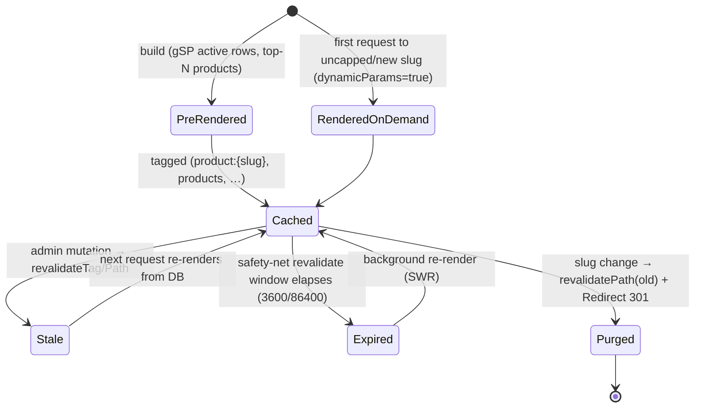

# 09 — SEO, Rendering, ISR & Revalidation

> **Project:** `vaani-gift-e-commerce` · **Brand:** GooglyWoogly Art · **Founder/CEO:** Vanshika Bhatia · **Base:** Jaipur, Rajasthan, India · **Domain:** `googlywoogly.art`
> **Owner perspective:** Architect / SEO · **Conforms to:** [`00-canonical-decisions.md`](./00-canonical-decisions.md) (CANON).
> **Layers on top of:** `02-system-architecture` (the caching machinery), `03-data-model` (entity/field/JSON shapes), `04-information-architecture-and-routing` (the route map + the canonical **§7 cache-tag → trigger matrix**). Where those docs *named* a mechanism, this doc *implements* it; where this doc decides something not fixed in CANON, the decision is stated inline and surfaced under **§11 Open Questions**.
> **Authoritative for:** per-route rendering directives (`dynamic`/`revalidate`/`dynamicParams`/`generateStaticParams`), the **Next.js Metadata API** usage (title/description templates, canonical, OG/Twitter, dynamic OG images), the **full JSON-LD coverage** (shapes + which route emits what), `sitemap.ts` / `robots.ts` implementation, the **on-demand `revalidateTag`/`revalidatePath` wiring** (how Server Actions call it, the closed tag taxonomy, the trigger matrix), **image optimization** (`next/image` + Cloudinary), the **Core Web Vitals budget & tactics**, indexing/`noindex` rules, `hreflang`/locale, and the **404/redirect** behaviour.
> **Not authoritative for:** field-level schema (`03`), the route *skeleton* and the master trigger matrix it owns (`04` §7 — this doc *restates and operationalizes* it but does not redefine tag names), page-level UX/copy of individual templates (`05`–`08`, `10`–`15`), notification flows (`14`), or quantified SLOs (`16`).

---

## 1. Purpose & Scope

### 1.1 What this document covers

1. **Rendering directives, per route** — the exact `export const dynamic`, `revalidate`, `dynamicParams`, `fetchCache`, and `generateStaticParams()` for every storefront route, derived from CANON §8 and `04` §6, with the **code-level** ISR/SSR/CSR decision an engineer pastes in.
2. **Metadata API strategy** — root `metadata`/`generateMetadata` defaults (title template `%s · GooglyWoogly Art`, `metadataBase`, default OG/Twitter), and the per-route `generateMetadata()` override pattern (title, description, `alternates.canonical`, `robots`, `openGraph`, `twitter`).
3. **Dynamic OG images** — the `/api/og/[type]` `ImageResponse` (Edge) route: per-type 1200×630 cards for home/product/category/collection, fonts, fallbacks, and caching.
4. **Structured data (JSON-LD)** — concrete shapes and route placement for `Organization`, `WebSite` + `SearchAction`, `BreadcrumbList`, `Product` + `Offer`, `CollectionPage` + `ItemList` (PLP), `FAQPage`, `AboutPage`/`ContactPage`, and `Review`/`AggregateRating` (V1).
5. **`sitemap.xml` & `robots.txt`** — `sitemap.ts` (chunked via `generateSitemaps()`), per-URL `lastModified`, change frequency/priority, and `robots.ts` allow/disallow + sitemap pointer.
6. **ISR configuration & the real-time update mechanism** — the closed **cache-tag taxonomy**, the **safety-net `revalidate` windows**, and the **on-demand `revalidateTag`/`revalidatePath` trigger matrix** (which admin action busts which tag) with the **exact Server-Action call pattern** and a sequence diagram. *This is the "real-time storefront update" the founder asked for.*
7. **Image optimization** — `next.config` changes (remove `unoptimized`, `remotePatterns`), the custom **Cloudinary loader**, responsive `sizes`, `priority`/LCP rules, AVIF/WebP, and CLS prevention.
8. **Core Web Vitals budget & tactics** — LCP/INP/CLS/TTFB targets and the concrete techniques per route family.
9. **Indexing rules** — `index`/`noindex` per route, faceted-PLP canonicalization, pagination, `hreflang`/locale (`en-IN`), and the 404 / soft-404 / redirect behaviour from an SEO lens.

### 1.2 What this document explicitly does NOT cover

- **The route skeleton, the master tag→trigger matrix, navigation IA, and the `Redirect`-table/middleware redirect engine** — owned by `04` (§6, §7, §8.5). This doc *consumes and operationalizes* them; it never renames a tag or invents a route.
- **The caching machinery itself** (three Next caches, Prisma singleton, Data-Cache transport) — owned by `02` §7. This doc specifies the *SEO/ISR usage* of that machinery.
- **Field-level entity shapes / JSON column shapes** — owned by `03`. Referenced by name only.
- **Per-template visual design, copy, and component props** — owned by `05`–`08`, `10`–`15`.
- **Notification/email/WhatsApp content** — owned by `14`.
- **No locale-prefixed routing, no multi-currency, no shopper-auth pages, no on-site payment pages, no variant params** — out of scope by CANON §3 (`hreflang` here is the single-locale `en-IN` signal only, §10.5).

---

## 2. Primary user stories / jobs-to-be-done

| # | As a… | I want… | so that… |
|---|---|---|---|
| JTBD-1 | **Gift shopper (organic search)** | to find GooglyWoogly when I Google "handmade Diwali gifts Jaipur" and land on a fast, rich result with stars, price, and a photo | I click *this* result over a marketplace and trust an unknown micro-brand. |
| JTBD-2 | **Founder (Vanshika)** | a price/stock/photo/content edit in admin to appear on the live storefront **within seconds, no redeploy** | customers never order something I can't fulfil, and a festival promo goes live the moment I publish it. |
| JTBD-3 | **Googlebot / crawler** | one clean canonical per page, correct `noindex` on cart/checkout/track/search/admin, a complete sitemap with `lastmod`, and valid structured data | I index exactly the right URLs, don't waste crawl budget on facets, and render rich results. |
| JTBD-4 | **Shopper on a ₹8k Android over 4G** | the page to paint its main image and become interactive almost immediately, with nothing jumping around | I don't bounce; I browse and buy from my phone. |
| JTBD-5 | **Social sharer (WhatsApp/Instagram/Pinterest)** | a beautiful preview card (product photo, title, price) when I paste a product link | the share looks credible and drives clicks. |
| JTBD-6 | **Founder editing a slug** | old links to keep working and SEO equity to survive | a shared WhatsApp link or a ranked URL never 404s. |
| JTBD-7 | **Future engineer** | a single, closed tag taxonomy and a documented revalidation contract | I wire a new admin mutation to the right cache bust without guessing. |
| JTBD-8 | **Compliance/DPDP** | token/cart/checkout/track pages excluded from indexing and sitemaps | no private order data is ever crawled or cached. |

---

## 3. Detailed functional requirements

> Numbered, decisive. "MUST" = MVP unless a phase is tagged. Tag names, routes, and the master trigger table are CANON §8/§9 and `04` §7 verbatim — never re-coined here.

### 3.1 Rendering directives (per route)

- **FR-1 — Render mode is fixed per route and declared in code.** Every storefront route MUST set its render mode exactly as CANON §8 / `04` §6 mandate, via the directives in **§4.1** of this doc. RSC is the default; `"use client"` only on leaf islands (per `02` FR-2). No route silently changes mode.
- **FR-2 — ISR catalog/content routes use `generateStaticParams` + `dynamicParams = true`.** `/category/[slug]`, `/collections/[slug]`, `/products/[slug]`, and the `CmsPage`-backed content/legal routes MUST pre-render their **active/published** rows at build and render the long tail on first request (then cache it). The build set is capped to top-N for large catalogs (§4.3, `02` §10).
- **FR-3 — Safety-net `revalidate` windows (CANON §9).** Catalog routes (`/`, `/products`, `/category/*`, `/collections/*`, `/products/[slug]`) MUST set `revalidate = 3600`; content/legal routes MUST set `revalidate = 86400`. These are **backstops only**; correctness comes from on-demand revalidation (FR-9). Never-cached routes set `dynamic = "force-dynamic"` and emit no tags.
- **FR-4 — `/products` is hybrid (ISR base / SSR faceted).** The param-less `/products` is RSC-ISR and indexable; any request carrying a recognized **filter/sort** param (`04` §8.4) renders dynamically and is `noindex,follow` + canonical→`/products` (FR-19). `?page=N (N>1)` stays indexable + self-canonical (FR-20). This is governed by `searchParams` (FR-1 of `04`).
- **FR-5 — Never-cached routes.** `/search`, `/cart` (CSR), `/checkout`, `/order/confirmed/[token]`, `/track/[token]`, and all `/admin/**` MUST NOT be full-route cached and MUST NOT be in the sitemap. Order status changes therefore require **zero** storefront revalidation (the track page is `no-store`, always fresh — CANON §9).

### 3.2 Metadata API

- **FR-6 — Root metadata defaults.** The root `app/layout.tsx` MUST export a `metadata` object setting `metadataBase = new URL(NEXT_PUBLIC_SITE_URL)`, `title.template = "%s · GooglyWoogly Art"`, `title.default`, `description`, default `openGraph` (type/siteName/locale `en_IN`/images), default `twitter` (`summary_large_image`), `robots` (index defaults), and `alternates.canonical` fallback. Values resolve from **`SiteSetting.defaultSeo`** (`{ titleTemplate, defaultDescription, ogImageId?, twitterHandle? }`, `03` §3.5) at request time, read under tag **`settings`**.
- **FR-7 — Per-route `generateMetadata`.** Every parameterized/dynamic indexable route MUST implement `generateMetadata()` returning, at minimum: resolved `title` (from `metaTitle` → fallback `title`/`name`), `description` (from `metaDescription` → fallback `shortDescription`/`description` excerpt), `alternates.canonical` (clean absolute URL), `openGraph` (route-specific image + type), `twitter`, and `robots` per §10. Missing per-entity SEO fields gracefully fall back (§7 states).
- **FR-8 — One canonical per resource.** Every indexable page MUST emit `alternates.canonical` to its **clean, lowercase, no-trailing-slash, no-tracking-param** absolute URL built from `NEXT_PUBLIC_SITE_URL` (CANON §10, `04` FR-11). Faceted/UTM/aliased URLs canonicalize to the clean URL. `noindex` routes **omit** canonical (don't self-canonicalize a noindex page).

### 3.3 ISR & on-demand revalidation (the real-time mechanism)

- **FR-9 — On-demand revalidation is the primary freshness mechanism.** Every admin mutation Server Action that changes **published** storefront data MUST call the **exact** `revalidateTag`/`revalidatePath` set mapped in **§6 / `04` §7 / CANON §9**, in-process, after the DB transaction commits and before returning success. Time-based `revalidate` is only a safety net (FR-3).
- **FR-10 — Closed tag taxonomy.** The only cache tags the app may use are: `home`, `banners`, `settings`, `nav`, `faq`, `testimonials`, `products`, `product:{slug}`, `category:{slug}`, `collection:{slug}`, `page:{slug}` (CANON §9, `02` §7.2). They MUST be produced by typed helpers in `lib/cache/tags.ts` (e.g. `productTag(slug)`); **string literals are never hand-typed** in actions or reads. No ad-hoc tags.
- **FR-11 — Reads are tagged to match.** Every cached storefront read (RSC) MUST attach the tag(s) that the mutation matrix busts, so a single `revalidateTag('product:{slug}')` invalidates exactly the pages referencing that product. Tagging uses Next 16's `cacheTag()` under `use cache` (or `unstable_cache({ tags })` / tagged `fetch`) per `02` §7 (§5.2 of this doc gives the pattern).
- **FR-12 — Slug-change path revalidation.** On a published-entity slug change, in addition to busting the entity tag, the action MUST `revalidatePath` the **old** path (so the now-301'd URL is purged) and the **new** path, and write the `Redirect` row (`04` FR-14, owned by `11`/`15`). This doc specifies the *revalidation* half; the redirect engine is `04` §8.5.
- **FR-13 — Out-of-band revalidation endpoint.** `POST /api/revalidate` (Node, `REVALIDATE_SECRET`-guarded, Zod `{ tags?: string[], paths?: string[], secret }`) MUST exist for cron/webhook triggers (sitemap refresh, future Cloudinary webhook). In-process Server Actions are preferred and do **not** call it over HTTP (`02` FR-15).

### 3.4 Structured data (JSON-LD)

- **FR-14 — JSON-LD coverage (MVP).** The app MUST emit valid `application/ld+json` per route: **`Organization`** + **`WebSite`**(+`SearchAction`) on `/`; **`Product`**+**`Offer`**+**`BreadcrumbList`** on PDP; **`CollectionPage`**+**`ItemList`**+**`BreadcrumbList`** on `/products` (base), `/category/[slug]`, `/collections/[slug]`; **`FAQPage`** on `/faq`; **`BreadcrumbList`** on all catalog/content pages; **`AboutPage`**/**`ContactPage`**(+`Organization`) on those routes (`04` §6.1). All injected server-side in RSC (crawlable, no client hydration needed).
- **FR-15 — `AggregateRating`/`Review` is V1.** When reviews ship (V1), PDP `Product` JSON-LD MUST add `aggregateRating` (from approved `Review` rows) and individual `review` entries; `Offer` and ratings MUST be consistent with on-page content (Google rich-results policy). Not emitted in MVP (no fabricated ratings).
- **FR-16 — Offer correctness.** PDP `Offer` MUST reflect live data: `price` (rupees, 2-dp string from integer paise), `priceCurrency:"INR"`, `availability` derived from `inventoryState` (mapped in §4.6 — `made_to_order`/`low_stock`/`in_stock` → `InStock`/`PreOrder`; `out_of_stock` → `OutOfStock`), `priceValidUntil`, `itemCondition: NewCondition`, and `url` = canonical PDP. Money is read through `lib/money.ts` (never float).

### 3.5 Sitemap & robots

- **FR-17 — Dynamic sitemap.** `app/sitemap.ts` MUST generate a sitemap containing **only indexable canonical URLs**: `/`, `/products`, `/bulk-orders`, all `active` `Category`/`Collection` slugs, all `active` `Product` slugs, all `isPublished` `CmsPage` slugs (about/contact/faq + 5 legal). It MUST exclude `search/cart/checkout/order/track/admin/api`. Each entry carries `lastModified` from the entity's `updatedAt`, plus `changeFrequency` and `priority` (§8.1). Beyond a 5,000-URL threshold it MUST chunk via `generateSitemaps()` into a sitemap index (`/sitemap/[id].xml`).
- **FR-18 — robots.txt.** `app/robots.ts` MUST emit `allow: "/"`, `disallow` the private set (`/admin`, `/api`, `/cart`, `/checkout`, `/order`, `/track`, `/search`, `/*?*` query-param crawling guard scoped per §8.2), and an absolute `sitemap` URL. Admin is additionally protected by `X-Robots-Tag` (middleware, `04` §6.3) and page-level `robots` metadata (defense in depth).

### 3.6 Image optimization

- **FR-19 — Image optimization ON.** `next.config.mjs` MUST remove `images.unoptimized` (and remove `typescript.ignoreBuildErrors`), and whitelist `res.cloudinary.com` (+ `images.unsplash.com` for dev placeholders) under `images.remotePatterns`. Every image uses `next/image` with explicit `width`/`height` (or `fill`) and a `sizes` attribute (§7). `formats` includes AVIF + WebP.
- **FR-20 — Cloudinary delivery + loader.** Product/CMS imagery is delivered via Cloudinary `f_auto,q_auto` + responsive transformations. A custom `next/image` **loader** (`lib/cloudinary/loader.ts`) MUST push resizing to the Cloudinary CDN (so the Vercel Image Optimizer is bypassed for Cloudinary assets, protecting the free tier). OG cards use the `c_fill,g_auto,w_1200,h_630` derivation. Intrinsic `width`/`height` are persisted (`ProductImage`/`MediaAsset`, `03`) to **reserve layout space (CLS=0)**.

### 3.7 Core Web Vitals & indexing

- **FR-21 — CWV budget.** Storefront routes MUST meet (field, 75th percentile, mobile): **LCP ≤ 2.5 s**, **INP ≤ 200 ms**, **CLS ≤ 0.1**, **TTFB ≤ 0.8 s** (§9). Tactics per route family are mandatory (priority LCP image, no layout shift, minimal client JS, streamed `loading.tsx`).
- **FR-22 — Indexing rules.** `noindex` MUST be set on `/search`, `/cart`, `/checkout`, `/order/confirmed/[token]`, `/track/[token]`, all `/admin/**`, faceted `/products?filter…`, and the `?success=` bulk thank-you state (CANON §8, `04` §8.3). Out-of-stock **active** PDPs **stay indexed** (`index,follow`); archived/removed PDPs 301→category (never 404) — the redirect itself is `04` §8.5; this doc ensures the *cache/sitemap* drop them.
- **FR-23 — Locale signal.** The site is single-locale `en-IN`; root `<html lang="en-IN">`, OG `locale: "en_IN"`, and a self-referential `hreflang="en-in"` (+ `x-default`) on indexable pages (§10.5). No locale-prefixed URLs (CANON §3, `04` §1.2).

---

## 4. Per-route rendering & metadata (the implementation contract)

> `gSP` = `generateStaticParams`. Directives are what the engineer writes at the top of each `page.tsx`. Tags are CANON §9 verbatim. "Canonical" = value of `alternates.canonical`.

### 4.1 Rendering directive table

| Route | `dynamic` | `revalidate` | `dynamicParams` | `gSP` | Cache tag(s) on reads | Index | Canonical |
|---|---|---|---|---|---|---|---|
| `/` | (default, static) | `3600` | — | — | `home`, `banners`, `settings` | ✅ | self |
| `/bulk-orders` | (default, static) | `3600` | — | — | `page:bulk-orders`, `settings` | ✅ (`?success` → `noindex`) | self |
| `/products` (base) | (default, static) | `3600` | — | — | `products`, `settings` | ✅ | self |
| `/products?filter/sort…` | `force-dynamic` (via `searchParams`) | — | — | — | reads not full-route-cached | ❌ `noindex,follow` | → `/products` |
| `/products?page=N` (N>1) | (default) | `3600` | — | — | `products` | ✅ | self (+ `rel=prev/next`) |
| `/category/[slug]` | (default, static) | `3600` | `true` | active categories | `category:{slug}`, `products`, `settings` | ✅ | self |
| `/collections/[slug]` | (default, static) | `3600` | `true` | active collections | `collection:{slug}`, `products`, `settings` | ✅ | self |
| `/products/[slug]` (PDP) | (default, static) | `3600` | `true` | active products (top-N) | `product:{slug}`, `settings` | ✅ active / 301 archived | self |
| `/search` | `force-dynamic` | — | — | — | none | ❌ `noindex,follow` | omit |
| `/cart` | (CSR client page) | — | — | — | none | ❌ `noindex,nofollow` | omit |
| `/checkout` | `force-dynamic` | — | — | — | none | ❌ `noindex,nofollow` | omit |
| `/order/confirmed/[token]` | `force-dynamic` (`no-store`) | — | — | — | none | ❌ `noindex,nofollow` | omit |
| `/track/[token]` | `force-dynamic` (`no-store`) | — | — | — | none | ❌ `noindex,nofollow` | omit |
| `/about` | (default, static) | `86400` | — | — | `page:about` | ✅ | self |
| `/contact` | (default, static) | `86400` | — | — | `page:contact`, `settings` | ✅ (`?success` → `noindex`) | self |
| `/faq` | (default, static) | `86400` | — | — | `page:faq`, `faq` | ✅ | self |
| `/shipping-policy`, `/returns-and-refunds`, `/privacy-policy`, `/terms`, `/care-guide` | (default, static) | `86400` | (`true` if catch-all) | published legal `CmsPage` | `page:{slug}` | ✅ | self |
| `/sitemap.xml` (+ chunks) | generated | `3600` | — | — | — | — | — |
| `/robots.txt` | generated | (static) | — | — | — | — | — |
| `/admin/**` | `force-dynamic` | — | — | — | none | ❌ `noindex,nofollow` (+`X-Robots-Tag`) | omit |

> **Code snippet — PDP route directives (illustrative, the load-bearing part):**
> ```ts
> // app/(storefront)/products/[slug]/page.tsx
> export const revalidate = 3600;          // safety net only
> export const dynamicParams = true;       // long-tail products render on first hit
> export async function generateStaticParams() {
>   // build set = active products, capped to top-N (featured/bestseller/recent) — see §4.3
>   return getStaticProductSlugs();
> }
> export async function generateMetadata({ params }): Promise<Metadata> { /* §4.4 */ }
> // default render is static; on-demand revalidateTag('product:{slug}') keeps it live (§6)
> ```

### 4.2 Root metadata defaults (`app/layout.tsx`)

```ts
import type { Metadata } from "next";
import { getSiteSeo } from "@/lib/services/settings"; // reads SiteSetting.defaultSeo under tag `settings`

export async function generateMetadata(): Promise<Metadata> {
  const seo = await getSiteSeo(); // { titleTemplate, defaultDescription, ogImageId?, twitterHandle? }
  return {
    metadataBase: new URL(process.env.NEXT_PUBLIC_SITE_URL!),
    title: {
      default: "GooglyWoogly Art — Handmade Gifts & Home Décor from Jaipur",
      template: seo.titleTemplate ?? "%s · GooglyWoogly Art",
    },
    description: seo.defaultDescription,
    applicationName: "GooglyWoogly Art",
    alternates: { canonical: "/" },          // overridden per route
    openGraph: {
      type: "website",
      siteName: "GooglyWoogly Art",
      locale: "en_IN",
      url: process.env.NEXT_PUBLIC_SITE_URL,
      images: [{ url: "/api/og/home", width: 1200, height: 630, alt: "GooglyWoogly Art" }],
    },
    twitter: {
      card: "summary_large_image",
      site: seo.twitterHandle,
      creator: seo.twitterHandle,
    },
    robots: { index: true, follow: true, googleBot: { index: true, follow: true, "max-image-preview": "large", "max-snippet": -1 } },
    icons: { icon: "/favicon.ico", apple: "/apple-touch-icon.png" },
    formatDetection: { telephone: false },
  };
}
```

> `<html lang="en-IN">` is set in the root layout (FR-23). The OG default falls back to a static brand card when `SiteSetting.defaultSeo.ogImageId` is unset.

### 4.3 `generateStaticParams` build-set policy (FR-2, `02` §10)

| Route | Build set | Long tail |
|---|---|---|
| `/category/[slug]` | **all** `Category.isActive=true` (finite, small) | n/a |
| `/collections/[slug]` | **all** `Collection.isActive=true` (finite) | n/a |
| `/products/[slug]` | **top-N** `status=active`, ordered `isBestseller`, `isFeatured`, `publishedAt desc` (cap **N=300**, decision Open Q-1) | rendered on first request via `dynamicParams=true`, then cached + tagged |
| legal/content `CmsPage` | **all** `isPublished=true` (finite) | n/a |

> Capping protects free-tier build minutes; correctness is unaffected because `dynamicParams=true` + on-demand revalidation render & cache any uncapped product on first hit (CANON §9, `02` §10).

### 4.4 `generateMetadata` patterns (per route family)

**PDP — `/products/[slug]`** (reads `Product` + primary/og image under tag `product:{slug}`):

```ts
export async function generateMetadata({ params }: { params: Promise<{ slug: string }> }): Promise<Metadata> {
  const { slug } = await params;
  const p = await getProductForMeta(slug); // tagged product:{slug}
  if (!p) return {}; // not-found handled by page; metadata empty
  const title = p.metaTitle ?? `${p.title}${p.subtitle ? " — " + p.subtitle : ""}`;
  const description = p.metaDescription ?? p.shortDescription ?? excerpt(p.description, 155);
  const url = absoluteUrl(`/products/${p.slug}`);
  const og = ogImageUrl({ type: "product", slug: p.slug }); // /api/og/product?slug=…  OR Cloudinary OG derivation
  return {
    title, description,
    alternates: { canonical: url },
    openGraph: { type: "website", url, title, description, images: [{ url: og, width: 1200, height: 630, alt: p.title }] },
    twitter: { card: "summary_large_image", title, description, images: [og] },
    robots: { index: p.status === "active", follow: true }, // out-of-stock active stays indexed (§10)
    other: { "product:price:amount": rupees(p.price), "product:price:currency": "INR" }, // OG product props
  };
}
```

| Route | `title` source → fallback | `description` source → fallback | OG image | Notes |
|---|---|---|---|---|
| `/` | static brand default | `SiteSetting.defaultSeo.defaultDescription` | `/api/og/home` | hub page |
| `/products` (base) | `"All Handmade Gifts"` (or `SiteSetting`) | curated copy | `/api/og/home` | `ItemList` JSON-LD (§5.3) |
| `/category/[slug]` | `Category.metaTitle` → `Category.name` | `Category.metaDescription` → `Category.description` excerpt | `/api/og/category?slug=` (or `Category.imageId` Cloudinary OG) | `CollectionPage`+`ItemList` |
| `/collections/[slug]` | `Collection.metaTitle` → `Collection.title` | `Collection.metaDescription` → `Collection.description` excerpt | `/api/og/collection?slug=` (or `heroImageId` OG) | occasion landing |
| `/products/[slug]` | `Product.metaTitle` → `title (+ subtitle)` | `Product.metaDescription` → `shortDescription` → `description` excerpt | `Product.ogImageId` Cloudinary OG → `/api/og/product?slug=` | `Product`+`Offer` |
| `/about`,`/contact`,`/faq`,legal | `CmsPage.metaTitle` → `CmsPage.title` | `CmsPage.metaDescription` → body excerpt | `/api/og/home` | content/legal |
| `/search` | `"Search: {q}"` (or `"Search"` empty) | `"Search handmade gifts at GooglyWoogly Art"` | default | `noindex,follow`, **no canonical** |
| token/cart/checkout | minimal generic | minimal | none | `noindex,nofollow`, no canonical |

### 4.5 Dynamic OG images — `/api/og/[type]` (Edge `ImageResponse`)

> Architecture (`02` §6.2) reserves `/api/og/[type]` (Edge, `ImageResponse`, PNG 1200×630). This doc specifies its behaviour. **Decision (Open Q-2):** product/category/collection OG cards are generated **dynamically** by this route so any product has a branded share card without manual art; the founder MAY override per-product via `Product.ogImageId` (which, when set, takes precedence and is served as a Cloudinary `c_fill,w_1200,h_630` derivation instead).

| `type` | Inputs (query) | Card content | Fallback |
|---|---|---|---|
| `home` | — | Logo + brand tagline + "Handmade in Jaipur" + pink brand gradient | static asset |
| `product` | `slug` | Product primary photo (left) + title + price ₹ + "Handmade • Made-to-order?" badge | brand card if product missing |
| `category` | `slug` | Category name + tile image + product-count | brand card |
| `collection` | `slug` | Collection title + hero image + occasion ribbon | brand card |

Implementation rules:
- **Runtime `edge`**; `export const runtime = "edge"`; returns `new ImageResponse(<JSX/>, { width: 1200, height: 630 })`.
- **Fonts**: load 1–2 brand fonts via `fetch(new URL("…", import.meta.url))` as `ArrayBuffer` (Satori needs the font binary); cache in module scope.
- **Data**: a **lightweight read** (slug → title/price/imageUrl only) via an Edge-safe query or a tiny cached JSON endpoint — never the full Prisma client on Edge (`02` FR-8). If data fetch fails, render the brand fallback card (never 500 a crawler).
- **Caching**: set `Cache-Control: public, max-age=0, s-maxage=86400, stale-while-revalidate=604800`; the OG URL is stable per slug, and a product edit changes `updatedAt` → we append `?v={updatedAtEpoch}` to the OG URL in metadata to cache-bust on change.
- **Image privacy/safety**: only public catalog data; no PII; tokens never accepted.

### 4.6 `inventoryState` → schema.org `availability` map (FR-16)

| `inventoryState` (CANON enum, derived) | schema.org `Offer.availability` | PDP CTA (owned by `07`) | Indexed? |
|---|---|---|---|
| `in_stock` | `https://schema.org/InStock` | Add to cart | ✅ |
| `low_stock` | `https://schema.org/InStock` (+ "Only N left" on-page) | Add to cart | ✅ |
| `made_to_order` | `https://schema.org/PreOrder` (or `BackOrder`) | "Made to order — ships in {lead} days" | ✅ |
| `out_of_stock` (non-MTO) | `https://schema.org/OutOfStock` | "Notify on WhatsApp" (add-to-cart disabled) | ✅ (stays indexed) |

> `inventoryState` is **derived at read-time** by the single `lib/inventory.ts` helper (CANON §6, `02` FR-11) — never stored, never re-derived inconsistently between PDP body and JSON-LD.

---

## 5. Structured data (JSON-LD) — shapes & placement

> All JSON-LD is rendered **server-side** inside the RSC tree via a `<script type="application/ld+json">` (a small `<JsonLd data={…} />` server component that `JSON.stringify`s and XSS-escapes `<`). One graph per page is preferred (`@graph`), but discrete blocks are acceptable. URLs are absolute (`NEXT_PUBLIC_SITE_URL`). Money is rupees as a 2-dp **string** from integer paise via `lib/money.ts`.

### 5.1 `Organization` + `WebSite` + `SearchAction` — Home (`/`)

```jsonc
{
  "@context": "https://schema.org",
  "@graph": [
    {
      "@type": "Organization",
      "@id": "https://googlywoogly.art/#organization",
      "name": "GooglyWoogly Art",
      "url": "https://googlywoogly.art",
      "logo": "https://res.cloudinary.com/<cloud>/image/upload/.../logo.png", // SiteSetting.logoId
      "description": "Handmade gifting & home décor, designed and crafted in Jaipur.",
      "foundingLocation": { "@type": "Place", "address": { "@type": "PostalAddress", "addressLocality": "Jaipur", "addressRegion": "Rajasthan", "addressCountry": "IN" } },
      "address": { "@type": "PostalAddress", /* from SiteSetting.businessAddress */ "addressCountry": "IN" },
      "email": "<SiteSetting.contactEmail>",
      "contactPoint": [{ "@type": "ContactPoint", "contactType": "customer support", "telephone": "+<WHATSAPP_NUMBER>", "areaServed": "IN", "availableLanguage": ["en", "hi"] }],
      "sameAs": [ /* SiteSetting.socialLinks: instagram, facebook, pinterest, youtube */ ]
    },
    {
      "@type": "WebSite",
      "@id": "https://googlywoogly.art/#website",
      "url": "https://googlywoogly.art",
      "name": "GooglyWoogly Art",
      "publisher": { "@id": "https://googlywoogly.art/#organization" },
      "inLanguage": "en-IN",
      "potentialAction": {
        "@type": "SearchAction",
        "target": { "@type": "EntryPoint", "urlTemplate": "https://googlywoogly.art/search?q={search_term_string}" },
        "query-input": "required name=search_term_string"
      }
    }
  ]
}
```
> Note: the `SearchAction` `target` points at `/search` even though `/search` is `noindex` — that is correct and expected (the sitelinks searchbox targets the working search URL; indexing of the results page is separate).

### 5.2 `Product` + `Offer` (+ `AggregateRating`/`Review` V1) — PDP

```jsonc
{
  "@context": "https://schema.org",
  "@type": "Product",
  "@id": "https://googlywoogly.art/products/<slug>/#product",
  "name": "<Product.title>",
  "description": "<plain-text shortDescription or sanitized description>",
  "sku": "<Product.sku>",
  "image": [ /* ProductImage[] absolute Cloudinary URLs, primary first */ ],
  "brand": { "@type": "Brand", "name": "GooglyWoogly Art" },
  "category": "<Category.name>",
  "material": "<Product.materials>",            // when present
  "isHandmade": true,                            // brand signal (custom; harmless)
  "offers": {
    "@type": "Offer",
    "url": "https://googlywoogly.art/products/<slug>",
    "priceCurrency": "INR",
    "price": "<rupees(Product.price)>",          // e.g. "1499.00"
    "priceValidUntil": "<today + 1y, ISO date>",
    "availability": "<§4.6 map from inventoryState>",
    "itemCondition": "https://schema.org/NewCondition",
    "seller": { "@id": "https://googlywoogly.art/#organization" },
    "areaServed": "IN",
    "shippingDetails": { "@type": "OfferShippingDetails", "shippingDestination": { "@type": "DefinedRegion", "addressCountry": "IN" } } // freeShippingThreshold-aware (optional)
  }
  // V1 only — when approved reviews exist:
  // "aggregateRating": { "@type": "AggregateRating", "ratingValue": "<avg>", "reviewCount": "<n>", "bestRating": 5, "worstRating": 1 },
  // "review": [ { "@type": "Review", "author": {"@type":"Person","name":"<Review.customerName>"}, "reviewRating": {"@type":"Rating","ratingValue":"<rating>"}, "reviewBody": "<body>", "datePublished": "<createdAt>" } ]
}
```
- **MVP:** **no** `aggregateRating`/`review` (no review data → never fabricate; would violate Google policy and risk manual action).
- `compareAtPrice` (when `> price`) MAY map to a strike via `priceSpecification`/`highPrice` but is **not** required; the on-page strike is sufficient.

### 5.3 `CollectionPage` + `ItemList` — `/products` (base), `/category/[slug]`, `/collections/[slug]`

```jsonc
{
  "@context": "https://schema.org",
  "@type": "CollectionPage",
  "@id": "<canonical>/#collectionpage",
  "name": "<page title>",
  "description": "<page description>",
  "isPartOf": { "@id": "https://googlywoogly.art/#website" },
  "mainEntity": {
    "@type": "ItemList",
    "numberOfItems": <count on page>,
    "itemListElement": [
      { "@type": "ListItem", "position": 1, "url": "https://googlywoogly.art/products/<slugA>", "name": "<titleA>", "image": "<imgA>" },
      { "@type": "ListItem", "position": 2, "url": "https://googlywoogly.art/products/<slugB>" }
      /* … up to the products rendered on this page (respect pagination window) */
    ]
  }
}
```
> `ItemList` lists the **products on the current page** (not the whole catalog); on paginated `?page=N`, positions continue logically but each page lists its own slice. PLP `ItemList` is a soft signal (Google may not render rich results for it) — emit it anyway; it's cheap and correct.

### 5.4 `BreadcrumbList` — all catalog/content pages (FR-14, `04` FR-18)

```jsonc
{
  "@context": "https://schema.org",
  "@type": "BreadcrumbList",
  "itemListElement": [
    { "@type": "ListItem", "position": 1, "name": "Home", "item": "https://googlywoogly.art/" },
    { "@type": "ListItem", "position": 2, "name": "<Category.name>", "item": "https://googlywoogly.art/category/<slug>" },
    { "@type": "ListItem", "position": 3, "name": "<Product.title>" }  // last crumb: no `item` (current page)
  ]
}
```
> Trails come from `04` §6.1 (Home › Category › Product; Home › Collections › Title; Home › [Parent cat?] › Category; Home › {Page}). The visual breadcrumb (`components/ui/breadcrumb.tsx`) and the JSON-LD MUST be generated from the **same** trail source to stay consistent.

### 5.5 `FAQPage` — `/faq` (FR-14)

```jsonc
{
  "@context": "https://schema.org",
  "@type": "FAQPage",
  "mainEntity": [
    { "@type": "Question", "name": "<FaqItem.question>", "acceptedAnswer": { "@type": "Answer", "text": "<FaqItem.answer plain-text>" } }
    /* one per published FaqItem, ordered by category then sortOrder */
  ]
}
```
> Only **published** `FaqItem` rows. Answer text is the sanitized plain-text of the rich `answer`. If a single FAQ block is reused on a PDP or policy page, `FAQPage` JSON-LD is emitted **only** on `/faq` (avoid duplicate FAQ markup across URLs).

### 5.6 `AboutPage` / `ContactPage` — `/about`, `/contact`

- `/about` → `{ "@type": "AboutPage", "isPartOf": {"@id":"…/#website"}, "about": {"@id":"…/#organization"} }` + `BreadcrumbList`.
- `/contact` → `{ "@type": "ContactPage" }` + the `Organization` node (with `contactPoint`, email, WhatsApp) + `BreadcrumbList`.

### 5.7 JSON-LD coverage matrix

| Route | Org | WebSite+SearchAction | Product+Offer | CollectionPage+ItemList | FAQPage | Breadcrumb | About/Contact | AggregateRating (V1) |
|---|:--:|:--:|:--:|:--:|:--:|:--:|:--:|:--:|
| `/` | ✅ | ✅ | | | | | | |
| `/products` (base) | | | | ✅ | | ✅ | | |
| `/category/[slug]` | | | | ✅ | | ✅ | | |
| `/collections/[slug]` | | | | ✅ | | ✅ | | |
| `/products/[slug]` | (ref) | | ✅ | | | ✅ | | ✅ (V1) |
| `/faq` | | | | | ✅ | ✅ | | |
| `/about` | (ref) | | | | | ✅ | ✅ About | |
| `/contact` | ✅ | | | | | ✅ | ✅ Contact | |
| legal pages | | | | | | ✅ | | |
| `/bulk-orders` | (ref) | | | | | ✅ | | |
| `/search`, `/cart`, `/checkout`, token, `/admin/**` | — | — | — | — | — | — | — | — |

---

## 6. ISR config & the on-demand revalidation contract (real-time updates)

> This is the **"price/stock/content changes go live in seconds without a redeploy"** mechanism the founder asked for. The **master tag→trigger table is `04` §7 / CANON §9**; this section operationalizes the *call pattern, transport, and sequence*. It does **not** redefine tags.

### 6.1 The closed cache-tag taxonomy (FR-10)

`home` · `banners` · `settings` · `nav` · `faq` · `testimonials` · `products` · `product:{slug}` · `category:{slug}` · `collection:{slug}` · `page:{slug}`

```ts
// lib/cache/tags.ts  — the ONLY place tag strings are formed
export const tags = {
  home: "home",
  banners: "banners",
  settings: "settings",
  nav: "nav",
  faq: "faq",
  testimonials: "testimonials",
  products: "products",
  product: (slug: string) => `product:${slug}` as const,
  category: (slug: string) => `category:${slug}` as const,
  collection: (slug: string) => `collection:${slug}` as const,
  page: (slug: string) => `page:${slug}` as const,
} as const;
```

### 6.2 How reads attach tags (FR-11)

```ts
// lib/services/product.ts  (server-only)
import { unstable_cache } from "next/cache"; // or Next 16 `use cache` + cacheTag()
import { tags } from "@/lib/cache/tags";

export const getProductBySlug = (slug: string) =>
  unstable_cache(
    () => prisma.product.findUnique({ where: { slug }, select: productPublicSelect, /* never costPrice */ }),
    ["product-by-slug", slug],
    { tags: [tags.product(slug), tags.products], revalidate: 3600 } // safety net mirrors §4.1
  )();
```
> Next 16 equivalent: a `"use cache"` function calling `cacheTag(tags.product(slug), tags.products)` + `cacheLife({ revalidate: 3600 })`. Semantics and the tag set are identical (`02` §18.2). Reads MUST use `productPublicSelect` so `costPrice` never leaves the server (`03` Open Q-5).

### 6.3 How Server Actions bust tags (FR-9) — the uniform pattern

Every admin mutation follows the `02` §6.1 contract and ends with the **exact** revalidation set:

```ts
// server/catalog/products.ts
"use server";
import { revalidateTag, revalidatePath } from "next/cache";
import { tags } from "@/lib/cache/tags";
import { requireAdmin } from "@/lib/auth/guards";

export async function updateProduct(input: unknown) {
  const data = updateProductSchema.parse(input);          // 1) Zod validate
  await requireAdmin("admin");                             // 2) authorize
  const { before, after } = await productService.update(data); // 3) service + tx (+ AuditLog, + Redirect on slug change)

  // 4) revalidate EXACT set (04 §7 / CANON §9)
  revalidateTag(tags.product(after.slug));
  revalidateTag(tags.products);
  if (after.categorySlug && after.categorySlug !== before.categorySlug) {
    if (before.categorySlug) revalidateTag(tags.category(before.categorySlug)); // old
    revalidateTag(tags.category(after.categorySlug));                            // new
  }
  for (const c of after.affectedCollectionSlugs) revalidateTag(tags.collection(c));
  if (after.isFeatured || after.isBestseller) revalidateTag(tags.home);

  // 5) slug change → purge old + new path (Redirect row written by service; 04 §8.5)
  if (before.slug !== after.slug) {
    revalidatePath(`/products/${before.slug}`);
    revalidatePath(`/products/${after.slug}`);
  }
  return { ok: true as const, data: after };
}
```

### 6.4 The full trigger matrix (operationalized from `04` §7 / CANON §9)

> **Restated for the engineer wiring revalidation.** Tag names are CANON §9 verbatim; this is the authoritative *call list* for each MVP action. `revalidatePath` is added only where a specific URL must refresh (slug-change purge, `/`).

| Admin action (Server Action) | `revalidateTag(…)` | `revalidatePath(…)` | Safety-net `revalidate` of affected route |
|---|---|---|---|
| `createProduct` | `products`; `category(newSlug)` if assigned; `collection(c)` for each membership; `home` if featured/bestseller | — (no `product:{slug}` exists yet; `dynamicParams` renders on first hit) | 3600 |
| `updateProduct` | `product(slug)`, `products`; `category(old)`+`category(new)` if changed; `collection(c)` affected; `home` if featured/bestseller | on slug change: `/products/{old}` + `/products/{new}` | 3600 |
| `archiveProduct` / `unarchive` | `product(slug)`, `products`; affected `category`/`collection` | `/products/{slug}` (now 301→category; cache purge) | 3600 |
| `adjustInventory` (qty/threshold/MTO/price/compareAt) | `product(slug)`, `products` | — | 3600 |
| `reorderProductImages` / media attach | `product(slug)`, `products`; `home` if featured | — | 3600 |
| `upsertCategory` / `toggleCategory` / `reorderCategories` | `category(slug)`, `products`, `nav` | on slug change: `/category/{old}`+`/category/{new}` | 3600 |
| `upsertCollection` / `setCollectionProducts` / `runCollectionRules` (V1) | `collection(slug)`, `products`; `home` if `isFeaturedOnHome` | on slug change: `/collections/{old}`+`/collections/{new}` | 3600 |
| `updateHomepageSections` (add/edit/reorder/toggle) | `home` | `/` | 3600 |
| `upsertBanner` (create/edit/schedule/toggle) | `banners`, `home` | `/` | 3600 |
| `upsertTestimonial` (add/edit/approve/reorder/feature) | `testimonials`, `home` | `/` | 86400 (home 3600) |
| `upsertFaqItem` (create/edit/reorder/publish) | `faq` | `/faq` | 86400 |
| `publishCmsPage` (about/contact/faq/legal/bulk-orders) | `page(slug)` (+ `faq` if FAQ page) | `/{slug}`; on slug change: old+new | 86400 |
| `updateSiteSettings` (any key) | `settings`, `nav`; `home`+`banners` if announcement/marquee changed | `/` | 3600 |
| `uploadMedia` / `deleteMedia` | — (none global); the tag of any entity it's attached to | — | — |
| `moderateReview` (V1 approve/reject) | `product(slug)`, `products` | — | 3600 |
| **Order/lead actions** (`placeOrder`, `transitionOrderStatus`, `setPaymentStatus`, `submitBulkInquiry`, `submitContact`, `subscribeNewsletter`) | **none** (no storefront cache; track/admin are `no-store`) | `revalidatePath('/admin/orders')` is fine for admin UX but **not** a storefront tag | — |
| **Cron** `rebuildSitemap` (`/api/cron/sitemap`) | via `POST /api/revalidate` `{ paths:["/sitemap.xml"] }` (or `revalidatePath`) | `/sitemap.xml` | 3600 |

> **Create caveat (CANON §9 footnote):** on `createProduct` there is no `product:{slug}` to bust yet; `dynamicParams=true` renders the new PDP on first request, and busting `products` (+ relevant `category`) makes listings include it immediately.

### 6.5 Out-of-band transport — `POST /api/revalidate` (FR-13)

```ts
// app/api/revalidate/route.ts  (Node)
const Body = z.object({ tags: z.array(z.string()).optional(), paths: z.array(z.string()).optional(), secret: z.string() });
export async function POST(req: Request) {
  const body = Body.parse(await req.json());
  if (body.secret !== process.env.REVALIDATE_SECRET) return Response.json({ ok: false }, { status: 401 });
  body.tags?.forEach((t) => revalidateTag(t));   // tags validated against the closed set in §6.1
  body.paths?.forEach((p) => revalidatePath(p));
  return Response.json({ revalidated: true, now: Date.now() });
}
```
> Used by Vercel Cron (nightly sitemap refresh) and any future webhook (Cloudinary). In-process Server Actions are the primary path; this endpoint is a fallback/manual trigger (`02` FR-15).

### 6.6 Revalidation sequence diagram (the core real-time loop)

```mermaid
sequenceDiagram
  autonumber
  actor Founder as Founder (Admin UI · phone)
  participant SA as Server Action (server/*)
  participant SVC as Service (lib/services)
  participant DB as Postgres (Prisma · tx)
  participant DC as Next Data + Route Cache (tagged)
  participant CDN as Vercel Edge (Route Cache)
  actor Shopper

  Note over Founder,DC: Founder edits stock+price of a featured product
  Founder->>SA: updateProduct({ id, price, inventoryQuantity })
  SA->>SA: Zod validate + requireAdmin("admin")
  SA->>SVC: productService.update(...)
  SVC->>DB: BEGIN; UPDATE products SET price, inventory_quantity; INSERT AuditLog; (INSERT Redirect if slug changed); COMMIT
  DB-->>SVC: { before, after }
  SVC-->>SA: { before, after }
  SA->>DC: revalidateTag("product:hand-painted-mug")
  SA->>DC: revalidateTag("products")
  SA->>DC: revalidateTag("home")  %% because isFeatured
  alt slug changed
    SA->>DC: revalidatePath("/products/{old}")
    SA->>DC: revalidatePath("/products/{new}")
  end
  SA-->>Founder: { ok: true } (optimistic UI updates instantly)
  Note over DC,CDN: tagged entries marked STALE (no rebuild yet)

  Note over Shopper,DB: Next visitor triggers on-demand re-render
  Shopper->>CDN: GET /products/hand-painted-mug
  alt Route cache fresh
    CDN-->>Shopper: cached HTML (no DB hit)
  else marked stale by revalidateTag
    CDN->>DB: RSC re-renders → fresh SELECT (productPublicSelect, no costPrice)
    DB-->>CDN: new price + inventoryState
    CDN-->>Shopper: HTML with live price/stock + updated Offer JSON-LD + OG ?v=updatedAt
  end
```

> **Why this satisfies "real-time":** the founder's action marks the exact tagged routes stale **in-process, synchronously**; the very next request to those routes re-renders from the DB. Staleness window = "until the next request," typically sub-second under traffic. The safety-net `revalidate` (3600/86400) only matters if a bust were ever missed; Cron + TTL backstop it (CANON §9, `02` §10 "revalidation race").

### 6.7 Build-time vs runtime caching states



---

## 7. Image optimization (`next/image` + Cloudinary)

### 7.1 `next.config.mjs` (corrected from the v0 prototype)

```js
/** @type {import('next').NextConfig} */
const nextConfig = {
  // REMOVED: typescript.ignoreBuildErrors (CANON §4 build hygiene)
  // REMOVED: images.unoptimized (CANON §4, FR-19)
  images: {
    formats: ["image/avif", "image/webp"],
    remotePatterns: [
      { protocol: "https", hostname: "res.cloudinary.com", pathname: "/**" },
      { protocol: "https", hostname: "images.unsplash.com", pathname: "/**" }, // dev placeholders only
    ],
    deviceSizes: [360, 414, 640, 768, 1024, 1280, 1536, 1920],
    imageSizes: [16, 32, 48, 64, 96, 128, 256, 384],
    minimumCacheTTL: 86400,
    // loader: "custom", loaderFile: "./lib/cloudinary/loader.ts"  // see §7.2
  },
  // security headers / experimental flags layered by 02/16
};
export default nextConfig;
```

### 7.2 Custom Cloudinary loader (FR-20)

```ts
// lib/cloudinary/loader.ts  ("use client" safe — pure URL math; no secret)
export default function cloudinaryLoader({ src, width, quality }: { src: string; width: number; quality?: number }) {
  // src is a Cloudinary delivery URL OR a public_id; insert transformation segment
  const params = ["f_auto", `q_${quality ?? "auto"}`, `w_${width}`, "c_limit"];
  // .../upload/<params>/<public_id>
  return src.replace("/upload/", `/upload/${params.join(",")}/`);
}
```
> Pushing resize to Cloudinary's CDN bypasses Vercel's Image Optimizer for Cloudinary assets (protects the Vercel free tier; `02` §16). Non-Cloudinary images (rare) fall back to the default optimizer. `f_auto` serves AVIF/WebP per `Accept`.

### 7.3 Responsive `sizes` & `priority` rules (per surface)

| Surface | Component | `sizes` | `priority` / loading |
|---|---|---|---|
| PDP primary image (LCP) | `next/image` (fixed `width`/`height` from `ProductImage`) | `(max-width:768px) 100vw, 50vw` | `priority` (LCP) |
| PDP gallery thumbs | `next/image` | `80px` | lazy |
| PLP product card | `next/image` `fill` in fixed-aspect wrapper | `(max-width:640px) 50vw, (max-width:1024px) 33vw, 25vw` | first row (above fold) `priority`-hint via `fetchPriority="high"` on LCP card; rest lazy |
| Home hero | `next/image` | `100vw` | `priority` (LCP) |
| Category/collection hero | `next/image` | `100vw` | `priority` |
| Mega-menu featured tile | `next/image` | `200px` | lazy |
| Cart line thumb | `next/image` | `64px` | lazy |

### 7.4 CLS prevention (FR-20)

- Every `next/image` has intrinsic `width`/`height` (from persisted `ProductImage.width/height` / `MediaAsset.width/height`, `03`) **or** uses `fill` inside an aspect-ratio box (`aspect-square`/`aspect-[4/5]`). **No** un-sized images → CLS contribution = 0.
- Web fonts via `next/font` (self-hosted, `display: "swap"`, size-adjust metrics) → no FOIT/late reflow.
- Reserve space for the announcement marquee and PDP sticky CTA so late-mounting islands don't shift content.
- Skeletons in `loading.tsx` match final dimensions (grid cells, PDP layout) to avoid shift on hydration.

---

## 8. Sitemap & robots

### 8.1 `app/sitemap.ts` (FR-17)

- **Content:** indexable canonical URLs only — `/`, `/products`, `/bulk-orders`; all `Category.isActive`; all `Collection.isActive`; all `Product.status=active`; all `CmsPage.isPublished` (about/contact/faq + 5 legal). **Excluded:** `/search`, `/cart`, `/checkout`, `/order/*`, `/track/*`, `/admin/*`, `/api/*`, faceted PLP params.
- **Per-URL fields:**

| URL class | `lastModified` | `changeFrequency` | `priority` |
|---|---|---|---|
| `/` | latest of home/banners/settings `updatedAt` | `daily` | `1.0` |
| `/products` | latest product `updatedAt` | `daily` | `0.9` |
| `/category/[slug]` | `Category.updatedAt` (or latest member product) | `weekly` | `0.8` |
| `/collections/[slug]` | `Collection.updatedAt` | `weekly` | `0.8` |
| `/products/[slug]` | `Product.updatedAt` | `weekly` | `0.7` |
| `/bulk-orders` | CmsPage `updatedAt` | `monthly` | `0.6` |
| `/about`,`/faq`,`/contact` | `CmsPage.updatedAt` | `monthly` | `0.5` |
| legal pages | `CmsPage.updatedAt` | `yearly` | `0.3` |

- **Chunking (FR-17):** when total URLs > 5,000, implement `generateSitemaps()` returning `[{ id: 0 }, { id: 1 }, …]` (e.g. products chunk(s) + a static/taxonomy chunk), served as a sitemap index at `/sitemap.xml` with children `/sitemap/[id].xml`. Below threshold, a single `sitemap.xml`.
- **`lastModified` source:** entity `updatedAt` (UTC) — the same value that drives the OG `?v=` cache-bust, keeping crawl freshness aligned with content changes.
- **Refresh:** the route has `revalidate = 3600`; the nightly **`/api/cron/sitemap`** (`02` §14.2) revalidates `/sitemap.xml` and **pings Google/Bing** (`https://www.google.com/ping?sitemap=…`) after large catalog changes. On-publish best-effort revalidation is acceptable but the cron is the guarantee.

```ts
// app/sitemap.ts  (sketch)
import type { MetadataRoute } from "next";
export const revalidate = 3600;
export default async function sitemap(): Promise<MetadataRoute.Sitemap> {
  const base = process.env.NEXT_PUBLIC_SITE_URL!;
  const [products, categories, collections, pages] = await getSitemapData(); // active/published only, tagged
  return [
    { url: `${base}/`, lastModified: latestHomeMtime, changeFrequency: "daily", priority: 1 },
    { url: `${base}/products`, lastModified: latestProductMtime, changeFrequency: "daily", priority: 0.9 },
    { url: `${base}/bulk-orders`, changeFrequency: "monthly", priority: 0.6 },
    ...categories.map((c) => ({ url: `${base}/category/${c.slug}`, lastModified: c.updatedAt, changeFrequency: "weekly", priority: 0.8 })),
    ...collections.map((c) => ({ url: `${base}/collections/${c.slug}`, lastModified: c.updatedAt, changeFrequency: "weekly", priority: 0.8 })),
    ...products.map((p) => ({ url: `${base}/products/${p.slug}`, lastModified: p.updatedAt, changeFrequency: "weekly", priority: 0.7 })),
    ...pages.map((pg) => ({ url: `${base}/${pg.slug}`, lastModified: pg.updatedAt, changeFrequency: pg.freq, priority: pg.priority })),
  ];
}
```

### 8.2 `app/robots.ts` (FR-18)

```ts
import type { MetadataRoute } from "next";
export default function robots(): MetadataRoute.Robots {
  const base = process.env.NEXT_PUBLIC_SITE_URL!;
  return {
    rules: [
      {
        userAgent: "*",
        allow: "/",
        disallow: ["/admin", "/api", "/cart", "/checkout", "/order", "/track", "/search", "/*?*sort=", "/*?*category=", "/*?*price=", "/*?*availability=", "/*?*utm_"],
      },
    ],
    sitemap: `${base}/sitemap.xml`,
    host: base,
  };
}
```
> The faceted-param `disallow` patterns are a **belt** on top of the `noindex` + canonical (the **braces** in `04` §8.3); together they keep facet permutations out of the index without blocking the indexable base/`?page=N`. `/admin` is additionally `X-Robots-Tag: noindex` via middleware (`04` §6.3). We do **not** block `/_next/` or images.

---

## 9. Core Web Vitals — budget & tactics

### 9.1 Budget (field, p75, mobile — FR-21)

| Metric | Target | Hard ceiling | Primary surface to watch |
|---|---|---|---|
| **LCP** (Largest Contentful Paint) | ≤ 2.5 s | 4.0 s | PDP primary image, home hero, PLP first card |
| **INP** (Interaction to Next Paint) | ≤ 200 ms | 500 ms | PLP filters, add-to-cart, mega-menu |
| **CLS** (Cumulative Layout Shift) | ≤ 0.1 | 0.25 | images, fonts, marquee, sticky CTA |
| **TTFB** | ≤ 0.8 s | 1.8 s | ISR cache HIT (most requests) |
| **FCP** | ≤ 1.8 s | — | all |
| JS shipped to a content route (PDP/PLP) | ≤ ~120 KB gz transferred | — | bundle audit |

> Measured via **Vercel Analytics (CWV only)** (`02` FR-30) + Lighthouse CI in the pipeline. Lab (Lighthouse) is a gate; field (CrUX/Vercel) is the truth.

### 9.2 Tactics (mandatory)

| Lever | Tactic |
|---|---|
| **LCP** | RSC-ISR serves static HTML from edge (TTFB low); LCP image `priority` + Cloudinary `f_auto,q_auto`; preconnect to `res.cloudinary.com`; no client data-fetch waterfall for above-the-fold content; fonts `next/font` preloaded. |
| **INP** | RSC-by-default → minimal client JS; interactive bits are **leaf islands** (filters, cart, carousel) code-split; debounce filter changes; avoid long tasks (no heavy client libs on content routes — prune `three`/R3F/RN per `02` §13). |
| **CLS** | sized `next/image` / aspect boxes; `next/font` `swap` + size-adjust; reserved marquee + sticky-CTA space; skeletons match final layout (§7.4). |
| **TTFB** | ISR Full-Route-Cache HIT skips functions+DB; pooled Neon for misses; Node runtime only for DB; Edge for OG/analytics/middleware. |
| **Bundle** | `"use client"` only on islands (`02` FR-2); dynamic-import below-fold/secondary islands; tree-shake icons; analyze with `@next/bundle-analyzer`. |
| **Streaming** | `loading.tsx` per async catalog/content route streams a skeleton instantly (no blank); `<Suspense>` around recommendations/below-fold rails so they don't block LCP. |
| **Third-party** | none on storefront beyond first-party analytics beacon (batched, `sendBeacon`) + Vercel Analytics (CWV); no GTM, no chat widget, no marketing pixels (DPDP + perf). |
| **Caching headers** | static assets immutable; ISR pages benefit from `s-maxage`+SWR semantics via the Full-Route-Cache; OG images `s-maxage=86400, SWR`. |

---

## 10. Indexing, canonical, hreflang & 404/redirects (SEO lens)

### 10.1 Index / noindex matrix (FR-22, mirrors `04` §8.3)

| Page class | `robots` | Canonical | Reason |
|---|---|---|---|
| `/`, base `/products`, `/category/*`, `/collections/*`, active PDP, content/legal, `/bulk-orders` | `index,follow` | self | flagship SEO surfaces |
| `/products?filter…` (any recognized facet) | `noindex,follow` | → `/products` | unbounded permutations; don't dilute index |
| `/products?page=N` (N>1) | `index,follow` (+ `rel=prev/next`) | self | deep catalog crawlable (decision Open Q-3 / `04` Open Q-1) |
| `/products?page=1` | — | → `/products` | 301 to param-less (`04` FR-19) |
| `/search`, `/cart`, `/checkout` | `noindex,follow` | omit | thin/query/transactional |
| `/order/confirmed/*`, `/track/*` | `noindex,nofollow` | omit | private, token-scoped (DPDP) |
| `/admin/*` | `noindex,nofollow` (+ `X-Robots-Tag` via middleware) | omit | operational |
| `/bulk-orders?success=`, `/contact?success=` | `noindex,follow` | base path | thank-you state, not a landing |
| **Out-of-stock active PDP** | **`index,follow`** | self | stays indexed; shows MTO/notify (§4.6) |
| **Archived/removed PDP** | n/a → **301 → category** (else `/products`) | n/a | preserve equity, never 404 (`04` §8.5) |

### 10.2 Faceted PLP canonicalization (FR-4)

- Recognized facet/sort params (`category`, `collection`, `occasion`, `price`, `availability`, `tag`, `sort` — `04` §8.4) → the route renders SSR, emits `noindex,follow`, and `alternates.canonical = /products` (clean, param-less).
- `utm_*`, `ref`, `gclid`, `fbclid` are **stripped** from canonical on every page (analytics keeps them; SEO does not). Implemented by building canonical from the **route + allowed segment only**, never from `headers()`/raw URL.

### 10.3 Pagination (FR-4, `04` FR-19)

- `?page=1` → 301 to param-less base (middleware/route).
- `?page=N (N>1)` → `index,follow`, **self-canonical**, with `<link rel="prev">`/`<link rel="next">` hints emitted in metadata `alternates` (or `other`). `ItemList` continues positions logically (§5.3).

### 10.4 404, soft-404 & status correctness

- Unknown catalog slug with **no** `Redirect` match → `notFound()` → `app/not-found.tsx` returns **HTTP 404** (never soft-200) with helpful links (home, products, search, top categories) and `noindex` (CANON §8, `04` §9).
- Archived product slug → **301** to category (not 404) so equity transfers (`04` §8.5); the PDP cache entry is purged (§6.4).
- Token routes with invalid/expired token → generic "We couldn't find that order" (HTTP 404-style, **no existence leak**, `noindex,nofollow`) — never reveals whether a token existed (DPDP, `04` §9).
- `/track` / `/order/confirmed` without a token → 301 to `/` with a toast (`04` §8.5), not a 404.

### 10.5 hreflang / locale (FR-23)

- Single locale: `<html lang="en-IN">`; OG `locale: "en_IN"`; `inLanguage: "en-IN"` in `WebSite`/content JSON-LD.
- Each indexable page emits a **self-referential** `hreflang`: `alternates.languages = { "en-IN": <canonical>, "x-default": <canonical> }`. No alternate-locale URLs exist (no `/en-IN/…`, no `/intl/…` — CANON §3, `04` §1.2). This is purely the "we serve India in en-IN" signal; international demand is a **bulk inquiry**, not a locale.
- Currency/number/date formatting is presentational only: `Intl.NumberFormat("en-IN", { style:"currency", currency:"INR" })`, IST display — never in URLs or canonical.

### 10.6 Trailing slash, casing, host

- `trailingSlash: false` (Next default); uppercase/trailing-slash paths 308→normalized (middleware, `04` §6.3, query preserved).
- Apex `googlywoogly.art` is canonical host; `www` 308→apex (`04` Open Q-5). All canonicals/sitemap/OG/JSON-LD URLs use `NEXT_PUBLIC_SITE_URL` (apex, `https`).

---

## 11. States & edge cases

| Scenario | Route(s) | Behaviour |
|---|---|---|
| **Missing `metaTitle`/`metaDescription`** | PDP/category/collection | Fallback chain (§4.4): `metaTitle→title(+subtitle)`; `metaDescription→shortDescription→description excerpt(≤155)`. Never empty. |
| **Missing `ogImageId`** | PDP | OG falls back to dynamic `/api/og/product?slug=` card; if that read fails, brand `/api/og/home`. Never a broken/empty OG. |
| **Product edited (price/stock/media)** | PDP, PLP | `revalidateTag('product:{slug}','products')` → next request re-renders; `Offer.availability`/`price` + OG `?v=updatedAt` update together (§6.6). |
| **Slug changed** | PDP/category/collection/CMS | `revalidatePath(old)+(new)` + `Redirect` 301 (`04`); old URL 301s, new URL canonical; sitemap drops old on next refresh. |
| **Product archived** | PDP, sitemap | PDP 301→category (`04`); removed from sitemap (active-only filter) + cache purged; stays out of `ItemList`. |
| **Out-of-stock (active, non-MTO)** | PDP | `index,follow`; `Offer.availability=OutOfStock`; CTA "Notify on WhatsApp"; remains in sitemap (still a valid landing). |
| **Made-to-order** | PDP | `Offer.availability=PreOrder`; lead-time surfaced; fully indexed. |
| **New product, not in build set** | PDP | `dynamicParams=true` renders on first request, then cached+tagged; appears in sitemap after next `updatedAt`/cron refresh. |
| **Empty category/collection (0 active products)** | PLP | Renders 200 with empty state + `CollectionPage` (empty `ItemList`); **still indexable** unless the category itself is inactive (then 404). |
| **Faceted/UTM URL crawled** | `/products?…` | SSR + `noindex,follow` + canonical→`/products`; robots `disallow` facet patterns as belt. |
| **Sitemap exceeds 5k URLs** | `/sitemap.xml` | `generateSitemaps()` chunking → sitemap index + child sitemaps (§8.1). |
| **OG route data fetch fails (Edge)** | `/api/og/*` | Render brand fallback card; respond 200 PNG (never 500 a crawler/scraper). |
| **Revalidation bust missed (race)** | any ISR | Safety-net `revalidate` (3600/86400) + nightly cron + `/api/revalidate` backstop; brief staleness acceptable (CANON §9). |
| **JSON-LD value vs on-page mismatch (V1 ratings)** | PDP | Ratings/price in JSON-LD MUST equal on-page (rich-results policy); single source (`lib/money`, approved `Review` aggregate). |
| **`costPrice` leak risk** | PDP/JSON-LD/OG | `productPublicSelect` excludes `costPrice`; it is never read into any storefront query, metadata, or structured data (`03` Open Q-5). |
| **DB down on cache miss** | ISR route | Stale-but-served if cached; uncached miss → `error.tsx` boundary + Sentry; sitemap/robots degrade gracefully (serve last-good or minimal). |
| **Bulk/contact `?success=` shared** | `/bulk-orders`,`/contact` | `noindex,follow`, canonical to base path; not a landing surface. |

---

## 12. Analytics events emitted (CANON `AnalyticsEventType`)

> This doc adds **no new** event types; it confirms which SEO/render surfaces mount which CANON emitter (full payloads in `13`; routing-level placement in `04` §11). Page-level `page_view`/`*_view` are mounted by the route's analytics boundary; this spec ensures RSC routes still emit via the client beacon on mount.

| Event (`AnalyticsEventType`) | Emitted from (SEO-relevant surface) | Notes |
|---|---|---|
| `page_view` | every storefront route (beacon on mount + soft nav) | path/referrer/utm captured even though utm is stripped from canonical (FR-11 of `04`) |
| `product_view` | `/products/[slug]` | `productId` |
| `category_view` | `/category/[slug]` | slug in `metadata` |
| `collection_view` | `/collections/[slug]` | slug in `metadata` |
| `search` | `/search` (on query) | `metadata.query`, results count |
| `filter_apply` | faceted `/products` / category / collection | `metadata.filters` (these views are `noindex`) |
| `whatsapp_click` | any `wa.me` CTA (PDP/footer/confirm/track) | `outbound_click` reserved for other externals (`04` §11) |
| `outbound_click` | external links (Instagram/socials, `sameAs` targets) | destination in `metadata` |

> `add_to_cart`/`begin_checkout`/`place_order`/`order_confirmed`/`bulk_inquiry_submit`/`contact_submit`/`newsletter_signup` are emitted by their owning flows (`07`/`08`/`05`/`15`), on routes that are `noindex`/uncached — no SEO interaction.

---

## 13. SEO / performance / accessibility considerations

- **SEO:** one canonical per resource; correct `noindex` on private/thin/faceted URLs; complete sitemap with `lastmod`; valid JSON-LD (Org/WebSite+SearchAction/Product+Offer/CollectionPage+ItemList/FAQPage/Breadcrumb/About/Contact); internal-linking clusters per `04` route "intent" columns build topical authority; OG/Twitter cards on every shareable page; `hreflang en-IN` self-ref. **Validate** with Google Rich Results Test + Search Console (post-launch) and `next build` (metadata resolves).
- **Performance:** ISR + Full-Route/Data caches keep TTFB low and the free Postgres tier barely touched; image optimization on (AVIF/WebP via Cloudinary); LCP image prioritized; RSC-by-default minimizes JS; streamed skeletons; CWV budget §9 enforced via Lighthouse CI + Vercel Analytics.
- **Accessibility (WCAG AA, CANON §4):** `next/image` `alt` from `ProductImage.alt`/`MediaAsset.alt` (modeled fields, `03`); breadcrumbs `nav[aria-label="Breadcrumb"]` with `aria-current="page"` matching the JSON-LD trail; JSON-LD does not replace semantic HTML (both present); skip-to-content link; focus-visible; `prefers-reduced-motion` honored for any hero/framer-motion. Structured data is additive, never a substitute for accessible markup.

---

## 14. Acceptance criteria

**Rendering & ISR**
- [ ] **AC-1** Every storefront route renders in the mode in §4.1 (correct `dynamic`/`revalidate`/`dynamicParams`/`gSP`); catalog = ISR `3600`, content/legal = ISR `86400`, `/search`+`/checkout`+token+`/admin/**` = `force-dynamic`/no-store, `/cart` = CSR.
- [ ] **AC-2** `/category/[slug]`, `/collections/[slug]`, `/products/[slug]`, and CMS legal/content routes use `generateStaticParams` (active/published rows; products capped top-N) with `dynamicParams=true`; a brand-new product renders on first request with **no redeploy**.
- [ ] **AC-3** `/products` base is static+indexable; any recognized facet/sort param → SSR + `noindex,follow` + canonical `/products`; `?page=1`→301 to base; `?page=N>1` indexable + self-canonical + `rel=prev/next`.

**Metadata & OG**
- [ ] **AC-4** Root `metadata` sets `metadataBase`, title template `%s · GooglyWoogly Art`, default OG/Twitter, `<html lang="en-IN">`; values resolve from `SiteSetting.defaultSeo`.
- [ ] **AC-5** Every indexable route's `generateMetadata` emits resolved title/description (with documented fallbacks), absolute `alternates.canonical`, OG+Twitter image, and correct `robots`; `noindex` routes omit canonical.
- [ ] **AC-6** `/api/og/[type]` returns a 1200×630 PNG for home/product/category/collection (Edge `ImageResponse`), falls back to a brand card on data failure (never 500), and is cache-busted via `?v={updatedAt}`; `Product.ogImageId` overrides with a Cloudinary OG derivation.

**Structured data**
- [ ] **AC-7** JSON-LD present and valid per §5.7: `Organization`+`WebSite`+`SearchAction` (home); `Product`+`Offer`+`Breadcrumb` (PDP); `CollectionPage`+`ItemList`+`Breadcrumb` (base PLP/category/collection); `FAQPage` (/faq); `Breadcrumb` everywhere; `AboutPage`/`ContactPage`. Passes Google Rich Results Test.
- [ ] **AC-8** PDP `Offer` reflects live `price` (₹ from paise), `priceCurrency:INR`, and `availability` mapped from `inventoryState` (§4.6); **no** `aggregateRating`/`review` in MVP; ratings appear only in V1 from approved `Review` rows and match on-page.

**Sitemap & robots**
- [ ] **AC-9** `sitemap.xml` lists only indexable canonical URLs with `lastModified` from `updatedAt`, excludes `search/cart/checkout/order/track/admin/api`, and chunks via `generateSitemaps()` past 5k URLs; nightly cron refreshes + pings search engines.
- [ ] **AC-10** `robots.txt` allows `/`, disallows the private + facet-param set, and points to the absolute sitemap; `/admin` additionally carries `X-Robots-Tag` via middleware.

**Revalidation (real-time)**
- [ ] **AC-11** All cache tags come **only** from `lib/cache/tags.ts` (closed set §6.1); reads are tagged; no hand-typed tag strings.
- [ ] **AC-12** Each admin mutation in §6.4 calls **exactly** the listed `revalidateTag`/`revalidatePath` set; editing a product's price or stock makes the change visible on its PDP (and `Offer` JSON-LD) on the **next request** — verified end-to-end.
- [ ] **AC-13** Slug change busts the entity tag **and** `revalidatePath(old)+(new)`; archive purges the PDP and drops it from the sitemap; order/lead actions trigger **no** storefront revalidation.
- [ ] **AC-14** `POST /api/revalidate` rejects missing/invalid `REVALIDATE_SECRET` (401) and Zod-validates `{tags?,paths?,secret}`.

**Images & CWV**
- [ ] **AC-15** `next.config.mjs` has **no** `images.unoptimized` and **no** `typescript.ignoreBuildErrors`; `remotePatterns` allows `res.cloudinary.com`; AVIF/WebP enabled; custom Cloudinary loader pushes resize to the CDN.
- [ ] **AC-16** Every image uses `next/image` with sized dimensions or `fill`+aspect box and a `sizes` attribute; LCP image (PDP primary/home hero) is `priority`; CLS contribution from images/fonts = 0.
- [ ] **AC-17** Field CWV (p75 mobile) meet §9.1 budget (LCP ≤2.5s, INP ≤200ms, CLS ≤0.1, TTFB ≤0.8s); Lighthouse CI gate green; measured via Vercel Analytics.

**Indexing & 404/redirect**
- [ ] **AC-18** `noindex` set on search/cart/checkout/token/admin/faceted/`?success=`; out-of-stock active PDP stays `index,follow`; `not-found.tsx` returns HTTP 404 (`noindex`); archived product 301s to category (never 404); token invalid → generic 404 with no existence leak.
- [ ] **AC-19** `hreflang en-IN` (self-ref) + `x-default` on indexable pages; apex canonical host; trailing-slash/uppercase normalized.

---

## 15. Dependencies, assumptions & open questions

### 15.1 Dependencies
- **CANON `00`** — routes (§8), cache tags & windows (§9), enums (§6), conventions (§10) — hard contract.
- **`04` IA/Routing** — the route map (§6), the **master cache-tag → trigger matrix (§7)**, the `Redirect`-table + middleware redirect engine (§8.5), facet/param contract (§8.4), breadcrumb trails (§6.1). This doc *operationalizes* §7; it does not redefine it.
- **`02` System Architecture** — caching machinery (§7), Cloudinary signed pipeline + `/api/og/[type]` (§6), `/api/revalidate` + cron (§14), env vars (§12), Prisma server-only/pooled (§3.2).
- **`03` Data Model** — `metaTitle`/`metaDescription`/`ogImageId`/`primaryImageId`, `ProductImage.width/height`, `SiteSetting.defaultSeo`/`logoId`/`socialLinks`/`businessAddress`, `updatedAt` (sitemap `lastmod`), `Redirect`, `productPublicSelect` (no `costPrice`), `inventoryState` derivation.
- **`11`/`15`** — admin save actions that **write `Redirect` rows** and **call the §6.4 revalidation set**; **`07`** — PDP UX + `inventoryState` CTA; **`13`** — analytics payloads; **`16`** — quantified CWV/SLOs this budget feeds.
- **Env:** `NEXT_PUBLIC_SITE_URL`, `REVALIDATE_SECRET`, `CRON_SECRET`, `WHATSAPP_NUMBER`, `CLOUDINARY_*` must be set for canonical/sitemap/OG/revalidate.
- **External:** Google Search Console + Bing Webmaster (verify, submit sitemap) post-launch; Cloudinary account; Vercel Analytics enabled.

### 15.2 Assumptions (decisive calls made here)
- Dynamic OG cards via `/api/og/[type]` are the **default** for products/categories/collections; `Product.ogImageId` overrides per-product (§4.5).
- `generateStaticParams` product build cap **N=300** (top bestseller/featured/recent); long tail via `dynamicParams` (Open Q-1).
- `?page=N>1` is **indexable + self-canonical** with `rel=prev/next` (inherits `04` Open Q-1).
- MVP emits **no** review/rating JSON-LD (no data); V1 adds it from approved `Review` rows only.
- Sitemap chunk threshold **5,000 URLs**; single sitemap below that.
- OG cache-bust via `?v={updatedAt epoch}` (cheap, correct on content change).
- Custom Cloudinary `next/image` loader is used so Cloudinary assets bypass the Vercel Image Optimizer (free-tier protection); non-Cloudinary images use the default optimizer.

### 15.3 Open questions (genuine decisions / CANON gaps)
1. **Product static-build cap (N).** Decision: top-**300** active products pre-rendered at build; rest ISR-on-demand. Confirm the cap (raise for a larger flagship catalog, lower to protect build minutes).
2. **OG generation strategy.** Decision: dynamic `/api/og/[type]` cards as default, `Product.ogImageId` override. Alternative: require a curated Cloudinary OG per product (more art effort, prettier shares). Confirm.
3. **Pagination indexing** (shared with `04` Open Q-1). Decision: `?page=N>1` self-canonical + indexable. If crawl-budget noise appears, switch paginated pages to `noindex,follow`. Confirm tolerance.
4. **`shippingDetails`/`hasMerchantReturnPolicy` in `Offer`.** Google increasingly rewards shipping + return structured data. Decision: include `shippingDetails` (free-over-threshold, IN) in MVP if `SiteSetting.shippingDefaults` is populated; defer `hasMerchantReturnPolicy` to V1 (ties to `returns-and-refunds`). Confirm.
5. **Sitemap search-engine ping.** Decision: cron pings Google/Bing after catalog changes. Note: Google deprecated the unauthenticated `/ping` endpoint for sitemaps — rely primarily on Search Console + `lastmod` accuracy; ping is best-effort only. Confirm acceptable.
6. **`x-default` hreflang.** With a single locale, `x-default` = the en-IN canonical (self-ref). Confirm this is desired vs. omitting `hreflang` entirely (both are valid; self-ref is the safer, explicit signal).
7. **CANON gap — `Redirect` & OG route not in CANON §5/§8.** Inherited from `04` Open Q-3 (`Redirect`) and `02` §6.2 (`/api/og/[type]`, `/api/revalidate`). These are *mechanism* required by CANON §9/§10, not new product scope. Confirm folding into CANON.

---

## 16. Phasing — MVP vs V1 vs later

| Capability | MVP | V1 | V2 / later |
|---|---|---|---|
| Per-route rendering directives (ISR/SSR/CSR) + `gSP`+`dynamicParams` | ✅ | | |
| Metadata API defaults + per-route `generateMetadata` (title/desc/canonical/OG/Twitter) | ✅ | | |
| Dynamic OG `/api/og/[type]` (home/product/category/collection) + `ogImageId` override | ✅ | | |
| JSON-LD: Organization, WebSite+SearchAction, Product+Offer, CollectionPage+ItemList, FAQPage, BreadcrumbList, About/Contact | ✅ | | |
| `sitemap.ts` (active/published, `lastmod`, priority) + `robots.ts` + nightly cron refresh | ✅ | | |
| Closed tag taxonomy + on-demand `revalidateTag`/`revalidatePath` wiring (§6 matrix) + `/api/revalidate` | ✅ | | |
| Image optimization on (remove `unoptimized`/`ignoreBuildErrors`), Cloudinary loader, AVIF/WebP, CLS=0 | ✅ | | |
| CWV budget + tactics (priority LCP, streaming, minimal JS) + Lighthouse CI | ✅ | | |
| Indexing rules (noindex facets/cart/checkout/track/search/admin), pagination, 404/redirect SEO, hreflang en-IN | ✅ | | |
| `Review`/`AggregateRating` JSON-LD on PDP (from approved reviews) | | ✅ | |
| `Offer.hasMerchantReturnPolicy`; richer `shippingDetails` | | ✅ | |
| Sitemap-index chunking exercised at scale; `?` blog/journal sitemap section | | ✅ | |
| Search-intent **landing collections** (instead of indexable `/search`) | | ✅ | |
| `hreflang` for additional locales / multi-currency OG | | | ✅ |
| Variant-aware Product/Offer structured data | | | ✅ |

---

*End of `09-seo-rendering-isr-and-revalidation.md`.*
