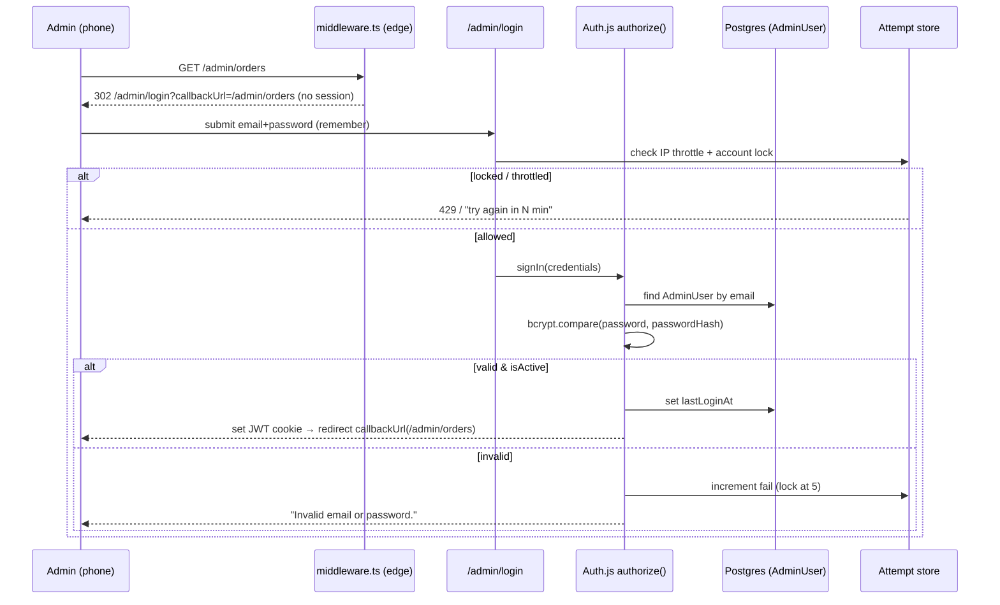

# 10 — Admin Foundation: Auth & Dashboard

> **Project:** `vaani-gift-e-commerce` · **Brand:** GooglyWoogly Art · **Founder/CEO:** Vanshika Bhatia · **Base:** Jaipur, India · **Domain:** `googlywoogly.art`
> **Owner-perspective:** Product/Architect
> **Conforms to:** [`00-canonical-decisions.md`](./00-canonical-decisions.md) (CANON). Where this doc decides something CANON leaves open, the decision is stated inline and surfaced under §11 Open Questions.
> **Authoritative for:** admin authentication (Auth.js Credentials + bcrypt), the `AdminRole` permission matrix across **every** admin area, the admin app shell (sidebar, topbar, breadcrumbs, command palette, mobile chrome), the dashboard home (KPIs, queues, alerts, activity, quick actions), audit logging of admin mutations (`AuditLog`), session/lockout/rate-limit policy, and the first-run/empty state.
> **Not authoritative for:** the field-level entity shapes (`03`), the route map / middleware ordering / cache-tag matrix (`04` — referenced verbatim here), per-area CRUD UX (`11`–`15`), analytics ingestion + rollup internals (`02`/`13`), email/WhatsApp transport (`14`).
> **Builds on existing scaffold:** `components/ui/sidebar.tsx`, `command.tsx` (cmdk vendored), `sheet.tsx`, `dropdown-menu.tsx`, `avatar.tsx`, `breadcrumb.tsx`, `card.tsx`, `table.tsx`, `chart.tsx` (recharts), `sonner`/`toast`, `input-otp`, `badge`, `skeleton`, `empty.tsx`, `alert.tsx`, `kbd.tsx` are already present and are reused — no new primitive libraries are introduced.

---

## 1. Purpose & Scope

### 1.1 What this document covers
1. **Admin authentication** — Auth.js (NextAuth v5) Credentials provider + bcrypt against `AdminUser.passwordHash`; JWT session strategy carrying `adminId` + `role`; the `/admin/login` page; **forgot/reset password** flow (token-based, email-delivered); **account lockout + login rate-limiting**; **no public signup** (admins are seeded/invited only).
2. **Authorization** — the `AdminRole` (`owner | admin | staff`) **permission matrix across every admin area** (CANON §8 routes), enforced at three layers (middleware → server-side `requireAdmin()` → UI gating).
3. **Admin app shell** — the `(admin)` route-group layout: responsive **collapsible sidebar** (grouped per `04` §4.4), **topbar** (brand, env pill, View store, global search, notifications bell, account menu), **breadcrumbs**, a **command palette** (⌘K / Ctrl-K), and **mobile usability** (the founder runs this from a phone).
4. **Dashboard home (`/admin`)** — KPI cards (today / 7d / 30d visitors, orders, revenue-requested, conversion, AOV), the **pending-orders queue**, **low-stock alerts**, **recent-activity feed**, and **quick actions**.
5. **Audit logging** — every admin mutation writes an `AuditLog` row (actor, action, entity, before/after, PII-redacted); the `/admin/audit-log` viewer is specified in §4.10.
6. **First-run / empty states** — the bootstrap admin, zero-data dashboard, and per-area empty copy.

### 1.2 What this document explicitly does NOT cover
- **Shopper authentication / accounts / wishlist.** There is **no shopper login anywhere** (CANON §2, §3). The only auth surface in the entire app is `/admin/*`.
- **On-site payments.** No gateway, no card capture — payment is coordinated off-site on WhatsApp (CANON §1). `paymentStatus` is admin-managed on the order; the dashboard surfaces it but never collects money.
- **The per-area admin CRUD** (products, orders, categories, collections, inventory, content, media, customers, analytics drill-downs, settings) — those are owned by `11`/`12`/`13`/`15`. This doc provides the **shell they mount into**, the **permission matrix that gates them**, and the **audit contract they call**.
- **Analytics ingestion / nightly rollup mechanics** — owned by `02`/`13`. The dashboard **reads** `DailyMetricRollup` (and a thin live read of `Order`/`Product`); it never scans raw `AnalyticsEvent` at request time.
- **Route map, middleware ordering, cache-tag matrix** — owned by `04`. Restated here only where auth/admin behavior is load-bearing.
- **Multi-factor auth, SSO, magic-links** — out of scope for MVP (recorded under §11 / phasing as later hardening).

---

## 2. Primary user stories / jobs-to-be-done

| # | As a… | I want… | so that… |
|---|---|---|---|
| JTBD-1 | Founder (owner) | to sign in securely with email + password from my phone | I can run the whole business from a gated command center anywhere. |
| JTBD-2 | Founder (owner) | a dashboard that shows — at a glance — today's visitors, orders, revenue-requested, conversion, AOV, what needs confirming, and what's low on stock | I know in 10 seconds what to do next without digging through pages. |
| JTBD-3 | Founder (owner) | one tap from the dashboard to add a product or open new orders | I act on the business immediately, on a phone, between other tasks. |
| JTBD-4 | Founder (owner) | a fast keyboard/command palette to jump anywhere | I navigate a deep admin without hunting through menus. |
| JTBD-5 | Founder (owner) | to add a `staff` helper who can fulfil orders but cannot see cost/margin, settings, or delete things | I can delegate safely without exposing business secrets. |
| JTBD-6 | Staff helper | a focused admin that only shows what I'm allowed to touch, with clear "no access" feedback | I do my job (pack/ship orders, reply to messages) without confusion or risk. |
| JTBD-7 | Founder (owner) | a tamper-evident log of every change anyone made | I can answer "who changed this price / status, and when?" and trust the records. |
| JTBD-8 | Founder (owner) | to reset my password if I forget it, safely, via email | I'm never locked out of my own shop. |
| JTBD-9 | Security / platform | brute-force login attempts to be throttled and locked out | a leaked-password guesser can't walk into the admin. |
| JTBD-10 | Founder (first run) | a guided empty state right after install | I'm told exactly what to set up first (settings, first product, first category). |

---

## 3. Detailed functional requirements

> Numbered, decisive. **MUST** = MVP unless a phase is tagged. Cache-tag names and route names are CANON §8/§9 / `04` verbatim. Entity/field names are CANON §5 / `03` verbatim.

### 3.1 Authentication (Auth.js Credentials + bcrypt)

- **FR-1 — Provider.** Admin auth uses **Auth.js (NextAuth v5)** with the **Credentials provider**. The `authorize()` callback looks up `AdminUser` by **normalized lowercase `email`**, verifies the submitted password against `AdminUser.passwordHash` with **bcrypt.compare**, and rejects if `AdminUser.isActive === false`. There is **no OAuth provider, no email magic-link, no shopper provider** (CANON §4, `02` FR-19).
- **FR-2 — Password hashing.** Passwords are hashed with **bcrypt, cost factor 12**. Plaintext passwords are never stored, never logged, never returned, and never placed in `AuditLog` (`before`/`after` redaction, FR-39). Password set/change goes through a single helper `lib/auth/password.ts` (`hashPassword`, `verifyPassword`).
- **FR-3 — Session strategy.** Sessions use the **JWT strategy** (stateless, serverless-friendly — no DB session table). The signed cookie is **HTTP-only, `Secure`, `SameSite=Lax`**, signed by `AUTH_SECRET`. The JWT/session carries the minimal claim set `{ adminId, role, name, email }` (`role` ∈ `AdminRole`). **No password hash, no PII beyond name/email lives in the token** (`02` FR-20).
- **FR-4 — Session lifetime.** `maxAge = 30 days`, `updateAge = 24h` (sliding refresh on activity). A "Remember me" unchecked at login downgrades to a **session cookie that expires when the browser closes** (decision — phone-first founders mostly stay signed in, so "remember me" defaults **checked**). Idle past `maxAge` ⇒ token invalid ⇒ next request redirects to login (FR-11).
- **FR-5 — `lastLoginAt`.** On every successful sign-in, `AdminUser.lastLoginAt` is set to `now()` (write happens in the Auth.js `signIn` event, not on every request).
- **FR-6 — No public signup.** There is **no registration route, no "create account" UI, no open invite acceptance** in MVP. Admins exist only by (a) the **bootstrap seed** (FR-7) or (b) an **owner creating them** in `/admin/settings → Team` (FR-30, V1-lite — see §3.6). Any request to a would-be signup path 404s.
- **FR-7 — Bootstrap admin (first run).** A seed/CLI script `scripts/create-admin.ts` (run once during deploy) creates the first `AdminUser` with `role = owner` from env-provided credentials (`ADMIN_BOOTSTRAP_EMAIL`, `ADMIN_BOOTSTRAP_PASSWORD`) **only if zero `AdminUser` rows exist**. The script hashes the password (FR-2) and exits. Bootstrap creds are then removed from the environment. (Added env vars — see §11.)

### 3.2 Login page (`/admin/login`)

- **FR-8 — Public-but-`noindex`.** `/admin/login` is the **only** publicly reachable admin route. It is `noindex,nofollow` (page metadata + `X-Robots-Tag` via middleware, `04` §6.3) and excluded from sitemap.
- **FR-9 — Form + validation.** A single email/password form, Zod-validated client + server (`signInSchema`, §6.1). Errors are **generic** — `"Invalid email or password."` — never disclosing whether the email exists (anti-enumeration). The form posts via the Auth.js `signIn("credentials")` action; on success it redirects to `callbackUrl` (sanitized to same-origin `/admin/*`, default `/admin`).
- **FR-10 — `callbackUrl` safety.** `callbackUrl` is accepted only if it is a **relative path beginning `/admin`** and not `/admin/login`; otherwise it falls back to `/admin`. This prevents open-redirect via the login bounce.
- **FR-11 — Auth gate redirect.** Unauthenticated requests to any `/admin/**` except `/admin/login` are redirected by `middleware.ts` to `/admin/login?callbackUrl={originalPath}` (302). After login the user lands back on `{originalPath}` (`04` FR-8). An **already-authenticated** user hitting `/admin/login` is redirected to `/admin`.

### 3.3 Account lockout & rate-limiting

- **FR-12 — Per-account lockout.** After **5 consecutive failed** login attempts for a given email within a **15-minute window**, that account is **locked for 15 minutes**; further attempts return `"Too many attempts. Try again in {N} minutes."` (without confirming the email exists). Successful login resets the counter.
- **FR-13 — Per-IP throttle.** Independently, login POSTs are rate-limited **per IP**: max **10 attempts / 5 minutes**, then **429** with `Retry-After`. This blunts distributed guessing across many emails.
- **FR-14 — Storage of attempt state.** Attempt counters use an `AuthAttempt`-style store. **Decision:** MVP uses an **in-memory + edge-durable** counter (consistent with `02` FR/§ security "in-memory/edge guard MVP; Upstash/Vercel KV in V1"); V1 promotes to **Upstash/Vercel KV** for durability across serverless instances. A lightweight `failedLoginCount` + `lockedUntil` pair MAY also be denormalized onto `AdminUser` for owner visibility (added fields — see §11). No raw passwords are ever stored in attempt state.
- **FR-15 — Honeypot + timing.** The login form includes a hidden honeypot field (`company_url`) that, if filled, silently rejects (bot signal). `authorize()` runs bcrypt compare even on unknown emails (constant-ish time) to avoid a timing oracle.
- **FR-16 — Lockout audit.** A lockout trip writes an `AuditLog` row `action = "auth.lockout"` (actor = the targeted `AdminUser` if resolvable, else a synthetic system actor) so the owner sees attack attempts in `/admin/audit-log`.

### 3.4 Forgot / reset password

- **FR-17 — Request flow.** `/admin/forgot-password` accepts an email, **always** responds with the same neutral message (`"If that email is registered, a reset link has been sent."`) regardless of existence (anti-enumeration). If the email maps to an **active** `AdminUser`, a single-use **reset token** is generated.
- **FR-18 — Reset token.** Token = 32+ char URL-safe random (nanoid), stored **hashed** (SHA-256) with `expiresAt = now()+30min`, single-use, in a `PasswordResetToken` store (added entity — see §11; alternatively a hashed token + expiry pair on `AdminUser`). The emailed link is `/admin/reset-password?token={raw}`. Email is sent via the Resend/SMTP mailer (CANON §4, `14`) and logged to `NotificationLog` (`channel = email`, `template = admin_password_reset`).
- **FR-19 — Reset completion.** `/admin/reset-password` validates the token (exists, unexpired, unused), enforces the **password policy** (FR-20), updates `AdminUser.passwordHash` (FR-2), **invalidates the token** and **resets lockout counters**, writes `AuditLog action = "auth.password_reset"`, and redirects to `/admin/login` with a success toast. Reused/expired/unknown tokens show a generic "link invalid or expired — request a new one" with a re-request CTA.
- **FR-20 — Password policy.** Minimum **10 characters**, must contain at least 3 of {lowercase, uppercase, digit, symbol}, rejected if found in a small built-in common-password denylist. Enforced by `passwordSchema` (Zod) on both set-password surfaces (reset + owner-create + self change-password).
- **FR-21 — Self change-password.** A signed-in admin can change their own password from the **account menu → Security** (`/admin/settings?section=security` or a dedicated sheet), requiring the **current** password, then the new password (policy FR-20). Success writes `AuditLog action = "auth.password_change"` and keeps the session valid.

### 3.5 Authorization & the role-permission matrix

- **FR-22 — Three-layer enforcement.** Authorization is enforced at **(1) middleware** (authenticated-or-bounce; coarse), **(2) server-side `requireRole()`** in every admin Server Action / RSC loader (the real gate; re-reads the Auth.js session — never trusts the client), and **(3) UI gating** (hide/disable controls the role can't use, for clarity — *not* as a security boundary). UI gating alone is never sufficient (`02` FR-21).
- **FR-23 — Role hierarchy.** `owner` ⊇ `admin` ⊇ `staff` for most capabilities, **except** owner-exclusive surfaces (Team/admin-user management, Audit Log write/view, destructive settings) which `admin` does **not** inherit. The canonical matrix is **§5.4** and is the single source for both UI gating and `requireRole()` calls.
- **FR-24 — `requireRole()` contract.** `lib/auth/guards.ts` exports `getSessionAdmin()`, `requireAdmin()` (any active admin role), and `requireRole(min: AdminRole)` / `can(action, ctx)`. A failed check in a Server Action returns a typed `{ ok:false, error:"forbidden" }` (and the UI shows a non-destructive toast); a failed check in an RSC page renders a **403 "You don't have access to this area"** screen with a link back to `/admin` (no redirect loop). Deactivated user (`isActive=false`) mid-session ⇒ treated as unauthenticated on next request (forced re-login).
- **FR-25 — `staff` restrictions (MVP default helper role).** `staff` can: view dashboard (operational cards only — *no* revenue/AOV/cost figures), manage **orders** (status + payment transitions, notes, WhatsApp/email), reply to **messages** and **bulk inquiries**, adjust **inventory** quantities, and **read** catalog. `staff` **cannot**: create/delete products or change price/`costPrice`, edit categories/collections, edit content/CMS, edit **settings**, manage **coupons**, manage **team/admins**, or view **audit log** / customer **financial columns** (`04` §4.4). Enforced server-side (§5.4).
- **FR-26 — Financial redaction for `staff`.** Wherever money that reveals margin/aggregate business performance appears (`Product.costPrice`, dashboard **revenue-requested**/**AOV** KPIs, `Customer.totalRequested`, analytics revenue), it is **omitted from the query/DTO** for `staff` — not merely hidden in CSS. Order-level `grandTotal` **is** visible to `staff` (needed to fulfil/collect-on-delivery context), but cost/margin and cross-order aggregates are not.

### 3.6 Admin user management (Team)

- **FR-30 — Owner-only Team management (V1-lite, MVP-optional).** Lives under `/admin/settings?section=team` (Settings is owner/admin; Team sub-section is **owner-only**). Owner can **create** an `AdminUser` (name, email, role ∈ {`admin`,`staff`} — a second `owner` allowed but warned), **deactivate/reactivate** (`isActive`), **change role**, and **trigger a password reset** for another admin. Owner **cannot deactivate or demote the last active `owner`** (guard). New admins are created **without a usable password** and must set one via the reset flow (FR-17–19); no plaintext password is ever shown. Every team mutation writes `AuditLog`. CANON §15.8 anticipates "one owner + optional staff," so this is intentionally lightweight; full RBAC admin is later.

### 3.7 Admin app shell

- **FR-31 — Route group + layout.** All admin pages live under the `(admin)` route group with `app/(admin)/admin/layout.tsx` rendering the shell (sidebar + topbar + breadcrumbs + content slot + command palette + toaster). The layout is `dynamic = "force-dynamic"`, sets `robots:{ index:false, follow:false }`, and **reads the session once** (server) to pass `{ name, email, role }` to the shell. `/admin/login`, `/admin/forgot-password`, `/admin/reset-password` use a **bare centered auth layout** (no sidebar/topbar).
- **FR-32 — Sidebar = `04` §4.4 verbatim.** The sidebar renders the grouped nav from `04` §4.4 (Overview, Catalog, Sales, Leads, Content, Insights, System) with active-route highlight, **role-gated item visibility** (§5.4), live **badges** (pending orders, low-stock, new leads, new messages, pending reviews V1), and **collapses to an icon-rail** on desktop and to an off-canvas `Sheet` drawer on mobile (reuses `components/ui/sidebar.tsx`). Collapsed/expanded state persists in a cookie.
- **FR-33 — Topbar.** Contains: brand mark + "GooglyWoogly Admin"; an **environment pill** ("Preview"/"Local") shown only when `VERCEL_ENV !== "production"`; **"View store"** (opens `/` in a new tab); a **global order/product search** box (⌘K shortcut hint) that opens the command palette pre-scoped; a **notifications bell** (badge = pending orders + new leads + new messages; opens a popover list deep-linking to the items); and an **account menu** (avatar with initials, name, role badge, links to Security/change-password, Team if owner, and **Sign out**).
- **FR-34 — Breadcrumbs.** Every admin page renders breadcrumbs `Admin › {Section} › {Subsection/Entity}` using `components/ui/breadcrumb.tsx`. The current page is `aria-current="page"`. Entity pages resolve a human label (e.g. order `GW-2026-00042`, product title) rather than the raw id. Admin breadcrumbs are **not** emitted as JSON-LD (admin is `noindex`).
- **FR-35 — Command palette (⌘K / Ctrl-K).** A `cmdk`-based palette (reuse `components/ui/command.tsx`) opens globally with **⌘K (mac) / Ctrl-K (win)** or the topbar search. It provides: (a) **navigation** to any admin section the role can access; (b) **quick actions** ("Add product", "View new orders", "Adjust inventory", "New category"); (c) **entity search** — orders by `orderNumber`/phone/name, products by title/SKU, customers by name/phone — backed by a debounced server search action (§6.2); selecting an entity deep-links to its admin page. Palette respects the **permission matrix** (never lists a forbidden destination). `Esc`/click-away closes; full keyboard nav.
- **FR-36 — Mobile usability (phone-first).** The founder runs the admin from a phone (CANON §2.4, §15.8). Therefore: sidebar becomes a left `Sheet` drawer behind a hamburger; the topbar collapses to hamburger · title · bell · avatar; **a bottom action bar** is *not* used in admin (reserved for storefront), but **primary CTAs are thumb-reachable** and sticky where useful (e.g. "Save" on edit forms); list/table views degrade to **stacked key:value cards** (per `03` §4 "Mobile-first admin"); status changes are **single-tap with a confirm sheet/drawer** (`vaul`); all touch targets ≥ 44 px; the command palette opens from the topbar search on mobile (no keyboard shortcut needed).

### 3.8 Dashboard home (`/admin`)

- **FR-37 — KPI cards.** The dashboard shows KPI cards for **Visitors, Orders, Revenue-requested, Conversion rate, AOV**, each with a **range toggle** (**Today / 7d / 30d**, default Today) and a **delta vs the prior equal period** (▲/▼ % with accessible label). Values are read from **`DailyMetricRollup`** for closed days plus a **live partial** for *today* (today's `Order` rows + a live `AnalyticsSession`/event count) so "Today" isn't blank until the nightly rollup runs. **"Revenue-requested"** is explicitly labeled as *requested, not collected* (payment is offline — CANON §1, glossary), with a tooltip. `staff` sees only **Visitors / Orders / Conversion** (revenue + AOV redacted, FR-26).
- **FR-38 — Pending-orders queue.** A panel listing `Order` where `status = pending_confirmation` (and a secondary tab for `on_hold`), newest first, showing `orderNumber`, customer name, item count, `grandTotal`, age ("2h ago", IST), and `paymentStatus`. Each row deep-links to `/admin/orders/[id]`; a one-tap **"Confirm"** quick-action (and prefilled-WhatsApp) is available inline (action owned by `12`, surfaced here). Badge count mirrors the sidebar **Orders** badge.
- **FR-39 — Low-stock alerts.** A panel listing `Product` whose derived `inventoryState ∈ { low_stock, out_of_stock }` (computed per CANON §6 from `inventoryQuantity`/`lowStockThreshold`/`madeToOrder`; `made_to_order` items are **excluded** since always orderable). Shows title, thumbnail, `inventoryQuantity`, state badge, deep-links to `/admin/inventory` (filtered) and inline **"Adjust"** quick-action. Badge mirrors the sidebar **Inventory** badge.
- **FR-40 — Recent-activity feed.** A reverse-chronological feed sourced from **`AuditLog`** joined to `AdminUser` (and recent `OrderStatusEvent`s), rendering human sentences ("Vanshika confirmed order GW-2026-00042", "Stock for 'Hand-painted Diya Set' set to 8", "New bulk inquiry from Acme Pvt Ltd"). Owner/admin see all; `staff` see only entries they're permitted to see (no settings/price/team entries). Links each item to its entity.
- **FR-41 — Quick actions.** Always-visible primary actions: **Add product** (`/admin/products/new`), **View new orders** (`/admin/orders?status=pending_confirmation`), **Adjust inventory** (`/admin/inventory`), **New category** (`/admin/categories`). Role-gated (e.g. `staff` sees only "View new orders" + "Adjust inventory"). On mobile these are a 2-up grid of large tap targets at the top.
- **FR-42 — Operational alert strip.** A dismissible top strip surfaces **actionable operational alerts**: count of pending orders > 0, low-stock count > 0, new messages/inquiries, and **setup nags** in first-run (e.g. "Add your WhatsApp number in Settings", "Publish your first product"). Each alert links to the fix.
- **FR-43 — Dashboard is read-only + cache-free.** `/admin` is **SSR `force-dynamic`, no full-page cache** (`04`). It performs **bounded** queries (indexed reads on `DailyMetricRollup` by date, `Order` by `status`+`createdAt`, `Product` low-stock filter, `AuditLog` recent) — it never scans raw `AnalyticsEvent` (CANON §12, `02` FR-30).

### 3.9 Audit logging

- **FR-44 — Every admin mutation is audited.** Every admin-initiated **write** (create/update/delete/status-change/publish/reorder/settings-save/auth event) MUST write an `AuditLog` row: `{ adminId, action, entityType, entityId, before?, after?, createdAt }`. This is enforced centrally by a **`withAudit()` service wrapper** (`lib/audit.ts`) that all admin Server Actions route their mutation through — so auditing can't be forgotten per-call. Read-only admin views do **not** audit.
- **FR-45 — `action` naming.** `action` is `"{entity}.{verb}"` snake/dot convention: e.g. `product.create`, `product.update`, `product.archive`, `order.status_change`, `order.payment_change`, `category.reorder`, `cms_page.publish`, `site_setting.update`, `coupon.create` (V1), `review.moderate` (V1), `admin_user.create`, `admin_user.role_change`, `auth.login`*, `auth.lockout`, `auth.password_reset`, `auth.password_change`. (*successful logins MAY be audited at `info` level — decision: **log lockouts + resets + team changes always**; routine logins optional to avoid noise — see §11.)
- **FR-46 — before/after snapshots, PII-redacted.** `before`/`after` capture the **changed subset** of the entity as JSON (`03` §3.5). PII (full address, phone, email beyond a masked form) and secrets (`passwordHash`, tokens) are **redacted** before persistence (`03` FR-37). For creates, `before = null`; for deletes/archives, `after` reflects the terminal state.
- **FR-47 — Append-only & tamper-evidence.** `AuditLog` is **append-only** — no admin UI edits or deletes rows; there is no delete action. `AuditLog.adminId` FK is `Restrict` (an admin with audit history can't be hard-deleted — deactivate instead) per `03` §3.6. Retention: indefinite in MVP (policy in §11).
- **FR-48 — Viewer.** `/admin/audit-log` (owner-only; admin read MAY be allowed — decision: **owner-only** per `04` §4.4 "owner-visible") lists rows newest-first with filters by `adminId`, `entityType`, `action`, and date range, and a `before`/`after` diff drawer. Read-only.

---

## 4. UX / UI breakdown (screen-by-screen)

> Components in back-ticks already exist in `components/ui/*`. Copy is **direction**, not final microcopy. All screens are `noindex`, IST timestamps, `₹`/`en-IN` money, brand pink theme verified for **WCAG AA** contrast (CANON §4 caveat).

### 4.1 Admin shell layout (frame for all gated pages)

```
┌──────────────────────────────────────────────────────────────────────────────┐
│  TOPBAR                                                                        │
│  [≡] GooglyWoogly Admin   ·Preview·     [ 🔍 Search… ⌘K ]   [🔔3]  [VG ▾]      │
├───────────────┬────────────────────────────────────────────────────────────────┤
│  SIDEBAR      │  Admin › Orders › GW-2026-00042            (breadcrumbs)       │
│  Overview     │  ┌──────────────────────────────────────────────────────────┐  │
│   ▸ Dashboard │  │                                                          │  │
│  Catalog      │  │     PAGE CONTENT (per-area, owned by 11–15)              │  │
│   ▸ Products  │  │                                                          │  │
│   ▸ Inventory⁵│  │                                                          │  │
│   ▸ Categories│  │                                                          │  │
│   ▸ Collections                                                              │  │
│   ▸ Media     │  │                                                          │  │
│  Sales        │  │                                                          │  │
│   ▸ Orders ³  │  │                                                          │  │
│   ▸ Customers │  └──────────────────────────────────────────────────────────┘  │
│  Leads        │                                                                │
│   ▸ Bulk ¹    │                                                                │
│   ▸ Messages ²│                                                                │
│  …            │                                                                │
│  System       │                                                                │
│   ▸ Settings  │                                                                │
│   ▸ Audit Log │                                                                │
└───────────────┴────────────────────────────────────────────────────────────────┘
   badges: ³pending-orders ⁵low-stock ¹new-inquiries ²new-messages
```

| Region | Component | Behavior |
|---|---|---|
| Sidebar | `sidebar.tsx` | Grouped per `04` §4.4; active highlight; role-gated items; live badges; desktop icon-rail collapse (persisted cookie); mobile → `Sheet` drawer. |
| Topbar | `card`/flex + `dropdown-menu` + `avatar` + `badge` | Brand, env pill (non-prod), View store, search (opens palette), bell popover, account menu. Sticky top. |
| Breadcrumbs | `breadcrumb.tsx` | `Admin › … › entity`; resolves entity labels; `aria-current`. |
| Content slot | RSC children | Per-area pages; own `loading.tsx` skeletons. |
| Command palette | `command.tsx` (cmdk) | Global ⌘K; nav + quick actions + entity search; permission-aware. |
| Toaster | `sonner`/`toast` | Action success/error feedback. |

**Responsive:** ≥1024px = persistent sidebar (collapsible to rail). 768–1023px = sidebar collapses to rail by default. <768px = sidebar hidden behind hamburger `Sheet`; topbar condenses; content full-bleed; sticky form action bars.

### 4.2 Login (`/admin/login`)

- **Layout:** bare centered card (no shell). Brand logo, "Sign in to GooglyWoogly Admin", email + password fields (`form` + `input`), **Remember me** checkbox (default on), **Forgot password?** link, primary **Sign in** button (full-width, ≥44px), hidden honeypot.
- **Copy direction:** generic error banner `"Invalid email or password."`; lockout banner `"Too many attempts. Try again in {N} min."`; below-form helper `"Admin access only."`.
- **Interactions:** Enter submits; button shows spinner + disables during request; on success redirect to sanitized `callbackUrl`/`/admin`. Autofill-friendly (`autocomplete="email"`/`"current-password"`).
- **Mobile:** single column, large fields, numeric-safe keyboard not forced; password reveal toggle.

### 4.3 Forgot password (`/admin/forgot-password`)

- Single email field + **Send reset link**. Neutral success state always: `"If that email is registered, a reset link has been sent. Check your inbox."` Link back to login. Rate-limited (FR-13).

### 4.4 Reset password (`/admin/reset-password?token=…`)

- New-password + confirm fields with **live policy checklist** (length, character classes — FR-20), reveal toggle, **Set new password** button. Invalid/expired token → generic error card + **Request a new link** CTA. On success → toast + redirect to login.

### 4.5 Dashboard home (`/admin`)

```
Admin › Dashboard
┌──────────────────────────────────────────── Operational alerts (dismissible) ──┐
│  ⚠ 3 orders awaiting confirmation · 2 products low on stock · 1 new message     │
└────────────────────────────────────────────────────────────────────────────────┘
Range: [ Today | 7d | 30d ]          Quick: [+ Add product] [View new orders] [Adjust stock]
┌──────────┬──────────┬──────────────────┬──────────────┬──────────┐
│ Visitors │ Orders   │ Revenue-requested│ Conversion   │ AOV      │   ← KPI cards
│  142     │   6      │  ₹18,450 *req    │  4.2% ▲0.6   │ ₹3,075   │     (staff: 3 cards)
│  ▲ 12%   │  ▲ 2     │  ▲ 8%            │              │ ▼ 4%     │
└──────────┴──────────┴──────────────────┴──────────────┴──────────┘
┌───────────────────────────────┬───────────────────────────────┐
│ Pending orders (3)            │ Low stock (2)                 │
│ GW-2026-00042 · Riya · ₹1,499 │ Hand-painted Diya Set · 2 left│
│   2h ago · unpaid  [Confirm]  │ Brass Tealight · OUT  [Adjust]│
│ GW-2026-00041 · …             │ …                             │
│  [ View all orders → ]        │  [ Manage inventory → ]       │
├───────────────────────────────┴───────────────────────────────┤
│ Recent activity                                                │
│ • Vanshika confirmed order GW-2026-00041 · 10m ago             │
│ • Stock for 'Brass Tealight' set to 0 · 1h ago                 │
│ • New bulk inquiry from Acme Pvt Ltd · 3h ago                  │
│  [ View audit log → ] (owner)                                  │
└────────────────────────────────────────────────────────────────┘
```

| Section | Component | Data | Role notes |
|---|---|---|---|
| Alert strip | `alert.tsx` | derived counts | first-run setup nags |
| KPI cards | `card` + `chart` (sparkline optional) | `DailyMetricRollup` + live today | `staff`: Visitors/Orders/Conversion only |
| Pending orders | `card` + list/`table` | `Order` (`pending_confirmation`/`on_hold`) | all roles |
| Low stock | `card` + list | `Product` (derived state) | all roles |
| Recent activity | `card` + feed | `AuditLog` + `OrderStatusEvent` | `staff`: filtered |
| Quick actions | `button` grid | — | role-gated |

**States:** see §7. **Mobile:** alert strip → stacked; quick actions → 2-up grid on top; KPI cards → horizontal snap-scroll or 2-col grid; panels stack vertically; each list row is a tappable card.

### 4.6 Command palette (⌘K)

Overlay `command.tsx`: search input → grouped results: **Go to** (sections), **Actions** (Add product / View new orders / Adjust inventory / New category), **Orders** (live), **Products** (live), **Customers** (live). Keyboard: ↑/↓ navigate, Enter open, `Esc` close. Empty query shows recent + quick actions. Permission-aware (forbidden items absent).

### 4.7 Notifications bell

`dropdown-menu`/`popover` listing newest pending orders, new bulk inquiries, new contact messages (each deep-linked), with a "Mark all seen" (client-side seen-state) and "View all orders/leads" footers. Badge = pending orders + new leads + new messages.

### 4.8 Account menu

`dropdown-menu` from avatar (initials): shows name + role `badge`; items → **Change password** (sheet, FR-21), **Team** (owner only → `/admin/settings?section=team`), **View store**, **Sign out** (calls Auth.js `signOut`, returns to `/admin/login`).

### 4.9 403 / no-access screen

When an authenticated admin hits an area their role can't access: a centered `empty.tsx`-style card — "You don't have access to this area. Ask the owner if you need it." + **Back to dashboard**. No redirect loop; `staff`-forbidden sidebar items are simply absent (defense-in-depth still 403s on direct URL).

### 4.10 Audit log viewer (`/admin/audit-log`, owner)

Filter bar (admin · entityType · action · date-range) over a reverse-chron `table` of `{ time (IST), admin, action, entity, entityId }`; row opens a drawer with a **before → after** JSON diff (redacted). Read-only; CSV export = V1.

---

## 5. Data & entities used

> Names are CANON §5 / `03` verbatim. R = read, W = written.

### 5.1 Primary entities

| Entity | R/W | Fields used | Where |
|---|---|---|---|
| `AdminUser` | R/W | `id, name, email, passwordHash, role, isActive, lastLoginAt` | Auth `authorize()`, session, Team mgmt, account menu |
| `AuditLog` | W (R in viewer/feed) | `id, adminId, action, entityType, entityId, before, after, createdAt` | every admin mutation (FR-44); dashboard feed; audit viewer |
| `DailyMetricRollup` | R | `date, visitors, sessions, orders, revenueRequested, conversionRate, addToCarts, beginCheckouts, productViews` | dashboard KPIs |
| `Order` | R | `id, orderNumber, status, paymentStatus, customerName, grandTotal, createdAt` | pending queue, KPI live-today, command palette search |
| `OrderStatusEvent` | R | `orderId, status, changedByAdminId, createdAt, note` | recent-activity feed |
| `Product` | R | `id, slug, title, inventoryQuantity, lowStockThreshold, madeToOrder, primaryImageId, price` (no `costPrice` for staff) | low-stock panel, palette product search |
| `Customer` | R | `id, name, phone` (no `totalRequested` for staff) | command-palette customer search |
| `BulkInquiry` | R | `id, name, company, status, createdAt` | bell, leads badge, activity |
| `ContactMessage` | R | `id, name, status, createdAt` | bell, messages badge |
| `NotificationLog` | W | `channel, template, to, status` | password-reset email send |

### 5.2 Added/auxiliary state (mechanism, not new product scope — see §11)

| Store | Purpose |
|---|---|
| Login-attempt counter (in-memory/edge → KV in V1) | lockout (FR-12) + per-IP throttle (FR-13) |
| `PasswordResetToken` (or hashed-token+expiry on `AdminUser`) | forgot/reset flow (FR-18) |
| Sidebar collapsed-state cookie; notifications "seen" client state | shell UX |

### 5.3 Derived/computed
- `inventoryState` — derived at read for the low-stock panel (CANON §6 rule), **not stored** (`03` FR-12).
- **KPI deltas** — current-period vs prior-equal-period, computed from `DailyMetricRollup` ranges (+ live today).
- **AOV** = `revenueRequested / orders` for the range (guard divide-by-zero → "—").
- **Conversion** = `orders / sessions` (basis points in rollup; display %).

### 5.4 Role → permission matrix (CANONICAL for this app)

> The single source for both UI gating and server-side `requireRole()` / `can()`. ✅ allowed · 👁 read-only · ⛔ no access · 💲no-financials.

| Admin area / capability | Route | `owner` | `admin` | `staff` |
|---|---|---|---|---|
| Dashboard (full KPIs incl. revenue/AOV) | `/admin` | ✅ | ✅ | 💲 (Visitors/Orders/Conversion only) |
| Products — view | `/admin/products` | ✅ | ✅ | 👁 |
| Products — create/edit/archive, price | `/admin/products/*` | ✅ | ✅ | ⛔ |
| Product `costPrice` / margin | (field) | ✅ | ✅ | ⛔ |
| Inventory — adjust qty | `/admin/inventory` | ✅ | ✅ | ✅ |
| Categories — CRUD/reorder | `/admin/categories` | ✅ | ✅ | ⛔ |
| Collections — CRUD/rules/members | `/admin/collections` | ✅ | ✅ | ⛔ |
| Media — upload/delete | `/admin/media` | ✅ | ✅ | 👁 (attach only) |
| Orders — view + status/payment transitions, notes, WhatsApp/email | `/admin/orders/*` | ✅ | ✅ | ✅ |
| Customers — list/detail, tags/notes | `/admin/customers` | ✅ | ✅ | 💲 (no `totalRequested`) |
| Coupons (V1) | `/admin/coupons` | ✅ | ✅ | ⛔ |
| Bulk inquiries — pipeline/assign/notes | `/admin/bulk-inquiries` | ✅ | ✅ | ✅ |
| Messages — inbox/status/reply | `/admin/messages` | ✅ | ✅ | ✅ |
| Reviews — moderate (V1) | `/admin/reviews` | ✅ | ✅ | ⛔ |
| Content / CMS — home/banners/testimonials/FAQ/pages | `/admin/content` | ✅ | ✅ | ⛔ |
| Analytics — reports/funnel | `/admin/analytics` | ✅ | ✅ | ⛔ |
| Settings (`SiteSetting`) | `/admin/settings` | ✅ | ✅ (non-destructive) | ⛔ |
| Team / admin-user management | `/admin/settings?section=team` | ✅ | ⛔ | ⛔ |
| Audit Log | `/admin/audit-log` | ✅ | ⛔ | ⛔ |

> Decisions baked in: **`admin`** is a near-owner operator but **cannot** manage other admins or read the audit log (those are owner-exclusive accountability surfaces). **`staff`** is the fulfilment helper from CANON §15.8 — orders/leads/inventory yes; catalog/content/settings/financials no. This is stricter than the `04` §4.4 summary (which only named staff hides Settings/Audit/Coupons/financial columns); the additional catalog/content/collections lockdown is **added here** and recorded in §11.

---

## 6. Server actions / API routes

> Inputs are **Zod-validated**; every mutating admin action runs through `requireRole()` (§5.4) **and** `withAudit()` (FR-44). Auth endpoints are owned by Auth.js. Cache-tag column references `04` §7 / CANON §9.

### 6.1 Auth & account actions

| Action / route | Inputs (Zod) | Output | Side effects | Revalidates |
|---|---|---|---|---|
| `POST /api/auth/[...nextauth]` (Auth.js Credentials) | `signInSchema { email:string.email().lower, password:string, remember?:boolean, honeypot?:"" }` | session cookie / error | `authorize()` (bcrypt verify, `isActive` check, lockout check FR-12, IP throttle FR-13); on success set `AdminUser.lastLoginAt`; on lock → `AuditLog auth.lockout` | — |
| `signOut` (Auth.js) | — | redirect `/admin/login` | clears cookie | — |
| `requestPasswordReset` (action) | `{ email: string.email().lower, honeypot?:"" }` | neutral `{ ok:true }` always | if active user: create hashed `PasswordResetToken` (30 min), send `admin_password_reset` email → `NotificationLog`; rate-limited per-IP/email | — |
| `resetPassword` (action) | `{ token:string, password: passwordSchema, confirm:string }` (refine equal) | `{ ok:true }` / `invalid_token` | validate+consume token, update `passwordHash`, reset lockout, `AuditLog auth.password_reset` | — |
| `changeOwnPassword` (action) | `{ currentPassword:string, newPassword: passwordSchema, confirm }` | `{ ok:true }` / `wrong_password` | verify current, update hash, `AuditLog auth.password_change` | — |

`passwordSchema` = `z.string().min(10)` + class/denylist refinement (FR-20). `signInSchema.email` lowercased + trimmed.

### 6.2 Shell & dashboard reads (RSC loaders / search actions)

| Action / route | Inputs (Zod) | Output | Notes |
|---|---|---|---|
| `getDashboardData` (RSC) | `{ range: "today"\|"7d"\|"30d" }` | `{ kpis, deltas, pendingOrders[], lowStock[], activity[], alerts[] }` (financials omitted for `staff`) | `requireAdmin()`; bounded indexed reads; no raw-event scan (FR-43) |
| `commandSearch` (action) | `{ q: string.min(1), scope?: "orders"\|"products"\|"customers" }` | `{ orders[], products[], customers[] }` (≤8 each) | `requireAdmin()`; permission-filtered; debounced; financial fields stripped for `staff` |
| `getNavBadges` (RSC/action) | — | `{ pendingOrders, lowStock, newInquiries, newMessages, pendingReviews? }` | counts only; cheap; refreshed on shell render / interval |
| `getAuditLog` (RSC) | `{ adminId?, entityType?, action?, from?, to?, cursor? }` | `{ rows[], nextCursor }` | `requireRole("owner")`; read-only |

### 6.3 Admin-user (Team) actions — owner only

| Action | Inputs (Zod) | Output | Side effects | Revalidates |
|---|---|---|---|---|
| `createAdminUser` | `{ name, email.lower, role: "admin"\|"staff"\|"owner" }` | `{ adminId }` | create `AdminUser` (no usable password), issue reset token + email; `AuditLog admin_user.create` | — |
| `setAdminRole` | `{ adminId, role }` | `{ ok }` | guard: not last owner; update `role`; `AuditLog admin_user.role_change` | — |
| `setAdminActive` | `{ adminId, isActive }` | `{ ok }` | guard: not last active owner; toggle; `AuditLog admin_user.activate/deactivate` | — |
| `triggerAdminReset` | `{ adminId }` | `{ ok }` | issue reset token + email for another admin; `AuditLog admin_user.reset_triggered` | — |

### 6.4 Audit wrapper (used by ALL admin mutations across `11`–`15`)

`withAudit(ctx, { action, entityType, entityId, before, after }, fn)` — runs `fn` (the mutation) in a transaction, then appends the redacted `AuditLog` row with `adminId = ctx.session.adminId`. Exported from `lib/audit.ts`; **mandated** by FR-44. (The per-area cache-tag revalidations are owned by `04` §7 / the feature spec; auditing is orthogonal and always-on.)

**Cache note:** none of the actions in this doc revalidate storefront tags — auth, dashboard, audit, and team are admin-only/no-store surfaces (`04` §7 "Never-cached"). Storefront revalidation belongs to the feature mutations those actions wrap.

---

## 7. States & edge cases

| Scenario | Surface | Behavior |
|---|---|---|
| **Loading** | dashboard, lists, palette | `skeleton`/`loading.tsx` placeholders (KPI shimmer, list rows); never blank. |
| **First run / zero data** | `/admin` | KPI cards show `—`/`0`; panels show empty states; **setup checklist** alert: "1) Add WhatsApp number & store info in Settings 2) Create a category 3) Publish your first product". (FR-42, FR-10.) |
| **Empty pending queue** | dashboard | "You're all caught up — no orders awaiting confirmation." (positive empty.) |
| **Empty low-stock** | dashboard | "Stock looks healthy." |
| **No rollup yet for today** | KPI "Today" | live partial from `Order`/sessions; tooltip "Today updates live; full metrics finalize overnight." |
| **Invalid credentials** | login | generic `"Invalid email or password."`; no enumeration; increments attempt counter. |
| **Account locked** | login | `"Too many attempts. Try again in {N} min."`; `AuditLog auth.lockout`. |
| **IP throttled** | login/forgot | 429 + `Retry-After`; friendly "Please wait a moment and try again." |
| **Expired/used/unknown reset token** | reset | generic "link invalid or expired" + request-new CTA. |
| **Deactivated mid-session** | any admin | next request: session treated invalid → redirect to login with "Your access was updated — please sign in." |
| **`staff` hits owner/admin-only URL directly** | e.g. `/admin/settings`, `/admin/audit-log`, `/admin/collections` | server `requireRole` → **403 no-access screen** (§4.9); item also absent from sidebar. |
| **Session expired (JWT past maxAge)** | in-flight action | action returns `unauthorized`; client toasts + redirects to login (`02` edge-case table). |
| **`callbackUrl` open-redirect attempt** | login | non-`/admin` or `/admin/login` target ignored → `/admin`. |
| **Last-owner safety** | Team | cannot deactivate/demote the only active `owner`; guarded with explanatory error. |
| **Bell/badge counts stale** | shell | counts re-read on each shell render + light interval; eventual-consistent (not real-time critical). |
| **Mutation fails after audit intent** | any admin write | `withAudit` runs mutation+log in one transaction → no orphan audit row on failure; user sees error toast. |
| **Network/Server error** | any | `error.tsx` admin boundary + Sentry capture (CANON §4); retry affordance. |
| **JS disabled / palette** | shell | sidebar links are real `<a>` (navigable without JS); palette is a progressive enhancement. |

**Auth flow (sequence):**



**Authorization (per request):**

```mermaid
flowchart TD
  A[Request /admin/**] --> B{middleware: valid session?}
  B -- no --> C[302 /admin/login?callbackUrl]
  B -- yes --> D[RSC/Action: getSessionAdmin]
  D --> E{isActive?}
  E -- no --> C
  E -- yes --> F{requireRole(area) per §5.4}
  F -- allowed --> G[render / mutate → withAudit]
  F -- denied --> H[403 no-access screen / forbidden result]
```

---

## 8. SEO / performance / accessibility

- **SEO:** the **entire** admin surface (incl. `/admin/login`, `forgot`, `reset`) is `noindex,nofollow` via page metadata **and** `X-Robots-Tag` from middleware (`04` §6.3), and excluded from `sitemap.xml`/`robots.txt` (`robots.txt` disallows `/admin`). No canonical, no structured data on admin.
- **Performance:** admin pages are `force-dynamic` but **lightweight** — dashboard reads pre-aggregated `DailyMetricRollup` + a handful of indexed `Order`/`Product`/`AuditLog` queries (no raw `AnalyticsEvent` scan, FR-43). The shell ships a small client bundle (sidebar/palette/menus); page bodies stay RSC where possible. `loading.tsx` streaming on the dashboard and lists. Badges/bell use cheap count queries. Command-palette search is debounced + capped.
- **Accessibility (WCAG AA, CANON §4):** Radix-based `sidebar`/`dropdown-menu`/`command`/`sheet` give keyboard + ARIA for free; visible focus rings; **skip-to-content** in the admin layout; one `<header>`/`<nav>`/`<main id="content">` per page; the command palette is a labelled dialog with `aria-activedescendant`; KPI deltas have text labels (not color-only — ▲/▼ + "+12%"); all touch targets ≥44 px (phone-first); status/confirm sheets are focus-trapped; live regions announce toast results. Brand-pink theme contrast is verified AA on nav/active states (CANON §4 caveat).

---

## 9. Analytics events emitted

> The admin app is an **operations console, not a tracked storefront surface**. The CANON `AnalyticsEventType` set (`page_view`…`outbound_click`) describes **shopper** behavior and is emitted by the storefront (`04` §11, `13`); the admin shell deliberately emits **none** of them — admin activity is recorded in **`AuditLog`**, not `AnalyticsEvent` (separation of business-operations audit vs marketing analytics).

| Concern | Mechanism (not `AnalyticsEventType`) |
|---|---|
| Admin mutations | `AuditLog` row per write (FR-44) — the admin "event log". |
| Order status transitions | `OrderStatusEvent` (owned by `12`) — surfaced in the activity feed. |
| Notification sends (reset email) | `NotificationLog` (CANON §5). |
| Auth security events | `AuditLog` `auth.lockout` / `auth.password_reset` / `auth.password_change`. |
| `whatsapp_click` from admin order screens | The **storefront `AnalyticsEventType.whatsapp_click`** is a shopper-side event; admin-initiated WhatsApp opens are *not* analytics-tracked (owned by `12`/`14`). |

> If admin-usage telemetry is later desired, it goes to a **separate** internal log, **not** the shopper `AnalyticsEvent` table (keeps funnel/rollups clean). Recorded as a non-MVP idea in §11.

---

## 10. Acceptance criteria

**Auth**
- [ ] **AC-1** Admin sign-in uses Auth.js Credentials + **bcrypt (cost 12)** against `AdminUser.passwordHash`; inactive users (`isActive=false`) cannot sign in; no OAuth/shopper provider exists.
- [ ] **AC-2** Sessions are **JWT** (HTTP-only, Secure, SameSite=Lax) signed by `AUTH_SECRET`, carrying `{adminId, role, name, email}`; `maxAge=30d`, sliding refresh; `lastLoginAt` set on sign-in.
- [ ] **AC-3** There is **no signup route/UI**; the first owner is created only by the bootstrap seed when zero admins exist.
- [ ] **AC-4** Login errors are generic (no email enumeration); a hidden honeypot is present; bcrypt runs even for unknown emails (no timing oracle).
- [ ] **AC-5** **5 fails / 15 min ⇒ 15-min account lock**; **10 POSTs / 5 min / IP ⇒ 429**; lockouts write `AuditLog auth.lockout`.
- [ ] **AC-6** Forgot-password returns a neutral message regardless of existence; reset token is **hashed, single-use, 30-min**; completing it updates the hash, clears lockout, and audits `auth.password_reset`.
- [ ] **AC-7** Self change-password requires the current password and enforces the password policy (≥10 chars, ≥3 classes, denylist).

**Authorization**
- [ ] **AC-8** Every `/admin/**` (except login/forgot/reset) is gated by `middleware.ts` **and** re-checked server-side via `requireRole()`/`requireAdmin()` — client gating is never the only guard.
- [ ] **AC-9** The **§5.4 matrix** is enforced: `staff` cannot reach products-write/categories/collections/content/settings/coupons/reviews/analytics/team/audit (direct URL ⇒ 403), and never receives `costPrice`/revenue/AOV/`totalRequested` in any DTO; `admin` cannot reach Team or Audit Log.
- [ ] **AC-10** A user deactivated mid-session is forced to re-login on the next request.

**Shell**
- [ ] **AC-11** The `(admin)` layout renders sidebar (grouped per `04` §4.4, role-gated, live badges, rail/`Sheet` collapse), topbar (env pill non-prod, View store, search, bell, account menu), breadcrumbs, and a ⌘K command palette; login/forgot/reset use the bare auth layout.
- [ ] **AC-12** The command palette offers permission-aware navigation + quick actions + live entity search (orders/products/customers) and is fully keyboard-operable.
- [ ] **AC-13** The admin is usable on a phone: sidebar→drawer, tables→stacked cards, single-tap status changes with confirm sheet, ≥44px targets.

**Dashboard**
- [ ] **AC-14** KPI cards show Visitors/Orders/Revenue-requested/Conversion/AOV with Today/7d/30d toggle + prior-period delta; "Revenue-requested" is labeled *requested, not collected*; `staff` sees only the 3 non-financial cards; "Today" renders live before the nightly rollup.
- [ ] **AC-15** Pending-orders queue lists `status=pending_confirmation` (+`on_hold`) with deep-links + inline Confirm; low-stock panel lists derived `low_stock`/`out_of_stock` (excludes `made_to_order`); recent-activity feed reads `AuditLog`(+`OrderStatusEvent`); quick actions are role-gated.
- [ ] **AC-16** The dashboard performs only bounded indexed reads (`DailyMetricRollup`/`Order`/`Product`/`AuditLog`) and never scans raw `AnalyticsEvent`.

**Audit**
- [ ] **AC-17** Every admin mutation writes an `AuditLog` row via `withAudit()` with `{adminId, action, entityType, entityId, before?, after?}`; `passwordHash`/tokens/PII are redacted; reads are not audited.
- [ ] **AC-18** `AuditLog` is append-only (no edit/delete UI); `/admin/audit-log` is owner-only with admin/entity/action/date filters + before→after diff.

**Cross-cutting**
- [ ] **AC-19** All admin routes are `noindex,nofollow` (metadata + `X-Robots-Tag`) and excluded from sitemap/robots; no admin action revalidates a storefront cache tag.
- [ ] **AC-20** All money is `₹`/`en-IN`, timestamps display IST; AA contrast verified; Sentry captures admin errors.

---

## 11. Dependencies, assumptions & open questions

### 11.1 Dependencies
- **`00-canonical-decisions`** — `AdminRole`/`AdminUser`/`AuditLog`/`DailyMetricRollup` names, JWT/bcrypt decision, route set, `noindex` policy, KPI list (§12). Hard contract.
- **`02-system-architecture`** — Auth.js config (`auth.ts`), `middleware.ts` gate, `requireAdmin()`/guards, env vars (`AUTH_SECRET`, `AUTH_TRUST_HOST`), in-memory→KV rate-limit decision, mailer (`lib/email/send.ts`), `NotificationLog`.
- **`03-data-model`** — `AdminUser`/`AuditLog` field tables, before/after redaction (FR-37), `AuditLog.adminId` `Restrict`, JSON shapes; **must add** the password-reset/lockout storage decided here.
- **`04-IA-routing`** — admin sidebar groups (§4.4), middleware ordering + `X-Robots-Tag` (§6.3), the auth-gate redirect (FR-8), the no-cache admin set (§7). This doc fills in the *flesh* of the admin shell `04` defines as the *skeleton*.
- **`13-analytics`** — `DailyMetricRollup` schema + nightly cron the dashboard reads; funnel definitions.
- **`11`/`12`/`15`** — the per-area mutations that **must** call `withAudit()` + `requireRole()` defined here; `12` owns the order Confirm/WhatsApp actions surfaced on the dashboard.
- **Scaffold:** `sidebar.tsx`, `command.tsx`, `sheet.tsx`, `dropdown-menu.tsx`, `avatar.tsx`, `breadcrumb.tsx`, `card.tsx`, `table.tsx`, `chart.tsx`, `sonner`/`toast`, `input-otp`, `badge`, `skeleton`, `empty.tsx`, `alert.tsx`, `kbd.tsx`, `vaul` (drawer) — all present.
- **`13-analytics-and-reporting.md` is not yet authored** at time of writing; this spec relies on the CANON §12 KPI list + `03` `DailyMetricRollup` shape as the contract and must stay consistent with `13` once written. **Flagged.**

### 11.2 Assumptions (decisive calls made here)
1. **JWT (no DB session store)** per CANON §15.8 / `02` FR-20 — sufficient for a 1–3 person admin.
2. **Lockout:** 5 fails/15 min → 15-min lock; **IP throttle** 10/5 min. (Reasonable defaults; tune later.)
3. **Reset token:** 30-min, hashed, single-use; delivered via the transactional mailer + logged to `NotificationLog`.
4. **Password policy:** ≥10 chars / ≥3 classes / denylist.
5. **Bootstrap owner** via one-time seed env creds; **no signup** ever.
6. **`admin` role** is a full operator **minus** Team + Audit Log (owner-exclusive accountability). **`staff`** = fulfilment helper (orders/leads/inventory/messages; no catalog/content/settings/financials).
7. **"Remember me" defaults on** (phone-first founder stays signed in).
8. Admin activity is logged to **`AuditLog`**, not `AnalyticsEvent` (analytics is shopper-only).
9. Dashboard "Today" KPI = nightly rollup **plus** a live partial so it's never blank.

### 11.3 Open questions (founder / cross-spec)
- **OQ-1 — Added storage entities not in CANON §5.** This spec needs a **`PasswordResetToken`** store (or hashed-token+expiry fields on `AdminUser`) and **login-attempt/lockout** state (in-memory/edge → KV), plus optional `failedLoginCount`/`lockedUntil` on `AdminUser`. None exist in CANON §5 / `03`. **Decision taken** (introduce them); **needs adding to `03-data-model`.** *(Conflict/gap vs CANON §5.)*
- **OQ-2 — `staff` scope stricter than `04` §4.4.** `04` only said staff hides Settings/Audit/Coupons/financial columns. I additionally lock **products-write, categories, collections, content/CMS, analytics** for `staff` (fulfilment-only helper). **Confirm** this is the intended `staff` boundary, or relax to "everything except financials + settings + team + audit."
- **OQ-3 — Does `admin` get Audit Log (read)?** `04` §4.4 says audit log is "owner-visible." I kept it **owner-only**. Confirm whether a trusted `admin` should also read it.
- **OQ-4 — Should successful logins be audited?** I log **lockouts/resets/team/role changes always**; routine successful logins are **optional** (noise vs. traceability). Confirm preference (recommend logging logins too, at low volume).
- **OQ-5 — Rate-limit backing store at launch.** MVP uses in-memory/edge counters (per `02`); promotes to **Upstash/Vercel KV** in V1 for durability across serverless instances. Confirm acceptable for launch (single-region, low concurrency makes this fine).
- **OQ-6 — `13-analytics` not yet written.** KPI definitions (esp. conversion = orders/sessions, AOV, deltas) assume the `DailyMetricRollup` shape in `03`. Reconcile once `13` lands.
- **OQ-7 — MFA / passkeys.** Out of MVP. Worth it for the `owner` once revenue justifies — later hardening. Confirm not needed at launch.
- **OQ-8 — Added env vars:** `ADMIN_BOOTSTRAP_EMAIL`, `ADMIN_BOOTSTRAP_PASSWORD` (one-time seed). Confirm naming/addition to CANON §10 env list.

---

## 12. Phasing — MVP vs V1 vs later

| Capability | MVP | V1 | Later |
|---|---|---|---|
| Auth.js Credentials + bcrypt(12), JWT sessions, `lastLoginAt` | ✅ | | |
| `/admin/login` (generic errors, honeypot, callbackUrl-safe) | ✅ | | |
| Middleware gate + server-side `requireRole()` + UI gating (3 layers) | ✅ | | |
| §5.4 role-permission matrix (owner/admin/staff) + financial redaction | ✅ | | |
| Account lockout + per-IP throttle (in-memory/edge) | ✅ | | |
| Forgot/reset password (hashed token, email via mailer) + self change-password | ✅ | | |
| Admin shell: sidebar (rail/drawer, badges), topbar (env pill, View store, bell, account), breadcrumbs | ✅ | | |
| Command palette (⌘K: nav + quick actions + entity search) | ✅ | | |
| Mobile-first admin (drawer, stacked cards, confirm sheets, ≥44px) | ✅ | | |
| Dashboard: KPIs (Today/7d/30d + delta), pending-orders queue, low-stock, recent activity, quick actions, alert strip | ✅ | | |
| Audit logging of all mutations (`withAudit`) + `/admin/audit-log` viewer | ✅ | | |
| First-run setup checklist / empty states | ✅ | | |
| Bootstrap-owner seed; no signup | ✅ | | |
| Owner Team mgmt (create/role/activate/reset other admins) | ✅ MVP-lite (owner-only) | richer (invites, audit CSV export) | |
| Durable rate-limit via Upstash/Vercel KV; login-attempt history UI | | ✅ | |
| Audit-log CSV export; saved dashboard ranges; per-admin notification prefs | | ✅ | |
| Dashboard deep analytics (cohorts, geo, funnel drill-down) — via `13` | | ✅ | |
| MFA / passkeys for `owner`; SSO; session-revocation list; IP allowlist | | | ✅ |
| Granular custom roles / per-permission ACL (beyond 3 roles) | | | ✅ |

> **End of 10.** The §5.4 permission matrix and the `withAudit()` + `requireRole()` contracts are binding on every admin mutation authored in `11`–`15`; the shell defined here is the frame those areas render into.
