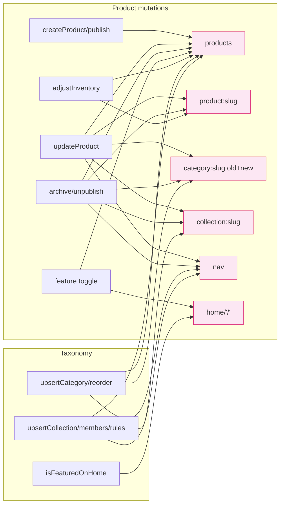
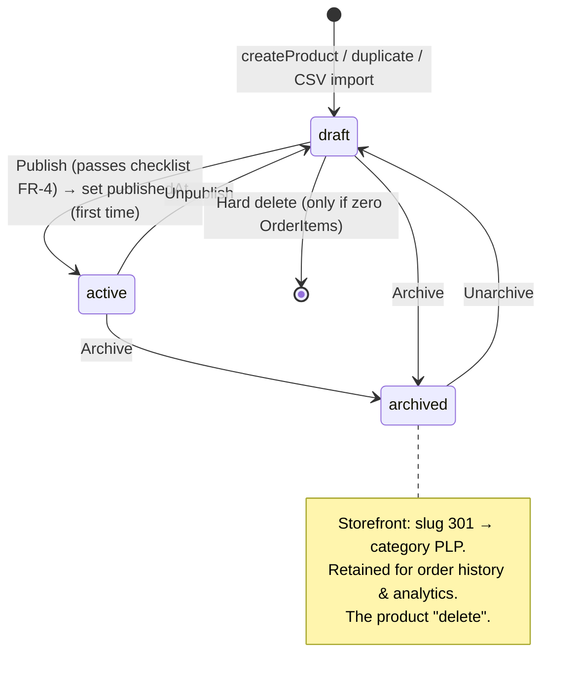
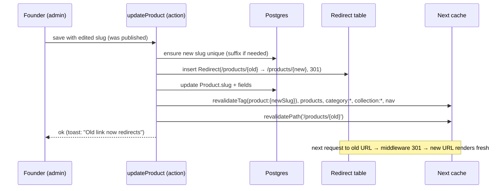

# 11 — Product, Inventory & Catalog Management

> **Project:** `vaani-gift-e-commerce` · **Brand:** GooglyWoogly Art · **Founder/CEO:** Vanshika Bhatia · **Base:** Jaipur, India · **Domain:** `googlywoogly.art`
> **Owner-perspective:** Product (with Solutions-Architecture for actions, caching, media, import/export).
> **Conforms to:** [`00-canonical-decisions.md`](./00-canonical-decisions.md) (CANON). Every entity, field, enum, route, cache-tag, and convention is taken **verbatim** from CANON §5–§12 and expanded per [`03-data-model-and-entities.md`](./03-data-model-and-entities.md). Mutations call the **consolidated cache-tag → trigger matrix** in [`04-information-architecture-and-routing.md`](./04-information-architecture-and-routing.md) §7, and the **`withAudit()` + `requireRole()`** contracts from [`10-admin-foundation-auth-dashboard.md`](./10-admin-foundation-auth-dashboard.md) §5.4/§6.4. Storefront read behaviour (PDP/PLP) is owned by [`06`]/[`07`]; this doc is the **write side**. Where I decide something CANON leaves open, the call is stated inline and surfaced under §11 Open Questions.
> **Authoritative for:** the admin **product create/edit form** (the centerpiece — every field group, media uploader, validation, autosave/draft, duplicate, archive, on-save revalidation), the **product list + bulk actions**, the **inventory management view** (stock levels, low/out-of-stock filters, inline quick-edit, manual stock adjustments → `AuditLog`), **category management** (CRUD, one-level parent, sort, SEO), **collection management** (manual vs automated rules, merchandising sort, feature-on-home), the **media library**, and **CSV import/export (V1)**.
> **Not authoritative for:** storefront PDP/PLP/search rendering & JSON-LD (`06`/`07`), cart/checkout stock re-validation & the order-placement decrement (`08`), order management (`12`), the admin shell/auth/dashboard (`10`), notifications (`14`), CMS/homepage/banners (`15`), the physical Prisma schema (`03`).

**Money is integer paise everywhere** (CANON §10; `03` FR-3). All `price`, `compareAtPrice`, `costPrice` inputs are entered in ₹ by the founder and **converted to paise** at the form/action boundary; never stored as float. Display is `₹` + `en-IN` grouping; timestamps display **IST**.

---

## 1. Purpose & Scope

### 1.1 What this document covers

This is the founder's **catalog command center** — the surface where the entire sellable inventory is created, priced, photographed, organized, and kept in stock. It runs largely **from a phone** (CANON §2.4, §15.8) and must be **smooth and fast**, because the product editor is used dozens of times a week and is the single biggest lever on storefront quality and SEO.

It defines, decisively and completely:

1. **The product create/edit form** (`/admin/products/new`, `/admin/products/[id]/edit`) — the centerpiece. Every `Product` field grouped into logical sections: **Basics** (title, subtitle, slug, descriptions, SKU), **Media** (drag-drop multi-image uploader via Cloudinary, reorder, primary, alt text, OG image), **Pricing** (`price`, `compareAtPrice`, admin-only `costPrice` + margin), **Inventory** (`inventoryQuantity`, `madeToOrder` toggle, `productionLeadTimeDays`, `lowStockThreshold`, live `inventoryState` preview), **Organization** (`categoryId`, collections, `tags`, `occasions`, `isFeatured`, `isBestseller`), **Personalization** (`allowsPersonalization` + `personalizationLabel`), **Attributes** (`materials`, `careInstructions`, `dimensions`, `weightGrams`), **SEO** (`metaTitle`, `metaDescription`, live Google/OG preview, slug-with-301-on-change), and **Status** (`draft | active | archived`).
2. **Validation, autosave/draft, duplicate, archive**, and the **on-save revalidation** of the exact CANON cache tags so the storefront reflects every change immediately.
3. **The product list** (`/admin/products`) — search, filter, sort, pagination, and **bulk actions** (activate, archive, feature, assign category/collection, tags, price adjust).
4. **The inventory management view** (`/admin/inventory`) — stock levels, **low-stock & out-of-stock filters**, **inline quick-edit**, and **manual stock adjustments with a reason** that write an `AuditLog` entry.
5. **Category management** (`/admin/categories`) — CRUD, **one-level parent**, drag-sort, image, SEO, and the active/inactive lifecycle.
6. **Collection management** (`/admin/collections`) — **manual vs automated** (rules engine, V1), merchandising sort, **feature-on-home**, and membership/ordering.
7. **Media library** (`/admin/media`) — Cloudinary-backed asset grid, upload, alt-text, folders, search, delete-with-reference-guard.
8. **CSV import/export (V1)** — bulk product create/update and a catalog export.

### 1.2 What this document explicitly does NOT cover

- **No product variants / options** (CANON §3, §5). One `Product` = one listing = one `sku`, one `price`, one `inventoryQuantity`. "Personalization" is a free-text capture, not a variant axis. The schema is *architected* for a future `ProductVariant` (`03` FR-13) but this doc does **not** build it.
- **No storefront rendering.** The PDP/PLP/search/JSON-LD/recommendation rails are owned by `06`/`07`. This doc only produces the data those pages read and fires the cache-tag revalidations that refresh them.
- **No order-time inventory truth.** The **authoritative** stock decrement happens in `placeOrder` inside the placement transaction (`08` FR-29). This doc maintains `inventoryQuantity` as the **founder-managed** stock figure; it does not implement reservations, holds, or the cart re-validation contract.
- **No on-site payment, no shopper accounts** (CANON §1, §2) — irrelevant to catalog management.
- **No coupons/discounts** (those are `Coupon`, V1, owned elsewhere) and **no reviews moderation** (V1, `/admin/reviews`). A product's discount is expressed only via `compareAtPrice`.
- **No CMS/homepage/banner content** (`15`) — except that this doc *writes* `isFeatured`/`isBestseller`/`Collection.isFeaturedOnHome`, which `15`'s homepage renderer consumes.
- **The physical Prisma schema / migrations** (`03`/`02`). Field-level types come from `03` verbatim.

### 1.3 Roles (from `10` §5.4 — enforced server-side)

| Capability | `owner` | `admin` | `staff` |
|---|---|---|---|
| Products — view list/detail | ✅ | ✅ | 👁 read-only |
| Products — create / edit / archive / duplicate / change price | ✅ | ✅ | ⛔ |
| Product `costPrice` / margin (read or write) | ✅ | ✅ | ⛔ (never in DTO) |
| Inventory — adjust `inventoryQuantity`/`lowStockThreshold`/`madeToOrder` | ✅ | ✅ | ✅ |
| Categories — CRUD / reorder | ✅ | ✅ | ⛔ |
| Collections — CRUD / rules / membership | ✅ | ✅ | ⛔ |
| Media — upload / delete | ✅ | ✅ | 👁 attach-only |
| CSV import / export (V1) | ✅ | ✅ | ⛔ |

> **Decision (resolves a `10` open boundary for this area):** `staff` is the fulfilment helper — they may **adjust inventory quantities** (so they can correct stock after packing) but may **not** create/edit/price/archive products, manage taxonomy, or import/export. Every server action below begins with the appropriate `requireRole(...)` gate (§6).

---

## 2. Primary user stories / jobs-to-be-done

| # | As a… | I want… | so that… |
|---|---|---|---|
| JTBD-1 | Founder (P-Vanshika) | to add a new handmade product in **under 2 minutes from my phone** — type a title, drop 3–5 photos, set a price and stock, hit publish | I can list a piece the moment it's finished, without a laptop. |
| JTBD-2 | Founder | to upload several photos, **drag them into the right order**, pick the hero shot, and write alt text | the PDP looks beautiful, ranks in image search, and is accessible. |
| JTBD-3 | Founder | to mark an item **made-to-order with a lead time** instead of a stock count | I can sell pieces I haven't crafted yet and set honest delivery expectations. |
| JTBD-4 | Founder | a **draft** that autosaves, so I can start a listing, get interrupted, and finish later | I never lose half-typed work mid-task. |
| JTBD-5 | Founder | to **duplicate** a similar product and tweak it | I list a variant-like sibling (e.g. a different colourway) in seconds without retyping everything. |
| JTBD-6 | Founder | a **live SEO preview** of how the product looks on Google + a clean editable slug | I control how it appears in search and don't break links when I rename it. |
| JTBD-7 | Founder | one screen showing **what's low or out of stock**, with inline quick-edit | I restock before I oversell and embarrass the brand. |
| JTBD-8 | Founder | to **adjust stock with a reason** ("damaged 2", "found 5 in box") and see a history | I trust my numbers and can answer "why did stock change?". |
| JTBD-9 | Founder | to **organize** products into categories ("Diyas", "Wall Art") and merchandising collections ("Diwali Gifts", "Under ₹999") | shoppers find pieces by what-it-is and by occasion. |
| JTBD-10 | Founder | **automated collections** that auto-fill from rules (e.g. "all products tagged `diwali` under ₹1500") | seasonal pages populate themselves as I add stock. |
| JTBD-11 | Founder | to **feature** a collection on the homepage and a few hero products | I control what greets visitors without touching code. |
| JTBD-12 | Founder | **bulk actions** — archive last season's stock, bump prices 10%, tag a batch | I manage a growing catalog without editing items one-by-one. |
| JTBD-13 | Founder (V1) | to **import a CSV** of products and **export** my catalog | I can bulk-load a new range and back up / share my catalog. |
| JTBD-14 | Founder | every change to **reflect on the live store immediately** | what a customer sees is always what I just set. |
| JTBD-15 | Staff helper | to **fix a stock number** after packing orders, without being able to change prices or delete products | I keep inventory accurate without risk to the business. |

---

## 3. Detailed functional requirements

> Numbered, decisive. **MUST** = MVP unless a phase tag (V1/V2) is present. Entity/field/enum/cache-tag names are CANON-verbatim. Every **mutating** action is wrapped by `withAudit()` and gated by `requireRole()` (`10` §6.4, §5.4) and revalidates **exactly** the tags in `04` §7.

### 3.1 Product create/edit form — global behaviour

- **FR-1 — Routes & one shared form.** Create at **`/admin/products/new`**, edit at **`/admin/products/[id]/edit`** (CANON §8; `[id]` is the internal `cuid` — IDs are allowed in admin URLs, never on storefront, `04` FR-10). Both render the **same** `<ProductForm>` component; "new" starts from an empty `draft`, "edit" hydrates from the product. The form is the **centerpiece** — it MUST be fast to load (RSC shell + minimal client islands) and fast to fill on a phone.
- **FR-2 — Section layout.** The form is organized into the field groups in §1.1, presented as a **main column** (Basics → Media → Pricing → Inventory → Personalization → Attributes → SEO) and a **right rail / sticky aside** (Status & visibility, Organization: category + collections + tags + occasions, feature flags, a small live PDP-availability preview). On mobile the rail collapses **below** the main column as labelled accordions. A **sticky action bar** (Save / Save & view / status pill / unsaved-changes indicator) is always reachable (thumb-reach on mobile).
- **FR-3 — Single source of validation.** All fields are validated by one **Zod schema** `productInputSchema` (§6.1), shared by `react-hook-form` (client, inline) and the server action (authoritative). Client validation is UX; the server re-validates and is the source of truth. Money fields accept ₹ decimals in the UI and are coerced to **integer paise**.
- **FR-4 — Required vs optional (decisive).** To **save as `draft`**, only **`title`** is required (everything else may be blank) — so the founder can stash an idea instantly. To **set `status = active` (publish)**, the form MUST additionally have: a valid **`sku`** (unique), a **`price` > 0**, **at least one image**, a **`categoryId`** (decision: an active product must be categorized for IA/SEO; see §11 OQ-1), and — when `madeToOrder = true` — a **`productionLeadTimeDays ≥ 1`**. Publishing is blocked (with a clear checklist) until these pass.
- **FR-5 — Status model.** `Product.status ∈ { draft | active | archived }` (CANON §6). **`draft`** = not on storefront, `notFound()`/404 for anonymous (`07` FR-4). **`active`** = live & indexable. **`archived`** = the product "delete" (`03` FR-10) — hidden from storefront, retained for order history/analytics; its slug **301-redirects to the category PLP** (`07` FR-4, `04` FR-26). The form exposes status as **Save as draft**, **Publish**, **Unpublish (→ draft)**, and **Archive** actions (§3.6).
- **FR-6 — `publishedAt` semantics.** On the **first** transition to `active`, set `publishedAt = now()` (drives the storefront "New" badge for 30 days, `07` FR-9). Re-publishing after unpublish does **not** reset `publishedAt` (decision — avoids gaming "new"; see §11). A future "schedule publish" is V1 (§12).
- **FR-7 — Unsaved-changes guard.** If the form is dirty and the founder navigates away (route change, back, tab close), prompt **"You have unsaved changes — leave anyway?"** (`beforeunload` + router intercept). Autosave (FR-20) reduces but does not remove this need (e.g. media not yet committed).

### 3.2 Basics group

- **FR-8 — Title.** `Product.title` (NN). Single line, max **120 chars** (soft counter), `text-balance` on PDP. Required for any save.
- **FR-9 — Subtitle.** `Product.subtitle` (optional). One-line tagline (≤ 80 chars), shown under the title on the PDP.
- **FR-10 — Slug.** `Product.slug` (unique). **Auto-generated** from `title` on first type (kebab-case, ASCII, lowercased, stripped of reserved words `04` FR-13) and shown in an editable field with the full URL preview `…/products/{slug}`. Behaviour:
  - **Before first publish** the slug freely **auto-tracks** the title (editable; not yet immutable).
  - **After publish** the slug is **immutable-by-default** (CANON §10): editing it requires an explicit "Edit URL" confirm, and on change the action **writes a `Redirect` (old `/products/{old}` → new, 301)** and revalidates the old path (§6.2). Collisions auto-suffix `-2`, `-3`, … and are checked **live** (debounced uniqueness probe) with a green/red indicator.
- **FR-11 — Descriptions.** `Product.description` (NN for publish-quality, rich) edited in a **rich-text editor** (sanitized HTML/MDX; bold/italic/lists/links/headings only — no script/iframe). `Product.shortDescription` (optional, ≤ 200 chars, plain) is the card/meta summary; a helper notes it feeds search results & cards, **not** duplicated in the body (`07` FR-12).
- **FR-12 — SKU.** `Product.sku` (unique, NN-for-publish). Free text; uppercase-normalized suggestion; **live uniqueness check**. A **"generate SKU"** helper proposes `GW-{categoryPrefix}-{shortid}` the founder can accept/override. Editing SKU does **not** touch the slug or create a redirect (SKU is not a URL).

### 3.3 Media group (Cloudinary uploader)

- **FR-13 — Uploader.** A **drag-and-drop multi-image uploader** (also tap-to-pick on mobile, with camera capture). Files upload to **Cloudinary** (CANON §4) via a **signed direct-upload** (the server issues a signature; the browser uploads straight to Cloudinary — no large payloads through the action). On each successful upload the action persists a **`MediaAsset`** (`url, publicId, width, height, sizeBytes, type=image, folder="products"`) and a **`ProductImage`** row (`productId, mediaAssetId, url, alt, width, height, sortOrder, isPrimary`) — `url`/`width`/`height` are **denormalized** onto `ProductImage` for render speed and CLS-safety (`03` §3.7.1).
- **FR-14 — Reorder + primary.** Images render as a **reorderable thumbnail grid** (drag to reorder; on mobile, long-press drag or up/down controls). Reordering rewrites `ProductImage.sortOrder` (0-based). One image is the **primary** (hero/LCP): setting it updates that row's `isPrimary = true`, clears the flag on others, and mirrors it to **`Product.primaryImageId`** (`03` FR — kept in sync). The first uploaded image defaults to primary.
- **FR-15 — Alt text.** Each image has an **alt-text** field (`ProductImage.alt`), inline-editable on the thumbnail. A non-blocking **accessibility nudge** flags images missing alt before publish ("3 images missing alt text — add for SEO & screen readers"); publish is **not** hard-blocked on alt (warn, don't block — decision, §11 OQ-2) but it is strongly surfaced.
- **FR-16 — OG image.** An optional **social-share image** picker sets `Product.ogImageId` (→ `MediaAsset`). If unset, the storefront falls back to `primaryImageId` then the first `ProductImage` (`07` FR-34). The picker can choose any product image **or** pull from the media library.
- **FR-17 — Constraints & UX.** Accept `image/jpeg|png|webp|avif`; **max 8 MB/file**, **max 12 images/product** (configurable). Show per-file **progress**, thumbnail preview, retry-on-failure, and a remove (🗑) with undo. Cloudinary auto-format/quality transforms are applied at render (`f_auto,q_auto`) — originals stored, optimized on delivery (CANON §4; remove `images.unoptimized`). Removing an image deletes the `ProductImage`; the underlying `MediaAsset` is **detached** (kept in the library unless explicitly deleted there, FR-49).
- **FR-18 — Video (V2).** `MediaType` supports `video`; product video is **not** in MVP/V1 (recorded §12).

### 3.4 Pricing group

- **FR-19 — Price, compareAt, cost.**
  - `Product.price` (paise, NN-for-publish, > 0) — the selling price. Entered in ₹ (`₹1,499`), coerced to paise.
  - `Product.compareAtPrice` (paise, optional) — the strikethrough "was" price. **Validation: must be `> price` when set** (`03` §3.7.1; `07` FR-11). When valid, the form shows the computed **"Save ₹X (N%)"** exactly as the PDP will.
  - `Product.costPrice` (paise, optional, **admin-only**) — never sent to storefront (`03` OQ-5; excluded from `productPdpSelect`). The form shows a **live margin** readout next to it: `margin% = round((price − costPrice)/price × 100)` and `marginₚₐᵢₛₑ = price − costPrice`, with a colour hint (red if `costPrice ≥ price`). **`costPrice` and margin are entirely hidden from `staff`** (never rendered, never in the DTO — `10` FR-26).

### 3.5 Inventory group (on the product form)

- **FR-20 — Autosave / draft.** While editing, the form **autosaves** the working draft every ~3 s after changes settle (debounced) **and** on blur of major fields, via `saveProductDraft` (§6.1) — but **only for products already persisted** (an edit, or a new product after its first manual save which creates the `draft` row). For a brand-new unsaved product, autosave is armed after the **first explicit Save** so we have an `id` to attach media/autosaves to. A subtle "Saved ✓ {time} IST" / "Saving…" indicator sits in the action bar. Autosave **never** flips `status` (drafts stay drafts; publishing is always explicit).
- **FR-21 — Quantity & made-to-order.**
  - `Product.inventoryQuantity` (Int, ≥ 0, default 0). A number stepper + direct input.
  - **`madeToOrder` toggle** (`Product.madeToOrder`, default false). When **on**, the quantity field is **de-emphasized** (still editable but informational — MTO is *always orderable*, CANON §6) and `productionLeadTimeDays` becomes **required** (FR-4).
  - `Product.productionLeadTimeDays` (Int, ≥ 1 when MTO) — "Ships in N days", shown prominently on PDP (`07` FR-16).
  - `Product.lowStockThreshold` (Int, ≥ 0, default **3**) — at/below → `low_stock`.
- **FR-22 — Live `inventoryState` preview.** The form computes and shows the **derived `inventoryState`** (CANON §6 — *not stored*, `03` FR-12) live as the founder edits, with the exact badge the shopper will see:

  | Condition (in order) | `inventoryState` | Form badge |
  |---|---|---|
  | `madeToOrder = true` | `made_to_order` | violet "Made to order · ships in {N}d" |
  | else `inventoryQuantity ≤ 0` | `out_of_stock` | grey "Out of stock" |
  | else `inventoryQuantity ≤ lowStockThreshold` | `low_stock` | amber "Low stock ({qty} left)" |
  | else | `in_stock` | green "In stock ({qty})" |

  This is the same derivation the PDP (`07` FR-14), PLP (`06`), inventory view (§3.8), and dashboard low-stock panel (`10` FR-39) use — implemented once in `lib/inventory/state.ts`.
- **FR-23 — Inventory edits from the form revalidate stock tags.** Saving the product form with any of `inventoryQuantity | madeToOrder | productionLeadTimeDays | lowStockThreshold` changed revalidates `product:{slug}` + `products` (the same tags `adjustInventory` busts — §6.2), so PDP/PLP availability refreshes immediately (CANON §9, `04` §7).

### 3.6 Status actions (save / publish / duplicate / archive)

- **FR-24 — Save (draft).** Persists the `Product` (status stays `draft` if not yet active), commits any pending media, and shows a success toast. Validates only the draft-level rules (FR-4). Revalidates **nothing storefront** if still a draft (a draft isn't on the store) **except** `products`/`category` if it was already active and is being edited.
- **FR-25 — Publish (→ active).** Runs the **full publish checklist** (FR-4). On success: sets `status = active`, sets `publishedAt` if first publish (FR-6), revalidates **`products`**, **`product:{slug}`**, the assigned **`category:{slug}`**, every assigned **`collection:{slug}`**, and **`nav`** if the category/collection nav surfaces change. Toast offers **"View on store"** (opens `/products/{slug}`). On **create**, `product:{slug}` does not exist yet to bust; `dynamicParams=true` renders it on first hit and `products`(+`category:{slug}`) is busted so listings include it (`04` §7 note).
- **FR-26 — Unpublish (→ draft).** Sets `status = draft`; revalidates `products`, `product:{slug}` (so the live page goes 404/redirect per `07`), affected `category:{slug}`/`collection:{slug}`, `nav`. Use case: temporarily pull a piece without archiving.
- **FR-27 — Duplicate.** A **"Duplicate"** action (list row menu + form overflow) creates a new **`draft`** copying **all** fields **except**: `id`, `slug` (→ `{slug}-copy`, auto-suffixed unique), `sku` (→ `{sku}-COPY` or blank, since SKU is unique — decision: blank it and force the founder to set a new one before publish, §11 OQ-3), `status` (→ `draft`), `publishedAt` (→ null), `isFeatured`/`isBestseller` (→ false), and `inventoryQuantity` (→ 0). **Images are copied by reference** (new `ProductImage` rows pointing at the **same** `MediaAsset` `url`/`publicId` — no re-upload; `03` media refs are `SetNull`/shared). Collections/category/tags/occasions/attributes/descriptions are copied. Opens the new draft in the editor. Writes `AuditLog action = "product.duplicate"`.
- **FR-28 — Archive (the "delete").** Sets `status = archived` (CANON §6; `03` FR-10 — there is **no hard delete** in the UI for products with order history). On archive: revalidate `products`, `product:{slug}` (storefront now 301s to category, `07` FR-4), affected `category:{slug}`/`collection:{slug}`, `nav`. The product **stays** in the DB (order snapshots and analytics depend on it). Archived products are **filterable** back into view and can be **un-archived** (→ `draft`). A confirm dialog explains "Archiving hides this from the store but keeps order history."
- **FR-29 — Hard delete (guarded, rare).** A true DB delete is offered **only** for a product with **zero `OrderItem`s** (e.g. a mistaken draft), behind a destructive confirm typing the title. If any `OrderItem` references it, hard-delete is **blocked** (`03` FR-11) and the UI directs the founder to **Archive** instead. On hard-delete, owned `ProductImage` rows cascade; `MediaAsset`s are detached (not auto-deleted). Writes `AuditLog action = "product.delete"`.

### 3.7 Organization group (taxonomy & merchandising)

- **FR-30 — Category (one).** A **single** `categoryId` (FK→`Category`) via a searchable select showing the one-level parent→child tree (CANON: category depth = 1). Required to publish (FR-4). Changing it on an active product revalidates **both** the old and new `category:{slug}` plus `products` and `nav` (`04` §7).
- **FR-31 — Collections (many, manual membership).** A multi-select of `Collection`s adds/removes **`CollectionProduct`** rows (the N:M join). Membership is **manual** here; **automated** collections (`type = automated`) are **not** edited per-product (their membership is rule-derived — §3.10). The form clearly **disables** manual add/remove for automated collections (shows "auto by rules" with a link to the collection). Membership changes revalidate each affected `collection:{slug}` + `products` (`04` §7).
- **FR-32 — Tags.** `Product.tags` (String[], GIN-indexed) — a free **tag input** (type-and-enter chips) with **autocomplete from existing tags**. Lowercased, de-duplicated, trimmed. Tags power search, automated-collection rules, and "you may also like" similarity (`07` FR-39).
- **FR-33 — Occasions.** `Product.occasions` (String[], GIN-indexed) — a **multi-select from the CANON occasion vocabulary** (CANON §11: Diwali, Raksha Bandhan, Holi, Karwa Chauth, weddings, anniversary, birthday, housewarming, corporate gifting) **plus** free-add. A controlled list (with free extension) keeps occasion-collection rules and SEO consistent. Decision: occasions are a **curated suggested list**, not hard-restricted (§11 OQ-4).
- **FR-34 — Feature flags.** `Product.isFeatured` and `Product.isBestseller` toggles (right rail). `isFeatured` gates homepage/feature eligibility (consumed by `15`), `isBestseller` drives the "Bestseller" badge (`07` FR-9) and the `/collections/bestsellers` page. Toggling either on an active product revalidates `products` and `/` (if featured) per `04` §7.

### 3.8 Personalization & attributes groups

- **FR-35 — Personalization.** `Product.allowsPersonalization` toggle; when on, `Product.personalizationLabel` (e.g. "Name to engrave") becomes editable (required-ish: defaults to "Personalization (e.g. name to engrave)" if blank — `07` FR-19). Off → label hidden. These drive the PDP personalization input (`07` FR-19) and the cart line (`08` FR-5).
- **FR-36 — Attributes.** `Product.materials` (free text), `Product.careInstructions` (rich/multiline), `Product.weightGrams` (Int), and `Product.dimensions` (JSON `{ length?, width?, height?, diameter?, unit: "cm"|"in" }` — `03` §3.5). The dimensions UI offers L/W/H **or** Ø (diameter) inputs + a unit toggle (cm/in), and previews the formatted string the PDP renders ("L 20 × W 8 × H 8 cm" or "Ø 10 cm"; `07` FR-28). All optional; absent fields are simply not rendered on the PDP.

### 3.9 SEO group (with live preview)

- **FR-37 — SEO fields.** `Product.metaTitle` (optional; placeholder shows the computed fallback `{title} · GooglyWoogly Art`) and `Product.metaDescription` (optional; placeholder shows fallback = `shortDescription` ?? trimmed `description` excerpt). Character counters with **ideal-range** hints (title ~50–60, description ~150–160). These map to PDP `generateMetadata` (`07` FR-34).
- **FR-38 — Live search & social preview.** A **live preview** card renders, as the founder types: (a) a **Google SERP** mock (blue title, green URL `googlywoogly.art › products › {slug}`, grey description) and (b) an **OG/social card** mock (image from `ogImageId`/primary, title, description). Updates on every keystroke; uses the same fallbacks the storefront will. This makes SEO tangible for a non-technical founder.
- **FR-39 — Slug-in-SEO.** The slug field (FR-10) lives in this group too (URL is an SEO control). The 301-on-change behaviour and uniqueness check are as FR-10. A warning shows when editing a **published** slug: "Changing the URL creates a redirect from the old link."

### 3.10 Collection rules engine (automated collections)

- **FR-40 — Manual vs automated.** A `Collection.type ∈ { manual | automated }` (CANON §6). **Manual** (MVP): membership is the explicit `CollectionProduct` set, ordered by the join `sortOrder` (drag-sort in the collection editor, §4.7). **Automated** (**V1**): membership is computed from `Collection.rules` (JSON, `03` §3.5) — `{ match: "all"|"any", conditions: [{ field, op, value }] }` over `field ∈ { category | tag | occasion | price | isBestseller | isFeatured }`, `op ∈ { eq | in | lte | gte }`.
- **FR-41 — Rule evaluation & materialization (V1).** Automated membership is **materialized** into `CollectionProduct` rows (so storefront reads stay a simple join and `collection:{slug}` caching is uniform) by: (a) a **nightly Vercel Cron** recompute, and (b) an **on-demand recompute** whenever the rules are saved or a product mutation could change candidacy. Decision: **materialize, don't compute-at-read** — keeps the PDP "more from this collection" rail (`07` FR-40) and the collection PLP fast and identically cacheable for manual/automated. The recompute is `recomputeAutomatedCollection(collectionId)` (§6.3) and revalidates `collection:{slug}` + `products`. (MVP ships the manual path; the automated UI is visible but flagged `COLLECTIONS_AUTOMATION_ENABLED` per §12.)
- **FR-42 — Rule builder UI (V1).** A condition builder (add/remove rows, ALL/ANY toggle, per-field operator + value picker; price as ₹→paise; category/tag/occasion as selects) with a **live "N products will match"** preview (runs the query, capped sample shown). Saving recomputes membership (FR-41).

### 3.11 Inventory management view (`/admin/inventory`)

- **FR-43 — Purpose & list.** `/admin/inventory` (CANON §8) is a **stock-focused table** of all non-archived products: columns **thumbnail, title (→edit), SKU, `inventoryState` badge, `inventoryQuantity` (inline-editable), `lowStockThreshold`, `madeToOrder` (inline toggle), lead time, last adjusted**. Default sort: lowest stock first (out-of-stock, then low, then in-stock), then title. Available to **all roles incl. `staff`** (the one catalog-write surface `staff` has — §1.3).
- **FR-44 — Filters.** Quick filters: **All**, **Low stock**, **Out of stock**, **In stock**, **Made-to-order**, plus a category filter and a SKU/title search. The **Low stock** and **Out of stock** filters compute the derived `inventoryState` (CANON §6) — `made_to_order` items are **excluded** from "out of stock" (always orderable). These filters mirror the dashboard low-stock panel (`10` FR-39) and its deep-links (`/admin/inventory?filter=low`).
- **FR-45 — Inline quick-edit.** `inventoryQuantity`, `lowStockThreshold`, and `madeToOrder` are **inline-editable** in the row (tap a cell → edit → blur/enter saves) via **`adjustInventory`** (§6.2) — an optimistic update with rollback on error, a toast, and a re-derived state badge. This is the fast path for "I packed 3, set it to 5". Inline edits are a kind of stock adjustment and are **audited** (FR-47).
- **FR-46 — Manual stock adjustment with reason.** A dedicated **"Adjust stock"** action (row menu and bulk) opens a sheet to **set** an absolute quantity **or** apply a **delta** (`+`/`−`), with a **required reason** chosen from a controlled list `{ recount | received_stock | damaged | lost | returned_to_stock | correction | sold_offline | other }` (+ optional free-text note). This is the canonical, intentional adjustment path (vs. the inline quick-edit for speed).
- **FR-47 — Adjustments write `AuditLog`.** Every stock change (inline quick-edit **and** the reasoned adjustment) writes an **`AuditLog`** row via `withAudit()`: `action = "inventory.adjust"`, `entityType = "Product"`, `entityId = product.id`, `before = { inventoryQuantity: old }`, `after = { inventoryQuantity: new, reason, delta, note? }` (`03` §3.5; `10` FR-44). This satisfies JTBD-8 ("why did stock change?") — the per-product **adjustment history** is rendered by reading `AuditLog` filtered to that entity (a panel on the product form and an "History" link in the inventory row). Decision: **no separate `StockAdjustment` table** — `AuditLog` is the system of record for stock changes (§11 OQ-5).
- **FR-48 — Inventory revalidation.** Each adjustment revalidates **`product:{slug}`** + **`products`** (`04` §7) so the storefront's availability badge and OOS state update at once. It does **not** touch category/collection tags (membership unchanged).

### 3.12 Media library (`/admin/media`)

- **FR-49 — Library.** `/admin/media` (CANON §8) is a **responsive grid** of `MediaAsset`s (Cloudinary), newest first, with: thumbnail, dimensions, size, `folder`, created date (IST), and an alt-text editor. Supports **search** (by alt/folder), **folder filter** (`products`, `banners`, `categories`, `collections`, `misc`), **upload** (same signed-direct-upload as FR-13, into a chosen folder), inline **alt-text edit**, and **multi-select**.
- **FR-50 — Delete with reference guard.** Deleting an asset first **checks references** across `ProductImage.mediaAssetId`, `Product.primaryImageId/ogImageId`, `Category.imageId`, `Collection.heroImageId`, `Banner.imageId`, `Testimonial.imageId`, `SiteSetting.logoId`. If referenced, the UI **blocks** with the list of usages and offers to **detach** (which `SetNull`s the references — `03` §3.6) before deleting; unreferenced assets delete directly. On confirmed delete, the action also **deletes the Cloudinary asset** by `publicId` (best-effort; logged on failure) and removes the `MediaAsset` row.
- **FR-51 — Pick-from-library.** Image pickers across the admin (product OG/primary, category image, collection hero, banner, testimonial, settings logo) can **choose an existing `MediaAsset`** from this library **or** upload a new one — a single reusable `<MediaPicker>` backed by the same actions.

### 3.13 Product list & bulk actions (`/admin/products`)

- **FR-52 — List.** `/admin/products` is a paginated table: **thumbnail, title (→edit), SKU, price (+ compareAt strike), `status` badge, `inventoryState` badge, category, featured/bestseller chips, updatedAt (IST)**. Row overflow menu: **Edit, Duplicate, View on store, Unpublish/Publish, Archive**. `staff` sees the list **read-only** (no create/edit/archive/duplicate; row menu reduced to "View").
- **FR-53 — Search, filter, sort, paginate.** Search by title/SKU (FTS/trigram — CANON §4); filters: **status** (draft/active/archived/all), **category**, **collection**, **stock state**, **featured**, **bestseller**, **has-no-image** (data-quality), **made-to-order**; sort by updatedAt (default), title, price, inventoryQuantity, publishedAt; cursor or page pagination (decision: page-based, 25/page; `04`). State lives in `searchParams` so views are shareable/back-button-safe.
- **FR-54 — Bulk select & actions.** Checkbox-select rows (and "select all matching filter"). Bulk actions (owner/admin only): **Publish (→active)**, **Unpublish (→draft)**, **Archive**, **Set/clear featured**, **Set/clear bestseller**, **Assign category**, **Add to / remove from collection**, **Add / remove tags**, **Add / remove occasions**, and **Adjust price** (set %, +%, −%, or set absolute; with a **preview of new prices** before apply, never silently mutating money). Bulk operations run server-side in a transaction, **each item audited**, and revalidate the **union** of affected tags: always `products`; per item `product:{slug}`; affected `category:{slug}` (old+new) and `collection:{slug}`; `nav` if nav surfaces change; `/` if featured changed (`04` §7).
- **FR-55 — Bulk safety.** Bulk price changes and bulk archive show an explicit **confirm with counts** ("Archive 14 products?"), a **dry-run preview** for price math, and are **capped** per run (e.g. ≤ 200 items) to keep the action within serverless limits; larger sets paginate the operation. Partial failures report **per-item results** (succeeded/failed) and never leave money half-applied (transaction per item).

### 3.14 Category management (`/admin/categories`)

- **FR-56 — CRUD + tree.** `/admin/categories` lists `Category` as a **two-level tree** (parents with nested children — CANON: one level of nesting). Create/edit fields: `name` (NN), `slug` (auto from name, editable, **301-on-change** like products — FR-10 pattern, writing `Redirect` for `/category/{old}`), `description` (rich, PLP header/SEO), `imageId` (tile image via `<MediaPicker>`), `parentId` (a select of **top-level** categories only — **app-enforced depth = 1**: a category that has children cannot itself be made a child; `03` FR — `parentId` `SetNull` on parent delete), `sortOrder`, `isActive`, `metaTitle`, `metaDescription`.
- **FR-57 — Reorder & depth guard.** Drag-sort within a level rewrites `sortOrder`. The editor **prevents** creating a third level (selecting a child as a parent is disallowed) and warns if assigning a parent would orphan existing children.
- **FR-58 — Activate / deactivate & delete guard.** `isActive=false` hides the category from storefront/nav but keeps products attached. **Deleting** a category is **blocked (`Restrict`) if it has any products** (`03` §3.6) — the UI requires reassigning/archiving those products first (offers a "move products to …" helper). An empty category deletes directly.
- **FR-59 — Category revalidation.** Save/reorder/activate revalidates **`category:{slug}`**, **`products`**, **`nav`** (`04` §7). Slug change additionally `revalidatePath('/category/{old}')` via the `Redirect`.

### 3.15 Collection management (`/admin/collections`)

- **FR-60 — CRUD.** `/admin/collections` lists `Collection`s with: title, `type` (manual/automated), member count, `isActive`, `isFeaturedOnHome`, `sortOrder`. Create/edit fields: `title` (NN), `slug` (auto/editable, 301-on-change), `description` (rich, landing copy), `heroImageId` (`<MediaPicker>`), `type`, `rules` (when automated — FR-40/42), `sortOrder`, `isActive`, `isFeaturedOnHome`, `metaTitle`, `metaDescription`.
- **FR-61 — Manual membership & merchandising sort.** For `type=manual`, a **product picker** (search/add active products) builds the `CollectionProduct` set, and a **drag-to-reorder** grid sets the merchandising `CollectionProduct.sortOrder` (the order shoppers see on the collection PLP and the PDP rail, `07` FR-40). A **"set order automatically"** helper can sort by bestseller→newest→price. Setting members uses **`setCollectionProducts`** (§6.3).
- **FR-62 — Feature on home.** The **`isFeaturedOnHome`** toggle marks the collection for homepage feature (consumed by `15`'s homepage section renderer). Toggling it revalidates `collection:{slug}`, `products`, and **`home`** + **`nav`** (so the home feature and nav update; `04` §7).
- **FR-63 — Collection revalidation.** Save/reorder/membership/rules revalidate **`collection:{slug}`**, **`products`**, **`nav`** (and `home` when featured-on-home; `04` §7). Slug change `revalidatePath('/collections/{old}')`.

### 3.16 CSV import / export (V1)

- **FR-64 — Export (V1).** `/admin/products` offers **"Export CSV"** (current filter or all). The export streams a UTF-8 CSV with a **stable column contract** (§6.5): `id, slug, title, subtitle, shortDescription, sku, price_inr, compareAt_inr, costPrice_inr, status, inventoryQuantity, madeToOrder, productionLeadTimeDays, lowStockThreshold, allowsPersonalization, personalizationLabel, materials, careInstructions, dimensions_json, weightGrams, category_slug, tags(pipe), occasions(pipe), isFeatured, isBestseller, metaTitle, metaDescription, primary_image_url, image_urls(pipe), publishedAt, updatedAt`. Money columns are **₹ rupee decimals** in the file (converted from paise) for human-editability; re-import converts back to paise. `costPrice_inr` is **omitted** for `staff` (but `staff` can't reach export anyway). Export is audited (`action = "product.export"`).
- **FR-65 — Import (V1).** **"Import CSV"** accepts the same contract. Flow: **upload → server parses → validates each row with `productInputSchema` → preview a diff table (create / update / skip / error per row, with reasons) → confirm → apply**. Matching is by `id` (if present) else `sku` (unique key) → **update**; no match → **create as `draft`** (never auto-publishes an import — safety). Images are referenced by URL (`image_urls`); the importer creates `MediaAsset`/`ProductImage` rows for new URLs (it does **not** re-host arbitrary URLs in MVP of V1 — Cloudinary fetch is a stretch; recorded §11 OQ-6). `category_slug` must resolve to an existing `Category` (unknown → row error). Each created/updated row is audited (`action = "product.import_create"|"product.import_update"`).
- **FR-66 — Import safety & limits.** Import is **owner/admin only**, **dry-run by default** (preview before apply), **transactional per row** (a bad row never corrupts a good one), capped (e.g. ≤ 1,000 rows/file, ≤ 5 MB), and produces a **downloadable result report** (row → outcome). After a successful apply, it revalidates the **union** of affected tags (`products`, each touched `product:{slug}`/`category:{slug}`/`collection:{slug}`, `nav`). Imported products land as **drafts** so the founder reviews before they go live.

### 3.17 Cross-cutting

- **FR-67 — Audit everything.** Every mutating action here (product create/update/publish/unpublish/archive/duplicate/delete, inventory adjust, category/collection CRUD/reorder/membership, media upload/delete, bulk ops, import/export) routes through **`withAudit()`** (`10` FR-44) with a CANON-style `action` name (§6) and PII-free before/after (no PII in catalog; secrets like Cloudinary signatures never logged).
- **FR-68 — Optimistic concurrency.** The product form sends the last-seen `updatedAt`; the action rejects with a **"This product changed in another tab/session — reload to merge"** conflict if the row was modified since (prevents a stale autosave clobbering a fresh edit). Inventory inline-edits use the same guard.
- **FR-69 — Reserved-slug & uniqueness enforcement.** Slug generation rejects reserved first-level segments (`04` FR-13) and auto-suffixes collisions; `sku`/`slug` uniqueness is enforced by the DB unique constraints (`03` AC-6) and surfaced as friendly field errors, not 500s.
- **FR-70 — All money/locale correct.** Inputs in ₹ → stored paise; all displays `₹`/`en-IN`; all timestamps IST; never a raw paise integer or a float in the UI (`lib/money.ts`, `lib/datetime.ts`).

---

## 4. UX / UI breakdown

> Components in back-ticks reuse the existing `components/ui/*` scaffold (`10` §0 inventory: `sidebar`, `table`, `card`, `dialog`, `sheet`, `drawer`/`vaul`, `dropdown-menu`, `command`, `badge`, `tabs`, `accordion`, `input`, `textarea`, `select`, `switch`, `checkbox`, `tooltip`, `popover`, `sonner`/`toast`, `skeleton`, `empty`, `alert`, `separator`, `aspect-ratio`, `breadcrumb`). All screens are `noindex`, IST, `₹`/`en-IN`, mobile-first (founder on a phone), WCAG AA (CANON §4), ≥44px touch targets. Copy is **direction**, not final.

### 4.1 Product form — desktop (`≥ lg`)

Two-column: **main** (~64%, scrolling field groups) + **sticky right rail** (~36%). A sticky top action bar persists.

```
Admin › Products › Hand-painted Diya Set                    [Saved ✓ 14:32 IST]
┌──────────────────────────────────────────────┬──────────────────────────────┐
│  ▸ BASICS                                      │  STATUS                      │
│  Title  [Hand-painted Ceramic Diya Set      ] │   ( ◉ Draft  ○ Active )      │
│  Subtitle [Set of 4 · brass accents         ] │   [ Publish ]  [ ⋯ ]         │
│  URL  googlywoogly.art/products/              │   Publish checklist:         │
│       [hand-painted-ceramic-diya-set] ✓ (Edit)│   ✓ Title  ✓ SKU  ✓ Price    │
│  Short desc [≤200 chars …            ] 142/200│   ✓ Image  ✗ Category         │
│  Description  [ B I • ¶ 🔗  rich editor … ]   │  ─────────────────────────── │
│  SKU  [GW-DIYA-014] ✓ unique   [generate]     │  ORGANIZATION                │
│                                                │  Category [Diyas ▾] *        │
│  ▸ MEDIA  (drag to reorder · ★ = primary)     │  Collections [Diwali Gifts ×]│
│  ┌────┐┌────┐┌────┐┌────┐ ┌╌╌╌╌┐               │             [Under ₹999 ×]   │
│  │★IMG││IMG ││IMG ││IMG │ │ + ⬆ │ drop here    │  Tags [diwali][diya][brass]+ │
│  │alt✎││alt✎││alt!││alt✎│ └╌╌╌╌┘               │  Occasions [Diwali][Housew.] │
│  └────┘└────┘└────┘└────┘  ⚠ 1 missing alt     │  ☐ Featured   ☑ Bestseller   │
│  OG image [use primary ▾]                     │  ─────────────────────────── │
│                                                │  AVAILABILITY PREVIEW        │
│  ▸ PRICING                                     │   ● Made to order · 7 days   │
│  Price ₹[1499]  CompareAt ₹[1875] Save ₹376 20%│  (what shoppers will see)    │
│  Cost  ₹[640]   Margin 57% (₹859)  [admin]    │                              │
│                                                │                              │
│  ▸ INVENTORY                                   │                              │
│  Qty [8]  ☑ Made to order  Lead [7] days       │                              │
│  Low-stock threshold [3]   → "Low at ≤3"       │                              │
│                                                │                              │
│  ▸ PERSONALIZATION                             │                              │
│  ☑ Allow   Label [Name to engrave           ] │                              │
│                                                │                              │
│  ▸ ATTRIBUTES                                  │                              │
│  Materials [Mango wood, brass]                 │                              │
│  Dimensions L[20]W[8]H[8] Ø[ ] unit[cm ▾]      │                              │
│  Weight [320] g   Care [ … ]                   │                              │
│                                                │                              │
│  ▸ SEO                                          │                              │
│  Meta title [ …            ] 54/60 (ideal)     │  ┌─ Google preview ───────┐ │
│  Meta desc  [ …            ] 156/160           │  │ Hand-painted… ·GWArt    │ │
│                                                │  │ googlywoogly.art › prod │ │
│                                                │  │ Set of 4 hand-painted … │ │
│                                                │  └─────────────────────────┘ │
└──────────────────────────────────────────────┴──────────────────────────────┘
```

### 4.2 Product form — mobile (`< md`)

Single column; right-rail groups become accordions **below** the main fields; the action bar is a **sticky bottom bar**.

```
‹ Products            Hand-painted Diya Set
[ Draft ▾ ]                       Saved ✓ 14:32
─────────────────────────────────────────────
▸ Basics            (title, slug, desc, sku)
▸ Media  ┌─┐┌─┐┌─┐  drag • ★ primary • +add
▸ Pricing           ₹1499 · was ₹1875 · 20%↓
▸ Inventory         8 · MTO · 7d · low≤3
▸ Organization      Diyas · 2 collections
▸ Personalization   on · "Name to engrave"
▸ Attributes        wood,brass · 20×8×8cm
▸ SEO               + live preview
─────────────────────────────────────────────
[  Save draft  ]      [  Publish →  ]   ← sticky
```

| Component | Built on | Behaviour |
|---|---|---|
| `ProductForm` | `form` + `react-hook-form` + `zod` | Sectioned; autosave (FR-20); dirty-guard (FR-7); optimistic concurrency (FR-68). |
| `MediaUploader` | `dnd-kit`/native drag + `aspect-ratio` + signed Cloudinary upload | Drag-drop, mobile camera, progress, reorder, set-primary, inline alt, OG pick (FR-13–17). |
| `MoneyInput` | `input` + `lib/money` | ₹ mask → paise; compareAt>price validation; live margin for cost. |
| `InventoryFields` | `input`+`switch` | Qty/MTO/lead/threshold; **live `inventoryState` badge** (FR-22). |
| `TaxonomyPickers` | `select`/`command`+`badge` | Category tree select; collection multiselect; tag chips w/ autocomplete; occasion multiselect. |
| `SlugField` | `input`+`tooltip` | Auto-gen, live uniqueness, immutable-post-publish + 301 warning (FR-10). |
| `SeoPreview` | `card` | Live SERP + OG mock (FR-38). |
| `RichTextEditor` | sanitized editor | Description/care; allowlist marks only. |
| `StatusActions` | `button`+`dropdown-menu`+`dialog` | Save/Publish/Unpublish/Duplicate/Archive/Delete with confirms (FR-24–29). |

### 4.3 Product list (`/admin/products`)

```
Admin › Products                         [ + Add product ]  [ Import ][ Export ]
[ Search title/SKU 🔍 ] Status[All▾] Category[All▾] Stock[All▾] ⋯filters   Sort[Updated▾]
☐ ┌ thumb │ Title              │ SKU       │ Price        │ Status │ Stock      │ … ┐
☑ │ ▓     │ Hand-painted Diya  │ GW-DIYA-14│ ₹1,499 ̶1875 │ Active │ MTO·7d     │ ⋯ │
☐ │ ▓     │ Brass Tealight     │ GW-TEA-03 │ ₹499        │ Active │ OUT        │ ⋯ │
☐ │ ▓     │ Macramé Wall Art   │ GW-WALL-08│ ₹2,250      │ Draft  │ In (12)    │ ⋯ │
└──────────────────────────────────────────────────────────────────────────────┘
[ 2 selected ]  Bulk: [Publish][Archive][Feature▾][Category▾][Collection▾][Tags▾][Price▾]
                                                              ‹ 1 2 3 … ›
```

- **Bulk bar** appears on selection; **Price** opens a dry-run preview (FR-54/55). Row `⋯` = Edit / Duplicate / View on store / Publish-Unpublish / Archive.
- **Mobile:** rows become **stacked cards** (thumb + title + price + status/stock badges; tap → edit; long-press → select); bulk bar docks to bottom; filters in a `sheet`.
- **Empty (first run):** `empty.tsx` — "No products yet. Add your first handmade piece." + **Add product** (ties to the dashboard setup checklist, `10` FR-42).

### 4.4 Inventory view (`/admin/inventory`)

```
Admin › Inventory          Filters: [All][Low][Out][In stock][Made-to-order]  [cat▾][🔍]
┌ thumb │ Title            │ SKU       │ State │ Qty      │ Low≤ │ MTO │ Lead │ History ┐
│ ▓     │ Brass Tealight   │ GW-TEA-03 │ OUT   │ [  0  ]✎ │ [3]  │ ☐   │  —   │  ⟳ log  │
│ ▓     │ Hand-painted Diya│ GW-DIYA-14│ LOW   │ [  2  ]✎ │ [3]  │ ☐   │  —   │  ⟳ log  │
│ ▓     │ Macramé Wall Art │ GW-WALL-08│ IN    │ [ 12  ]✎ │ [3]  │ ☐   │  —   │  ⟳ log  │
│ ▓     │ Resin Coasters   │ GW-COAS-02│ MTO   │   n/a    │  —   │ ☑   │ [5]d │  ⟳ log  │
└──────────────────────────────────────────────────────────────────────────────────────┘
[ Adjust stock ⚙ ]  (set/Δ + reason)                       Low: 1 · Out: 1
```

- **Inline cells** (Qty, Low≤, MTO, Lead) save on blur/enter (optimistic; `adjustInventory`; FR-45). **State** badge re-derives instantly.
- **"Adjust stock"** sheet: choose **Set N** or **Δ +/−**, pick a **reason** (recount/received/damaged/lost/returned/correction/sold offline/other), optional note → writes `AuditLog` (FR-46/47).
- **History (⟳ log):** opens a drawer showing this product's `AuditLog` stock entries (who/when/old→new/reason).
- **Mobile:** stacked cards; Qty stepper + a single "Adjust" button per card; reason sheet via `vaul`.

### 4.5 Category management (`/admin/categories`)

```
Admin › Categories                                            [ + New category ]
≡ Diyas & Candles            /diyas-candles      Active   (8)   [edit][⋯]
   ≡ Brass Diyas             /brass-diyas        Active   (3)   [edit][⋯]
   ≡ Tealight Holders        /tealight-holders   Active   (5)   [edit][⋯]
≡ Wall Décor                 /wall-decor         Active   (6)   [edit][⋯]
≡ Gifting Hampers            /gifting-hampers     Hidden  (0)   [edit][⋯]
(drag ≡ to reorder · indent = one-level child)
```

- **Editor** (sheet/dialog): name, slug (301-on-change), description (rich), tile image (`<MediaPicker>`), parent (top-level only — depth guard FR-57), sortOrder, active, SEO. **Delete** blocked if products attached (FR-58) with a "move products" helper.
- **Mobile:** nested accordion list; reorder via up/down or long-press drag.

### 4.6 Collection management (`/admin/collections`)

```
Admin › Collections                                          [ + New collection ]
≡ Diwali Gifts        manual     ★home   Active  (24)  [edit members][⋯]
≡ Under ₹999          automated          Active  (61)  [edit rules][⋯]
≡ Bestsellers         automated   ★home  Active  (12)  [edit rules][⋯]
≡ Wedding Season      manual              Hidden  (0)  [edit members][⋯]
```

- **Editor tabs:** **Details** (title/slug/desc/hero/SEO/sort/active/★feature-on-home), **Members** (manual: product picker + drag-reorder grid → `setCollectionProducts`; automated: read-only materialized list) , **Rules** (automated only: ALL/ANY + condition rows + "N match" preview — V1, FR-40/42).
- **Mobile:** tabbed sheet; member grid reorder via long-press.

### 4.7 Media library (`/admin/media`)

```
Admin › Media        [folder: products ▾]  [🔍 alt/folder]            [ ⬆ Upload ]
┌────┐┌────┐┌────┐┌────┐┌────┐┌────┐
│▓img││▓img││▓img││▓img││▓img││▓img│   grid; click → detail
│alt✎││alt✎││alt!││alt✎││alt✎││alt✎│   (dimensions, size, folder, used-in, delete)
└────┘└────┘└────┘└────┘└────┘└────┘
```

- **Asset detail** (sheet): preview, `url` (copy), dimensions/size, folder, **"Used in" reference list**, alt editor, **Delete** (reference-guarded — FR-50).
- **Picker mode** (`<MediaPicker>`): same grid in a dialog with select + "Upload new".

### 4.8 CSV import (V1) flow

```
Upload CSV → Validate → Preview diff → Confirm → Apply → Result report
            (per-row: create / update / skip / error + reason)
```

A diff table lists each row's outcome with inline error reasons; the founder confirms; a downloadable result report follows. Imports land as **drafts** (FR-65/66).

### 4.9 Copy direction

- **Voice:** warm, plain, encouraging — the founder is non-technical and busy. Buttons say **"Publish"**, **"Save draft"**, **"Adjust stock"**, **"Archive"** (not "Soft-delete").
- **SEO made friendly:** "How this looks on Google" over "meta description"; "Web address" tooltip near slug.
- **Honest inventory:** the made-to-order toggle reads "**Made to order** — always available; I'll craft it after the order"; lead time "Ships in N days".
- **Destructive clarity:** Archive copy reassures order history is kept; hard-delete is hidden unless safe and double-confirmed.
- **Stock reasons** are human: "Received new stock", "Damaged", "Found extra", "Sold in person".

### 4.10 Responsive & a11y

- **Breakpoints:** two-column form at `lg`; single column with accordions below. List/inventory tables → stacked cards `< md`. Sticky action bar (form) and bulk bar (list) dock to the bottom on mobile.
- **A11y:** every field has a `<label>`; errors are `aria-describedby` and announced (`aria-live`); the drag-reorder media grid is **keyboard-operable** (move-up/down buttons as a non-drag fallback) and announces order changes; toggles are real `switch`/`checkbox`; colour-coded `inventoryState` badges also carry **text** ("Low", "Out") — never colour-only; ≥44px targets; focus-trapped sheets/dialogs.

---

## 5. Data & entities used

> CANON §5 / `03` field names **verbatim**. R = read, W = written. A typed `productAdminSelect` includes `costPrice` for owner/admin and **omits it for `staff`** (`10` FR-26). The storefront's `productPdpSelect` (which excludes `costPrice`) is owned by `07`.

### 5.1 Read / Written by surface

| Surface | Reads | Writes |
|---|---|---|
| Product form (new/edit) | `Product` (all fields incl. `costPrice` for owner/admin), `ProductImage`, `MediaAsset`, `Category`, `Collection`, `CollectionProduct`, `AuditLog` (stock history panel) | `Product`, `ProductImage`, `MediaAsset`, `CollectionProduct`, `Redirect` (slug change), `AuditLog` |
| Product list + bulk | `Product`, `Category`, `Collection`, `ProductImage` | `Product`, `CollectionProduct`, `AuditLog` (bulk) |
| Inventory view | `Product`, `ProductImage`, `AuditLog` (history) | `Product` (`inventoryQuantity`, `lowStockThreshold`, `madeToOrder`, `productionLeadTimeDays`), `AuditLog` |
| Category mgmt | `Category`, `Product` (counts), `MediaAsset` | `Category`, `Redirect`, `AuditLog` |
| Collection mgmt | `Collection`, `CollectionProduct`, `Product`, `MediaAsset` | `Collection`, `CollectionProduct`, `Redirect`, `AuditLog` |
| Media library | `MediaAsset`, + reference scan across `ProductImage`/`Product`/`Category`/`Collection`/`Banner`/`Testimonial`/`SiteSetting` | `MediaAsset` (incl. `alt`), `AuditLog` |
| CSV import/export (V1) | `Product`, `ProductImage`, `Category`, `Collection` | `Product`, `ProductImage`, `MediaAsset`, `CollectionProduct`, `AuditLog` |

### 5.2 Field map — `Product` (CANON §5 / `03` §3.7.1) edited here

`id` (route only) · `slug` · `title` · `subtitle` · `description` · `shortDescription` · `sku` · `price` · `compareAtPrice` · `costPrice` (admin-only) · `status` · `inventoryQuantity` · `madeToOrder` · `productionLeadTimeDays` · `lowStockThreshold` · `allowsPersonalization` · `personalizationLabel` · `materials` · `careInstructions` · `dimensions` · `weightGrams` · `categoryId` · `tags[]` · `occasions[]` · `isFeatured` · `isBestseller` · `metaTitle` · `metaDescription` · `ogImageId` · `primaryImageId` · `publishedAt` (managed, FR-6) · `createdAt`/`updatedAt` (audit). **`inventoryState` is derived, not stored** (`03` FR-12; FR-22).

### 5.3 Derived / computed (not stored)

- **`inventoryState`** — CANON §6 derivation (`lib/inventory/state.ts`), used in the form preview, inventory filters, list badges (FR-22/44).
- **Discount %** — `round((compareAtPrice − price)/compareAtPrice × 100)` when `compareAtPrice > price` (FR-19).
- **Margin** — `price − costPrice` and `%` (owner/admin only, FR-19).
- **Member count / "N products match"** — collection membership counts & rule previews (FR-42/60).
- **Stock adjustment history** — projected from `AuditLog` where `entityType="Product"` and `action="inventory.adjust"` (FR-47).

### 5.4 Added/auxiliary entities used (mechanism, not new product scope — defined in `03`)

| Entity | Use here | Source |
|---|---|---|
| `Redirect` | 301 on product/category/collection **slug change** (FR-10/56/60) | `03` §3.7.9 (FR-31) |
| `MediaAsset.publicId` | Cloudinary delete/transform key for the uploader & library (FR-13/50) | `03` §3.7.1 (FR-16) |
| `CollectionProduct` | manual + materialized-automated membership & merchandising sort | CANON §5 |
| `ProductAffinity` | (not written here) populated by `07`'s nightly cron; this doc's product mutations may invalidate it indirectly | `07` §5.4 |

---

## 6. Server actions / API routes

> All actions are **Next.js Server Actions** (admin, `force-dynamic`, no storefront cache on the action itself). Every mutating action: **(1)** runs `requireRole(...)` per §1.3 / `10` §5.4, **(2)** validates input with the named **Zod** schema, **(3)** performs the mutation in a transaction, **(4)** is wrapped by **`withAudit()`** (`10` FR-44), and **(5)** revalidates **exactly** the `04` §7 cache tags listed. Names align with `03` §6 and `04` §6.2 (`createProduct`/`updateProduct`, `archiveProduct`, `adjustInventory`, `upsertCategory`, `upsertCollection`/`setCollectionProducts`, `uploadMedia`/`deleteMedia`) and extend them for this surface.

### 6.1 Product actions

| Action | Role | Inputs (Zod) | Output | Writes | Revalidates (`04` §7) |
|---|---|---|---|---|---|
| `createProduct` | admin | `productInputSchema` (draft-min: `title`) | `{ id, slug }` | `Product` (status `draft`), `ProductImage` (committed), `AuditLog product.create` | `products` (+ `category:{slug}` if categorized) on publish only |
| `updateProduct` | admin | `productInputSchema` + `{ id, expectedUpdatedAt }` | `Product` | `Product`, `ProductImage`, `CollectionProduct` (manual), maybe `Redirect` | `product:{slug}`, `products`, `category:{slug}` (old+new), each `collection:{slug}`, `nav`; `revalidatePath('/products/{old}')` on slug change |
| `saveProductDraft` | admin | `productDraftSchema` (partial) + `{ id, expectedUpdatedAt }` | `{ savedAt }` | `Product` (no status change) | none if still `draft`; else as `updateProduct` |
| `setProductStatus` | admin | `{ id, status: ProductStatus }` | `Product` | `Product.status` (+ `publishedAt` on first activate), `AuditLog product.publish\|unpublish\|archive` | `product:{slug}`, `products`, `category:{slug}`, each `collection:{slug}`, `nav`, `/` (if featured) |
| `archiveProduct` | admin | `{ id }` | ok | `Product.status=archived`, `AuditLog product.archive` | `product:{slug}`, `products`, `category:{slug}`, `collection:{slug}`, `nav` |
| `duplicateProduct` | admin | `{ id }` | `{ id, slug }` | new `Product` (draft) + copied `ProductImage` (shared `MediaAsset`) + `CollectionProduct`, `AuditLog product.duplicate` | none (new draft) |
| `deleteProduct` | admin | `{ id, confirmTitle }` | ok | hard delete (guarded: zero `OrderItem`), cascade `ProductImage`, `AuditLog product.delete` | `product:{slug}`, `products`, `category:{slug}`, `collection:{slug}`, `nav` |
| `setProductImages` | admin | `{ productId, images: [{ mediaAssetId, url, alt?, width?, height?, sortOrder, isPrimary }] }` | `ProductImage[]` | `ProductImage` (replace set), sync `Product.primaryImageId`, `AuditLog product.media_update` | `product:{slug}`, `products` |
| `bulkProductAction` | admin | `bulkActionSchema` (`{ ids[]\|filter, op, payload }`) | `{ results[] }` | per-op: `Product`/`CollectionProduct`, `AuditLog product.bulk_{op}` per item | union: `products`, each `product:{slug}`, affected `category:{slug}`/`collection:{slug}`, `nav`, `/` |

**`productInputSchema` (core shape):**

```ts
const productInputSchema = z.object({
  title: z.string().trim().min(1).max(120),
  subtitle: z.string().trim().max(80).optional(),
  slug: z.string().regex(/^[a-z0-9]+(?:-[a-z0-9]+)*$/).max(120).optional(), // auto if absent
  description: z.string().max(20000).optional(),          // sanitized rich
  shortDescription: z.string().trim().max(200).optional(),
  sku: z.string().trim().max(64).optional(),              // required to publish
  price: z.number().int().nonnegative(),                  // PAISE (₹→paise at boundary)
  compareAtPrice: z.number().int().positive().optional(),
  costPrice: z.number().int().nonnegative().optional(),   // admin-only; stripped for staff
  status: z.enum(["draft","active","archived"]).default("draft"),
  inventoryQuantity: z.number().int().nonnegative().default(0),
  madeToOrder: z.boolean().default(false),
  productionLeadTimeDays: z.number().int().positive().max(365).optional(),
  lowStockThreshold: z.number().int().nonnegative().default(3),
  allowsPersonalization: z.boolean().default(false),
  personalizationLabel: z.string().trim().max(80).optional(),
  materials: z.string().trim().max(300).optional(),
  careInstructions: z.string().max(5000).optional(),
  dimensions: z.object({
    length: z.number().positive().optional(), width: z.number().positive().optional(),
    height: z.number().positive().optional(), diameter: z.number().positive().optional(),
    unit: z.enum(["cm","in"]).default("cm"),
  }).partial().optional(),
  weightGrams: z.number().int().positive().optional(),
  categoryId: z.string().cuid().optional(),               // required to publish
  collectionIds: z.array(z.string().cuid()).default([]),  // manual memberships
  tags: z.array(z.string().trim().toLowerCase().max(40)).max(50).default([]),
  occasions: z.array(z.string().trim().max(40)).max(20).default([]),
  isFeatured: z.boolean().default(false),
  isBestseller: z.boolean().default(false),
  metaTitle: z.string().trim().max(70).optional(),
  metaDescription: z.string().trim().max(200).optional(),
  ogImageId: z.string().cuid().optional(),
  primaryImageId: z.string().cuid().optional(),
})
.refine(d => !d.compareAtPrice || d.compareAtPrice > d.price, { path:["compareAtPrice"], message:"Compare-at must exceed price" })
.refine(d => !d.madeToOrder || (d.productionLeadTimeDays ?? 0) >= 1, { path:["productionLeadTimeDays"], message:"Lead time required for made-to-order" });
// publish-gate refinements (sku, price>0, ≥1 image, categoryId) applied only when status === "active"
```

### 6.2 Inventory & media actions

| Action | Role | Inputs (Zod) | Output | Writes | Revalidates |
|---|---|---|---|---|---|
| `adjustInventory` | staff+ | `{ id, mode:"set"\|"delta", value:int, reason: AdjustReason, note?:string, lowStockThreshold?:int, madeToOrder?:bool, productionLeadTimeDays?:int, expectedUpdatedAt }` | `Product` (+ derived state) | `Product` stock fields, `AuditLog inventory.adjust { before:{qty}, after:{qty,reason,delta,note} }` | `product:{slug}`, `products` |
| `getInventoryAdjustments` | staff+ | `{ productId, cursor? }` | `{ rows[], nextCursor }` | — (reads `AuditLog`) | — |
| `getUploadSignature` | admin (staff: attach) | `{ folder: enum }` | `{ signature, timestamp, apiKey, folder }` | — (Cloudinary signing) | — |
| `uploadMedia` (persist) | admin (staff: attach) | `{ url, publicId, width, height, sizeBytes, type, folder, alt? }` | `MediaAsset` | `MediaAsset`, `AuditLog media.upload` | — (tag of referencing entity on attach) |
| `updateMediaAlt` | admin | `{ id, alt }` | `MediaAsset` | `MediaAsset.alt`, `AuditLog media.update` | `product:{slug}`/`products` if attached to a product image |
| `deleteMedia` | admin | `{ id, force?:bool }` | `{ ok }\|{ blocked, usages[] }` | reference scan → `MediaAsset` delete + Cloudinary destroy, `AuditLog media.delete` | tags of any entity that was detached |

`AdjustReason = z.enum(["recount","received_stock","damaged","lost","returned_to_stock","correction","sold_offline","other"])`.

### 6.3 Category & collection actions

| Action | Role | Inputs (Zod) | Output | Writes | Revalidates |
|---|---|---|---|---|---|
| `upsertCategory` | admin | `categoryInputSchema` (`{ id?, name, slug?, description?, imageId?, parentId?, sortOrder?, isActive?, metaTitle?, metaDescription? }`) | `Category` | `Category`, maybe `Redirect` | `category:{slug}`, `products`, `nav`; `revalidatePath('/category/{old}')` on slug change |
| `reorderCategories` | admin | `{ orders: [{id, sortOrder, parentId?}] }` | ok | `Category.sortOrder/parentId` (depth-guarded) | `category:{slug}` (each), `products`, `nav` |
| `deleteCategory` | admin | `{ id, reassignToId? }` | `{ ok }\|{ blocked, productCount }` | guard (`Restrict` if products & no reassign), delete/move, `AuditLog category.delete` | `category:{slug}`, `products`, `nav` |
| `upsertCollection` | admin | `collectionInputSchema` (`{ id?, title, slug?, description?, heroImageId?, type, rules?, sortOrder?, isActive?, isFeaturedOnHome?, meta… }`) | `Collection` | `Collection`, maybe `Redirect`; if `automated` → `recomputeAutomatedCollection` | `collection:{slug}`, `products`, `nav`, `home` (if featured); `revalidatePath('/collections/{old}')` on slug change |
| `setCollectionProducts` | admin | `{ collectionId, items: [{ productId, sortOrder }] }` (manual only) | ok | `CollectionProduct` (replace set), `AuditLog collection.set_members` | `collection:{slug}`, `products` |
| `reorderCollections` | admin | `{ orders: [{id, sortOrder}] }` | ok | `Collection.sortOrder` | `nav`, `home` |
| `recomputeAutomatedCollection` (V1) | admin / cron | `{ collectionId }` | `{ matched:int }` | `CollectionProduct` (materialize from `rules`), `AuditLog collection.recompute` | `collection:{slug}`, `products` |

### 6.4 CSV import/export (V1)

| Action | Role | Inputs | Output | Writes | Revalidates |
|---|---|---|---|---|---|
| `exportProductsCsv` | admin | `{ filter? }` | CSV stream | — (read) ; `AuditLog product.export` | — |
| `parseProductsCsv` | admin | `{ fileToken }` | `{ rows:[{ index, op:"create\|update\|skip\|error", errors[], preview }] }` | — (dry-run; no DB write) | — |
| `applyProductsImport` | admin | `{ fileToken, confirmedRowIndexes? }` | `{ results:[{ index, outcome, id? }], reportToken }` | `Product` (created as `draft`), `ProductImage`, `MediaAsset`, `CollectionProduct`, `AuditLog product.import_*` per row | union of touched `products`/`product:{slug}`/`category:{slug}`/`collection:{slug}`/`nav` |

### 6.5 Revalidation summary (the exact tags this module busts)



> **Slug changes** additionally write a `Redirect` row and `revalidatePath` the **old** path (so the live old URL 301s). **Never-cached** admin surfaces themselves take no tag (`04` §7).

---

## 7. States & edge cases

| # | Scenario | Behaviour |
|---|---|---|
| ST-1 | **Loading** | Form/list/inventory render `skeleton`/`loading.tsx` (field shimmer, table rows); never blank. |
| ST-2 | **New product, nothing typed** | Only `title` gates a draft save; Publish disabled with a live checklist (FR-4). |
| ST-3 | **Publish with gaps** (no SKU/price/image/category, or MTO w/o lead time) | Publish blocked; checklist highlights each missing item; inline field errors; focus first error. |
| ST-4 | **Slug collision** | Live uniqueness probe → red "taken"; on save the action auto-suffixes `-2`… and reports the final slug. |
| ST-5 | **Edit published slug** | "Edit URL" confirm; on save writes `Redirect` (301) + `revalidatePath(old)`; toast "Old link now redirects." (FR-10). |
| ST-6 | **`compareAtPrice ≤ price`** | Field error "must exceed price"; no "Save %" preview; blocks save of that field. |
| ST-7 | **`costPrice ≥ price`** | Non-blocking warning + red margin (selling at/below cost); save allowed (founder's call). |
| ST-8 | **`staff` opens product editor / export** | `requireRole` → **403 no-access** (`10` §4.9); list is read-only; only `/admin/inventory` is writable for staff. |
| ST-9 | **Made-to-order toggled on** | Qty de-emphasized (informational); lead time required; live badge → violet "Made to order · ships in Nd"; storefront never blocks add (`07` FR-18). |
| ST-10 | **Qty set to 0 (non-MTO)** | Live badge → grey "Out of stock"; storefront disables Add-to-Cart, promotes WhatsApp (`07` FR-17); page stays indexed (`07` FR-5). |
| ST-11 | **Image upload fails** (network/Cloudinary) | Per-file retry; the rest proceed; no `ProductImage` row written for the failed file; toast. |
| ST-12 | **All images removed on an active product** | Publish-quality warning; if saved active with zero images the publish gate (FR-4) prevents it; existing active product set to 0 images → forced back to draft with a notice. |
| ST-13 | **Concurrent edit (two tabs)** | `expectedUpdatedAt` mismatch → conflict result; UI offers "Reload latest" (FR-68); autosave does not clobber. |
| ST-14 | **Autosave while offline / quota** | Caught; indicator shows "Couldn't save — retrying"; explicit Save surfaces the error; no data loss in-memory. |
| ST-15 | **Duplicate** | New draft with blanked SKU + `-copy` slug + shared image assets; opens in editor; must set unique SKU before publish (FR-27). |
| ST-16 | **Archive product in collections** | Archived item leaves storefront (collection rail/PLP drop it on revalidate); `CollectionProduct` rows remain but storefront filters to `active` (`03` §5). |
| ST-17 | **Hard-delete attempted with orders** | Blocked (`03` FR-11); UI redirects to **Archive** with explanation. |
| ST-18 | **Delete category with products** | `Restrict` block; "Move N products to …" helper or archive-first prompt (FR-58). |
| ST-19 | **Create 3rd category level** | Disallowed by the depth guard; selecting a child as parent is prevented (FR-57). |
| ST-20 | **Manual edit of an automated collection's members** | Disabled with "auto by rules" hint; only the Rules tab changes membership (FR-31/40). |
| ST-21 | **Automated rule matches 0 / thousands** | Live "N match" preview; 0 → warn "no products match yet (will fill as you tag/add stock)"; large → cap materialization sample; recompute still runs (FR-42). |
| ST-22 | **Delete referenced media asset** | Reference-guard blocks with usages; offers Detach (`SetNull`) then delete; Cloudinary destroy best-effort (FR-50). |
| ST-23 | **Bulk price change** | Dry-run preview of old→new per item; confirm with count; transaction-per-item; per-item result report; capped per run (FR-54/55). |
| ST-24 | **CSV row errors** | Per-row validation in the preview (bad price, unknown `category_slug`, dup SKU); good rows still importable; bad rows skipped with reasons (FR-65/66). |
| ST-25 | **Import would publish live** | Never — imports land as `draft`; founder publishes after review (FR-65). |
| ST-26 | **Inventory inline-edit race** | `expectedUpdatedAt` guard; optimistic UI rolls back + toasts on conflict (FR-45/68). |
| ST-27 | **WhatsApp/store preview links** | "View on store" only enabled for `active` products (a draft 404s); for draft, the link is disabled with a tooltip. |
| ST-28 | **Very long title/tags** | Title clamps with counter; tag chips wrap; SEO preview truncates with ellipsis exactly as Google would. |

### Product status state machine



### Slug-change → redirect sequence



---

## 8. SEO / performance / accessibility

- **SEO (the founder controls it here, storefront renders it in `07`):** `metaTitle`/`metaDescription`/`ogImageId`/`slug` set on this form drive PDP `generateMetadata` and `Product`/`Offer` JSON-LD (`07` FR-34/35). The **live SERP/OG preview** (FR-38) makes search appearance tangible; slug edits preserve equity via 301 (`04` FR-14). Alt text (FR-15) feeds image SEO + accessibility. Setting accurate `inventoryState` inputs keeps `Offer.availability` correct. **This admin surface itself is `noindex,nofollow`** (`10` §8, `04` §6).
- **Performance:** the editor is an **RSC shell with focused client islands** (uploader, money/inventory inputs, SEO preview, pickers) — not a blanket client page. **Direct-to-Cloudinary signed uploads** keep large image bytes off the Server Action. The product list/inventory views use **indexed, bounded queries** (`status`, `categoryId`, `tags`/`occasions` GIN, FTS for search; `03` AC-8) and page-based pagination. Autosave is **debounced** to avoid write storms. Bulk/import run **transaction-per-item** with run caps to stay within serverless limits.
- **Accessibility (WCAG AA):** labelled fields, announced errors, keyboard-operable media reorder (with non-drag fallback), real toggles/checkboxes, text-plus-colour `inventoryState` badges, focus-trapped sheets/dialogs, ≥44px targets, IST/`₹` formatting, brand-pink contrast verified on badges/active states (CANON §4).

---

## 9. Analytics events emitted

> The admin catalog console is an **operations surface, not a tracked storefront** (`10` §9): it emits **none** of the CANON shopper `AnalyticsEventType`s. Catalog mutations are recorded in **`AuditLog`**, not `AnalyticsEvent` (keeps the funnel/rollups clean).

| Concern | Mechanism (not `AnalyticsEventType`) |
|---|---|
| Product create/update/publish/unpublish/archive/duplicate/delete | `AuditLog` `product.*` |
| Inventory adjustments (inline + reasoned) | `AuditLog` `inventory.adjust` (before/after qty + reason) |
| Category / collection CRUD / reorder / membership / rules | `AuditLog` `category.*` / `collection.*` |
| Media upload / alt / delete | `AuditLog` `media.*` |
| Bulk ops & CSV import/export | `AuditLog` `product.bulk_*` / `product.import_*` / `product.export` |

> **Downstream** — the *effects* of catalog changes show up in shopper analytics (a now-`active`/in-stock product earns `product_view`/`add_to_cart` on the storefront, `07`/`13`) and in the dashboard low-stock/feed panels (`10` FR-39/40) — but the admin actions themselves are audited, not analytics-tracked.

---

## 10. Acceptance criteria

**Product form (centerpiece)**
- [ ] **AC-1** The same `<ProductForm>` serves `/admin/products/new` and `/admin/products/[id]/edit`, grouped into Basics, Media, Pricing, Inventory, Organization, Personalization, Attributes, SEO, Status (FR-2), and loads/fills fast on mobile.
- [ ] **AC-2** A **draft** saves with only `title`; **publish** is blocked until valid `sku` (unique), `price>0`, ≥1 image, `categoryId`, and (if `madeToOrder`) `productionLeadTimeDays≥1`, surfaced as a live checklist (FR-4).
- [ ] **AC-3** Media uploader supports **drag-drop multi-upload to Cloudinary**, **reorder** (writes `ProductImage.sortOrder`), **set-primary** (syncs `Product.primaryImageId`), **inline alt text**, and an **OG image** pick (FR-13–16); files cap at 8 MB / 12 images.
- [ ] **AC-4** Pricing enforces `compareAtPrice > price`, shows live "Save ₹X (N%)", and shows **margin from `costPrice`** for owner/admin while **hiding `costPrice` entirely from `staff`** (FR-19; `10` FR-26).
- [ ] **AC-5** Inventory shows a **live derived `inventoryState`** badge per CANON §6 (made-to-order/out/low/in) and requires lead time when made-to-order (FR-21/22).
- [ ] **AC-6** Slug **auto-generates** from title, checks uniqueness live, is **immutable-by-default after publish**, and on change writes a **`Redirect` 301** + `revalidatePath(old)` (FR-10).
- [ ] **AC-7** SEO fields render a **live Google + OG preview** using the same fallbacks the storefront uses (FR-37/38).
- [ ] **AC-8** **Autosave** persists the working draft (debounced) without ever changing `status`; an unsaved-changes guard protects navigation (FR-7/20).
- [ ] **AC-9** **Duplicate** creates a `draft` copy (blank SKU, `-copy` slug, shared image assets, reset feature flags + qty) (FR-27).
- [ ] **AC-10** **Archive** sets `status=archived` (the "delete"), keeps order history, and the storefront slug 301s to the category; **hard delete** is blocked when any `OrderItem` exists (FR-28/29).

**Revalidation**
- [ ] **AC-11** Publish/update/unpublish/archive/feature/inventory/category/collection/media mutations revalidate **exactly** the `04` §7 tags (`product:{slug}`, `products`, `category:{slug}` old+new, `collection:{slug}`, `nav`, `home`/`/` where featured) — verified against the matrix (FR-25/26/28/48/59/63).

**Inventory view**
- [ ] **AC-12** `/admin/inventory` lists stock with **Low / Out / In / Made-to-order** filters (derived state; MTO excluded from "out"), **inline quick-edit** of qty/threshold/MTO, and is writable by **`staff`** (FR-43–45).
- [ ] **AC-13** A **manual stock adjustment** (set or Δ) with a **required reason** and an **inline edit** both write an **`AuditLog inventory.adjust`** row (before/after qty + reason), surfaced as a per-product history (FR-46/47).

**Catalog organization**
- [ ] **AC-14** Categories support CRUD, **one-level parent** (depth-guarded), drag-sort, image, SEO; delete is **blocked when products attached** (`Restrict`) with a reassign helper (FR-56–58).
- [ ] **AC-15** Collections support **manual** membership + **merchandising drag-sort** (`setCollectionProducts`) and **automated rules** (V1, materialized), plus **feature-on-home** (`isFeaturedOnHome` → `home` revalidate) (FR-40/41/60/62).

**Media**
- [ ] **AC-16** `/admin/media` lists Cloudinary `MediaAsset`s with alt-edit, folder filter, upload, and **delete with a cross-entity reference guard** + Cloudinary destroy by `publicId` (FR-49/50).

**Bulk & CSV (V1)**
- [ ] **AC-17** Product list bulk actions (publish/archive/feature/category/collection/tags/occasions/price) run with a **dry-run price preview**, per-item audit, run caps, and a union revalidation (FR-54/55).
- [ ] **AC-18** **CSV export** emits the stable column contract (₹ money) and **CSV import** previews a per-row diff, lands rows as **drafts**, matches by id/SKU, and is dry-run-by-default & owner/admin-only (FR-64–66).

**Cross-cutting**
- [ ] **AC-19** Every mutation runs through `requireRole()` (§1.3) and `withAudit()` with a CANON `action` name; `staff` cannot create/edit/price/archive products, manage taxonomy, or import/export (403 on direct URL) (FR-67; `10` §5.4).
- [ ] **AC-20** All money entered in ₹ is stored as **integer paise**; all displays `₹`/`en-IN`; timestamps IST; `inventoryState` is **never** persisted; admin surface is `noindex` (FR-70).

---

## 11. Dependencies, assumptions & open questions

### 11.1 Dependencies
- **`00-canonical-decisions`** — `Product`/`Category`/`Collection`/`CollectionProduct`/`MediaAsset` names & fields, `ProductStatus`/`InventoryState`/`CollectionType`/`MediaType` enums, the `inventoryState` derivation rule (§6), routes (§8), cache tags (§9), slug/money/IST conventions (§10). Hard contract.
- **`03-data-model`** — field tables (`Product`, `ProductImage`, `Category`, `Collection`, `CollectionProduct`, `MediaAsset`), the `Redirect` + `Counter` support entities, `MediaAsset.publicId`, JSON shapes (`dimensions`, `rules`), delete behaviours (`Restrict`/`Cascade`/`SetNull`), and the **`ProductAffinity`** entity (`07` §5.4).
- **`04-IA-routing`** — the **consolidated cache-tag → trigger matrix** (§7 — every `revalidateTag`/`revalidatePath` here must match it), admin routes, reserved slugs (FR-13), the `Redirect`/middleware 301 resolution.
- **`10-admin-foundation`** — the admin shell these screens mount into, the **§5.4 role-permission matrix**, and the **`withAudit()` + `requireRole()`** contracts every mutation here calls; the dashboard low-stock/feed that read this data.
- **`07-PDP`** / **`06-PLP`** — the storefront readers of every field maintained here; the `inventoryState` derivation shared in `lib/inventory/state.ts`; `productPdpSelect` (excludes `costPrice`).
- **`08-checkout`** — owns the **authoritative** order-time stock decrement (`placeOrder`); this doc maintains the founder-managed `inventoryQuantity` it reads.
- **`02-system-architecture`** — Cloudinary signing config + envs (`CLOUDINARY_*`), Vercel Cron for automated-collection recompute (V1), serverless transaction limits.
- **Scaffold** — `components/ui/*` per `10` §0 (incl. `aspect-ratio`, `accordion`, `tabs`, `command`, `vaul`); a drag library (**`dnd-kit`** — *not yet installed*; add for media/collection/category reorder — see OQ-7).

### 11.2 Assumptions (decisive calls made here)
1. The product form is an **RSC shell with client islands** (uploader, money/inventory inputs, SEO preview, pickers), not a blanket client page (perf + phone-first).
2. **Direct-to-Cloudinary signed upload** (browser → Cloudinary) rather than proxying image bytes through the Server Action.
3. **`AuditLog` is the system of record for stock changes** (no separate `StockAdjustment` table) — the per-product history reads `AuditLog` (OQ-5).
4. Automated collection membership is **materialized into `CollectionProduct`** (recompute on save + nightly cron), not computed at read, so storefront reads/caching are uniform (FR-41).
5. `staff` may **adjust inventory** but not otherwise write catalog (sharpens `10`'s staff boundary for this area).
6. **Imports land as `draft`** and **never auto-publish**; bulk/import are **dry-run-by-default** and **capped** per run.
7. `publishedAt` is set **once** on first activation and not reset on re-publish (avoids gaming "New").
8. **Duplicate** blanks SKU and shares image `MediaAsset`s by reference (no re-upload).

### 11.3 Open questions (genuine decisions / CANON gaps recorded)
- **OQ-1 — Category required to publish?** I require a `categoryId` to set `status=active` (clean IA/SEO + breadcrumbs). CANON makes `categoryId` nullable (`03` §3.7.1). **Confirm** products must be categorized to go live, or relax to optional (then PDP breadcrumb falls back to "Home › Products", `07` FR-33).
- **OQ-2 — Alt text: warn vs block on publish.** I **warn but don't block** missing alt at publish (FR-15). Confirm, or make ≥1 alt-per-image a hard publish gate (stricter SEO/a11y).
- **OQ-3 — Duplicate SKU handling.** I **blank** the duplicated SKU (force a new unique value) rather than auto-suffix `-COPY`. Confirm preferred behaviour.
- **OQ-4 — Occasions vocabulary.** I treat the CANON §11 occasion list as a **curated suggested list with free-add** (not hard-restricted) so SEO/collection rules stay consistent while allowing new occasions. Confirm, or lock to a fixed enum.
- **OQ-5 — Stock history store.** I record stock changes in **`AuditLog`** (no dedicated `StockAdjustment` table / no running ledger of on-hand over time). Confirm this is sufficient, or add a typed stock-movement table for richer reporting later. *(Gap vs CANON §5 — CANON has no stock-movement entity.)*
- **OQ-6 — CSV image handling (V1).** Import references images by **URL** and creates `MediaAsset`/`ProductImage` rows; it does **not** re-host arbitrary remote URLs into Cloudinary in the first V1 cut (a Cloudinary `fetch`/upload-by-URL step is a fast-follow). Confirm acceptable, or require Cloudinary re-hosting on import.
- **OQ-7 — Added dependency.** A drag-reorder library (**`dnd-kit`**) is needed for media/category/collection ordering and is **not yet installed**. Confirm adding it (with a keyboard-accessible non-drag fallback regardless).
- **OQ-8 — Automation phasing.** `Collection.type=automated` rules engine + the nightly recompute are scoped **V1** (CANON §3 lists "Collections automation rules" as V1). The MVP ships the manual path with the automated UI behind `COLLECTIONS_AUTOMATION_ENABLED`. Confirm the flag/phasing.

---

## 12. Phasing — MVP vs V1 vs later

| Capability | MVP | V1 | Later |
|---|---|---|---|
| Product form: all field groups, validation, draft, **autosave**, publish/unpublish | ✅ | | |
| Media uploader: drag-drop multi-upload (Cloudinary), reorder, primary, **alt text**, OG image | ✅ | | |
| Pricing incl. `compareAtPrice` + admin-only `costPrice`/margin (staff-redacted) | ✅ | | |
| Inventory on form: qty, **made-to-order + lead time**, low-stock threshold, **live state** | ✅ | | |
| Slug auto-gen + **immutable-post-publish + 301 Redirect**; reserved-slug guard | ✅ | | |
| SEO fields + **live SERP/OG preview** | ✅ | | |
| **Duplicate**, **Archive** (the delete), guarded hard-delete | ✅ | | |
| On-save **revalidation** of exact CANON tags | ✅ | | |
| Product list: search/filter/sort/paginate | ✅ | | |
| **Inventory view**: stock levels, low/out filters, **inline quick-edit**, **reasoned adjustments → `AuditLog`**, history | ✅ | | |
| **Category** mgmt: CRUD, one-level parent, sort, image, SEO, delete-guard | ✅ | | |
| **Collection** mgmt (manual): CRUD, member picker, **merchandising sort**, **feature-on-home** | ✅ | | |
| **Media library**: grid, alt-edit, folders, upload, delete-with-reference-guard | ✅ | | |
| **Bulk actions**: publish/archive/feature/category/collection/tags/occasions/price (dry-run) | ✅ | | |
| **Collection automation** (`type=automated`): rules builder, "N match" preview, materialized recompute (cron + on-demand) | | ✅ | |
| **CSV import/export** (preview diff, drafts-on-import, stable contract) | | ✅ | |
| **Schedule publish** / scheduled price changes | | ✅ | |
| Back-in-stock waitlist automation (from PDP "Notify me") | | ✅ | |
| Bulk media tagging / AI alt-text suggestions / image cropping in-app | | ✅ | |
| **Product variants** (`ProductVariant` table) | | | ✅ (CANON V2) |
| Product **video** media (`MediaType.video`) | | | ✅ |
| Stock-movement ledger table (beyond `AuditLog`) for inventory analytics | | | ✅ |
| Multi-warehouse / location stock | | | ✅ |

> **End of 11.** Every mutation here calls the `04` §7 cache-tag matrix and the `10` `withAudit()`/`requireRole()` contracts; the fields maintained here are consumed read-only by `06`/`07` (storefront) and `10` (dashboard), and the authoritative order-time stock decrement lives in `08`.
