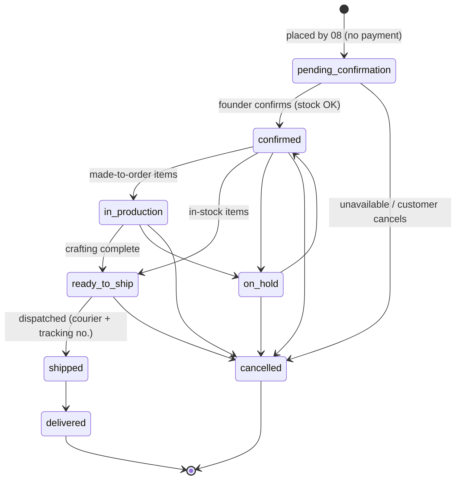

# 12 — Order Management & Fulfillment

> **Project:** `vaani-gift-e-commerce` · **Brand:** GooglyWoogly Art · **Base:** Jaipur, India · **Domain:** `googlywoogly.art`
> **Owner-perspective:** Product / Ops
> **Conforms to:** [`00-canonical-decisions.md`](./00-canonical-decisions.md) (CANON) — every entity, field, enum, route, cache-tag, and analytics name below is **verbatim** from CANON §5–§12. Builds on [`03-data-model`](./03-data-model-and-entities.md) (shapes), [`04-IA & routing`](./04-information-architecture-and-routing.md) (routes, no-cache contract, redirect rules), [`08-cart-checkout`](./08-cart-checkout-and-order-placement.md) (placement-side interface — this doc **picks up where `08` stops**: an order that already exists at `pending_confirmation` + `unpaid`), [`10-admin-foundation`](./10-admin-foundation-auth-dashboard.md) (admin shell, role matrix §5.4, `withAudit()`, `requireRole()`). Coordinates with `14-notifications` for delivery infrastructure — **`14` is not yet written**, so this doc defines the **notification trigger interface** (template keys, variables, channel-selection UX) and flags the hand-off in §11.
> **Authoritative for:** the admin **orders list** (`/admin/orders`), the admin **order detail** (`/admin/orders/[id]`), the **OrderStatus state machine** (CANON §7) and its in-code transition guard, the **two independent control axes** (fulfillment `status` + `paymentStatus`), the **OrderStatusEvent timeline**, per-transition **customer notification** (automated email + one-click WhatsApp deep-link + optional SMS V1), the customer-facing **`/track/[token]`** page, cancellations/holds/refund-status handling, the **optional GST invoice**, and the `updateOrderStatus` + `markPayment` server actions with their side effects.
> **Not authoritative for:** order *placement* / cart / checkout (`08`); email/SMS/WhatsApp **delivery infrastructure**, template *bodies*, DLT registration (`14`); product/inventory rules (`11`); the dashboard pending-orders queue widget (`10` §3.8 — surfaced there, action owned here); analytics rollup math (`13`).

**Money is integer paise everywhere** (CANON §10; `03` FR-3). All `subtotal`, `shippingFee`, `discountTotal`, `taxTotal`, `grandTotal` are paise; the display layer divides by 100 and formats `₹` with `en-IN` grouping. `currency = "INR"`. Timestamps are UTC in DB, **displayed in IST (Asia/Kolkata)**.

---

## 1. Purpose & Scope

### 1.1 What this covers

The **founder's order command center** and the **buyer's tracking window** — the entire lifecycle of an order **after** it is placed by `08`'s `placeOrder`:

1. **Orders list** (`/admin/orders`) — a filterable, searchable, sortable queue of every `Order`: filter by `OrderStatus` / `PaymentStatus` / date range / free-text search (by `orderNumber`, phone, email, customer name); sortable columns; bulk-select with bulk actions; CSV export (V1).
2. **Order detail** (`/admin/orders/[id]`) — customer block, line items (with personalization + gift message), shipping/billing address, money totals, the **two independent controls** (fulfillment `status` + `paymentStatus`), the `OrderStatusEvent` timeline, internal notes, and courier + tracking-number capture on ship.
3. **The OrderStatus state machine** (CANON §7) — allowed transitions enforced **in code** (a single guard table), each transition writing an `OrderStatusEvent`.
4. **Per-transition customer notification** — for each fulfillment transition the founder chooses which channels to notify on: **automated transactional email** (V0/MVP), **one-click WhatsApp deep-link** prefilled with the relevant message (MVP), and **optional SMS** (V1, after DLT). The founder picks per transition; sensible defaults pre-selected.
5. **Customer-facing `/track/[token]`** — a public, token-gated, `no-store`, `noindex` page showing the status timeline, current status, items, and courier/tracking info once shipped — with **no PII leakage** and **rate-limiting / token security**.
6. **Cancellations, holds, and refund status** — `cancelled` / `on_hold` fulfillment handling and the `refunded` / `partially_paid` payment states (offline refunds; the site records, it never moves money).
7. **Optional GST invoice** — generated only when `SiteSetting.gstin` is set (CANON §11); a printable/PDF invoice from the frozen `Order` + `OrderItem` snapshot.
8. **Server actions** — `updateOrderStatus` and `markPayment` (plus supporting actions) with Zod-validated inputs, outputs, side effects, and cache tags.

### 1.2 What this explicitly does NOT cover

- **Order placement / cart / checkout / WhatsApp-handoff-on-confirmation-page** — owned by `08`. This doc assumes the `Order`, `OrderItem[]`, the initial `OrderStatusEvent { status: pending_confirmation }`, and the `Customer` already exist.
- **On-site payment / gateway / card capture / refund execution** (CANON §1, §3). `paymentStatus` is **admin-managed bookkeeping** of an off-site (WhatsApp/UPI/bank) transaction. The site **never** collects or refunds money; `markPayment` only records the founder's assertion of payment state. No `Payment`/`Transaction` table in MVP (`03` FR-14).
- **Shopper login / accounts** (CANON §2). The buyer's only post-order surface is `/track/[token]` — no auth, no order history list.
- **Returns automation / RMA** (CANON §3, explicitly out). Cancellations and ad-hoc refunds are handled manually via status fields + WhatsApp; the *policy text* lives in the `/returns-and-refunds` CMS page (`15`).
- **Notification delivery infrastructure** (Resend/SMTP/MSG91 wiring, retry/backoff, DLT templates, template HTML bodies) — owned by `14`. This doc fixes only the **trigger, recipients, template keys, required variables, and channel-selection UX**.
- **Product variants** (CANON §3) — `OrderItem` is a flat snapshot line; no variant resolution.
- **Coupons / GST tax computation at placement** — V1; this doc *displays* `discountTotal` / `taxTotal` and *renders* them on the invoice but does not compute them (placement does, `08`/`11`).

---

## 2. Primary user stories / jobs-to-be-done

| # | As a… | I want… | so that… |
|---|---|---|---|
| JTBD-1 | Founder (owner/staff) | a single queue of all orders that I can filter to **"awaiting confirmation"** and act on from my phone | I confirm stock and collect payment fast, in priority order. |
| JTBD-2 | Founder | to open an order and see **everything** — who, what (with personalization + gift message), where to ship, and the money — on one screen | I can fulfil correctly without flipping between tools. |
| JTBD-3 | Founder | to **advance the fulfillment status** with a single tap, only along legal transitions, each step logged | I never put an order in an impossible state and I have a clean audit trail. |
| JTBD-4 | Founder | to mark **payment status** independently of fulfillment | I can record "paid" the moment money lands on WhatsApp, regardless of where shipping is. |
| JTBD-5 | Founder | each status change to **auto-email the customer** and give me a **one-tap pre-filled WhatsApp** message | the buyer is kept informed with zero typing on my part (PP-10 leverage). |
| JTBD-6 | Founder | to enter the **courier name + tracking number** when I dispatch, and have it appear on the customer's tracking page and email | the buyer can follow the parcel and stops asking "where is it?". |
| JTBD-7 | Founder | to **cancel** or **put on hold** an order with a reason, and **restock** any reserved units | I handle unavailability/disputes cleanly and don't lose inventory. |
| JTBD-8 | Founder | private **internal notes** on an order | I remember context (e.g. "customer wants delivery after Diwali") without leaking it to the buyer. |
| JTBD-9 | Buyer (guest) | a private link to **track my order's status and items** without logging in | I know what's happening and feel cared for, even from an unknown micro-brand. |
| JTBD-10 | Buyer (guest) | the tracking page to **never expose anyone else's data** and to show courier/tracking once shipped | I trust the brand with my information and can follow my parcel. |
| JTBD-11 | Corporate buyer (P3) | a **GST invoice** for an order when GST is enabled | my org's procurement/accounts accept the purchase. |
| JTBD-12 | Founder | to **export orders** to CSV for a date range | I can do accounting / reconcile WhatsApp payments offline. |
| JTBD-13 | Owner | every status/payment change to be **audited** (who, when, before→after) | I can answer "who changed this and when?" and trust the records (`10` FR-44). |

---

## 3. Detailed functional requirements

> Numbered, decisive. "MUST" = MVP unless a phase tag (V1/later) is noted. Cache tags use CANON §9 names verbatim. Enums are CANON §6 verbatim.

### 3.1 The two independent axes (foundational)

**FR-1 — Fulfillment and payment are orthogonal axes (CANON §7).** Every `Order` carries **two** independent state machines: `status` (`OrderStatus`, customer-facing fulfillment) and `paymentStatus` (`PaymentStatus`, offline payment bookkeeping). They MUST be advanced **separately** by separate controls and separate server actions (`updateOrderStatus`, `markPayment`). A `shipped` order may be `unpaid`; a `paid` order may be `pending_confirmation`. The UI MUST never couple them (with the single **convenience** exception in FR-12: confirming may *optionally* also mark payment in one sheet, still writing two distinct effects).

**FR-2 — Initial state is fixed by `08`.** A newly placed order is always `status = pending_confirmation`, `paymentStatus = unpaid`, `confirmedAt = null`, with exactly one `OrderStatusEvent { status: pending_confirmation, changedByAdminId: null, customerNotified: true, channelNotified: email }` already written by `placeOrder`. This doc never creates that first event; it appends subsequent ones.

### 3.2 OrderStatus state machine (fulfillment) — enforced in code

**FR-3 — Canonical transition table (CANON §7, authoritative).** The allowed `OrderStatus` transitions are **exactly** the set below and are enforced by a single pure function `assertTransition(from, to)` in `lib/orders/state-machine.ts`. Any transition not in this table is **rejected** server-side (`updateOrderStatus` returns `{ ok:false, error:"illegal_transition" }`) and the UI never offers it.

| From \ To | `confirmed` | `in_production` | `ready_to_ship` | `shipped` | `delivered` | `cancelled` | `on_hold` |
|---|:--:|:--:|:--:|:--:|:--:|:--:|:--:|
| `pending_confirmation` | ✅ | — | — | — | — | ✅ | — |
| `confirmed` | — | ✅ | ✅ | — | — | ✅ | ✅ |
| `in_production` | — | — | ✅ | — | — | ✅ | ✅ |
| `ready_to_ship` | — | — | — | ✅ | — | ✅ | — |
| `shipped` | — | — | — | — | ✅ | — | — |
| `delivered` | — | — | — | — | — | — | — *(terminal)* |
| `cancelled` | — | — | — | — | — | — | — *(terminal)* |
| `on_hold` | ✅ | — | — | — | — | ✅ | — |

> Derived from CANON §7's mermaid verbatim. Decisions filling CANON's implicit edges (recorded in §11 Open-Q-1):
> - `on_hold → confirmed` is the only resume path CANON draws; from `confirmed`/`in_production` you may go **to** `on_hold`. To resume production after a hold, go `on_hold → confirmed → in_production` (or `→ ready_to_ship`). **`on_hold → cancelled` is added** (a held order can be killed) — a pragmatic, non-controversial edge.
> - `cancelled` and `delivered` are **terminal** (no edges out). Un-cancelling is **not** supported in MVP (place a fresh order); recorded §11.
> - `ready_to_ship → on_hold` and `shipped → cancelled` are **disallowed** (a parcel in the courier network is not cancellable on-site; use a refund via `paymentStatus`).



**FR-4 — Every fulfillment transition writes an `OrderStatusEvent`.** `updateOrderStatus` MUST append a row `{ orderId, status: toStatus, note?, changedByAdminId, channelNotified?, customerNotified, createdAt }` inside the same transaction that updates `Order.status`. The timeline is append-only (CANON `03` §3.7.2); no event is ever edited or deleted.

**FR-5 — `confirmedAt` side-effect.** On the transition **to** `confirmed` (from `pending_confirmation` or `on_hold`), if `Order.confirmedAt` is null, set it to `now()`. It is set once and never cleared (it records "first confirmed").

**FR-6 — Ship transition requires courier + tracking.** The transition **to** `shipped` MUST require a **courier name** (free text or a picklist of common Indian couriers — Delhivery, Blue Dart, DTDC, India Post, Shiprocket, XpressBees, Ekart, Other) and a **tracking number** (non-empty string). These are persisted on the resulting `OrderStatusEvent.note` as a structured prefix **and** on dedicated `Order` columns `courierName` + `trackingNumber` + (optional) `trackingUrl` (**added fields**, §5.4 / Open-Q-2). The note renders human-readably on the timeline and tracking page (e.g. "Shipped via Delhivery · AWB 1234567890"). `updateOrderStatus` rejects a `shipped` transition lacking either field (`{ ok:false, error:"shipping_details_required" }`).

**FR-7 — Inventory reconciliation on cancel.** When an order moves to `cancelled`, for each `OrderItem` whose `productId` is non-null and whose product is **not** `madeToOrder`, the action MUST **restock** (`inventoryQuantity += quantity`) inside the transaction — because `08` decremented stock at placement (`08` FR-29). Made-to-order items are not restocked (never decremented). Restock revalidates the affected product/PLP caches (FR-30). A cancel from `pending_confirmation` still restocks (stock *was* decremented at placement). Idempotency: restock happens **only on the transition into** `cancelled`, never twice (guarded by the from-state check; `cancelled` is terminal so it cannot re-enter).

**FR-8 — Made-to-order awareness.** The order detail MUST visually flag line items where the snapshotted product was/is `madeToOrder` (badge "Made to order", and `productionLeadTimeDays` if known), because those drive the `confirmed → in_production` path and set buyer expectations. (The snapshot may not carry `madeToOrder`; see §5.4 — we resolve it live from `productId` when present, else infer from the `OrderItem` flag we add.)

### 3.3 PaymentStatus axis (offline bookkeeping)

**FR-9 — PaymentStatus is free-form admin bookkeeping (no enforced graph).** `paymentStatus` ∈ CANON `PaymentStatus` = `unpaid | awaiting_payment | paid | partially_paid | refunded`. Unlike fulfillment, payment has **no hard transition graph** — the founder may set any value at any time (offline reality is messy: a "paid" order can be "refunded"; an "awaiting_payment" can jump to "paid"). `markPayment` validates only that the value is a legal enum member. **Decision** (§11 Open-Q-3): we *recommend* but do not *enforce* the natural flow `unpaid → awaiting_payment → paid (→ partially_paid / refunded)`; the UI orders the picker accordingly and warns on backward jumps (e.g. `paid → unpaid`) with a confirm, but never blocks.

**FR-10 — Payment change writes an audit + optional timeline note.** `markPayment` MUST write an `AuditLog` row (`action: "order.payment_change"`, before/after `paymentStatus`) and MAY append an `OrderStatusEvent` **only** when the founder opts to note it (e.g. "Payment received ₹2,897 via UPI") — payment notes share the timeline but carry the *current fulfillment* `status` value (since `OrderStatusEvent.status` is required and is a fulfillment enum). To keep the timeline coherent, a payment-only note event sets `status = <current Order.status>` and prefixes the note with `[Payment]`. **No** customer email is sent on a payment change by default (payment is a private WhatsApp matter); the founder may still trigger a manual WhatsApp message.

**FR-11 — `partially_paid` captures a paid amount (optional).** When setting `partially_paid` (or `refunded`), the founder MAY enter an **amount in ₹** (converted to paise) stored on `Order.amountPaid` (**added field**, §5.4 / Open-Q-2) for at-a-glance reconciliation. This is informational only; no ledger.

**FR-12 — Confirm-and-collect convenience.** Because the canonical flow is "confirm stock **and** collect payment via WhatsApp" (CANON §7 edge label), the **Confirm order** action sheet offers an optional checkbox **"Also mark as paid"** (and an amount field). If checked, the action performs **both** `updateOrderStatus(→confirmed)` **and** `markPayment(→paid)` as two distinct, separately-audited effects in one transaction — still honoring FR-1 (orthogonal axes), just bundled in the UI for the most common real-world keystroke-saver.

### 3.4 Customer notifications per transition

**FR-13 — Notification is per-transition and founder-selectable.** Each fulfillment transition MAY notify the customer on up to three channels — **email** (MVP), **WhatsApp** (MVP, deep-link), **SMS** (V1) — and the founder **chooses which** in the transition action sheet via checkboxes. Defaults are pre-selected per the policy table FR-15. The chosen channels drive `OrderStatusEvent.channelNotified` (the **primary** channel recorded — see FR-16) and `OrderStatusEvent.customerNotified = (email || sms sent)`.

**FR-14 — Channel mechanics.**
- **Email** — an automated transactional email keyed by a per-status **template key** (FR-17). `updateOrderStatus` *requests* the send via `14`'s mailer interface **after commit** (fire-and-log; failure never rolls back — `08` FR-37 pattern); one `NotificationLog` row per send (`channel: email`, `template`, `to: customerEmail`, `status`).
- **WhatsApp** — a **one-click `wa.me` deep-link** (CANON §4: click-to-chat for MVP; not the Business API). The link opens the founder's WhatsApp with a **prefilled, status-specific message** (FR-18) addressed to the *customer's* number (`https://wa.me/{customerPhone}?text={encoded}`) — i.e. the founder taps it to *message the buyer*. It is **manual by nature** (opens an app), so it is logged as `NotificationLog { channel: whatsapp, status: sent }` **optimistically on click** (we cannot confirm delivery via deep-link) and fires a `whatsapp_click` analytics event (§9).
- **SMS (V1)** — DLT-approved templated SMS via MSG91/Fast2SMS (CANON §4, §11; `14`). Same trigger/log shape as email; **hidden in MVP** behind `SMS_ENABLED`.

**FR-15 — Default notification policy (decision).** Pre-checked channels per transition (founder can override per send):

| Transition (to) | Email default | WhatsApp default | SMS default (V1) | Customer-facing meaning |
|---|:--:|:--:|:--:|---|
| `confirmed` | ☑ | ☑ | ☐ | "Your order is confirmed — here's how to pay." |
| `in_production` | ☑ | ☐ | ☐ | "We've started handcrafting your order." |
| `ready_to_ship` | ☐ | ☐ | ☐ | (internal milestone; usually no buyer message) |
| `shipped` | ☑ | ☑ | ☑ | "Your order is on its way — track it here." (highest-value message) |
| `delivered` | ☑ | ☐ | ☐ | "Delivered! We'd love your feedback." |
| `cancelled` | ☑ | ☑ | ☐ | "Your order was cancelled — refund details inside." |
| `on_hold` | ☐ | ☑ | ☐ | (usually a personal WhatsApp explanation; email optional) |

> Rationale: `shipped` and `confirmed` are the two moments the buyer most wants to hear from us; `ready_to_ship` is an internal ops milestone (no default email to avoid notification fatigue). The founder can always tick/untick.

**FR-16 — `channelNotified` records the primary channel.** `OrderStatusEvent.channelNotified` is a **single** `NotificationChannel` (CANON enum). When multiple channels fire, we record the **highest-fidelity confirmed** one in priority order `email > sms > whatsapp > system` (email/SMS are server-sent and confirmable; WhatsApp is best-effort). If only WhatsApp was used, record `whatsapp`. If none, leave null and `customerNotified = false`. The full per-channel detail lives in `NotificationLog` rows; the event stores the headline channel for the timeline badge.

**FR-17 — Email template keys (interface to `14`).** Each notifying transition maps to a stable template key; `14` owns the bodies. Keys (CANON `EmailTemplate.key` convention):

| Status | `EmailTemplate.key` | Required variables |
|---|---|---|
| `confirmed` | `order_confirmed_customer` | `orderNumber, customerName, items[], grandTotal, trackUrl, whatsappUrl, payNote` |
| `in_production` | `order_in_production_customer` | `orderNumber, customerName, leadTimeDays?, trackUrl` |
| `ready_to_ship` | `order_ready_to_ship_customer` | `orderNumber, customerName, trackUrl` |
| `shipped` | `order_shipped_customer` | `orderNumber, customerName, courierName, trackingNumber, trackingUrl?, items[], trackUrl` |
| `delivered` | `order_delivered_customer` | `orderNumber, customerName, reviewUrl?, trackUrl` |
| `cancelled` | `order_cancelled_customer` | `orderNumber, customerName, reason?, refundNote?, whatsappUrl` |
| `on_hold` | `order_on_hold_customer` | `orderNumber, customerName, reason?, whatsappUrl` |

> `trackUrl = {NEXT_PUBLIC_SITE_URL}/track/{trackingToken}`. `08` already owns `order_received_customer` + `order_received_admin` (placement). This doc adds the seven lifecycle keys above. All keys are seeded into `EmailTemplate` (`14`/seed); a missing template → `NotificationLog.status = skipped` + Sentry warning, never a hard failure.

**FR-18 — WhatsApp prefilled bodies (status-specific).** The founder-to-customer deep-link text is composed server-side and surfaced as a tappable link in the transition result + on the order detail. Bodies (en-IN), built from the frozen order:

- **confirmed:** `Hi {firstName}! 🎉 Your GooglyWoogly order {orderNumber} is confirmed. To complete it, you can pay via UPI/bank — reply here and I'll share details. Track anytime: {trackUrl}`
- **shipped:** `Hi {firstName}! 📦 Your order {orderNumber} has shipped via {courierName} (Tracking: {trackingNumber}). Follow it here: {trackingUrl or trackUrl}. Thank you for supporting handmade! 💕`
- **on_hold:** `Hi {firstName}, a quick update on your order {orderNumber}: {reason}. I'll keep you posted — reply here with any questions. 🙏`
- **cancelled:** `Hi {firstName}, your order {orderNumber} has been cancelled. {refundNote}. So sorry for the inconvenience — reach out anytime. 🙏`
- **delivered:** `Hi {firstName}! ✅ Your order {orderNumber} was delivered. We'd love to hear how it went — and a review would mean the world to a small handmade brand. 💕`

> `firstName` = first token of `customerName`. All URL-encoded. Mirrors `08` §4.5's voice. The same builder (`buildWhatsAppCustomerMessage(order, status, extras)`) is reused on the order detail and the placement confirmation page.

**FR-19 — Manual re-send / re-notify.** The order detail MUST offer a **"Resend last email"** and a **"Message on WhatsApp"** affordance independent of a status change (covers `08` FR-37: a placement email that failed; or simply re-pinging a buyer). Re-send writes a fresh `NotificationLog` row; it does **not** write a new `OrderStatusEvent` (no status changed). This satisfies the `08` hand-off ("a 'resend email' affordance lives in `12`").

### 3.5 Orders list (`/admin/orders`)

**FR-20 — Server-rendered, filterable queue.** `/admin/orders` is **SSR `force-dynamic`, no full-page cache** (`04` §6.2), auth-gated, `noindex`. It lists `Order` newest-first by `createdAt` (default), reading via a single `queryOrders(params)` loader (§6.6). All filtering/sorting/pagination is **server-side** (URL-addressable via `searchParams`), mirroring the catalog faceting discipline (`06` FR-12) so behavior, counts, and pagination are correct.

**FR-21 — Filters (URL `searchParams`).**

| Filter | Param | Values | Mechanism |
|---|---|---|---|
| Fulfillment status | `status` | `OrderStatus` member(s), comma-sep | `Order.status IN (…)` |
| Payment status | `payment` | `PaymentStatus` member(s), comma-sep | `Order.paymentStatus IN (…)` |
| Date range | `from`,`to` | `YYYY-MM-DD` (IST) | `Order.createdAt` between (IST day bounds → UTC) |
| Search | `q` | free text | matches `orderNumber` (exact/prefix, case-insensitive) **OR** `customerPhone` (normalized) **OR** `customerEmail` (lower) **OR** `customerName` (trigram/ILIKE) |
| Source | `source` | `OrderSource` member(s) | `Order.source IN (…)` *(secondary)* |
| Sort | `sort` | `newest`(default)\|`oldest`\|`total_desc`\|`total_asc`\|`status` | ORDER BY + `id` tiebreaker |
| Page | `page` | int ≥1 | offset; page size **25** |

> Quick-filter **chips/tabs** above the table for the high-frequency views: **All · Awaiting confirmation (`status=pending_confirmation`) · In production · Ready to ship · Shipped · On hold · Unpaid (`payment=unpaid,awaiting_payment`)**. The "Awaiting confirmation" tab is the default landing intent from the dashboard (`10` FR-38) and shows a count badge.

**FR-22 — Columns (desktop table).** `orderNumber` (link) · date (IST, relative + absolute on hover) · customer name · items (count + first title) · `grandTotal` (₹) · **fulfillment status** badge · **payment status** badge · a row **actions** menu (Open · Confirm/Advance · Copy WhatsApp · Copy track link). Status badges are colour-coded (FR-39). `costPrice`/margin never appears (it's not on the order; staff financial redaction per `10` FR-26 still applies to any aggregate).

**FR-23 — Bulk select + bulk actions.** A header checkbox + per-row checkboxes enable bulk operations on the current filtered selection:
- **Bulk advance status** — only offered when **all** selected orders share the same `status` **and** the chosen target is a legal transition for that status (FR-3); otherwise the option is disabled with a tooltip ("Select orders in the same status"). Each order still writes its own `OrderStatusEvent` + optional notification. A confirm sheet summarizes "N orders → {status}", with a single shared notification-channel choice applied to all.
- **Bulk mark payment** — set `paymentStatus` on all selected (no transition graph; FR-9).
- **Bulk export CSV** (V1) — export selected rows (FR-25).
- Bulk actions run **sequentially server-side** in one action call (`bulkUpdateOrders`, §6.5) with a per-order success/failure result; partial failures are reported ("12 updated, 1 skipped: illegal transition"). Capped at **100 orders/bulk** (guardrail).

**FR-24 — Empty / loading.** Empty queue → friendly empty state per filter ("No orders awaiting confirmation — you're all caught up 🎉" for the pending tab; "No orders match these filters" + clear-filters for others). `loading.tsx` renders a table-skeleton (or card-skeleton on mobile); never blank.

**FR-25 — CSV export (V1).** An **Export** button exports the **current filtered result set** (not just the page) to CSV via a streamed Server Action / route `GET /admin/orders/export?…` (auth-gated). Columns: `orderNumber, createdAt(IST), status, paymentStatus, customerName, customerPhone, customerEmail, city, state, pincode, subtotal₹, shippingFee₹, discountTotal₹, taxTotal₹, grandTotal₹, amountPaid₹, courierName, trackingNumber, itemCount, itemsSummary`. Money rendered as decimal rupees for spreadsheet use. **PII caveat:** export is owner/admin only (not `staff`) and is itself audited (`order.export`, count + filter snapshot). Phased **V1** per CANON §3 (CSV import/export = V1).

### 3.6 Order detail (`/admin/orders/[id]`)

**FR-26 — Single-screen detail.** `/admin/orders/[id]` (`[id]` = internal cuid, admin-only per `04` FR-10) is SSR `force-dynamic`, `noindex`, auth-gated. It loads the full `Order` + `OrderItem[]` + `OrderStatusEvent[]` (chrono) + linked `Customer` + recent `NotificationLog[]` for the order in one query batch (§6.6). Layout in §4.2.

**FR-27 — Status control (fulfillment).** A prominent **status control** shows the current `status` badge + a **primary "Advance" button** that performs the *most likely next* legal transition (e.g. from `pending_confirmation` → "Confirm order"; from `ready_to_ship` → "Mark shipped"), plus a **"Change status ▾"** menu listing **only** the legal targets from the current state (FR-3). Selecting a transition opens a **confirm sheet** (`vaul` drawer on mobile, `10` FR-36) carrying: an optional **note**, the **notification-channel checkboxes** (defaults per FR-15), and transition-specific fields (courier+tracking for `shipped`; reason for `cancelled`/`on_hold`; "also mark paid" for `confirmed`, FR-12). Confirming calls `updateOrderStatus`.

**FR-28 — Payment control.** A separate **payment control** shows the current `paymentStatus` badge + a **"Update payment ▾"** menu of all `PaymentStatus` members (FR-9), opening a small sheet with an optional **amount** (₹, for `partially_paid`/`refunded`/`paid`) and an optional **"add timeline note"** toggle. Confirming calls `markPayment`. Backward/unusual jumps warn but don't block (FR-9).

**FR-29 — Internal notes.** An **internal notes** field (admin-only, never customer-visible) persisted on `Order.internalNotes` (**added field**, §5.4 / Open-Q-2; distinct from `customerNote`/`giftMessage` which are buyer-authored). Free text, autosaved or save-on-blur via `updateOrderNotes` (§6.4). Edits are audited.

**FR-30 — Timeline.** The `OrderStatusEvent` timeline renders newest-first (or oldest-first toggle), each entry showing: status badge, human label, IST timestamp (relative + absolute), the note (courier/tracking rendered specially), the actor (`changedByAdminId` → admin name, or "System"), and a **notification indicator** (which channel(s), from `channelNotified` + `customerNotified`). This is the same data the buyer sees on `/track` (minus actor/internal notes — FR-35).

**FR-31 — Re-validation of snapshot vs live product.** The detail MAY show, per line, a subtle indicator if the live product's price/title now differs from the snapshot (resolved via `OrderItem.productId` when non-null) — purely informational ("price changed since order"); the order's frozen `unitPrice`/`lineTotal` are **never** mutated (CANON `03` FR-11). If `productId` is null (product hard-deleted), the line renders entirely from the snapshot with no live link.

### 3.7 Customer-facing tracking (`/track/[token]`)

**FR-32 — Token-only access, no-store, noindex.** `/track/[token]` is **SSR `force-dynamic`, `cache: "no-store"`, `noindex,nofollow`** (`04` FR-7). The `[token]` is the 24-char `trackingToken` (CANON §10) — the **only** access key; `orderNumber`, `id`, phone, and email are **never** accepted as lookups here. Lookup is `findUnique({ where: { trackingToken } })`. An unknown/invalid token renders a **generic** "We couldn't find that order" with WhatsApp/contact links — it MUST NOT reveal whether a token ever existed (no 404-vs-200 oracle; both the not-found and the found render HTTP 200 from the same route, content differs) (`04` §9; `08` FR-40).

**FR-33 — Rate-limiting & token security.** Because the token is the sole bearer credential:
- The route MUST be **rate-limited per IP** (e.g. 30 requests / 5 min via the same in-memory/edge guard pattern as `10` FR-13; Upstash/Vercel KV in V1) to deter token brute-forcing; over-limit → `429` with a friendly retry message (the 24-char nanoid space makes guessing infeasible regardless, but rate-limiting is defense-in-depth).
- The optional poll endpoint `GET /api/track/[token]` (`04` §6.4, V1) is **no-store**, returns the **same redacted DTO** (FR-34), and shares the rate-limit.
- `trackingToken` is **never** placed in `<meta>`, canonical, sitemap, analytics `metadata`, or any indexable surface (CANON §10; `04` §10.1). Referrer-Policy `no-referrer` on this route so the token doesn't leak via outbound link referrers.
- No PII in the URL; the page sets `Cache-Control: no-store` and `X-Robots-Tag: noindex, nofollow` (defense beyond metadata, `04` §6.3).

**FR-34 — Tracking DTO is redacted (no PII leakage).** The data sent to the tracking page/poll MUST be a **deliberately redacted projection** — it includes only what the buyer already knows or needs:
- **Included:** `orderNumber`, current `status` (+ a friendly label & description), `paymentStatus` **as a friendly label only** (e.g. "Payment pending" / "Paid" — never an amount unless `paid`), order date (IST), the **items** (`productTitle`, `quantity`, `unitPrice`, `lineTotal`, `imageUrl`, `personalizationNote`, per-item `giftMessage`), totals (`subtotal`, `shippingFee`, `discountTotal`, `taxTotal`, `grandTotal`), **shipping city + state + pincode** (coarse, to confirm "yes that's my order" — **not** full line1/phone/email), the **timeline** (status + label + IST time + the *public* note, e.g. courier/tracking), and courier `courierName` + `trackingNumber` + `trackingUrl` once `shipped`.
- **Excluded (never sent to the client):** `customerPhone`, `customerEmail`, full `shippingAddress.line1/line2/landmark`, `billingAddress`, `internalNotes`, `changedByAdminId`/admin names, `costPrice` (not on order anyway), `amountPaid` (except echo of "Paid"), `customerId`, `clientRequestId`, any audit data. Implemented via a typed `trackingPublicSelect` + `toTrackingDTO()` mapper — the page never receives the raw `Order`.

**FR-35 — Timeline is buyer-friendly.** The tracking timeline shows the **same `OrderStatusEvent` sequence** as admin but: hides the actor, hides `[Payment]`-prefixed internal payment notes and any note flagged internal, renders each status as a friendly stage with copy (FR-37), and presents it as a **vertical stepper** with the current stage highlighted. Cancelled/on-hold render distinctly (FR-36).

**FR-36 — Status presentation (buyer-facing copy & stepper).** Map `OrderStatus` → buyer stage:

| `OrderStatus` | Buyer stage label | Helper copy | Stepper treatment |
|---|---|---|---|
| `pending_confirmation` | "Order received" | "We've got your order and will confirm availability on WhatsApp shortly." | step 1 active |
| `confirmed` | "Confirmed" | "Your order is confirmed. Complete payment on WhatsApp to begin." | step 2 |
| `in_production` | "Being handcrafted" | "Each piece is made by hand — this one's in the works." | step 3 (MTO only) |
| `ready_to_ship` | "Packed & ready" | "Your order is packed and ready to dispatch." | step 4 |
| `shipped` | "Shipped" | "On its way via {courier}. Tracking: {trackingNumber}." | step 5 + tracking CTA |
| `delivered` | "Delivered" | "Delivered! We hope you love it. 💕" | step 6 complete |
| `cancelled` | "Cancelled" | "This order was cancelled. {refund/contact note}" | **terminal banner** (amber), stepper greyed |
| `on_hold` | "On hold" | "We've paused this order — we'll reach out on WhatsApp." | **inline banner** on current step (amber) |

> The stepper renders the linear happy path (`received → confirmed → handcrafted → packed → shipped → delivered`); `in_production` is shown only when the order passed through it or has MTO items; `cancelled`/`on_hold` are overlays, not steps. `paymentStatus` shows as a small pill ("Payment pending / Paid") near the top with a WhatsApp CTA to pay.

**FR-37 — Tracking page CTAs.** Primary CTA = **"Chat with us on WhatsApp"** (`wa.me/{SiteSetting.whatsappNumber}` prefilled with `orderNumber` + a help line) — the buyer→founder direction (payment/questions happen there, CANON §1). Secondary: **"Copy tracking number"** (when shipped) and **courier tracking link** (`trackingUrl`, opens courier site, `rel="noopener noreferrer"`). Footer trust line + links to shipping/returns policies.

### 3.8 GST invoice (optional)

**FR-38 — Invoice is gated on `SiteSetting.gstin` (CANON §11).** Invoice generation is **off** until `SiteSetting.gstin` is set. When set, the order detail shows a **"Download invoice (PDF)"** / **"View invoice"** action that renders a printable GST invoice from the **frozen** `Order` + `OrderItem` snapshot. Phased: the *capability* is **V1** (CANON §3 "GST invoicing = V1"); the **gating + button + a print-stylesheet HTML invoice** ship as the MVP-ready scaffold (disabled until GSTIN exists), with PDF generation finalized in V1.

**FR-38a — Invoice content.** A compliant tax-invoice layout: seller block (`SiteSetting.businessAddress.legalName`, address, **GSTIN**), invoice number (decision: `INV-{orderNumber}` so it traces 1:1 to the order; recorded §11), invoice date (= `confirmedAt` or `createdAt`, IST), buyer block (`customerName`, shipping address, phone), a line table (item, HSN?(optional, blank if unknown), qty, unit price, taxable value, GST rate, CGST/SGST or IGST split, line total), and totals (taxable subtotal, total GST, shipping, discount, **grand total**, amount in words). **GST split rule:** intra-state (seller state == buyer `shippingAddress.state`, i.e. Rajasthan) → **CGST + SGST**; inter-state → **IGST** (decision §11). Because MVP computes `taxTotal = 0` (GST off), the invoice only carries real tax once V1 GST computation lands; until then it prints a clean non-GST bill/receipt if rendered. Invoice rendering is **read-only** (no entity writes); generating one writes an audit row (`order.invoice_generated`) and may stamp `Order.invoiceNumber` (**added, optional**) on first generation for idempotency.

### 3.9 Cross-cutting

**FR-39 — Status colour & label system (shared admin + design).** A single `lib/orders/status-meta.ts` maps each `OrderStatus` and `PaymentStatus` to `{ label, badgeVariant/colour, icon }` used by the list badges, detail, timeline, and dashboard queue (`10`) so colour semantics are consistent app-wide. Suggested palette (AA-verified, CANON §4): `pending_confirmation`=amber, `confirmed`=blue, `in_production`=violet, `ready_to_ship`=indigo, `shipped`=teal, `delivered`=green, `cancelled`=red/grey, `on_hold`=amber-outline; payment: `unpaid`=grey, `awaiting_payment`=amber, `paid`=green, `partially_paid`=amber, `refunded`=red-outline.

**FR-40 — Every mutation is audited (`10` FR-44).** `updateOrderStatus`, `markPayment`, `updateOrderNotes`, bulk actions, exports, and invoice generation MUST route through `withAudit()` (`10` §6.4) with `action ∈ { order.status_change, order.payment_change, order.notes_update, order.bulk_update, order.export, order.invoice_generated, order.notify }` and PII-redacted before/after. `OrderStatusEvent.changedByAdminId = ctx.session.adminId`.

**FR-41 — Role gating (`10` §5.4).** Per the canonical matrix, **`owner`/`admin`/`staff` may all** view orders and perform status + payment transitions, notes, and WhatsApp/email (orders are a fulfilment surface staff own). **Export (FR-25) is owner/admin only** (PII bulk extract). **Invoice** view is owner/admin (financial doc); staff may trigger a buyer notification but the GST invoice is gated to admin+. `requireRole()` enforces server-side; UI hides what's not allowed.

**FR-42 — Side-effects never roll back the order mutation.** The DB write (status/payment change + event + restock + audit) is one atomic transaction. **Notifications (email/SMS/WhatsApp-log) and analytics run AFTER commit** and are best-effort (`08` FR-37): a failed email is caught, logged (`NotificationLog.status = failed`, Sentry), surfaced on the detail via FR-19's resend affordance — but the status change **stands**.

**FR-43 — No storefront cache revalidation from order mutations (CANON `04` §7).** `updateOrderStatus` / `markPayment` / notes revalidate **no** storefront ISR tags — the tracking page is `no-store` (always fresh) and admin is no-cache. The **single exception** is FR-7's cancel-restock, which changes `inventoryQuantity` and therefore **does** revalidate the affected `product:{slug}` + `products` tags (and `category:{slug}` of the product), exactly as an inventory adjustment would (`04` §7 product row; aligns with `11`). This is the only place order-side logic touches catalog caches.

---

## 4. UX / UI breakdown

> Built on Tailwind v4 + shadcn/ui (Radix) + framer-motion (CANON §4), reusing vendored `table.tsx`, `badge.tsx`, `sheet.tsx`/`vaul` drawer, `dropdown-menu.tsx`, `checkbox.tsx`, `tabs.tsx`, `card.tsx`, `breadcrumb.tsx`, `sonner`/`toast`, `skeleton`, `empty.tsx`, `alert.tsx`, `select.tsx`, `input`, `textarea`. **Phone-first** (the founder runs this from a phone — CANON §2.4, §15.8). Admin chrome (sidebar/topbar/breadcrumbs) comes from `10`.

### 4.1 Orders list (`/admin/orders`)

```
┌───────────────────────────────────────────────────────────────────────────────┐
│ Admin › Orders                                              [ Export ▾ (V1) ]    │
│ [ All ] [ Awaiting confirmation •7 ] [ In production ] [ Ready ] [ Shipped ] …   │  ← quick tabs (FR-21)
│ ┌─ filters ─────────────────────────────────────────────────────────────────┐  │
│ │ 🔍 Search order #, phone, email, name   │ Status ▾ │ Payment ▾ │ 📅 From–To │  │
│ └────────────────────────────────────────────────────────────────────────────┘  │
│ ☐  Order #        Date        Customer      Items      Total    Status   Payment │
│ ☐  GW-2026-00042  13 Jun·2h   Aanya Sharma  2 · Mug…   ₹2,897   ●Pending  ○Unpaid │  ⋯
│ ☐  GW-2026-00041  13 Jun·5h   R. Mehta      1 · Diya   ₹1,299   ●Shipped  ●Paid   │  ⋯
│ …                                                                                 │
│ [ ☑ 3 selected → Advance status ▾  ·  Mark payment ▾  ·  Export ]                 │  ← bulk bar (FR-23)
│                                   Showing 1–25 of 138        ‹ 1 2 3 … ›          │
└───────────────────────────────────────────────────────────────────────────────┘
```

- **Quick tabs** (FR-21) are the primary navigation; "Awaiting confirmation" carries a live count badge and is the default deep-link target from the dashboard (`10` FR-38). Tabs set `?status=` (and the unpaid tab sets `?payment=`).
- **Filter bar:** search input (debounced, submits to `?q=`), `Status`/`Payment` multi-select popovers (`OrderStatus`/`PaymentStatus` members with colour dots), date-range picker (IST). A **"Clear filters"** chip appears when any filter is active. Active filters reflect in the URL (shareable).
- **Table:** columns per FR-22. Row click (anywhere except checkbox/actions) opens the detail. The **⋯ actions menu** per row: *Open · Confirm / Advance (context-aware) · Copy WhatsApp message · Copy tracking link · View invoice (if GSTIN)*. Status + payment badges use the shared colour system (FR-39).
- **Bulk:** header checkbox selects the page; a sticky **bulk action bar** appears when ≥1 selected, offering Advance status (enabled only when selection is same-status, FR-23), Mark payment, Export (V1). A count + "clear selection".
- **Pagination:** `pagination.tsx` footer, page size 25, "Showing X–Y of Z".
- **Mobile (phone-first):** the table collapses to **stacked cards** (`03` §4) — each card: `orderNumber` + status/payment badges (top row), customer + items + total, relative time, and a 2-button footer (**Open**, context **Advance**). Quick-tabs become a horizontally-scrollable chip row. Bulk select is available via a long-press / "Select" toggle but is a secondary path on mobile (the founder mostly acts one order at a time on a phone). Filters live behind a **"Filters" `Sheet`**.

### 4.2 Order detail (`/admin/orders/[id]`)

Two-column on desktop (primary content left, sticky action rail right); single stacked column on mobile with the **status/payment controls pinned at top** (most-used) and a sticky bottom **Advance** button.

```
┌──────────────────────────────────────────────────────────────────────────────────┐
│ Admin › Orders › GW-2026-00042                         [ View invoice ] (if GSTIN) │
├──────────────────────────────────────────┬───────────────────────────────────────┤
│  ORDER GW-2026-00042   ·  13 Jun 2026     │  ┌─ STATUS (fulfillment) ───────────┐  │
│  ●Pending confirmation   ○Unpaid          │  │  ●Pending confirmation            │  │
│                                           │  │  [  Confirm order  ]  Change ▾    │  │  ← FR-27
│  ┌─ CUSTOMER ───────────────────────────┐ │  └───────────────────────────────────┘  │
│  │ Aanya Sharma                          │ │  ┌─ PAYMENT ────────────────────────┐  │
│  │ 📞 +91 98xxxxxx12  💬 WhatsApp        │ │  │  ○Unpaid       Update payment ▾   │  │  ← FR-28
│  │ ✉ aanya@…  ·  3 orders · CRM ↗        │ │  └───────────────────────────────────┘  │
│  └───────────────────────────────────────┘ │  ┌─ NOTIFY ─────────────────────────┐  │
│  ┌─ ITEMS ──────────────────────────────┐ │  │  Resend last email                │  │  ← FR-19
│  │ ▢ Hand-painted Mug ×2     ₹1,598      │ │  │  💬 Message customer on WhatsApp  │  │
│  │    Engrave: "Aanya"  ·  🎁 "Happy…"   │ │  └───────────────────────────────────┘  │
│  │ ▢ Brass Diya Set ×1  (MTO) ₹1,299     │ │                                         │
│  └───────────────────────────────────────┘ │  ┌─ INTERNAL NOTES ─────────────────┐  │
│  ┌─ SHIPPING ADDRESS ───────────────────┐ │  │  (admin-only, autosave)           │  │  ← FR-29
│  │ Aanya Sharma, 12 MI Road, Jaipur,     │ │  └───────────────────────────────────┘  │
│  │ Rajasthan 302001  ·  📞 …             │ │                                         │
│  └───────────────────────────────────────┘ │                                         │
│  ┌─ TOTALS ─────────────────────────────┐ │                                         │
│  │ Subtotal 2,897 · Shipping 0 · GST 0   │ │                                         │
│  │ Discount 0  ·  GRAND TOTAL ₹2,897     │ │                                         │
│  └───────────────────────────────────────┘ │                                         │
│  ┌─ TIMELINE ───────────────────────────┐ │                                         │
│  │ ● Pending confirmation · 2h · System  │ │                                         │
│  │   (notified: ✉)                       │ │                                         │
│  └───────────────────────────────────────┘ │                                         │
└──────────────────────────────────────────┴───────────────────────────────────────┘
```

**Sections (left column):**
- **Header:** `orderNumber`, placement date (IST), **two badges** (status + payment) using FR-39 colours. Source pill (web/bulk/manual) if not web.
- **Customer block:** `customerName`, `customerPhone` (with a **WhatsApp** quick link → buyer), `customerEmail` (mailto), and a link to the CRM `Customer` record (`/admin/customers`) showing `ordersCount` (repeat-buyer signal). Staff sees no `totalRequested` (`10` FR-26).
- **Items:** each `OrderItem` — thumbnail (`imageUrl`), `productTitle`, `sku` (muted), `quantity`, `unitPrice`, `lineTotal`; **personalization** (`personalizationNote`) and **gift message** (`giftMessage`) rendered as labelled callouts (these are the fulfilment-critical handmade details). A **"Made to order"** badge + lead-time when applicable (FR-8). Order-level `Order.giftMessage` (if any) shown once above the lines.
- **Shipping address** (full `Address`) + **billing** (only if `billingAddress` present, else "Same as shipping"). A **copy address** button (for the courier label).
- **Totals:** `subtotal`, `shippingFee`, `discountTotal`, `taxTotal` (labelled "GST"), **`grandTotal`** emphasized; `amountPaid` shown if set (FR-11). `customerNote` (buyer's note) shown if present.
- **Timeline:** the `OrderStatusEvent` stepper/list (FR-30) with notification indicators and actor.

**Action rail (right, sticky on desktop; pinned-top on mobile):**
- **Status control** (FR-27): current badge, primary context **Advance** button (label adapts: Confirm order / Start production / Mark ready / **Mark shipped** / Mark delivered), and **Change status ▾** (legal targets only).
- **Payment control** (FR-28): current badge + **Update payment ▾**.
- **Notify** (FR-19): Resend last email · Message on WhatsApp.
- **Invoice** (FR-38): View/Download (if GSTIN), else hidden.

**Transition confirm sheet** (opens from Advance/Change — `vaul` drawer on mobile, `dialog`/`sheet` on desktop):
- Title "Confirm order → Confirmed" (etc.).
- Optional **note** textarea.
- **Notification channels** checkboxes (Email / WhatsApp / SMS-V1) pre-checked per FR-15, each with a one-line preview of what the buyer receives; the WhatsApp option, when chosen, reveals a **"Open WhatsApp"** button that launches the prefilled deep-link (the founder taps to actually send — FR-14).
- **Transition-specific fields:**
  - `→ shipped`: **Courier** (select: Delhivery/Blue Dart/DTDC/India Post/Shiprocket/XpressBees/Ekart/Other) + **Tracking number** (required) + optional **Tracking URL**. (FR-6)
  - `→ cancelled` / `→ on_hold`: **Reason** (select of common reasons + free text) — surfaced to buyer in copy/WhatsApp; cancel shows a "stock will be restocked" note (FR-7).
  - `→ confirmed`: **"Also mark as paid"** checkbox + optional **amount** (FR-12).
- Primary **Confirm** button (disabled until required fields valid); shows pending state; on success toast + sheet closes + timeline updates (optimistic, reconciled).

**Mobile specifics:** single column; **status & payment controls pinned at top**; a **sticky bottom bar** with the context **Advance** button (thumb-reachable, ≥44px, `10` FR-36); all sheets are bottom drawers; copy/WhatsApp buttons are large tap targets.

### 4.3 Tracking page (`/track/[token]`)

Clean, on-brand (pink/playful but calm), single column, mobile-first. **No admin chrome.**

```
┌──────────────────────────────────────────────┐
│  GooglyWoogly Art                             │
│  Order GW-2026-00042   ·  placed 13 Jun 2026  │
│  Payment: ● Pending   [ 💬 Pay on WhatsApp ]  │
│                                               │
│  ●───●───○───○───○───○                         │  ← stepper (FR-36)
│  Received Confirmed Handcrafted Packed Shipped Delivered
│                                               │
│  ┌─ Current: Confirmed ──────────────────────┐│
│  │ Your order is confirmed. Complete payment ││
│  │ on WhatsApp to begin. 💕                   ││
│  └────────────────────────────────────────────┘│
│  ┌─ Items ───────────────────────────────────┐│
│  │ ▢ Hand-painted Mug ×2   ₹1,598  Engrave…  ││
│  │ ▢ Brass Diya Set ×1     ₹1,299  (MTO)     ││
│  │  Subtotal ₹2,897 · Shipping FREE · ₹2,897 ││
│  └────────────────────────────────────────────┘│
│  ┌─ Updates ─────────────────────────────────┐│
│  │ ● Confirmed        · 13 Jun, 4:10 pm       ││
│  │ ● Order received   · 13 Jun, 2:02 pm       ││
│  └────────────────────────────────────────────┘│
│  Shipping to: Jaipur, Rajasthan 302001         │  ← coarse only (FR-34)
│  [ 💬 Chat with us on WhatsApp ]                │
│  Shipping policy · Returns · Care guide        │
└──────────────────────────────────────────────┘
```

- **Header:** brand, `orderNumber`, placement date (IST), a **payment pill** ("Payment pending"/"Paid") with a **"Pay on WhatsApp"** CTA when not paid (FR-37).
- **Stepper** (FR-36): horizontal on desktop, vertical on mobile; current stage highlighted; `in_production` step shown when relevant; **cancelled/on_hold** render as a prominent **amber/red banner** replacing/overlaying the stepper with the appropriate copy.
- **Current-status card:** big friendly label + helper copy (FR-36). When `shipped`: shows **courier + tracking number**, a **Copy** button, and a **"Track with {courier}"** link (`trackingUrl`).
- **Items:** redacted line list (titles, qty, price, personalization, gift message, thumbnails) + totals (FR-34). Reorder links to the live PDP via slug (resolved through `productId` when available) — a gentle re-purchase nudge.
- **Updates:** buyer-friendly timeline (FR-35) — public notes only, no actor.
- **Coarse shipping confirmation:** "Shipping to {city}, {state} {pincode}" — enough to recognize the order, **never** full street/phone/email (FR-34).
- **Footer:** WhatsApp CTA (buyer→founder), policy links.
- **States:** invalid token → centered generic "We couldn't find that order. Check your link or message us on WhatsApp." (no leak, FR-32); rate-limited → "Please wait a moment and refresh." (FR-33); loading → skeleton stepper + card.
- **A11y:** stepper is an ordered list with `aria-current="step"`; status changes announced via `aria-live="polite"` if polling (V1); all CTAs are real links/buttons with discernible names; AA contrast on all badges.

### 4.4 GST invoice (print/PDF)

A dedicated print-stylesheet view (`/admin/orders/[id]/invoice`, owner/admin, `noindex`) or a generated PDF: A4 layout, seller (legal name + GSTIN + address), buyer, line table with taxable value + CGST/SGST or IGST split, totals, amount in words, "This is a computer-generated invoice." Plain, accountant-friendly, brand mark in header. Hidden entirely unless `SiteSetting.gstin` is set (FR-38).

---

## 5. Data & entities used

> CANON `03` names verbatim. **R** = read, **W** = written. This module is overwhelmingly a **reader/updater** of commerce entities created by `08`.

### 5.1 Entities

| Entity | R/W | Where / fields |
|---|---|---|
| `Order` | **R/W** | **R** list + detail + track (by id / `trackingToken`): all fields. **W** by `updateOrderStatus` (`status`, `confirmedAt`, `courierName`/`trackingNumber`/`trackingUrl` added), `markPayment` (`paymentStatus`, `amountPaid` added), `updateOrderNotes` (`internalNotes` added), invoice (`invoiceNumber` added, optional). |
| `OrderItem` | **R** | detail + track + invoice: `productTitle, sku, imageUrl, unitPrice, quantity, lineTotal, personalizationNote, giftMessage, productId` (+ added `madeToOrderSnapshot`, `productionLeadTimeDaysSnapshot` — §5.4). **Never** mutated (frozen, `03` FR-11). |
| `OrderStatusEvent` | **R/W** | **R** timeline (admin + track). **W** one row per transition / payment-note / notify (append-only): `{ orderId, status, note?, changedByAdminId, channelNotified?, customerNotified, createdAt }`. |
| `Customer` | **R** | detail customer block (`name, phone, email, ordersCount, totalRequested[owner/admin], tags`); linked via `Order.customerId`. Not written here (placement owns counters). |
| `Product` | **R/W** | **R** (storefront-safe select, never `costPrice`) to show live-vs-snapshot diff (FR-31) + resolve `madeToOrder`/`slug`. **W** only on **cancel restock** (FR-7): `inventoryQuantity += qty` for non-MTO lines. |
| `NotificationLog` | **R/W** | **R** recent sends on detail. **W** one row per email/SMS/WhatsApp send/attempt (`channel, template, to, subject?, status, providerMessageId?, error?`). |
| `EmailTemplate` | **R** | resolve template by `key` (FR-17) for the mailer (`14` owns send). |
| `SiteSetting` | **R** | `whatsappNumber` (buyer-chat CTA), `contactEmail`, `gstin` (invoice gate), `businessAddress` (invoice seller), `currency`. |
| `AdminUser` | **R** | resolve `changedByAdminId` → name for timeline/audit; `requireRole` session. |
| `AuditLog` | **W** | every mutation via `withAudit()` (`10` §6.4). |
| `AnalyticsEvent` | **W** | `order_confirmed` (admin-confirm), `whatsapp_click` (founder taps buyer deep-link). (§9) |

### 5.2 Read vs written by surface

| Surface | Reads | Writes |
|---|---|---|
| Orders list (`/admin/orders`) | `Order`, `Customer` (name only via join) | — |
| Order detail (`/admin/orders/[id]`) | `Order`, `OrderItem`, `OrderStatusEvent`, `Customer`, `NotificationLog`, `Product`(live diff), `SiteSetting` | — (reads) |
| `updateOrderStatus` action | `Order`, `OrderItem`, `Product`, `EmailTemplate`, `SiteSetting`, `AdminUser`(session) | `Order`, `OrderStatusEvent`, `Product`(restock on cancel), `NotificationLog`(post-commit), `AuditLog`, `AnalyticsEvent` |
| `markPayment` action | `Order` | `Order`, `OrderStatusEvent`(optional note), `AuditLog` |
| `updateOrderNotes` action | `Order` | `Order.internalNotes`, `AuditLog` |
| `bulkUpdateOrders` action | `Order[]`, `Product` | per-order as `updateOrderStatus`/`markPayment` |
| `resendOrderEmail` / `notifyOrder` | `Order`, `EmailTemplate` | `NotificationLog`, `AuditLog` |
| Export CSV (V1) | `Order` (filtered) | `AuditLog` (`order.export`) |
| Invoice | `Order`, `OrderItem`, `SiteSetting` | `AuditLog`, optional `Order.invoiceNumber` |
| Tracking (`/track/[token]`) | `Order`+`OrderItem`+`OrderStatusEvent` by `trackingToken` (redacted DTO) | — |
| Track poll (`/api/track/[token]`, V1) | same | — |

### 5.3 Cache tags

Per CANON `04` §7, **order mutations revalidate no storefront tags** — `/track` is `no-store` and admin is no-cache. **Sole exception:** the **cancel-restock** (FR-7) revalidates `product:{slug}`, `products`, and the product's `category:{slug}` (it mutates `inventoryQuantity`, identical to an inventory adjustment in `11`/`04` §7). All other actions: **`revalidates: none`**.

### 5.4 Added fields / entities (CANON gaps — recorded §11 Open-Q-2)

CANON `Order`/`OrderItem` (§5; `03` §3.7.2) lack columns for shipping-courier capture, offline-payment amount, internal notes, and MTO snapshot. These are **mechanism, not new product scope**; added here, to be folded into `03`:

| Entity.field | Type | Purpose / FR |
|---|---|---|
| `Order.courierName` | String? | Courier on ship (FR-6). |
| `Order.trackingNumber` | String? | AWB/tracking no. on ship (FR-6). |
| `Order.trackingUrl` | String? | Optional courier tracking deep-link (FR-6/37). |
| `Order.amountPaid` | Int? (paise) | Offline amount recorded (FR-11). |
| `Order.internalNotes` | String? `@db.Text` | Admin-only notes (FR-29) — distinct from buyer `customerNote`/`giftMessage`. |
| `Order.invoiceNumber` | String? (U) | Stamped on first invoice gen for idempotency (FR-38a). |
| `OrderItem.madeToOrderSnapshot` | Boolean (dflt false) | Freeze MTO at placement so detail/track flag it without live product (FR-8). |
| `OrderItem.productionLeadTimeDaysSnapshot` | Int? | Freeze lead time at placement (FR-8). |

> The courier/tracking could alternatively live only on the ship `OrderStatusEvent.note`; we store on `Order` too for O(1) list/track access and CSV export. `08`'s `placeOrder` should populate the two `OrderItem` snapshot fields (one-line addition there; flagged to `08`).

---

## 6. Server actions / API routes

> All in `app/(admin)/admin/orders/actions.ts` (Server Actions), except the tracking poll route. **Every** admin action: Zod-validates input → `requireRole()` (`10` §5.4) → runs the DB mutation in a transaction wrapped by `withAudit()` (`10` §6.4) → post-commit best-effort side effects (notifications/analytics, FR-42). Money in paise. Outputs are discriminated unions for typed error handling.

### 6.1 `updateOrderStatus` (the core fulfillment action)

```ts
// Input (Zod)
updateOrderStatusSchema = z.object({
  orderId: z.string().cuid(),
  toStatus: z.nativeEnum(OrderStatus),
  note: z.string().trim().max(1000).optional(),
  notify: z.object({                       // founder's channel choices (FR-13)
    email: z.boolean().default(false),
    whatsapp: z.boolean().default(false),
    sms: z.boolean().default(false),       // ignored unless SMS_ENABLED
  }).default({}),
  // transition-specific (validated by superRefine against toStatus):
  shipping: z.object({                     // required when toStatus === "shipped" (FR-6)
    courierName: z.string().trim().min(1).max(60),
    trackingNumber: z.string().trim().min(1).max(60),
    trackingUrl: z.string().url().max(300).optional(),
  }).optional(),
  reason: z.string().trim().max(500).optional(),  // for cancelled / on_hold
  alsoMarkPaid: z.boolean().default(false),        // confirm convenience (FR-12)
  paidAmount: z.number().int().nonnegative().optional(), // paise, with alsoMarkPaid / partial
  expectedCurrentStatus: z.nativeEnum(OrderStatus).optional(), // optimistic-concurrency guard
});
```

- **Output:** discriminated union
  - `{ ok: true; status: OrderStatus; event: OrderStatusEventDTO; whatsappUrl?: string }`
  - `{ ok:false; error: "illegal_transition" | "shipping_details_required" | "stale_status" | "not_found" | "forbidden" | "validation"; fieldErrors? }`
- **Auth:** `requireRole("staff")` (all roles may transition orders — FR-41).
- **Logic (transaction):**
  1. Load `Order` (`select` incl. `status`, `confirmedAt`, items, customer fields). Not found → `not_found`.
  2. **Optimistic concurrency:** if `expectedCurrentStatus` provided and ≠ `Order.status` → `stale_status` (another admin changed it; UI re-fetches). (FR — prevents two-device races on a single founder's phone+laptop.)
  3. `assertTransition(Order.status, toStatus)` (FR-3). Illegal → `illegal_transition`.
  4. If `toStatus === "shipped"` and `shipping` missing → `shipping_details_required`.
  5. **Apply effects:** `UPDATE Order SET status = toStatus [, confirmedAt = now() if →confirmed & null] [, courierName/trackingNumber/trackingUrl if →shipped]`.
  6. If `toStatus === "cancelled"`: **restock** non-MTO lines (`FR-7`) — `UPDATE products SET inventory_quantity = inventory_quantity + {qty} WHERE id = {productId}` for each line with non-null `productId` and not MTO.
  7. If `alsoMarkPaid` (only meaningful on `→confirmed`): also `UPDATE Order SET paymentStatus='paid' [, amountPaid=paidAmount]` and record an extra audit (`order.payment_change`) — two effects, FR-12.
  8. **Append `OrderStatusEvent`** `{ status: toStatus, note: composedNote(reason/shipping), changedByAdminId: ctx.adminId, channelNotified: primaryChannel(notify), customerNotified: notify.email||notify.sms }`.
  9. `withAudit(action:"order.status_change", before:{status}, after:{status:toStatus,...})`.
- **Post-commit (best-effort, FR-42):**
  - For each chosen channel: enqueue/send via `14` mailer (email → `order_*_customer` template FR-17; SMS V1) → write `NotificationLog`. WhatsApp → build deep-link (`buildWhatsAppCustomerMessage`, FR-18), return its URL in the result for the UI to open, log `NotificationLog{channel:whatsapp, status:sent}` (optimistic).
  - Emit `order_confirmed` analytics on `→confirmed` (admin confirmation milestone, CANON `AnalyticsEventType`); emit `whatsapp_click` when the founder actually taps the returned WhatsApp link (client-side, §9).
- **Revalidates:** **none**, except on cancel-restock → `revalidateTag("product:{slug}")`, `revalidateTag("products")`, `revalidateTag("category:{slug}")` for each restocked line (FR-43).

```mermaid
sequenceDiagram
  participant F as Founder (admin)
  participant A as updateOrderStatus (action)
  participant DB as Postgres (txn)
  participant M as 14 Mailer / NotificationLog
  participant WA as WhatsApp (wa.me)
  F->>A: orderId, toStatus, note, notify{email,whatsapp}, shipping?
  A->>A: Zod validate → requireRole
  A->>DB: BEGIN; load Order
  A->>A: assertTransition(from,to)  %% FR-3
  alt illegal
    A-->>F: { ok:false, error:"illegal_transition" }
  else legal
    A->>DB: UPDATE Order (status, confirmedAt?, courier/tracking?)
    opt to == cancelled
      A->>DB: restock non-MTO lines  %% FR-7
    end
    A->>DB: INSERT OrderStatusEvent
    A->>DB: INSERT AuditLog (withAudit)
    A->>DB: COMMIT
    par post-commit (best-effort)
      A->>M: send order_*_customer email → NotificationLog
    and
      A-->>F: { ok:true, whatsappUrl }  %% UI opens link
      F->>WA: tap → prefilled buyer message + whatsapp_click
    end
    opt cancel restock
      A->>A: revalidateTag(product/products/category)
    end
  end
```

### 6.2 `markPayment`

```ts
markPaymentSchema = z.object({
  orderId: z.string().cuid(),
  paymentStatus: z.nativeEnum(PaymentStatus),
  amountPaid: z.number().int().nonnegative().optional(), // paise
  addTimelineNote: z.boolean().default(false),
  note: z.string().trim().max(500).optional(),
});
```
- **Output:** `{ ok:true; paymentStatus } | { ok:false; error:"not_found"|"forbidden"|"validation" }`.
- **Auth:** `requireRole("staff")` (FR-41).
- **Logic (txn):** load order → `UPDATE Order SET paymentStatus [, amountPaid]` (no transition graph — FR-9) → if `addTimelineNote`, append `OrderStatusEvent { status: <current Order.status>, note: "[Payment] " + note, channelNotified: null, customerNotified: false }` (FR-10) → `withAudit(action:"order.payment_change", before/after paymentStatus)`.
- **Side effects:** **no customer email by default** (FR-10). **Revalidates:** none.

### 6.3 `bulkUpdateOrders`

```ts
bulkUpdateOrdersSchema = z.object({
  orderIds: z.array(z.string().cuid()).min(1).max(100),   // FR-23 cap
  op: z.discriminatedUnion("kind", [
    z.object({ kind: z.literal("status"), toStatus: z.nativeEnum(OrderStatus),
               notify: notifySchema.default({}) }),
    z.object({ kind: z.literal("payment"), paymentStatus: z.nativeEnum(PaymentStatus) }),
  ]),
});
```
- **Output:** `{ ok:true; results: Array<{ orderId; ok:boolean; error?:string }>; summary:{ updated:number; skipped:number } }`.
- **Auth:** `requireRole("staff")`.
- **Logic:** iterate (each in its own sub-transaction reusing `updateOrderStatus`/`markPayment` core); collect per-order results; an illegal transition for one order is **skipped, not fatal** (reported). Notifications honored per-order. Bulk status only valid when all share a from-status (UI enforces; server re-checks each → skip mismatches). **Revalidates:** union of restocks if any cancels.

### 6.4 `updateOrderNotes`

```ts
updateOrderNotesSchema = z.object({ orderId: z.string().cuid(), internalNotes: z.string().max(5000) });
```
- **Output:** `{ ok:true } | { ok:false; error }`. **Auth:** `requireRole("staff")`. **Writes:** `Order.internalNotes` + `AuditLog(order.notes_update)`. **Revalidates:** none.

### 6.5 `resendOrderEmail` / `notifyOrder`

```ts
notifyOrderSchema = z.object({
  orderId: z.string().cuid(),
  channel: z.enum(["email","whatsapp","sms"]),
  templateKey: z.string().optional(), // defaults to current-status template (FR-17) for email
});
```
- **Output:** email/SMS → `{ ok:true; notificationId } | {ok:false; error}`; whatsapp → `{ ok:true; whatsappUrl }`. **Auth:** `requireRole("staff")`. **Writes:** `NotificationLog`, `AuditLog(order.notify)`. **No** `OrderStatusEvent` (FR-19). **Revalidates:** none. Covers `08`'s "resend a failed placement email."

### 6.6 Read loaders (RSC)

| Loader | Input (Zod) | Output | Notes |
|---|---|---|---|
| `queryOrders` | `{ status?, payment?, source?, from?, to?, q?, sort?, page? }` | `{ items: OrderRowDTO[], total, page, pageSize, totalPages, counts: { byStatus } }` | `requireAdmin()`; indexed reads on `status`/`paymentStatus`/`createdAt` (`03` AC-8); `q` matches orderNumber/phone/email/name; financials respect `staff` redaction. |
| `getOrderDetail` | `{ id }` | `{ order, items[], timeline[], customer, notifications[], liveDiff[] }` | `requireAdmin()`; one batched query; resolves admin names for timeline. |
| `getTrackingByToken` | `{ token }` | `TrackingDTO \| null` (redacted, FR-34) | **public** (no auth); rate-limited (FR-33); `no-store`; `toTrackingDTO()` strips PII. |

### 6.7 Tracking poll route (V1, optional)

`GET /api/track/[token]` → `200 { tracking: TrackingDTO }` | `404 { error:"not_found" }` (generic) | `429`. `no-store`, `noindex`, rate-limited (FR-33), returns the **same redacted DTO** as the page (FR-34). Lets `/track` refresh without full reload (`04` §6.4). MVP: page reload only.

### 6.8 Export route (V1)

`GET /admin/orders/export?{same filters as queryOrders}` → streamed `text/csv` (FR-25). `requireRole("admin")`. Audited (`order.export`). Capped/streamed for large sets.

---

## 7. States & edge cases

| Scenario | Surface | Behavior |
|---|---|---|
| **Loading** | list/detail/track | `loading.tsx` skeletons (table/card/stepper); never blank (CANON §2 CWV). |
| **Empty list (pending tab)** | `/admin/orders` | "You're all caught up — no orders awaiting confirmation 🎉". |
| **Empty list (filtered)** | `/admin/orders` | "No orders match these filters" + Clear filters. |
| **Illegal transition attempted** | detail/bulk | UI never offers it (menu lists legal targets only); server double-guards → `illegal_transition` toast. (FR-3) |
| **Ship without courier/tracking** | confirm sheet | Confirm disabled until both filled; server rejects `shipping_details_required`. (FR-6) |
| **Concurrent status change (two devices)** | detail | `expectedCurrentStatus` mismatch → `stale_status`; UI shows "This order changed elsewhere — refreshed" and reloads. (FR §6.1) |
| **Cancel after stock decremented** | cancel | Non-MTO lines restocked in-txn; MTO not; product caches revalidated. (FR-7, FR-43) |
| **Cancel of an order whose product was hard-deleted** | cancel | `productId` null → skip restock for that line (nothing to restock); other lines restock. |
| **Payment backward jump** (`paid → unpaid`) | payment sheet | Warn-confirm ("Are you sure? This marks a paid order unpaid.") but allowed (FR-9). |
| **`partially_paid` without amount** | payment sheet | Allowed; amount optional (FR-11); detail shows "Partially paid" without figure. |
| **Notification email fails post-commit** | any transition | Order/status stands; `NotificationLog.status=failed` + Sentry; **Resend** affordance on detail (FR-19, FR-42). |
| **WhatsApp deep-link on desktop without WhatsApp** | detail/sheet | `wa.me` opens WhatsApp Web; logged optimistically; founder completes send manually (FR-14). |
| **Bulk advance with mixed statuses** | list bulk | Option disabled w/ tooltip; if forced via stale selection, server skips mismatches and reports (FR-23). |
| **Bulk > 100** | list bulk | Rejected by Zod (`max(100)`); UI caps selection. |
| **Invalid/expired/guessed tracking token** | `/track` | Generic "We couldn't find that order" (HTTP 200, no existence oracle) + WhatsApp/contact. (FR-32) |
| **Token brute-force / scraping** | `/track`, poll | Per-IP rate-limit → 429 + retry copy; 24-char nanoid space makes guessing infeasible. (FR-33) |
| **PII leak risk on track** | `/track` | Redacted DTO only — coarse city/state/pincode, no phone/email/street/actor/internal notes. (FR-34) |
| **Snapshot vs live product drift** | detail | Informational "price changed since order" badge; frozen `unitPrice`/`lineTotal` untouched (FR-31, `03` FR-11). |
| **GST off (no GSTIN)** | detail/invoice | Invoice button hidden; `taxTotal` shows ₹0; no GST lines. (FR-38) |
| **Staff opens export/invoice** | list/detail | Export & GST invoice hidden + server 403 (`requireRole("admin")`); status/payment/notes still allowed (FR-41). |
| **Deactivated admin mid-action** | any action | Session invalid → action returns `forbidden`/`unauthorized`; client redirects to login (`10` edge). |
| **`delivered`/`cancelled` terminal** | detail | No Advance button; "Change status" menu empty/disabled; only payment/notes/notify remain. (FR-3) |
| **Order with `on_hold`** | track | Amber inline banner on current step + reason copy; stepper not advanced (FR-36). |
| **Server/network error** | any | `error.tsx` admin boundary + Sentry; retry affordance; optimistic UI rolls back. |

---

## 8. SEO / performance / accessibility

### 8.1 SEO
- **`/track/[token]`** and **`/admin/orders/**`** are **`noindex,nofollow`** + `X-Robots-Tag` (`04` §6.3, FR-32). The token is **excluded from sitemap/canonical/analytics** (CANON §10). `Referrer-Policy: no-referrer` on `/track` so the token never leaks via outbound referrers (FR-33).
- No structured data on these surfaces (private/operational). Courier `trackingUrl` outbound links carry `rel="noopener noreferrer"`.

### 8.2 Performance
- Admin list/detail are **SSR `force-dynamic`** but **bounded**: indexed reads on `Order(status)`, `Order(paymentStatus)`, `Order(createdAt)`, `OrderStatusEvent(orderId, createdAt)` (`03` AC-8). Page size 25; the list never `SELECT *`-scans all orders. Search uses `orderNumber`/`phone`/`email` indexes + trigram for name (`03` §3.7.2 indexes).
- Detail loads in **one batched query** (order + items + events + customer + recent notifications) to avoid N+1.
- `/track` is `no-store` but a **single `findUnique(trackingToken)`** + its child rows — O(1), fast even uncached.
- Bulk actions are sequential but capped (100); large exports stream (V1).
- Optimistic UI on transitions (badge/timeline update immediately, reconciled on action return) keeps the founder's phone feeling instant.

### 8.3 Accessibility (WCAG AA, CANON §4)
- Status/payment **badges** never rely on colour alone — each carries a text label and (optionally) an icon (FR-39); AA contrast verified for the pink/playful theme.
- Tracking **stepper** is a semantic ordered list with `aria-current="step"`; current status announced via `aria-live="polite"` when polling (V1).
- All confirm sheets/drawers are focus-trapped (Radix/`vaul`), `Esc`-dismissible, with labelled fields and descriptive button names ("Confirm order → Confirmed", not just "Confirm").
- Touch targets ≥ 44px (founder on phone, `10` FR-36); tables degrade to readable stacked cards on mobile.
- Timeline timestamps carry both relative ("2h ago") and absolute IST (`<time datetime>`); copy-to-clipboard buttons have `aria-live` confirmation.

---

## 9. Analytics events emitted

> CANON `AnalyticsEventType` only (CANON §6/§12). This module is mostly operational, so it emits a **small** set; the heavy funnel lives in `08`/`13`.

| Event (`AnalyticsEventType`) | When | `value` / `metadata` |
|---|---|---|
| `order_confirmed` | Founder transitions an order **to `confirmed`** (`updateOrderStatus`) — the business "confirmed" milestone (CANON §12 funnel uses `place_order`; `order_confirmed` marks founder confirmation). | `value = grandTotal`; `metadata = { orderNumber: lastSegmentOnly, fromStatus }` (no PII). |
| `whatsapp_click` | Founder taps the **prefilled buyer WhatsApp** deep-link from the detail/sheet/track-CTA; also when a buyer taps "Chat with us" on `/track`. | `metadata = { context: "admin_order"|"track_page", status }`. |

> **No PII in `AnalyticsEvent`** (`03` §9): `orderNumber` is reduced to its last segment / hashed; phone/email/name are never emitted. Status/payment changes themselves are captured in `AuditLog` + `OrderStatusEvent` (operational records), not the analytics firehose, to keep rollups clean (CANON §12).

---

## 10. Acceptance criteria

- [ ] **AC-1** `/admin/orders` lists all `Order` newest-first, SSR/no-cache/`noindex`, with quick-tabs (incl. **Awaiting confirmation** w/ count) and server-side filters by `status`, `payment`, date range, and search by `orderNumber`/phone/email/name. *(FR-20/21)*
- [ ] **AC-2** List columns show `orderNumber`, IST date, customer, item count, `grandTotal`, **status badge**, **payment badge**, row actions; pagination 25/page with "Showing X–Y of Z". *(FR-22)*
- [ ] **AC-3** Bulk-select supports **Advance status** (only when selection shares a from-status and the target is legal), **Mark payment**, and (V1) **Export**; partial failures reported; cap 100. *(FR-23/25)*
- [ ] **AC-4** Order detail shows customer block, items **with personalization + gift message**, shipping (+billing or "same"), totals (subtotal/shipping/discount/GST/**grand**), timeline, internal notes, and the two independent controls. *(FR-26/27/28/29/30)*
- [ ] **AC-5** The **OrderStatus state machine** (FR-3 table = CANON §7) is enforced by `assertTransition`; illegal transitions are never offered and are rejected server-side. *(FR-3)*
- [ ] **AC-6** Fulfillment `status` and `paymentStatus` are advanced by **separate** controls/actions and are fully independent (a `shipped` order can be `unpaid`, etc.). *(FR-1)*
- [ ] **AC-7** Each fulfillment transition writes an `OrderStatusEvent` (append-only) with actor, optional note, `channelNotified`, `customerNotified`; `→confirmed` sets `confirmedAt` once. *(FR-4/5)*
- [ ] **AC-8** The **ship** transition requires **courier + tracking number** (rejected otherwise), persisted on `Order` + the event, and shown on detail, email, and `/track`. *(FR-6)*
- [ ] **AC-9** Cancelling **restocks** non-MTO line quantities in-transaction and revalidates the affected `product:{slug}`/`products`/`category:{slug}` tags; MTO lines are not restocked. *(FR-7/43)*
- [ ] **AC-10** Per-transition notification lets the founder choose **email / WhatsApp / SMS(V1)** with sensible defaults; email is auto-sent (best-effort, logged), WhatsApp is a one-click prefilled `wa.me` deep-link to the buyer, SMS hidden until `SMS_ENABLED`. *(FR-13/14/15)*
- [ ] **AC-11** Notification failures **never** roll back the status change; a **Resend email** + **Message on WhatsApp** affordance exists on the detail (covers `08`'s failed placement email). *(FR-19/42)*
- [ ] **AC-12** `/track/[token]` is token-only, `no-store`, `noindex`, rate-limited; an invalid token shows a **generic** message with **no existence oracle** and **no PII**; the DTO is redacted (coarse city/state/pincode only; no phone/email/street/actor/internal notes). *(FR-32/33/34)*
- [ ] **AC-13** `/track` renders a buyer-friendly **stepper** + current-status copy + items + totals + timeline; shows **courier + tracking + track link** once shipped; cancelled/on-hold render as banners. *(FR-35/36/37)*
- [ ] **AC-14** `updateOrderStatus` and `markPayment` exist with the §6 Zod inputs, discriminated-union outputs, `requireRole` gating, `withAudit` logging, and the specified side effects; `updateOrderStatus` returns a `whatsappUrl` when WhatsApp is chosen. *(FR-40, §6.1/6.2)*
- [ ] **AC-15** Every order mutation writes an `AuditLog` row (`order.status_change`/`order.payment_change`/`order.notes_update`/`order.bulk_update`/`order.export`/`order.invoice_generated`/`order.notify`) with PII-redacted before/after. *(FR-40)*
- [ ] **AC-16** Role gating matches `10` §5.4: all roles transition orders; **export & GST invoice are owner/admin only**. *(FR-41)*
- [ ] **AC-17** GST invoice is **gated on `SiteSetting.gstin`**, generated from the frozen snapshot, with intra-/inter-state CGST-SGST/IGST split (V1 compute); hidden when GST off. *(FR-38/38a)*
- [ ] **AC-18** Only CANON `AnalyticsEventType`s are emitted (`order_confirmed`, `whatsapp_click`); no PII in events. *(§9)*
- [ ] **AC-19** Order mutations revalidate **no** storefront tags except the cancel-restock exception. *(FR-43)*
- [ ] **AC-20** All surfaces have loading/empty/error states; status badges are AA-contrast and never colour-only; mobile uses stacked cards + bottom-pinned Advance + bottom-drawer sheets. *(FR-24, §4, §8.3)*

---

## 11. Dependencies, assumptions & open questions

### Dependencies
- **`00-canonical-decisions.md`** — state machine (§7), enums (§6), routes (§8), cache-tag matrix (§9), money/locale (§10). Hard contract.
- **`03-data-model`** — `Order`/`OrderItem`/`OrderStatusEvent`/`Customer`/`NotificationLog`/`EmailTemplate` shapes; the **added fields** in §5.4 must be folded into `03` (and the two `OrderItem` snapshot fields populated by `08`).
- **`04-IA & routing`** — `/admin/orders[/[id]]` + `/track/[token]` contracts, no-cache/`noindex`, middleware `X-Robots-Tag`, cache-tag §7 (orders revalidate nothing).
- **`08-cart-checkout`** — creates the order this doc manages; owns `placeOrder`, `orderNumber`/`trackingToken`, the placement emails, and the confirmation-page WhatsApp builder reused here. **`08` must populate `OrderItem.madeToOrderSnapshot`/`productionLeadTimeDaysSnapshot`.**
- **`10-admin-foundation`** — admin shell, `requireRole()`/role matrix §5.4, `withAudit()`, command-palette order search, dashboard pending-orders queue (action surfaced here), `vaul`/`sheet`/`table` primitives.
- **`14-notifications` (NOT YET WRITTEN)** — owns the **mailer/SMS/WhatsApp delivery**, template **bodies**, DLT registration, retry/backoff, and `NotificationLog` write helper. This doc fixes the **trigger interface**: template keys (FR-17), required variables, channel-selection UX (FR-13/15), and the WhatsApp body builder (FR-18). **`14` must implement these keys.**
- **`11-catalog/inventory`** — owns inventory adjustment + the `product:{slug}`/`products` revalidation this doc reuses for cancel-restock.
- **`13-analytics`** — consumes `order_confirmed`/`whatsapp_click`.

### Assumptions (decisive calls made here)
- **`/admin/orders` list page size = 25**, sorted newest-first by default. (Catalog uses 24; admin can be denser.)
- **Bulk cap = 100 orders/operation**; bulk status only when selection shares a from-status.
- **Couriers** offered as a picklist (Delhivery, Blue Dart, DTDC, India Post, Shiprocket, XpressBees, Ekart, Other) + free `trackingUrl`. (No courier API integration in MVP.)
- **Cancel restocks non-MTO inventory** (because `08` decrements at placement). If the founder prefers manual restock, this is a one-line toggle — flagged Open-Q-4.
- **No customer email on payment changes** by default (payment is a private WhatsApp matter); only fulfillment transitions auto-email.
- **`order_confirmed` analytics fires on admin confirmation** (distinct from `08`'s `place_order` at placement and `order_confirmed`-on-confirmation-page; CANON lists `order_confirmed` once — see Open-Q-5).

### Open questions (genuine decisions / CANON gaps recorded)
1. **State-machine edges CANON's mermaid leaves implicit.** I added `confirmed/in_production/ready_to_ship/on_hold → cancelled` and `on_hold → cancelled`, made `delivered`/`cancelled` **terminal** (no un-cancel), and disallowed `ready_to_ship → on_hold` and `shipped → cancelled`. **Confirm** these fill-ins, or extend CANON §7 explicitly. (FR-3)
2. **Added `Order`/`OrderItem` fields** (`courierName`, `trackingNumber`, `trackingUrl`, `amountPaid`, `internalNotes`, `invoiceNumber`; `OrderItem.madeToOrderSnapshot`, `productionLeadTimeDaysSnapshot`) — not in CANON §5 / `03`. These are mechanism for ship-capture, offline-payment, ops notes, and MTO display. **Confirm** and fold into `03`. (§5.4)
3. **`paymentStatus` has no enforced graph** (offline reality is non-linear); I allow any enum value with a warn-confirm on backward jumps. **Confirm** vs a stricter enforced flow. (FR-9)
4. **Cancel auto-restock** of non-MTO inventory — assumed ON. **Confirm** (vs leaving restock manual to handle damaged/used stock). (FR-7)
5. **`order_confirmed` event semantics.** CANON lists `order_confirmed` once; `08` already emits it on the *confirmation page mount* (buyer view of placement), while this doc emits it on *founder confirmation* (the real business event). These are different moments sharing one enum. **Decision needed:** keep both (disambiguated by `metadata.context`) or rename one. I kept both with context. (§9)
6. **GST invoice numbering & split.** I chose `INV-{orderNumber}` and intra-state CGST+SGST / inter-state IGST (seller = Rajasthan). **Confirm** invoice number scheme, HSN handling (blank vs required), and whether a non-GST receipt should print pre-GSTIN. (FR-38a)
7. **Tracking poll endpoint** (`/api/track/[token]`) — specified as **V1/optional**; MVP is page-reload only. **Confirm** whether live polling is wanted at launch. (FR-33, §6.7)
8. **DPDP retention on order PII** — `Order` holds buyer name/phone/email/address indefinitely for fulfilment/legal; a redacted/anonymized track view survives. The **retention/anonymization window** is a policy decision (`03` Open-Q-6). **Founder to set.**

---

## 12. Phasing — MVP vs V1 vs later

| Phase | Scope |
|---|---|
| **MVP (ship)** | Orders list with quick-tabs, status/payment/date/search filters, columns, pagination, single-order actions; order detail (customer, items+personalization+gift, address, totals, **two independent controls**, timeline, internal notes, ship courier+tracking capture); **OrderStatus state machine enforced in code**; per-transition **email (auto)** + **one-click WhatsApp deep-link**; cancellations (+restock), holds, refund-status bookkeeping; `/track/[token]` (stepper, items, timeline, courier/tracking, redacted DTO, rate-limit, noindex); `updateOrderStatus` + `markPayment` + `updateOrderNotes` + `resendOrderEmail`/`notifyOrder` + `queryOrders`/`getOrderDetail`/`getTrackingByToken`; full `AuditLog`. GST invoice **button gated on GSTIN** (scaffold). |
| **V1 (fast-follow)** | **SMS** notifications (post-DLT, `SMS_ENABLED`); **CSV export** (FR-25) + import; **GST invoice PDF** generation + tax computation (CGST/SGST/IGST) once `08`/`11` compute `taxTotal`; **`/api/track/[token]` live polling** (auto-refresh stepper); bulk export; richer order analytics (cohorts/geo in `13`); reviews-request link on `delivered` email (ties to `Review` V1). |
| **V2 / later** | WhatsApp **Business API** automation (replace manual `wa.me` taps with API-sent templated messages + delivery receipts); **courier API** integration (auto tracking URL/status sync); on-site **payment gateway** reconciliation into `paymentStatus` (a real `Payment` table); **returns/RMA** workflow; partial fulfilment / split shipments; international order handling. (The MVP's orthogonal `status`/`paymentStatus` axes + snapshot `OrderItem` make these additive — `03` §12.) |
