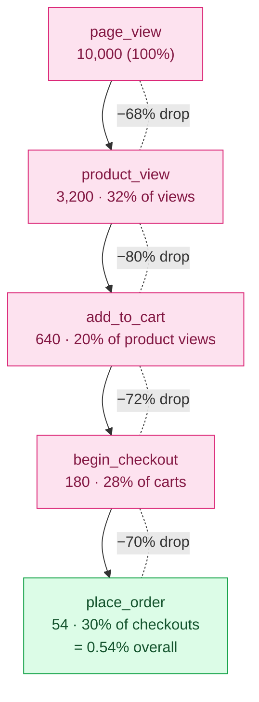

# 13 — In-house Analytics & Reporting

> **Project:** `vaani-gift-e-commerce` · **Brand:** GooglyWoogly Art · **Owner-perspective:** Product / Data
> **Conforms to:** [`00-canonical-decisions.md`](./00-canonical-decisions.md) (CANON) — every entity, field, enum, route, and cache-tag name below is verbatim from CANON §5–§12. Builds on [`02-system-architecture`](./02-system-architecture-and-tech-stack.md) (ingestion pipeline FR-28–30, cron §14.2) and [`03-data-model`](./03-data-model-and-entities.md) (`AnalyticsEvent`, `AnalyticsSession`, `DailyMetricRollup` shapes). Consumed by [`10-admin-foundation`](./10-admin-foundation-auth-dashboard.md) (the `/admin` KPI cards read this doc's rollups; this doc owns the deep `/admin/analytics` surface).
> **Not authoritative for:** the storefront/checkout UX that *triggers* events (`05`–`08`), email/WhatsApp transport (`14`), admin shell/RBAC chrome (`10`), Prisma field-level schema (`03`), CWV measurement (Vercel Analytics, `02`/`09`).

This document specifies the **complete in-house, first-party analytics and reporting system**: the event taxonomy, the client beacon → `/api/track-event` ingestion path, visitor/session stitching, server-side events, the nightly `DailyMetricRollup` cron, the four admin dashboards (Traffic, Engagement, Conversion **Funnel**, Commerce) plus a realtime widget, and the DPDP-compliant privacy posture. It exists because the founder explicitly asked to **own her data, pay nothing, and never leak shopper behavior to a third party** (CANON §4 "Analytics: In-house"; JTBD-6 in `01`/`02`).

---

## 1. Purpose & Scope

### 1.1 What this document covers
- The **event taxonomy** — the full CANON `AnalyticsEventType` set, where each is emitted, and the exact `metadata`/`value` payload per type.
- The **client beacon** → **`POST /api/track-event`**: `navigator.sendBeacon`, batching, debounce/throttle, in-page queue, retry-on-visibility, **bot/crawler filtering**, **strictly NO PII**.
- **Visitor & session stitching** via a first-party `visitorId` cookie + a 30-minute sliding `sessionId`, persisted to **`AnalyticsSession`** and stamped on every **`AnalyticsEvent`**.
- **Server-side events** that must not be client-trusted: **`place_order`** (on `placeOrder` success) and **`order_confirmed`** (on admin status → `confirmed`).
- The **nightly `DailyMetricRollup`** pre-aggregation via **Vercel Cron** (`/api/cron/rollup`) so dashboards read small rows, never the raw event firehose.
- The **admin reporting UI** at **`/admin/analytics`**: four dashboards — **Traffic**, **Engagement**, **Conversion Funnel**, **Commerce** — plus a **realtime widget** and a **CSV export** [V1].
- **Privacy & compliance**: a consent banner, IP/PII anonymization, a retention/purge policy honoring the **DPDP Act, 2023**.
- A **build-vs-buy justification** vs **GA4** and **Vercel Analytics**, and a **funnel diagram**.

### 1.2 What this document does NOT cover
- The **field-level schema** of `AnalyticsEvent` / `AnalyticsSession` / `DailyMetricRollup` → owned by **`03`** (referenced here, not redefined).
- The **storefront/checkout interactions** that fire events (add-to-cart UX, checkout mount) → owned by **`06`/`07`/`08`** (this doc defines *what payload* each emits and *how it is ingested*, not the UI that triggers it).
- The **`/admin` home dashboard KPI cards** (Visitors/Orders/Revenue-requested/Conversion/AOV) → owned by **`10`** (FR-37). This doc supplies the **rollup contract** those cards read and the **deep drill-down** at `/admin/analytics`.
- **Core Web Vitals / RUM** → **Vercel Analytics** only (CANON §4); this system never measures performance.
- **Email/WhatsApp** delivery analytics → `NotificationLog` (owned by `14`), surfaced here only as a Commerce/ops KPI.
- **Admin-usage telemetry** — the admin app emits **none** of the shopper `AnalyticsEventType` set; admin actions go to **`AuditLog`** (`10` FR; this doc keeps the funnel/rollups shopper-clean).

### 1.3 Guiding principles
1. **First-party only.** One cookie (`gw_vid`), one same-origin endpoint, one Postgres table family. No GA, no GTM, no pixels, no third-party JS (CANON §4; `09` §"Third-party: none").
2. **Privacy by design.** No name/email/phone/address ever enters `AnalyticsEvent`. IPs are used transiently (geo + hashing) and never stored. DPDP-minimal (CANON §11).
3. **Analytics must never degrade UX.** The beacon is fire-and-forget; failures are swallowed; the storefront does not wait on it; it ships <3 KB of JS.
4. **Dashboards read pre-aggregated rows.** The nightly cron does the heavy lifting; request-time reads hit `DailyMetricRollup` + a thin live "today/realtime" query — never a raw-firehose scan (CANON §12; `02` FR-30; `10` FR-43).
5. **Server-trust for money & conversions.** `place_order`/`order_confirmed` and all `value` (revenue-requested, paise) originate **server-side**, never from the client beacon.

---

## 2. Primary user stories / jobs-to-be-done

| # | As a… | I want… | so that… |
|---|---|---|---|
| JTBD-1 | **Founder (owner)** | a live funnel from page-view → order with step drop-off | I know *where* shoppers abandon and fix the worst step first. |
| JTBD-2 | **Founder** | to see which products/categories/collections get viewed and added to cart | I merchandise and restock what actually sells, not what I guess. |
| JTBD-3 | **Founder** | traffic sources, UTM campaigns, device and geo splits | I know which Instagram post / WhatsApp blast / festival campaign drove visits and orders. |
| JTBD-4 | **Founder** | revenue-**requested**, order count, AOV, top sellers and **dead stock** | I run the business on numbers — even though payment is offline. |
| JTBD-5 | **Founder** | a realtime "who's on the site now" widget | I get a dopamine signal after a campaign and can spot a spike or an outage. |
| JTBD-6 | **Founder** | to see the **search terms** shoppers type | I add products / synonyms / collections for demand I'm missing. |
| JTBD-7 | **Founder** | all of this **for free**, owned by me, with **no data leaving** to Google | I respect my customers' privacy and never pay an analytics SaaS. |
| JTBD-8 | **Compliance (DPDP)** | shopper PII kept out of analytics, IP anonymized, raw events auto-purged | I honor consent, data-minimization, and retention duties. |
| JTBD-9 | **Engineer** | a closed event taxonomy + a single validated ingest endpoint | instrumentation is consistent, typed, and abuse-resistant. |
| JTBD-10 | **Performance / SEO** | the analytics client to add ~zero render cost | Core Web Vitals stay green (`09` budget). |

---

## 3. Detailed functional requirements

> "MUST" = MVP unless tagged `[V1]`/`[V2]`. Numbered FR-1…

### 3.1 Event taxonomy (`AnalyticsEventType`)

- **FR-1 — Closed taxonomy.** The system ingests **only** the CANON `AnalyticsEventType` members (CANON §6). No ad-hoc types. New types append to CANON §6 first, then here. A `lib/analytics/events.ts` constant mirrors the enum; the beacon and emitters import from it (never hand-typed strings).

- **FR-2 — Event source & payload.** Each type has a fixed origin (client beacon vs server) and a fixed payload shape written into `AnalyticsEvent.metadata` (`Json @db.JsonB`, §3.5 shapes in `03`) and `AnalyticsEvent.value` (Int paise, only where monetary). **No PII** ever enters `metadata`/`value`/`path`/`referrer` (FR-19).

| `AnalyticsEventType` | Source | `productId` | `value` (paise) | `metadata` keys | Fired when |
|---|---|---|---|---|---|
| `page_view` | client | — | — | `{ title? }` (path/referrer/utm are top-level columns) | every route mount + soft navigation (`09` §12) |
| `product_view` | client | ✓ | — | `{ slug, category?, price }` | PDP mount (`07`) |
| `category_view` | client | — | — | `{ slug }` | category PLP mount |
| `collection_view` | client | — | — | `{ slug }` | collection page mount |
| `search` | client | — | — | `{ query, resultsCount }` | `/search` submit / results render (`06`) |
| `filter_apply` | client | — | — | `{ filterKey, filterValue, resultsCount? }` | PLP facet change (`06`) |
| `add_to_cart` | client | ✓ | unit `price`×qty | `{ slug, qty, source: "pdp"\|"plp"\|"quickview" }` | add-to-cart success (`07`/`08`) |
| `remove_from_cart` | client | ✓ | line value removed | `{ slug, qty }` | cart line remove (`08`) |
| `update_cart` | client | ✓ | new line value | `{ slug, qty, prevQty }` | cart qty change (`08`) |
| `begin_checkout` | client | — | cart subtotal | `{ itemCount, units }` | `/checkout` mount (`08`) |
| `place_order` | **server** | — | **`grandTotal`** | `{ orderNumberLast: "00042", itemCount, units }` | `placeOrder` success, **post-commit** (`08` FR-35) |
| `order_confirmed` | **server** | — | `grandTotal` | `{ orderNumberLast }` | admin status → `confirmed` (`12`) |
| `whatsapp_click` | client | ✓? | — | `{ context: "pdp"\|"cart"\|"confirmation"\|"track", orderNumberLast? }` | any storefront `wa.me` CTA tap (`07`/`08`) |
| `bulk_inquiry_submit` | client | — | — | `{ occasion?, hasQuantity: bool }` | bulk form success (`05`) |
| `contact_submit` | client | — | — | `{ subjectPresent: bool }` | contact form success (`15`) |
| `newsletter_signup` | client | — | — | `{ source: "footer"\|"popup"\|"checkout" }` | newsletter form success |
| `outbound_click` | client | — | — | `{ destinationHost, kind: "social"\|"external" }` | external/social link click |

> **`whatsapp_click` `productId`** is set only when the CTA is on a PDP; cart/confirmation/track WhatsApp opens carry context in `metadata`. Admin-initiated WhatsApp opens are **not** tracked (shopper-only event; `10` FR §9, `12`).
> **`order_confirmed` is server-emitted** on the admin confirm transition (CANON §9 emitter map; `02` §9). The confirmation-page mount does **not** emit it (resolves the `08`-FR-35 note — see §11 OQ-3).

- **FR-3 — `metadata` is bounded.** Each event's `metadata` is a flat `Record<string, string | number | boolean>` (`03` §3.5), **≤ 1 KB serialized**, **≤ 12 keys**, validated by a Zod **discriminated union** keyed on `type` (FR-13). Oversized/extra keys are dropped, not rejected (lenient ingest; a single bad event must not drop a batch).

### 3.2 Client beacon → `/api/track-event`

- **FR-4 — Single endpoint.** All client events POST to **`POST /api/track-event`** (Edge runtime, same-origin). This is the canonical ingest route for this product surface. *(Naming note: `02` FR-28 referred to it as `/api/analytics/collect`; CANON §8 names no analytics route, and this spec — the founder's explicit ask — fixes it as `/api/track-event`. See §11 OQ-1; `02` to be reconciled.)*

- **FR-5 — `navigator.sendBeacon` first.** The client emitter prefers `navigator.sendBeacon(url, blob)` (survives page unload, non-blocking, no response needed). Fallback order: `sendBeacon` → `fetch(..., { keepalive: true })` → drop (never `XMLHttpRequest`, never block navigation). The payload is a `Blob` of `type: "application/json"`.

- **FR-6 — Batching.** Events are queued in memory and flushed as a **batch array** `{ events: TrackEvent[] }`:
  - **Time trigger:** flush every **5 s** if the queue is non-empty (debounced timer).
  - **Size trigger:** flush immediately when the queue reaches **20 events**.
  - **Lifecycle triggers:** flush on `visibilitychange → hidden` and on `pagehide` (mobile-safe; `beforeunload` is unreliable on iOS). These use `sendBeacon` so they complete during unload.
  - **Navigation:** flush on App-Router route change (so `page_view` of the new route and the prior route's events go together).
  - Max batch size on the wire = **50** (server caps at 50; excess returns `207`-style partial accept by truncation, see FR-15).

- **FR-7 — Debounce / throttle / dedupe.**
  - **High-frequency emitters** (`filter_apply`, `update_cart`, scroll-derived) are **debounced 400 ms** client-side so a slider drag = one event.
  - **`page_view` dedupe:** at most one `page_view` per `(visitorId, path)` per **2 s** (guards Strict-Mode double-mount and rapid back/forward).
  - **Client event id:** every event gets a `eid` (nanoid) used for **idempotency** at the server (FR-15) and intra-session dedupe.

- **FR-8 — Bot / crawler filtering.** Events from non-human agents are **dropped at ingest** (never written). Detection layers:
  1. **Client gate:** the beacon **does not initialize** if `navigator.webdriver === true`, if `window` is headless-signalled, or if the UA matches a bot regex (Googlebot, Bingbot, AhrefsBot, SemrushBot, `HeadlessChrome`, `python-requests`, `curl`, `node-fetch`, generic `bot|crawler|spider|slurp`). Prerender/Lighthouse runs are excluded.
  2. **Server gate (authoritative):** `/api/track-event` re-checks the `User-Agent` header against a maintained bot list, drops events where `device` resolves to `bot` (`DeviceType.bot`, `03` §3.3), and drops requests failing the origin check (FR-16). Bot hits are counted in a Sentry/log counter but **not** persisted.
  - Rationale: bot traffic must not inflate `visitors`/`pageviews`/funnel; this is the #1 credibility issue for self-hosted analytics.

- **FR-9 — No PII, ever (client).** The beacon serializes **only**: `eid`, `type`, `path` (pathname + allow-listed query; **never** the full querystring — strip everything except `utm_*`, `ref`, `q` for search), `referrer` (origin+path, **querystring stripped**), `productId`, `value`, `metadata`, and the client clock for ordering. It **must not** read form fields, input values, emails, names, phone numbers, cart contact details, or `localStorage` cart contents. A lint/test guard asserts the payload type excludes PII fields (FR-30).

- **FR-10 — Resilience.** Beacon failures (network/Edge 5xx) are **swallowed**; the queue may retry once on next flush, then drops (analytics loss is acceptable; UX is sacred — `02` §10). The emitter is wrapped in `try/catch`; a thrown analytics error **never** propagates to the page.

### 3.3 Visitor & session stitching

- **FR-11 — `visitorId` (first-party).** On first storefront load (post-consent, FR-18), the client mints a **`visitorId`** = `nanoid(21)` and stores it in a **first-party cookie `gw_vid`**: `Max-Age = 400 days`, `SameSite=Lax`, `Secure`, `Path=/`, **not** `HttpOnly` (the client emitter must read it). It is **pseudonymous** — never derived from PII. It is the `visitorId` on `AnalyticsEvent`/`AnalyticsSession` (CANON §5). *(Storage as a hashed value is an option; MVP stores the raw nanoid since it is already non-identifying — see §11 OQ-5.)*

- **FR-12 — `sessionId` (sliding window).** A **`sessionId`** = `nanoid(21)` identifies a visit. The session **expires after 30 minutes of inactivity** (sliding) **or at UTC/IST midnight rollover** (so a session belongs to one calendar day). The client stores `sessionId` + `lastSeenAt` in `sessionStorage` (or a short cookie `gw_sid`); on each event it checks the window, renewing `lastSeenAt` or minting a fresh `sessionId`. The server upserts the matching **`AnalyticsSession`** row.
  - A new session captures **acquisition**: `landingPath`, `referrer`, `utm`, `device`, `country` (CANON `AnalyticsSession` fields) — **first-touch wins** for the session.

- **FR-13 — Server enrichment.** `/api/track-event` enriches each event server-side (the client cannot be trusted for these):
  - `device` ← `DeviceType` parsed from `User-Agent` (`mobile|tablet|desktop|bot`).
  - `country` ← **Vercel geo header** (`x-vercel-ip-country`) — **country only**, never city/precise location (DPDP minimization).
  - `utm` ← parsed from the event's allow-listed query (`source/medium/campaign/term/content`, `03` §3.5).
  - `createdAt` ← **server** receipt time (UTC); the client clock is used only for intra-batch ordering, never persisted as truth.

- **FR-14 — Session upsert & counters.** For each ingested batch the server, in one transaction per session:
  1. **Upserts `AnalyticsSession`** by `id = sessionId`: on insert sets acquisition fields + `startedAt`; on update bumps `lastSeenAt` and increments `pageviews` by the count of `page_view` events in the batch.
  2. **Inserts `AnalyticsEvent`** rows (deduped by `eid`, FR-15), each stamped with `visitorId`, `sessionId`, enriched `device/country/utm`, server `createdAt`.
  3. Leaves `isConverted`/`orderId` to the **server-side** `place_order` path (FR-17), which sets `AnalyticsSession.isConverted = true` + `orderId` (`03` §5; `08` FR-35) — the beacon never marks conversion.

### 3.4 Ingestion endpoint contract

- **FR-15 — Idempotency & caps.** `/api/track-event` is **idempotent-tolerant**: duplicate `eid` within a session is ignored (DB-level `ON CONFLICT DO NOTHING` against a `(sessionId, eid)` guard, or an app-level seen-set). Per request: **≤ 50 events**, body **≤ 32 KB**; excess events are **truncated** (first 50 kept) and the request still returns `204` (never error the client over volume).

- **FR-16 — Abuse controls.** The endpoint has **no auth** (it must accept anonymous shoppers) but is hardened: **origin/referer allow-list** (only `NEXT_PUBLIC_SITE_URL` + preview domains), **IP + visitorId sliding-window rate limit** (e.g. 240 events/min/visitor; in-memory/Edge for MVP, Upstash/KV `[V1]` per `02` §15), **method = POST only**, **bot drop** (FR-8). Over-limit → silent `204` (drop) so attackers get no signal. CSRF is not a concern (no auth, no cookies-as-credentials; the cookie is only a pseudonymous id).

- **FR-17 — Server-side events (trusted).** `place_order` and `order_confirmed` are written **directly to `AnalyticsEvent` server-side** (not via the beacon), inside/after their owning Server Action:
  - `place_order`: emitted **post-commit** by `placeOrder` (`08` FR-37) with `value = grandTotal`, `metadata { orderNumberLast, itemCount, units }`, and the **same `visitorId`/`sessionId`** read from the request's `gw_vid` cookie + `gw_sid` so the order attaches to the funnel/session; also sets `AnalyticsSession.isConverted=true, orderId`.
  - `order_confirmed`: emitted by the admin `transitionOrderStatus(→confirmed)` action (`12`); `visitorId/sessionId` may be absent (admin context) — stored with the order's originating session id if known, else null session, `productId` null.
  - Both are **idempotent**: re-running the action (or re-confirm) must not double-count (guarded by an event `eid` derived from `orderId + type`).

### 3.5 Nightly rollup (Vercel Cron)

- **FR-18 — `DailyMetricRollup` job.** A **Vercel Cron** hits **`GET /api/cron/rollup`** **nightly ~02:00 IST** (`30 20 * * *` UTC; `02` §14.2), `CRON_SECRET`-guarded (`Authorization: Bearer`). It aggregates the **previous IST calendar day's** `AnalyticsEvent` + `AnalyticsSession` + `Order` into **one `DailyMetricRollup` row** (`date` PK, `03` §3.7.8) via an **upsert** (idempotent re-run). Computed fields:

| `DailyMetricRollup` field | Definition (for the IST day) |
|---|---|
| `visitors` | `COUNT(DISTINCT visitorId)` over the day's events |
| `sessions` | `COUNT(*)` of `AnalyticsSession` with `startedAt` in the day |
| `pageviews` | `COUNT(*)` of `page_view` events |
| `productViews` | `COUNT(*)` of `product_view` |
| `addToCarts` | `COUNT(*)` of `add_to_cart` |
| `beginCheckouts` | `COUNT(*)` of `begin_checkout` |
| `orders` | `COUNT(*)` of `place_order` (server-trusted) |
| `revenueRequested` | `SUM(value)` of `place_order` events (paise) — equals Σ `Order.grandTotal` placed that day |
| `conversionRate` | **basis points** = `round(orders / NULLIF(sessions,0) × 10000)` (integer, no float — `03` FR + AC) |
| `topProducts` | top-N `[{ key: productId, label: title, count, valuePaise? }]` by `product_view` (+ add-to-cart as tiebreak), N=20 |
| `topReferrers` | top-N referrer hosts `[{ key, label, count }]`, N=20 |
| `topPages` | top-N paths by `page_view` `[{ key: path, label, count }]`, N=20 |

- **FR-19 — Funnel persistence.** The five canonical funnel counts (`pageviews`/`page_view`, `productViews`, `addToCarts`, `beginCheckouts`, `orders`) are **columns** on `DailyMetricRollup` (CANON §12 funnel = `page_view → product_view → add_to_cart → begin_checkout → place_order`). The dashboard computes step **conversion rates** from these columns over the selected range — no raw scan.

- **FR-20 — Backfill & catch-up.** `/api/cron/rollup` accepts an optional `?date=YYYY-MM-DD` (admin/manual, `CRON_SECRET`) to **recompute one day** (idempotent upsert) — used to backfill after an outage or correct a partial day. A missed nightly run self-heals on the next run if it detects a gap (rolls up all missing days up to yesterday, capped at 14 days to stay within Edge/Node execution limits).

- **FR-21 — Raw-event retention / pruning.** The rollup job (or a sibling daily job) **prunes raw `AnalyticsEvent` rows older than the retention window** (default **180 days**, `[V1]` per `02` §14.2 / `03` OQ-6) **after** they are safely rolled up. `AnalyticsSession` rows older than the window are pruned likewise. **`DailyMetricRollup` is retained indefinitely** (it is non-PII aggregate). MVP may ship without pruning (volume is tiny for a single founder) but the job is wired and configurable (`ANALYTICS_RETENTION_DAYS`).

### 3.6 Reporting / dashboards

- **FR-22 — `/admin/analytics` surface.** A dedicated admin route (CANON §8 lists `/admin/analytics`) presents **four tabbed dashboards** + a **realtime widget**: **Traffic · Engagement · Funnel · Commerce**. It is **SSR `force-dynamic`, `noindex`**, auth-gated, and **reads `DailyMetricRollup`** for the selected range plus a **thin live "today" partial** (today isn't in a rollup yet). It **never scans raw `AnalyticsEvent`** at request time except the **bounded realtime window** (FR-27) and the **search-terms** report (FR-25), both indexed + capped.

- **FR-23 — Global range control.** Every dashboard shares a **date-range selector**: presets **Today / 7d / 30d / 90d / This month / Custom**, default **7d**. All numbers, charts, and tables respect it. A **compare-to-prior-equal-period** toggle shows ▲/▼ deltas (accessible label, not color-only). Range math is **IST calendar days** against `DailyMetricRollup.date`; "Today" stitches the live partial.

- **FR-24 — Traffic dashboard.** Visitors, sessions, pageviews (with trend sparklines + prior-period delta); **sources** (referrer hosts), **UTM** breakdown (source/medium/campaign), **device split** (mobile/tablet/desktop donut), **geo** (country table/India-state `[V1]`), pages/session & avg session length (derived from session `startedAt`/`lastSeenAt`). Direct vs referral vs campaign classification.

- **FR-25 — Engagement dashboard.** **Top products** (by `product_view`, add-to-cart, view→cart rate), **top pages** (`topPages`), **top categories/collections** (from `category_view`/`collection_view`), and **search terms** — a ranked table of `search` event `metadata.query` with counts and **% zero-result** (`resultsCount=0`), the single most actionable merchandising report (JTBD-6). Search-terms reads raw `AnalyticsEvent` (type=`search`) over the range, **indexed** (`(type, createdAt)`) and **capped** (top 200).

- **FR-26 — Conversion Funnel dashboard.** The **5-step funnel** (`page_view → product_view → add_to_cart → begin_checkout → place_order`) rendered as a **horizontal funnel chart** with, per step: absolute count, **% of previous step**, **% of top (page_view)**, and **drop-off count/%**. Overall **conversion rate** (orders/sessions) headline + prior-period delta. Computed from `DailyMetricRollup` columns summed over the range (FR-19). A note clarifies the funnel is **event-volume based** (not strict per-session sequential) in MVP; **session-sequential funnel** (each visitor must pass steps in order) is `[V1]`.

- **FR-27 — Commerce dashboard.** **Orders** (count), **revenue-requested** (Σ `grandTotal`, paise → ₹ `en-IN`), **AOV** (`revenueRequested/orders`), trend; **top sellers** (by units/revenue, from `OrderItem` over the range); **dead stock** — `active` products with **zero `product_view`/zero orders** in the range (and/or stale `lastOrderAt`) to flag what to discount/retire (JTBD-4); **payment-status mix** (`unpaid`/`awaiting_payment`/`paid` from `Order.paymentStatus`, ops signal); **conversion by source** `[V1]`. All money is **revenue-requested**, explicitly labeled *requested, not collected* (CANON glossary; `10` FR-37). **Financially-sensitive cards (revenue/AOV/cost/dead-stock value) are omitted from `staff` DTOs** (`10` FR-26).

- **FR-28 — Realtime widget.** A compact **"Right now"** panel (top of `/admin/analytics`, optional on `/admin`): **active visitors in the last 5 minutes** (`COUNT(DISTINCT visitorId)` over `AnalyticsEvent.createdAt > now()-5min`), **active sessions**, a **last-20 live events feed** (type + path + relative time), and **top active pages**. This is the **only** request-time raw-event read, **bounded** by a `createdAt` index window + `LIMIT`. Auto-refreshes every **15 s** (client poll to a tiny `GET /admin/analytics/realtime` RSC/route, or React Server Action), pausing when the tab is hidden.

- **FR-29 — CSV export `[V1]`.** Each dashboard table and the daily rollup series export to **CSV** (`/admin/analytics/export?report=…&range=…`, admin-gated). MVP shows on-screen tables; export is fast-follow (CANON §3 V1 "CSV import/export").

### 3.7 Privacy, consent & compliance

- **FR-30 — No PII in analytics (enforced).** `AnalyticsEvent` stores **only** pseudonymous `visitorId`, `sessionId`, `type`, `path`, `referrer`, `productId`, `value`, `metadata`, `device`, `country`, `utm`, `createdAt` (CANON §5). **Never** name/email/phone/address/IP. Enforced by: (a) the beacon payload **type** excluding PII fields, (b) a server allow-list that drops unknown keys, (c) a **test** asserting no PII leaks, (d) Sentry PII scrubbing (`02` §15).

- **FR-31 — IP anonymization.** The shopper IP is used **transiently** at ingest only — for geo (country) and rate-limiting — and is **never persisted**. If any IP-derived hash is needed for rate-limit memory, it is truncated/hashed and TTL'd, not stored in `AnalyticsEvent`.

- **FR-32 — Consent banner (DPDP).** A first-load **consent banner** ("We use first-party cookies for our own basic analytics. No third-party tracking, no ads." + **Accept** / **Decline** / link to **`/privacy-policy`**). Because analytics is **strictly first-party, non-advertising, and PII-free**, MVP runs in a **soft-consent** posture: a single functional cookie (`gw_vid`) under legitimate-use, banner shown for transparency; **Decline** sets `gw_consent=denied` and **fully disables** the beacon + `gw_vid` (no events, no cookie). Consent choice persists in `gw_consent` (400 days). The banner is dismissible, keyboard-accessible, and never blocks content (no scroll-lock). *(India's DPDP is consent-centric; this posture is defensible for first-party PII-free analytics — see §11 OQ-2 for a strict opt-in alternative.)*

- **FR-33 — Do Not Track & opt-out.** Honor `navigator.doNotTrack === "1"` and Global Privacy Control (`Sec-GPC`) by **defaulting the beacon off** for those users. A persistent **opt-out** link in the footer / privacy policy sets `gw_consent=denied`.

- **FR-34 — Retention policy.** Raw `AnalyticsEvent`/`AnalyticsSession` retained **180 days** then pruned (FR-21); `DailyMetricRollup` (aggregate, non-PII) retained **indefinitely**. The retention window is configurable and published in `/privacy-policy` (`15`). `visitorId` cookie lifetime = **400 days** (max per browser caps), then re-minted (a returning visitor after expiry counts as new — acceptable).

- **FR-35 — DPDP data-subject requests.** Because analytics holds **no PII**, a shopper deletion request primarily affects **`Customer`/`Order`** PII (handled in `03`/`12`). For analytics, a request can **purge by `visitorId`** if the shopper supplies their cookie value (rare); otherwise the 180-day prune is the guarantee. No PII linkage means analytics is **out of scope** for most DSARs by design — a privacy strength.

---

## 4. UX / UI breakdown — `/admin/analytics`

> Mounts inside the **admin shell** (`10`: sidebar + top bar, `noindex`, RBAC). **Mobile-first** — the founder runs this from a phone (CANON §2.4): tabs become a horizontal scroll/segmented control; charts are responsive and touch-legible; tables collapse to stacked cards. Uses **shadcn/ui** (Card, Tabs, Table, Select, Badge, Skeleton) + a lightweight chart lib (e.g. **Recharts/visx**, lazy-loaded island). Currency via `Intl.NumberFormat('en-IN',{style:'currency',currency:'INR'})`; dates IST.

### 4.1 Page shell & layout

```
┌───────────────────────────────────────────────────────────────────┐
│  Analytics                          [ Range: 7d ▾ ] [Compare �myr] │  ← sticky header
│  ──────────────────────────────────────────────────────────────── │
│  ▸ RIGHT NOW   ● 7 active visitors · 5 sessions · live feed →      │  ← realtime strip (FR-28)
│  ──────────────────────────────────────────────────────────────── │
│  [ Traffic ] [ Engagement ] [ Funnel ] [ Commerce ]               │  ← Tabs
│  ──────────────────────────────────────────────────────────────── │
│  (active tab body)                                                 │
└───────────────────────────────────────────────────────────────────┘
```

- **Header (sticky):** title, global **Range** `Select` (FR-23), **Compare** toggle, an export button `[V1]`. On scroll the realtime strip collapses to a single line.
- **Realtime strip:** green pulsing dot + active-visitor count; tap expands a drawer with the live event feed + top active pages (FR-28).
- **Tabs:** four; deep-linkable via `?tab=funnel&range=30d` (shareable, restores state). Default `traffic`.

### 4.2 Traffic tab (FR-24)

| Zone | Component | Content |
|---|---|---|
| KPI row | 3× `Card` + sparkline | **Visitors**, **Sessions**, **Pageviews** — value, sparkline over range, ▲/▼ vs prior |
| Trend | line `chart` | visitors & sessions over time (IST days) |
| Sources | `Table` | referrer host · sessions · share % · orders (joined) |
| UTM | `Table` (grouped) | campaign / source / medium · sessions · orders · conv% |
| Devices | donut `chart` | mobile / tablet / desktop split |
| Geo | `Table` | country · sessions (India-state drill `[V1]`) |

- **Empty state:** "No traffic in this range yet. Share your store on Instagram/WhatsApp to see visitors here." with a copy-store-link button.
- **Mobile:** KPI cards stack 1-wide; tables → cards (host as title, metrics as key:value).

### 4.3 Engagement tab (FR-25)

| Zone | Component | Content |
|---|---|---|
| Top products | `Table` w/ thumbnail | product · views · add-to-carts · **view→cart %** · link to PDP & admin product |
| Top pages | `Table` | path · pageviews · share % |
| Top categories / collections | two `Table`s | name · views · click-through |
| **Search terms** | `Table` (highlighted) | query · count · **% zero-result** (badge red when high) · "create product/collection" quick action |

- **Why search terms are prominent:** zero-result searches are unmet demand the founder can fill same-day (JTBD-6). High-zero-result rows get a red `Badge` and a CTA.
- **Empty state per table:** "No product views yet / No searches yet."

### 4.4 Funnel tab (FR-26) — the centerpiece

- A **horizontal funnel chart** (5 bars, descending) with each step labeled, its count, **% of previous**, and **drop-off** annotated between bars. Below it, a **step table** (step · count · % of top · % of previous · drop-off). A headline **Conversion rate** card (orders/sessions) with prior-period delta. A toggle to view **counts** vs **rates**. Tooltip on each step explains the source event.



- **Interpretation hints** rendered under the chart: the **biggest single drop** is highlighted with a one-line suggestion (e.g. "Most shoppers leave between *product view* and *add to cart* — check pricing, photos, or stock messaging on top products").
- **Empty/low-data state:** if any step count < a threshold, show "Not enough data yet for a reliable funnel" with the raw counts.
- **Mobile:** funnel renders **vertically** (stacked bars), drop-offs inline.

### 4.5 Commerce tab (FR-27)

| Zone | Component | Content (owner/admin) | `staff` |
|---|---|---|---|
| KPI row | `Card`s | **Orders**, **Revenue-requested** (₹, *requested not collected* tooltip), **AOV** | Orders only |
| Trend | line `chart` | orders & revenue-requested over range | orders only |
| Top sellers | `Table` w/ thumb | product · units · revenue-requested · view→order % | units only |
| **Dead stock** | `Table` | `active` products with 0 views & 0 orders in range (+ `lastOrderAt`) · quick "discount/archive" link | hidden |
| Payment mix | small donut | `unpaid` / `awaiting_payment` / `paid` / … counts | visible (ops) |

- **Revenue-requested** is labeled and tooltipped everywhere as *requested, not collected* (CANON §1, glossary; consistent with `10` FR-37).
- **Dead-stock** uses the range plus `Product.publishedAt` (only flag products live ≥ the whole range, so new items aren't mislabeled dead).

### 4.6 States, loading, responsive

- **Loading:** `Skeleton` cards/tables; the page streams (`loading.tsx`) — KPI row first, charts/tables progressively. Range change shows a localized spinner, not a full reload.
- **Empty (new store):** friendly per-zone empties with a "share your store" nudge; never a blank screen.
- **Error:** an error boundary card "Couldn't load analytics — try again" + Sentry capture; the rest of the admin stays usable.
- **"Today" partial:** a subtle "Today updates live; full metrics finalize overnight ~2 AM IST" note when the range includes today (consistent with `10` FR §"No rollup yet for today").
- **Accessibility:** charts have **data-table equivalents** (toggle "view as table") and `aria-label` summaries; deltas use icon+text (not color alone); WCAG AA contrast on the pink theme (CANON §4); keyboard-navigable tabs/tables; respects `prefers-reduced-motion` (no chart animations).
- **Mobile:** segmented tabs scroll horizontally; one chart per row; tables → stacked cards; sticky range header.

---

## 5. Data & entities used (CANON names)

> Field-level definitions live in **`03`**. This section fixes **read vs write** per surface.

| Entity (CANON §5) | Read by | Written by | Notes |
|---|---|---|---|
| **`AnalyticsEvent`** | cron rollup; realtime widget; search-terms report | `/api/track-event` (client events); `placeOrder` & admin confirm (server events) | append-only firehose; `visitorId, sessionId, type, path, referrer, productId, value, metadata, device, country, utm, createdAt` (CANON §5) |
| **`AnalyticsSession`** | cron rollup; realtime widget; traffic dashboard | `/api/track-event` (upsert); `placeOrder` (sets `isConverted`,`orderId`) | `visitorId, startedAt, lastSeenAt, landingPath, referrer, utm, device, country, pageviews, isConverted, orderId` (CANON §5) |
| **`DailyMetricRollup`** | **all four dashboards**, `/admin` KPI cards (`10`) | **nightly cron** (`/api/cron/rollup`, upsert) | `date, visitors, sessions, pageviews, productViews, addToCarts, beginCheckouts, orders, revenueRequested, conversionRate, topProducts, topReferrers, topPages` (CANON §5) |
| **`Order`** | Commerce dashboard (revenue/AOV/payment-mix); rollup `revenueRequested` cross-check | — (analytics never writes orders) | `grandTotal` (paise), `paymentStatus`, `createdAt`, `status` |
| **`OrderItem`** | Commerce: top-sellers, dead-stock | — | `productId, productTitle, quantity, lineTotal` (snapshot) |
| **`Product`** | Engagement (titles/thumbs for `productId` resolution), dead-stock (active set, `publishedAt`, `lastOrderAt` via `Customer`? no — via OrderItem) | — | resolve `productId` → title/slug/primary image; `status=active` |
| **`AuditLog`** | — | admin viewing analytics is **not** audited as a mutation; only data exports may log `[V1]` | analytics dashboards are read-only |

- **No new entities.** This spec adds **zero** tables; it uses exactly the three CANON analytics entities + reads `Order`/`OrderItem`/`Product`.
- **`productId` resolution:** `AnalyticsEvent.productId` is a **loose reference (no FK)** because products may be archived/deleted (`03` §3.7.8). Dashboards resolve it via a left join / lookup; deleted products show their last-known title from the most recent `OrderItem` snapshot or "(removed product)".

---

## 6. Server actions / API routes

> Pattern per `02` §6.1. All inputs **Zod-validated**; outputs typed; cache impact noted. None of these revalidate storefront cache tags (analytics is uncached/SSR — CANON §9; `02` §5).

### 6.1 Route handlers & cron

| Route | Method | Runtime | Auth | Inputs (Zod) | Output | Side effects | Revalidates |
|---|---|---|---|---|---|---|---|
| **`/api/track-event`** | POST | **Edge** | none (origin-checked, rate-limited, bot-dropped) | `{ events: TrackEvent[] }` (≤50), `TrackEvent = { eid, type: AnalyticsEventType, path, referrer?, productId?, value?, metadata? }` | `204 No Content` | upsert `AnalyticsSession`; insert `AnalyticsEvent[]` (dedupe by `eid`); enrich device/country/utm/createdAt | — |
| **`/api/cron/rollup`** | GET | Node | `CRON_SECRET` (Bearer) | optional `?date=YYYY-MM-DD` | `{ date, visitors, sessions, …counts, conversionRate }` | **upsert `DailyMetricRollup`**; **prune** raw events past retention `[V1]` (FR-21); self-heal gaps (FR-20) | — |
| **`/admin/analytics/realtime`** | GET | Node | admin session | `{ window?: "5m" }` | `{ activeVisitors, activeSessions, recentEvents[], topActivePages[] }` | none (bounded indexed read) | — |
| **`/admin/analytics/export`** `[V1]` | GET | Node | admin (not `staff` for financial reports) | `{ report, range }` | `text/csv` | none | — |

**`TrackEvent` Zod schema (boundary):** a **discriminated union on `type`** validating per-type `metadata` (FR-3); unknown `metadata` keys stripped; `path`/`referrer` query-stripped server-side (FR-9); `value` coerced to non-negative `Int`. Invalid individual events are **skipped** (not 400) so one malformed event can't drop a batch (FR-3/FR-15).

### 6.2 Server-side emit helpers (not HTTP routes)

| Helper (`lib/analytics/*`) | Called by | Writes | Idempotency |
|---|---|---|---|
| `emitServerEvent(type, { visitorId?, sessionId?, value?, productId?, metadata })` | `placeOrder` (`08`), `transitionOrderStatus→confirmed` (`12`) | `AnalyticsEvent` (+ `AnalyticsSession.isConverted/orderId` for `place_order`) | `eid = hash(orderId + type)` → dedupe (FR-17) |
| `rollupForDate(date)` | `/api/cron/rollup` | `DailyMetricRollup` upsert | PK `date` upsert (FR-18) |
| `getRollupRange(from,to)` | dashboards (RSC) | — (read) | reads `DailyMetricRollup` rows |
| `getRealtime(window)` | realtime widget (RSC) | — (read) | bounded `AnalyticsEvent.createdAt` window |
| `getSearchTerms(from,to)` | Engagement (RSC) | — (read) | indexed `(type, createdAt)`, capped 200 |

> The **client emitter** (`lib/analytics/emit.ts`) is the only client module; it owns the queue, batching, debounce, bot gate, consent gate, and `sendBeacon` (FR-4–FR-11). It imports the event constants (FR-1) and **never** imports Prisma (`02` §4.2).

### 6.3 Ingestion sequence (client → Edge → DB)

```mermaid
sequenceDiagram
  autonumber
  actor Shopper
  participant EMIT as Client emitter<br/>(queue + sendBeacon)
  participant EDGE as /api/track-event (Edge)
  participant DB as Postgres (AnalyticsEvent / AnalyticsSession)

  Note over Shopper,EMIT: consent=granted, not a bot, DNT off (else emitter disabled)
  Shopper->>EMIT: page_view / add_to_cart / search …
  EMIT->>EMIT: dedupe (eid), debounce hi-freq, enqueue
  alt queue ≥20 OR 5s elapsed OR page hidden/unload
    EMIT->>EDGE: sendBeacon({ events:[…] }) (keepalive)
  end
  EDGE->>EDGE: origin check + rate-limit + bot drop (UA)
  EDGE->>EDGE: enrich device(UA), country(geo hdr), utm, createdAt(server)
  EDGE->>DB: upsert AnalyticsSession(sessionId) {startedAt|lastSeenAt, pageviews+=}
  EDGE->>DB: insert AnalyticsEvent[] (skip dup eid)
  EDGE-->>EMIT: 204 (fire-and-forget; failures swallowed)
```

### 6.4 Conversion / server-event sequence

```mermaid
sequenceDiagram
  autonumber
  actor Shopper
  participant SA as placeOrder (Server Action)
  participant DB as Postgres
  participant AN as Analytics (server emit)
  Shopper->>SA: submit checkout
  SA->>DB: TX { Order, OrderItems, OrderStatusEvent(pending_confirmation), Customer }
  Note over SA: post-commit (best-effort; never rolls back order — 08 FR-37)
  SA->>AN: emitServerEvent("place_order", {visitorId,sessionId, value=grandTotal, metadata})
  AN->>DB: insert AnalyticsEvent(place_order) + AnalyticsSession.isConverted=true, orderId
  Note over AN: idempotent via eid=hash(orderId+'place_order')
```

---

## 7. States & edge cases

| Case | Handling |
|---|---|
| **Consent declined / DNT / GPC** | Emitter never initializes; `gw_vid` not set; zero events; banner remembers choice (FR-32/FR-33). |
| **Bot / crawler / headless** | Dropped at client gate **and** server gate; not persisted; counted only in logs (FR-8). Googlebot rendering the page produces no analytics. |
| **`sendBeacon` unsupported** | Fallback `fetch(keepalive:true)`; if that fails, drop (FR-5). |
| **Offline / network failure** | Batch retried once next flush, then dropped; UX unaffected (FR-10). |
| **Page closed mid-session** | `pagehide`/`visibilitychange` flush via `sendBeacon` captures the tail (FR-6). |
| **Duplicate events (Strict Mode, retries, double-submit)** | `eid` dedupe at client + DB `(sessionId,eid)` guard; server events deduped by `hash(orderId+type)` (FR-7/FR-15/FR-17). |
| **Clock skew (client)** | Client timestamp used only for ordering; **server `createdAt` is truth** (FR-13). |
| **Session crosses midnight** | Session closes at IST midnight; events land in their own day so daily rollups are clean (FR-12). |
| **Missed nightly cron** | Next run self-heals missing days (≤14) via gap detection; `?date=` manual backfill (FR-20). |
| **Rollup re-run** | Upsert by `date` PK → idempotent, no double counting (FR-18). |
| **`place_order` but beacon also tried to emit** | `place_order` is **server-only**; the client never emits it → no double count (FR-2/FR-17). |
| **Order placed by a blocked/consent-declined visitor** | `placeOrder` still emits `place_order` server-side (it's a transaction, not behavioral tracking, and carries no behavioral PII) using whatever `gw_vid`/`gw_sid` exist (may be null) → conversion still counted even if the funnel head is missing. Documented; acceptable. |
| **Product deleted after events** | `productId` is FK-less; dashboards resolve via lookup → "(removed product)"; top-sellers fall back to `OrderItem.productTitle` snapshot (`03` §3.7.8). |
| **`sessions = 0` for conversionRate** | `NULLIF(sessions,0)` → store `0` bps (no divide-by-zero); dashboard shows "—" (FR-18). |
| **Spoofed `value` / fake events** | Client `value` on behavioral events is advisory (display/funnel only); **money KPIs derive from server `place_order`/`Order.grandTotal`**, never client `value` (FR-17). Rate-limit + origin-check blunt flooding (FR-16). |
| **Huge traffic spike** | Edge ingest + batching absorbs; rollup is nightly; realtime window is `LIMIT`-bounded; free-tier safe (`02` §16). |
| **DPDP deletion request** | No PII in analytics → mostly N/A; optional purge by `visitorId`; 180-day prune is the backstop (FR-35). |
| **`staff` viewing Commerce** | Revenue/AOV/dead-stock-value omitted from DTO (server-side), not just hidden (FR-27; `10` FR-26). |
| **Realtime feed flooded** | `LIMIT 20`, 15 s poll, paused when tab hidden (FR-28). |

---

## 8. SEO / performance / accessibility

- **SEO:** `/admin/analytics` is **`noindex, nofollow`**, excluded from sitemap/robots (CANON §8; `09`). The **storefront beacon** is the only analytics presence on public pages and adds **no SEO risk** (no third-party JS, no render-blocking, no layout shift).
- **Performance (storefront):** the emitter is a **tiny island (<3 KB gz)**, loaded **deferred/idle**, `sendBeacon` is non-blocking, batched, and debounced — **no impact on LCP/INP/CLS** (`09` budget). No third-party tags (DPDP + CWV). The beacon runs after hydration; first paint never waits on it.
- **Performance (admin):** dashboards read **pre-aggregated `DailyMetricRollup`** rows (small, indexed by `date`) + one bounded realtime window — **no raw-firehose scan** at request time (CANON §12; `02` FR-30; `10` FR-43). Charts lazy-load; `loading.tsx` streams; range changes are partial. Nightly cron is the only heavy aggregation and runs off-peak (~02:00 IST), chunked to stay in free-tier execution limits.
- **Accessibility:** charts ship **data-table equivalents** + `aria-label` summaries; deltas convey direction via **icon + text** (never color alone); WCAG **AA** contrast on the pink theme (CANON §4); tabs/tables fully keyboard-navigable; `prefers-reduced-motion` disables chart animation. The **consent banner** is keyboard-focusable, screen-reader-announced, and non-blocking.

---

## 9. Analytics events emitted (CANON `AnalyticsEventType`)

This **is** the analytics spec; it **defines** the full emitter contract (the authoritative version of `02` §9 / `09` §12, with payloads). All stored to **`AnalyticsEvent`** (+ `AnalyticsSession` upsert). Funnel rollup reads `page_view → product_view → add_to_cart → begin_checkout → place_order` (CANON §12).

| Event | Source | Where (spec) | Payload (recap of FR-2) |
|---|---|---|---|
| `page_view` | client | every route (`09`) | top-level path/referrer/utm; `metadata.title?` |
| `product_view` | client | PDP (`07`) | `productId`, `{ slug, category?, price }` |
| `category_view` / `collection_view` | client | PLP / collection (`06`) | `{ slug }` |
| `search` | client | `/search` (`06`) | `{ query, resultsCount }` |
| `filter_apply` | client | PLP facets (`06`) | `{ filterKey, filterValue, resultsCount? }` (debounced) |
| `add_to_cart` / `remove_from_cart` / `update_cart` | client | PDP/cart (`07`/`08`) | `productId`, `value`, `{ slug, qty, … }` |
| `begin_checkout` | client | `/checkout` mount (`08`) | `value=subtotal`, `{ itemCount, units }` |
| `place_order` | **server** | `placeOrder` post-commit (`08`) | `value=grandTotal`, `{ orderNumberLast, itemCount, units }` + session converted |
| `order_confirmed` | **server** | admin confirm (`12`) | `value=grandTotal`, `{ orderNumberLast }` |
| `whatsapp_click` | client | any `wa.me` CTA (`07`/`08`) | `{ context, orderNumberLast? }`, `productId?` |
| `bulk_inquiry_submit` | client | bulk form (`05`) | `{ occasion?, hasQuantity }` |
| `contact_submit` | client | contact form (`15`) | `{ subjectPresent }` |
| `newsletter_signup` | client | newsletter form | `{ source }` |
| `outbound_click` | client | external/social links | `{ destinationHost, kind }` |

---

## 10. Acceptance criteria

A reviewer marks this spec "met" when:

- [ ] **AC-1.** The client emitter sends **only** CANON `AnalyticsEventType` events to **`POST /api/track-event`**, prefers **`navigator.sendBeacon`**, **batches** (5 s / 20-event / lifecycle triggers), **debounces** high-frequency events, and **dedupes** by `eid`.
- [ ] **AC-2.** **No PII** appears in any `AnalyticsEvent` field or beacon payload (name/email/phone/address/IP) — asserted by an automated test; querystrings are stripped to the allow-list.
- [ ] **AC-3.** **Bots/crawlers/headless** are dropped at both client and server gates; a Googlebot/Lighthouse render produces **zero** persisted events.
- [ ] **AC-4.** A first-party **`gw_vid`** cookie mints `visitorId`; a 30-min sliding **`sessionId`** stitches a visit; `/api/track-event` **upserts `AnalyticsSession`** and **inserts enriched `AnalyticsEvent`** (server `device/country/utm/createdAt`).
- [ ] **AC-5.** **`place_order`** and **`order_confirmed`** are emitted **server-side** (never the beacon), with `value` in paise from `Order.grandTotal`; `place_order` sets `AnalyticsSession.isConverted/orderId`; both are idempotent.
- [ ] **AC-6.** The **nightly Vercel Cron** `/api/cron/rollup` (`CRON_SECRET`-guarded, ~02:00 IST) **upserts** `DailyMetricRollup` with all CANON columns; `conversionRate` is stored as **integer basis points** (no float); re-runs are idempotent; gaps self-heal; `?date=` backfills.
- [ ] **AC-7.** `/admin/analytics` renders **four dashboards** (Traffic / Engagement / **Funnel** / Commerce) + a **realtime widget**, all honoring a shared **range** + compare toggle, reading **`DailyMetricRollup`** (+ bounded live today/realtime), **never** scanning the raw firehose except the capped realtime + search-terms reads.
- [ ] **AC-8.** The **Funnel** dashboard shows the 5 CANON steps with per-step count, **% of previous**, **% of top**, and **drop-off**, plus overall conversion rate + delta, with a rendered **funnel diagram**.
- [ ] **AC-9.** The **Commerce** dashboard shows Orders, **Revenue-requested** (labeled *requested, not collected*), **AOV**, **top sellers**, and **dead stock**; financial cards are **omitted from `staff` DTOs**.
- [ ] **AC-10.** The **Engagement** dashboard surfaces **search terms** with counts and **% zero-result**.
- [ ] **AC-11.** A **consent banner** is shown; **Decline / DNT / GPC** fully disable the beacon + cookie; choice persists; the banner is accessible and non-blocking.
- [ ] **AC-12.** **Retention**: raw events/sessions prune at the configured window (default 180 d) after rollup; `DailyMetricRollup` retained indefinitely; policy reflected in `/privacy-policy`.
- [ ] **AC-13.** **IP is never persisted** (transient geo/rate-limit only); shopper IP appears in no stored row.
- [ ] **AC-14.** The storefront beacon adds **<3 KB** client JS, is deferred/idle, and does **not** regress CWV (`09` budget); no third-party analytics/tag on storefront.
- [ ] **AC-15.** Money is **integer paise** end-to-end; all display is `en-IN`/₹; all dates IST; `revenueRequested` matches Σ `Order.grandTotal` for the day.
- [ ] **AC-16.** Ingest endpoint enforces origin allow-list, rate limit, ≤50 events/≤32 KB, lenient per-event validation (bad event skipped, batch survives), and returns `204`.
- [ ] **AC-17.** Both mermaid diagrams (ingestion §6.3, conversion §6.4) and the funnel diagram (§4.4) render and reflect the implemented flows.

---

## 11. Dependencies, assumptions & open questions

### 11.1 Dependencies
- **CANON `00`** — `AnalyticsEventType`, `DeviceType`, the three analytics entities, `/admin/analytics` route, KPI list (§12), money/locale/time conventions. Hard contract.
- **`03-data-model`** — field-level `AnalyticsEvent` / `AnalyticsSession` / `DailyMetricRollup` (+ `Order`/`OrderItem`/`Product`) shapes; `conversionRate` basis-points; retention OQ-6.
- **`02-architecture`** — ingestion pipeline (FR-28–30), Edge runtime for collect, Vercel Cron (`/api/cron/rollup`, §14.2), pooled Neon, env vars (`CRON_SECRET`, `NEXT_PUBLIC_SITE_URL`), security/rate-limit posture.
- **`08-checkout`** — `placeOrder` post-commit `place_order` emit + session conversion (FR-35/FR-37) and the `begin_checkout`/cart events.
- **`12-order-management`** — admin `transitionOrderStatus(→confirmed)` emits `order_confirmed` (not yet authored — interface fixed here).
- **`10-admin-foundation`** — admin shell, RBAC (`staff` financial redaction), the `/admin` KPI cards that read this doc's `DailyMetricRollup`.
- **`06`/`07`/`05`/`15`** — storefront surfaces that fire the client events (this doc owns payloads, not their UI).
- **`09-SEO`** — confirms beacon is the only storefront third-party-free tracker, querystring/canonical stripping, CWV budget.
- **`14`** — `NotificationLog` (payment-mix/ops signals surfaced in Commerce).
- **External:** Vercel (Cron + geo header), a tiny chart lib; **no** third-party analytics SaaS.

### 11.2 Assumptions (decisive calls made here)
- Ingest route is **`/api/track-event`** (founder's explicit ask) — supersedes `02`'s `/api/analytics/collect` working name (OQ-1).
- **`order_confirmed`** is **server-emitted on admin confirm** (CANON §9 emitter map), **not** on the confirmation-page mount (resolves the `08` FR-35 ambiguity; OQ-3).
- Funnel in MVP is **event-volume based** (summed rollup columns); **session-sequential** funnel is `[V1]`.
- Retention default **180 days** for raw events/sessions; **indefinite** for `DailyMetricRollup` (per `03` OQ-6 guidance, leaning to the shorter, privacy-safer end).
- `visitorId` stored as **raw nanoid** (already non-identifying); hashing optional (OQ-5).
- **Soft-consent** posture (first-party, PII-free, non-ad) for MVP; strict prior opt-in is the alternative (OQ-2).
- MVP shows **on-screen tables**; **CSV export is `[V1]`**.
- Country-level geo only (no city/precise geo) for DPDP minimization; India-state drill is `[V1]`.

### 11.3 Open questions (genuine decisions / CANON-adjacent conflicts)
1. **OQ-1 — Ingest route name.** This spec fixes **`/api/track-event`** (founder's ask); `02` FR-28 wrote **`/api/analytics/collect`**. CANON §8 names neither. **Decision taken:** `/api/track-event`. **Reconcile `02`** (rename or alias) so both specs match. *(Conflict recorded.)*
2. **OQ-2 — Consent model under DPDP.** **Decision taken:** soft-consent banner + functional first-party cookie, full opt-out honored (defensible because analytics is first-party, non-advertising, PII-free). DPDP's consent-centricity could be read to require **prior explicit opt-in before any cookie/event**. Founder/legal to confirm soft vs strict opt-in (strict = beacon off until "Accept").
3. **OQ-3 — `order_confirmed` source.** **Decision taken:** server-emit on admin confirm. `08` FR-35 mentioned a confirmation-page mount; that page-mount emit is dropped to avoid double semantics. Confirm.
4. **OQ-4 — Funnel granularity.** **Decision taken:** event-volume funnel (rollup columns) for MVP; session-sequential (true per-visitor ordered funnel) deferred to `[V1]` (needs per-session event-sequence queries over the firehose — heavier). Confirm acceptable for launch.
5. **OQ-5 — `visitorId` hashing.** **Decision taken:** store raw nanoid (non-identifying by construction). If policy prefers, store `sha256(nanoid+serverSalt)`; functionally identical. Confirm.
6. **OQ-6 — Retention window.** **Decision taken:** 180 days raw / indefinite rollups; pruning job `[V1]`. `03` OQ-6 suggested 18–24 months raw. Founder to set the final DPDP retention period (and publish in `/privacy-policy`).
7. **OQ-7 — Edge ⇄ Postgres for `/api/track-event`.** Per `02` OQ-3, the Edge collector writes to Postgres via the pooled URL / Edge-compatible driver; if fragile on the free tier, fall back to a **Node** handler. Confirm tolerance (functionally identical to the dashboards).
8. **OQ-8 — Rate-limit backing store.** In-memory/Edge limiter for MVP; **Upstash/Vercel KV** for durable limiting in `[V1]` (`02` OQ-4). Confirm acceptable for launch.

---

## 12. Why in-house (vs GA4 & Vercel Analytics)

> The founder asked to **own her data and pay nothing**. This is the justification an engineer/founder can defend.

| Dimension | **In-house (this spec)** | **Google Analytics 4** | **Vercel Analytics / Web Analytics** |
|---|---|---|---|
| **Data ownership** | 100% — in **our Postgres**; queryable, exportable, never leaves | Google-owned; sampled; export gated (BigQuery) | Vercel-owned; limited API |
| **Privacy / DPDP** | First-party, **PII-free**, country-only geo, IP never stored, self-set retention — **DPDP-clean by design** | Third-party tracker, ad-tech ties, consent-mode complexity, data to US; cookie/consent burden | Privacy-friendlier than GA but still third-party; not e-commerce funnel |
| **Cost** | **₹0** (uses existing Postgres + Vercel Cron) | Free tier, but with **sampling** + GA-360 paywall at scale | **Paid** beyond small free tier for events |
| **E-commerce funnel & "revenue-requested"** | **Bespoke**: our exact `page_view→…→place_order` funnel, **offline "revenue-requested"** semantics, dead-stock, search-terms — modeled to *our* offline-payment business | Generic GA4 funnels; "revenue" assumes on-site payment (we have none) → misleading | **No e-commerce/funnel** — CWV/RUM only |
| **Storefront performance** | **<3 KB**, deferred, `sendBeacon`, no third-party JS → CWV-safe | Heavy `gtag.js`, third-party connections, consent banners, CWV cost | Tiny script; fine for CWV but doesn't answer business questions |
| **Control & extensibility** | Full — add events/reports freely; data joins to `Order`/`Product` directly | Locked schema, UI-driven, opaque processing | Closed |
| **Operational fit** | Reads **pre-aggregated rollups**, free-tier-safe, founder-on-phone dashboards integrated in `/admin` | Separate console, learning curve, account/property setup | Separate dashboard; CWV-only |
| **Trade-offs we accept** | We build/maintain it; no acquisition/attribution depth of GA; some event loss tolerated | — | — |

**Conclusion (decisive):** GA4 is the wrong tool for a **guest-only, offline-payment, privacy-first, India-first micro-brand** — its "revenue" model doesn't match offline WhatsApp payment, it's a third-party tracker (DPDP friction), and it adds storefront weight. Vercel Analytics is **kept, but only for Core Web Vitals** (CANON §4) — it has no e-commerce funnel. The **in-house system** gives exact funnel + revenue-requested + dead-stock + search-terms, **₹0 cost**, **full data ownership**, **DPDP-clean privacy**, and **negligible CWV impact** — directly serving JTBD-1…8. The cost (we build and maintain ~one ingest endpoint + one cron + four read-only dashboards over three already-modeled tables) is small and bounded.

---

## 13. Phasing — MVP vs V1 vs later

| Capability | MVP | V1 | V2 / later |
|---|---|---|---|
| Client beacon → `/api/track-event` (`sendBeacon`, batch, debounce, bot filter, PII-free) | ✅ | | |
| `visitorId`/`sessionId` stitching → `AnalyticsSession`/`AnalyticsEvent` | ✅ | | |
| Server events `place_order` / `order_confirmed` + session conversion | ✅ | | |
| Nightly `DailyMetricRollup` cron (funnel columns, revenue-requested, conversionRate bps) | ✅ | | |
| `/admin/analytics`: Traffic, Engagement, **Funnel**, Commerce + realtime widget | ✅ | | |
| Consent banner + DNT/GPC opt-out; country-geo; IP-never-stored | ✅ | | |
| Search-terms report (incl. % zero-result) | ✅ | | |
| Dead-stock report | ✅ | | |
| Raw-event **pruning/retention** job (configurable) | ◑ wired | ✅ enforced | |
| **CSV export** of reports/series | | ✅ | |
| **Session-sequential** funnel (true per-visitor ordered) | | ✅ | |
| **Geo drill-down** to India state/city; cohort/retention analysis | | ✅ | |
| Conversion **by source/UTM** attribution; campaign ROI | | ✅ | |
| Durable rate-limit (Upstash/KV); event-retry queue | | ✅ | |
| Saved/scheduled report emails to founder; anomaly alerts (spike/drop) | | ✅ | |
| A/B-test hooks; product recommendation feedback loop; LTV (when accounts exist) | | | ✅ |

---

*End of `13-analytics-and-reporting.md`.*
