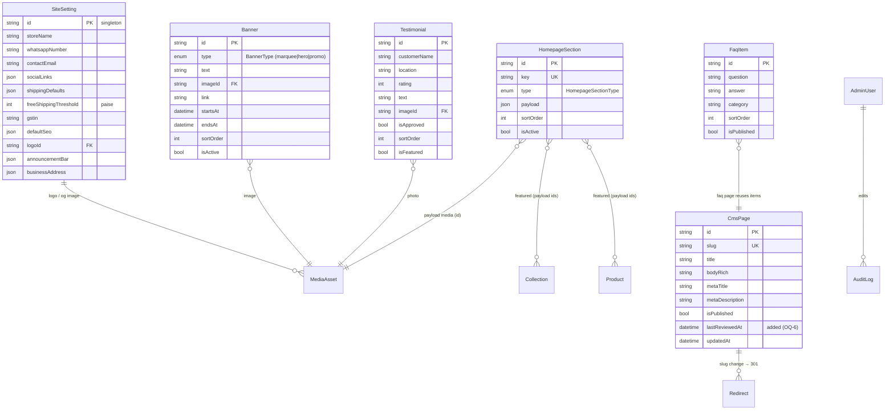
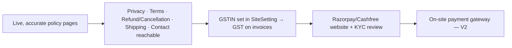
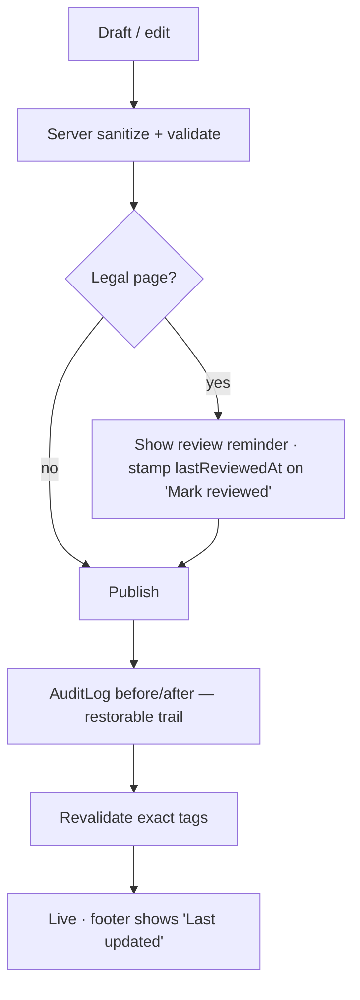

# 15 — Content Management & Static / Legal Pages

> **Project:** `vaani-gift-e-commerce` · **Brand:** GooglyWoogly Art · **Founder/CEO:** Vanshika Bhatia · **Base:** Jaipur, Rajasthan, India · **Domain:** `googlywoogly.art`
> **Owner perspective:** Product / Content · **Conforms to:** [`00-canonical-decisions.md`](./00-canonical-decisions.md) (CANON).
> **Layers on top of:** `03-data-model` (the CMS entity field shapes), `04-information-architecture-and-routing` (the route map + the canonical **§7 cache-tag → trigger matrix**), `09-seo-rendering-isr-and-revalidation` (Metadata API, JSON-LD, the on-demand revalidation call pattern), and `05-storefront-landing-and-bulk-order` (the homepage **read contract** + `HomepageSection.type` renderer catalog — this spec owns the *editing* UX for those entities).
> **Authoritative for:** the admin **content editors** (`/admin/content`, `/admin/settings`) for `HomepageSection`, `Banner`, `Testimonial`, `FaqItem`, `CmsPage`, `SiteSetting`; the rich-text authoring + sanitization pipeline; the required **static & legal page** catalogue with content outlines (DPDP-aware); the occasion/seasonal landing strategy (as `Collection`s); the V1 blog/journal; and the content-governance + SEO-ownership model for all editable copy.
> **Not authoritative for:** field-level schema (`03`), route rendering directives / `generateMetadata` / JSON-LD implementation (`09`), the storefront homepage renderer components and the `HomepageSection.payload` shapes (`05`), the `/faq` & `/contact` page *layouts* (homepage uses teasers; the full pages are specified here for content but their storefront chrome is `04`), notification copy (`14`), or the order/checkout flows (`08`/`12`).
> Where this spec decides something not fixed in CANON, the decision is stated inline and surfaced under **§11 Open Questions**.

---

## 1. Purpose & Scope

### 1.1 What this document covers

1. **Admin content editors** — the `/admin/content` workspace (tabbed) and `/admin/settings`, giving Vanshika no-code control over:
   - **`HomepageSection`** — reorder, toggle, and edit the payload of homepage blocks (closed renderer set; §4.2).
   - **`Banner`** — the **marquee/announcement** strip, **hero** campaign banners, and **promo** bars, each with a publish **schedule** (`startsAt`/`endsAt`) (§4.3).
   - **`Testimonial`** — capture, **moderate** (approve), order, and **feature** customer quotes (§4.4).
   - **`FaqItem`** — author/categorise/reorder/publish FAQ entries that power `/faq` and on-page FAQ blocks (§4.5).
   - **`CmsPage`** — rich-text editing of the static & legal pages (About, Contact, FAQ intro, the 5 legal pages, Care Guide, bulk-orders copy) (§4.6).
   - **`SiteSetting`** — the singleton store config: store name, contact email, **WhatsApp number**, socials, **shipping defaults & free-shipping threshold**, **GSTIN**, default SEO, logo, **announcement bar** (§4.7).
2. **The rich-text authoring + sanitization pipeline** — the editor (Tiptap), the stored format, server-side sanitization, and how rich bodies render server-side in RSC (§4.8, §6.6).
3. **On-publish revalidation** — the exact CANON §9 cache tags each editor busts, restated as the authoritative call-list for `/admin/content` and `/admin/settings` mutations (§6, §6.7).
4. **The required static & legal page catalogue for an Indian e-commerce store** — About/Story, Contact, FAQ, Shipping & Delivery Policy, Cancellation & Refund Policy, Privacy Policy (DPDP-aware), Terms & Conditions, Care Guide — each with a **content outline** the founder can adapt, and the **legal review** gate. These pages are a stated **prerequisite for any future payment gateway** (Razorpay onboarding requires them) (§7).
5. **Occasion / seasonal landing-page strategy** — modelled as `Collection`s (not new routes), the seed set, the seasonal playbook, and how the founder turns a festival on/off (§8).
6. **Blog / journal (V1)** — the SEO content engine: modelled, routes, and editorial workflow, deferred to V1 (§9, §12).
7. **Content governance & SEO ownership** — who owns which copy, the SEO-field discipline for editable content, the publish checklist, versioning/audit, and reserved-slug protection (§10).

### 1.2 What this document explicitly does NOT cover

- **Storefront rendering of these entities** — the homepage section *renderers* and `payload` discriminated-union shapes (`05` §4.1/§5.2), the `/faq` & `/contact` page chrome and the marquee bar rendering (`04`), the rich-description PDP renderer (`07`). This spec defines the **write/editing** side; those define the **read/render** side.
- **Route directives, `generateMetadata`, JSON-LD, sitemap/robots implementation** — owned by `09`. This spec specifies *which SEO fields the founder edits* and *what content each page contains*; `09` turns those into tags.
- **The `Redirect` engine & slug-change 301s** — owned by `04` §8.5 (resolution) and `03` (the `Redirect` table). This spec triggers a `Redirect` write on a CMS slug change and revalidates; it does not redefine the engine.
- **`MediaAsset` / media library UX** — owned by `11` (`/admin/media`); content editors **consume** the media picker (image selection → `imageId`/`mediaAssetId`).
- **Notification/email templates (`EmailTemplate`)** — owned by `14`; not a content-marketing surface.
- **Coupons, reviews-as-product-ratings** — `Coupon` is `12`/marketing; `Review` (product reviews) is `07`/V1. `Testimonial` here is a **brand/homepage** quote entity, distinct from product `Review`.
- **No new storefront routes** — occasions are `Collection`s on the existing `/collections/[slug]`; the journal adds `/journal/*` **in V1 only**. No page-builder that lets the founder invent arbitrary new section *types* (closed renderer set — `05` OQ-1).

---

## 2. Primary user stories / jobs-to-be-done

| # | As a… | I want… | so that… |
|---|---|---|---|
| JTBD-1 | **Founder (Vanshika)** | to reorder, hide, and edit homepage sections (hero, occasion rail, bestsellers, story, testimonials) from my phone and see it live in seconds | I run seasonal merchandising without an engineer or a redeploy. |
| JTBD-2 | **Founder** | to schedule a "Diwali — free shipping over ₹999" announcement bar to start on a date and auto-expire | promos go live and end on their own while I sleep. |
| JTBD-3 | **Founder** | to paste a happy customer's WhatsApp message as a testimonial, approve it, and feature it | social proof builds trust for an unknown micro-brand. |
| JTBD-4 | **Founder** | to add/edit FAQ answers (shipping time, made-to-order, personalization, returns) | I deflect repetitive WhatsApp questions and rank for "how long does GooglyWoogly take to ship". |
| JTBD-5 | **Founder** | to edit my About story, policies, and care guide in a simple rich editor with bold/lists/links | the site reads like a real brand and stays legally current. |
| JTBD-6 | **Founder** | one settings screen for WhatsApp number, free-shipping threshold, socials, logo, GSTIN, and default SEO | the whole storefront (header, footer, checkout, emails, schema) updates from one place. |
| JTBD-7 | **Trust-seeking shopper** | clear, India-specific policies (shipping timelines, cancellation/refund, privacy) and an honest brand story | I trust paying via WhatsApp and know what happens if something goes wrong. |
| JTBD-8 | **Compliance / DPDP** | a published, accurate Privacy Policy with consent, minimal-PII, grievance-officer, and retention language | the store honours India's DPDP Act and is payment-gateway-ready. |
| JTBD-9 | **Future payment-gateway onboarding (Razorpay)** | the mandatory policy URLs (Privacy, Terms, Refund/Cancellation, Shipping, Contact) live and reachable | KYC/website-review passes without scramble. |
| JTBD-10 | **Search engine / organic shopper** | occasion landing pages ("handmade Rakhi gifts Jaipur") and a journal with gift guides | GooglyWoogly ranks for high-intent seasonal and informational queries. |
| JTBD-11 | **Founder (link integrity)** | editing a page slug to keep old links working | a shared WhatsApp policy link or a ranked URL never 404s. |
| JTBD-12 | **Future engineer / staff** | a closed renderer set, sanitized rich text, and a documented tag-bust contract | content edits can't XSS the storefront, break layout, or miss a cache bust. |

---

## 3. Detailed functional requirements

> Numbered, decisive. "MUST" = MVP unless a phase is tagged `[V1]`/`[later]`. Entity, field, enum, route, and tag names are CANON §5/§6/§8/§9 verbatim. The cache-tag → trigger contract is `04` §7 / `09` §6.4; this spec restates it for the content editors and never re-coins a tag.

### 3.1 The content workspace

- **FR-1 — Single content workspace.** `/admin/content` MUST present a **tabbed** workspace (CANON §8 `?tab` param) with tabs: **Homepage**, **Banners**, **Testimonials**, **FAQ**, **Pages** (CMS). `/admin/settings` (`?section`) hosts **Site Settings**. Both are SSR, auth-gated, `noindex,nofollow` (`04` §6.2). The active tab is reflected in the URL (`?tab=banners`) so the founder can deep-link/bookmark.
- **FR-2 — Mobile-first editors.** Every editor MUST be usable one-handed on a phone (CANON §2.4): list rows collapse to cards; reordering uses up/down nudge buttons **and** drag-handle; toggles are large switches; saves are explicit with a sticky save bar and a success toast. No editor requires a desktop.
- **FR-3 — Optimistic publish + live preview link.** On save, the editor MUST (a) persist, (b) call the exact revalidation set (§6), (c) show a toast with a **"View live →"** deep link to the affected storefront URL (opens `/`, `/faq`, `/{slug}`, etc.), and (d) reflect the change optimistically in the admin list. A **"Preview"** affordance renders the unsaved/draft state in a new tab via a signed preview param (§3.7).
- **FR-4 — Every content mutation is audited.** Each create/update/reorder/toggle/publish MUST write an `AuditLog` row (`adminId, action, entityType, entityId, before, after`) per `03` FR-32 (e.g. `action: "homepage_section.reorder"`, `"cms_page.publish"`, `"site_setting.update"`). PII never appears in CMS audit snapshots (content is non-PII; settings may carry contact email/WhatsApp — retained, not redacted, as it is business config, not customer PII).

### 3.2 Homepage sections (`HomepageSection`)

- **FR-5 — Closed renderer set; founder controls presence/order/content only.** The founder MUST be able to **reorder** (change `sortOrder`), **toggle** (`isActive`), and **edit the `payload`** of each `HomepageSection`. The founder MUST NOT be able to invent new section **`type`s** — `HomepageSectionType` is a closed enum (`03` §3.3; `05` OQ-1: `hero, featured_products, featured_collections, category_grid, bestsellers, testimonials, banner, story, instagram, newsletter, faq, rich_text`). Adding a new type is an engineering change (prevents page-builder sprawl + render breakage).
- **FR-6 — Add-from-catalogue, not from scratch.** "Add section" presents a picker of the **available renderer types** (with a thumbnail + description) and inserts a row with a sensible default `payload` and a unique `key`. The founder then edits the payload via the **type-specific form** (§4.2). A type may appear more than once only if its renderer is idempotent (e.g. multiple `rich_text` or `featured_collections`); singleton types (`hero`, `newsletter`) are limited to one active instance (validation, §6.7).
- **FR-7 — Payload is validated per type.** Each `HomepageSection.payload` MUST be validated by a **discriminated-union Zod schema keyed on `type`** (matching `05` §3.5 shapes) before persistence. An invalid payload is rejected with field-level errors; a section whose payload fails validation at **render** time is **skipped** by the storefront (graceful, `05` §7) and flagged in admin with a "needs attention" badge.
- **FR-8 — Reorder semantics.** Reordering MUST persist a **dense, gap-tolerant** `sortOrder` (e.g. re-index 10,20,30… on save) to avoid float/collision drift; the list renders strictly ascending by `sortOrder`, ties broken by `key`. With **no rows**, the storefront falls back to the code-default section set (`05` §4.1) — the editor offers a one-click **"Seed default homepage"** to materialise those rows for editing.

### 3.3 Banners — marquee / hero / promo (`Banner`)

- **FR-9 — Three banner roles, one entity.** The founder MUST manage `Banner` rows of `type ∈ {marquee, hero, promo}` (`BannerType`, `03` §3.3). **`marquee`** = the scrolling announcement strip in the storefront header (owned/rendered by `04` layout; this spec edits the rows + the `SiteSetting.announcementBar` fallback). **`hero`** = a homepage hero override (`05` FR-5). **`promo`** = a promotional bar/block usable in a homepage `banner` section or a sitewide promo strip.
- **FR-10 — Scheduling.** Each `Banner` MUST support `startsAt`/`endsAt` (nullable). The storefront and all reads MUST treat a banner as **live** only when `isActive=true` **and** now ∈ [`startsAt`, `endsAt`] (open-ended if a bound is null). The editor MUST show a computed **status chip**: *Scheduled* (future `startsAt`), *Live*, *Expired* (past `endsAt`), or *Off* (`isActive=false`). Times are entered/displayed in **IST** and stored UTC (CANON §10).
- **FR-11 — Marquee composition & precedence.** The header announcement strip resolves in this order: (1) live `Banner type=marquee` rows (multiple → concatenated/rotated, ascending `sortOrder`); (2) else `SiteSetting.announcementBar` if `enabled`; (3) else hidden. The editor MUST make this precedence visible ("This will show because no marquee banner is scheduled"). Marquee text supports a single optional `link` per row.
- **FR-12 — Schedule does not require revalidation to *appear/expire* precisely.** Because banner reads are tagged (`banners`, `home`) with a **safety-net `revalidate` of 3600s** (`04` §7), a same-day schedule boundary may lag up to the safety-net window. To make boundaries crisp, the editor MUST, on save, bust `banners` + `home` immediately, and a **nightly cron** (`/api/cron/sitemap` companion or a dedicated `bannerSweep`, §6.5) MUST revalidate `banners`/`home` so banners crossing a `startsAt`/`endsAt` boundary refresh without a manual edit. (Decision OQ-3.)

### 3.4 Testimonials (`Testimonial`)

- **FR-13 — Moderate-before-show.** A `Testimonial` MUST default to `isApproved=false` and MUST NOT render on the storefront until approved (`03` §3.7). The editor provides a **moderation queue** (unapproved first) with one-tap **Approve / Unapprove**, plus **Feature** (`isFeatured`) and **reorder** (`sortOrder`).
- **FR-14 — Capture is founder-entered (MVP).** In MVP there is **no public testimonial submission form** (testimonials come from WhatsApp/DMs and are typed in by the founder). The editor supports `customerName`, `location?`, `rating?` (1–5), `text`, and an optional `imageId` (customer photo / product shot via the media picker). [V1] An optional post-delivery "leave a testimonial" capture MAY be added, distinct from product `Review`.
- **FR-15 — Featured subset on home.** The homepage `testimonials` section renders **approved** testimonials, preferring `isFeatured=true`, ordered by `sortOrder` (read contract owned by `05`). The editor must surface how many are currently featured and warn if zero are approved (home section would be empty → it self-hides, `05` §7).

### 3.5 FAQ (`FaqItem`)

- **FR-16 — Categorised, ordered, publishable.** The founder MUST author `FaqItem` rows with `question`, rich `answer`, optional `category` (free-text grouping, e.g. *Orders & Shipping*, *Products & Care*, *Payments*, *Returns*), `sortOrder` (within category), and `isPublished`. `/faq` renders **published** items grouped by category then `sortOrder` (`04` §6.1; `09` §5.5 emits `FAQPage` JSON-LD from the same set).
- **FR-17 — Suggested category set & seed.** The editor MUST seed a recommended FAQ set on first run (the questions in §7.3) and offer category presets, so the founder edits answers rather than inventing structure. Plain-text of each sanitized `answer` is what `FAQPage` JSON-LD uses (`09` §5.5) — the editor warns if an answer is empty or only formatting.
- **FR-18 — FAQ reuse.** A curated subset of FAQs MAY surface on the homepage (`HomepageSection type=faq`) and on PDPs (`07`); to avoid duplicate `FAQPage` markup, JSON-LD is emitted **only** on `/faq` (`09` §5.5) — the editor need not manage this, but the spec records it.

### 3.6 CMS pages (`CmsPage`) — static & legal

- **FR-19 — Fixed slug set; rich-text body; SEO fields.** The founder MUST edit `CmsPage` rows (`slug, title, bodyRich, metaTitle, metaDescription, isPublished`) for the **fixed** content/legal slugs (§7.1). `slug` for these pages is **chosen from the reserved fixed set** (not free-typed) so it always maps to a real route (`04` FR-13). `title` and `bodyRich` are required to publish; `metaTitle`/`metaDescription` are optional (fall back per `09` §4.4).
- **FR-20 — Which pages are CMS-editable vs structural.** Decision (OQ-1, resolving `04` Open Q-4): **all eight** content/legal pages — `about`, `contact`, `faq`-intro, `shipping-policy`, `returns-and-refunds`, `privacy-policy`, `terms`, `care-guide` — plus `bulk-orders` marketing copy are backed by a `CmsPage` row so the founder can edit copy without a deploy. The **functional chrome** on `/contact` (the contact form), `/faq` (the `FaqItem` accordion), and `/bulk-orders` (the inquiry form) is **code-owned** (`04`/`05`); the CMS body provides the surrounding/intro prose. `about` and the 5 legal pages are **pure `CmsPage`** (body is the whole content).
- **FR-21 — Publish gates draft vs live.** `isPublished=false` MUST keep the page out of the sitemap (`09` §8.1) and serve a `notFound()` on the storefront route for that slug **only if no published fallback exists**; for the fixed legal/content routes, an unpublished page renders a **code-default fallback body** (so `/privacy-policy` is never a 404 even before the founder writes it — critical for payment-gateway review). The editor labels this state ("Showing default text until you publish").
- **FR-22 — Slug change → 301.** Although the content/legal slugs are fixed by default, if a slug is ever changed (admin override), the save action MUST write a `Redirect{ fromPath, toPath, 301 }` (`03` `Redirect`; `04` FR-14) and `revalidatePath` both old and new (`09` FR-12). Reserved-word/collision guard per `04` FR-13.

### 3.7 Preview, draft & versioning

- **FR-23 — Draft preview.** The founder MUST be able to **preview** unpublished/edited content before it goes live, via a signed, short-lived preview link (`?preview={token}`) that bypasses the published filter for that one render (Next draft-mode/`draftMode()` cookie or a `REVALIDATE_SECRET`-derived token). Preview pages are always `noindex` and never cached.
- **FR-24 — Lightweight versioning via audit.** MVP does **not** ship a full CMS version-history UI; the `AuditLog` `before`/`after` snapshot per save provides a **restorable trail** (the admin can view prior `bodyRich` in the audit detail and copy-restore). [V1] A first-class "version history + one-click revert" view MAY be built on top of these snapshots (OQ-4).
- **FR-25 — Concurrent-edit safety.** Saves MUST be **last-write-wins with a stale-guard**: the editor sends the `updatedAt` it loaded; if the row's `updatedAt` is newer, the save is rejected with "This page changed since you opened it — reload" (optimistic-concurrency). Prevents one device silently clobbering another (the founder may use phone + laptop).

### 3.8 Rich text — authoring, storage, sanitization

- **FR-26 — Editor.** Rich bodies (`CmsPage.bodyRich`, `FaqItem.answer`, `Testimonial.text` [plain+light], `HomepageSection` `rich_text`/`story` payload prose, `Banner` promo text) are authored in **Tiptap** (ProseMirror-based, headless, shadcn-styleable). The toolbar is **constrained** to: headings (H2/H3), bold, italic, bullet/numbered lists, link, blockquote, horizontal rule, and (for pages) an **image** insert via the media picker. No raw-HTML paste-through, no arbitrary inline styles, no `<script>`/`<iframe>` (decision OQ-2 — Tiptap over a Markdown textarea for founder-friendliness; over a full page-builder for safety).
- **FR-27 — Storage format.** `bodyRich`/`answer` are stored as **sanitized HTML** (`String @db.Text`, `03`), produced from the Tiptap document. (Tiptap JSON is acceptable as an alternative internal format, but the stored, queried, and rendered value is sanitized HTML so `09`'s plain-text extraction for JSON-LD and the RSC renderer stay simple — OQ-2.)
- **FR-28 — Server-side sanitization is mandatory.** On **every** write, the server MUST sanitize the incoming HTML against a strict allow-list (`isomorphic-dompurify` / `sanitize-html`): allowed tags `h2 h3 p ul ol li a strong em blockquote hr br img figure figcaption`; allowed attrs `href`(http/https/mailto/tel + `rel="nofollow noopener"`/`target` normalised), `src`(Cloudinary host only)/`alt`/`width`/`height`. Everything else is stripped. Sanitization happens **server-side regardless of client editor constraints** (never trust the client). Rendered server-side in RSC via a `<RichText html={…} />` component that injects the already-sanitized HTML (no client hydration, no `dangerouslySetInnerHTML` of un-sanitized input).
- **FR-29 — Accessibility & structure in content.** The editor MUST nudge correct structure: the page `title` is the `<h1>` (not in the body); body headings start at **H2**; links require visible text (no bare URLs); inserted images **require `alt`** (block save on missing alt for content images). This keeps `09`'s heading hierarchy and a11y intact.

### 3.9 Settings (`SiteSetting`)

- **FR-30 — One singleton, sectioned form.** `/admin/settings` edits the single `SiteSetting` row (`03` FR-30) via a sectioned form (`?section`): **Store & Brand** (storeName, logoId, businessAddress), **Contact & Social** (contactEmail, whatsappNumber, socialLinks), **Shipping** (shippingDefaults: flat rate, freeShippingThreshold, COD flag), **Tax/Legal** (gstin, legalName), **SEO Defaults** (defaultSeo: titleTemplate, defaultDescription, ogImageId, twitterHandle), **Announcement Bar** (announcementBar: enabled, text, href). All money fields entered in ₹, stored as **integer paise** (CANON §10).
- **FR-31 — Settings fan-out.** A `SiteSetting` save MUST bust `settings` and `nav` (and `home`+`banners` if the announcement bar or marquee-affecting fields changed) per `04` §7. The founder MUST see which surfaces are affected ("Updates header, footer, checkout, emails, and structured data"). WhatsApp number changes propagate to every `wa.me` deep link (header/footer/PDP/confirm/track) and to `Organization` JSON-LD (`09` §5.1); free-shipping threshold propagates to cart/checkout (`08`) and the trust strip.
- **FR-32 — GST toggle is data-driven.** GST invoicing is **off until `gstin` is set** (CANON §11; `03` §7 "GST toggling"). Setting `gstin` turns on GST breakup on new orders/invoices (`12`) and surfaces GSTIN in the footer (`04` §4.2). The editor states this consequence and validates GSTIN format (15-char: `\d{2}[A-Z]{5}\d{4}[A-Z]\d[Z][A-Z\d]`).
- **FR-33 — Validation of critical config.** `whatsappNumber` (E.164, `+91…`), `contactEmail` (email), `freeShippingThreshold`/`flatRate` (≥0 paise), `defaultSeo.titleTemplate` (must contain `%s`), social URLs (https), `announcementBar.href` (relative or https) MUST be Zod-validated. An invalid WhatsApp number is high-severity (breaks the core handoff) — the form blocks save and explains.

### 3.10 Occasions, journal & governance

- **FR-34 — Occasions are `Collection`s, not new routes.** Seasonal/occasion landing pages (Diwali, Raksha Bandhan, etc.) MUST be modelled as `Collection` rows on `/collections/[slug]` (`04`; CANON §11) — **no new route type**. This spec owns the **content strategy + seed set + seasonal playbook** (§8); the collection CRUD editor itself is `11`. Turning a festival "on" = activating its collection + featuring it on home/nav; "off" = deactivating (`isActive=false`) — content, not code.
- **FR-35 — Blog/journal is V1.** A `/journal/[slug]` blog for SEO (gift guides, behind-the-scenes, care deep-dives) is **V1** (CANON §3; `04` §14). MVP ships **no** journal; this spec defines its model, routes, and workflow so V1 is additive (§9). (Decision: reuse `CmsPage` with a `journal/` slug prefix + a `type`/`kind` discriminator, **or** a dedicated `JournalPost` entity — recommended the latter for taxonomy/author/published-at; OQ-5.)
- **FR-36 — SEO ownership of editable copy.** Every CMS-editable surface that is **indexable** (`CmsPage`, occasion `Collection`, journal) MUST expose `metaTitle`/`metaDescription` (and OG image where the entity has one) to the founder, with **character-count guidance** (title ≤ 60, description ≤ 155) and a **live SERP preview** in the editor. Empty SEO fields fall back per `09` §4.4 — the editor shows the computed fallback so the founder sees the effective result.
- **FR-37 — Content governance gate.** Legal pages (Privacy, Terms, Refund/Cancellation, Shipping) MUST carry a **"reviewed" flag + last-reviewed date** surfaced in the editor and footer ("Last updated: {date}"). The publish action for a legal page shows a **reminder to have it reviewed** (the founder is not a lawyer) and records who/when via `AuditLog`. (Decision OQ-6: store `lastReviewedAt` — see §5.4.)

---

## 4. UX / UI breakdown

> Screens live under `/admin/content` (tabbed) and `/admin/settings` (sectioned), inside the admin shell (sidebar + topbar, `04` §4.4). Components reuse the vendored shadcn set: `tabs`, `card`, `switch`, `dialog`/`sheet`, `form`, `input`, `textarea`, `select`, `badge`, `button`, `dnd` handle, `tooltip`, plus a `RichTextEditor` (Tiptap) and a `MediaPicker` (from `11`). Mobile-first: tables → cards, dialogs → bottom sheets.

### 4.1 `/admin/content` shell

```
┌───────────────────────────────────────────────────────────────────┐
│  Content                                   [ View store ↗ ]         │
│  [ Homepage ] [ Banners ] [ Testimonials ] [ FAQ ] [ Pages ]        │  ← Tabs (?tab=)
├───────────────────────────────────────────────────────────────────┤
│  …active tab panel…                                                 │
└───────────────────────────────────────────────────────────────────┘
```

- **Top bar:** title, "View store ↗" (opens `/`), a `?tab` deep-linkable `Tabs` strip. On mobile the tabs become a horizontally scrollable segmented control.
- **Per-tab pattern:** a list/queue on the left/top + an editor `Sheet`/`Dialog` on row tap; a sticky **"Save"** bar appears when dirty; toast + "View live ↗" on save.

### 4.2 Homepage tab (`HomepageSection`)

Layout: a **vertical, reorderable list of section cards** in `sortOrder`, each showing: drag handle, section **type icon + label**, a one-line summary of the payload (e.g. *Hero — "Handmade joy, delivered"*), a **live/hidden** switch (`isActive`), up/down nudges, and an "Edit" affordance. A header button **"+ Add section"** opens the renderer-type picker; a secondary **"Seed default homepage"** appears only when there are zero rows.

```
Homepage sections                         [ + Add section ]
┌─────────────────────────────────────────────────────────┐
│ ⠿  ◰ Hero            "Handmade joy, delivered"   [●On ] ✎ │
│ ⠿  ▦ Shop by Occasion  4 collections            [●On ] ✎ │
│ ⠿  ★ Bestsellers       auto · 8 items           [○Off] ✎ │
│ ⠿  ❝ Testimonials      featured · 3 quotes      [●On ] ✎ │
│ ⠿  ✎ Our Story         rich text                [●On ] ✎ │
│ ⠿  ✉ Newsletter        footer signup            [●On ] ✎ │
└─────────────────────────────────────────────────────────┘
```

- **Edit sheet (type-specific form):** discriminated by `type` (FR-7). Examples:
  - `hero` → headline, sub-copy, CTA label, CTA href (route picker), background image (MediaPicker), optional link to override via a `Banner type=hero`.
  - `featured_collections` / `featured_products` → a **collection picker** or a **product multiselect** + a `limit`; heading/sub-copy.
  - `category_grid` / `bestsellers` → heading + limit (auto-sourced).
  - `testimonials` → heading + "show featured only" toggle + count.
  - `story` / `rich_text` → heading + **RichTextEditor** + optional image.
  - `instagram` → heading + handle (from `SiteSetting.socialLinks` default) + (V1 feed).
  - `newsletter` → heading + sub-copy + consent line.
  - `faq` → heading + multiselect of `FaqItem`s (or "top N").
- **Validation:** singleton types (`hero`, `newsletter`) block adding a second active instance; invalid payload shows inline errors; a section that fails render-time validation shows a **"needs attention"** amber badge.
- **Empty state:** "Your homepage is using the default layout. Customise it →" with the **Seed default homepage** CTA (materialises `05` §4.1 defaults as editable rows).
- **Mobile:** cards stack full-width; reorder via up/down (drag optional); edit opens a full-height bottom `Sheet`.

### 4.3 Banners tab (`Banner`)

Two grouped lists with sub-headers: **Announcement marquee** (`type=marquee`), **Hero campaigns** (`type=hero`), **Promo bars** (`type=promo`). Each row: text/preview, **status chip** (Scheduled/Live/Expired/Off), schedule window (IST), `sortOrder`, toggle, edit.

```
Announcement marquee                                   [ + New ]
┌─────────────────────────────────────────────────────────────┐
│ ✦ Free shipping over ₹999 · Handmade in Jaipur   ● Live  ✎  │
│ ✦ Diwali sale — DM to order               ◷ Scheduled 20 Oct ✎ │
└─────────────────────────────────────────────────────────────┘
ⓘ No marquee live → header shows your Announcement Bar text (Settings).
```

- **Edit sheet:** `type` (locked per group when added from a group header), `text`, optional `link` (route/URL), `imageId` (hero/promo, MediaPicker), **schedule** (`startsAt`/`endsAt` IST datetime pickers, both optional), `sortOrder`, `isActive` switch. A **live status preview** computes the chip from the inputs.
- **Precedence hint (FR-11):** an inline note explains why a row will/won't show given other live rows and the settings fallback.
- **Save → bust `banners` + `home`; "View live ↗" → `/`.**
- **Empty/expired:** expired banners are visually dimmed with a "Duplicate to reschedule" action.

### 4.4 Testimonials tab (`Testimonial`)

A **moderation queue**: unapproved first (amber), then approved. Each card: quote excerpt, customer name + location, rating stars (if any), photo thumb, and actions **Approve/Unapprove**, **Feature**, reorder, edit, delete.

```
Testimonials                                          [ + Add ]
┌─────────────────────────────────────────────────────────────┐
│ ⏳ "Loved the hand-painted mug!" — Aarti, Jaipur  ★★★★★      │
│        [ Approve ]  [ ✎ ]  [ 🗑 ]                            │
├─────────────────────────────────────────────────────────────┤
│ ✓★ "Perfect Rakhi gift" — Neha, Pune  ★★★★★   [Featured]    │
│        [ Unapprove ] [ Unfeature ] [ ⠿ reorder ] [ ✎ ]       │
└─────────────────────────────────────────────────────────────┘
```

- **Add/Edit:** `customerName`, `location?`, `rating?` (1–5 selector), `text` (short rich/plain), `imageId?` (MediaPicker). New entries default **unapproved**.
- **Feature limit guidance:** shows count of featured; warns if zero approved (home section self-hides).
- **Save → bust `testimonials` + `home`.**

### 4.5 FAQ tab (`FaqItem`)

Grouped by `category` (collapsible), each item reorderable within its group. Row: question, published toggle, edit, delete. Header: **"+ Add FAQ"**, category filter, and on first run a **"Seed recommended FAQs"** CTA.

```
FAQ                                    [ + Add FAQ ]  [ Seed ]
▸ Orders & Shipping
   ⠿ How long until my order ships?            [●Pub] ✎
   ⠿ Do you ship pan-India?                    [●Pub] ✎
▸ Products & Care                              [●Pub]
   ⠿ Are items handmade / made-to-order?       [●Pub] ✎
▸ Payments
   ⠿ How do I pay? (WhatsApp)                   [○Dft] ✎
```

- **Edit sheet:** `question`, **RichTextEditor** `answer`, `category` (combobox of existing + free text), `sortOrder`, `isPublished` switch. Warns on empty answer (breaks `FAQPage` JSON-LD).
- **Save → bust `faq` (+ `/faq` path).**

### 4.6 Pages tab (`CmsPage`)

A fixed list of the **content/legal pages** (§7.1) plus `bulk-orders`. Each row: page name, slug (read-only chip), **published/draft** badge, **last updated** + **last reviewed** (legal pages), edit.

```
Pages
┌───────────────────────────────────────────────────────────┐
│ About / Our Story        /about              ● Published ✎ │
│ Contact                  /contact            ● Published ✎ │
│ Shipping & Delivery      /shipping-policy    ● Published ✎ │
│ Cancellation & Refund    /returns-and-refunds ◑ Draft     ✎ │
│ Privacy Policy           /privacy-policy     ● Published ✎ │
│ Terms & Conditions       /terms              ● Published ✎ │
│ Care Guide               /care-guide         ● Published ✎ │
│ Bulk / Corporate copy    /bulk-orders        ● Published ✎ │
└───────────────────────────────────────────────────────────┘
```

- **Page editor (full screen / large sheet):**
  - Header: page name, **Published** switch, **Preview** (draft), **View live ↗**, Save.
  - **Title** (`<h1>`), **Body** (`RichTextEditor`, FR-26), and an **SEO accordion**: `metaTitle`, `metaDescription` (char counters + live SERP preview, FR-36), computed-fallback display.
  - Legal pages additionally show a **"Mark as reviewed"** control stamping `lastReviewedAt` + a reminder banner (FR-37) and a one-click **"Insert standard template"** that loads the §7 outline as a starting body (only when body is empty).
  - **Stale-guard** (FR-25): hidden `updatedAt`; conflict → reload prompt.
- **Save → bust `page:{slug}` (+ `faq` if FAQ page) + `revalidatePath('/{slug}')`; slug change → Redirect + old/new path.**

### 4.7 `/admin/settings` (`SiteSetting`)

Sectioned form (left rail / `?section` on desktop; accordion on mobile):

| Section | Fields (CANON `SiteSetting` keys) | Notes |
|---|---|---|
| **Store & Brand** | `storeName`, `logoId` (MediaPicker), `businessAddress` (legalName, line1/2, city, state, pincode, country) | drives footer, schema, invoices |
| **Contact & Social** | `contactEmail`, `whatsappNumber` (E.164), `socialLinks` (instagram/facebook/pinterest/youtube) | drives `wa.me`, footer, `Organization` schema |
| **Shipping** | `shippingDefaults` (flatRatePaise, freeShippingThresholdPaise, codEnabled) + mirror `freeShippingThreshold` | drives cart/checkout, trust strip |
| **Tax / Legal** | `gstin` (validated), `businessAddress.legalName` | setting GSTIN turns on GST (FR-32) |
| **SEO Defaults** | `defaultSeo` (titleTemplate w/ `%s`, defaultDescription, ogImageId, twitterHandle) | root metadata fallback (`09` §4.2) |
| **Announcement Bar** | `announcementBar` (enabled, text, href) | header fallback when no marquee banner (FR-11) |

- Each section: explicit **Save** (per-section or global), inline validation, an **impact note** ("Affects: header, footer, checkout, emails"), and a "View live ↗".
- **Money inputs** show ₹ and accept rupees, persist paise.
- **Save → bust `settings`, `nav` (+ `home`, `banners` if announcement changed).**

### 4.8 Rich text editor component (shared)

- **Toolbar (constrained, FR-26):** H2, H3, Bold, Italic, Bullet list, Numbered list, Link (with rel/target normalisation), Blockquote, Horizontal rule, **Image** (pages only, MediaPicker → requires alt), Undo/Redo. No font/color/size, no tables, no raw HTML.
- **Behaviour:** paste is **sanitized to allowed marks** (strips Google-Docs styling, scripts); link dialog validates http/https/mailto/tel; image insert enforces `alt`. Character/word count for body; "headings start at H2" hint.
- **Mobile:** sticky compact toolbar above the keyboard; large tap targets.

### 4.9 Cross-cutting states (admin)

- **Saving:** button spinner + disabled; optimistic list update; on failure, revert + error toast (keep the editor open with the user's input).
- **Validation failure:** field-level inline errors; the Save bar shows "Fix N issues".
- **Conflict (stale):** "This changed since you opened it — Reload to see the latest" (FR-25).
- **Revalidation feedback:** toast "Published — live in a few seconds" + "View live ↗" (the actual freshness is next-request; `09` §6.6).
- **Empty datasets:** seed CTAs (homepage, FAQ); friendly empty states elsewhere.

### 4.10 Content authoring flow (mermaid)

```mermaid
flowchart TD
  A[Founder opens /admin/content or /admin/settings] --> B{Pick surface}
  B -->|Homepage| C[Reorder / toggle / edit section payload]
  B -->|Banner| D[Compose text/image + schedule startsAt/endsAt]
  B -->|Testimonial| E[Add → moderate → approve/feature]
  B -->|FAQ| F[Author Q + rich A, categorise, publish]
  B -->|Page| G[Rich-text body + SEO fields + publish]
  B -->|Settings| H[Edit singleton sections]
  C & D & E & F & G & H --> I[Zod validate input]
  I -->|invalid| I2[Inline field errors] --> B
  I -->|valid| J[Server: sanitize rich HTML allow-list]
  J --> K[Persist + AuditLog before/after]
  K --> L{Slug changed? (CmsPage)}
  L -->|yes| L2[Write Redirect 301 + revalidatePath old&new]
  L -->|no| M[revalidateTag exact set §6]
  L2 --> M
  M --> N[Toast: Published · View live ↗]
  N --> O[Next storefront request re-renders from DB]
```

---

## 5. Data & entities used

> Names/fields are CANON §5 / `03` verbatim. "R" = read, "W" = written by this spec's editors. Money fields are integer **paise**.

### 5.1 Entities written (the CMS surface)

| Entity | Fields read | Fields written | Where |
|---|---|---|---|
| **`HomepageSection`** | `id, key, type, payload, sortOrder, isActive, updatedAt` | `payload, sortOrder, isActive` (+ `key, type` on create) | Homepage tab |
| **`Banner`** | `id, type, text, imageId, link, startsAt, endsAt, sortOrder, isActive, updatedAt` | all editable fields | Banners tab |
| **`Testimonial`** | `id, customerName, location, rating, text, imageId, isApproved, sortOrder, isFeatured, updatedAt` | all editable + `isApproved, isFeatured, sortOrder` | Testimonials tab |
| **`FaqItem`** | `id, question, answer, category, sortOrder, isPublished, updatedAt` | all editable fields | FAQ tab |
| **`CmsPage`** | `id, slug, title, bodyRich, metaTitle, metaDescription, isPublished, updatedAt` (+ added `lastReviewedAt`, §5.4) | `title, bodyRich, metaTitle, metaDescription, isPublished` (+ `slug` on rare override, `lastReviewedAt`) | Pages tab |
| **`SiteSetting`** | all keys (singleton) | `storeName, contactEmail, whatsappNumber, socialLinks, shippingDefaults, freeShippingThreshold, gstin, currency, defaultSeo, logoId, announcementBar, businessAddress` | Settings |
| **`Redirect`** | `fromPath` (collision check) | `fromPath, toPath, statusCode=301` on CMS slug change | Pages tab (FR-22) |
| **`AuditLog`** | — | one row per mutation (`03` FR-32) | all editors |
| **`Collection`** *(occasions)* | `slug, title, isActive, isFeaturedOnHome` | (CRUD owned by `11`; this spec drives **strategy** only) | §8 |

### 5.2 Entities read-only (consumed by editors)

| Entity | Used for |
|---|---|
| **`MediaAsset`** | image picking for `Banner.imageId`, `Testimonial.imageId`, `SiteSetting.logoId/defaultSeo.ogImageId`, page body images, `HomepageSection` payload media (`url, alt, width, height` for previews; `id` stored). Library UX owned by `11`. |
| **`Category` / `Collection` / `Product`** | pickers inside homepage `payload` editors (featured collections/products, category grid) and the SERP/preview context. |
| **`AdminUser`** | `AuditLog.adminId`, `lastReviewedAt` attribution. |

### 5.3 What the storefront reads (the render contract — owned elsewhere, referenced)

- Homepage: `HomepageSection` (active, ordered) + `Banner` (live hero/marquee) + `Testimonial` (approved/featured) — `05`.
- `/faq`: published `FaqItem` — `04`/`09`.
- Content/legal routes: `CmsPage` (published, or code-default fallback) — `04`/`09`.
- Layout chrome (header/footer/marquee): `SiteSetting` + `Banner type=marquee` under tags `settings`/`nav`/`banners` — `04`.

### 5.4 Added field (recorded, OQ-6) — `CmsPage.lastReviewedAt`

To support legal-page governance (FR-37): `lastReviewedAt DateTime? @db.Timestamptz(3)` on `CmsPage`. Surfaces "Last updated/reviewed: {date}" in editor + footer; stamped via "Mark as reviewed". **Not in CANON §5 / `03` field table → flagged for `03` to absorb.** (If rejected, derive from the latest `AuditLog` `cms_page.review` action instead.)

### 5.5 CMS / content ER (mermaid)



---

## 6. Server actions / API routes

> All are **admin** Server Actions (`"use server"`), guarded by `requireAdmin(...)` (`10`), **Zod-validated**, transactional, and they (a) write an `AuditLog` row and (b) call the **exact** CANON §9 / `04` §7 revalidation set. Rich text is **sanitized server-side** before persistence (FR-28). Inputs below name the validated shape; full Zod lives alongside the action. Tags are produced only via `lib/cache/tags.ts` (`09` FR-10) — never hand-typed.

### 6.1 Homepage section actions

| Action | Input (Zod) | Output | Side effects | Revalidates |
|---|---|---|---|---|
| `createHomepageSection` | `{ type: HomepageSectionType, payload: <union by type>, sortOrder?, isActive? }` | `{ ok, section }` | insert (unique `key` generated); enforce singleton types; AuditLog | `home`, `/` |
| `updateHomepageSection` | `{ id, payload, isActive?, expectedUpdatedAt }` | `{ ok, section }` | sanitize rich payload prose; stale-guard; AuditLog | `home`, `/` |
| `reorderHomepageSections` | `{ orderedIds: string[] }` | `{ ok }` | re-index `sortOrder` (10,20,…); AuditLog | `home`, `/` |
| `toggleHomepageSection` | `{ id, isActive }` | `{ ok }` | flip `isActive`; AuditLog | `home`, `/` |
| `deleteHomepageSection` | `{ id }` | `{ ok }` | delete; AuditLog | `home`, `/` |
| `seedDefaultHomepage` | `{}` | `{ ok, count }` | materialise `05` §4.1 defaults if zero rows; AuditLog | `home`, `/` |

### 6.2 Banner actions

| Action | Input (Zod) | Output | Side effects | Revalidates |
|---|---|---|---|---|
| `upsertBanner` | `{ id?, type, text?, imageId?, link?, startsAt?, endsAt?, sortOrder?, isActive? }` | `{ ok, banner }` | validate window (`startsAt ≤ endsAt`); sanitize promo text; AuditLog | `banners`, `home`, `/` |
| `toggleBanner` | `{ id, isActive }` | `{ ok }` | flip; AuditLog | `banners`, `home`, `/` |
| `deleteBanner` | `{ id }` | `{ ok }` | delete; AuditLog | `banners`, `home`, `/` |
| `duplicateBanner` | `{ id }` | `{ ok, banner }` | clone (off, no schedule) for rescheduling | `banners`, `home` |

### 6.3 Testimonial & FAQ actions

| Action | Input (Zod) | Output | Side effects | Revalidates |
|---|---|---|---|---|
| `upsertTestimonial` | `{ id?, customerName, location?, rating?(1-5), text, imageId?, sortOrder? }` | `{ ok, testimonial }` | sanitize text; new → `isApproved=false`; AuditLog | `testimonials`, `home`, `/` |
| `moderateTestimonial` | `{ id, isApproved }` | `{ ok }` | approve/unapprove; AuditLog | `testimonials`, `home`, `/` |
| `featureTestimonial` | `{ id, isFeatured }` | `{ ok }` | flag; AuditLog | `testimonials`, `home`, `/` |
| `reorderTestimonials` | `{ orderedIds }` | `{ ok }` | re-index; AuditLog | `testimonials`, `home` |
| `deleteTestimonial` | `{ id }` | `{ ok }` | delete; AuditLog | `testimonials`, `home` |
| `upsertFaqItem` | `{ id?, question, answer, category?, sortOrder?, isPublished? }` | `{ ok, item }` | sanitize `answer`; AuditLog | `faq`, `/faq` |
| `reorderFaqItems` | `{ orderedIds }` | `{ ok }` | re-index within category; AuditLog | `faq`, `/faq` |
| `deleteFaqItem` | `{ id }` | `{ ok }` | delete; AuditLog | `faq`, `/faq` |
| `seedRecommendedFaqs` | `{}` | `{ ok, count }` | insert §7.3 starter set if empty; AuditLog | `faq`, `/faq` |

### 6.4 CMS page & settings actions

| Action | Input (Zod) | Output | Side effects | Revalidates |
|---|---|---|---|---|
| `publishCmsPage` | `{ id?, slug(reserved set), title, bodyRich, metaTitle?, metaDescription?, isPublished, expectedUpdatedAt }` | `{ ok, page }` | **sanitize `bodyRich`** (FR-28); stale-guard; on slug change → write `Redirect` (`03`) | `page:{slug}` (+ `faq` if FAQ page); `revalidatePath('/{slug}')`; on slug change old+new paths |
| `markCmsPageReviewed` | `{ id }` | `{ ok }` | stamp `lastReviewedAt=now`, actor; AuditLog | `page:{slug}` |
| `insertCmsTemplate` | `{ id, templateKey }` | `{ ok, bodyRich }` | server-side: return §7 outline body (only if empty) | — (preview only) |
| `updateSiteSettings` | `{ <section fields> }` (per §4.7) | `{ ok, settings }` | validate (WhatsApp E.164, GSTIN, `%s` in titleTemplate, money≥0); AuditLog | `settings`, `nav` (+ `home`, `banners` if announcement/marquee changed); `revalidatePath('/')` |

### 6.5 Cron / out-of-band

| Route | Trigger | Side effects | Revalidates |
|---|---|---|---|
| `POST /api/cron/banner-sweep` *(or folded into the nightly cron)* | Vercel Cron (e.g. 00:05 IST + hourly during campaigns) | none (pure revalidation) | `banners`, `home` — so scheduled banners cross `startsAt`/`endsAt` boundaries crisply (FR-12) |
| `POST /api/revalidate` | `REVALIDATE_SECRET`-guarded (`09` §6.5) | manual/cron tag bust | any closed-set tag |

> Order/lead/content reads on never-cached routes are unaffected. CMS actions never touch product/category/collection tags (those are `11`).

### 6.6 Rich-text pipeline (sequence)

```mermaid
sequenceDiagram
  autonumber
  actor F as Founder (Tiptap)
  participant SA as Server Action (server/content/*)
  participant SAN as Sanitizer (allow-list)
  participant DB as Postgres (Prisma · tx)
  participant DC as Next Data/Route Cache (tagged)
  participant RSC as Storefront RSC (<RichText/>)
  F->>SA: publishCmsPage({ title, bodyRich(html), seo, expectedUpdatedAt })
  SA->>SA: Zod validate + requireAdmin + stale-guard (updatedAt)
  SA->>SAN: sanitize(bodyRich) → strip scripts/styles/iframes; normalise links
  SAN-->>SA: clean HTML
  SA->>DB: UPDATE cms_pages SET body_rich=clean,…; INSERT AuditLog; (INSERT Redirect if slug changed)
  DB-->>SA: { before, after }
  SA->>DC: revalidateTag("page:{slug}"); revalidatePath("/{slug}")
  SA-->>F: { ok } · toast "View live ↗"
  Note over DC,RSC: next request re-renders
  RSC->>DB: read published page (clean HTML)
  RSC-->>RSC: <RichText html={clean}/> server-rendered (no client JS, escaped JSON-LD plain-text for /faq)
```

### 6.7 Revalidation contract (restated for content editors — authoritative call-list)

| Editor mutation | `revalidateTag(…)` | `revalidatePath(…)` | Safety-net |
|---|---|---|---|
| Homepage section add/edit/reorder/toggle/seed | `home` | `/` | 3600 |
| Banner upsert/toggle/schedule/delete | `banners`, `home` | `/` | 3600 (+ nightly sweep, FR-12) |
| Testimonial add/edit/approve/feature/reorder | `testimonials`, `home` | `/` | 86400 (home 3600) |
| FAQ add/edit/reorder/publish | `faq` | `/faq` | 86400 |
| CmsPage publish/update | `page:{slug}` (+ `faq` if FAQ page) | `/{slug}`; slug change → old+new | 86400 |
| SiteSetting save (any key) | `settings`, `nav` (+ `home`,`banners` if announcement/marquee) | `/` | 3600 |
| Occasion `Collection` activate/feature (via `11`) | `collection:{slug}`, `products`, `nav` (+ `home` if featured) | `/collections/{slug}`, `/` | 3600 |

> This mirrors `04` §7 exactly. No new tags introduced. CMS slug changes are the only place this spec writes a `Redirect`.

---

## 7. Required static & legal pages (catalogue + content outlines)

> These are the **trust + compliance backbone** for an Indian D2C store and a **hard prerequisite for any future payment gateway** (Razorpay/Cashfree website review mandates live Privacy, Terms, Refund/Cancellation, Shipping, and Contact URLs). All are `CmsPage`-backed (FR-20) with **code-default fallback bodies** (FR-21) so none can 404. Content below is the **founder-editable starting outline** — not legal advice; legal pages carry a review gate (FR-37). Tone: warm, handmade, honest, India-specific (₹, pan-India, WhatsApp-first, made-to-order).

### 7.1 Page catalogue

| Page | Route (CANON §8) | Slug | Type | Indexable | Purpose |
|---|---|---|---|---|---|
| About / Our Story | `/about` | `about` | pure CmsPage | ✅ | Brand story, founder, handmade-in-Jaipur trust |
| Contact | `/contact` | `contact` | CmsPage intro + **code form** | ✅ | Reach the founder; WhatsApp/email/address; grievance contact |
| FAQ | `/faq` | `faq` | CmsPage intro + **`FaqItem` accordion** | ✅ | Deflect repeat questions; `FAQPage` schema |
| Shipping & Delivery Policy | `/shipping-policy` | `shipping-policy` | pure CmsPage | ✅ | Timelines, charges, free-shipping threshold, made-to-order, tracking |
| Cancellation & Refund Policy | `/returns-and-refunds` | `returns-and-refunds` | pure CmsPage | ✅ | Cancellation window, refund method/timeline, handmade/personalized exclusions |
| Privacy Policy (DPDP-aware) | `/privacy-policy` | `privacy-policy` | pure CmsPage | ✅ | PII collected, use, consent, retention, rights, grievance officer (DPDP) |
| Terms & Conditions | `/terms` | `terms` | pure CmsPage | ✅ | Use of site, pricing/availability, WhatsApp-payment model, IP, liability, governing law (Jaipur) |
| Care Guide | `/care-guide` | `care-guide` | pure CmsPage | ✅ | How to care for handmade items by material; cross-links PDP care sections |
| Bulk / Corporate copy | `/bulk-orders` | `bulk-orders` | CmsPage copy + **code form** | ✅ | Marketing copy above the inquiry form (`05` FR-13) |

### 7.2 Content outlines

> Each outline is the default body inserted by **"Insert standard template"** (FR-37). Square-bracketed tokens auto-fill from `SiteSetting` (e.g. `[whatsappNumber]`, `[contactEmail]`, `[freeShippingThreshold]`, `[businessAddress]`, `[gstin]`).

**About / Our Story** (`about`)
- Opening hook: handmade gifting & home décor, designed and crafted in Jaipur.
- Founder note (Vanshika) — why GooglyWoogly exists; the joy of handmade.
- "Each piece is unique" — the handmade promise; small imperfections as character.
- Made-to-order craft — what it means, typical lead times.
- Our materials & artisans (Jaipur craft heritage).
- How ordering works (browse → cart → place request → we confirm & take payment on WhatsApp → we craft & ship).
- CTAs: Shop bestsellers · Bulk/corporate · Follow on Instagram.

**Contact** (`contact`) — *intro copy; the form is code-owned*
- "We'd love to hear from you." Response-time expectation (e.g. within 24–48h, IST business days).
- **WhatsApp** (primary): `[whatsappNumber]` click-to-chat.
- **Email**: `[contactEmail]`.
- **Address** (for correspondence): `[businessAddress]`.
- **Grievance / support**: name + contact of the person handling complaints (ties to Privacy grievance officer).
- Link to FAQ for quick answers.

**FAQ** (`faq`) — *intro copy; items are `FaqItem`* — see §7.3 for the seeded items.

**Shipping & Delivery Policy** (`shipping-policy`)
- Where we ship: **pan-India** (international via bulk/WhatsApp enquiry only — V2).
- Processing time: in-stock dispatch window; **made-to-order** lead times (shown per product).
- Shipping charges: **flat ₹[flatRate]**, **free over ₹[freeShippingThreshold]**.
- Couriers & tracking: dispatched via standard couriers; tracking number shared on WhatsApp/email; track via your order link.
- Delivery estimates by region (metro vs non-metro); festival-season caveats.
- Delays/force majeure; what to do if a parcel is delayed/lost.
- Address accuracy & pincode serviceability (pincode check — V1).

**Cancellation & Refund Policy** (`returns-and-refunds`)
- **Cancellation window**: before dispatch / before production starts for made-to-order — how to request (WhatsApp `[whatsappNumber]`).
- **Refunds**: method (original/WhatsApp-coordinated UPI/bank), **timeline** (e.g. 5–7 business days after approval).
- **Made-to-order & personalized items**: non-cancellable once production begins / non-returnable unless damaged (handmade exclusion — stated clearly).
- **Damaged/defective/wrong item**: report within [N] days with unboxing photos; replacement or refund.
- **Non-returnable** categories; partial refunds conditions.
- Since payment is collected off-site (WhatsApp), refunds are handled directly — set expectation.

**Privacy Policy** (`privacy-policy`) — **DPDP-aware**
- Who we are (data fiduciary): GooglyWoogly Art, `[businessAddress]`, `[contactEmail]`.
- **Data we collect**: name, phone, email, shipping/billing address, order details, optional gift/personalization notes; analytics (hashed visitor id, device, pages) — **minimal PII** (DPDP minimisation).
- **Why & legal basis**: to process & fulfil your order, coordinate payment/delivery on WhatsApp, send transactional updates, comply with law — **consent**-based.
- **Sharing**: couriers, email/WhatsApp providers, hosting/analytics processors — only as needed; no selling of data.
- **Cookies/analytics**: first-party only; no third-party ad pixels (perf + DPDP).
- **Retention**: order/transaction records kept as required by law; analytics raw events [18–24 months]; you may request deletion (`03` §11 OQ-6).
- **Your rights (DPDP)**: access, correction, erasure, grievance redressal, consent withdrawal — how to exercise (email/WhatsApp).
- **Grievance Officer**: name, email, response timeline (DPDP requirement).
- **Children**: not directed at children; no knowing collection from minors.
- **Security**: reasonable safeguards; breach-handling intent.
- **Changes**: "Last updated: {lastReviewedAt}".

**Terms & Conditions** (`terms`)
- Acceptance of terms; eligibility.
- **Catalog & ordering model**: the site captures an **intent to order**; **no payment is taken on-site**; the founder confirms availability and **collects payment & coordinates on WhatsApp**; an order is binding only once confirmed.
- **Pricing & availability**: prices in **₹ (INR)**, inclusive/exclusive of taxes as shown; handmade items may vary slightly; we may correct errors / refuse/cancel an order (e.g. mispricing, out of stock).
- **Made-to-order**: lead times are estimates.
- **Personalization/gift messages**: customer responsible for accuracy of text supplied.
- **Intellectual property**: site content, photos, designs © GooglyWoogly Art.
- **User conduct**; **limitation of liability**; **indemnity**.
- **Governing law & jurisdiction**: India; courts at **Jaipur, Rajasthan**.
- **GST**: invoices issued with GST where applicable (when `[gstin]` set).
- **Contact** for disputes.

**Care Guide** (`care-guide`)
- General handmade-care intro ("treat it like the one-of-a-kind piece it is").
- By material (sections): ceramics/pottery, wood, brass/metal, textiles/fabric, resin, paint/hand-painted, candles — cleaning, what to avoid, storage.
- Sunlight/moisture/heat cautions.
- "Small variations are normal" reassurance.
- Cross-links to relevant PDP `careInstructions` and `/products`.

**Bulk / Corporate copy** (`bulk-orders`) — *copy above the code-owned inquiry form*
- Value prop: handmade corporate gifting, Diwali/festive & employee/client gifting, custom branding/personalization, pan-India delivery.
- Use cases, MOQ guidance, timeline expectation.
- CTA into the inquiry form (the form is `05`).

### 7.3 Seeded FAQ set (`seedRecommendedFaqs`)

| Category | Question | Answer gist |
|---|---|---|
| Orders & Shipping | How long until my order ships? | In-stock: dispatched in [X] days; made-to-order: see product lead time; tracking shared on WhatsApp/email. |
| Orders & Shipping | Do you ship across India? | Yes, pan-India. International via bulk enquiry only. |
| Orders & Shipping | What are the shipping charges? | Flat ₹[flatRate]; free over ₹[freeShippingThreshold]. |
| Orders & Shipping | How do I track my order? | Use the private tracking link sent after you place your order. |
| Payments | How do I pay? | After you place a request, we confirm availability and **collect payment & coordinate on WhatsApp** — no card needed on the site. |
| Payments | Is online payment safe? | We don't store cards; payment is handled directly via WhatsApp (UPI/bank). |
| Products & Care | Are your products handmade / made-to-order? | Yes — each piece is handcrafted in Jaipur; some are made-to-order with a short lead time. Small variations are part of the charm. |
| Products & Care | Can I personalize a gift or add a gift message? | Yes, where the product allows — add your text at checkout. |
| Products & Care | How do I care for my item? | See our Care Guide; specific tips are on each product page. |
| Returns | Can I cancel or return? | Cancel before dispatch/production via WhatsApp; made-to-order & personalized items have limits; damaged items are replaced/refunded. See our Cancellation & Refund Policy. |
| Bulk | Do you do corporate / bulk gifting? | Yes — tell us on the Bulk Orders page and we'll quote on WhatsApp. |

### 7.4 Payment-gateway readiness (forward-compat)



> Even though MVP takes **no on-site payment**, shipping these pages now means a later gateway (V2, CANON §3) clears website review without rework. The Terms/Privacy must already describe the WhatsApp model and be ready to be amended to add on-site payment.

---

## 8. Occasion / seasonal landing-page strategy (as Collections)

> Occasions are **merchandising**, so they are `Collection`s on `/collections/[slug]` (CANON §11; `04`). No new route type. This section is the **content/SEO playbook**; collection CRUD is `11`. (Collection = occasion/theme; Category = what-it-is — CANON glossary.)

### 8.1 Seed occasion collections

| Collection | Slug | Window (IST) | Nav group | Notes |
|---|---|---|---|---|
| Diwali Gifts | `diwali-gifts` | Sep–Nov | Festivals | Highest-intent; festive hero + announcement bar |
| Raksha Bandhan | `rakhi-gifts` | Jul–Aug | Festivals | Rakhi + sibling gifting |
| Holi | `holi-gifts` | Feb–Mar | Festivals | Colourful décor |
| Karwa Chauth | `karwa-chauth-gifts` | Oct–Nov | Festivals | |
| Wedding & Anniversary | `wedding-gifts`, `anniversary-gifts` | year-round | Milestones | Couple/home gifting |
| Birthday | `birthday-gifts` | year-round | Milestones | Evergreen |
| Housewarming | `housewarming-gifts` | year-round | Milestones | Home décor cross-sell |
| Corporate Gifting | `corporate-gifting` | year-round (festive peaks) | Corporate | Also deep-links `/bulk-orders` |
| Bestsellers | `bestsellers` | always | (nav) | Seeded, backs the "Bestsellers" nav item (`04`) |

### 8.2 Seasonal playbook (founder, no code)

```mermaid
flowchart TD
  S1[Before season: ensure occasion Collection exists & is populated] --> S2[Activate Collection isActive=true + isFeaturedOnHome]
  S2 --> S3[Schedule announcement Banner marquee start/end dates]
  S3 --> S4[Reorder homepage: add/raise 'Shop by Occasion' + featured collection rail]
  S4 --> S5[Write/refresh Collection metaTitle/metaDescription + hero image]
  S5 --> S6[Optional: journal gift-guide cross-linking the collection (V1)]
  S6 --> S7[After season: deactivate Collection + expire Banner]
```

- **Turn on:** activate the collection, feature it on home (`isFeaturedOnHome`), schedule the marquee banner, raise the "Shop by Occasion" homepage section.
- **SEO:** each occasion collection owns `metaTitle`/`metaDescription` (e.g. *"Handmade Diwali Gifts from Jaipur | GooglyWoogly Art"*), hero image, and intro copy → ranks for "handmade {occasion} gifts". `CollectionPage`+`ItemList` JSON-LD is emitted by `09`.
- **Automation:** [V1] `Collection.type=automated` rules (e.g. `occasions contains diwali`) auto-populate the collection from product `occasions[]` tags, so the founder only tags products (CANON §3 V1; `03`).
- **Turn off:** deactivate + expire the banner; the URL stays alive (301 only if removed) so next year's reuse keeps equity.

---

## 9. Blog / Journal (V1)

> **Deferred to V1** (CANON §3; `04` §14: `/journal/[slug]`). Defined here so V1 is purely additive. Purpose: rank for informational/long-tail queries ("gift ideas for housewarming", "how to care for hand-painted ceramics", "best Diwali gifts under ₹1000") and feed internal links to collections/PDPs.

### 9.1 Model & routes (V1)

- **Decision (OQ-5):** a dedicated **`JournalPost`** entity rather than overloading `CmsPage`, because a blog needs `author`, `publishedAt`, `excerpt`, `coverImageId`, `tags`/`category`, and a listing index — distinct from singleton static pages. Proposed fields: `id, slug, title, excerpt, bodyRich, coverImageId, author, tags[], status(draft|published), metaTitle, metaDescription, publishedAt, updatedAt`. (Reuses the same rich-text + sanitization pipeline.)
- **Routes (V1):** `/journal` (index, RSC-ISR, `page:journal` tag), `/journal/[slug]` (post, RSC-ISR + `generateStaticParams`, tag `journal:{slug}` or reuse `page:{slug}` — coordinate with `09`/`04`). `BlogPosting` + `BreadcrumbList` JSON-LD.
- **Admin:** a **Journal** tab under `/admin/content` (or `/admin/journal`) reusing the page editor + SEO accordion + cover image + publish/schedule.

### 9.2 Editorial workflow (V1)

```mermaid
flowchart LR
  D[Draft post: title, cover, body, tags, SEO] --> R[Preview draftMode]
  R --> P[Publish: set publishedAt, status=published]
  P --> T[revalidate page:journal + journal:{slug}; sitemap includes it]
  T --> L[Internal-link to relevant collections & PDPs]
```

- MVP: **none**. The journal nav item, routes, sitemap inclusion, and JSON-LD all land in V1.

---

## 10. Content governance & SEO ownership

### 10.1 Ownership matrix

| Surface | Content owner | Structure/renderer owner | SEO fields | Cache tag |
|---|---|---|---|---|
| Homepage sections | Founder (payload) | Engineer (renderer set) | n/a (home not per-section indexed) | `home` |
| Banners (marquee/hero/promo) | Founder (text/schedule) | `04` (marquee render), `05` (hero) | n/a | `banners` |
| Testimonials | Founder (moderate) | `05` (render) | n/a | `testimonials` |
| FAQ | Founder (Q&A) | `04`/`09` (`/faq`, schema) | page meta on `/faq` (`CmsPage` faq) | `faq` |
| CMS pages (about/legal/care) | Founder (body + meta) | `04`/`09` (route, schema) | `metaTitle`/`metaDescription` per page | `page:{slug}` |
| Occasion collections | Founder (curate + meta) | `06`/`09` (PLP, schema) | per-collection meta + hero | `collection:{slug}` |
| Journal (V1) | Founder (posts) | engineer (routes/schema) | per-post meta + cover | `journal:{slug}` |
| Site settings / default SEO | Founder | `09` (root metadata) | `defaultSeo` | `settings` |

### 10.2 SEO discipline for editable copy

- **Per-entity meta everywhere indexable** (FR-36): `CmsPage`, occasion `Collection`, journal expose `metaTitle`/`metaDescription` with counters + **live SERP preview** + computed fallback (`09` §4.4).
- **One `<h1>` per page** = the entity `title`; body headings start at H2 (FR-29) — keeps heading hierarchy + a11y.
- **Internal linking** is encouraged in bodies (link to collections/PDPs) but links are sanitized/normalised (`rel`, http/https).
- **No duplicate FAQ markup** across URLs — `FAQPage` only on `/faq` (`09` §5.5).
- **Slug stability**: content/legal slugs are fixed; any change writes a `Redirect` (FR-22). Reserved-word guard (`04` FR-13).
- **`lastReviewedAt`** drives "Last updated" stamps on legal pages (FR-37) — a trust + freshness signal.

### 10.3 Publish checklist (enforced by editor where noted)

- [ ] Required fields present (title + body to publish; FAQ answer non-empty).
- [ ] Rich HTML **sanitized server-side** (automatic, FR-28).
- [ ] Images have `alt` (blocked otherwise for content images, FR-29).
- [ ] SEO meta set or fallback acknowledged (counters green).
- [ ] Legal page: **reviewed** flag stamped + reminder acknowledged (FR-37).
- [ ] On save: correct tags busted + "View live ↗" confirms (FR-3).
- [ ] Slug unchanged (or Redirect written) (FR-22).

### 10.4 Governance flow (mermaid)



---

## 11. Dependencies, assumptions & open questions

### 11.1 Dependencies

- **`00` CANON** — entity/field/enum/route/tag names (hard contract).
- **`03` Data Model** — `HomepageSection`, `Banner`, `Testimonial`, `FaqItem`, `CmsPage`, `SiteSetting`, `Redirect`, `MediaAsset` shapes; the `HomepageSectionType`/`BannerType` enums; **must absorb `CmsPage.lastReviewedAt`** (§5.4) and the optional `JournalPost` (V1, §9).
- **`04` IA & Routing** — the route map, the §7 cache-tag → trigger matrix, the `Redirect` engine, reserved-slug guard, `/admin/content`/`/admin/settings` placement, marquee chrome. **Resolves `04` Open Q-4** (all 8 pages CMS-editable, §FR-20).
- **`05` Storefront landing** — the `HomepageSection.type` renderer catalog + payload shapes + homepage read contract (this spec edits what `05` renders). **Coordinates `05` OQ-1** (closed renderer set).
- **`09` SEO/Rendering** — Metadata API + JSON-LD + sitemap consume CMS SEO fields; the on-demand revalidation call pattern; plain-text extraction for `FAQPage`.
- **`10` Admin foundation** — auth/`requireAdmin`, admin shell, audit infra, role gating (`staff` may be restricted from Settings/legal — see OQ-7).
- **`11` Catalog/Media** — `/admin/media` library + `MediaPicker` consumed here; occasion `Collection` CRUD.
- **`14` Notifications** — `EmailTemplate` is separate; WhatsApp number from `SiteSetting` surfaces in notifications.
- **Libraries:** Tiptap (editor), `isomorphic-dompurify`/`sanitize-html` (server sanitize), shadcn `tabs`/`form`/`switch`/`sheet`/dnd. **Env:** `NEXT_PUBLIC_SITE_URL`, `REVALIDATE_SECRET`, `WHATSAPP_NUMBER`.

### 11.2 Assumptions (decisive calls made here)

1. **All eight content/legal pages + bulk-orders copy are `CmsPage`-backed** with code-default fallback bodies (FR-20/21) — none can 404; founder edits without deploy. *(Resolves `04` Open Q-4.)*
2. **Tiptap + sanitized-HTML storage** for rich bodies (FR-26/27) — founder-friendly, XSS-safe, simple server render + plain-text extraction.
3. **`HomepageSection.type` is a closed renderer set** (FR-5) — founder reorders/toggles/edits payloads; engineers add types. *(Aligns `05` OQ-1.)*
4. **No public testimonial submission in MVP** (FR-14) — founder enters from WhatsApp; moderation gate stays.
5. **Occasions are `Collection`s**, journal is **V1** with a dedicated `JournalPost` entity (FR-34/35; §9).
6. **`lastReviewedAt` added to `CmsPage`** for legal governance (§5.4) — pending `03` absorption.
7. **Nightly banner-sweep cron** makes scheduled-banner boundaries crisp despite ISR safety-net windows (FR-12).
8. **Optimistic-concurrency stale-guard** on CMS/section saves (FR-25) since the founder uses multiple devices.

### 11.3 Open questions (founder / cross-spec)

- **OQ-1 (resolved here; confirm with `04`/`05`):** All 8 content/legal pages CMS-editable with fallbacks — confirm none should be hard-coded-only.
- **OQ-2 (editor choice):** Tiptap (rich) over Markdown textarea over page-builder — confirm Tiptap; confirm stored format = sanitized HTML (vs Tiptap-JSON).
- **OQ-3 (banner scheduling precision):** Accept up-to-safety-net lag + nightly/hourly sweep, **or** invest in precise per-minute scheduling (cron-per-campaign)? Recommend the sweep (simple, free-tier-friendly).
- **OQ-4 (version history):** Ship full CMS version-history + one-click revert in MVP, or rely on `AuditLog` snapshots (recommended MVP) → first-class UI in V1?
- **OQ-5 (journal model):** Dedicated `JournalPost` entity (recommended) vs overloading `CmsPage` with a `journal/` prefix + kind. Confirm before V1.
- **OQ-6 (`CmsPage.lastReviewedAt`):** Add the field to `03`, or derive from `AuditLog` `cms_page.review` actions? Recommend adding the column.
- **OQ-7 (role gating):** Should `staff` be blocked from editing **legal pages + Settings** (owner/admin only), given legal/financial impact? Recommend yes (enforce in `10`).
- **OQ-8 (legal content authorship):** Founder is not a lawyer — confirm the legal-page outlines will be reviewed before launch (the editor reminds, but ownership is the founder's). Consider a template service for the initial drafts.

---

## 12. Phasing — MVP vs V1 vs later

| Capability | MVP | V1 | V2/later |
|---|---|---|---|
| `/admin/content` workspace (Homepage/Banners/Testimonials/FAQ/Pages tabs) | ✅ | | |
| HomepageSection reorder/toggle/edit payload + seed default | ✅ | | |
| Banner marquee/hero/promo + scheduling + sweep cron | ✅ | | |
| Testimonial capture/moderate/feature/reorder | ✅ | | |
| FaqItem author/categorise/publish + seed + `FAQPage` schema | ✅ | | |
| CmsPage rich-text + SEO fields for all 8 pages + bulk copy, with fallbacks | ✅ | | |
| Tiptap editor + server-side sanitization pipeline | ✅ | | |
| SiteSetting sectioned editor (incl. GSTIN toggle, free-ship, default SEO) | ✅ | | |
| On-publish revalidation (exact §6.7 tags) | ✅ | | |
| Required legal/static pages live (gateway-ready) | ✅ | | |
| Occasion landing pages as Collections + seasonal playbook (manual) | ✅ | | |
| Draft preview (`draftMode`) + `lastReviewedAt` governance | ✅ | | |
| **Blog / Journal** (`JournalPost`, `/journal/*`, editorial workflow, `BlogPosting` schema) | | ✅ | |
| **Automated occasion collections** (`Collection.type=automated` rules) | | ✅ | |
| **Public testimonial submission** (post-delivery, moderated) | | ✅ | |
| First-class **CMS version history + one-click revert** | | ✅ | |
| Instagram live feed in homepage `instagram` section | | ✅ | |
| Multi-locale content (hi-IN), international pages | | | ✅ |
| Page-builder-style flexible sections / A-B content tests | | | ✅ |

---

### Appendix A — Editor → entity → tag quick reference

| Editor (tab) | Entity | Key fields | Bust |
|---|---|---|---|
| Homepage | `HomepageSection` | `payload, sortOrder, isActive` | `home` |
| Banners | `Banner` | `text, imageId, startsAt, endsAt, isActive` | `banners`, `home` |
| Testimonials | `Testimonial` | `isApproved, isFeatured, sortOrder, text` | `testimonials`, `home` |
| FAQ | `FaqItem` | `question, answer, category, isPublished` | `faq` |
| Pages | `CmsPage` (+ `Redirect`) | `title, bodyRich, meta*, isPublished, lastReviewedAt` | `page:{slug}` |
| Settings | `SiteSetting` | all keys | `settings`, `nav` (+ `home`/`banners`) |
| Occasions (via `11`) | `Collection` | `isActive, isFeaturedOnHome, meta*` | `collection:{slug}`, `nav` |

> **End of 15.** This spec owns the **editing** of all CMS-managed content + the static/legal page catalogue + content governance; it consumes the renderers (`05`/`04`/`07`), the SEO machinery (`09`), the redirect engine (`04`), and the media library (`11`), and never re-coins a CANON entity, enum, route, or cache tag.
