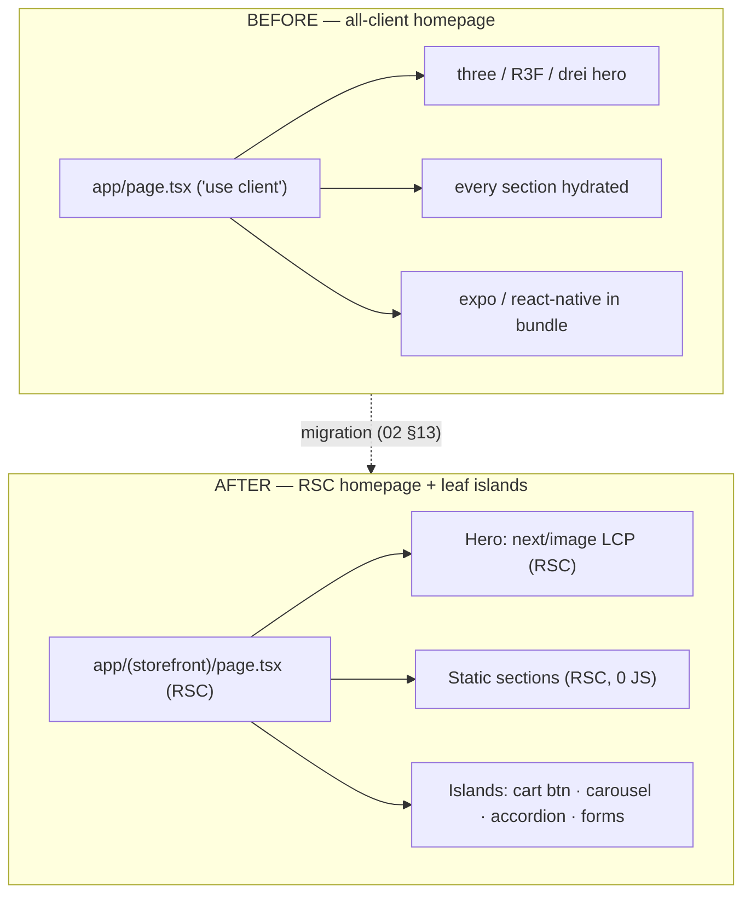
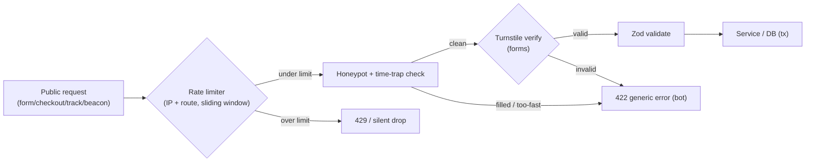
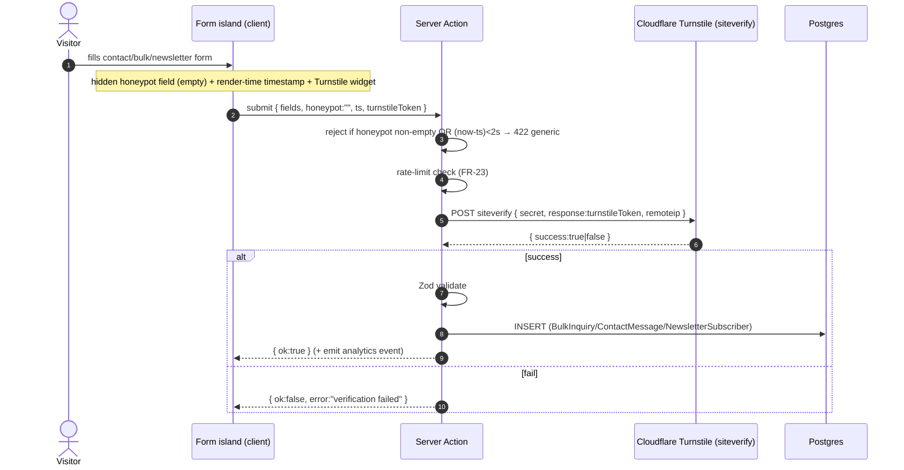
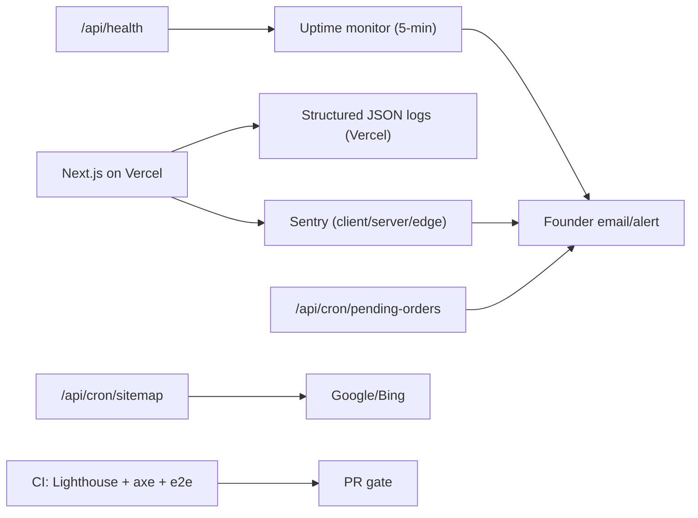
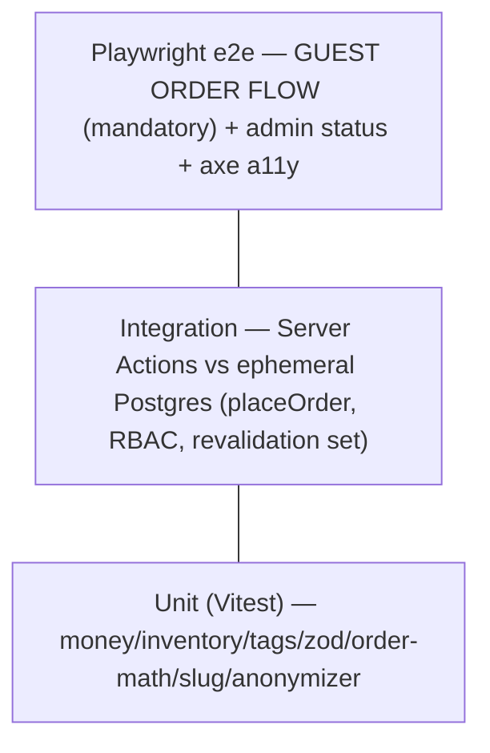
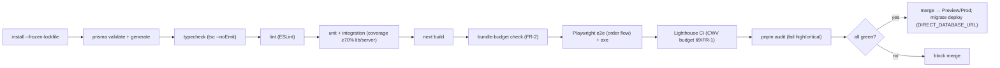

# 16 — Non-Functional Requirements (Performance, Security, A11y, Reliability)

> **Project:** `vaani-gift-e-commerce` · **Brand:** GooglyWoogly Art · **Founder/CEO:** Vanshika Bhatia · **Base:** Jaipur, Rajasthan, India · **Domain:** `googlywoogly.art`
> **Owner perspective:** Architect (NFR / SRE / Security / Accessibility) · **Conforms to:** [`00-canonical-decisions.md`](./00-canonical-decisions.md) (CANON).
> **Layers on top of:** `02-system-architecture` (security posture §15, cost envelope §16, env vars §12), `03-data-model` (PII fields, audit, retention Open Q-6), `09-seo-rendering-isr` (CWV budget §9, image strategy §7). Where those docs *named* a control, this doc *quantifies and operationalizes* it. Where this doc decides something not fixed in CANON, the decision is stated inline and surfaced under **§11 Open Questions**.
> **This is the cross-cutting quality contract** for every other spec. It is the single place an engineer or auditor finds: the performance budgets, the security controls, the accessibility bar, the privacy/DPDP rules, the reliability/backup posture, the observability stack, the testing strategy, CI/CD gates, and the Definition of Ready / Definition of Done that *every* feature PR must satisfy.

---

## 1. Purpose & Scope

### 1.1 What this document covers

1. **Performance budgets & Core Web Vitals** — quantified LCP/INP/CLS/TTFB/FCP targets (field + lab), per-route-family JS byte budgets, the **image & font strategy**, and the **bundle-discipline remediation of the current all-client homepage** (the v0 prototype ships `app/page.tsx` as `"use client"` with `three`/R3F/Expo/React-Native dead weight — §4 is the explicit cut list).
2. **Accessibility** — **WCAG 2.1 Level AA** conformance target; keyboard navigation, focus management, ARIA, reduced-motion, target sizes, and a **computed contrast audit of the existing pink/playful theme** with the exact token remediations (§5).
3. **Security** — admin auth hardening, RBAC, **rate-limiting** (order placement, `/track`, inquiry/contact/newsletter forms, analytics collector), input validation, **OWASP Top-10 (2021)** mapping, **spam/bot protection on public forms (honeypot + Cloudflare Turnstile)**, secrets management, security headers/CSP, and the **revalidation webhook secret** (§6).
4. **Privacy** — PII minimization, **India DPDP Act 2023** (consent, purpose limitation, retention, erasure, grievance), cookie policy, and analytics privacy posture (§7).
5. **Reliability** — Postgres backup/PITR, media durability, **idempotency** (order placement, analytics ingest, email, revalidate/cron), graceful degradation, and the error-budget / SLO sheet (§8).
6. **Observability** — structured logging, **Sentry** error tracking, uptime monitoring, **SEO health monitoring**, and operational alerting to the founder (§8.5–§8.8).
7. **Testing strategy** — unit, integration, **Playwright e2e for the guest order flow**, accessibility tests, the **CI/CD pipeline & gates**, and the **Definition of Ready / Definition of Done** (§9).
8. **Browser support matrix & i18n readiness** (§10).

### 1.2 What this document explicitly does NOT cover

- **Feature behaviour, copy, and UX** of individual pages — owned by `05`–`15`. This doc sets the *quality bar* those pages are measured against, not their content.
- **The caching/ISR machinery and SEO tactics** — owned by `02` §7 and `09`. This doc *consumes* the CWV budget `09` §9 defines and adds the byte budgets, font strategy, and the homepage-bundle remediation.
- **Field-level schema** — owned by `03`. Referenced by name only (PII fields, `AuditLog`, retention).
- **Notification/email content & DLT/WhatsApp flows** — owned by `14`. This doc covers email *deliverability/reliability/idempotency* and `NotificationLog`, not template copy.
- **On-site payments, shopper auth, product variants, multi-currency** — **out of scope by CANON §3**. Security posture is *smaller by construction* because there is no card data, no payment webhook, and no shopper credential store (§6.1).

---

## 2. Primary user stories / jobs-to-be-done

| # | As a… | I want… | so that… |
|---|---|---|---|
| JTBD-1 | **Shopper on a ₹8k Android over 4G** | every storefront page to paint its main image fast, become interactive immediately, and never jump around | I don't bounce; I browse and buy a handmade gift from my phone in under two minutes. |
| JTBD-2 | **Shopper using a screen reader / keyboard only** | to navigate the catalog, add to cart, and place an order without a mouse, with everything announced | I can shop independently regardless of ability (and the brand meets its legal/ethical accessibility duty). |
| JTBD-3 | **Founder (Vanshika)** | the admin to be hard to break into, rate-limited against abuse, and to log who changed what | one person's command center is safe even though it controls the whole business. |
| JTBD-4 | **Founder (Vanshika)** | spam bots kept out of the contact/bulk/checkout forms and a daily heads-up if anything is broken or an order is stuck | my inbox isn't junk, and I learn about an outage from a notification, not an angry customer. |
| JTBD-5 | **Customer who placed an order** | my name/phone/address handled minimally, kept only as long as needed, and deletable on request | I trust this micro-brand with my data and my DPDP rights are honoured. |
| JTBD-6 | **Engineer shipping a feature** | one checklist (DoR/DoD) and an automated CI gate that blocks regressions in types, lint, a11y, and the order-flow e2e | I ship confidently and never break checkout or leak a secret. |
| JTBD-7 | **Future SRE / on-call** | backups, idempotent writes, SLOs, structured logs, and Sentry alerts | I can restore data, diagnose an incident, and meet a recovery objective. |
| JTBD-8 | **Search engine / growth** | the site to stay CWV-green and structurally healthy, with a monitor that pages me when indexing breaks | rankings and rich results don't silently rot. |

---

## 3. Detailed functional requirements (non-functional, made testable)

> Numbered, decisive. **"MUST"** = required for MVP unless tagged `[V1]`/`[V2]`. Every requirement is written so a reviewer can pass/fail it. Cross-cutting acceptance is consolidated in §9 (DoD) and §12 (AC).

### 3.1 Performance & Core Web Vitals

- **FR-1 — CWV field budget (p75, mobile, CrUX/Vercel).** Storefront routes MUST meet **LCP ≤ 2.5 s, INP ≤ 200 ms, CLS ≤ 0.1, TTFB ≤ 0.8 s, FCP ≤ 1.8 s** (CANON green; `09` §9.1). Hard ceilings (never exceed in lab): LCP 4.0 s, INP 500 ms, CLS 0.25, TTFB 1.8 s. These are gates, not aspirations.
- **FR-2 — JS transfer budget per route family.** Compressed first-load JS MUST stay within: **PDP/PLP ≤ 120 KB**, **home ≤ 130 KB**, content/legal ≤ 90 KB, checkout ≤ 140 KB, cart ≤ 110 KB (gzip/br, route-level, excluding image bytes). Enforced by `@next/bundle-analyzer` in CI and a `size-limit`-style budget check (§9.4).
- **FR-3 — RSC-by-default; islands only.** Per `02` FR-2, `"use client"` is permitted **only on leaf interactive islands**. The **current `app/page.tsx` `"use client"` homepage MUST be converted to an RSC** whose interactive children (carousel, marquee, add-to-cart, forms, mobile-nav) are the only client components (§4.2). No route component is a client component.
- **FR-4 — Dead-weight removal (bundle hygiene).** The 3D hero stack and mobile-app dependencies are **removed** before launch: `three`, `@react-three/fiber`, `@react-three/drei`, `expo`, `expo-asset`, `expo-file-system`, `expo-gl`, `react-native`, and the `hero-3d-scene.tsx` / `floating-3d-gift.tsx` components (§4.1). The hero becomes a Cloudinary `next/image` LCP image. *(Decision; `02` Open Q-5 — see §11 OQ-1.)*
- **FR-5 — Image optimization ON.** `next.config.mjs` MUST remove `images.unoptimized`, enable `formats:["image/avif","image/webp"]`, whitelist `res.cloudinary.com` (+ `images.unsplash.com` dev-only) under `remotePatterns`, and use a custom Cloudinary `next/image` loader (`09` §7.2). **Every** image uses `next/image` with explicit `width`/`height` (or `fill` + aspect box) and a `sizes` attribute. CLS contribution from images = 0.
- **FR-6 — LCP discipline.** Exactly **one** prioritized LCP image per route (`priority`/`fetchPriority="high"`): home hero, PDP primary, PLP first card, category/collection hero. No above-the-fold client data-fetch waterfall. `preconnect` to `res.cloudinary.com` is emitted in `<head>`.
- **FR-7 — Font strategy.** Fonts MUST be loaded via **`next/font`** (self-hosted, `display:"swap"`, automatic `size-adjust` fallback metrics), subset to `latin`, preloaded for the two brand families (`Quicksand` body, `Playfair Display` display). **No** runtime Google Fonts `<link>` (privacy + perf). At most **2 families × 2 weights** shipped; additional weights are `[reject by default]`.
- **FR-8 — Streaming & code-split.** Each async catalog/content route ships a `loading.tsx` skeleton matching final dimensions; below-the-fold/secondary islands (recommendations rail, Instagram strip, testimonials carousel) are `next/dynamic` (lazy, `ssr:false` only where they need browser APIs). Icon imports are tree-shaken (named `lucide-react` imports, never the barrel).
- **FR-9 — `next.config` build hygiene.** `typescript.ignoreBuildErrors` MUST be removed; `eslint.ignoreDuringBuilds` MUST NOT be set. The build fails on type/lint errors (§9.3). *(The current config has `ignoreBuildErrors:true` + `images.unoptimized:true` — both removed.)*
- **FR-10 — No render-blocking third parties.** The storefront ships **no** GTM, no chat widget, no marketing pixel, no A/B SDK. The only client beacons are the first-party analytics collector (batched, `sendBeacon`) and Vercel Analytics (CWV-only) (`09` §9.2; DPDP §7). Turnstile (§6.6) loads **only** on form routes, deferred.

### 3.2 Accessibility (WCAG 2.1 AA)

- **FR-11 — Conformance target.** The storefront and the customer-facing transactional surfaces (cart, checkout, order-confirmed, track) MUST meet **WCAG 2.1 Level AA**. The admin app targets AA **best-effort** (single-operator internal tool) with keyboard operability and visible focus as hard requirements (§5.7).
- **FR-12 — Contrast.** All text and meaningful non-text UI (icons conveying state, focus rings, form borders) MUST meet AA contrast: **≥ 4.5:1** normal text, **≥ 3:1** large text (≥ 24 px, or ≥ 18.66 px bold) and non-text UI. The **pink/playful theme tokens that currently fail MUST be remediated per §5.2** (notably white-on-`#FF8FAB` at **2.15:1** and the `#FF8FAB` focus ring at **2.07:1**).
- **FR-13 — Keyboard operability.** Every interactive element is reachable and operable by keyboard in a logical order; no keyboard trap (WCAG 2.1.1/2.1.2). A **skip-to-content** link is the first focusable element. Dialogs/drawers/menus (Radix) trap focus while open and restore it on close. Custom carousels expose arrow-key + prev/next button control.
- **FR-14 — Visible focus.** A **`:focus-visible`** indicator with **≥ 3:1** contrast against adjacent colors and a ≥ 2 px outline is present on every focusable element. The browser default outline is never removed without a compliant replacement.
- **FR-15 — Semantics & ARIA.** Landmarks (`header`/`nav`/`main`/`footer`), one `h1` per page with a correct heading order, `nav[aria-label]` on each nav (incl. `aria-label="Breadcrumb"` + `aria-current="page"` consistent with the JSON-LD trail, `09` §13). Forms use real `<label>`s, `aria-invalid` + `aria-describedby` error wiring (react-hook-form + Zod), and an `aria-live` region for async submit feedback. Decorative images get `alt=""`; content images get `ProductImage.alt`/`MediaAsset.alt` (`03`).
- **FR-16 — Reduced motion & no motion-only info.** `prefers-reduced-motion: reduce` MUST disable or dampen framer-motion entrance animations, the marquee, and any parallax (WCAG 2.3.3). No information is conveyed by motion or color alone (e.g. stock state shows text + icon, not just a colored dot).
- **FR-17 — Target size & zoom.** Interactive targets are **≥ 44 × 44 px** (mobile primary actions) / ≥ 24 px minimum (WCAG 2.5.8). The viewport meta MUST allow zoom: **remove `maximumScale` / set `userScalable` true** (the current `maximumScale:5` is acceptable but `user-scalable=no` is forbidden; we set `maximumScale: 5` and never `1`). Content reflows to 320 px CSS width with no horizontal scroll (WCAG 1.4.10).
- **FR-18 — Forms & errors.** Validation errors are programmatically associated, announced, and provide text (not color-only) guidance; required fields use `required` + `aria-required`; the submit button reflects busy state via `aria-busy`. Country/state use a labelled `<select>` (Indian states/UTs, CANON §11).

### 3.3 Security

- **FR-19 — Admin auth hardening.** Auth.js (NextAuth v5) Credentials + **bcrypt (cost ≥ 12)** against `AdminUser.passwordHash` (`02` FR-19). JWT sessions (HTTP-only, `Secure`, `SameSite=Lax`) signed by `AUTH_SECRET`, **8-hour** max age with rolling refresh; logout invalidates client session. A **minimum password policy** (≥ 12 chars, breached-password rejection via a local zxcvbn-style strength check) is enforced on admin creation/reset. **Login throttling**: ≥ 5 failed attempts per email/IP in 15 min → exponential backoff/lockout (§6.4). `AdminUser.isActive=false` blocks sign-in immediately.
- **FR-20 — Defense-in-depth gate.** `middleware.ts` protects `/admin/**` (except `/admin/login`) **and** every admin Server Action re-checks the session server-side via `requireAdmin(role?)` (`02` FR-21). Middleware is never the sole gate.
- **FR-21 — RBAC.** `AdminRole` (`owner` > `admin` > `staff`) is enforced in services/actions. Destructive/sensitive ops — settings, admin-user management, hard deletes, audit-log access — are **`owner`/`admin` only**; `staff` is read + order-status/content edits. Every authorization decision is server-side.
- **FR-22 — Input validation at every boundary.** **Zod** validates every Server Action input, Route Handler body/query, and env (`lib/env.ts`) (`02` FR-22). The server is the trust boundary: `placeOrder` **recomputes prices/totals from the DB** and never trusts client-sent money (`02` §15, `08`). All rich text (product description, CMS `bodyRich`, FAQ answers) is **sanitized** server-side (allow-list HTML, e.g. `sanitize-html`/DOMPurify-server) before storage and on render; JSON-LD escapes `<` (`09` §5).
- **FR-23 — Rate limiting (abuse control).** The following are rate-limited (sliding window, keyed by IP + route; durable store `[V1]` Upstash/Vercel KV, in-memory/edge guard for MVP — `02` §15):

  | Surface | MVP limit (per IP) | Action on breach |
  |---|---|---|
  | `placeOrder` (checkout) | 10 / 10 min, 30 / day | `429` + "Too many attempts, try again shortly" (cart preserved) |
  | `submitContact` / `submitBulkInquiry` | 5 / 10 min | `429` + form error |
  | `subscribeNewsletter` | 5 / hour | silent success (no enumeration) |
  | `/track/[token]` (token probing) | 30 / min | `429`; generic 404 body (no existence leak) |
  | `/api/analytics/collect` | 60 / min (burst 120) | drop silently (`204`) |
  | `/api/revalidate` | 20 / min | `401`/`429` |
  | `/admin/login` | 5 / 15 min/email+IP | lockout/backoff (FR-19) |

- **FR-24 — Spam / bot protection on public forms.** All public forms (contact, bulk inquiry, newsletter, and the checkout submit) MUST carry **(a)** a **honeypot** hidden field (`company_website` or similar, CSS-hidden + `aria-hidden`, `tabindex=-1`) rejected server-side if filled, **(b)** a **time-to-submit** check (reject < 2 s as bot), and **(c)** **Cloudflare Turnstile** (privacy-friendly CAPTCHA) — token rendered client-side, **verified server-side** in the Server Action via the Turnstile `siteverify` API before any write. Turnstile is **MVP for contact/bulk** and `[V1]`-toggleable for newsletter/checkout (kept low-friction; see §6.6 + OQ-5).
- **FR-25 — Secrets management.** Every secret lives **only** in Vercel Environment Variables (Prod/Preview/Dev scopes) / git-ignored `.env`; a committed `.env.example` documents all keys (CANON §10, `02` §12). **Only `NEXT_PUBLIC_*` is browser-exposed** and nothing secret carries that prefix. `CLOUDINARY_API_SECRET`, `AUTH_SECRET`, `RESEND_API_KEY`, DB URLs, `REVALIDATE_SECRET`, `CRON_SECRET`, `TURNSTILE_SECRET_KEY` are server-only. The app **fails fast at boot** if a required var is missing (typed `lib/env.ts`). Secrets are **rotated** on suspected exposure and at least annually (owner runbook §6.8).
- **FR-26 — Endpoint secrets.** `/api/revalidate` is gated by `REVALIDATE_SECRET` (header/body, Zod-validated; **this is the "revalidation webhook secret"** the founder asked about — `02` FR-15, `09` §6.5). `/api/cron/*` is gated by `CRON_SECRET` (`Authorization: Bearer`). `/api/analytics/collect` enforces an **origin/Referer allow-list** + rate limit. Missing/invalid secret → `401`, no detail leaked.
- **FR-27 — Security headers & CSP.** Responses set, via `next.config` headers / middleware: **HSTS** (`max-age=63072000; includeSubDomains; preload`), `X-Content-Type-Options: nosniff`, `Referrer-Policy: strict-origin-when-cross-origin`, `X-Frame-Options: DENY` (+ CSP `frame-ancestors 'none'`), `Permissions-Policy` (camera/mic/geolocation off), `X-DNS-Prefetch-Control: on`. A **Content-Security-Policy** is shipped (`default-src 'self'`; `img-src 'self' res.cloudinary.com data:`; `connect-src 'self' <sentry> vitals.vercel-insights.com challenges.cloudflare.com`; `frame-src challenges.cloudflare.com`; `script-src` with a nonce; `style-src 'self' 'unsafe-inline'`); **Report-Only in MVP, enforced in V1** (`02` §15 "CSP hardening V1"; OQ-4).
- **FR-28 — Token & enumeration hygiene.** `trackingToken` = 24+ char nanoid (CANON §10), the sole authz to `/track` and `/order/confirmed`; invalid/expired token → **generic 404 with no existence signal** (`09` §10.4). `orderNumber` is non-secret and never grants access. No sequential identifiers in any URL or response that gates data.
- **FR-29 — Transport & CSRF.** HTTPS-only (Vercel-enforced; HSTS). Next.js Server Actions carry built-in origin checks; Route Handlers that mutate verify same-origin / secret. Cookies are `Secure` + `SameSite=Lax` (admin) — sufficient given no cross-site state-changing GET exists.
- **FR-30 — Dependency & supply-chain hygiene.** CI runs `pnpm audit` (fail on **high/critical**) and Dependabot/Renovate `[V1]` keeps deps patched. The dead-weight removal (FR-4) also shrinks the attack surface. `pnpm-lock.yaml` is committed and `--frozen-lockfile` is used in CI.

### 3.4 Privacy & DPDP

- **FR-31 — PII minimization & purpose limitation.** The only PII collected is what the order/lead flow needs: `customerName`, `customerPhone`, `customerEmail`, `shippingAddress`/`billingAddress` (Order); name/phone/email/message (BulkInquiry, ContactMessage); `email` (NewsletterSubscriber). **No** shopper passwords, no card data, no precise geolocation, no behavioural profiling beyond first-party funnel analytics (`02` FR-29). Each field has a stated purpose (order fulfilment / WhatsApp coordination / transactional email / consented marketing).
- **FR-32 — Consent.** Forms that create a marketing relationship (newsletter; the "keep me updated" checkbox) require an **explicit, unticked opt-in** with a link to the Privacy Policy; consent timestamp is the `subscribedAt`/row `createdAt` (`03`). Transactional email tied to an order needs no separate consent (legitimate fulfilment). A **cookie/consent notice** is shown (§7.4): a non-blocking banner stating first-party analytics + essential cookies only, with a link to the Cookie Policy.
- **FR-33 — Retention.** Retention windows (configurable; recommended defaults, OQ-2 / `03` Open Q-6): **raw `AnalyticsEvent` 18 months** then pruned by cron `[V1]`; `AnalyticsSession` 18 months; `DailyMetricRollup` **indefinite** (aggregate, non-PII); **closed leads** (`BulkInquiry`/`ContactMessage` in a terminal status) 24 months then anonymized; **Orders** retained for **8 years** (Indian tax/accounting norm) — but PII within is purgeable on request (FR-34). `NotificationLog`/`AuditLog` 24 months.
- **FR-34 — Right to erasure / correction (DPDP Data Principal rights).** An **admin action `eraseCustomerData(customerId)`** MUST anonymize `Customer` PII and the contact snapshot on its `Order`s (name→"Deleted", phone/email→hashed tombstone, address→null), **retaining** the financial/line records (`OrderItem` snapshot, totals) for legal/accounting with FKs `SetNull` (`03` §3.6, §7). The action writes `AuditLog`. A documented **manual SLA of ≤ 30 days** to honour a verified deletion/correction request (DPDP). Newsletter unsubscribe sets `isActive=false` + `unsubscribedAt` and is honoured immediately and irreversibly for marketing.
- **FR-35 — Privacy-by-design in analytics.** `AnalyticsEvent.visitorId` is a **first-party, hashed/opaque** id (no name/email/phone in events, `03` §7); IP is used transiently for geo/rate-limit and **not stored raw**; `country` (coarse) is stored, precise location is not. No third-party tracker, no cross-site cookie, no data sale (`02` FR-29).
- **FR-36 — Legal pages & grievance.** The CANON legal set MUST exist and be published (`15`): **Privacy Policy** (DPDP-compliant: data collected, purposes, retention, rights, **Grievance Officer** name + contact, consent), **Terms**, **Shipping & Delivery**, **Cancellation & Refund**, **Contact**, plus **Cookie Policy**. The Privacy Policy names a grievance contact (DPDP requirement) sourced from `SiteSetting.contactEmail`/`businessAddress`.
- **FR-37 — PII in logs & errors.** Sentry and structured logs **scrub PII** (name/phone/email/address/token) via `beforeSend` and a redaction allow-list; `AuditLog.before/after` snapshots are **PII-redacted** (`03` FR-37). No PII in URLs, query strings, or analytics `metadata`.

### 3.5 Reliability

- **FR-38 — Postgres durability & recovery.** The managed Postgres (Neon) MUST have **automated daily backups + point-in-time restore (PITR)** enabled; **RPO ≤ 24 h** (MVP free tier) / **≤ 1 h** target `[V1]` on a paid branch; **RTO ≤ 4 h**. A **quarterly restore drill** verifies backups are recoverable (runbook §8.4). All multi-row writes are **transactional** (Prisma `$transaction`); no partial writes (`02` §10).
- **FR-39 — Media durability.** Cloudinary is the durable media store + CDN; `MediaAsset.publicId` is persisted so any derivative can be re-generated and an asset re-located (`03`). Source images SHOULD additionally exist in the founder's own storage (Cloudinary is not the sole copy of originals) — a documented expectation, not enforced.
- **FR-40 — Idempotency.** Writes that can be retried MUST be idempotent:
  - **`placeOrder`** uses a client-generated **idempotency key** (UUID minted at checkout mount, sent with the action); a repeat with the same key returns the existing `{orderNumber, trackingToken}` instead of creating a duplicate (covers double-submit / retry). `orderNumber` sequencing uses the `Counter` row inside the txn (gap-free, `03` FR-33).
  - **Analytics collector** dedups by client event id within session (`02` §9).
  - **Email send** is keyed to `(orderId, template)` so a retry doesn't double-send; `NotificationLog` records the attempt (`02` FR-24).
  - **`/api/revalidate`** and **cron** are naturally idempotent (re-running re-busts/re-aggregates the same date).
- **FR-41 — Graceful degradation.** Per `02` §10: cached storefront pages keep serving if the DB is briefly unreachable; uncached/SSR routes render an `error.tsx` boundary + Sentry alert; **order placement never silently loses the cart** (retryable error returned, client cart intact); email/SMS/WhatsApp failures never block order placement (`NotificationLog.status='failed'`, founder still has the WhatsApp CTA). Every async route has `error.tsx` + `not-found.tsx`.
- **FR-42 — Single-writer correctness.** Concurrent inventory edits vs. orders: MVP does **not** auto-decrement stock on placement (founder confirms availability on WhatsApp — `02` Open Q-1); `placeOrder` only *validates* against current stock. If/when decrement is enabled `[V1]`, it is guarded (`UPDATE … WHERE inventoryQuantity >= qty`, 0-rows → out-of-stock, `03` §7).

### 3.6 Observability

- **FR-43 — Error tracking.** **Sentry** is wired for **client + server + edge** (`instrumentation.ts`), source maps uploaded on Vercel build, **releases tagged** to the Git SHA, PII scrubbed (FR-37). Unhandled errors and explicit `captureException` in catch blocks of Server Actions/Route Handlers/cron are reported. **Alerting**: new-issue + error-rate-spike alerts to the founder's email (and `[V1]` a webhook). Event sampling protects the free quota.
- **FR-44 — Structured logging.** Server logs are **structured JSON** (`{ level, msg, route, action, requestId, durationMs, …non-PII }`) via a tiny `lib/logger.ts`; no `console.log` of PII; correlate with a per-request id. Logs are queryable in Vercel; errors mirror to Sentry.
- **FR-45 — Uptime & synthetic monitoring.** An external uptime monitor (UptimeRobot/Better Uptime free tier) pings **`/` (200)**, **`/api/health`** (a lightweight liveness route returning DB-reachable + build SHA), and a representative PDP every **5 min**; downtime/SSL-expiry alerts the founder. Vercel deployment failures alert via the Vercel/GitHub integration.
- **FR-46 — SEO health monitoring.** Beyond Search Console (post-launch, `09`): the nightly `/api/cron/sitemap` validates the sitemap builds and pings search engines (`09` §8.1); a `[V1]` weekly synthetic checks a sample of canonical/`noindex`/JSON-LD/`robots.txt` invariants and alerts on drift (e.g. a PDP accidentally `noindex`, a broken canonical, missing `Product` JSON-LD). Lighthouse CI (FR-49) guards CWV on every PR.
- **FR-47 — Operational digests.** The daily `/api/cron/pending-orders` emails the founder a digest of **stale `pending_confirmation` orders** + **low-stock** products (`02` §14.2). Funnel/KPI health is the in-house analytics dashboard (`13`).

### 3.7 Testing, CI/CD & process

- **FR-48 — Test pyramid.** **Unit tests (Vitest)** for pure logic — `lib/money.ts` (paise codec), `lib/inventory.ts` (`inventoryState` derivation incl. MTO), `lib/cache/tags.ts`, Zod schemas, order-total math, `orderNumber` formatting, slug generation, the DPDP anonymizer. **Integration tests** for critical Server Actions against an ephemeral Postgres (`placeOrder` happy/price-changed/out-of-stock/idempotent-retry; `updateProduct` revalidation set; `requireAdmin` RBAC). Coverage gate: **≥ 70%** on `lib/` and `server/` (statements), enforced in CI.
- **FR-49 — Playwright e2e for the order flow (mandatory).** A **Playwright** suite MUST cover the **guest purchase critical path** end-to-end on a seeded DB: browse PLP → open PDP → add to cart → cart survives reload → checkout (contact + Indian address, honeypot empty, Turnstile bypass token in test mode) → place order → confirmation page shows `orderNumber` + WhatsApp CTA → `/track/[token]` renders the timeline. Plus: out-of-stock blocks add-to-cart; made-to-order is orderable; price-changed-at-checkout shows the review prompt; admin login → change order status → email logged (`NotificationLog`). e2e runs in CI on a Preview deploy (or `next start` + seeded DB) and **blocks merge on the order-flow specs**.
- **FR-50 — Accessibility tests.** Automated a11y assertions (`@axe-core/playwright`) run against home, PLP, PDP, cart, checkout, and a content page; **zero serious/critical violations** is a merge gate. Automated checks are supplemented by a **manual keyboard + screen-reader pass** on the checkout flow each release (DoD §9.6).
- **FR-51 — CI/CD pipeline & gates.** On every PR/push, CI MUST run, in order, and **block merge on failure**: `pnpm install --frozen-lockfile` → `prisma validate` + `prisma generate` → **typecheck** (`tsc --noEmit`) → **lint** (ESLint) → **unit + integration** (with coverage gate) → **build** (`next build`) → **bundle-budget** check (FR-2) → **Playwright e2e** (order flow + axe) → **Lighthouse CI** (CWV budget §9, FR-1) → `pnpm audit` (high/critical). `master` → Production; PRs → Preview (`02` §14.1). DB migrations apply via `prisma migrate deploy` using `DIRECT_DATABASE_URL` in the release step.
- **FR-52 — Definition of Ready / Definition of Done.** Every feature ticket MUST satisfy the **DoR** before work starts and the **DoD** before merge (§9.6). DoD is non-negotiable: types/lint/tests/a11y/perf budgets green, security checklist applied, analytics events wired, revalidation tags correct, docs/AC updated.

### 3.8 Browser support & i18n readiness

- **FR-53 — Browser support.** Support the **last 2 versions** of Chrome, Edge, Firefox, Safari (desktop + iOS/Android), and **Samsung Internet** (high India share); **Android Chrome on mid-range devices is the primary target** (CWV measured there). No IE11. Graceful enhancement: core browse/checkout works without JS-heavy enhancements (RSC HTML renders; cart/checkout require JS, which is acceptable and announced).
- **FR-54 — i18n readiness (no i18n shipped).** Single locale **`en-IN`** (CANON §11): `<html lang="en-IN">`, `Intl.NumberFormat("en-IN",{style:"currency",currency:"INR"})`, IST display via `lib/datetime.ts`, all money in integer paise. User-facing strings SHOULD be authored so a future locale layer is additive (no hard-coded concatenated sentences mixing data + copy where avoidable); **no translation framework in MVP** (`09` §10.5). Hindi/multi-currency is V2.

---

## 4. Bundle discipline — trimming the all-client homepage (the concrete remediation)

> The founder explicitly flagged "trim the all-client homepage." This section is the **prescriptive cut list** for the v0 prototype, executed during the `02` §13 migration. It is the single biggest CWV/INP win available.

### 4.1 What ships today vs. the target

| Today (v0 prototype) | Problem | Target |
|---|---|---|
| `app/page.tsx` is `"use client"` with `useEffect` opacity gate | Whole homepage hydrates as one client tree; no RSC; blocks INP/TBT | RSC `app/(storefront)/page.tsx`; opacity-gate removed (use CSS/streaming) |
| **59** files carry `"use client"` (incl. every section component) | Sections that are static marketing become client JS | Section components are **RSC**; only islands keep `"use client"` |
| `three` `0.182.0` + `@react-three/fiber` + `@react-three/drei` | ~heavy 3D runtime for a decorative hero; huge JS + main-thread cost | **Removed** (`hero-3d-scene.tsx`, `floating-3d-gift.tsx` deleted) |
| `expo`, `expo-asset`, `expo-file-system`, `expo-gl`, `react-native` | React-Native/Expo deps in a **web** Next.js app — pure dead weight | **Removed** from `package.json` |
| `images.unoptimized:true`, `ignoreBuildErrors:true` | No image optimization; type errors hidden | Both removed (FR-5, FR-9) |
| `<html lang="en">` | Wrong locale signal (should be `en-IN`) | `<html lang="en-IN">` (FR-54, `09` FR-23) |
| `viewport.maximumScale: 5` | OK, but verify never `user-scalable=no` | Keep zoomable (FR-17) |

### 4.2 RSC vs. client-island split for the homepage

| Homepage section | Server (RSC) | Client island (`"use client"`) | Notes |
|---|---|---|---|
| Navbar | shell (links, logo) RSC | mobile-menu toggle, search-open, cart-count badge | cart badge reads client cart store |
| Marquee / announcement | RSC (text from `SiteSetting`) | only if animated; pause on `prefers-reduced-motion` | reserve height (CLS) |
| Hero | **RSC** (`next/image` LCP, copy, CTAs) | — | **replaces 3D scene**; `priority` image |
| Features / Process / About / "story" | **RSC** | — | static marketing → zero JS |
| Categories grid | **RSC** | — | links only |
| Featured products / bestsellers | **RSC** (data from services, tagged `home`/`products`) | per-card **Add-to-cart** button island | rail is server-rendered; only the button hydrates |
| Testimonials carousel | RSC list + | carousel island (embla) | lazy via `next/dynamic` |
| Instagram strip | RSC | lazy island if it needs JS | below fold, `dynamic` |
| FAQ accordion | RSC content + | Radix accordion island | content crawlable |
| Newsletter / Contact / Custom-order forms | RSC shell | **form island** (react-hook-form + Zod + Turnstile + honeypot) | §6.6 |
| Footer | **RSC** | — | links from `SiteSetting`/`nav` |

> **Outcome:** the homepage becomes mostly static HTML streamed from the edge; the only JS is the navbar interactivity, add-to-cart buttons, one carousel, the FAQ accordion, and the form islands — comfortably inside the 130 KB budget (FR-2) and removing the 3D/RN main-thread cost that wrecks INP.

---

## 5. Accessibility — pink/playful theme contrast audit & remediation

> Computed with the WCAG 2.x relative-luminance formula against the **actual tokens** in `app/globals.css`. This is the decisive, numeric audit the founder asked for. **Bold rows fail AA and MUST be remediated.**

### 5.1 Audit of current tokens (light theme)

| Pairing (token usage) | Foreground | Background | Ratio | AA normal (4.5) | AA large/non-text (3.0) | Verdict |
|---|---|---|---:|:--:|:--:|---|
| **Primary button / CTA text** | `#FFFFFF` | `--primary #FF8FAB` | **2.15:1** | ✗ | ✗ | **FAIL — primary brand action unreadable** |
| **Focus ring on white** | `--ring #FF8FAB` | `#FFFFFF` | **2.07:1** | n/a | ✗ | **FAIL — focus indicator (WCAG 1.4.11)** |
| **Form border / input ring** | `#FF8FAB`/`--border #FFD6E0` | `#FFF9FB` | **~2.0:1** | n/a | ✗ | **FAIL — UI component contrast** |
| **Destructive button text** | `#FFFFFF` | `--destructive #FF6B6B` | **2.78:1** | ✗ | ✗ | **FAIL** |
| **Decorative pastel border** | `--pastel-pink #FFB3C6` | `#FFFFFF` | **1.68:1** | n/a | ✗ (if meaningful) | OK only if purely decorative |
| Primary text (dark on pink) | `#2D2D2D` | `#FF8FAB` | 6.41:1 | ✓ | ✓ | PASS (use dark text on pink fills) |
| Accent text on yellow | `#2D2D2D` | `--accent #FFE566` | 10.92:1 | ✓ | ✓ | PASS |
| Secondary text on mint | `#2D2D2D` | `--secondary #B8F4D0` | 11.08:1 | ✓ | ✓ | PASS |
| Body text | `--foreground #2D2D2D` | `--background #FFF9FB` | 13.24:1 | ✓ | ✓ | PASS |
| Muted text | `--muted-foreground #6B6B6B` | `#FFF9FB` | 5.12:1 | ✓ | ✓ | PASS (do not lighten further) |

### 5.2 Decisive remediation (keep the brand, fix the contrast)

The pink stays the brand color; we **split the pink into a decorative fill token and an accessible interactive token**, and fix white-on-pink everywhere it is text or a UI affordance.

| Issue | Fix (decisive) | Resulting ratio |
|---|---|---|
| White on `#FF8FAB` (CTA, primary button) | Introduce **`--primary-strong: #D6336C`** (deeper rose) for **interactive** primary surfaces with white text; keep `#FF8FAB` only as a **decorative fill** with **dark `#2D2D2D` text**. Default `Button` primary = `#D6336C` bg + white text. | white on `#D6336C` = **4.62:1** ✓ |
| `#FF8FAB` focus ring (2.07:1) | Set **`--ring: #D6336C`** (or a 2px `#9E1B4C` outline) for all `:focus-visible` | **≥ 3:1** ✓ (1.4.11) |
| Form borders/inputs too light | Use `#D6336C`/`#B83260` for input **focus** border and a ≥ 3:1 default border (darken `--border` for inputs to ≥ `#E59AB0` only where it conveys boundary) | ≥ 3:1 ✓ |
| Destructive white-on-`#FF6B6B` (2.78:1) | Darken destructive to **`#D92D20`** for solid buttons with white text (keep `#FF6B6B` for tints/icons on dark text) | white on `#D92D20` = **4.5:1** ✓ |
| Text links in pink | Link color **`#C92A60`** on white (5.27:1) — never `#FF8FAB` for body links | **5.27:1** ✓ |
| Dark-theme tokens | Re-audit dark theme with the same method before enabling a dark mode; **dark mode is not in MVP scope** — if shipped, gate it behind the same §5.1 audit (OQ-3) | — |

> **Rule of thumb encoded in the design system:** *light pink (`#FF8FAB`/pastels) = backgrounds & decoration with dark text; deep rose (`#D6336C`+) = interactive elements & focus with white text.* This preserves the playful palette while passing AA. shadcn/ui `Button`/`Input`/`Badge` variants are updated to consume the corrected tokens; the change is token-level (no per-component rewrite).

### 5.3 Non-color accessibility requirements (recap, testable)

| Requirement | Implementation | Verified by |
|---|---|---|
| Skip link | first focusable `<a href="#main">` in layout | axe + keyboard pass |
| Visible focus | global `:focus-visible` ring (≥3:1, ≥2px) | axe + manual |
| Keyboard nav | Radix primitives; carousel arrow-keys; no traps | Playwright keyboard test |
| Reduced motion | `@media (prefers-reduced-motion)` disables framer/marquee/parallax | manual + snapshot |
| Headings/landmarks | one `h1`/page, ordered headings, `header/nav/main/footer` | axe |
| Form a11y | `<label>`, `aria-invalid`, `aria-describedby`, `aria-live` errors | axe + manual |
| Alt text | `ProductImage.alt`/`MediaAsset.alt`; `alt=""` decorative | lint (no-missing-alt) + axe |
| Target size | ≥44px primary touch targets | manual/visual |
| Zoom/reflow | 320px reflow, no `user-scalable=no` | manual |

---

## 6. Security — controls, OWASP mapping & the spam/auth deep-dive

> Architecture posture is `02` §15; this section **quantifies** it and adds OWASP traceability + the Turnstile/honeypot flow + the secret runbook.

### 6.1 Why the attack surface is small by design

No on-site payment (no card data, no PCI scope, no payment webhook), no shopper accounts (no shopper credential store, no password-reset abuse, no account-takeover), no variants/multi-currency (less input surface). The **only** storefront writes are: order placement, the three lead forms, and the analytics beacon — all rate-limited, validated, and bot-protected. The high-value target is **`/admin`**, which is hardened per FR-19–FR-21.

### 6.2 OWASP Top-10 (2021) mapping

| OWASP risk | How it's addressed here |
|---|---|
| **A01 Broken Access Control** | `middleware.ts` + server-side `requireAdmin(role)` on every admin action (FR-20); RBAC `owner/admin/staff` (FR-21); token-only `/track` with no enumeration (FR-28); IDs never in URLs. |
| **A02 Cryptographic Failures** | HTTPS+HSTS (FR-27/29); bcrypt cost ≥12 (FR-19); secrets server-only, never `NEXT_PUBLIC_` (FR-25); `trackingToken` unguessable (FR-28). |
| **A03 Injection** | Prisma parameterized queries (no raw SQL on user input); Zod at every boundary (FR-22); rich-text sanitized + JSON-LD escaped (FR-22). |
| **A04 Insecure Design** | Trust boundary on server: `placeOrder` recomputes money from DB (FR-22); offline-payment design removes whole risk classes (§6.1); idempotency (FR-40). |
| **A05 Security Misconfiguration** | Build hygiene (no `ignoreBuildErrors`, FR-9); security headers + CSP (FR-27); fail-fast env validation (FR-25); admin `noindex` (`02` FR-22). |
| **A06 Vulnerable/Outdated Components** | `pnpm audit` CI gate (high/critical), frozen lockfile, Dependabot `[V1]`, dead-dep removal (FR-30/FR-4). |
| **A07 Identification & Auth Failures** | Login throttling/lockout (FR-19/FR-23); strong admin password policy; JWT signed, short-lived, HTTP-only (FR-19); no shopper auth to abuse. |
| **A08 Software & Data Integrity** | Signed Cloudinary uploads (secret server-side, `02` FR-17); secret-gated `/api/revalidate` + cron (FR-26); source-map/release integrity in Sentry (FR-43); lockfile. |
| **A09 Logging & Monitoring Failures** | Structured logs + Sentry (client/server/edge) + uptime + `AuditLog` on every admin mutation (FR-43–45, §8); alerting to founder. |
| **A10 SSRF** | No server-side fetch of user-supplied URLs; Cloudinary uploads are signed/scoped; outbound is to a fixed allow-list (Cloudinary/Resend/Sentry/Turnstile). |

### 6.3 Rate-limiting architecture

> **MVP store:** in-memory per-instance + edge-friendly counter (best-effort on serverless). **`[V1]`:** Upstash/Vercel KV for durable, cross-instance limits (`02` §16.3). Limits per FR-23.

### 6.4 Admin auth hardening (detail)

- bcrypt cost ≥ 12; JWT `maxAge` 8h, `updateAge` rolling; cookies `HttpOnly; Secure; SameSite=Lax`.
- Failed-login throttle (FR-23) + generic error ("invalid email or password" — no user-enumeration).
- Optional **TOTP 2FA for `owner`** is `[V1]` (recommended once revenue/staff grows; OQ-6).
- `lastLoginAt` recorded; `AuditLog` on auth-sensitive ops; session re-validated server-side per action.

### 6.5 The revalidation webhook secret (explicit)

`POST /api/revalidate` (Node) requires `REVALIDATE_SECRET` (Zod `{tags?,paths?,secret}`); tags are validated against the **closed taxonomy** (`09` §6.1) before busting; invalid/missing secret → `401` (`09` §6.5, `02` FR-15). Used by cron/sitemap and any future Cloudinary webhook; in-process Server Actions are the primary path and do **not** call it over HTTP.

### 6.6 Spam/bot protection on public forms (honeypot + Turnstile)

- **Honeypot**: a visually-hidden, `aria-hidden`, `tabindex=-1` input (`company_website`); any value ⇒ silent reject. Zero friction for humans/AT.
- **Time-trap**: submissions under 2 s from render ⇒ bot ⇒ reject.
- **Turnstile**: `NEXT_PUBLIC_TURNSTILE_SITE_KEY` client widget; `TURNSTILE_SECRET_KEY` server `siteverify`. **MVP on contact + bulk-inquiry** (highest spam/PII value); newsletter + checkout `[V1]`-toggleable to keep conversion friction low (OQ-5). Privacy-friendly (no behavioural tracking, DPDP-aligned) — preferred over reCAPTCHA.
- **Env added:** `NEXT_PUBLIC_TURNSTILE_SITE_KEY`, `TURNSTILE_SECRET_KEY` (additions to `02` §12 / CANON env list — OQ-7).

### 6.7 Security headers / CSP (concrete)

| Header | Value (MVP) |
|---|---|
| `Strict-Transport-Security` | `max-age=63072000; includeSubDomains; preload` |
| `X-Content-Type-Options` | `nosniff` |
| `Referrer-Policy` | `strict-origin-when-cross-origin` |
| `X-Frame-Options` / CSP `frame-ancestors` | `DENY` / `'none'` |
| `Permissions-Policy` | `camera=(), microphone=(), geolocation=(), interest-cohort=()` |
| `Content-Security-Policy` | `default-src 'self'; img-src 'self' res.cloudinary.com data:; script-src 'self' 'nonce-…' challenges.cloudflare.com va.vercel-scripts.com; style-src 'self' 'unsafe-inline'; font-src 'self'; connect-src 'self' *.ingest.sentry.io vitals.vercel-insights.com challenges.cloudflare.com; frame-src challenges.cloudflare.com; base-uri 'self'; form-action 'self'` — **Report-Only MVP → enforce V1** |

### 6.8 Secrets runbook (owner)

Store in Vercel env (scoped); never commit; `.env.example` documents keys; rotate on suspected exposure and ≥ annually; Cloudinary/Resend/Turnstile keys are revocable in their dashboards; `AUTH_SECRET` rotation invalidates sessions (acceptable for 1–2 admins). Required-var boot check (`lib/env.ts`) prevents shipping a misconfigured deploy.

---

## 7. Privacy & DPDP (India Digital Personal Data Protection Act, 2023)

### 7.1 Data inventory & purpose (record of processing)

| Data | Entity (CANON) | Purpose | Lawful basis | Retention (default) |
|---|---|---|---|---|
| Name, phone, email, address | `Order`, `Customer` | Order fulfilment + WhatsApp/email coordination | Performance of order (legitimate use) | Order 8y (tax); PII erasable on request (FR-34) |
| Name, phone, email, message | `BulkInquiry`, `ContactMessage` | Respond to enquiry | Consent/legitimate response | 24m after close, then anonymized |
| Email | `NewsletterSubscriber` | Marketing updates | **Explicit opt-in consent** | Until unsubscribe |
| Opaque `visitorId`, path, device, country, UTM | `AnalyticsEvent`/`Session` | First-party funnel analytics | Legitimate interest, PII-light | 18m, then prune `[V1]` |
| Email/phone (delivery), subject, status | `NotificationLog` | Deliverability/debug | Legitimate interest | 24m |

### 7.2 Principal rights (DPDP) → implementation

| Right | Implementation |
|---|---|
| **Consent** | Unticked opt-in for marketing; consent timestamp stored (FR-32); withdraw via unsubscribe (FR-34). |
| **Access/Correction** | Founder retrieves a Customer's orders from `/admin/customers`; correction via admin edit + `AuditLog`; SLA ≤ 30 days. |
| **Erasure** | `eraseCustomerData(customerId)` anonymizes PII, retains financial records (FR-34). |
| **Grievance** | Privacy Policy names a Grievance Officer + contact (FR-36). |
| **Data portability** `[V1]` | Export a customer's order history as JSON/CSV on request. |

### 7.3 Cross-border / processors

Sub-processors (Vercel, Neon, Cloudinary, Resend, Sentry, Cloudflare) are disclosed in the Privacy Policy; **region nearest India** is chosen for DB/functions (`02` §14.1) to keep latency low and data residency reasonable. No data sale; no advertising trackers (FR-35).

### 7.4 Cookie / consent notice

| Cookie/storage | Purpose | Type |
|---|---|---|
| `visitorId` (1st-party, localStorage/cookie) | analytics correlation (opaque) | analytics (1st-party) |
| Auth.js session cookie | admin auth only | strictly necessary |
| Cart (`localStorage`) | guest cart persistence | strictly necessary (functional) |

> A **non-blocking notice** discloses "first-party analytics + essential cookies only; no third-party ad trackers," with a Cookie Policy link. Because analytics is first-party, PII-light, and there are no ad/marketing cookies, a hard opt-in wall is **not** required, but the notice + policy are provided (DPDP transparency). A `[V1]` toggle can disable analytics on decline (OQ-2).

---

## 8. Reliability & Observability

### 8.1 SLOs / error budget

| Surface | SLO (rolling 30d) | Error budget | Notes |
|---|---|---|---|
| Storefront availability (`/`, PDP, PLP) | **99.9%** | ~43 min/mo | ISR cache keeps serving through brief DB/function blips (FR-41) |
| Order placement success (non-user-error) | **99.5%** | — | retryable, idempotent (FR-40) |
| Admin availability | 99.5% | — | internal tool |
| Transactional email delivered | **≥ 98%** | — | tracked via `NotificationLog`; WhatsApp is the backstop |
| CWV (p75 mobile, FR-1) | LCP ≤2.5s / INP ≤200ms / CLS ≤0.1 | — | Vercel Analytics field data |

### 8.2 Recovery objectives

| Objective | Target (MVP) | Target `[V1]` |
|---|---|---|
| **RPO** (Postgres) | ≤ 24 h (daily backup) | ≤ 1 h (PITR, paid branch) |
| **RTO** | ≤ 4 h | ≤ 1 h |
| Backup verification | quarterly restore drill | quarterly |
| Media (Cloudinary) | provider-durable + `publicId` re-derivation | + off-Cloudinary originals copy |

### 8.3 Failure-mode matrix (reliability)

| Failure | Behaviour | Alert |
|---|---|---|
| DB unreachable (storefront) | cached pages serve; SSR routes → `error.tsx`; cart preserved | Sentry + uptime |
| DB unreachable (admin) | error toasts; no partial writes (tx) | Sentry |
| Email provider down | order still placed; `NotificationLog.status='failed'`; WhatsApp CTA remains; retry `[V1]` | Sentry + digest |
| Cloudinary down (upload) | signed-upload fails; admin retries; no orphan `MediaAsset` | Sentry |
| Analytics collector overloaded | beacons dropped silently; no UX impact | (sampled) |
| Double-submit checkout | idempotency key returns same order | — |
| Revalidation bust missed | safety-net TTL (3600/86400) + cron backstop | — |
| Region/Vercel outage | static assets via CDN; dynamic degrades | uptime + Vercel status |

### 8.4 Backup & restore runbook (Postgres)

Neon automated backups + PITR enabled; **migrations** apply via `prisma migrate deploy` (`DIRECT_DATABASE_URL`) gated in the release step (never auto-applied destructively); a **pre-migration backup/branch** is taken for schema changes; **quarterly** the owner restores the latest backup to a scratch branch and runs the e2e smoke (FR-49) to prove recoverability. Seed (`prisma/seed.ts`) re-creates `AdminUser`, `SiteSetting`, `EmailTemplate`s for a clean environment.

### 8.5 Structured logging

`lib/logger.ts` emits JSON (`level, msg, route|action, requestId, durationMs, status`), **no PII** (FR-37). Server Actions/Route Handlers/cron log start/finish + error; correlate via `requestId`; errors also `captureException` to Sentry with the same `requestId` tag.

### 8.6 Sentry

Client + server + edge init (`instrumentation.ts`); releases tagged to Git SHA; source maps uploaded (`SENTRY_AUTH_TOKEN`); `beforeSend` PII scrub; sampling for free quota; alert rules (new issue, error-rate spike, crash-free drop) → founder email.

### 8.7 Uptime & health

`/api/health` (Node, fast): returns `{ ok, sha, db: <ping ms> }` (no secrets). External monitor pings `/`, `/api/health`, a sample PDP every 5 min; SSL-expiry + downtime alerts. Vercel + GitHub deploy-failure notifications.

### 8.8 SEO health monitoring

Nightly sitemap cron validates+pings (`09` §8.1); Lighthouse CI gates CWV per PR (FR-49); `[V1]` weekly synthetic asserts canonical/`noindex`/JSON-LD/`robots.txt` invariants on a sample and alerts on drift (FR-46). Google Search Console + Bing Webmaster connected post-launch.

---

## 9. Testing strategy, CI/CD & Definition of Ready/Done

### 9.1 Test pyramid (what, where)

### 9.2 Coverage of the order flow (the critical path — FR-49)

| Spec | Assertion |
|---|---|
| browse→PDP→add→cart-reload | cart persists across reload (localStorage) |
| checkout→placeOrder | order created; confirmation shows `orderNumber` + WhatsApp deep link; `/track/[token]` timeline renders |
| out-of-stock | add-to-cart disabled; "Notify on WhatsApp" |
| made-to-order | orderable; lead time shown |
| price-changed-at-checkout | per-line "price/stock updated, review & retry" |
| idempotent retry | same idempotency key ⇒ one order |
| honeypot/Turnstile (test mode) | honeypot filled ⇒ rejected; valid token ⇒ accepted |
| admin: login→status change | `OrderStatusEvent` + `NotificationLog` written; email logged |
| axe on home/PLP/PDP/cart/checkout | 0 serious/critical |

### 9.3 CI/CD pipeline (gates, in order)

### 9.4 Bundle budget enforcement

`@next/bundle-analyzer` report on PR; a CI budget check fails if any route's first-load JS exceeds FR-2 limits; the dead-dep removal (FR-4) and RSC split (FR-3) are the levers.

### 9.5 Definition of Ready (DoR) — a ticket may start when:

- [ ] User story + acceptance criteria written; conforms to CANON (names/enums/routes/tags).
- [ ] Affected entities/fields, Server Actions, **cache tags to revalidate**, and analytics events identified.
- [ ] UX/states enumerated (loading/empty/error/validation/out-of-stock/MTO/price-changed where relevant).
- [ ] Performance/a11y/security/privacy impact noted (this doc's relevant FRs referenced).
- [ ] Test approach decided (unit/integration/e2e/axe); seed/fixtures known.

### 9.6 Definition of Done (DoD) — a PR may merge when:

- [ ] **Types** (`tsc`), **lint**, **unit+integration** (coverage gate), **build** all green in CI.
- [ ] **Order-flow Playwright e2e** + **axe** specs pass; new UI added to a11y coverage.
- [ ] **CWV/bundle budgets** met (Lighthouse CI + bundle check); no new render-blocking 3rd party.
- [ ] **RSC-by-default** respected (no route is `"use client"`; islands only — FR-3); `next/image`+`sizes` on all images.
- [ ] **Accessibility**: keyboard path works; focus visible (≥3:1); contrast tokens compliant (§5); reduced-motion honored; manual keyboard+SR pass on changed flows.
- [ ] **Security**: Zod at boundaries; `requireAdmin`/RBAC for admin ops; rate-limit + honeypot/Turnstile on new public forms; no secret in client; rich text sanitized; `AuditLog` on admin mutations.
- [ ] **Privacy**: no new PII without purpose/retention/consent; no PII in logs/Sentry/analytics/URLs.
- [ ] **Revalidation**: exact `revalidateTag`/`revalidatePath` set wired (`09` §6.4) and verified (edit → live on next request).
- [ ] **Reliability**: writes transactional + idempotent where retryable; `error.tsx`/`not-found.tsx` present.
- [ ] **Observability**: errors `captureException`'d; structured logs added; analytics events emitted (CANON `AnalyticsEventType`).
- [ ] **Docs**: spec/AC updated; `.env.example` updated if a var was added; migration reviewed.

---

## 10. Browser support & i18n readiness

| Aspect | Decision |
|---|---|
| **Supported browsers** | Last 2 versions of Chrome, Edge, Firefox, Safari (desktop + mobile) + **Samsung Internet**; **Android Chrome mid-range = primary CWV target**; no IE11. |
| **Progressive enhancement** | RSC HTML renders core content without app JS; cart/checkout require JS (acceptable, guest model). |
| **i18n** | Single locale `en-IN`; `Intl` formatting; IST; integer paise. Strings authored for future localizability; **no i18n framework MVP**. Hindi/multi-currency = V2. |
| **RTL** | Not required (en-IN). Layout SHOULD avoid hard-coded directionality to ease a future RTL/locale. |

---

## 11. Dependencies, assumptions & open questions

### 11.1 Dependencies

- **CANON `00`** — scope (no payments/accounts/variants), env vars, conventions, enums. Hard contract.
- **`02` System Architecture** — security posture §15, cost/free-tier envelope §16, env §12, Prisma server-only/pooled, Cloudinary signed pipeline, Sentry/CI mentions. This doc quantifies them.
- **`03` Data Model** — PII fields, `AuditLog`/`NotificationLog`, `Counter` (idempotent order numbers), retention Open Q-6, `Customer` anonymization seams.
- **`09` SEO/ISR** — CWV budget §9, image/font/Cloudinary strategy §7, `noindex`/canonical, `/api/revalidate` secret, Lighthouse-CI intent.
- **`08` Checkout** — `placeOrder` recompute + idempotency-key contract; `14` — email reliability/`NotificationLog`; `15` — legal/Privacy/Cookie pages + sanitization; `13` — analytics privacy.
- **External:** Neon (backups/PITR), Cloudinary, Resend (+SPF/DKIM/DMARC on `googlywoogly.art`), Sentry, **Cloudflare Turnstile** account, an uptime monitor, Google Search Console / Bing Webmaster, Vercel Analytics.

### 11.2 Assumptions (decisive calls made here)

- The pink stays the brand; contrast is fixed by **splitting into a decorative fill (`#FF8FAB`, dark text) and an interactive token (`#D6336C`+, white text)** + corrected focus ring — not by abandoning pink (§5.2).
- **3D hero + Expo/React-Native deps are removed** (FR-4); hero becomes a Cloudinary `next/image` LCP image (resolves `02` Open Q-5).
- Rate-limiting is in-memory/edge in MVP, **Upstash/Vercel KV in V1** (`02` Open Q-4).
- Turnstile is **MVP on contact + bulk-inquiry**, toggleable for newsletter/checkout to protect conversion.
- CSP ships **Report-Only in MVP, enforced in V1** (`02` "CSP hardening V1").
- Retention defaults per FR-33; **founder confirms exact windows** (`03` Open Q-6).
- Dark mode is **out of MVP scope**; if added, it must pass the §5 audit first.

### 11.3 Open questions (genuine decisions / CANON gaps)

1. **OQ-1 — Drop the 3D hero & RN/Expo deps?** Decision: **yes**, remove for bundle/CWV. Confirm the 3D hero is not a brand-critical differentiator (shared with `02` Open Q-5 / `05` design).
2. **OQ-2 — Analytics consent model & retention.** Decision: first-party analytics on by default with a transparency notice (no hard opt-in wall, since PII-light/no ad trackers); raw events retained 18m. Confirm this satisfies the founder's DPDP risk appetite, or require an opt-in toggle + shorter window.
3. **OQ-3 — Dark mode.** Tokens exist in `globals.css` but dark mode is unscoped. Decision: **defer**; if shipped, re-audit contrast. Confirm.
4. **OQ-4 — CSP enforcement timing.** Decision: Report-Only MVP → enforce V1 (nonce-based). Confirm acceptable (enforcing earlier is safer but riskier to ship).
5. **OQ-5 — Turnstile on checkout/newsletter?** Decision: honeypot+time-trap everywhere; Turnstile on contact+bulk MVP; checkout/newsletter toggleable. Confirm whether checkout should also require Turnstile at launch (friction vs. abuse).
6. **OQ-6 — Admin 2FA (TOTP) for `owner`.** Decision: `[V1]` (recommended). Confirm timing — could be MVP given it controls the whole business.
7. **OQ-7 — New env vars / CANON additions.** This spec introduces `NEXT_PUBLIC_TURNSTILE_SITE_KEY` + `TURNSTILE_SECRET_KEY` (bot protection) and `/api/health`; both are mechanism required by NFRs, not new product scope. Confirm folding into CANON §10 env list and `02` §12.
8. **OQ-8 — Coverage threshold (70%).** Decision: ≥70% on `lib/`+`server/`; UI components excluded. Confirm the bar (raise for safety vs. velocity for a lean team).

---

## 12. Phasing — MVP vs V1 vs later

| Capability | MVP | V1 | V2 / later |
|---|---|---|---|
| CWV budget enforced (LCP/INP/CLS/TTFB) + Lighthouse CI gate | ✅ | | |
| Bundle remediation: RSC homepage, remove 3D/RN/Expo, image opt on, fonts via `next/font` | ✅ | | |
| WCAG 2.1 AA storefront + **theme contrast remediation** (§5) + keyboard/focus/reduced-motion | ✅ | | |
| Admin auth hardening (bcrypt12, JWT, login throttle), RBAC, defense-in-depth | ✅ | | |
| Zod-at-boundary, money recompute, rich-text sanitization, security headers + **CSP (Report-Only)** | ✅ | | |
| Rate limiting (in-memory/edge) on checkout/forms/track/beacon/login | ✅ | | |
| **Honeypot + time-trap + Cloudflare Turnstile** (contact+bulk) | ✅ | | |
| Secrets mgmt + fail-fast env + **revalidation secret** + cron secret | ✅ | | |
| DPDP: PII minimization, consent, legal+cookie+privacy pages, grievance officer, erasure action | ✅ | | |
| Reliability: daily backups, transactional + **idempotent** order placement, graceful degradation, RPO/RTO | ✅ | | |
| Observability: Sentry (client/server/edge), structured logs, `/api/health` + uptime, pending-order/low-stock digest | ✅ | | |
| Testing: unit+integration, **Playwright order-flow e2e**, axe a11y, CI/CD gates, DoR/DoD | ✅ | | |
| Browser support matrix; i18n-ready (single `en-IN`) | ✅ | | |
| Durable rate-limit/queue (Upstash/KV), email retry, raw-event pruning cron | | ✅ | |
| CSP **enforced** (nonce); Dependabot/Renovate; admin **TOTP 2FA** | | ✅ | |
| SEO synthetic invariant monitor; data-portability export; PITR ≤1h paid branch | | ✅ | |
| Hindi/multi-locale, multi-currency, shopper-account security, payment/PCI scope | | | ✅ |

---

*End of `16-non-functional-security-performance-a11y.md`.*
