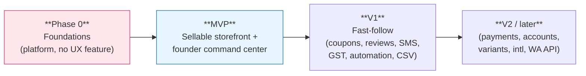
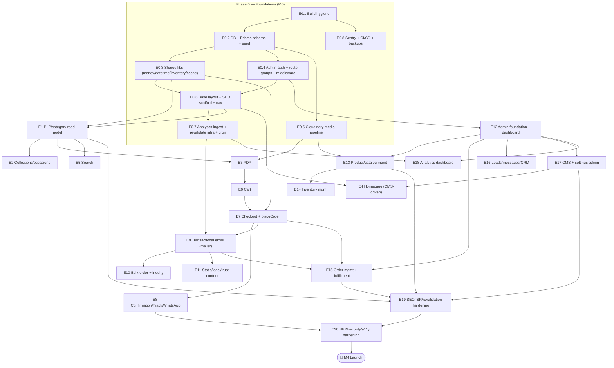

# 17 — Roadmap & Delivery Plan

> **Project:** `vaani-gift-e-commerce` · **Brand:** GooglyWoogly Art · **Founder/CEO:** Vanshika Bhatia · **Base:** Jaipur, India · **Domain:** `googlywoogly.art`
> **Owner-perspective:** Delivery lead / fractional CTO.
> **Conforms to:** [`00-canonical-decisions.md`](./00-canonical-decisions.md) (CANON). Scope phases (MVP / V1 / V2) are taken **verbatim** from CANON §3 and reconciled with every module spec's own §12 phasing table (`05`–`16`). Where this plan makes a sequencing or sizing call beyond CANON, the assumption is stated inline and surfaced under **§11 Open Questions**.
> **Not authoritative for:** feature behaviour, field shapes, or route contracts — those live in `01`–`16`. This doc is authoritative **only** for *what gets built in what order, by which milestone, and how we know it's done*.

---

## 1. Purpose & Scope

### 1.1 What this document covers

This is the **execution contract** that turns 16 specs into a shippable sequence for a **lean team** (assume **1 full-stack engineer + the founder as product owner/QA**, optionally a part-time designer). It defines:

1. A **phased delivery plan** — **Phase 0 (Foundations)**, **MVP**, **V1**, **V2** — each broken into **epics → key user stories → the spec doc(s) that own them**.
2. A **dependency-ordered build sequence** (what must precede what) with a **mermaid** dependency graph and a **gantt**.
3. **Milestone definitions with exit criteria** (the gates we do not cross until green).
4. **Rough complexity sizing (S / M / L)** per epic and a **realistic ordering** for the lean team.
5. A **pre-launch checklist** (SEO, legal, analytics, email deliverability/DKIM, performance budget, security/rate-limiting, backups, revalidation verified).
6. **Top 8 risks with mitigations.**

### 1.2 What this document does NOT cover

- Re-litigating scope — CANON §3 is final; this plan **orders** it, it does not change it.
- Feature/UX/field/route detail — see the owning specs (mapped in every epic below).
- Sprint-by-sprint ticket breakdown, story points, or calendar dates — sizing here is **relative (S/M/L)** and **dependency-ordered**, not date-bound, because a single-engineer cadence is variable. The gantt uses **relative weeks** purely to express ordering and parallelism.

### 1.3 Sizing legend & team assumption

| Size | Meaning (single full-stack engineer) |
|---|---|
| **S** | ≈ ≤ 2–3 focused days. One spec section, well-bounded. |
| **M** | ≈ ≈ 1 week. A full module or several coupled stories. |
| **L** | ≈ ≈ 2+ weeks. A cross-cutting capability or a large module with many states. |

> **Team assumption (decision):** one full-stack engineer building sequentially, founder as PO + UAT, optional part-time designer for photography/brand polish. The ordering below is optimised for **one builder** — it minimises context-switching and front-loads the unblockers. If a second engineer joins, the **parallel tracks** marked in §6.3 can run concurrently. — *Ratify in §11.*

---

## 2. The phasing model (anchored to CANON §3)

CANON §3 defines three product phases; this plan inserts **Phase 0** ahead of MVP because every MVP epic depends on the same foundations (DB, schema, auth, media, base layout/SEO, analytics ingestion). Phase 0 ships **no shopper-visible feature** on its own — it is the platform everything else stands on.

| Phase | One-line goal | Exit = milestone |
|---|---|---|
| **Phase 0 — Foundations** | A deployable Next.js 16 app on Vercel with Postgres+Prisma, Cloudinary, admin auth, base layout/SEO scaffold, analytics ingestion, and CI gates green. | **M0 — Platform Ready** |
| **MVP** | A stranger can place a (no-payment) order; the founder confirms & fulfils it entirely from her phone; the storefront is SEO-correct and fast. | **M1 — Storefront Alpha**, **M2 — Order Loop Closed**, **M3 — Admin Operable**, **M4 — Launch Ready** |
| **V1 — Fast-follow** | Conversion & ops upgrades that need MVP live + external prerequisites (DLT, GSTIN, review volume). | **M5 — Growth Pack** |
| **V2 — Later** | Structural expansions (on-site payments, accounts, variants, international, WhatsApp Business API). | **M6+ — Scale** |

---

## 3. Phase 0 — Foundations (Milestone **M0 — Platform Ready**)

> Goal: remove every cross-cutting blocker so MVP epics are pure feature work. Nothing here is shopper-visible; the bar is **"the next engineer can build any MVP feature without first building plumbing."** Grounded in `02` (architecture), `03` (schema), `16` (NFR/CI), `09` (SEO infra), `04` (route groups/middleware).

| Epic | Key stories / deliverables | Spec(s) | Size |
|---|---|---|---|
| **E0.1 — Repo & build hygiene** | Remove `typescript.ignoreBuildErrors`, `images.unoptimized`; strip the v0 blanket `"use client"`, 3D hero, RN/Expo deps; RSC-by-default; `next/font`; security headers + CSP **Report-Only**; `.env.example`; fail-fast `lib/env.ts` (Zod). | `02` §3.9, `16` §3–4 | **M** |
| **E0.2 — Database & Prisma schema** | Provision Neon (region nearest India); model **all** CANON §5 entities + enums (§6) in Prisma; pooled `DATABASE_URL` + `DIRECT_DATABASE_URL`; singleton `server-only` client; first migration; **seed** (AdminUser owner, SiteSetting singleton, sample categories/collections/products, EmailTemplates, legal CmsPages). | `03` (whole), `02` §3.2 | **L** |
| **E0.3 — Shared platform libs** | `lib/money` (paise codec + `formatINR`), `lib/datetime` (UTC→IST), `lib/inventory` (derive `inventoryState`), `lib/cache` (closed tag taxonomy helpers), `lib/validations` (Zod base), `lib/services` skeleton, uniform Server Action result contract. | `02` §3.2/§6, `03` §3, `04` §7 | **M** |
| **E0.4 — Admin auth & route groups** | Auth.js (NextAuth v5) Credentials + bcrypt against `AdminUser`; JWT session (`adminId`,`role`); `(storefront)`/`(admin)` route groups; `middleware.ts` (host/scheme canonical, lowercase+trailing-slash normalize, **admin gate**, `X-Robots-Tag`); `requireAdmin()`/`requireRole()`; `/admin/login`. | `10` §3, `02` §3.5, `04` §6.3 | **M** |
| **E0.5 — Media pipeline (Cloudinary)** | Signed server-mediated upload action; `MediaAsset`/`ProductImage` persistence; `lib/cloudinary/url` derivations (thumb/card/hero/OG); `next/image` remotePatterns + custom loader. | `02` §3.4, `11` §6, `15` | **M** |
| **E0.6 — Base layout, SEO scaffold & nav shell** | Root layout (fonts, providers), `(storefront)` chrome (header/footer/marquee/mobile nav) **data-driven from `nav`/`settings`/`banners` tags**, `metadataBase` + `defaultSeo` inheritance, `robots.ts`, `sitemap.ts` (chunked), `not-found.tsx`/`error.tsx`/`global-error.tsx`, breadcrumb component + `BreadcrumbList`. | `04` §4/§6, `09` §3–4/§8 | **L** |
| **E0.7 — Analytics ingestion & revalidation infra** | Client beacon → `POST /api/analytics/collect` (Zod, `visitorId`/`sessionId`, geo/device/utm enrich) → `AnalyticsEvent`/`AnalyticsSession`; `POST /api/revalidate` (`REVALIDATE_SECRET`); `/api/health`; Vercel Cron stubs (`rollup`, `sitemap`, `pending-orders`) guarded by `CRON_SECRET`. | `13` §3/§6, `02` §3.3/§3.8/§14, `09` §6 | **M** |
| **E0.8 — Observability & CI/CD gates** | Sentry (client/server/edge) + source maps; CI pipeline: `prisma validate` → typecheck → lint → unit/integration → build → bundle-budget → (e2e/axe/Lighthouse wired, may start as warn) → audit; Neon **daily backups** verified; preview deploys; `migrate deploy` on `DIRECT_DATABASE_URL`. | `16` §8–9, `02` §3.9/§14 | **M** |

**M0 exit criteria — Platform Ready (all must be true):**

- [ ] App deploys to a Vercel **preview** from `main`; `/api/health` returns 200.
- [ ] `prisma migrate deploy` runs clean against Neon; **seed** populates owner admin, SiteSetting, sample catalog, EmailTemplates, and the 5 legal CmsPages.
- [ ] CI is **green** on typecheck + lint + build + `prisma validate`; bundle-budget check active; image optimization on; `ignoreBuildErrors`/`unoptimized` gone.
- [ ] Founder can **log in** at `/admin/login`; unauthenticated `/admin/*` redirects to login; admin responses carry `noindex`.
- [ ] A signed Cloudinary upload persists a `MediaAsset` and renders via `next/image`.
- [ ] `robots.txt` + an (initially sparse) `sitemap.xml` generate; storefront header/footer render from `nav`/`settings`.
- [ ] One end-to-end **`revalidateTag` smoke test** passes (mutate seed row → tagged read refreshes).
- [ ] Analytics beacon writes an `AnalyticsEvent`; Sentry captures a forced test error.

---

## 4. MVP — the sellable product

> Goal (CANON §3): storefront (landing, bulk-order, PLP, category, PDP, search) · local cart · guest checkout → order placement (no payment) · confirmation + tracking · WhatsApp handoff · admin auth · product/inventory/category mgmt · order mgmt + status updates · transactional email · in-house analytics · SEO/ISR/revalidation · static + legal pages · CMS. MVP is delivered across **four milestones (M1–M4)** so value lands incrementally and the order loop is provable early.

### 4.1 MVP epic catalogue (epics → key stories → specs → size → milestone)

| Epic | Key user stories (CANON §9 / `01` §9 refs) | Spec(s) | Size | Milestone |
|---|---|---|---|---|
| **E1 — Catalog read model & PLP** | US-A2/A3: browse `/products` with filter/sort/paginate; category PLP (`/category/[slug]`, `generateStaticParams`); product cards with ₹ pricing + inventory-state badge; faceted SSR for filtered views. | `06`, `04`, `09` | **L** | M1 |
| **E2 — Collections & occasion landings** | US-A1: browse by occasion via `/collections/[slug]` (manual membership MVP); seeded `bestsellers`; occasion nav. | `06`, `15` §8, `04` | **M** | M1 |
| **E3 — Product Detail Page (PDP)** | US-B1/B2/B3/B4: gallery, rich description, materials/dimensions/care, price+compareAt, **inventory state incl. made-to-order lead time**, personalization + gift message inputs, related products, Product/Offer/Breadcrumb JSON-LD. | `07`, `09` | **L** | M1 |
| **E4 — Landing / homepage (CMS-driven)** | US-A4: story-rich `/`, featured products/collections, banners, testimonials, Instagram, newsletter — rendered from `HomepageSection`/`Banner`/`Testimonial`. | `05`, `15` | **M** | M1 |
| **E5 — Search** | US-A3: `/search` SSR `noindex`, Postgres full-text/trigram, `search` event, empty-query landing. | `06`, `02` | **M** | M1 |
| **E6 — Cart (client)** | US-C1: localStorage cart + lightweight store; mini-cart drawer + `/cart`; qty/remove; free-shipping progress; cross-tab sync; SSR-safe hydration; `add_to_cart`/`update_cart`/`remove_from_cart`. | `08`, `04` | **M** | M2 |
| **E7 — Checkout & order placement** | US-C2/C3/C4: guest checkout (contact + address incl. **pincode + Indian-state dropdown**, no payment); subtotal/shipping (flat + free-over-threshold) in paise; **`placeOrder`** (TX: snapshot `OrderItem`s, `GW-{YYYY}-{seq}` `orderNumber`, nanoid `trackingToken`, first `OrderStatusEvent`, **inventory decrement** non-MTO, `Customer` upsert); **idempotency** (`clientRequestId`); **server-side price/stock re-validation**; `begin_checkout`/`place_order`. | `08`, `12` | **L** | M2 |
| **E8 — Confirmation, tracking & WhatsApp handoff** | US-C4/C5/C6/D1: `/order/confirmed/[token]` (order no., summary, **WhatsApp deep link**, tracking link); `/track/[token]` SSR no-store `noindex` status timeline; `whatsapp_click`/`order_confirmed`. | `08`, `12`, `04` | **M** | M2 |
| **E9 — Transactional email** | US-C5: provider-agnostic mailer (Resend primary + Gmail SMTP fallback); React Email templates keyed to `EmailTemplate`; order-placed email on placement; **every send logged to `NotificationLog`**; failures never block placement; SPF/DKIM/DMARC. | `14`, `02` | **M** | M2 |
| **E10 — Bulk-order page & inquiry** | US-E1/E2: `/bulk-orders` landing + validated inquiry form → `BulkInquiry`; founder notification (email); `bulk_inquiry_submit`. | `05`, `14` | **M** | M2 |
| **E11 — Static, legal & trust content** | US-F1/F2/F3: `/about`, `/contact` (+form→`ContactMessage`), `/faq`, and **5 legal pages** (shipping, returns/refunds, privacy, terms, care-guide) from `CmsPage`; testimonials; newsletter→`NewsletterSubscriber`; persistent WhatsApp affordance; `contact_submit`/`newsletter_signup`. | `15`, `05`, `14` | **M** | M2 |
| **E12 — Admin foundation & dashboard** | US-G1/G8: `/admin` dashboard (new/pending orders, low-stock, recent leads, key **revenue-requested** metrics, funnel snapshot); admin sidebar/topbar; RBAC; `AuditLog` infra; `withAudit()`. | `10`, `13` | **M** | M3 |
| **E13 — Product & catalog management** | US-G4/G5: full CRUD on `Product` (all field groups, autosave, publish/unpublish, SEO + live SERP/OG preview, slug auto-gen + **immutable-post-publish + 301 `Redirect`**), `Category`, manual `Collection` (member picker, feature-on-home), `MediaAsset` library; duplicate/archive; **on-save revalidation of exact CANON tags**. | `11`, `15`, `04` §7 | **L** | M3 |
| **E14 — Inventory management** | US-G4: `/admin/inventory` stock view, low/out filters, **inline quick-edit**, made-to-order + lead time + low-stock threshold, reasoned adjustments → `AuditLog`, **prevent overselling**; low-stock alerts. | `11`, `12` | **M** | M3 |
| **E15 — Order management & fulfillment** | US-G2/G3: `/admin/orders[/[id]]`; **two independent axes** (`status` state-machine-enforced + `paymentStatus`); each transition → `OrderStatusEvent` + **auto-email** + **one-click prefilled WhatsApp**; courier+tracking capture on ship; cancellations (+restock), holds; admin order email/digest. | `12`, `14`, `00` §7 | **L** | M3 |
| **E16 — Leads, messages & CRM** | US-G7: `/admin/bulk-inquiries` (`InquiryStatus` pipeline), `/admin/messages` (`ContactMessage`), `/admin/customers` (derived CRM tags/notes). | `12`, `15` | **M** | M3 |
| **E17 — CMS & site settings admin** | US-G5: `/admin/content` (HomepageSection/Banner/Testimonial/FaqItem/CmsPage) + `/admin/settings` (`SiteSetting`: whatsappNumber, shipping defaults, freeShippingThreshold, gstin?, socials, SEO defaults); publish → revalidate `home`/`banners`/`page:{slug}`/`faq`/`testimonials`/`settings`/`nav`. | `15`, `04` §7 | **M** | M3 |
| **E18 — In-house analytics dashboard** | US-G6: `/admin/analytics` funnel (`page_view→…→place_order`), visitors/sessions/pageviews, top products/pages/sources, device/geo, **revenue-requested**, AOV, WhatsApp-click & bulk-inquiry rates, search terms; nightly **Cron rollup** → `DailyMetricRollup`. | `13`, `02` §14 | **M** | M3 |
| **E19 — SEO, ISR & revalidation hardening** | FR-30/31: per-route render modes finalized, full metadata/canonical/JSON-LD, sitemap completeness, on-demand revalidation wired to **every** mutation per the `04` §7 / CANON §9 matrix; 301 `Redirect` resolution. | `09`, `04`, `11`, `12`, `15` | **M** | M4 |
| **E20 — NFR, security & a11y hardening** | FR-32/34/47/49: WCAG AA contrast remediation, CWV/bundle budgets met, rate-limiting (checkout/forms/track/beacon/login), honeypot+time-trap+Turnstile (contact+bulk), DPDP consent/erasure, Zod-at-boundary audit, Playwright order-flow e2e + axe. | `16`, `09` | **L** | M4 |

### 4.2 Why this milestone split

- **M1 — Storefront Alpha** stands up the **read-only catalog + SEO** first. It is independently demoable (the founder sees her products live, indexable, fast) and de-risks the hardest SEO/ISR surface early. Browsing has **no dependency** on cart/checkout.
- **M2 — Order Loop Closed** adds cart → checkout → order → email → confirmation/tracking → WhatsApp. After M2 the **business mechanic works end-to-end** (minus admin polish) — the single most important proof point. Bulk + trust content land here too because they share the form/email/notification plumbing.
- **M3 — Admin Operable** gives the founder her command center so she can **run** what M2 created (manage catalog/inventory/orders/content/analytics). M2 deliberately precedes M3 in *customer*-value terms, but note the **build dependency** runs the other way for catalog data — see §6 (the admin *product create* path is needed to populate the storefront; in practice E13's create form and E1's read model are built against the same schema and the **seed** unblocks M1 before E13 is finished).
- **M4 — Launch Ready** is the **hardening gate**: SEO completeness, NFR/security/a11y, deliverability, performance budget, and the pre-launch checklist (§8). Nothing ships to production until M4 is green.

---

## 5. V1 and V2 roadmap

### 5.1 V1 — Fast-follow (Milestone **M5 — Growth Pack**)

> CANON §3 V1 + the union of every spec's V1 column. Each item has an **external or volume prerequisite** that is *why* it is not MVP — captured below.

| Epic | Stories / scope | Spec(s) | Size | Gating prerequisite |
|---|---|---|---|---|
| **E21 — Coupons & discounts** | `Coupon` CRUD (`/admin/coupons`), `applyCoupon` at checkout, `discountTotal` in summary + `placeOrder`. | `08`, `11` | **M** | MVP checkout live |
| **E22 — Product reviews (moderated)** | Post-order `Review`, PDP display + `AggregateRating`, `/admin/reviews` moderation, review-request email on `delivered`. | `07`, `12`, `14` | **M** | Delivered-order volume to seed reviews |
| **E23 — SMS notifications** | MSG91/Fast2SMS for placed/confirmed/shipped/delivered via reserved `sms` channel. | `14`, `12` | **M** | **TRAI DLT registration + approved templates** (legal, weeks of lead time) |
| **E24 — GST invoicing** | `taxTotal` computation (CGST/SGST/IGST), GST invoice PDF, breakup on order/invoice — **on once `SiteSetting.gstin` set**. | `08`, `12`, `15` | **M** | Founder provides **GSTIN** |
| **E25 — Collection automation** | `type=automated` rules builder, "N match" preview, materialized recompute (cron + on-demand). | `11`, `06` | **M** | Catalog breadth to make rules useful |
| **E26 — Pincode serviceability** | Serviceability check at checkout (and PDP hint). | `08` | **S** | Courier serviceability data |
| **E27 — CSV import/export** | Product CSV import (drafts-on-import, diff preview) + order/product export. | `11`, `12` | **M** | Catalog scale |
| **E28 — Advanced analytics** | Cohorts, geo, collected-revenue reconciliation, SEO invariant monitor; raw-event pruning cron. | `13`, `12` | **M** | MVP analytics baseline (4 wks traffic) |
| **E29 — Blog / Journal** | Editorial content type + routes for SEO/topical authority. | `15` | **M** | Content capacity |
| **E30 — Reliability/security V1** | Durable rate-limit/queue (Upstash/Vercel KV), email retry + SMTP failover, **CSP enforced (nonce)**, admin **TOTP 2FA**, Dependabot/Renovate, abandoned-cart capture. | `16`, `14`, `08` | **M** | MVP live; abuse/scale signal |

**M5 exit:** coupons + reviews live and converting; SMS sending post-DLT; GST invoices correct when GSTIN set; automation reducing merchandising effort; analytics deep enough to guide what-to-make. *(Each sub-item ships independently as its prerequisite clears — V1 is a rolling milestone, not a big-bang.)*

### 5.2 V2 — Later (Milestone **M6+ — Scale**)

> CANON §3 V2 / "later". Structural — each is **additive** by design (the orthogonal `status`/`paymentStatus` axes, snapshot `OrderItem`, derived `Customer`, single-listing-with-`sku` product all make these non-destructive — `03` §3.4).

| Epic | Scope | Spec anchor | Size |
|---|---|---|---|
| **E31 — On-site payments (Razorpay)** | Gateway at checkout + a real `Payment`/`Transaction` table reconciling into `paymentStatus`. | `01` §6.2, `03` §3.4 (FR-14) | **L** |
| **E32 — Customer accounts & wishlist** | `ShopperAccount` FK to derived `Customer`; saved carts/addresses/wishlist. | `03` §3.4 (FR-15) | **L** |
| **E33 — Product variants** | `ProductVariant` table attaching via `productId`; variant UI/stock. | `03` §3.4 (FR-13), `11` | **L** |
| **E34 — International / multi-currency** | Locale-prefixed routes, currency, international shipping. | `04` §1.2, `16` | **L** |
| **E35 — WhatsApp Business API** | Gupshup/Meta automated/templated messages, two-way ingest, payment links (replaces manual `wa.me`). | `14`, `12` | **L** |
| **E36 — Courier API & RMA** | Auto tracking sync; returns/RMA workflow; split shipments. | `12` | **L** |

---

## 6. Dependency-ordered build sequence

### 6.1 The hard ordering rules (what MUST precede what)

1. **Foundations before everything.** `03` schema + `02` libs + `04` route groups/middleware + `E0.*` gate **all** feature work. Nothing in MVP starts before **M0**.
2. **Schema before any read or write.** Every storefront read model (E1–E5) and every admin CRUD (E12–E18) binds to the Prisma models from **E0.2**. The **seed** is the unblocker that lets storefront epics proceed before the admin create-forms exist.
3. **Money/inventory/datetime libs (E0.3) before catalog & checkout.** Pricing display, `inventoryState`, and order math all depend on them.
4. **Cache-tag taxonomy + nav/layout (E0.6) before any tagged read.** PLP/PDP/home reads (E1/E3/E4) and all `revalidateTag` wiring (E19) reference the closed taxonomy.
5. **PDP (E3) and cart (E6) before checkout (E7).** Checkout snapshots line items the cart produced and re-validates against the PDP's product/inventory model.
6. **`placeOrder` (E7) before confirmation/tracking (E8), email (E9), and order admin (E15).** All consume the `Order`/`OrderItem`/`OrderStatusEvent`/`trackingToken` that placement creates.
7. **Notification mailer (E9) before order admin status emails (E15) and lead notifications (E10/E11).** They all call the same `lib/email/send` + `NotificationLog`.
8. **Analytics ingestion (E0.7) before the analytics dashboard (E18).** The rollup reads events the beacon writes.
9. **Catalog/order/CMS mutations (E13/E14/E15/E17) before SEO revalidation hardening (E19).** E19 verifies the *exact* tag set fires on each mutation — it needs the mutations to exist.
10. **Everything before NFR/SEO hardening gate (E19/E20 → M4).** The hardening milestone is last by definition; it is the launch gate.
11. **External-prerequisite V1 items are unordered among themselves** but each is blocked by its gate (DLT for SMS, GSTIN for GST, traffic baseline for advanced analytics).

### 6.2 Dependency graph (mermaid)

> **Note on the E17→E4 / E13→E1 back-edges:** the homepage (E4) and PLP (E1) *render* CMS/catalog data, so they are functionally complete only once the admin can author it (E17/E13). The **seed** (E0.2) supplies enough data to build, demo, and SEO-validate E1/E4 in M1; the admin authoring just replaces seed data with real content in M3. This is why M1 can precede M3 in delivery even though the data-authoring dependency points "backwards."

### 6.3 Realistic ordering for a lean team (single engineer) + parallel tracks

**Strict single-engineer sequence (recommended):**

`E0.1 → E0.2 → E0.3 → E0.4 → E0.5 → E0.6 → E0.7 → E0.8`  *(M0)*
`→ E1 → E3 → E2 → E5 → E4`  *(M1)*
`→ E6 → E7 → E8 → E9 → E10 → E11`  *(M2)*
`→ E12 → E13 → E14 → E15 → E16 → E17 → E18`  *(M3)*
`→ E19 → E20`  *(M4 → launch)*

**If a 2nd engineer joins — safe parallel tracks (no shared write surface):**

| Track A (core commerce) | Track B (content/admin/infra) | Synchronisation point |
|---|---|---|
| E1 → E3 → E6 → E7 → E8 | E0.7 → E0.8, then E4/E5, then E9 | E9 must land before E7's confirmation email path is "done" |
| E14 → E15 (order/inventory) | E11 + E16 + E17 (content/leads/CMS) | E15 needs E9 (mailer) from Track? — keep E9 on the critical path |
| E19 (revalidation) | E20 (a11y/security/perf) | Both converge at M4 gate |

> **Guidance:** with one engineer, **do not** interleave M2 and M3 randomly — finish the **order loop (M2)** before opening admin breadth (M3). The loop is the riskiest integration and the most valuable demo; admin work is broad-but-shallow and benefits from a stable order model underneath.

### 6.4 Delivery gantt (relative weeks — ordering & parallelism only, not dates)

```mermaid
gantt
  title GooglyWoogly Art — relative delivery ordering (single engineer)
  dateFormat  X
  axisFormat  W%d

  section Phase 0 (M0)
  E0.1 Build hygiene            :a1, 0, 1
  E0.2 DB + schema + seed       :a2, after a1, 2
  E0.3 Shared libs              :a3, after a2, 1
  E0.4 Auth + route groups      :a4, after a2, 1
  E0.5 Cloudinary pipeline      :a5, after a2, 1
  E0.6 Layout + SEO scaffold    :a6, after a3, 2
  E0.7 Analytics + revalidate   :a7, after a6, 1
  E0.8 Sentry + CI + backups    :a8, after a1, 1
  M0 Platform Ready             :milestone, m0, after a7, 0

  section MVP — M1 Storefront Alpha
  E1 PLP/category               :b1, after m0, 2
  E3 PDP                        :b3, after b1, 2
  E2 Collections                :b2, after b3, 1
  E5 Search                     :b5, after b2, 1
  E4 Homepage                   :b4, after b5, 1
  M1 Storefront Alpha           :milestone, m1, after b4, 0

  section MVP — M2 Order Loop
  E6 Cart                       :c6, after m1, 1
  E7 Checkout + placeOrder      :c7, after c6, 2
  E8 Confirm/Track/WhatsApp     :c8, after c7, 1
  E9 Transactional email        :c9, after c8, 1
  E10 Bulk inquiry              :c10, after c9, 1
  E11 Static/legal/trust        :c11, after c10, 1
  M2 Order Loop Closed          :milestone, m2, after c11, 0

  section MVP — M3 Admin Operable
  E12 Admin + dashboard         :d12, after m2, 1
  E13 Product/catalog mgmt      :d13, after d12, 2
  E14 Inventory mgmt            :d14, after d13, 1
  E15 Order mgmt                :d15, after d14, 2
  E16 Leads/CRM                 :d16, after d15, 1
  E17 CMS + settings            :d17, after d16, 1
  E18 Analytics dashboard       :d18, after d17, 1
  M3 Admin Operable             :milestone, m3, after d18, 0

  section MVP — M4 Launch Ready
  E19 SEO/ISR hardening         :e19, after m3, 1
  E20 NFR/security/a11y         :e20, after e19, 2
  M4 Launch                     :milestone, m4, after e20, 0
```

> The gantt is a **topological schedule**, not a commitment of calendar dates. Read it as "this before that, these can overlap." A realistic single-engineer MVP envelope is **~14–18 focused weeks** to M4; the founder ratifies the calendar.

---

## 7. Milestones & exit criteria

> A milestone is a **gate**: we do not start the next until its exit criteria are demonstrably met (demo + the listed checks). M0 and M4 are the two hardest gates.

| Milestone | Phase | Definition (what's true at the gate) | Exit criteria (must all pass) |
|---|---|---|---|
| **M0 — Platform Ready** | Phase 0 | The platform is deployable and buildable; auth, DB, media, analytics, SEO scaffold, CI all live; no shopper feature yet. | See §3 M0 checklist (8 items). |
| **M1 — Storefront Alpha** | MVP | A visitor can browse a fast, SEO-correct, server-rendered catalog (home, PLP, category, collection, PDP, search) from seed data. | Landing + `/products` + a `/category/[slug]` + a `/collections/[slug]` + PDP + `/search` all render server-side with ₹/`en-IN` pricing and correct inventory-state badges *(AC-1, AC-2)*; PDP shows made-to-order lead time + disabled-CTA-on-OOS; JSON-LD + canonical + sitemap entries present for indexable pages; CWV "good" on PDP mobile (preliminary). |
| **M2 — Order Loop Closed** | MVP | The end-to-end business mechanic works: add-to-cart → guest checkout → order placed (no payment) → email + confirmation + tracking → WhatsApp handoff; bulk + trust content live. | Cart persists across reload without login *(AC-4)*; price/stock re-validation notifies on change *(AC-5)*; checkout collects contact+address (pincode+state), computes subtotal/shipping (free-over-threshold) *(AC-6)*; `placeOrder` creates `Order` `pending_confirmation`+`unpaid` with `GW-{YYYY}-{seq}` + nanoid token, snapshots items, **decrements non-MTO inventory**, upserts `Customer`, writes first `OrderStatusEvent`, **idempotent on retry** *(AC-7)*; confirmation + WhatsApp + tracking link shown and **order-placed email sent & logged** *(AC-8)*; `/track/[token]` timeline renders, unguessable, `noindex` *(AC-9)*; bulk inquiry persists + notifies *(AC-10)*; legal/FAQ/testimonials live + contact/newsletter persist *(AC-11)*; persistent WhatsApp affordance present *(AC-12)*. **Playwright guest-order-flow e2e green.** |
| **M3 — Admin Operable** | MVP | The founder runs the whole business from `/admin` on a phone: dashboard, catalog/inventory CRUD, order fulfillment with status+payment+WhatsApp+email, leads/CRM, CMS/settings, analytics. | Secure login; no unauthenticated `/admin/*` *(AC-17)*; dashboard shows pending/low-stock/leads/revenue-requested *(AC-18)*; CRUD products/categories/collections + Cloudinary upload + SEO + publish, **no variant UI** *(AC-19)*; inventory incl. MTO + threshold, **overselling prevented** *(AC-20)*; order detail advances `status` per state machine + sets `paymentStatus` independently + one-click prefilled WhatsApp + auto-email + courier/tracking on ship, each logged as `OrderStatusEvent` *(AC-21)*; bulk inquiries/messages/customers manageable *(AC-22)*; CMS/banners/testimonials/FAQ/pages/settings editable **and live** *(AC-23)*; **editing a product/category/collection/content revalidates the right cache tags, live without redeploy** *(AC-14)*; analytics funnel + revenue-requested populated from nightly rollup. **`AuditLog` written on every admin mutation.** |
| **M4 — Launch Ready** | MVP | Hardening complete; the pre-launch checklist (§8) is 100% green; production go/no-go. | Indexable pages emit correct metadata/canonical/JSON-LD + sitemap; admin/cart/checkout/track `noindex` *(AC-13)*; key templates pass **CWV "good"** mobile + **WCAG AA** contrast *(AC-15)*; forms Zod-validated + DPDP consent *(AC-16)*; **§8 pre-launch checklist fully checked**; CI fully green incl. e2e/axe/Lighthouse; SPF/DKIM/DMARC pass; backups verified; rate-limiting + bot protection active. |
| **M5 — Growth Pack** | V1 | Coupons, reviews, SMS (post-DLT), GST (post-GSTIN), automation, CSV, advanced analytics, V1 reliability — each shipped as its prerequisite clears. | Per-epic acceptance in `06`–`16` V1 columns; rolling — no single big-bang gate. |
| **M6+ — Scale** | V2 | Payments, accounts, variants, international, WA Business API, courier/RMA. | Per-epic; each additive and non-destructive to MVP data model. |

---

## 8. Pre-launch checklist (the M4 gate)

> **Launch blocker.** Production go/no-go requires **every** box checked, verified by the founder + engineer together. Grouped by domain; each maps to the owning spec.

### 8.1 SEO & indexing (`09`, `04`)
- [ ] `robots.txt` correct: allows storefront; disallows `/admin`, `/api`, `/cart`, `/checkout`, `/order`, `/track`, `/search`, `*?*utm`; absolute `sitemap` URL.
- [ ] `sitemap.xml` lists **only** indexable canonical URLs (home, `/products`, all active categories/collections/products, content + legal, `/bulk-orders`); chunked if >5k; `lastModified` from `updatedAt`.
- [ ] Every indexable page emits self-canonical (clean, lowercase, no-trailing-slash, no-tracking-param) + correct `index/noindex`.
- [ ] JSON-LD validates: `Organization`+`WebSite`(+`SearchAction`) on home; `Product`+`Offer`+`Breadcrumb` on PDP; `CollectionPage`+`Breadcrumb` on category/collection; `FAQPage` on `/faq`; `BreadcrumbList` everywhere.
- [ ] Filtered PLPs canonicalize to base + `noindex,follow`; archived PDP **301s to category** (never 404s a previously-indexed URL).
- [ ] **Google Search Console + Bing Webmaster** verified; sitemap submitted; domain property confirmed.
- [ ] 301 `Redirect` flow verified (change a published slug → old path 301s to new; chains collapsed); legacy static-redirect seed map live.

### 8.2 Legal & compliance (`15`, `16`)
- [ ] All **5 legal pages live & linked in footer**: Privacy Policy (DPDP), Terms, Shipping & Delivery, Cancellation & Refund, Care Guide; plus About/Contact/FAQ.
- [ ] DPDP: forms show consent/notice; PII minimized; retention policy documented; **erasure/anonymization action** exists; grievance officer + business address on Privacy page.
- [ ] Cookie/privacy notice for first-party analytics present (transparency posture; no ad trackers).
- [ ] GSTIN shown in footer **only if** `SiteSetting.gstin` set; GST invoicing remains **off** until then.

### 8.3 Analytics firing (`13`, `02`)
- [ ] Every CANON §6 `AnalyticsEventType` fires from its surface (verified: `page_view`, `product_view`, `add_to_cart`, `begin_checkout`, `place_order`, `order_confirmed`, `whatsapp_click`, `bulk_inquiry_submit`, `contact_submit`, `newsletter_signup`, `search`, …).
- [ ] `visitorId`/`sessionId` attribution + device/geo/utm enrichment working; no PII in events.
- [ ] Nightly **Cron rollup** populates `DailyMetricRollup`; `/admin/analytics` reads pre-aggregated rows; funnel + **revenue-requested** (labelled "requested") render.
- [ ] Vercel Analytics enabled for **CWV only**.

### 8.4 Email deliverability / DKIM (`14`, `02`)
- [ ] **SPF, DKIM, DMARC** records published on `googlywoogly.art` and **passing** (verified via a test send to Gmail/Outlook → "signed-by" + DMARC pass).
- [ ] From/reply-to set to a real monitored address; plaintext part included; not landing in spam.
- [ ] Order-placed + each status email renders correctly; **every send logs `NotificationLog`**; failures don't block placement; Gmail SMTP fallback tested.
- [ ] Admin instant `order_received_admin` + daily `pending_orders_digest_admin` cron firing.

### 8.5 Performance budget (`16`, `09`)
- [ ] **CWV "good"** on mobile (LCP/INP/CLS/TTFB) on home, PLP, PDP — Lighthouse CI gate passing.
- [ ] First-load JS within per-route bundle budget; **3D hero/RN/Expo removed**; RSC-by-default (no route-level `"use client"`); `next/font`.
- [ ] Image optimization on; Cloudinary `f_auto,q_auto` + responsive `srcset`; LCP image `priority` with explicit dimensions (CLS-safe).

### 8.6 Security & rate-limiting (`16`, `02`)
- [ ] Rate limiting active on checkout, bulk-inquiry, contact, newsletter, `/track`, analytics beacon, `/admin/login` (in-memory/edge MVP).
- [ ] **Honeypot + time-trap + Cloudflare Turnstile** on contact + bulk-inquiry.
- [ ] Security headers (HSTS, `X-Content-Type-Options`, `Referrer-Policy`, frame-ancestors) + **CSP Report-Only** live.
- [ ] Admin: bcrypt(12) hashes, JWT sessions, login throttle, `requireAdmin()`/RBAC re-check in **every** admin action (not middleware-only); `staff` cannot reach owner-only routes (server-enforced).
- [ ] Secrets only in Vercel env; nothing secret carries `NEXT_PUBLIC_`; Cloudinary signed uploads keep secret server-side; `REVALIDATE_SECRET` + `CRON_SECRET` set; rich text sanitized; **never trust client prices** (recompute in `placeOrder`).
- [ ] `pnpm audit` clean (no high/critical); Sentry capturing client/server/edge with PII scrubbed.

### 8.7 Reliability, backups & revalidation (`16`, `02`, `09`)
- [ ] Neon **daily automated backups** confirmed; documented **RPO/RTO**; restore drill done at least once.
- [ ] Order placement is **transactional + idempotent** (`clientRequestId`); partial-failure (email down) does not corrupt the order.
- [ ] **On-demand revalidation verified end-to-end**: editing a product/category/collection/CMS page in admin reflects on the storefront on the **next request without redeploy** (the exact `04` §7 / CANON §9 tag set fires — spot-check `product:{slug}`, `products`, `category:{slug}`, `home`, `page:{slug}`, `nav`).
- [ ] Cron jobs (`rollup`, `sitemap`, `pending-orders`) scheduled + `CRON_SECRET`-guarded + executing within free-tier limits.
- [ ] `not-found.tsx` returns true 404; `error.tsx`/`global-error.tsx` boundaries present; `/api/health` monitored by an uptime check.

### 8.8 Founder go-live readiness (operational)
- [ ] Real catalog loaded (products, photography, prices, inventory, made-to-order lead times) — seed data replaced.
- [ ] `SiteSetting` finalized: `whatsappNumber`, shipping flat-rate + `freeShippingThreshold`, socials, SEO defaults, logo, announcement bar, business address.
- [ ] Founder trained on the order loop: confirm/decline → prefilled WhatsApp → collect payment → advance status (auto-emails) → ship with courier+tracking.
- [ ] WhatsApp deep links open the correct number with correct prefilled text on her phone.
- [ ] Custom domain `googlywoogly.art` connected on Vercel (apex canonical), HTTPS, host/scheme redirects verified.

---

## 9. Risks & mitigations (top 8)

> Ranked by expected impact on launch and on the business mechanic. Each has an owner-actionable mitigation and the spec that addresses it.

| # | Risk | Likelihood × Impact | Mitigation | Spec |
|---|---|---|---|---|
| **R1** | **WhatsApp-close gap** — orders are placed (intent) but the founder doesn't convert them to paid `confirmed` fast enough; trust/cash leak. The whole model hinges on the off-site close. | Med × **High** | Instant `order_received_admin` email + **daily pending-orders digest cron**; one-click **prefilled WhatsApp** + auto status emails to minimise founder effort; dashboard "pending > 48h" alert; KPI **WhatsApp-close rate** tracked from day 1; target first response < 6h. | `12`, `14`, `13` |
| **R2** | **Overselling a one-of-a-kind item** — handmade stock is often qty=1; a race or stale cache sells it twice → broken promise. | Med × **High** | **Transactional inventory decrement** in `placeOrder` (DB-level), **not** cache-trusted; server-side **re-validate stock at checkout**; `inventoryState` derived live; low-stock + OOS alerts; "made-to-order" path for always-orderable items; e2e test for the race. | `08`, `11`, `16` |
| **R3** | **Email deliverability failure** — confirmation/status emails land in spam or bounce; the *only* automated customer touchpoint (no SMS in MVP) breaks, eroding trust. | Med × **High** | **SPF/DKIM/DMARC** verified pre-launch (§8.4); Resend primary + **Gmail SMTP fallback**; monitored from/reply-to; `NotificationLog` for every send; deliverability spot-checks to Gmail/Outlook; SMS as a V1 backstop after DLT. | `14`, `02` |
| **R4** | **CWV / SEO regression** — the v0 prototype's all-client homepage + 3D hero + heavy deps tank LCP/INP, killing organic discovery (the primary, free acquisition channel). | **High** × **High** | RSC-by-default migration + **remove 3D/RN/Expo** in Phase 0; image optimization + Cloudinary; **Lighthouse-CI + bundle-budget gates** block merges; CWV is an M1 preliminary check and an M4 hard gate. | `16`, `09`, `02` |
| **R5** | **Revalidation/caching correctness** — a mutation misses a `revalidateTag` and the storefront shows stale price/stock/content; founder edits "don't take." | Med × **High** | **Closed cache-tag taxonomy** (no ad-hoc tags) + the single `04` §7 matrix every mutation must call; DoD requires "edit → live on next request" verification; M3 AC-14 + §8.7 end-to-end check; integration test asserts the exact tag set per mutation. | `04`, `09`, `11`, `12`, `15` |
| **R6** | **Single-engineer / single-founder bus factor & scope creep** — one builder, one operator; illness, drift toward V1 features, or admin gold-plating delays the order loop. | **High** × Med | **Order loop (M2) before admin breadth (M3)**; CANON §3 scope is frozen, V1/V2 explicitly deferred; milestone gates prevent half-finished epics; lean S/M/L sizing surfaces over-runs early; this doc's ordering minimises context-switching. | `00` §3, this doc |
| **R7** | **Spam / abuse on public forms** — checkout, bulk-inquiry, contact, newsletter are unauthenticated (guest-only); bots create junk orders/leads, pollute analytics, burn email quota. | **High** × Med | **Rate-limiting + honeypot + time-trap + Turnstile** (contact+bulk) in MVP; Zod-at-boundary; origin check on analytics collector; idempotency keys; durable rate-limit (Upstash/KV) in V1 if abuse scales. | `16`, `02`, `08` |
| **R8** | **DPDP / data-protection non-compliance** — Indian DPDP Act mandates consent, minimal PII, retention, grievance officer; gaps create legal exposure and block a future payment gateway. | Low × **High** | Minimal-PII posture (orders only); consent/notice on forms; legal pages + Privacy (grievance officer + business address) **live at launch**; retention + **erasure/anonymization action**; PII out of logs/Sentry/analytics; founder ratifies retention windows. | `16` §7, `15` |

> **Honourable mentions (watch-list, not top-8):** free-tier limits (Neon auto-suspend cold starts, Vercel function caps) — mitigated by the cheap-by-construction architecture (`02` §16) and Cron staying light; **DLT lead time** delaying V1 SMS — start registration early; **photography quality** gating conversion — part-time designer + founder shoot before launch.

---

## 10. Cross-spec traceability (epic → spec → CANON)

> Quick index so any epic can be traced to its owning spec(s) and the CANON clause it serves. (Full FR/AC traceability lives in `01` §10/§12 and each module spec.)

| Epic group | Owning specs | CANON anchor |
|---|---|---|
| Foundations (E0.*) | `02`, `03`, `04`, `16`, `09` | §4 stack, §5 entities, §8 routes, §9 caching |
| Storefront browse (E1–E5) | `06`, `07`, `05`, `09`, `04` | §8 routes, §2.1 SEO-first, §6 enums |
| Order loop (E6–E9) | `08`, `12`, `14`, `04` | §7 lifecycle, §1 sales model, §10 conventions |
| Bulk & content (E10–E11) | `05`, `15`, `14` | §3 scope, §11 legal/India |
| Admin (E12–E18) | `10`, `11`, `12`, `13`, `15` | §2.4 command center, §8 admin routes |
| Hardening (E19–E20) | `09`, `16`, `04` | §2 principles, §9 caching, §11 compliance |
| V1 (E21–E30) | `06`–`16` V1 columns | §3 V1 scope |
| V2 (E31–E36) | `03` §3.4, `12`, `14`, `16` | §3 V2 scope, §2.5 architected-to-grow |

---

## 11. Dependencies, assumptions & open questions

### 11.1 Dependencies
- **CANON `00`** — scope phases (§3), entities/enums/routes/tags. This plan *orders* CANON; it cannot change it.
- **All module specs `01`–`16`** — each epic's behaviour, ACs, and §12 phasing tables. This roadmap is the union/ordering of those.
- **External prerequisites** that gate V1 (not blockers for MVP): **TRAI DLT registration** (SMS), **founder's GSTIN** (GST invoicing), **4 weeks live traffic** (analytics baselines/target reset), courier serviceability data (pincode).
- **Founder-supplied assets** before launch: real product catalog + photography, finalized `SiteSetting`, WhatsApp number, custom domain DNS access.

### 11.2 Assumptions (decisive calls made here)
- **Team = 1 full-stack engineer + founder (PO/UAT)**, optional part-time designer (§1.3). Ordering optimises for one builder.
- **Phase 0 is inserted ahead of CANON's MVP** as an explicit milestone (M0) because all MVP epics share its foundations; it ships no shopper feature alone.
- **MVP is split into four milestones (M1–M4)** with the **order loop (M2) prioritised before admin breadth (M3)** in delivery, even though catalog-data authoring depends on admin — the **seed** bridges that, letting M1 proceed.
- **Sizing is relative (S/M/L)**, not date-bound; the gantt expresses **topological ordering**, not a calendar commitment. A realistic single-engineer MVP envelope is **~14–18 focused weeks** — founder ratifies.
- **V1 is a rolling milestone (M5)**: each item ships as its external/volume prerequisite clears, not as a big-bang release.
- **No scope is added beyond CANON §3** — V1/V2 epics here are exactly CANON's deferred items plus each spec's own V1/V2 phasing, re-listed for sequencing only.

### 11.3 Open questions (genuine decisions / conflicts vs CANON)
1. **OQ-1 — Team shape & cadence.** This plan assumes one engineer + founder. If two engineers (or an agency) deliver, confirm so the §6.3 parallel tracks and the calendar envelope can be re-cut. *(Affects ordering, not scope.)*
2. **OQ-2 — Milestone calendar.** Sizing is relative; the founder must ratify an actual target launch date (and whether the ~14–18-week single-engineer envelope is acceptable or needs a second builder to compress).
3. **OQ-3 — Admin TOTP 2FA timing (inherited from `16` OQ-6).** `16` defers `owner` 2FA to V1; given admin controls the **entire** business and is the only auth surface, this plan flags it as a **candidate to pull into MVP (M4)**. Founder to confirm MVP-vs-V1.
4. **OQ-4 — DLT registration start.** SMS (E23) is V1 but DLT has multi-week legal lead time. Recommend the founder **begins DLT registration during MVP build** so V1 SMS isn't blocked at M5. Confirm.
5. **OQ-5 — Soft-launch vs hard-launch.** Recommend a **soft launch** (M4 met, limited traffic / Instagram-only, `noindex` lifted gradually) to validate the WhatsApp-close loop and deliverability under real orders before driving organic/paid traffic. Confirm launch style.
6. **OQ-6 — Reviews bootstrap (E22, V1).** Product reviews need delivered-order volume to seed; until then PDP social proof relies on **testimonials** (MVP). Confirm this is acceptable for launch trust, or whether to seed initial testimonials more aggressively.
7. **OQ-7 — "Definition of launch."** Is launch = **M4 green + real catalog loaded** (recommended), or does the founder require any V1 item (e.g. coupons for a launch promo, GST for B2B) **before** going live? If a V1 item is launch-critical, it must be re-sequenced into the MVP gate. Confirm.

---

*End of `17-roadmap-and-delivery-plan.md`.*
